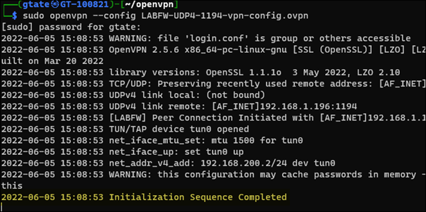
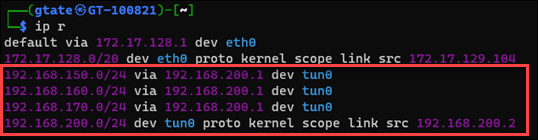
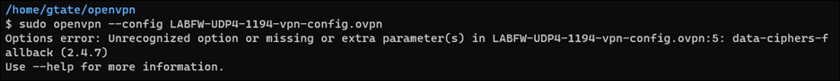

This is my notes collection on using the OpenVPN client.

**General Usage**  
Run the command `sudo openvpn --config <config file>` to establish a VPN connection. The command is successful when you receive the message **Initialization Sequence Completed**.

Run `ip route` to confirm that routes are present.

If you receive an error indicating unrecognized option or missing or extra parameter(s) then you may need to install a later version.

Refer to [OpenVPN Software Repos](https://community.openvpn.net/openvpn/wiki/OpenvpnSoftwareRepos#DebianUbuntu:UsingOpenVPNaptrepositories) for guidance on installing the latest version.

<table>
  <tr><th>Details</th><th>Screenshot</th></tr>
  <tr>
    <td>Run `ip route` to confirm routes are present</td>
    <td></td>  
</table>
