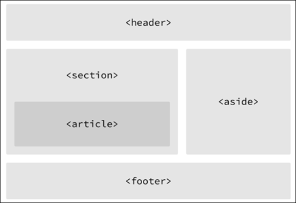
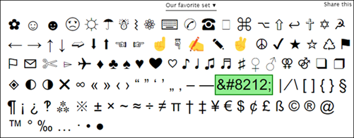
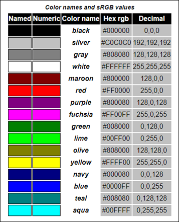
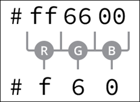

# Contents
- [Contents](#contents)
- [Overview of HTML and CSS](#overview-of-html-and-css)
  - [Common HTML Terms](#common-html-terms)
  - [Common CSS Terms](#common-css-terms)
  - [Working with Selectors](#working-with-selectors)
    - [Type Selectors](#type-selectors)
    - [Class Selectors](#class-selectors)
    - [ID Selectors](#id-selectors)
    - [Additional Selectors](#additional-selectors)
  - [Referencing CSS](#referencing-css)
  - [CSS Resets](#css-resets)
- [More on HTML](#more-on-html)
  - [Semantics Overview](#semantics-overview)
  - [Divisions and Spans](#divisions-and-spans)
  - [Text-Based Elements](#text-based-elements)
    - [Headings](#headings)
    - [Paragraphs](#paragraphs)
    - [Bold Text with Strong](#bold-text-with-strong)
    - [Italicize Text with Emphasis](#italicize-text-with-emphasis)
  - [Building Structure](#building-structure)
    - [Header](#header)
    - [Navigation](#navigation)
    - [Article](#article)
    - [Section](#section)
    - [Deciding Between \<article\>, \<section\>, and \<div\> Elements](#deciding-between-article-section-and-div-elements)
    - [Aside](#aside)
    - [Footer](#footer)
    - [Encoding Special Characters](#encoding-special-characters)
    - [Creating Hyperlinks](#creating-hyperlinks)
      - [Linking to an Email Address](#linking-to-an-email-address)
      - [Opening Links in New Window](#opening-links-in-new-window)
      - [Linking to Same Parts in a Page](#linking-to-same-parts-in-a-page)
- [More on CSS](#more-on-css)
  - [The Cascade](#the-cascade)
    - [Cascading Properties](#cascading-properties)
  - [Calculating Specificity](#calculating-specificity)
  - [Combining Selectors](#combining-selectors)
    - [Specificity Within Combined Selectors](#specificity-within-combined-selectors)
  - [Layering Styles with Multiple Classes](#layering-styles-with-multiple-classes)
  - [Common CSS Property Values](#common-css-property-values)
    - [Colors](#colors)
      - [Keyword Colors](#keyword-colors)
      - [Hexadecimal Colors](#hexadecimal-colors)
      - [RGB & RGBa Colors](#rgb--rgba-colors)
      - [HSL & HSLa Colors](#hsl--hsla-colors)
    - [Lengths](#lengths)
      - [Absolute Lengths](#absolute-lengths)
        - [Pixels](#pixels)


# Overview of HTML and CSS
Most of these notes were taken from the following resources:
- [ShayHowe.com](https://learn.shayhowe.com/html-css/)

## Common HTML Terms
- Elements - designators that define the structure and content of objects within a page
  - Examples: `<h1>` through `<h6>`, `<p>`, `<a>`, `<div>`, `<span>`, etc.
  - Some elements are self-closing, e.g. `<br`>, ``
- Tags - the use of angle brackets surrounding an element
	- Occur in opening and closing tags
	- The content of an element falls in between the opening and closing tags
- Attributes - properties used to provide additional info about an element
	- Defined within the opening tag after an element's name
	- Attributes include a name and a value with an equals sign in between
	- Examples:  id, href, class
- Document structure
	- All HTML documents are required to have the following declaration and elements:  `<!DOCTYPE html>`, `<html>`, `<head>`, `<body>`

## Common CSS Terms
- Selectors
  - Style HTML elements
  - Generally target an attribute value, e.g. `id` or `class`, or the type of an element, such as `<h1>` or `<p>`
  - Are followed w/ curly brackets, which encompasses the styles to be applied:
    ```css
    p { ... }
    ```
- Properties
  - Determines the styles that will be applied to that element
  - Property names fall after a selector, within curly brackets and immediately preceding a colon
  - Property examples: `background`, `color`, `font-size`, `height`
    ```css
    p {
      color: ...;
      font-size: ...;
    }
- Values
  - Determines the behavior of the property
  - Identified as the text between the colon and semicolon
    ```css
    p {
      color: orange;
      font-size: 16px;
    }
    ```

## Working with Selectors
- Selectors indicate which HTML elements are being styled
- There are several types of selectors:  Type Selectors, Class Selectors, ID Selectors, and more

### Type Selectors
- Target elements by their element type
- Example: type selector for `<div>` element:  
    **CSS**
    ```css
    div { ... }
    ```
    **HTML**
    ```html
    <div>...</div>
    <div>...</div>
    ```

### Class Selectors
- Allow for selecting an element based on the element's `class` attribute value
- More specific than type selectors as they target a particular group of elements rather than all elements of one type
- Allow for applying the same styles to different elements at once by using the same `class` value across multiple elements
- Within CSS, classes are denoted by a leading period, `.`, followed by the `class` attribute value
- Example: class selector that selects any element containing the `class` attribute value of `awesome`:  
  **CSS**
  ```css
  .awesome { ... }
  ```
  **HTML**
  ```html
  <div class="awesome">...</div>
  <p class="awesome>...</p>
  ```

### ID Selectors
- More precise than class selectors, as they target only one unique element at a time
- ID selectors use an element's `id` value as a selector
- `id` attribute values can only be used once per page. If used they should be reserved for significant elements
- ID selectors are denoted by a leading hash sign, `#`, followed by the `id` attribute value
- Example:  the ID selector will only select the element containing the `id` attribute value of `special`:  
  **CSS**
  ```css
  #special { ... }
  ```
  **HTML**
  ```html
  <div id="special">...</div>
  ```
### Additional Selectors
- The selectors above are the most common, but there are many more selectors
- See [Complex Selectors](https://learn.shayhowe.com/advanced-html-css/complex-selectors/)

## Referencing CSS
- Best practice for referencing style sheets is to include all styles in an external style sheet, which is referenced from within the `<head>` element.
- There are other options for referencing CSS using internal and inline styles, but they are generally frowned upon, as they make updating websites cumbersome
- Use the following code to reference a CSS stylesheet:
  ```html
  <head>
    <link rel="stylesheet" href="main.css">
  </head>
  ```
- In the code above, `rel` and `href` are attributes to the `link` element
- `href` stands for "hyperlink reference"
- The `rel` attribute defines the relationship between a linked resource and the current document. In this case `rel` imports a stylesheet. See [here](https://developer.mozilla.org/en-US/docs/Web/HTML/Attributes/rel) for more info.
- The path referenced by `href` must correlate to where the CSS file is saved

## CSS Resets
- Every web browser has its own default styles for different elements, and it's important to recognize the value of cross-browser compatibility and testing
- CSS resets are used to ensure cross-browser compatibility
- CSS resets take every common HTML element with a predefined style and provide one unified style for all browsers
- CSS resets generally remove all sizing, margins, padding, or additional styles
- CSS resets need to be at the very top of the style sheet.  Doings so ensures those styles are read first and all of the different web browsers are working from the same baseline
- CSS reset examples
  - [Eric Meyer's reset](https://meyerweb.com/eric/tools/css/reset/)
    - adapted to include styles for the new HTML5 elements
    - just copy the code and append it to the top of the stylesheet file
  - [Normalize CSS](https://necolas.github.io/normalize.css/)
    - Focuses on setting common styles for common elements; requires a stronger understanding of CSS

# More on HTML
- It's important to understand which HTML elements are best used to display different types of content and how elements are visually displayed on a web page

## Semantics Overview
- Semantics is the practice of giving content meaning and structure by using the proper element.  See [Semantics within HTML](https://boagworld.com/dev/semantic-code-what-why-how/)
- Semantics describes the *value* of the content on the page, regardless of the style or appearance
- Benefits of using semantics
  - Enables computers, screen readers, search engines to adequately read and understand content on a web page
  - Semantic HTML is easier to manage and work with, as it shows clearly what each piece of content is about
- Two elements, `<div>` and `<span>` don't actually hold any semantic value; they exist for styling purposes only

## Divisions and Spans
- Divisions, `<div>`s, and `<span>`s are HTML elements that act as containers solely for styling purposes.  They do not have any semantic value.
- `<div>`s and `<span>`s are valuable in that they give the ability to apply targeted styles to a contained set of content
- A `<div>` is a block-level element that is commonly used to identify large groupings of content, and which helps to build a web page's layout and design
- A `<span>` is an inline-level element used to identify smaller groupings of text within a block-level element
- You'll commonly see `<div>`s and `<span>`s  with `class` or `id` attributes for styling purposes
- Choosing a `class` or `id` attribute value requires care; you want to choose a value that refers to the content of an element, not necessarily the appearance of an element

## Text-Based Elements
Here's a quick summary of the more popular text-based elements.

### Headings
- Block-level elements that come in six rankings, `<h1>` through `<h6>`
- Help to break up content and establish hierarchy
- Help search engines to index and determine content on a page
- Should be used for semantic value.  Should not be used just to make text big or bold.

### Paragraphs
- Headings are often followed by paragraphs
- Paragraphs are defined using the <p> block-level element
- Paragraphs can appear one after the other, adding information to the page as desired

### Bold Text with Strong
- Use the `<strong>` inline-level element to make text bold and place a strong emphasis
- There are two elements that bold text:  `<strong>` and `<b>`.  It is important to understand the semantic difference between the two.
  - The `<strong>` element is semantically used to give *strong* importance to text, and is the most popular option for bolding text
  - The `<b>` element, on the other hand, semantically means to *stylistically offset* text, which isn't always the best choice for text deserving prominent attention
- Example:
  ```html
  <!-- Strong importance -->
  <p><strong>Caution:</strong> Falling rocks.</p>

  <!-- Stylistically offset -->
  <p>This recipe calls for <b>bacon</b> and <b>baconnaise</b>.</p>
  ```

### Italicize Text with Emphasis
- Use the `<em>` inline-level element to italicize text with emphasis
- The `<em>` element is used semantically to place a *stressed* emphasis on text, and is the most popular option for italicizing text
- The `<i>` element is used semantically to convey text in an *alternative voice or tone*, as if it were placed in quotation marks
- Example:
  ```html
  <!-- Stressed emphasis -->
  <p>I <em>love</em> Chicago!</p>

  <!-- Alternative voice or tone -->
  <p>The name <i>Shay</i> means a gift.</p>
  ```

## Building Structure
- For a long time, divisions were used to structure a web page
- The problem w/ divisions is that divisions provide no semantic value, and it was fairly difficult to determine the intention of divisions
- HTML5 introduced new [structurally based elements](https://dev.opera.com/articles/new-structural-elements-in-html5/), including `<header>`, `<nav>`, `<article>`, `<section>`, `<aside>`, and `<footer>`, elements. 
- Here's an example in how the structure of these elements gives meaning to the organization of pages: 
  

### Header
- The `<header>` element is used to identify the top of the page, article, section, or other segment of a page
- The `<header>` element may include a heading, introductory text, and even navigation
  ```html
  <header>...</header>
  ```
- It's easy to confuse `<header>` with `<head>` and `<h1>` through `<h6>` elements
  - `<header>` is a structural element that outlines the heading of a segment of a page. It falls within the `<body>` element
  - `<head>` is not displayed on the page and is used to outline metadata, including the document title and links to external files. It falls within the `<html>` element
  - `<h1>` through `<h6>` are used to designate multiple levels of text headings throughout a page

### Navigation
- `<nav>` identifies a section of major navigational links on a page
- `<nav>` should be reserved for primary navigation sections only, such as a global navigation table, a table of contents, and previous/next links
- Links included w/ the `<nav>` element will link to other pages
- Miscellaneous one-off links should not be wrapped w/ the `<nav>` element; use the anchor element, `<a>`, instead
  ```html
  <nav>...</nav>
  ```

### Article
- `<article>` is used to identify a section of independent, self-contained content that may be independently distributed or reused
- `<article>` is often used to mark up blog posts, newspaper articles, and user-submitted content
  ```html
  <article>...</article>
  ```
- When deciding to use `<article>`, determine if the content within the element could be replicated elsewhere without any confusion.

### Section
- `<section>` is used to identify a thematic grouping of content, which generally, but not always, includes a heading
- The grouping content within `<section>` may be generic in nature, but it's useful to identify all the content as related
- `<section>` is commonly used to break up and provide hierarchy to a page
  ```html
  <section>...</section>
  ```

### Deciding Between \<article\>, \<section\>, and \<div\> Elements
- Both `<article>` and `<section>` contribute to a document's structure and help to outline a document
- Use `<article>` if the content adds to the document outline and it can be independently redistributed or syndicated
- Use `<section>` if the content adds to the document outline and represents a thematic group of content
- Use `<div>` if the content is being grouped solely for styling purposes and doesn't provide value to the outline of a document

### Aside
- `<aside>` holds content, such as sidebars, inserts, or brief explanations, that is tangentially related to the content surrounding it
- When used with `<article>`, `<aside>` may identify content related to the author of the article
- Think of `<aside>` as content that appears off to the left or right side of a page
  - However, all of the structural elements, including `<aside>`, are block-level elements and will therefore appear on a new line, occupying the full available width of the page or of the element they are nested within, i.e. their parent element
  ```html
  <aside>...</aside>
  ```

### Footer
- `<footer>` identifies the closing or end of a page, article, section, or other segment of a page
- Generally, `<footer>` is found at the bottom of its parent
- Content within `<footer>` should be relevant information and should not diverge from the document or section it is included within
  ```html
  <footer>...</footer>
  ```

### Encoding Special Characters
- Special characters, like punctuation marks and accented letters, need to be encoded
- Use https://copypastecharacter.com/ as a reference for a long list of character encodings
- Example: Use the encoding `&#8212;` to create an emdash, i.e. &#8212;  


### Creating Hyperlinks
- Use the anchor inline-level element, `<a>`, for hyperlinks
- The `href` attribute is required and identifies the destination of the link
- Example:
  ```html
  <a href="http://mywebsite.com">My Website</a>
  ```
- Traditionally, `<a>` is an inline element, and according to web standards, inline-level elements may not wrap block-level elements
  - With HTML5, anchor elements now have permission to wrap either block-, inline-, or any other level elements
  - This enables entire blocks of content on a page to become links
- Hyperlinks can have relative paths and absolute paths
  ```html
  <!-- Relative Path -->
  <a href="about.html">About</a>

  <!-- Absolute Path -->
  <a href="http://www.google.com">Google</a>
  ```

#### Linking to an Email Address
- The href attribute must start with `mailto:`, followed by the email address
- You can also specify subject, body text, and other information using parameters after the email addresses
  - The first parameter must begin with a question mark, ?, to bind it to the hyperlink path
  - Use ampersand, &, to separate additional parameters
  - Encode spaces with `%20` and encode line breaks with `%0A`
- Example:
  ```html
  <a href="mailto:myaddress@email.com?subject=Reaching%20Out&body=How%20are%20you">Email Me</a>
  ```
- See [here](https://developer.yoast.com/blog/guide-mailto-links/) for options on mailto syntax

#### Opening Links in New Window
- Use the `target` attribute with a value of `_blank` to trigger the action of opening in a new window
- Example
  ```html
  <a href="http://mysite.com" target="_blank">My Site</a>
  ```

#### Linking to Same Parts in a Page
- Use the `id` attribute for linking back to a part
- Reference the id using the pound sign in the `href` attribute
- Example:
  ```html
  <body id="top">
    ...
    <a href="#top">Back to top</a>
    ...
  </body>
  ```

# More on CSS
- Benefits of CSS
  - Allows for adding layout and design to web pages
  - Allow for sharing styles across elements and pages

## The Cascade
- Within CSS, call styles cascade from the top of a style sheet to the bottom, allowing different styles to be overwritten as the style sheet progresses
- Example:
  ```css
  p { 
    background: orange;
    font-size: 24px;
  }
  p {
    background: green;
  }
  ```
- In the example above, the paragraph selector that sets the background to `green` takes precedence in the cascade

### Cascading Properties
- The cascade also works with properties inside individual selectors
- In the example below, `green` takes precedence in the cascade
  ```css
  p { 
    background: orange;
    background: green;
  }
  ```

## Calculating Specificity
- Every selector in CSS has a specificity weight
- A selector's specificity weight, along with its placement in the cascade, identifies how its styles will be rendered
- In the [intro](index.md), I noted three main types of selectors: type selector, class selector, and id selector
- Here's how the selectors match up

  | Selector Type | Specificity Weight | Point Value |
  | - | - | - |
  | Type Selector | Lowest Specificity | 0-0-1
  | Class Selector | Medium Specificity | 0-1-0
  | ID Selector | High Specifictity | 1-0-0

- From the table above, specificity points are calculated using three columns
  - The first column counts the ID selectors, the second column counts class selectors, and the third column counts type selectors
  - The specificity point values are always hyphenated. More on that shortly.

- The higher the specificity weight of a selector, the more superiority the selector is given when a styling conflict occurs
  - If a paragraph element is selected using a type selector in one place and an ID selector in another, the ID selector will take precedence, regardless of where the ID selector appears in the cascade  
    **HTML**
    ```html
    <p id="food">...</p>
    ```
    **CSS**
    ```css
    # food { 
      background: green;
    }
    p {
      background: orange;
    }
    ```
  - In the example above, the paragraph will appear with a green value because the ID selector, `# food`, has a higher specificity weight

## Combining Selectors
- Combining selectors allows you to be more specific about which element or group of elements you can select
- Example: 
  - Paragraph element with class attribute of `hotdog`, the background color is brown
  - Paragraph element with class attribute of `mustard`, the background color is yellow  
  **HTML**
    ```html
    <div class="hotdog">
      <p>...</p>
      <p>...</p>
      <p class="mustard">...</p>
    </div>
    ```
    **CSS**
    ```css
    .hotdog p {
      background: brown;
    }
    .hotdog p.mustard {
      background: yellow;
    }
    ```
- The example above combines selectors in several ways
- When selectors are combined, they should be read from right to left
  - The selector farthest to the right is known as the *key selector* 
  - The key selector identifies exactly which element the styles will be applied to
  - Selectors to the left of the key selector serve as a prequalifier
- The first combined selector above, `.hotdog p`, combines two selectors: a class selector and a type selector
  - The key selector is a type selector targeting the paragraph elements
  - This type selector is prequalified with the class selector of `hotdog`
  - The full combined selector will only select paragraph elements that reside within an element with a class attribute of `hotdog`
- The second combined selector above, `.hotdog p.mustard`, includes three selectors: two class selectors and one type selector
  - The only difference between the second selector and the first selector is the addition of the class selector of mustard to the end of the paragraph type selector
  - The new class selector, `mustard`, falls all the way to the right of the combined selector. It is the key selector, and all the individual selectors before it are now prequalifiers
- Note: spaces are important
  - If the paragraph selector was removed, and the `mustard` class selector had spaces on both sides of it, then it would select any element with class of `mustard`, not just paragraphs
- <strong>Best Practice</strong>: Do not prefix a class selector with a type selector
  - Generally, you want to select any element with a given class, not just one type of element
  - Following this best practice, the new combined type selector would be better as `.hotdog .mustard`

### Specificity Within Combined Selectors
- When selectors are combined, so are the specificity weights of the individual selectors
  - The combined specificity weights are calculated by counting each different type of selector within a combined selector

- In the hotdog example above, the first selector `.hotdog p`, had both a class selector and a type selector
  - Knowing that the point value of a class selector is `0-1-0` and the point value of a type selector is `0-0-1`, the total combined point value is `0-1-1`
- The second selector, `.hotdog p.mustard` has two class selectors and one type selector, so the combined specificity point value is `0-2-1`
- If you were to flip the order of these selectors in the style sheet, the appearance of their styles would not be affected due to each selector's specificity weight
- In general it is good to keep an eye on specificity weight of your selectors.  The higher the specificity weights rise, the more likely the cascade is to break.

## Layering Styles with Multiple Classes
- For ease of use, it is best to keep the specificity weights of selectors low
  - One way to do this is to be as modular as possible, by layering on different styles by using multiple classes
- Elements within HTML can have more than one class attribute value, so as long as each value is separated with a space
- Example below shows how you can apply two classes, keeping the specificity weights low  
  **HTML**
  ```html
  <a class="btn btn-danger">...</a>
  <a class="btn btn-success">...</a>
  ```
  **CSS**
  ```css
  .btn {
    font-size: 16px;
  }
  .btn-danger {
    background: red;
  }
  .btn-success {
    background: green;
  }
  ```

## Common CSS Property Values
The following sections cover some of the more frequently-used CSS property values.

### Colors
- All color values are defined on an sRGB (or standard red, green, and blue) color space
- There are four primary ways to represent sRGB colors:
  - Keyword colors
  - Hexadecimal notation
  - RGB/RGBa value
  - HSL/HSLa value

- For the time being, hexadecimal color values are the most popular as they are widely supported
  - When an alpha (transparency) channel is needed, RGBa color values are preferred

#### Keyword Colors
- Keyword color values are names that map to a given color
- The keyword names and corresponding colors are determined by their CSS specification
- See the [CSS Specification](https://www.w3.org/TR/css-color-3/) for a complete list of colors  
  
- Example:
    ```css
    .task {
      background: maroon;
    }
    .count {
      background: yellow;
    }
    ```
- While keyword colors are simple, they provide limited options and thus are not the most popular color choice

#### Hexadecimal Colors
- Consist of a pound, or hash, #, followed by a three- or six- character figure
- The values map to red, green, and blue color channels  
   
- Hexadecimal colors have been around for a while and are popular, but they are difficult to work with
- Example:
    ```css
    .task {
      background: #800000;
    }
    .count {
      background: #ff0;
    }
    ```

#### RGB & RGBa Colors
- RGB colors are stated using the `rgb()` function
  - The `rgb()` function accepts three comma-separated integers, representing the red, green, and blue channels
- Example:
    ```css
    .task {
      background: rgb(128, 0, 0);
    }
    .count {
      background: rgb(255, 255, 0);
    }
    ```
- RGB color values may also include an alpha, or transparency, channel by using the `rgba()` function
  - The `rgba()` function requires a fourth value, which must be a number between `0` and `1`, including decimals
  - A value of `0` creates a fully transparent color, meaning invisible
  - A value of `1` creates a fully opaque color
  - Any decimal value in between creates a semi-transparent color
- Example:
    ```css
    .task {
      background: rgba(128, 0, 0, .25);
    }
    .count {
      background: rgba(255, 255, 0, 1);
    }
    ```
- RGB color values are becoming more popular, especially with the ability to create semi-transparent colors

#### HSL & HSLa Colors
- HSL color values are stated using the `hsl()` function, which stands for hue, saturation, and lightness
- The HSL function accepts three integer values
  - First value (hue)
    - Range is `0` to `360`
    - Each number represent the degree of color on the color wheel
  - Second value (saturation)
    - Percentage values `0` to `100`
    - `0` - completely grayscale
    - `100` - fully saturated
  - Third value (lightness)
    - Percentage values `0` to `100`
    - `0` - completely black
    - `1` - completely white
- Example:
    ```css
    .task {
      background: hsl(0, 100%, 25%);
    }
    .count {
      background: hsl(60, 100%, 50%);
    }
    ```
- HSL color values, like RGBa, may also include an alpha, or transparency channel, with the use of the `hsla()` function
  - Example: `hsla(24, 100%, 50%, .5)`
- The HSL color value is the newest color value available within CSS
  - It is not as widely used as the other values due to its age and support w/ browsers

### Lengths
- There are a handful of different types of length values, all of which serve distinct purposes
- Length values come in two forms: absolute and relative, each with different units of measurement

#### Absolute Lengths
- Absolute lengths are fixed to a physical measurement, such as inches, cm, or mm
- The most popular measurement is the `px` unit notation

##### Pixels
- The pixel is equal to 1/96th of an inch; thus there are 96 pixels in an inch
- The exact measurement of a pixel may vary slightly between high-density and low-density viewing devices
- Example:
    ```css
    p {
      font-size: 14px;
    }
    ```
- With the changing landscape of viewing devices and their varying screen sizes, pixels have lost some of their popularity
- Pixels also don't provide much flexibility as an absolute unit of measurement
