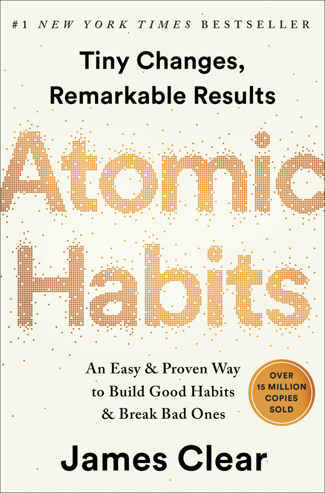

# Atomic Habits Book Review

- [Summary](#summary)
- [Part 1: The Fundamentals](#part-1-the-fundamentals)
  - [Chapter 1: The Surprising Power of Atomic Habits](#chapter-1-the-surprising-power-of-atomic-habits)
  - [Chapter 2: How Your Habits Shape Your Identity (and Vice Versa)](#chapter-2-how-your-habits-shape-your-identity-and-vice-versa)
  - [Chapter 3: How to Build Better Habits in 4 Simple Steps](#chapter-3-how-to-build-better-habits-in-4-simple-steps)
  - [Conclusion of Part 1](#conclusion-of-part-1)

Link to Atomic Habits on Amazon: [Atomic Habits](https://a.co/d/0WW2TJw)

## Summary

"Atomic Habits" by James Clear is a practical guide focused on the incremental improvement of habits. The premise of the book is simple yet powerful: small, consistent changes can lead to remarkable results over time. Clear explains that the quality of our lives is determined by the quality of our habits, and he provides strategies for habit formation, which he describes through a four-step model of cue, craving, response, and reward.

**Key Concepts:**

1. **Four Laws of Behavior Change**: Clear structures the book around these laws which are essential to forming good habits and breaking bad ones:
   - **Make It Obvious**: Design your environment to clearly highlight the cues of good habits.
   - **Make It Attractive**: Modify your surroundings so that the prospects of good habits are appealing.
   - **Make It Easy**: Reduce friction to make good habits straightforward and simple to carry out.
   - **Make It Satisfying**: Ensure that good habits provide satisfying feedback to promote their repetition.

2. **Focus on Systems Rather Than Goals**: Clear argues that setting goals is not sufficient for long-term success. Instead, focusing on systems—i.e., the processes that lead to those goals—is what can drive sustained improvement and performance.

3. **Identity Change Over Outcome Change**: One of the book's central theses is that true behavior change stems from changing one's identity. Instead of aiming to achieve a goal (outcome change), it is more effective to adopt the habits and behaviors of the type of person who could achieve that goal (identity change).

4. **Habit Stacking and Environment Design**: To build new habits, Clear recommends 'habit stacking,' building new routines by tying them to existing habits. Additionally, designing your environment to minimize cues for bad habits and maximize cues for good ones can significantly influence behavior patterns.

5. **Incremental Improvement**: Clear emphasizes that habits compound over time. Small changes, when accumulated, can lead to significant results—much like compound interest in finance.

The book not only lays out a practical framework for understanding and shaping one’s habits but also ties these habits to a broader discussion of personal identity and long-term success. Clear's writing combines scientific insights with real-world examples and actionable advice, making "Atomic Habits" a useful book for anyone looking to improve their behaviors and, by extension, their life.

This approach to habit formation is not just about achieving short-term wins but is more about making a lasting change that can help fulfill one's potential, fundamentally suggesting that the system or process one builds is ultimately more impactful than any single outcome.

## Part 1: The Fundamentals

In "Atomic Habits," Part 1, titled "The Fundamentals," consists of the first three chapters of the book and establishes the foundational concepts necessary for understanding and implementing effective habit changes. This section explores why tiny changes are so powerful and how habits can fundamentally alter one's identity and life trajectory.

### Chapter 1: The Surprising Power of Atomic Habits

James Clear begins by illustrating the profound impact of small, incremental habits through the story of British Cycling, which transformed from mediocrity to world dominance through the aggregation of marginal gains—tiny improvements in a wide array of areas. This chapter sets the stage by discussing how small changes, when accumulated, can lead to remarkable results, a concept similar to the compound interest in finance.

**Key Concepts:**

- **Compound Growth:** Small improvements stack up and compound over time, leading to significant outcomes.
- **The Plateau of Latent Potential:** Clear explains that change can take time to become visible, likening progress to heating an ice cube; only once a critical temperature is reached does the ice begin to melt.

**Impactful Quotes:**

Here are five impactful quotes from Chapter 1, "The Surprising Power of Atomic Habits," of James Clear's *Atomic Habits*:

1. **"Habits are the compound interest of self-improvement."**
   - This quote succinctly captures the essence of the book's thesis: just as compound interest accumulates exponentially over time, small improvements in daily habits can lead to significant outcomes over the long term.

2. **"You do not rise to the level of your goals. You fall to the level of your systems."**
   - Here, Clear emphasizes the importance of systems over goals. Achieving lasting success is more about the structures we create and the processes we follow than about the individual goals we set.

3. **"If you want to predict where you’ll end up in life, all you have to do is follow the curve of tiny gains or tiny losses, and see how your daily choices will compound ten or twenty years down the line."**
   - This quote highlights the predictive power of habits. The trajectory of our lives is shaped by the habits we cultivate, and even minuscule actions can have profound impacts over decades.

4. **"Success is the product of daily habits—not once-in-a-lifetime transformations."**
   - Clear challenges the common notion that success comes from major, singular breakthroughs. Instead, he argues that the accumulation of everyday habits is what truly drives success.

5. **"It is so easy to overestimate the importance of one defining moment and underestimate the value of making small improvements on a daily basis."**
   - This quote is a reminder not to get caught up in the quest for a silver bullet. Sustainable change is a product of incremental, daily improvements rather than sporadic leaps.

Each of these quotes encapsulates fundamental principles of habit formation and underscores the long-term impact of small, consistent changes.

**Concrete Examples:**

Chapter 1 of *Atomic Habits*, titled "The Surprising Power of Atomic Habits," uses compelling examples to illustrate the profound impact of small, consistent improvements. Here are some concrete examples from this chapter:

1. **British Cycling Transformation**:
   - One of the most striking examples in this chapter is the transformation of British Cycling. Historically, British cyclists had performed poorly on the international stage. This changed dramatically when Dave Brailsford became the performance director in 2003 and implemented the philosophy of "marginal gains." Brailsford focused on making a 1% improvement in a myriad of areas, which included redesigning bike seats for comfort, optimizing the weight and aerodynamics of the bike frames, and even perfecting the hand-washing technique to reduce the chances of catching a cold. These small adjustments contributed to British Cycling's dominance, culminating in an extraordinary performance at the 2008 Beijing Olympics and numerous Tour de France victories.

2. **The Paper Clip Strategy**:
   - Another practical example provided by James Clear is the story of Trent Dyrsmid, a stockbroker who used a simple method to track his progress and improve his habit of making sales calls. Dyrsmid began with two jars on his desk, one filled with 120 paper clips. Each paper clip represented a sales call he needed to make. Every time he made a call, he would move a paper clip to the empty jar. This visual cue and simple action made it easy to see progress and encouraged consistent daily effort, which significantly increased his sales.

3. **The Ice Cube Analogy**:
   - Clear uses the analogy of an ice cube melting to explain the concept of latent potential. He describes a scenario in which an ice cube is slowly warmed up from -20 degrees Celsius to 0 degrees. Despite the temperature increase, the ice cube doesn’t melt until it reaches 0 degrees. This analogy serves to illustrate how small, seemingly inconsequential actions can build up to a critical threshold where a significant change occurs. This metaphor highlights the importance of patience and persistence with small habits, as their benefits might not be immediately visible.

4. **The Stone Cutter**:
   - Although briefly mentioned, the story of the stone cutter further emphasizes the power of persistence. Clear recounts how a stone cutter may hammer at a rock up to a hundred times without even a crack showing, yet at the hundred-and-first blow, the rock splits in two. This story is used to illustrate how repeated, consistent efforts can seem to have no effect until a critical point of impact is reached, underscoring the cumulative effect of small, regular actions.

These examples from Chapter 1 effectively illustrate James Clear's central thesis that minor improvements can accumulate into significant outcomes. They highlight that success often results from small, consistent actions rather than from giant leaps, providing a powerful argument for focusing on developing good habits and making incremental improvements.

### Chapter 2: How Your Habits Shape Your Identity (and Vice Versa)

This chapter delves into the relationship between identity and habits. Clear argues that effective habit change stems from focusing on who one _wishes to become_ (identity change) rather than what one _wants to achieve_ (outcome change). This identity-based approach to habit formation suggests that habits not only reflect but also shape our identities.

**Key Concepts:**

- **Identity Change:** Adopting new habits involves embracing a new aspect of identity. For example, someone who starts jogging regularly starts to see themselves as a runner.
- **Levels of Change:** Clear distinguishes between changing outcomes, processes, and identities, advocating for focusing primarily on identity.

**Impactful Quotes:**

Here are five impactful quotes from Chapter 2, "How Your Habits Shape Your Identity (and Vice Versa)," of James Clear's *Atomic Habits*:

1. **"The real challenge of growth: mentally, emotionally, and physically is to not only to do the right things but to become the right person."**
   - This quote captures the essence of identity-based habit change, emphasizing the importance of focusing on who we become, not just what we accomplish.

2. **"Every action you take is a vote for the type of person you wish to become."**
   - Clear articulates how our habits contribute to our identities. Each habit we perform reinforces the identity associated with that behavior, effectively casting a "vote" towards the type of person we are becoming.

3. **"True behavior change is identity change."**
   - This quote highlights the deep connection between habits and identity. Lasting change occurs when habits are so ingrained they become part of our identity, influencing how we view ourselves and how we behave.

4. **"Your habits matter because they help you become the type of person you wish to be."**
   - Clear connects the formation of habits to personal aspirations and identity, suggesting that habits are instrumental not just for achieving goals but for shaping one's self.

5. **"The goal is not to read a book, the goal is to become a reader."**
   - By shifting focus from actions to identity, Clear underscores the importance of habits that define us. Becoming "a reader" implies a shift in identity, making the habit of reading more consistent and permanent.

These quotes from Chapter 2 delve into the profound relationship between habits and identity, illustrating how deeply our routine actions are tied to who we are and who we become.

**Concrete Examples:**

Chapter 2 of *Atomic Habits*, "How Your Habits Shape Your Identity (and Vice Versa)," emphasizes the integral relationship between one’s identity and their habits. James Clear argues that lasting change is more effectively achieved by changing one’s self-perception or identity, rather than focusing only on outcomes. Here are some concrete examples from this chapter that illustrate these concepts:

1. **The Two-Step Process to Changing Your Identity**:
   - Clear introduces a two-step process to help change identity through habits: First, decide the type of person you want to become, and second, prove it to yourself with small wins. For instance, if you want to be a writer, you must start by believing you are a writer and then reinforce this identity by writing regularly, even if it's just a few sentences each day. This process helps to solidify the identity of being a writer through consistent action.

2. **The Smoking Example**:
   - Clear describes two people trying to quit smoking. When offered a cigarette, one says, "No thanks, I'm trying to quit," which implies they still identify as a smoker who is trying to change behavior. The other says, "No thanks, I'm not a smoker," which reflects a change in identity. This example underscores how self-identity can powerfully influence behavior and habit formation.

3. **Math Teacher Identity**:
   - Another example is about a math teacher who incorporates her identity into her professional habits. She sees herself as someone who builds confidence in her students, and this identity informs and guides how she teaches. Her habits around preparing lessons, interacting with students, and providing feedback are all aligned with this identity.

4. **The Voter Identity Experiment**:
   - Clear references a study where voters were tested on how framing affected their turnout to vote. The group that was asked “How important is it to you to be a voter?” had a higher turnout compared to those asked “How important is it to you to vote?” This subtle change from a verb (an action) to a noun (an identity) significantly influenced behavior, highlighting how identity impacts habit execution.

5. **Fitness Identity**:
   - A person who incorporates fitness into their identity might begin by saying "I want to get fit," but through consistent actions like going to the gym, they start to see themselves as fit. This evolving self-perception reinforces their fitness habits, making them more intrinsic and less reliant on external motivations.

These examples illustrate the profound influence of identity on habits. By adopting and reinforcing identities that align with our goals, we can more effectively and sustainably change our behaviors. This approach not only makes habit formation more natural but also embeds these habits deeply within our lifestyle and value system.

### Chapter 3: How to Build Better Habits in 4 Simple Steps

The third chapter introduces a practical, straightforward framework for creating and sustaining habits, known as the Four Laws of Behavior Change. Each law corresponds to one of the four steps in the habit loop: cue, craving, response, and reward. This loop is critical for understanding and modifying habits.

**Four Laws of Behavior Change:**

1. **Make It Obvious (Cue):** Focus on cue detection and ensure that cues for good habits are visible while those for bad habits are hidden.
2. **Make It Attractive (Craving):** Increase the attractiveness of positive habits to foster motivation.
3. **Make It Easy (Response):** Reduce friction to make the execution of good habits easier.
4. **Make It Satisfying (Reward):** Ensure that the rewards of good habits are immediate and satisfying, reinforcing the habit loop.

**Impactful Quotes:**

Here are five impactful quotes from Chapter 3, "How to Build Better Habits in 4 Simple Steps," of James Clear's *Atomic Habits*:

1. **"The Four Laws of Behavior Change are a simple set of rules we can use to build better habits. They are: make it obvious, make it attractive, make it easy, and make it satisfying."**
   - This quote encapsulates the core strategy of the book for habit formation, summarizing the fundamental principles that govern the creation and maintenance of good habits.

2. **"You do not rise to the level of your goals. You fall to the level of your systems."**
   - Reiterated in this chapter, this quote is central to Clear's philosophy. It emphasizes that the success of individuals is not dictated by the goals they set but by the systems they put in place to achieve these goals.

3. **"Environment is the invisible hand that shapes human behavior."**
   - This quote highlights the significance of the environment in influencing habits. Clear argues that by manipulating our surroundings, we can make good habits more effortless and bad habits more challenging.

4. **"The two-minute rule says, 'When you start a new habit, it should take less than two minutes to do.' You’ll find that nearly any habit can be scaled down into a two-minute version."**
   - This practical strategy aims to make habits as easy as possible to start. By reducing the effort required to initiate a habit, people are more likely to engage in it consistently.

5. **"Make it easy to start and the rest will follow."**
   - This quote simplifies the habit-formation process to its essence: the initiation. Clear suggests that the key hurdle in forming new habits is often just getting started, and once this is overcome, maintaining the habit becomes much easier.

Each of these quotes from Chapter 3 provides insights into the practical application of the theories discussed in *Atomic Habits*. They not only reflect the chapter's spirit but also offer actionable advice that can be directly applied to habit formation and behavior change.

**Concrete Examples:**

Chapter 3 of *Atomic Habits*, titled "How to Build Better Habits in 4 Simple Steps," introduces readers to James Clear's four laws of behavior change which are designed to help forge new positive habits and break down negative ones. The chapter is filled with practical examples to illustrate these concepts effectively. Here are some concrete examples from this chapter:

1. **The Two-Minute Rule**:
   - James Clear discusses the "Two-Minute Rule" to make habits easy to start. The rule states that any new habit should be simplified into a task that can be done in two minutes or less. For example, "Read before bed each night" becomes "Read one page." The idea is to scale down habits to the point where they are almost instantaneous, thus reducing barriers to execution. This makes it more likely that the habit will be performed and can naturally extend into a more substantial habit.

2. **Implementation Intentions**:
   - To make habits obvious, Clear suggests using a strategy called implementation intentions, which involves planning out when and where to perform a habit. A study involving British voters found that those who wrote down the specific time and place they would vote (e.g., "I will vote on Tuesday at my local church") were significantly more likely to follow through. This principle can be applied to any habit by explicitly stating the "when, where, and how" of the habit to avoid vague intentions.

3. **Habit Stacking**:
   - Clear introduces "Habit Stacking" as a method to make new behaviors obvious. The formula he suggests is: "After [CURRENT HABIT], I will [NEW HABIT]." For instance, if you want to build a habit of meditating, you might create a stack like, "After I pour my morning coffee, I will meditate for one minute." By linking the new habit to a cue from an established habit, the new behavior is more likely to stick.

4. **Motivation is Overrated; Environment Often Matters More**:
   - An example Clear gives to make a habit attractive is redesigning your environment to highlight the cues of good habits. He talks about Anne Thorndike’s study in a hospital cafeteria where she increased the availability of water by placing it in more locations, not just the soda aisle. This environmental change led to a significant increase in water sales and a decrease in soda sales, demonstrating how the environment can facilitate better habit choices.

5. **Cardinal Rule of Behavior Change**:
   - To make habits satisfying, Clear explains the "Cardinal Rule of Behavior Change": what is immediately rewarded is repeated, and what is immediately punished is avoided. He uses the example of training a pet. If a dog sits on command and receives a treat as a reward, it is more likely to repeat the behavior. Clear suggests using an immediate reward to make good habits feel satisfying, thereby increasing the likelihood of their repetition.

Each of these examples not only highlights practical applications of the Four Laws of Behavior Change but also brings theoretical concepts into everyday life, demonstrating the power of small adjustments in forming and maintaining healthy habits. These narratives serve to ground Clear's ideas in real-world scenarios, making them accessible and actionable for readers.

### Conclusion of Part 1

Overall, Part 1 of "Atomic Habits" lays a solid groundwork by blending theoretical concepts with actionable strategies. Clear not only explains the importance of minor daily improvements but also provides a robust toolkit for personal development through habit manipulation. This part of the book is crucial for anyone looking to understand the mechanics of habits and how to leverage them for long-term success and identity transformation.