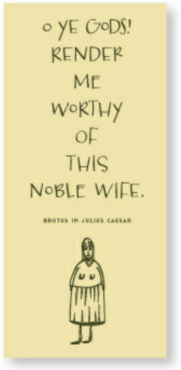

# Notes on Graphic Design

- [The Non-Designer's Design Book](#the-non-designers-design-book)
  - [Chapter 1: Introduction](#chapter-1-introduction)
    - [The Joshua Tree Epiphany](#the-joshua-tree-epiphany)
    - [Introduction: Good Design Examples](#introduction-good-design-examples)
  - [Chapter 2: Proximity](#chapter-2-proximity)
    - [Proximity: What to Avoid](#proximity-what-to-avoid)
    - [Proximity: Design Examples](#proximity-design-examples)
  - [Chapter 3: Alignment](#chapter-3-alignment)
    - [Alignment: How to get it](#alignment-how-to-get-it)
    - [Alignment: What to avoid](#alignment-what-to-avoid)
    - [Alignment: Key Takeaways](#alignment-key-takeaways)
    - [Alignment: Examples](#alignment-examples)
  - [Chapter 4: Repetition](#chapter-4-repetition)
    - [Repetition: How to Get It](#repetition-how-to-get-it)
    - [Repetition: What to Avoid](#repetition-what-to-avoid)
    - [Repetition: Examples](#repetition-examples)
  - [Chapter 5: Contrast](#chapter-5-contrast)
    - [Contrast: Examples](#contrast-examples)

## The Non-Designer's Design Book

Resource: [The Non-Designer's Design Book](https://a.co/d/7KWNDQa)

"The Non-Designer's Design Book" is written for individuals who need to design things but have no background or formal training in design. It specifically addresses those who find themselves tasked with design responsibilities, such as assistants required to design newsletters, volunteers creating information for congregations, small business owners crafting their own advertising, students aiming for better grades through better-looking papers, professionals seeking to enhance their presentations, teachers, statisticians, and many others who see the value in improving the layout and visual appeal of their materials. Robin Williams assumes that her readers don't have the time or interest to become design experts but would like to know how to make their work look better. The book is geared towards empowering readers with knowledge of basic design principles to enhance the visual quality and effectiveness of their projects .

### Chapter 1: Introduction

Chapter 1 the fundamental principles of design that are crucial for visual communication. Robin Williams shares a personal anecdote, the "Joshua tree epiphany," to illustrate the importance of being able to identify and name what you see, as naming gives you power over it and leads to conscious awareness and control. This chapter lays the groundwork for understanding the four basic principles of design, which are detailed in the following chapters. These principles are:

1. **Contrast** - The idea that if two items are not the same, then they should be very different to create visual interest and direct the viewer's attention.
2. **Repetition** - The practice of repeating visual elements throughout a design to create unity and consistency.
3. **Alignment** - The concept that every item should have a visual connection with something else on the page, creating a cleaner, more sophisticated look.
4. **Proximity** - The principle of grouping related items together to organize information and reduce clutter, making the design more user-friendly and comprehensible.

Williams emphasizes that while these principles are discussed separately, they are interconnected and often applied together in practice. The chapter serves as an introduction to these concepts, setting the stage for a deeper exploration in subsequent chapters. Through this foundation, the book aims to empower readers with no formal background in design to make more professional, organized, and visually appealing design choices .

#### The Joshua Tree Epiphany

The "Joshua tree epiphany" is a personal anecdote shared by Robin Williams in Chapter 1 of "The Non-Designer's Design Book" to illustrate the power of naming and awareness in design. Williams recounts receiving a tree identification book as a Christmas gift and, after reading through it, deciding to identify the trees in her parents' neighborhood. Despite having lived there for thirteen years, she had never noticed the presence of Joshua trees until she learned to identify them from her book. Surprisingly, she found that many homes, including her parents', had Joshua trees in their front yards. This revelation struck her profoundly: only after she could name the Joshua tree did she become consciously aware of its presence everywhere around her.

This epiphany serves as a metaphor for the principles of design that Williams aims to teach her readers. She argues that being able to name and identify design principles gives individuals power over them, transforming unconscious recognition into conscious understanding and control. By learning the names and characteristics of basic design principles, readers can begin to see their application and misapplication in the world around them, thereby gaining the ability to use those principles more effectively in their own work. The story underscores the book's premise that knowledge and awareness are key to empowering individuals to make better design choices, even if they are complete novices in the field of design.

#### Introduction: Good Design Examples

Good Design is Easy as 1 2 3
 

Original:

   

Improved:

   

Improvements:

- Removed the border that was crowding the edges
- Used a stronger typeface whose bold has a bigger impact on this page (Principle of Contrast)
- Repeated the bold to point out the three steps and repeated the light face to comment on them (Principle of Repetition)
- Gave the text strong alignments (Principle of Alignment)
- Separated the three steps so you can instantly see there are three of them, thus making it unnecessary to use the numerals (Principle of Proximity)

Stimulating
 

### Chapter 2: Proximity

Chapter 2 addresses the fundamental design principle that elements related to each other should be grouped closely to form a cohesive visual unit. This principle of Proximity is essential for creating organized, clear, and visually appealing designs. 

> Proximity is really just a matter of being a little more conscious, of doing what you do naturally but pushing the concept a little harder.

> Rarely is the Principle of Proximity the only answer to a design project. The other three principles are intrinsic to the process, and you will usually find yourself using all four. But take them one at a time&mdash;start with proximity.

> Learn how to use your software so that you can make exactly the amount of space you need before and after each element; build that information into your style sheets

The basic purpose  of the proximity principle is to **organize**; it aims to simplify the layout by visually connecting related elements, making it easier for the viewer to understand the structure and content at a glance.

Group related items together to create one visual unit, enhancing organization and communication. Be conscious of where your eye is going. This not only reduces clutter but also makes the information more accessible to the reader.

#### Proximity: What to Avoid

- Avoid too many separate elements on a page
- Avoid leaving equal amounts of whitespace between elements unless each group is part of a related subset
- Avoid even a split second of confusion over whether a headline, subhead, caption, graphic, or the like belongs with its related material. Create a relationship among elements with close proximity.
- Don't create relationships with elements that don't belong together!  If they are not _related_, move them apart from each other.
- Don't stick things in the corners or in the middle just because the space is empty.

#### Proximity: Design Examples

The chapter illustrates the concept with examples such as business cards and flyers, demonstrating how grouping related elements together and separating unrelated ones can drastically improve the design's effectiveness. These examples show before-and-after scenarios where applying the proximity principle clarifies the design and makes it more visually appealing.

The examples in this chapter are intentionally simple to make the point clear.

Business Card - Lack of proximity
 

Original:

Questions:

- Where do you begin reading? Do you start in the upper left or upper right or center?
- Do you know when you're finished?
- Do other people follow the same pattern as you?

Improved:

Improvements:

- Grouped related elements together into closer proximity

> Always question whether elements are close to the elements they belong with. Watch for elements that have inappropriate relationships.

Resume: Areas of Expertise - Clarify relationships
 

Original:

Notice:

- Bullets in these columns are far away from their associated points

Improved:

Improvements:

- Relationships are clarified&mdash;we can instantly see to which point each bullet belongs

Travel Tips - Clarify relationships
 

Original:

Notice:

- The numbers appear to be a unit of their own, unrelated text

Improvement:

- When the numbers are closer to the information, we see the relationship of numbers to the text

> When grouping items into close proximity, you typically need to make some changes, such as in the size or weight or placement of text or graphics. Body text does not have to be 12 point! Information that is subsidiary to the main message, such as the volume number and year of a newsletter, can often be quite small.

Sally's Psychic Services - Group related items
 

Original:

Notice:

- The post card is visually boring&mdash;nothing pulls your eyes in to the body, except perhaps the two hearts
- It takes a moment to find the critical information

Improvement:

Improvements:

- Grouping related elements into units and providing appropriate space between the units

Exercise:  Find at least eight small differences that help to make the second example appear more professional.

Answer
 

1. Title is larger
2. The rest of the type is smaller
3. The three services are on three individual lines
4. Related elements are grouped together
5. Capitalized the words in the email and web address so they are easier to read
6. Got rid of the extra heart
7. Got rid of the word 'available'
8. Lightened the heart so it doesn't compete with the text
9. Enlarged the heart and overlapped it with the text to integrate it

First Friday Club - Group related items
 

Original:

Questions:

- Can you look and easily tell how many readings are in the series?

Improved:

Notice:

- How the spacing between each reading is the same, indicating that each group is related
- Even the small block of text at the bottom is too small to read, you still know what it is; you instantly know it's not another event

List at least 5 changes that improve this picture:

Answer
 

1. The main text is smaller
2. Title is larger, which can be done when the rest of the text is organized and smaller
3. The information is organized consistently sot he reader can find it
4. Headings are bold using the Principle of Contrast
5. A strong alignment is provided using Principle of Alignment

In the picture below, on the left-hand side, you assume all flowers have something in common.  In the picture on the right, the last three flowers have something different, without being conscious of it, because they are physically separated from the rest of the list.

General List - Use spacing
 

Original:

Improved:

The author suggests that you visually separate more consciously and thus with more strength. 

**IMPORTANT**: It is critical that you learn how to use the _paragraph space before and after_ settings in your software.

Moonstone Dreamcatchers - Group related items
 

Original:

Improved:

Improvements:

- Changed corners from rounded to just barely dull, giving the piece a stronger, cleaner look
- Enlarged the name to fill the space better
- Made some of the text a pale shade of dark teal so it would compete less with the rest of the elements

List at least three other small differences that help make the second example communicate more clearly:

Answer
 

1. Title is larger
2. Corners are not so rounded
3. Text is aligned
4. Abbreviations are spelled out
5. Bullets are used instead of commas
6. Some text is gray so it interrupts the visual less
7. The moon escapes out the top

You're probably already using the Principle of Proximity at your work, but you may not be pushing it as far as you could to make it truly effective. Really look at the elements and see which items _should_ be grouped together.

Shakespeare Flyer - Trapped whitespace
 

Original:

Notes:

- The headlines are the same distance from the body copy above and below, making the heads and body copy appear as separate items
- There's lots of white space, but it's all broken up.  When white space is "trapped" like this, it tends to visually push the elements apart

Improved:

Notes:

- Group the items that have a relationship
- If there are areas on the page where organization is not perfectly clear, see if items are in proximity that _shouldn't_ be

Find five other small differences that help make this example communicate more clearly.

Answer
 

1. The contact info is on separate lines&mdash;grouped together and separated&mdash;so it will stand out as important information
2. Deleted the words _phone_, _email_, and _web_ because they are unnecessary
3. Deleted the semicolon after the phone number and the last slash after the web address
4. Made the page color a little brighter
5. Made SHAKESPEARE lowercase so it is easier to read and can be set larger
6. Cropped the photo wider

Gertrude's Piano Bar - Group related items
 

Original:

Notes:

- All the information is in one big chunk
- Never use all caps when there is a lot of text

Improved:

Improvements:

- Title is not all caps
- Gave Gertrude a nicer font for her menu heading
- Removed the underlines from the subheads
- Set the names of the dishes in bold and the descriptions in regular font to help differentiate the information
- Changed all caps to title case (initial caps in each word)

Improved:

Improvements:

- Left-hand space under each heading helps to clarify the two main groups
- Descriptive text blocks are a point size smaller thant the names of the dishes. This helps to communicate more clearly and also gives more room to work with.
- Chose a more interesting typeface than Times New Roman
- Prices were originally tucked into the text; used Principle of Alignment to make prices visibly consistent

### Chapter 3: Alignment

Alignment is about ensuring that every element on a page has a visual connection with another, aiming for a clean, organized appearance rather than a "slightly messy kitchen" effect. The principle dictates that nothing should be arbitrarily placed on the page; every item should have purpose and connection, enhancing the cohesive feel of the design.

Alignment is more than just an aesthetic choice; it serves to unify and organize the page, making the design more sophisticated and the information more accessible. By aligning elements, designers create invisible lines that connect disparate parts of a page, guiding the reader's eye in a logical flow from one element to another, even if they are not physically close. This principle is crucial not just for the aesthetic coherence of individual pages, but for multi-page documents as well, ensuring that every part of a publication feels like a piece of a whole.

> The Principle of Alignment states:  **Nothing should be placed on the page arbitrarily. Every item should have a visual connection with something else on the page.**

> A lack of alignment creates discomfort; it appears to be unorganized; we don't know how to be effective.

The basic purpose of alignment is to **unify and organize** the page.

Unity is an important concept in design. To make all the elements on the page appear to be unified, connected, and interrelated, there needs to be some visual tie between the separate elements. Alignment helps achieve this.

It is often a strong alignment (combined with the appropriate typeface) that creates a sophisticated look, a formal look, a fun look, or a serious look.

#### Alignment: How to get it

Be conscious of where you place elements. Always find something else on the page to align with, even if the two objects are physically far away from each other.  Look out for trapped whitespace.

#### Alignment: What to avoid

Avoid using more than one text alignment on the page. Don't center some text and right-align other text. Break away from centered alignment unless you are consciously trying to create a more formal, sedate presentation. Choose a centered alignment consciously, not by default.

#### Alignment: Key Takeaways

Chapter 3 of "The Non-Designer's Design Book" focuses on the principle of alignment, highlighting its critical role in creating visually appealing and coherent designs. Here are the key takeaways:

1. **Purpose of Alignment**: Alignment is not about placing elements on the page arbitrarily but creating a visual connection between them. This principle is essential for organizing the page, enhancing its aesthetic appeal, and improving readability.

2. **Creating Order**: Proper alignment brings order to a layout, making it appear organized and professional. Every element on the page should have a visual connection with another, ensuring that the design feels cohesive and intentional.

3. **Guiding the Viewer**: Alignment helps guide the viewer's eye across the page, facilitating a logical flow from one element to the next. This invisible guiding line enhances the user's experience by making information easily accessible and understandable.

4. **Types of Alignment**: The chapter discusses the importance of choosing a consistent alignment pattern (left, right, centered, or justified) and sticking to it throughout the design to maintain coherence and unity.

    A centered alignment is the most common alignment that beginners use&mdash;it's very safe and feels comfortable. However, most designs that have a sophisticated look are not centered. As a beginner you need to break away from defaulting to centered alignment.

5. **Avoiding Misalignment**: Misalignment or arbitrary placement of elements can lead to a cluttered, disorganized appearance, making it difficult for the viewer to navigate the information. Proper alignment eliminates confusion and clutter.

    For beginners, stick to one text alignment on a page&mdash;all text is either flush left, flush right, or centered.

6. **Enhancing Visual Appeal**: Strong alignment not only organizes information effectively but also contributes to the overall visual appeal of the design. It creates a sophisticated look that attracts the viewer's attention.

7. **Application Across Multiple Pages**: For multi-page documents, alignment is crucial for maintaining a consistent look and feel across all pages, reinforcing the unity of the entire document.

8. **Invisible Connections**: Even when elements are not physically close, alignment can create invisible connections between them, suggesting a relationship and continuity that enhances the design's coherence.

#### Alignment: Examples

Business Card - Use the invisible lines
 

Original:

Note:

- Nothing is aligned
- There are elements with three different alignments: flush left, flush right, and centered
- The two groups of text in the upper corners are not aligned along the same baseline, nor at the left and right edges, nor with the groups at the bottom corners

Get in the habit of drawing lines between the elements to determine where connections are lacking:

Improved:

Note:

- Moved all elements to the right and gave them one alignment
- The text items have a common boundary
- Information is instantly more organized
- Grouping the related elements into closer proximity is also critical

Note:

- Centered alignment appears a bit weak
- If text is aligned on the left or right, the invisible line that connects the text is much stronger because it has a hard vertical edge to follow

Note:

- The edges are "soft"; you don't really see the strength of the line

Note:

- The strength of this edge is what gives strength to the layout. There is a strong invisible line connecting the edges of these groups of text

Report Cover - Transition from centered alignment
 

Original:

Improved:

Note:

- Strong left alignment gives report cover a more sophisticated look
- Author's name is far from the title, but that invisible line connects the two text blocks

Designer Eye - Transition from centered alignment
 

Original:

Improved:

Note:

- Flush-left alignment makes the page a little more sophisticated
- Limiting the dotted line to the left opens the page and emphasizes the alignment

Improved:

Note:

- Text is flush right, but placed on the left side
- The letter you type will have a strong flush left to align with the flush right of this layout

Improved:

Note:

- Author doesn't suggest to never center anything; just be conscious of the effect a centered alignment has.

Pie Day - Dull centered text
 

Original:

- Centered. Really stable and maybe dull, but with a cute font

Improved:

- If you're going to center text, then at least make it obvious that it is centered!

- Experiment with uncentering the block of centered text.

- If you're going to center text, experiment with making it more dramatic in some way
- Sometimes you can center the type but set the block of type itself off center
- Or set the type high on the page to create more tension
- Or set a very casual, fun typeface in a very formal, centered arrangement
- Just don't set Times 12-point with double Returns!

O ye gods! - Bad use of centered text
 

- This layout gives "centered" a bad name: boring typeface, type that is too large, crowded text, double Returns, claustrophobic border

- A centered alignment needs extra care to work
- This layout uses classic typeface sized fairly small
- More space betwen the lines
- Lots of white space around the text, no border

- Emphasize a tall, slender centered layout with a tall, slender piece of paper

- Emphasize a wide, centered layout with a wide spread

One Night in Winnemucca - No common alignment
 

- Avoid using elements were there is no common alignment
- The title and byline are flush left, but the description is centered
- There is no common alignment between these two elements of text

- These two elements still have two different alignments (top top is flush left and the bottom is flush right)
- The edge of the descriptive text below aligns with the right edge of thin rule and text above, connecting the elements with an invisible line
- Train your eyes to notice the invisible line

Tri-State Wellness Center - Arbitrary placement 
 

- Nothing should be placed on the page arbitrarily
- Lack of alignment is the biggest cause of unappealing documents; our eyes like to see order
- For all vertical and horizontal alignments in this piece, all units are centered but they are not aligned with any other centered units

For any well-designed piece, you'll be able to draw lines to the aligned objects, even if the overall presentation of material is a wild collection of odd things and has lots of energy

- Simply lining things up makes a big difference
- Not one item is on the page arbitrarily&mdash;every item has some visual connection with another item on the page
- Notice how the change in phone number positioning frees up previously-trapped whitespace
- The blue bar is added from the Principle of Repetition
- Draw shapes around the whitespace between the before and after pictures and notice how the whitespace is more organized

The Undiscovered Country - Centered headlines problem
 

- Many designers fail to use a subtle lack of alignment, such as centered headlines and subheads over indented paragraphs
- Headlines are centered, text is flush left, and thus the right text is "ragged"
- Paragraph indents are typewriter wide
- Never center headlines over flush left body copy or text that has an indent because if the text does not have clear left and right edges, you cannot tell that the headline is actually centered; it looks random.

Improvements:

- Removed the border from the graphic
- Enlarged the graphic to fill the space better, aligning the left and right edges in this freefrom case
- Justified the type, only because the columns are wide enough for that size of type to prevent big gaps between words
- Changed the indent to an em space (e.g. 12-point type would take a 12-point indent about two spaces)

Notes: 

- Find a strong line and stick to it&mdash;if the text is flush left, set the heads and subheads flush left
- First paragraphs are traditionally not indented. The purpose of indenting a paragraph is to tell you there is a new paragraph, but you already know the first paragraph is a new paragraph
- The professional typographic indent is one **em**, which is about two spaces, not five. An **em** is about the point size of your type
- The columns in the picture are wide enough for the type to be justified (aligned on both sides ) without big gaps between the words
- If there are photographs or illustrations, align them with an edge and/or baseline
- Strong alignment is often the key to a professional look. Check every element to make sure it has a visual connection to something else on the page

iRead Shakespeare - Too many vertical alignments
 

- Immediate visual impression is a little sloppy. Draw vertical lines to see clearly how many different alignments there are.
- Check for: 

  - illustrations that hang out over the edge just a bit
  - captions that are centered under photos
  - headlines that are not aligned with the text
  - rules (lines) that don't align with anything 
  - a combination of centered text and flush left text

- Draw lines along the strong alignments, both vertical and horizontal

Improvements:

- Set the headings in the same font as the title (Principle of Repetition). Also used the same color.
- Removed the indent int he first paragraphs after the headings
- Made the paragraph indents an em space in width (width of the point size of the type)
- Used the tabs and leaders to make sure the table of contents align instead of using a row of periods
- Enlarged the readers graphic and shaded it back to gray so it wouldn't compete with the headline
- Aligned the readers graphic with the top and bottom of the headline, plus the left column edge. Points and circles always extend a bit beyond the alignment edge as a response to the visual trick of appearing smaller

6 Steps to Pie as Art - Trapped whitespace
 

- Find a strong line and use it!
- If you have a graphic with a strong flush side, align the side of the text along the straight edge of the graphic
- There is a nice, strong, invisible line along the left edge of the type, and there is a nice strong line along the left edge of the image
- However, between the text and the image is trapped whitespace, which is in an awkward shape. When whitespace is trapped, it pushes the two elements apart.

- Now the strong line on the left side of the text and the strong line on the right side of the image are next to each other, making each other stronger. The white space is now floating free off the right edge
- Start looking for this type of mistake, where a project has a strong line that is weakened by abutting it to a ragged edge
- If your alignments are strong, you can break through them consciously and it will look intentional. The trick is you cannot be timid about breaking the alignment&mdash;either do it all the way or don't do it.  Don't be a wimp!

Other improvements

- Moved the text closer to the numbers (Principle of Proximity)
- Changed "6" in the title to "Six" to prevent conflict with the numerals
- Enlarged the title a bit

Le Petit Jambon - Breaking the rules on purpose
 

<Enter text here>

Thoughts:

- Illustration is angled and breaking into the text block. This works fine if the rest of the piece has clean alignments and the oddball element _appears to be intentional_. 
- It's possible to break free of alignment, **if you do it consciously**.
- Remember this rule about breaking rules:  **You must know what the rule is before you can break it**
- When the rules are broken on purpose, they have a stronger and more important impact

Doggy's Best Friend - Avoid multiple alignments
 

- Information on this card is using Principle of Proximity, but it still looks amateurish. 
- Reason is because it has three different alignments, centered, flush left, and flush right
- There's additional clipart in the corners

- This improved version uses one alignment
- Whitespace is now more organized

Fredrick Space Design - Ideas for improvement
 

Ideas for improvement:

- Enlarge heading a bit so that it aligns with the photo
- Group the subhead into closer proximity
- Maintain strong alignment on the bottom, which puts the web address on its own line, which helps clarify the information
- Put caps in the web address so you can read it more easily
- Reduce the second logo in the bottom half a bit so it stops competing with the one above

Happy Saddles Riding Company - Ideas for improvement
 

Thoughts:

- Is every element necessary?
- Is each element in the proper hierachy?

Ideas for improvement:

- Is "Est 2003" really worth all the space it gets?
- Is a separate line for horseback riding really necessary?
- Put initial caps in that long web address to make it easier to read
- Can you shorten the line about information?
- Can you avoid the two blocks of black that cause your eye to bounce back and forth between them?

### Chapter 4: Repetition

The Principle of Repetition states: **Repeat some aspect of the design throughout the entire piece.**

The purpose of repetition is to **unify** and to **add visual interest**. Don't underestimate the power of visual interest of a page&mdash;if a piece looks interesting, it is more likely to be read.

Repetition can be thought of as _consistency_. As you look through a brocure, it is repetition of their elements, their consistency, that makes each of those sixteen pages appear to belong to the same brochure.

However, repetition goes beyond consistency&mdash;it is a conscious effort to unify all parts of a design.

>Repetition helps organize the information; it helps guide the reader through pages; it helps unify disparate parts of the design.

>The repetitive element does not have to be a graphic or clipart; it can be spacing, rules, fonts, alignments, or anything that you consciously repeat.

Repetition is useful on one-page pieces, and is critical in multi-page documents.

#### Repetition: How to Get It

Repetition is about consistency, but push the existing consistencies a little further:

- At first, simply find _existing_ repetitions and strengthen them.
- As you get used to the idea, start to _create_ repetitions to enhance the design and clarity of the information

#### Repetition: What to Avoid

Avoid repeating an element so much that it becomes annoying.

#### Repetition: Examples

Business Card - Repetition unifies the piece
 

When you get to the end of the information, does your eye just wander off the card?

Now when you get to the end, where does your eye go? If you find your eye bounces between the bold elements, that's repetition doing its job&mdash;it ties a piece together; it provides unity.

The Elizabethan Humours - Make repetitive elements stronger
 

- Headlines and subheads are a good place to start when you need to create repetitive elements

- Take that consistent element and make it stronger

Repetitive Elements in Multi-page Publications
 

- Repetition is a major factor in the unity of multi-page publications
- The text has a "bottoming out" point (aligning across the bottom), but not all text must align here **if there is a consistent, repetitive starting point at the top of the page.**
- Some publications might choose to repetitively bottom out (or line up across the bottom&mdash;possibly with a ragged top, like a city skyline) rather than "hang from a clothesline" (align across the top).
- Use one or the other technique consistently, though.

- If you have a strong, consistent publication, you can throw in surprise elements; save those surprises for items you want to call special attention to.

Business Package - Use repetition across all pieces
 

- Use repetition between all pieces in a business package

The Mad Hatter - Types of repetition
 

Repetitions:

- Bold typeface
- Light typeface
- Square bullets
- Indents
- Spacing
- Alignments

Pie Just Wants to be Shared - Use of similarly-repeated objects
 

- Sometimes the repeated items are not exactly the same objects, but objects so closely related that their connection is very clear
- Repeated items:
  - The headline font in the names of the workshops
  - The serif font in the subhead and the footer
  - The serif font as italic in each workshop
  - The two colors
  - The spacing between workshops
  - The dotted rule
  - The spacing between the dotted rules and the type
  - Avoid amateur centered with font choice, spacing, appropriate clipart, no border
- From the Principle of Alignment, note the intentional use of centered alignment across all elements

Staff Meeting Reminder - Using a variety of repetitive elements
 

Often you can add repetitive elements that apparently have nothing to do with the purpose of your page.
Ideas

- Throw in a few petroglyph characters on a survey form
- Add some strange-looking birds to a report
- Set several particularly beautiful characters in your font in various large sizes, in gray or light second color, and at various angles throughout the publication

Just make sure it looks intentional and not random

Overlapping a design element or pulling it outside of the borders serves to (1) unify two or more pieces, or (2) unify a foreground and a background, or (3) to unify separate publications that have a common theme.

Repetition makes items look like they belong together, even if the elements are not exactly the same. 

Once you establish a couple of key repetitive items, you can vary those items and still create a consistent look.

There are at least seven repetitive elements in these pictures:

- The color of the green type
- The font for the green type
- The color of the white type
- The font and shadow for the white type
- The color of the shapes
- The overlap of various elements
- The style of the images

Yountville Seniors Radio - Look for what can be repeated
 

The dashed letters inspired the dashed concentric ovals hinting at a sound wave.

Once you start noticing what can be repeated, you'll enjoy developing so many options.

Repetitive elements:

- Two fonts
- Small caps
- Color of background in color of text
- Second color of blue (the complement of orange)
- Copy text is aligned horizontally with the title of the text

Umbrellas & Charcoal - Look for what can be repeated
 

The repetitive element does not have to be a graphic or clipart; it can be spacing, rules, fonts, alignments, or anything that you consciously repeat.

Repetitive elements:

- Dark maroon color
- Green color in bubbles
- Strong alignment of box with strong alignment of text

A Hundred Years of Science - Decide what you want to focus on
 

This is very typical: Times New Roman, centered, typewriter quotation marks

Information is separated into logical groups, but you can see the centered alignment is weak

There is an attempt to fill the corners.

Decide what you want to focus on.

This version has a focus for the speaker.

Regarding the Principle of Repetition, what are the repeated elements?

- Italicized serif type on the focused parts

The Principle of Alignment has been applied, and this add also uses the Principle of Contrast

This version has a focus on the topic.

Notice the black bar is repeated in a thinner version on the bottom. A repetitive element that pulls things together can be that simple.

Designer Eye - Using prior-repeated elements
 

Sometimes the suggestion of a repeated element can get the same results as if you used the whole thing. Try including a portion of the element, or use it in a different way. If an image is familiar to a reader from your other material, all it takes is a piece of it to help the reader make a connection.

What is another repetition here?

- Font colors
- Symbol as a separator
- Serif type for copy text and subhead

The Screenwriting Conference - Using prior-repeated elements
 

The typewriter has been used on all of the Screenwriting Conference's promotional material. 

You don't have the use the entire image at this point; you can use a portion of the recurring image.

This type of repetition gives your reader the feeling that someone is in charge because repetition is obviously a thoughtful design decision.

Annual Martini Tasting - Repetition doesn't mean repeating exactly the same thing
 

Repetition doesn't mean you have to repeat exactly the same thing. 

Here, the headlines are all different colors, bu they use the same font.

The illustrations are all different styles, but all rather funky and 'fifties.

Just make sure to have enough repetitive elements so the differences are clear, not a jumbled mess. 

In this example, the recipes all follow the same format and there are strong alignments. While there is an underlying structure, you can be more flexible with the elements.

### Chapter 5: Contrast

The Principle of Contrast states: **Contrast various elements of the piece to draw a reader's eye into the page.**

Contrast not only serves to draw in the eye, but you can use it to organize information, clarify the hierarchy, guide a reader around the page, and provide a focus.

Options for using contrast:

- Contrast large type with small type
- A graceful oldstyle font with a bold sans serif font
- A thin line with a thick line
- A cool color with a warm color
- A smooth texture with a rough texture
- A horizontal element (such as a long line of text) with a vertical element (such as a tall, narrow column of text)
- Widely spaced lines with closely packed lines
- A small graphic with a large graphic

For contrast to be effective, it must be strong. Don't be a wimp.

If two elements are soft of different, but not really, then you don't have _contrast_, you have _conflict_. You cannot contrast 12-point type with 14-point type. You cannot contrast a half-point rule with a one-point rule. You cannot contrast dark brown with black.

#### Contrast: Examples

Another Newsletter! - Using contrast in title, heads, and subheads
 

The newsletter is nice and neat, but there's nothing that attracts your eyes to it. If eyes are not attracted to a piece, few will read it.

The source of contrast is obvious. A stronger, bolder typeface is used in the headlines and subheads.

Because the title is now in caps/lowercase, we can use a larger and bolder type size, which also helps reinforce the contrast.

Because the headlines are so strong now, a dark band can be added across the type of the title, again repeating the dark color and reinforcing contrast.

Resume - Using contrast to improve a resume
 

The information is all there, but the resume doesn't grab any attention.

Notice these problems:

- Job titles are not clearly defined; they blend in with the body of the text
- The sections themselves are not clearly defined
- There are two alignments on the page: centered and flush left
- The amounts of space between the separate accomplishments are the same as the amount of space betwen sections
- The setup is iconsistent&mdash;sometimes the dates are at the beginning, sometimes at the end. Remember, consistency creates repetition.

The page is more attractive when contrast is used. The purpose and organization of the document are much clearer.

Your resume is someone's initial impression of you, so make it strong.

These problems are easily corrected:

One alignment: Flush left. Using one alignment doesn't mean that everything is aligned along the **same edge** &mdash;it simply means everything is using the **same alignment** (all flush left or all flush right or all centered). Both the flush left lines above are very strong and reinforce each other (**alignment** and **repetition**).

The heads are strong&mdash;you instantly know what this document is and what the key points are (**contrast**).

Segments are separated by more space than are the individual lines of text (**contrast** of spatial relationships; **proximity**).

Degree and job titles are in bold (a **repetition** of the headline font)&mdash;the strong **contrast** lets you skim the important points.

The easiest way to provide contrast is with typefaces, but don't forget about rules (drawn lines), colors, spacing between elements, textures, and so on.

The Rules of Life - Making effective use of horizontal rules
 

If you use a hairline rule between columns, use a strong 2- or 4-point rule when you need another&mdash;don't use a half-point rule and a one-point rule on the same page.

If you use a second color for accent, make the colors contrast&mdash;dark brown or dark blue doesen't contrast effectively with black text.

In the picture above, there is a bit of contrast between the typefaces and between the rules, but the contrast is wimpy&mdash;are the rules supposed to be two different thicknesses? Or is it a mistake?

Now the contrast between the typefaces makes the piece more dynamic and eye-catching.

With a stronger contrast between the thicknesses of the rules, there's no risk of someone thinking it's a mistake.

Here, the thick rule is behind the white type. With contrast, the entire table is stronger and more sophisticated; it communicates more clearly.

Postcard - Use contrast in direction
 

If you use tall, narrow columns, perhaps use a strong headline to create a contrasting horizontal direction across the page.

Here, there is contrast between the typefaces and a contrast between the long, horizontal title and the tall, narrow, vertical columns.

The narrow columns are a repetitive element as well as an example of contrast.

Detox your body flyer - Using contrast in pieces with a lot of text
 

Problem:

- The lines are too long to read comfortably
- There is little to draw the reader's eye into the text

Where to begin?

Design the headline so that it will catch someone's eye. Then create some contrast in the text so that their eyes will be pulled to certain parts of the page as they skim through it. Enhance this with alignment and use proximity.

- When you have lots of text, experiment using more than one column
- Pull out key phrases to set in bold so the visual contrasts attract the eye and lead the reader through the information
- Start with an introductory bit of information so the reader understands the purpose for the flyer; it's less of a commitment to read little pieces, so you can seduce the reader's eye into the piece by providing an introductory path

Notice all the other principles come into play: proximity, alignment, and repetition.

Added some ornaments for visual interest and to provide an earthy feeling.

Hugs Pie Shop - Using contrast in elements of repetition
 

Issues:

- Using all caps and centered text to fill space
- There's no contrast on the page, except for the pie
- Information is not organized into logical units
- Various alignments
- No repetitive elements
- Lack of contrast

To fix:

1. Group things into logical proximity
2. Use an alignment
3. Find or create repetitive elements
4. Add contrast

Addressing the issues:

- Let go of Times New Roman and Arial/Helvetica. Just eliminate them from your font choices!  Let go of Sand as well.
- Let go of centered alignment. 
- Find the most interesting item on the page, and **emphasize** it!
- Keep the most important things together so a reader doesn't lose **focus**
- Group the information into logical groups. Use **space** to set items apart or to connect them, not boxes
- Find elements you can **repeat** (including elements of contrast)
- Most importantly, add **contrast**

Differences in these adds:

- Changed the border to a thinner line (a half point)
- Changed all caps to caps and lowercase
- Deleted unnecessary information such as "telephone" and the zip code and area code since this is a local ad in a local paper, allowing it to be set larger.
- Enlarged the pie and let it float, after using Photoshop to make the background transparent
- Arranged the types of pies to fit the piece better
- Aligned most of the copy on the left; some elements align on the right
- Repeated the shop's favorite phrase on a curved line
- Moved the phrase "a pie gallery" into the headline because the shop does have a gallery of pies as art

