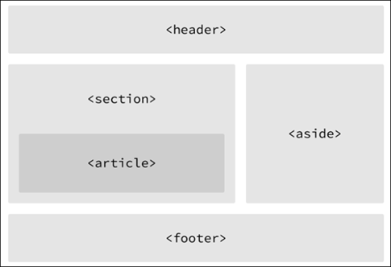
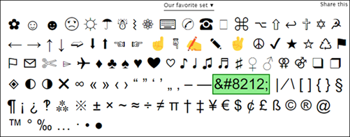

# More on HTML
- It's important to understand which HTML elements are best used to display different types of content and how elements are visually displayed on a web page

## Semantics Overview
- Semantics is the practice of giving content meaning and structure by using the proper element.  See [Semantics within HTML](https://boagworld.com/dev/semantic-code-what-why-how/)
- Semantics describes the *value* of the content on the page, regardless of the style or appearance
- Benefits of using semantics
  - Enables computers, screen readers, search engines to adequately read and understand content on a web page
  - Semantic HTML is easier to manage and work with, as it shows clearly what each piece of content is about
- Two elements, `<div>` and `<span>` don't actually hold any semantic value; they exist for styling purposes only

## Divisions and Spans
- Divisions, `<div>`s, and `<span>`s are HTML elements that act as containers solely for styling purposes.  They do not have any semantic value.
- `<div>`s and `<span>`s are valuable in that they give the ability to apply targeted styles to a contained set of content
- A `<div>` is a block-level element that is commonly used to identify large groupings of content, and which helps to build a web page's layout and design
- A `<span>` is an inline-level element used to identify smaller groupings of text within a block-level element
- You'll commonly see `<div>`s and `<span>`s  with `class` or `id` attributes for styling purposes
- Choosing a `class` or `id` attribute value requires care; you want to choose a value that refers to the content of an element, not necessarily the appearance of an element

## Text-Based Elements
Here's a quick summary of the more popular text-based elements.

### Headings
- Block-level elements that come in six rankings, `<h1>` through `<h6>`
- Help to break up content and establish hierarchy
- Help search engines to index and determine content on a page
- Should be used for semantic value.  Should not be used just to make text big or bold.

### Paragraphs
- Headings are often followed by paragraphs
- Paragraphs are defined using the <p> block-level element
- Paragraphs can appear one after the other, adding information to the page as desired

### Bold Text with Strong
- Use the `<strong>` inline-level element to make text bold and place a strong emphasis
- There are two elements that bold text:  `<strong>` and `<b>`.  It is important to understand the semantic difference between the two.
  - The `<strong>` element is semantically used to give *strong* importance to text, and is the most popular option for bolding text
  - The `<b>` element, on the other hand, semantically means to *stylistically offset* text, which isn't always the best choice for text deserving prominent attention
- Example:
  ```html
  <!-- Strong importance -->
  <p><strong>Caution:</strong> Falling rocks.</p>

  <!-- Stylistically offset -->
  <p>This recipe calls for <b>bacon</b> and <b>baconnaise</b>.</p>
  ```

### Italicize Text with Emphasis
- Use the `<em>` inline-level element to italicize text with emphasis
- The `<em>` element is used semantically to place a *stressed* emphasis on text, and is the most popular option for italicizing text
- The `<i>` element is used semantically to convey text in an *alternative voice or tone*, as if it were placed in quotation marks
- Example:
  ```html
  <!-- Stressed emphasis -->
  <p>I <em>love</em> Chicago!</p>

  <!-- Alternative voice or tone -->
  <p>The name <i>Shay</i> means a gift.</p>
  ```

## Building Structure
- For a long time, divisions were used to structure a web page
- The problem w/ divisions is that divisions provide no semantic value, and it was fairly difficult to determine the intention of divisions
- HTML5 introduced new [structurally based elements](https://dev.opera.com/articles/new-structural-elements-in-html5/), including `<header>`, `<nav>`, `<article>`, `<section>`, `<aside>`, and `<footer>`, elements. 
- Here's an example in how the structure of these elements gives meaning to the organization of pages: 
  

### Header
- The `<header>` element is used to identify the top of the page, article, section, or other segment of a page
- The `<header>` element may include a heading, introductory text, and even navigation
  ```html
  <header>...</header>
  ```
- It's easy to confuse `<header>` with `<head>` and `<h1>` through `<h6>` elements
  - `<header>` is a structural element that outlines the heading of a segment of a page. It falls within the `<body>` element
  - `<head>` is not displayed on the page and is used to outline metadata, including the document title and links to external files. It falls within the `<html>` element
  - `<h1>` through `<h6>` are used to designate multiple levels of text headings throughout a page

### Navigation
- `<nav>` identifies a section of major navigational links on a page
- `<nav>` should be reserved for primary navigation sections only, such as a global navigation table, a table of contents, and previous/next links
- Links included w/ the `<nav>` element will link to other pages
- Miscellaneous one-off links should not be wrapped w/ the `<nav>` element; use the anchor element, `<a>`, instead
  ```html
  <nav>...</nav>
  ```

### Article
- `<article>` is used to identify a section of independent, self-contained content that may be independently distributed or reused
- `<article>` is often used to mark up blog posts, newspaper articles, and user-submitted content
  ```html
  <article>...</article>
  ```
- When deciding to use `<article>`, determine if the content within the element could be replicated elsewhere without any confusion.

### Section
- `<section>` is used to identify a thematic grouping of content, which generally, but not always, includes a heading
- The grouping content within `<section>` may be generic in nature, but it's useful to identify all the content as related
- `<section>` is commonly used to break up and provide hierarchy to a page
  ```html
  <section>...</section>
  ```

### Deciding Between \<article\>, \<section\>, and \<div\> Elements
- Both `<article>` and `<section>` contribute to a document's structure and help to outline a document
- Use `<article>` if the content adds to the document outline and it can be independently redistributed or syndicated
- Use `<section>` if the content adds to the document outline and represents a thematic group of content
- Use `<div>` if the content is being grouped solely for styling purposes and doesn't provide value to the outline of a document

### Aside
- `<aside>` holds content, such as sidebars, inserts, or brief explanations, that is tangentially related to the content surrounding it
- When used with `<article>`, `<aside>` may identify content related to the author of the article
- Think of `<aside>` as content that appears off to the left or right side of a page
  - However, all of the structural elements, including `<aside>`, are block-level elements and will therefore appear on a new line, occupying the full available width of the page or of the element they are nested within, i.e. their parent element
  ```html
  <aside>...</aside>
  ```

### Footer
- `<footer>` identifies the closing or end of a page, article, section, or other segment of a page
- Generally, `<footer>` is found at the bottom of its parent
- Content within `<footer>` should be relevant information and should not diverge from the document or section it is included within
  ```html
  <footer>...</footer>
  ```

### Encoding Special Characters
- Special characters, like punctuation marks and accented letters, need to be encoded
- Use https://copypastecharacter.com/ as a reference for a long list of character encodings
- Example: Use the encoding `&#8212;` to create an emdash, i.e. &#8212;  


### Creating Hyperlinks
- Use the anchor inline-level element, `<a>`, for hyperlinks
- The `href` attribute is required and identifies the destination of the link
- Example:
  ```html
  <a href="http://mywebsite.com">My Website</a>
  ```
- Traditionally, `<a>` is an inline element, and according to web standards, inline-level elements may not wrap block-level elements
  - With HTML5, anchor elements now have permission to wrap either block-, inline-, or any other level elements
  - This enables entire blocks of content on a page to become links
- Hyperlinks can have relative paths and absolute paths
  ```html
  <!-- Relative Path -->
  <a href="about.html">About</a>

  <!-- Absolute Path -->
  <a href="http://www.google.com">Google</a>
  ```

#### Linking to an Email Address
- The href attribute must start with `mailto:`, followed by the email address
- You can also specify subject, body text, and other information using parameters after the email addresses
  - The first parameter must begin with a question mark, ?, to bind it to the hyperlink path
  - Use ampersand, &, to separate additional parameters
  - Encode spaces with `%20` and encode line breaks with `%0A`
- Example:
  ```html
  <a href="mailto:myaddress@email.com?subject=Reaching%20Out&body=How%20are%20you">Email Me</a>
  ```
- See [here](https://developer.yoast.com/blog/guide-mailto-links/) for options on mailto syntax

#### Opening Links in New Window
- Use the `target` attribute with a value of `_blank` to trigger the action of opening in a new window
- Example
  ```html
  <a href="http://mysite.com" target="_blank">My Site</a>
  ```

#### Linking to Same Parts in a Page
- Use the `id` attribute for linking back to a part
- Reference the id using the pound sign in the `href` attribute
- Example:
  ```html
  <body id="top">
    ...
    <a href="#top">Back to top</a>
    ...
  </body>