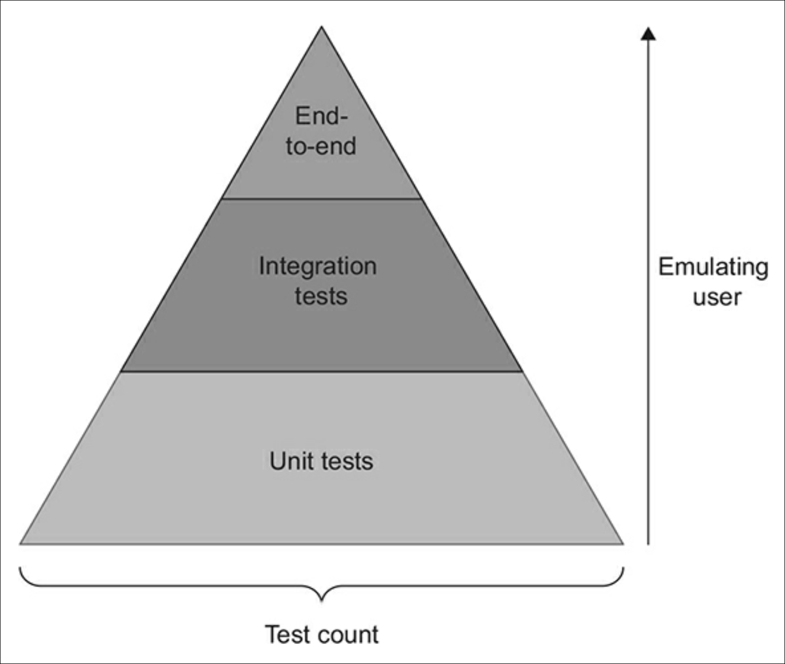
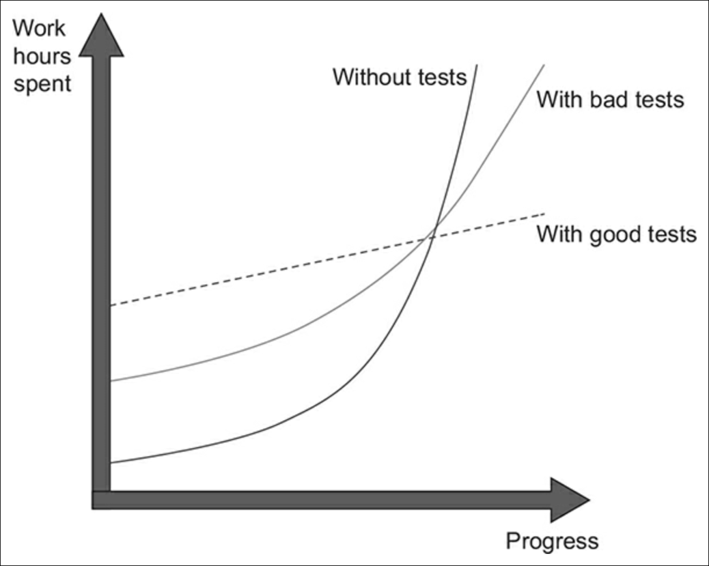
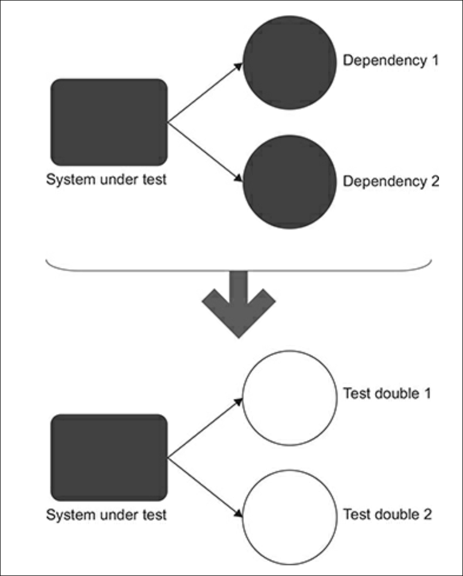
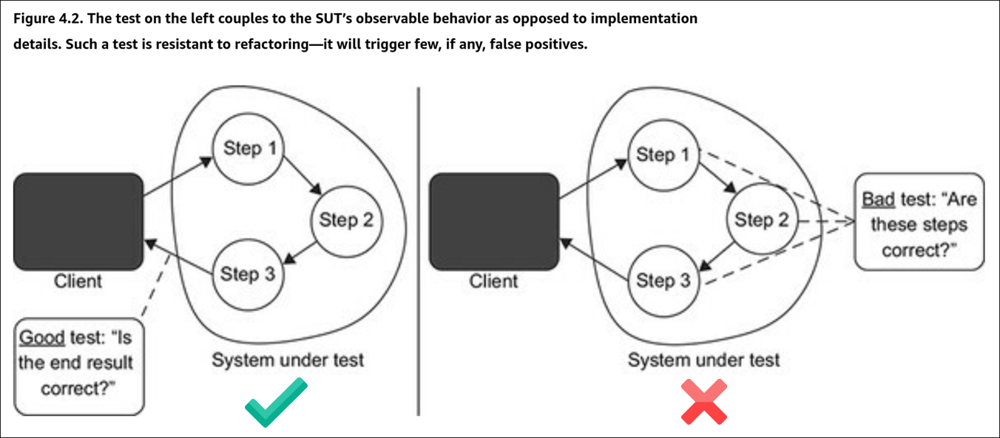
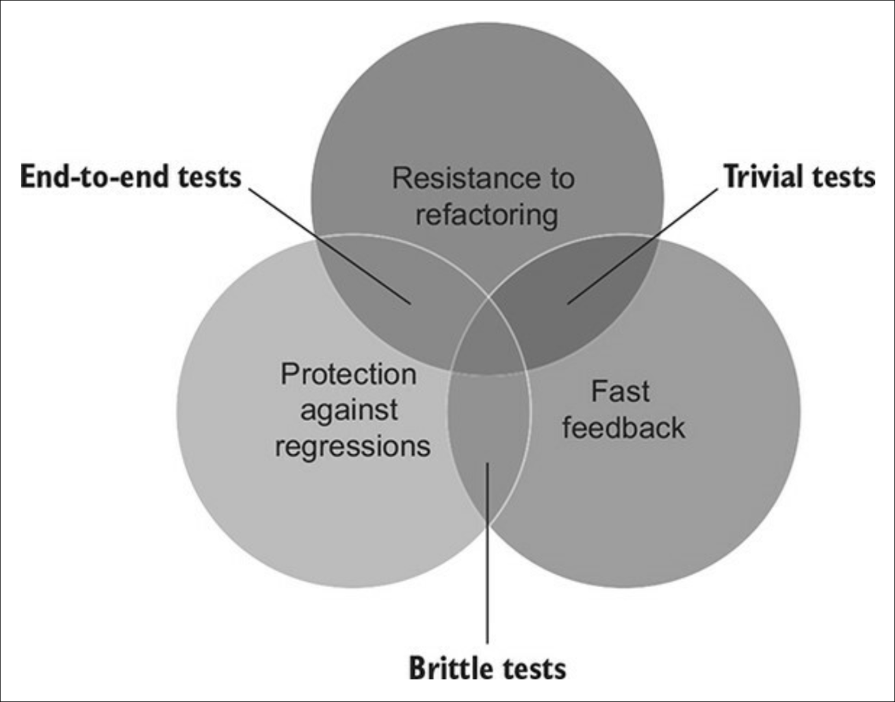

# Unit Testing Notes

This page covers my learnings on unit testing. Most of the material on this page comes from the book "Unit Testing: Principles, Practices, and Patterns" by Vladimir Khorikov.

Types of Testing in Software Development

The Test Pyramid represents the three major test types. The width of the pyramid refers to the prevalance of a particular type of test in the suite. The wider the layer, the greater the test count. The height is a measure of how close these tests are to emulating the user's behavior. 

Understanding the different types of testing suites is crucial in software development, as each type targets different aspects of an application and ensures its quality and reliability. Here are the key differences among some common types of testing suites:

1. **Unit Testing:**
   - **Focus:** The smallest parts of an application, typically individual functions or methods.
   - **Purpose:** To verify that each unit works as intended in isolation.
   - **Method:** Developers write these tests to check the correctness of their code. Mock objects and stubs are often used to isolate the unit from its dependencies.
   - **Example:** Testing a function that calculates the sum of two numbers.

2. **Integration Testing:**
   - **Focus:** The interaction between integrated units/modules of the application.
   - **Purpose:** To detect issues in the interaction between integrated units.
   - **Method:** These tests are typically written after unit tests and focus on the flow of data and control between modules. They may involve testing database interactions, API calls, etc.
   - **Example:** Testing how a database module interacts with a data processing module.

3. **End-to-End Testing:**
   - **Focus:** The entire application in a scenario that mimics real-world use.
   - **Purpose:** To replicate real-user scenarios to ensure the system works as intended.
   - **Method:** This involves testing the complete flow of an application from start to finish, including its interaction with external interfaces and networks.
   - **Example:** Testing an e-commerce application from product selection, cart management, checkout, payment, to order confirmation.

**Other Test Types**

The following tests types fall under the categories mentioned above:

- **Functional Testing:**
  - **Focus:** The overall functionality of the system.
  - **Purpose:** To ensure the software is functioning according to the requirements or specifications.
  - **Method:** Conducted from the user's perspective, it involves testing complete features or functionalities of the application.
  - **Example:** Testing the complete workflow of a user registration feature.

- **System Testing:**
  - **Focus:** The complete and integrated software product.
  - **Purpose:** To evaluate the system’s compliance with specified requirements.
  - **Method:** This is a high-level testing suite that validates the overall behavior of the application in an environment that mimics production.
  - **Example:** Testing the entire application after integration to ensure it meets all technical, functional, and business requirements.

- **Acceptance Testing:**
  - **Focus:** The software in a "production-like" environment.
  - **Purpose:** To validate if the software meets the business requirements and is ready for deployment.
  - **Method:** Often performed by end-users or clients, it checks if the software is acceptable for delivery.
  - **Example:** Business stakeholders testing the software to decide if it meets the predetermined criteria and is ready for release.

- **Regression Testing:**
  - **Focus:** Ensuring that new changes haven't adversely affected existing functionalities.
  - **Purpose:** To check that the old code still works after the new changes.
  - **Method:** Typically automated, it involves re-running functional and non-functional tests to ensure that previously developed and tested software still performs after a change.
  - **Example:** Re-running tests after bug fixes or new feature additions.

The Need for Unit Testing

Code tends to deteriorate. Each time you change something in a code base, the amount of disorder in it, or entropy, increases. Without proper care, such as constant cleaning and refactoring, the system becomes increasingly complex and disorganized. Tests help overturn this tendency.

_The goal of unit testing is to enable sustainable growth of the software project_. As projects progress through their lifecycle, stagnation occurs when there are no tests or the tests are of poor quality.

The mechanism by which unit tests enable sustainable growth is that they allow you to add new features and conduct regular refactorings without introducing regressions (i.e. bugs). There are two benefits here:

1. Tests provide an early warning when you break existing functionality
2. You become confident that your code changes won't lead to regressions

Keep in mind that not every test holds the same importance. While certain tests significantly enhance the quality of software, others may not be as effective. These less helpful tests often lead to unnecessary alerts, fail to detect regression issues, and can be cumbersome and challenging to maintain. It's common to get caught up in creating unit tests just for the sake of it, without truly understanding if they are beneficial to the project.

> Code is a liability, not an asset. The more code you introduce, the more you extend the surface area for potential bugs in your software, and the higher the project's upkeep cost. It's always better to solve problems with as little code as possible. Tests are code too.

About Code Coverage

A coverage metric shows how much source code a test suite examines, from none to 100%. However, code coverage metrics don't tell the full story for two reasons:
  
1. You can't guarantee that the test verifies all possible outcomes. 
2. No coverage metric can take into account code paths in external libraries

Per #1 above, code has explicit outcomes and implicit outcomes. An example of an explicit outcome is a value returned by a function. An example of an implicit outcome is a modification to a file by a function that returns no value. Code coverage metrics don't guarantee that the underlying code is tested; it only guarantees that the code has been executed at some point.

Per #2 above, external code paths may yield different results based on the input, and there's no way to see if your tests account for all possible outcomes.

> Targeting a specific coverage number creates a perverse incentive that goes against the goal of unit testing.

_The best way to view a coverage metric is as an indicator, not a goal in and of itself_. It's good to have a high level of coverage in core parts of your system.  It's bad to make this high level a requirement.

## Properties of Successful Test Suites

A successful test suite has the following properties:

- It's integrated into the development cycle
- It targets only the most important parts of your code base
- It provides maximum value with minimum maintenance costs

More info

The only point in having automated tests is if you constantly use them. All tests should execute on every code change, even the smallest one.

Not all parts of your code base are worth the same attention in terms of unit testing. It's important to direct your unit testing efforts to the most critical parts of the system; then verify the other parts of the system only briefly or indirectly.

The most critical part of the system is the _domain model_. The domain model refers to a conceptual model that represents the various entities, their attributes, roles, and relationship within a specific domain of knowledge or business. 

The _domain model_ should be where most of the unit testing effort takes place.

All other parts of the system can be divided into three categories:

- Infrastructure code
- External services and dependencies, such as the database and third-party systems
- Code that glues everything together

To follow this model, it's important to isolate the domain model from the non-essential parts of the code base.

The most difficult part of unit testing is achieving maximum value with minimum maintenance costs. The only way to achieve the goal of unit testing is to 

- Learn how to differentiate between a good test and a bad test
- Be able to refactor a test to make it more valuable

## What is a Unit Test?

A unit test is an automated test that

1. Verifies a small piece of code (also known as a unit),
2. Does it quickly, and
3. Does it in an isolated manner

The London Approach vs the Classicist Approach

Most people agree on the first and second points above. The third point, isolation, is so controversial that there are two distinct views on unit testing:

1. Detroit Approach (Classicist):

    - Focuses more on the state of the system after the unit's execution
    - Reflective of actual usage
    - How everyone originally approached unit testing and test-driven development

2. London Approach (Mockist):
  
    - Heavily relies on mock objects to isolate the unit from its dependencies
    - Encourages design where units are highly decoupled, leading to a more modular and flexible design
    - More granular tests that focus on the behavior of a single unit in isolation
    - Popular in Test-Driven Development (TDD)

The London school isolates the system under test from its collaborators (i.e. dependencies). It involves replacing all dependencies with a _test double_, which is an object that looks and behaves like its release-intended counterpart but is actually a simplified version that reduces the complexity and facilitates testing.  The term _test double_ comes from the idea of using a stunt double in movies.

The following image shows how a test double replaces the dependencies of the system under test. 

A benefit to this approach is that if the test fails, then you know for sure which part of the code base is broken: it's the system under test; it cannot be any of the dependencies because they have been removed.

Another benefit is that you don't have to recreate the full object graph in a test. Instead you can substitute the immediate dependencies of a class so that you don't have to deal with the dependencies of the dependencies.

In the Pester PowerShell testing suite, mocks are used as a test double. However, know that a mock is a special kind of test double that allows you to examine interactions between the system under test and its collaborators. Technically,

- A _test double_ is an overarching term that describes all kinds of non-production-ready, fake dependencies in a test
- A _mock_ is just one kind of such dependencies

In the classical approach, it's not the code that needs to be tested in an isolated manner; instead, the unit tests themselves should be run in isolation from each other. Isolating unit tests works fine so as long as they all reside in memory and don't reach out to a shared state, through which the tests can affect each other's execution context.  Typical examples of shared state are out-of-process dependencies&mdash;the database, the filesystem, and so on.

Dependency Types: 

- Shared dependency: a dependency that is shared between tests and provides means for those tests to affect each other's outcome. Examples: a static mutable field, a database.
- Private dependency: a dependency that is not shared.
- Out-of-process dependency: a dependency that runs outside the application's execution process. This type of dependency can be a shared dependency, such as a database used by both tests, or a private dependency, such as a database that runs isolated in a container.
- Volatile dependency: a dependency that either (1) introduces a requirement to set up and configure a runtime environment in addition to what's installed on the developer's machine (e.g. an API) or (2) contains nondeterministic behavior (e.g. a random number generator).

## The Anatomy of a Unit Test

A unit test tests a single unit of behavior, not a single unit of code.

Unit tests are structured using the arrange, act, and assert (AAA) pattern. In the arrange section, you bring the system under test (SUT) and its dependencies to a desired state. In the act section, you call methods on the SUT and capture the output value. In the assert section, you verify the outcome.

The arrange section is the largest section in terms of code.

The act section is typically one line of code. If you have more than one line in the act section, it is a sign of a problem with the SUT's API, which indicates that two actions must always be performed together, which can lead to inconsistencies.

## The Four Pillars of a Good Unit Test

A good unit test has the following four attributes:

1. Protection against regressions
2. Resistance to refactoring (most important)
3. Fast feedback
4. Maintainability

More details on the four pillars of a good unit test...

### Protection against regression

A regression (i.e. a software bug) refers to a situation where a previously functioning feature  stops working after changes. With regard to protection against regression, here are a few points to keep in mind:

`To maximize the metric of protection against regression, the test needs to aim at exercising as much code as possible.`

- The larger the amount of code that gets executed, the higher the chance that the test will reveal a regression.
- The complexity and domain significance is also important. Code that represents complex business logic is more important than boilerplate code.
- It's rarely worthwhile to test trivial code. Trivial code does not contain a substantial amount of business logic and won't provide much chance of finding a regression error.

Protection against regressions is a measure of how good the test is at indicateing the presence of bugs (regressions). The more code the test executes (both your code and the code of libraries and frameworks used in the project), the higher the chance the test will reveal a bug.

### Resistance to refactoring

Resistance to refactoring is the degree to which a test can sustain application code refactoring without producing a false alarm.

`To maximize the metric of resistance to refactoring, aim at the end result instead of implementation details.`

Refactoring means changing existing code without modifying its observable behavior. The intention of refactoring is usually to increase readability and reduce complexity. Resistance to refactoring is the degree to which a test can sustain a refactoring of the underlying application code without turning red (failing).

About false positives

False positives in unit tests that result from refactoring interfere with the benefits of units tests in the following ways:

1. They dilute your ability and willingness to react to problems in code. Over time, you get accustomed to failures and stop paying attention. After a while you start ignore legitimate failures, too.
2. When false positives are frequent, you lose trust in the test suite. This lack of trust leads to fewer refactorings, because you try to reduce code changes to a minimum to avoid regressions.

The only way to reduce false positives is to decouple the test from the implementation details. You need to make sure the test verifies the end result the SUT delivers: its observable behavior, not the steps it takes to do that test. Tests should approach SUT verification from the end user's point of view and check only the outcome meaningful to that end user. Everything else must be disregarded.

The best way to structure a test is to make it tell a story about the problem domain. Should a test fail, it means there's a disconnect between the story and the actual application behavior. All other tests are just noise that steer your attention away from things that matter.

Good unit tests focus on the end result. Bad unit tests focus on the implementation details.

### Fast feedback

Fast tests are an essential property of a unit test. The faster the tests, the more of them you can have in your test suite and the more often you can run them.

Slow tests delay feedback and discourage you from running them often.

Unit tests, by their isolated nature, are fast tests as compared to other types of tests, e.g. integration tests.

### Maintainability

The ability to maintain a unit test has two components:

1. How hard is it to understand the test
2. How hard is it to run the test

Understand the test is related to the size of the test. The fewer lines of code, the more readable the test is (assuming you don't try to compress the code artificially to reduce the line count). The quality of the test code matters. Don't cut corners when writing tests; treat the test code as a first-class citizen.

The test may be hard to run if it relies on out-of-process dependencies. For example, you may have to spend time keeping the dependencies operational, e.g. reboot the database server, resolve network connectivity issues.

### Determining Test Value

A test's value is the product of each of the four unit test pillars/attributes:

1. Protection against regressions
2. Resistance to refactoring
3. Fast feedback
4. Maintainability

If a test gets zero in one of the attributes, then the test value's result is zero.

The first three attributes are mutually exclusive. This makes it impossible to get a maximum score in all four attributes. End-to-end tests, test the whole system and its dependencies and therefore do not have fast feedback. Brittle tests yield many false positives and therefore have low resistance to refactoring. Trivial tests aren't comprehensive enough to catch regressions.

When needing to prioritize, resistance to refactoring is non-negotiable because whether a test possesses this attribute is mostly a binary choice: the test either has resistance to refactoring or it doesn't. The trade-off between the attributes comes down to choice between protection against regressions and fast feedback.

