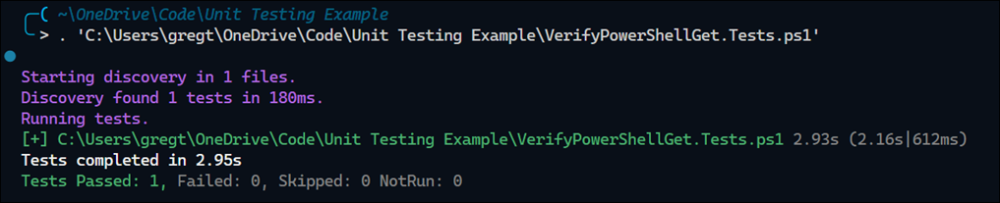

# Unit Testing with PowerShell

Example of a script that installs the latest version of the `PowerShellGet` module.

```powershell
# VerifyPowerShellGet.ps1
function VerifyPowerShellGet {
    [OutputType()]
    $minimumVersion = '2.2.5'
    $updateRequired = $true
    $installedVersion = Get-Module -Name PowerShellGet -ListAvailable |
        Sort-Object -Property Version -Descending |
        Select-Object -ExpandProperty Version |
        Select-Object -First 1
    if ($installedVersion -ge $minimumVersion) {
        Write-Information "PowerShellGet version is $installedVersion. No update required"
        $updateRequired = $false
    }
    if ($updateRequired) {
        Write-Information "PowerShellGet version is $installedVersion. Updating to version $minimumVersion..."
        $minimumVersion
        $installModuleSplat = @{
            Name               = 'PowerShellGet'
            Scope              = 'CurrentUser'
            Force              = $true
            AllowClobber       = $true
            SkipPublisherCheck = $true
            RequiredVersion    = $minimumVersion
        }
        Install-Module @installModuleSplat
        Write-Information "PowerShellGet updated to version $minimumVersion"
    }
}
```

Some things to note about this code: 

- The script makes a couple of calls to out-of-process dependencies. Out-of-process dependencies 

Here's a unit test for `VerifyPowerShellGet`:

```powershell
# VerifyPowerShellGet.ps1
BeforeAll {
    . $PSCommandPath.Replace(".Tests.ps1", ".ps1")
}

Describe "Verify PowerShellGet" {
    It 'Installs the required version of PowerShellGet if not already installed' {
        Mock Get-Module -ParameterFilter { $Name -eq 'PowerShellGet' } -MockWith {
            [PSCustomObject]@{ Name = 'PowerShellGet'; Version = '2.0.0' }
        }
        Mock Install-Module

        $result = VerifyPowerShellGet

        Should -Invoke -CommandName 'Install-Module' -Times 1
    }
}
```

Output: 



Some concern items about this test:

- The unit test is difficult to understand due to excessive use of Mocks
- There's no result of the function, i.e. no output to confirm the function results
- The only way to verify the result is to assert that `Install-Module` was called

The excessive use of Mocks becomes apparent when a PowerShell function makes many separate calls to out-of-process dependencies. Examples of out-of-process dependencies are calls to external resources, e.g. the file system, cloud services, etc. The more make calls to out-of-process dependencies, the slower the unit tests become, and the more we have to wait for the results.  

The last bullet point is most concerning because what if someone changed `Install-Module` to `Update-Module`?  The result of the test would then fail since `Install-Module` was never called.

Let's see how we can make this better...
