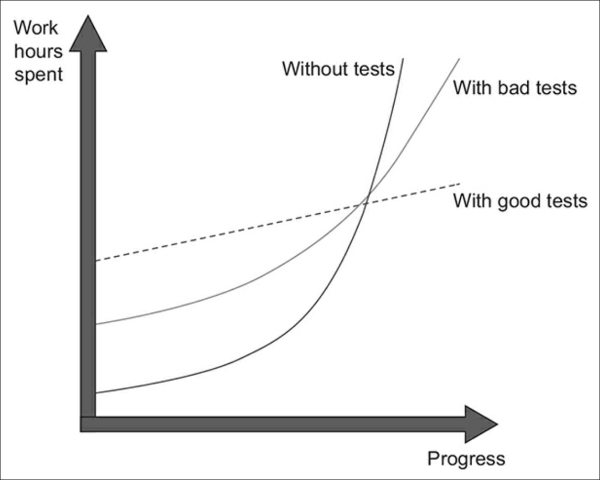
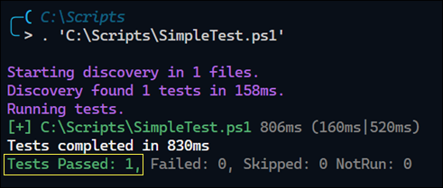
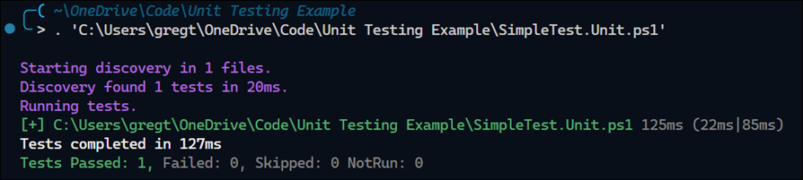
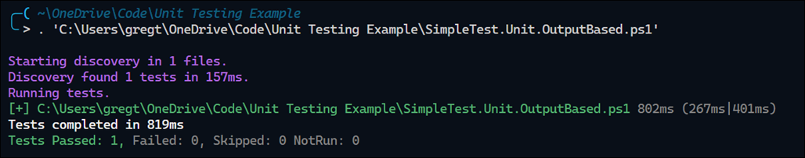
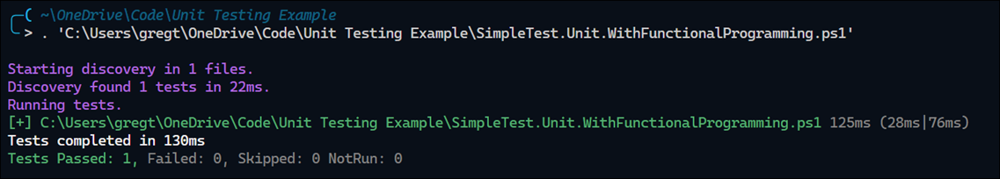

# Unit Testing with PowerShell

This article is for the IT admin who writes PowerShell scripts that are important to the company. Any PowerShell script that has some importance, complexity, and a long lifespan could benefit from the value and techniques this article provides.

As PowerShell scripts get more complex and the number of admins grows to manage the script, it becomes tougher to avoid introducing buggy code. Software engineers refer to buggy code as regressions.

For smaller PowerShell scripts, Visual Studio Code provides powerful, easy-to-use tools for squashing bugs. However, when the complexity of code increases, such as when using multiple, dependent custom PowerShell modules, it becomes increasingly difficult to avoid unintended side effects.

## Why testing
It is important to have an automated testing process to manage the unintended side effects. However, as the figure below illustrates, it's important to understand how to write good tests. Otherwise, bad tests will leave you in a similar predicament as without having any tests. 

<figure>
  
  <figcaption>Source: Unit Testing: Principles, Practices, and Patterns by Vladimir Khorikov</figcaption>
</figure>


## When to do testing


## Introducing a test

In PowerShell, test suites are written using the [`Pester`](https://pester.dev/) module. The term "pester" is a playful nod to what tests do: they persitently bother or "pester" the code to ensure it behaves as expected under various conditions.

Here's a basic example of a Pester test. 

```powershell
#SimpleTest.ps1
function Set-TextFile {
    Set-Content -Path "$PSScriptRoot\TextFile.txt" -Value 'Hello, World!'
}

Describe "Set-TextFile" {
    It "writes 'Hello, World!' to a text file" {

        # Call function
        Set-TextFile

        # Assert test result
        Get-Content -Path "$PSScriptRoot\TextFile.txt" | Should -Be "Hello, World!"
    }
}
```
Note the usage of `Describe`, `It`, and `Should`. In software testing, test cases are written in a human-readable format that describes the _expected behavior of the software_. That last part is important to remember, as effective tests prioritize the end result rather than the inner details. More on that later.

When you run this script in Visual Studio Code, the PowerShell extension recognizes the testing syntax and outputs the result.



Some things to note about this test. While it might appear to finish in a short time

TODO:

- The need for testing and when you should have tests
- Define a unit test
- Distinguish between a unit test and an integration test

## Introduction to Pester Testing

### The simple Pester test

The simplest case. This test confirms output to written to text file by calling `Get-Content`. Given that this test verifies an operation outside of the script's execution process, i.e. writing something to the file system, it is considered an integration test instead of a unit test.

```powershell
# SimpleTest.Integration.ps1
function Set-TextFile {
    Set-Content -Path "$PSScriptRoot\TextFile.txt" -Value 'Hello, World!'
}

Describe "Set-TextFile" {
    It "writes 'Hello, World!' to a text file" {

        # Call function
        Set-TextFile

        # Assert test result
        Get-Content -Path "$PSScriptRoot\TextFile.txt" | Should -Be "Hello, World!"
    }
}
```

Output: 


Explain here how many integration tests slow down the feedback cycle for development and therefore demonstrate the need for converting integration tests to unit tests.


### Avoiding the reliance on external dependencies

Converting from an integration test to a unit test

To convert from an integration test to a unit test, calls to external dependencies, such as the file system, must be replaced, with code that returns similar results.

In the prior code example, `Set-Content` was used to write content to the file system. 

In unit testing, Mocks are used replace the actions of `Set-Content`. Instead of making a change to the system, the Mock returns the same value as Set-Content, which is nothing. 

Instead of verifying the output written to an external dependency, you trust the command you issue will work as expected, and only check that the command to the external dependency is called. In this case, you only confirm that `Set-Content` would have been called and successfully executed givent that you have supplied it with the correct input.  

```powershell
#SimpleTest.Unit.ps1
function Set-TextFile {
    Set-Content -Path "$PSScriptRoot\TextFile.txt" -Value 'Hello, World!'
}

Describe "Set-TextFile" {
    It "writes 'Hello, World!' to a text file" {
        # Set up intercept to Set-Content
        Mock Set-Content

        # Call function
        Set-TextFile

        # Assert test result
        Should -Invoke -CommandName 'Set-Content' -Exactly 1
    }
}
```
Ouptut:



Explain the limitations of this test:

- The assertion check is tied to the implementation details

You can use at least three other ways to write a string to a text file:

```powershell
"Your string here" | Out-File -FilePath "path\to\your\file.txt"
Add-Content -Path "path\to\your\file.txt" -Value "Your string here"
[System.IO.File]::WriteAllText("path\to\your\file.txt", "Your string here")
```

### Avoiding dependence on implementation details

Convert to output-based testing

```powershell
# SimpleTest.Unit.OutputBased.ps1
function Set-TextFile {
    Set-Content -Path "$PSScriptRoot\TextFile.txt" -Value 'Hello, World!' -ErrorVariable error
    if (-not $error) { return $true }
}

Describe "Set-TextFile" {
    It "writes 'Hello, World!' to a text file" {
        # Set up intercept to Set-Content
        Mock Set-Content

        # Call function
        $result = Set-TextFile

        # Assert test result
        $result | Should -Be $true
    }
}
```

Output: 



### Avoiding the liberal use of Mocks

Converting to functional programming...

```powershell
# SimpleTest.Unit.WithOutputAndFunctionalProgramming.ps1
function Set-TextFile {
    param(
        $Path,
        $Message,
        [scriptblock]$SetContent = ${function:SetActualContent}
    )
    & $SetContent -Path $Path -Message $Message
}

function SetActualContent {
    param(
        $Path,
        $Message
    )
    Set-Content -Path $Path -Value $Message -ErrorVariable error
    if (-not $error) { return $true }
}

Describe "Set-TextFile" {
    It "writes a message' to a text file" {
        # Arrange test data
        $message = 'Hello, World!'
        $path = "$PSScriptRoot\TextFile.txt"
        $setTestContent = { return $true }

        # Call function
        $result = Set-TextFile -Path $path -Message $message -SetContent $setTestContent

        # Assert test result
        $result | Should -Be $true
    }
}
```

Output:



Things to note:

- The call to `SetActualContent` is never made, and therefore the call to `Set-Content` is never made
- No use of Mocks
- 

## For later

When developming PowerShell modules for use with a CI/CD pipeline, you need tools that facilitate the buiding and publishing of PowerShell modules.

The `PowerShellGet` module has tools that ena

e the `PowerShellGet` module to demonstrate the development of unit tests. When developing modules for use with a CI/CD pipeline, 

The `PowerShellGet` module is an interesting test case

The `PowerShellGet` module has commands, like `Install-Module` that make it easy to search for and install PowerShell modules. The 1.0-version of this module is installed by default in Windows. Later versions introduce additional functionality, such as `Update-ModuleManifest`, that cater to developing and publishing your own PowerShell module.

Example of a script that installs the latest version of the `PowerShellGet` module.

```powershell
# VerifyPowerShellGet.ps1
function VerifyPowerShellGet {
    [OutputType()]
    $minimumVersion = '2.2.5'
    $updateRequired = $true
    $installedVersion = Get-Module -Name PowerShellGet -ListAvailable |
        Sort-Object -Property Version -Descending |
        Select-Object -ExpandProperty Version |
        Select-Object -First 1
    if ($installedVersion -ge $minimumVersion) {
        Write-Information "PowerShellGet version is $installedVersion. No update required"
        $updateRequired = $false
    }
    if ($updateRequired) {
        Write-Information "PowerShellGet version is $installedVersion. Updating to version $minimumVersion..."
        $minimumVersion
        $installModuleSplat = @{
            Name               = 'PowerShellGet'
            Scope              = 'CurrentUser'
            Force              = $true
            AllowClobber       = $true
            SkipPublisherCheck = $true
            RequiredVersion    = $minimumVersion
        }
        Install-Module @installModuleSplat
        Write-Information "PowerShellGet updated to version $minimumVersion"
    }
}
```

Some things to note about this code: 

- The script uses `Get-Module`, which looks for the `PowerShellGet` module
- The scritp may call `Install-Module` to install the latest version of `VerifyPowerShellGet`


Here's a unit test for `VerifyPowerShellGet`:

```powershell
# VerifyPowerShellGet.ps1
BeforeAll {
    . $PSCommandPath.Replace(".Tests.ps1", ".ps1")
}

Describe "Verify PowerShellGet" {
    It 'Installs the required version of PowerShellGet if not already installed' {
        Mock Get-Module -ParameterFilter { $Name -eq 'PowerShellGet' } -MockWith {
            [PSCustomObject]@{ Name = 'PowerShellGet'; Version = '2.0.0' }
        }
        Mock Install-Module

        $result = VerifyPowerShellGet

        Should -Invoke -CommandName 'Install-Module' -Times 1
    }
}
```

Output: 


Some concern items about this test:

- The unit test is difficult to understand due to excessive use of Mocks
- There's no result of the function, i.e. no output to confirm the function results
- The only way to verify the result is to assert that `Install-Module` was called

The excessive use of Mocks becomes apparent when a PowerShell function makes many separate calls to out-of-process dependencies. Examples of out-of-process dependencies are calls to external resources, e.g. the file system, cloud services, etc. The more make calls to out-of-process dependencies, the slower the unit tests become, and the more we have to wait for the results.  

The last bullet point is most concerning because what if someone changed `Install-Module` to `Update-Module`?  The result of the test would then fail since `Install-Module` was never called.

Let's see how we can make this better...
