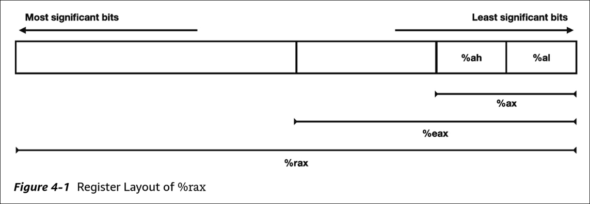

# Assembly Language Notes

- [Getting Started](#getting-started)
  - [A simple assembly program](#a-simple-assembly-program)
    - [Code Explanation](#code-explanation)
    - [Command explanation:](#command-explanation)
    - [Debugging guidance](#debugging-guidance)
  - [AT\&T syntax vs NASM syntax](#att-syntax-vs-nasm-syntax)
- [Registers and Simple Arithmetic](#registers-and-simple-arithmetic)
  - [Simple Arithmetic Instructions](#simple-arithmetic-instructions)
  - [Register Layouts](#register-layouts)
  - [General-Purpose Registers](#general-purpose-registers)

## Getting Started

The structure of this page follows the book "Learn to Program with Assembly" by Jonathan Bartlett. This book is a comprehensive guide designed to introduce new programmers to the fundamentals of assembly language programming. The book demystifies how computers work at the most fundamental level, arguing that understanding assembly language is crucial for programmers to truly grasp how their tools—the processors—operate. 

It covers basic to advanced concepts in assembly language, including data handling, arithmetic operations, system calls, and more, using the x86-64 architecture and focusing on Linux-based operating systems. The text is structured to be accessible for beginners with no prior experience in programming while providing valuable insights for more experienced programmers. By learning assembly language, readers are expected to gain a deeper understanding of their computers, enabling them to write more efficient code and tackle complex programming challenges that may require low-level system access or optimization.

References:

- [Apress: Learn to Program with Assembly](https://www.amazon.com/Learn-Program-Assembly-Foundational-Programmers/dp/1484274369/ref=sr_1_1?crid=1QMJ66XZ89N6X&keywords=learn+to+program+with+assembly&qid=1702762822&sprefix=learn+to+program+with+assembly%2Caps%2C109&sr=8-1)
- [Apress Source Code](https://github.com/Apress/learn-to-program-w-assembly)

### A simple assembly program

Here's a look at the simplest assembly program. The following program does nothing. It just exits with a status code of 3.

```asm
# myexit.s
# A simple assembly program that launches and exits with status code '3'.

.globl _start

.section .text

_start:
    movq $60, %rax
    movq $3, %rdi
    syscall
```

#### Code Explanation

`.globl _start`:

- The term `.globl` is called a directive. It can also be spelled `.global`. In assembly language, the `.globl` directive is used to declare a symbol (such as a function or a variable) as global. This means that the symbol can be accessed from other files or modules beyond the one in which it's defined. In other words, it makes the symbol visible to the linker, allowing it to be used across different assembly files or even from C or C++ code.

- The term `_start` is a global symbol, which makes it visible to the linker. The _start label is the conventional entry point for an executable in Linux, similar to the main function in C. When the program is executed, the execution starts from_start.

- **Linker Visibility**: When you compile and link multiple assembly or C/C++ files together, the `.globl` directive ensures that the symbol is recognized and can be linked across these files.

- **Common Use Case**: One common use is for functions. For instance, if you define an assembly function that you want to call from C code, you would mark this function with `.globl`.

- **Syntax**: The syntax generally looks like `.globl` symbol_name, where symbol_name is the name of the function or variable you want to make global.

- **Not a Definition**: It's important to note that `.globl` does not define the symbol; it only declares it as global. The actual definition of the symbol (the code of the function or the value of the variable) must be provided elsewhere in the assembly code.

- **Compatibility**: The exact syntax and behavior can vary slightly between different assemblers (such as GAS for GNU/Linux systems or MASM for Windows), but the general concept remains the same.

`.section .text`:  

- This directive indicates the start of the `.text` section, which is where the executable code resides. In assembly language, code and data are typically organized into sections, and `.text` is the standard name for the code section.

`_start:`:  

- This line defines the label `_start`, marking the beginning of the code to be executed. As mentioned earlier, this is where the program execution begins.

`movq $60, %rax`:  

- This instruction moves the value `60` into the rax register. In the context of Linux system calls, the rax register is used to specify the system call number. `60` is the system call number for exit, which terminates the program.

`movq $3, %rdi`:  

- This instruction moves the value `3` into the `rdi` register. For system calls, `rdi` is used to pass the first argument. In the case of the exit system call, this argument is the exit status of the program. Here, the program is being instructed to exit with status `3`.

`syscall`:  

- This instruction triggers a system call. It tells the kernel to perform the function indicated by the value in `rax`, with additional arguments (if any) passed through registers like `rdi`. In this case, it's invoking the exit system call with an exit status of `3`.

Here are the commands used to assemble, link, and execute the program. Note the value `3` when echoing the exit status, i.e. `echo $?`


#### Command explanation:

`as myexit.s -o myexit.o`:

- `as` is the assembler that converts assembly code into machine code.
- `myexit.s` is the source file containing the assembly code.
- `-o myexit.o` specifies the output file name (myexit.o). This file is an object file, which contains machine code but is not yet executable.

`ld myexit.o -o myexit`:

- `ld` is the linker. It takes one or more object files and combines them into a single executable file, resolving any symbols and addresses in the process.
`myexit.o` is the input object file generated by the assembler.
- `-o myexit` specifies the output file name (myexit). This file is the final executable.

`./myexit`:

- This command runs the executable file myexit.
- If the program is written correctly, it will execute and then terminate, possibly returning an exit status to the shell.

`echo $?`:

- `echo` is a command to display a line of text.
_ `$?` is a special shell variable that holds the exit status of the most recently executed foreground command (in this case, `./myexit`).
- This command prints the exit status returned by the `myexit` program.


#### Debugging guidance

To debug assembly you must specify the `-g` flag when assembling and linking.
This flag tells the assembler and linker to include debugging information in the
executable. This information is used by the debugger to map the machine code
back to the original source code.

The following VS Code task configuration demonstrates the use of the GNU
Assembler command, `as`, to assemble the source code with the `-g` flag.


There are a number of VS Code extensions that will debug assembly code.  My two favorite ones are:

- [Native Debug](https://marketplace.visualstudio.com/items?itemName=webfreak.debug)
- [CodeLLDB](https://marketplace.visualstudio.com/items?itemName=vadimcn.vscode-lldb)

Both debuggers require you to configure a debug task in the `launch.json` file. The following configuration is what I use. Each debugger has specific configuration fields.  

```json
{
    "version": "0.2.0",
    "configurations": [
        {
            "name": "LLDB: Launch (CodeLLDB)",
            "type": "lldb",
            "request": "launch",
            "stopOnEntry": true,
            "program": "${workspaceFolder}/${fileBasenameNoExtension}",
            "console": "internalConsole",
            "internalConsoleOptions": "neverOpen",
            "terminal": "integrated",
            "preLaunchTask": "Assemble and Link"
        },
        {
            "name": "GDB: Launch (Native Debug)",
            "type": "gdb",
            "request": "launch",
            "target": "${workspaceFolder}/${fileBasenameNoExtension}",
            "cwd": "${workspaceRoot}",
            "preLaunchTask": "Assemble and Link",
        },
}
```

Both debuggers utilize `gdb`. The **Native Debug** debugger provides an easier experience up front. It's advantages over the CodeLLDB debugger include:

1. Specify break points in the source file without having a separate disassembly window
2. Prints registers in decimal instead of hexadecimal
3. Does not require you to pause on program start

Here's a screenshot of debugging in **Native Debug**: 


When debugging with **CodeLLDB**, you can install the `lldb` debugger and get a disassembly view of the code. This view allows you to see the virtual memory address along with the operation codes.  


The registers window shows value in hexadecimal instead of decimal:


With the **CodeLLDB** debugger you cannot set breakpoints directly on the assembly source file; you must set the breakpoints on the disassembly file. This makes working with **CodeLLDB** slightly more cumbersome.

### AT&T syntax vs NASM syntax

The assembly language syntax used by the GNU assembler is known as AT&T syntax.
This syntax is the native syntax for the Linux kernel and output by the GNU
Compiler Collection (GCC). The GNU assembler was launched in 1983 by Richard
Stallman as part of the GNU Project. The GNU assembler is also known as GAS.

Another commonly-used syntax, NASM syntax, is also referred to as Intel syntax.
NASM, which stands for Netwide Assembler, is considered to be easier to read and
understand than AT&T syntax. NASM, although developed independently from Intel,
is associated with Intel because NASM employs the Intel syntax originally used
in Intel's documentation and assemblers for its x86 architecture processors. The
NASM assembler was introduced in 1996, almost 13 years after the GNU assembler.

| Feature                 | AT&T Syntax                                | NASM Syntax                                           |
|-------------------------|--------------------------------------------|-------------------------------------------------------|
| Capitalization          | Case-insensitive (lowercase)               | Case-sensitive (all uppercase)                        |
| Register Naming         | Prefix with `%`, e.g. %rax                 | No prefix, e.g. RAX                                   |
| Immediate-Mode Prefixes | `$`                                        | No prefix                                             |
| Operand Order           | Source, Destination                        | Destination, Source                                   |
| Memory Addressing Modes | `segment:displacement(base, index, scale)` | `[base + index*scale + displacement]`                 |
| Operand Sizes           | Suffixed with size (`b`, `w`, `l`, `q`)    | Prefixed with size (`byte`, `word`, `dword`, `qword`) |

The difference in operand order is, perhaps, the most difficult difference to
overcome. The difference reflects their separate historical developments and
design philosophies. The Intel syntax is more intuitive because it focuses on a
destination-first approach, which aligns with the the concept of assigning a
value to a variable in high-level languages.

The AT&T syntax was influenced by earlier assembly language conventions and the
desire to maintain consistency with existing UNIX tools and practices. AT&T
syntax uses a source-first order, which means the source operand is written
first, followed by the destination.

It's important to note that there were no universal standards for assembly
language when these syntaxes were being developed.

## Registers and Simple Arithmetic

Registers play a critical role in CPU operations, serving as fast, accessible storage for temporary data, pointers, and control information during program execution.

Register names vary across different processor architectures, with each having its own set of registers and naming conventions. Below are examples from a few common architectures to illustrate the variety:

x86-64 Architecture (Common in PCs and Servers):

- **General Purpose Registers:**
  - `%rax` - Accumulator Register
  - `%rbx` - Base Register
  - `%rcx` - Counter Register
  - `%rdx` - Data Register
  - `%rsi` - Source Index
  - `%rdi` - Destination Index
  - `%rbp` - Base Pointer
  - `%rsp` - Stack Pointer
  - `%r8` to `%r15` - Additional General-Purpose Registers in 64-bit mode

- **Special Purpose Registers:**
  - `%rip` - Instruction Pointer
  - `%eflags`/`%rflags` - Flags Register

ARM Architecture (Common in Mobile Devices):

- **General Purpose Registers:**
  - `R0` to `R12` - General-Purpose Registers
  - `SP` (`R13`) - Stack Pointer
  - `LR` (`R14`) - Link Register
  - `PC` (`R15`) - Program Counter

- **Special Registers:**
  - `CPSR` - Current Program Status Register

These examples highlight the diversity in register design across different architectures. Each set is tailored to the operational model and instruction set of its respective CPU design. 

### Simple Arithmetic Instructions

| Instruction | Example           | Description                                                                                                                                                                                                                                            |
|-------------|-------------------|--------------------------------------------------------------------------------------------------------------------------------------------------------------------------------------------------------------------------------------------------------|
| `movq`      | `movq $60, %rax`  | Stores the decimal value of 60 into the `%rax` register                                                                                                                                                                                                |
| `addq`      | `addq %rax, %rdi` | Takes the value of `%rax`, adds it to `%rdi`, and stores it in `%rdi`                                                                                                                                                                                  |
| `addq`      | `addq $25, %rdi`  | Takes the decimal value of 25, adds it to `%rdi`, and stores it in `%rdi`                                                                                                                                                                              |
| `subq`      | `subq $10, %rax`  | Subtracts 10 from the current value in `%rax` and stores it in `%rax`                                                                                                                                                                                  |
| `incq`      | `incq %rax`       | Increases value stored in a register or memory location by one                                                                                                                                                                                         |
| `decq`      | `decq %rax`       | Decreases value stored in a register or memory location by one                                                                                                                                                                                         |
| `mulq`      | `mulq %rdi`       | Multiplies the number stored in `%rdi` by `%rax` and stores it in `%rax`. A number cannot be used as the source&mdash;it must be a register or memory location.                                                                                        |
| `divq`      | `divq %rdi`       | Divides `%rax` by the source. `%rax%` is the destination. A number cannot be used as the source&mdash;it must be a register or memory. The remainder is stored in another register, `%rdx`, which should be set to zero before the instruction occurs. |

For `mulq` and `divq` the destination is _implicit_ in the instruction. That is, we never write `%rax`; it is implied by the instruction itself.

The following program demonstrates the use of basic arithmetic operations.

```asm
# arithmetic.s
.global _start

.section .text

_start:
    # Perform various arithmetic functions
    movq $3, %rdi               # %rdi = 3
    movq %rdi, %rax             # %rdi = 3, %rax = 3
    addq %rdi, %rax             # %rdi = 3, %rax = 6
    mulq %rdi                   # %rdi = 3, %rax = 18
    movq $2, %rdi               # %rdi = 2
    addq %rdi, %rax             # %rdi = 2, %rax = 20
    movq $4, %rdi               # %rdi = 4, %rax = 20
    mulq %rdi                   # %rdi = 4, %rax = 80
    movq %rax, %rdi             # %rdi = 80, %rax = 80
    movq $0, %rdx               # %rdx = 0
    movq $20, %rdi              # %rdi = 20, %rax = 80, %rdx = 0
    divq %rdi                   # %rax = 4, %rdi = 20, %rdx = 0

    # Set the exit system call number
    movq $60, %rax              # %rax = 60

    # Perform the system call
    syscall

```

### Register Layouts

Section 4.2 "Register Layouts" explains the evolution and structure of registers in the x86-64 architecture, highlighting how these components have grown from their 16-bit origins to their current 64-bit implementations. Here are the key points from this section:

1. **Historical Evolution**: The naming conventions for registers (e.g., `%rax`, `%rdi`, `%rdx`) are derived from the history of the instruction set architecture (ISA), which evolved from a 16-bit to a 32-bit and finally to a 64-bit ISA. This evolution is reflected in the register names, where `%ax` was extended to `%eax` for 32-bit, and further to `%RAX` for 64-bit .

2. **Register Layouts and Naming Conventions**: Registers are designed to be backward compatible, where `%rax` includes the entire 64-bit register, `%eax` refers to the lower 32 bits, and `%ax` to the lower 16 bits. Further subdivisions allow access to high and low bytes within the 16-bit segment (`%ah` and `%al`, respectively) .

    

3. **Significance of Bits**: The terminology "most significant bits" and "least significant bits" is explained through the analogy of decimal numbers, emphasizing how changes to digits on the left (most significant) have a greater impact on the number's value than changes to digits on the right (least significant) .

### General-Purpose Registers

Section 4.3 "The General-Purpose Registers" discusses the characteristics and uses of the x86-64 ISA's 16 general-purpose registers. Key takeaways include:

1. **General Purpose Definition**: Although all 16 registers are considered general-purpose, meaning they can be specified as the source or destination for many instructions, they do have specific roles or uses in certain contexts .

2. **Computational Registers**: Four of these registers (`%rax`, `%rbx`, `%rcx`, `%rdx`) are primarily used for general computation. They can be broken down into smaller units for specific operations, such as accessing individual bytes, which is useful for operations centered around byte-organized data .

   - `%rax`: The accumulator, used widely for computation.
   - `%rbx`: The base register, often used for indexed addressing.
   - `%rcx`: The counter register, used for loops.
   - `%rdx`: The data register, significant in arithmetic and I/O operations .

3. **Other General-Purpose Registers**: Mainly focused on specific tasks like pointer and memory operations. These registers do not support accessing individual bytes directly .

   - `%rsi`: This is the "source index" register. It has special uses for working with longer spans of memory.
   - `%rdi`: This is the "destination index" register. It is often used in conjunction with `%rsi` for working with longer spans of memory
   - `%rbp`: This is the "base pointer". Discussed later in Chapter 11.
   - `%rsp`: This is the "stack pointer". Discussed later in Chapter 11. 

4. **New Registers in x86-64**: The introduction of eight new registers (`%r8` to `%r15`) in the x86-64 architecture expanded the general-purpose register set from those available in the 32-bit architecture, adding more versatility and supporting operations across different data sizes. The count for these registers starts at 8 because the eight registers above are considered to occupy numbers 0 through 7. These registers do have 32-bit and 16-bit versions. You can refer to the 32-bit version by specifying `%r11d` and the 16-bit version by specifying `%r11w` and the least significant (low) byte by specifying `%r11b`.
