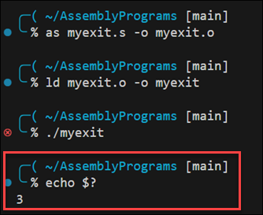
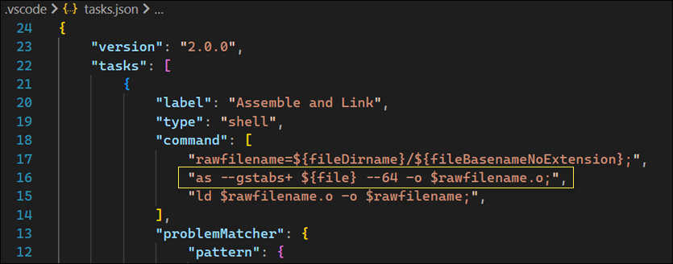
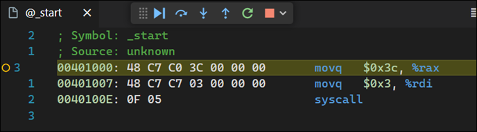
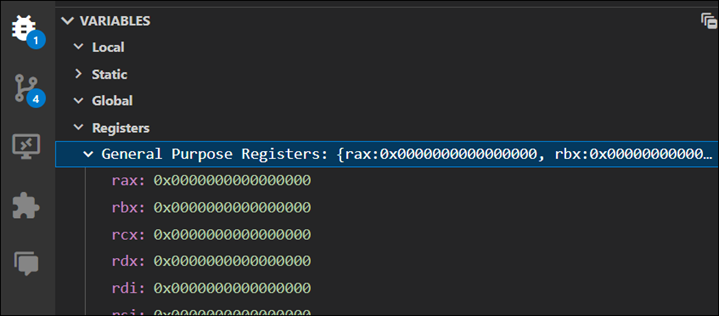

# Assembly Language Notes

This page covers my journey on learning assembly language. Why learn assembly language? Mostly for educational reasons. I want to have a better understanding of how computers operate at a lower level. I hope to use this understanding to help me write more efficient code in higher-level languages. Since I'm a security professional, one day I may use my assembly skills to reverse engineer exploitation techniques at a lower level.

## References

- [Apress: Learn to Program with Assembly](https://www.amazon.com/Learn-Program-Assembly-Foundational-Programmers/dp/1484274369/ref=sr_1_1?crid=1QMJ66XZ89N6X&keywords=learn+to+program+with+assembly&qid=1702762822&sprefix=learn+to+program+with+assembly%2Caps%2C109&sr=8-1)
- [Apress Source Code](https://github.com/Apress/learn-to-program-w-assembly)

## A Simple Assembly Program

Here's a look at the simplest assembly program. The following program does nothing. It just exits with a status code of 3.

```nasm
# myexit.s
# A simple assembly program that launches and exits with status code '3'.

.globl _start

.section .text

_start:
    movq $60, %rax
    movq $3, %rdi
    syscall
```

Here are the commands used to assemble, link, and execute the program. Note the value `3` when echoing the exit status, i.e. `echo $?`



<details>
  <summary>Command Explanation</summary>

**`as myexit.s -o myexit.o`**:

- `as` is the assembler that converts assembly code into machine code.
- `myexit.s` is the source file containing the assembly code.
- `-o myexit.o` specifies the output file name (myexit.o). This file is an object file, which contains machine code but is not yet executable.

**`ld myexit.o -o myexit`**:

- `ld` is the linker. It takes one or more object files and combines them into a single executable file, resolving any symbols and addresses in the process.
`myexit.o` is the input object file generated by the assembler.
- `-o myexit` specifies the output file name (myexit). This file is the final executable.

**`./myexit`**:

- This command runs the executable file myexit.
- If the program is written correctly, it will execute and then terminate, possibly returning an exit status to the shell.

**`echo $?`**:

- `echo` is a command to display a line of text.
_ `$?` is a special shell variable that holds the exit status of the most recently executed foreground command (in this case, `./myexit`).
- This command prints the exit status returned by the `myexit` program.

</details>

<details>
  <summary>Code Explanation</summary>

**`.globl _start`**:

- The term `.globl` is called a directive. It can also be spelled `.global`. In assembly language, the `.globl` directive is used to declare a symbol (such as a function or a variable) as global. This means that the symbol can be accessed from other files or modules beyond the one in which it's defined. In other words, it makes the symbol visible to the linker, allowing it to be used across different assembly files or even from C or C++ code.

- The term `_start` is a global symbol, which makes it visible to the linker. The _start label is the conventional entry point for an executable in Linux, similar to the main function in C. When the program is executed, the execution starts from_start.

- **Linker Visibility**: When you compile and link multiple assembly or C/C++ files together, the `.globl` directive ensures that the symbol is recognized and can be linked across these files.

- **Common Use Case**: One common use is for functions. For instance, if you define an assembly function that you want to call from C code, you would mark this function with `.globl`.

- **Syntax**: The syntax generally looks like `.globl` symbol_name, where symbol_name is the name of the function or variable you want to make global.

- **Not a Definition**: It's important to note that `.globl` does not define the symbol; it only declares it as global. The actual definition of the symbol (the code of the function or the value of the variable) must be provided elsewhere in the assembly code.

- **Compatibility**: The exact syntax and behavior can vary slightly between different assemblers (such as GAS for GNU/Linux systems or MASM for Windows), but the general concept remains the same.

**`.section .text`**:  

- This directive indicates the start of the `.text` section, which is where the executable code resides. In assembly language, code and data are typically organized into sections, and `.text` is the standard name for the code section.

**`_start:`**:  

- This line defines the label `_start`, marking the beginning of the code to be executed. As mentioned earlier, this is where the program execution begins.

**`movq $60, %rax`**:  

- This instruction moves the value `60` into the rax register. In the context of Linux system calls, the rax register is used to specify the system call number. `60` is the system call number for exit, which terminates the program.

**`movq $3, %rdi`**:  

- This instruction moves the value `3` into the `rdi` register. For system calls, `rdi` is used to pass the first argument. In the case of the exit system call, this argument is the exit status of the program. Here, the program is being instructed to exit with status `3`.

**`syscall`**:  

- This instruction triggers a system call. It tells the kernel to perform the function indicated by the value in `rax`, with additional arguments (if any) passed through registers like `rdi`. In this case, it's invoking the exit system call with an exit status of `3`.

</details>

<details>
  <summary>Debugging Guidance</summary>

To debug assembly you must specify the `-g` flag when assembling and linking.
This flag tells the assembler and linker to include debugging information in the
executable. This information is used by the debugger to map the machine code
back to the original source code.

The following VS Code task configuration demonstrates the use of the GNU
Assembler command, `as`, to assemble the source code with the `-g` flag.



You can use the GDB debugger to step through the assembly code. However, the
[CodeLLDB](https://marketplace.visualstudio.com/items?itemName=vadimcn.vscode-lldb)
extension for VS Code provides a more user-friendly experience. After installing
the lldb debugger and the CodeLLDB extension, you can use the following VS Code
configuration to debug the assembly code:


When debugging with CodeLLDB, you get the disassembly view of the code.



You can also view registers in the Variables window.



</details>

## Assembly Language Syntax

The assembly language syntax used by the GNU assembler is known as AT&T syntax.
This syntax is the native syntax for the Linux kernel and output by the GNU
Compiler Collection (GCC). The GNU assembler was launched in 1983 by Richard
Stallman as part of the GNU Project. The GNU assembler is also known as GAS.

Another commonly-used syntax, NASM syntax, is also referred to as Intel syntax.
NASM, which stands for Netwide Assembler, is considered to be easier to read and
understand than AT&T syntax. NASM, although developed independently from Intel,
is associated with Intel because NASM employs the Intel syntax originally used
in Intel's documentation and assemblers for its x86 architecture processors. The
NASM assembler was introduced in 1996, almost 13 years after the GNU assembler.

| Feature                      | AT&T Syntax                          | NASM Syntax                          |
|------------------------------|--------------------------------------|--------------------------------------|
| Capitalization               | Case-insensitive (lowercase)         | Case-sensitive (all uppercase)       |
| Register Naming              | Prefix with `%`, e.g. %rax           | No prefix, e.g. RAX                  |
| Immediate-Mode Prefixes      | `$`                                  | No prefix                            |
| Operand Order                | Source, Destination                  | Destination, Source                  |
| Memory Addressing Modes      | `segment:displacement(base, index, scale)` | `[base + index*scale + displacement]` |
| Operand Sizes                | Suffixed with size (`b`, `w`, `l`, `q`) | Prefixed with size (`byte`, `word`, `dword`, `qword`) |

The difference in operand order is, perhaps, the most difficult difference to
overcome. The difference reflects their separate historical developments and
design philosophies. The Intel syntax is more intuitive because it focuses on a
destination-first approach, which aligns with the the concept of assigning a
value to a variable in high-level languages.

The AT&T syntax was influenced by earlier assembly language conventions and the
desire to maintain consistency with existing UNIX tools and practices. AT&T
syntax uses a source-first order, which means the source operand is written
first, followed by the destination.

It's important to note that there were no universal standards for assembly
language when these syntaxes were being developed.

## Register Descriptions

In the AT&T syntax, registers are prefixed with a `%` to distinguish from other types of identifiers, such as variables or labels.

<details><summary>The RAX Register</summary>

**RAX**  
The RAX register is a general-purpose register in x86-64 architecture, which is an extension of the original x86 architecture. This register is part of the family of registers that originated with the 16-bit AX register in the x86 architecture. Here's a breakdown of its evolution and uses:

**Evolution of the AX Register:**

**AX:** In 16-bit x86 architecture, AX was one of the primary registers. It was often used for arithmetic, logical operations, and data transfer.  
**EAX:** With the advent of 32-bit x86 architecture, AX was extended to EAX to support 32-bit processing.  
**RAX:** In the x86-64 architecture, EAX was further extended to RAX to support 64-bit processing. The "R" in RAX stands for "register" in 64-bit architecture.  

**Usage of RAX:**

**Accumulator for Arithmetic Operations:** RAX often acts as an accumulator in arithmetic operations (like addition, multiplication, etc.), where it stores results.

**Return Value from Functions:** In many calling conventions, RAX is used to store the return value of a function. When a function completes, it places its return value in RAX.

**Data Manipulation and Transfer:** It is used for general data manipulation and transfer operations.

**Compatibility with Previous Architectures:** RAX is backward compatible with EAX, AX, and AL, meaning that software written for older x86 architectures can still operate on the x86-64 system. RAX includes EAX as its lower 32 bits, AX as the lower 16 bits of EAX, and AL as the lower 8 bits of AX.

**General Purpose Nature:**

Like other general-purpose registers (RBX, RCX, RDX, etc.), RAX can be used for various purposes by different programs. Its exact use can depend on the context of the program or the requirements of a specific software application.

</details>


## Assembly Instructions

| Instruction | Example | Description |
| - | - | - |
| `movq` | `movq $60, %rax` | Stores the decimal value of 60 into the `%rax` register | 
| `addq` | `addq %rax, %rdi` | Takes the value of `%rax`, adds it to `%rdi`, and stores it in `%rdi` |
| `addq` | `addq $25, %rdi` | Takes the decimal value of 25, adds it to `%rdi`, and stores it in `$rdi` |
|  


