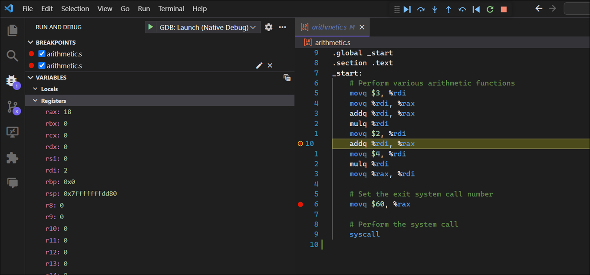

# Assembly Language Notes

This page covers my journey on learning assembly language. Why learn assembly language? Mostly for educational reasons. I want to have a better understanding of how computers operate at a lower level. I hope to use this understanding to help me write more efficient code in higher-level languages. Since I'm a security professional, one day I may use my assembly skills to reverse engineer exploitation techniques at a lower level.

## References

- [Apress: Learn to Program with Assembly](https://www.amazon.com/Learn-Program-Assembly-Foundational-Programmers/dp/1484274369/ref=sr_1_1?crid=1QMJ66XZ89N6X&keywords=learn+to+program+with+assembly&qid=1702762822&sprefix=learn+to+program+with+assembly%2Caps%2C109&sr=8-1)
- [Apress Source Code](https://github.com/Apress/learn-to-program-w-assembly)

## Getting Started

<details><summary>1. A simple assembly program</summary>

<br>

Here's a look at the simplest assembly program. The following program does nothing. It just exits with a status code of 3.

```nasm
# myexit.s
# A simple assembly program that launches and exits with status code '3'.

.globl _start

.section .text

_start:
    movq $60, %rax
    movq $3, %rdi
    syscall
```

Here are the commands used to assemble, link, and execute the program. Note the value `3` when echoing the exit status, i.e. `echo $?`


<details><summary>Command Explanation</summary>

<br>

**`as myexit.s -o myexit.o`**:

- `as` is the assembler that converts assembly code into machine code.
- `myexit.s` is the source file containing the assembly code.
- `-o myexit.o` specifies the output file name (myexit.o). This file is an object file, which contains machine code but is not yet executable.

**`ld myexit.o -o myexit`**:

- `ld` is the linker. It takes one or more object files and combines them into a single executable file, resolving any symbols and addresses in the process.
`myexit.o` is the input object file generated by the assembler.
- `-o myexit` specifies the output file name (myexit). This file is the final executable.

**`./myexit`**:

- This command runs the executable file myexit.
- If the program is written correctly, it will execute and then terminate, possibly returning an exit status to the shell.

**`echo $?`**:

- `echo` is a command to display a line of text.
_ `$?` is a special shell variable that holds the exit status of the most recently executed foreground command (in this case, `./myexit`).
- This command prints the exit status returned by the `myexit` program.

</details>

<details><summary>Code Explanation</summary>

<br>

**`.globl _start`**:

- The term `.globl` is called a directive. It can also be spelled `.global`. In assembly language, the `.globl` directive is used to declare a symbol (such as a function or a variable) as global. This means that the symbol can be accessed from other files or modules beyond the one in which it's defined. In other words, it makes the symbol visible to the linker, allowing it to be used across different assembly files or even from C or C++ code.

- The term `_start` is a global symbol, which makes it visible to the linker. The _start label is the conventional entry point for an executable in Linux, similar to the main function in C. When the program is executed, the execution starts from_start.

- **Linker Visibility**: When you compile and link multiple assembly or C/C++ files together, the `.globl` directive ensures that the symbol is recognized and can be linked across these files.

- **Common Use Case**: One common use is for functions. For instance, if you define an assembly function that you want to call from C code, you would mark this function with `.globl`.

- **Syntax**: The syntax generally looks like `.globl` symbol_name, where symbol_name is the name of the function or variable you want to make global.

- **Not a Definition**: It's important to note that `.globl` does not define the symbol; it only declares it as global. The actual definition of the symbol (the code of the function or the value of the variable) must be provided elsewhere in the assembly code.

- **Compatibility**: The exact syntax and behavior can vary slightly between different assemblers (such as GAS for GNU/Linux systems or MASM for Windows), but the general concept remains the same.

**`.section .text`**:  

- This directive indicates the start of the `.text` section, which is where the executable code resides. In assembly language, code and data are typically organized into sections, and `.text` is the standard name for the code section.

**`_start:`**:  

- This line defines the label `_start`, marking the beginning of the code to be executed. As mentioned earlier, this is where the program execution begins.

**`movq $60, %rax`**:  

- This instruction moves the value `60` into the rax register. In the context of Linux system calls, the rax register is used to specify the system call number. `60` is the system call number for exit, which terminates the program.

**`movq $3, %rdi`**:  

- This instruction moves the value `3` into the `rdi` register. For system calls, `rdi` is used to pass the first argument. In the case of the exit system call, this argument is the exit status of the program. Here, the program is being instructed to exit with status `3`.

**`syscall`**:  

- This instruction triggers a system call. It tells the kernel to perform the function indicated by the value in `rax`, with additional arguments (if any) passed through registers like `rdi`. In this case, it's invoking the exit system call with an exit status of `3`.

</details>

</details>

<details><summary>2. Debugging Assembly Guidance</summary>

<br>

To debug assembly you must specify the `-g` flag when assembling and linking.
This flag tells the assembler and linker to include debugging information in the
executable. This information is used by the debugger to map the machine code
back to the original source code.

The following VS Code task configuration demonstrates the use of the GNU
Assembler command, `as`, to assemble the source code with the `-g` flag.


There are a number of VS Code extensions that will debug assembly code.  My two favorite ones are:

- [Native Debug](https://marketplace.visualstudio.com/items?itemName=webfreak.debug)
- [CodeLLDB](https://marketplace.visualstudio.com/items?itemName=vadimcn.vscode-lldb)

Both debuggers require you to configure a debug task in the `launch.json` file. The following configuration is what I use. Each debugger has specific configuration fields.  

```json
{
    "version": "0.2.0",
    "configurations": [
        {
            "name": "LLDB: Launch (CodeLLDB)",
            "type": "lldb",
            "request": "launch",
            "stopOnEntry": true,
            "program": "${workspaceFolder}/${fileBasenameNoExtension}",
            "console": "internalConsole",
            "internalConsoleOptions": "neverOpen",
            "terminal": "integrated",
            "preLaunchTask": "Assemble and Link"
        },
        {
            "name": "GDB: Launch (Native Debug)",
            "type": "gdb",
            "request": "launch",
            "target": "${workspaceFolder}/${fileBasenameNoExtension}",
            "cwd": "${workspaceRoot}",
            "preLaunchTask": "Assemble and Link",
        },
}
```

Both debuggers utilize `gdb`. The **Native Debug** debugger provides an easier experience up front. It's advantages over the CodeLLDB debugger include:

1. Specify break points in the source file without having a separate disassembly window
2. Prints registers in decimal instead of hexadecimal
3. Does not require you to pause on program start

Here's a screenshot of debugging in **Native Debug**: 



When debugging with **CodeLLDB**, you can install the `lldb` debugger and get a disassembly view of the code. This view allows you to see the virtual memory address along with the operation codes.  


The registers window shows value in hexadecimal instead of decimal:


With the **CodeLLDB** debugger you cannot set breakpoints directly on the assembly source file; you must set the breakpoints on the disassembly file. This makes working with **CodeLLDB** slightly more cumberson.

</details>

</details>

<details open><summary>3. Assembly language syntax</summary>

<br>

<details><summary>AT&T syntax vs NASM syntax</summary>

The assembly language syntax used by the GNU assembler is known as AT&T syntax.
This syntax is the native syntax for the Linux kernel and output by the GNU
Compiler Collection (GCC). The GNU assembler was launched in 1983 by Richard
Stallman as part of the GNU Project. The GNU assembler is also known as GAS.

Another commonly-used syntax, NASM syntax, is also referred to as Intel syntax.
NASM, which stands for Netwide Assembler, is considered to be easier to read and
understand than AT&T syntax. NASM, although developed independently from Intel,
is associated with Intel because NASM employs the Intel syntax originally used
in Intel's documentation and assemblers for its x86 architecture processors. The
NASM assembler was introduced in 1996, almost 13 years after the GNU assembler.

| Feature                      | AT&T Syntax                          | NASM Syntax                          |
|------------------------------|--------------------------------------|--------------------------------------|
| Capitalization               | Case-insensitive (lowercase)         | Case-sensitive (all uppercase)       |
| Register Naming              | Prefix with `%`, e.g. %rax           | No prefix, e.g. RAX                  |
| Immediate-Mode Prefixes      | `$`                                  | No prefix                            |
| Operand Order                | Source, Destination                  | Destination, Source                  |
| Memory Addressing Modes      | `segment:displacement(base, index, scale)` | `[base + index*scale + displacement]` |
| Operand Sizes                | Suffixed with size (`b`, `w`, `l`, `q`) | Prefixed with size (`byte`, `word`, `dword`, `qword`) |

The difference in operand order is, perhaps, the most difficult difference to
overcome. The difference reflects their separate historical developments and
design philosophies. The Intel syntax is more intuitive because it focuses on a
destination-first approach, which aligns with the the concept of assigning a
value to a variable in high-level languages.

The AT&T syntax was influenced by earlier assembly language conventions and the
desire to maintain consistency with existing UNIX tools and practices. AT&T
syntax uses a source-first order, which means the source operand is written
first, followed by the destination.

It's important to note that there were no universal standards for assembly
language when these syntaxes were being developed.

</details>

<details><summary>Register descriptions</summary>

<br>

In the AT&T syntax, registers are prefixed with a `%` to distinguish from other types of identifiers, such as variables or labels.

<details><summary>The RAX register</summary>

<br>

The RAX register is a general-purpose register in x86-64 architecture, which is an extension of the original x86 architecture. The "AX" in "RAX" stands for "Accumulator Register". In the context of the x86 architecture, the accumulator register is used primarily for arithmetic, logic, and data operations. For example, operations like addition, subtraction, and multiplication often store their results in the accumulator. The AX register has a special role where it is implicitly used for operations such as multiplication, division, and certain bitwise operations.

### `RAX` Historical Context

The naming convention for the "AX" register, where "A" stands for "Accumulator" and "X" does not explicitly stand for anything, is rooted in historical precedent and the evolution of the x86 architecture. The use of "X" in "AX" (and similarly in "BX", "CX", "DX") follows a tradition from early microprocessor and assembly language design, where certain letters were chosen to denote specific purposes or functions of registers, without necessarily forming an acronym or abbreviation that stands for descriptive words.

- **Accumulator**: The term "accumulator" is one of the oldest in computing, referring to a register where arithmetic and logic results are "accumulated." Historically, the accumulator was often the primary register for arithmetic operations in many early computer designs.

- **Register Naming**: In the original Intel 8086 processor (~1978), registers were named with letters to indicate their primary use:
  - **A** for the Accumulator, used primarily for arithmetic operations.
  - **B** for the Base register, used in array indexing.
  - **C** for the Count register, used in loops and string operations.
  - **D** for the Data register, used for I/O operations.

The "X" in "AX" (and similarly "BX", "CX", "DX") likely served multiple purposes:

- It helped standardize the register naming convention, making it easier to remember and distinguish between them.
- It indicated that these registers could be used for general purposes beyond their primary functions. 
- The "X" might implicitly suggest "eXtended" or "eXtra" to denote versatility or a broader use case, but this interpretation is more about making sense of the convention after the fact rather than the original intention.


### `RAX` Evolution

- **AX (Accumulator Register):** In 16-bit x86 architecture, AX was one of the primary registers. It was often used for arithmetic, logical operations, and data transfer.
  
- **EAX (Extended Accumulator Register):** With the advent of 32-bit x86 architecture, AX was extended to EAX to support 32-bit processing.  

- **RAX (Register Accumulator Register):** In the x86-64 architecture, EAX was further extended to RAX to support 64-bit processing.

### `RAX` Usage

- **Accumulator for Arithmetic Operations:** RAX often acts as an accumulator in arithmetic operations (like addition, multiplication, etc.), where it stores results.

- **Return Value from Functions:** In many calling conventions, RAX is used to store the return value of a function. When a function completes, it places its return value in RAX.

- **Data Manipulation and Transfer:** It is used for general data manipulation and transfer operations.

- **Compatibility with Previous Architectures:** RAX is backward compatible with EAX, AX, and AL, meaning that software written for older x86 architectures can still operate on the x86-64 system. RAX includes EAX as its lower 32 bits, AX as the lower 16 bits of EAX, and AL as the lower 8 bits of AX.

</details>

<details><summary>The RDI register</summary>

<br>

The RDI register is a general-purpose register that is primarily used in data movement and function calling conventions. "RDI" stands for "Register Destination Index".

### `RDI` Evolution

- **DI (Data Index)**: Introduced in the 16-bit x86 architecture and was initially used in string and memory operations, acting as a pointer to the destination for operations that move data from one memory location to another. It was particularly useful in operations that involve string operation, where DI would often point to the destination string in memory.

- **EDI (Extended Data Index)**: Introduced with the 32-bit x86 architecture (aka IA-32), the registers were expanded to 32 bits to accommodate the larger address spaces and data sizes inherent to 32-bit computing. This expansion included the DI register, which became the EDI register. 

- **RDI (Register Destination Index)**: Introduced with the transition to x86-x64 (or AMD64) architecture and extended the register size to 64 bits. The RDI continued to serve traditional roles in string and memory operations but the 64-bit size but it now developed utility in function calling conventions, especially in UNIX-like systems where RDI is used to pass the first argument to functions. 

### `RDI` Usage

- **String and memory operations**: RDI is often used as a pointer to a destination in string operations or memory manipulation functions. For example, operations like `movsb`, `movsw`, `movsd`, and `movsq`, which copy data from one memory location to another, RDI points to the destination memory location.

- **Function call conventions**: In the System V AMD64 ABI (Application Binary Interface), which is used by Linux, macOS, and other UNIX-like operating systems, RDI is used to pass the first integer or pointer argument to functions. This is a departure from the x86 calling convention, where arguments were passed on the stack.

- **System calls**: In Linux, RDI is also ued to pass the first argument to system calls.

</details>

<details><summary>The RDX register</summary>

<br>

The `RDX` register is part of the x86-64 architecture, which is an extension of the original x86 architecture designed by Intel. x86-64, also known as AMD64 (AMD's implementation) or Intel 64 (Intel's implementation), expanded the capabilities of the processor to support a 64-bit computing environment. The evolution and usage of the `RDX` register can be understood in the context of the broader development of the x86 architecture.

### `RDX` Overview

In the original 16-bit x86 architecture (8086/8088 processors), there were four general-purpose registers named `AX`, `BX`, `CX`, and `DX`, each 16 bits wide. These registers were used for a variety of purposes, including arithmetic operations, memory address calculations, and I/O operations. The `DX` register, in particular, was often used in conjunction with the `AX` register for certain operations that required a 32-bit operand (e.g., multiplication and division) or for I/O port addressing.

### `RDX` Evolution

- **32-bit x86 (IA-32):** With the advent of the 32-bit x86 architecture, the general-purpose registers were extended to 32 bits, and their names were prefixed with an "E" to denote "Extended." Thus, `DX` became `EDX`. This expansion allowed for more efficient processing of larger data types and more complex operations in software.
- **64-bit x86-64 (AMD64/Intel 64):** The introduction of the x86-64 architecture further extended these registers to 64 bits, and new register names were prefixed with an "R" to signify the 64-bit width. Consequently, `EDX` became `RDX`. The x86-64 architecture also introduced additional general-purpose registers (R8 through R15), expanding the capabilities for software to handle more data and more complex algorithms efficiently.

### `RDX` Usage

The `RDX` register is used in a variety of operations in 64-bit environments:

- **Arithmetic and Logical Operations:** Like its predecessors, `RDX` can be used for arithmetic (add, sub, mul, div) and logical operations (and, or, xor).
- **Extended Precision:** For certain operations that produce results larger than 64 bits, `RDX` is used together with `RAX` to hold the upper or lower half of the result. For example, in multiplication (`mul`) and division (`div`) operations, `RDX` may hold the most significant bits of the result or the remainder.
- **Function Calling Conventions:** In some calling conventions, `RDX` is used to pass a third argument to functions or to hold a return value.
- **System Calls and I/O:** Similar to its use in the 32-bit and 16-bit environments, `RDX` can be involved in system calls and I/O operations, depending on the operating system's conventions.

The `RDX` register's role in the x86-64 architecture demonstrates both continuity with the past conventions of the x86 family and the expanded capabilities of modern 64-bit computing. Its use in arithmetic operations, function calling, and system interactions illustrates the register's versatility and importance in software development and system programming.

</details>

</details>

<details><summary>Assembly instructions</summary>

<br>

| Instruction | Example | Description |
| - | - | - |
| `movq` | `movq $60, %rax` | Stores the decimal value of 60 into the `RAX` register | 
| `addq` | `addq %rax, %rdi` | Takes the value of `RAX`, adds it to `RDI`, and stores it in `RDI` |
| `addq` | `addq $25, %rdi` | Takes the decimal value of 25, adds it to `RDI`, and stores it in `RDI` |
| `subq` | `subq $10, %rax` | Subtracts 10 from the current value in `RAX` and stores it in `RAX` |
| `incq` | `incq %rax` | Increases value stored in a register or memory location by one |
| `decq` | `decq %rax` | Decreases value stored in a register or memory location by one |
| `mulq` | `mulq %rdi` | Multiplies the number stored in RDI by RAX and stores it in RAX | 
| `divq` | `divq %rdi` | Divides RAX by RDI and stores it in RAX. The remainder is stored in another register, RDX, which should be set to zero before the instruction occurs.

For `mulq` and `divq` the destination is _implicit_ in the instruction. That is, we never write `%rax`; it is implied by the instruction itself.

<details><summary>The movq instruction</summary>

<br>

The `movq` instruction is part of the x86-64 assembly language, which denotes a move operation for quadwords. A quadword is 64-bits (8 bytes) in size, making `movq` crucial for operations involving 64-bit data transfers. The term "quadword" refers to a data size that is four times larger than the size of a "word", which is the fundamental unit of data size in computer architecture. 

### History on "quadword"

Historically, the size of a word in computer architecture was determined by the natural size of integers and addresses used by the processor. A word was essentially the amount of data a machine could process at one time. In early computing, word sizes of 8, 16, or 32 bits were common. 

As computing evolved, so did the need for larger data types and more memory addressing capabilities. With the transition from 16-bit to 32-bit architectures (late 80s, early 90s), the word size in many contexts became 32 bits (4 bytes). Consequently, a "double word" (dword) referred to a 64-bit (2x32 bits) data size, and a "quadword" then naturally extended this to 128 bits (4x32 bits) in some contexts.

However, in the context of x86-64 architecture (aka AMD64),the term "quadword" signifies a 64-bit (8-byte) data size. This shift in terminology reflects the architecture's 64-bit word size.

### Evolution of `movq`

The evolution of the movq instruction is tied to the evolution of the x86 architecture itself. In earlier versions of the architecture (16-bit and 32-bit), the move instruction was primarily used with different operands, such as `movb` for bytes, `movw` for words (16 bits), and `movl` (or `movd` when dealing with MMX registers) for double words (32 bits). As the architecture evolved to support 64-bit processing capabilities, the need to efficiently move 64-bit data led to the introduction of the `movq` instruction.

The `movq` instruction is a part of the x86-64 assembly language, which denotes a move operation for quadwords. A quadword is 64 bits (8 bytes) in size, making `movq` crucial for operations involving 64-bit data transfers in x86-64 architecture. The instruction's primary function is to move data from one place to another, typically from a register to memory, memory to a register, or between registers.

### Usage

- **Register to Register**: `movq` is used to move 64-bit values from one register to another. For example, `movq %rax, %rbx` moves the 64-bit value from RAX to RBX.

- **Memory to Register**: It can also move a 64-bit value from a memory location to a register. For example, `movq 8(%rbp), %rax` would move the 64-bit value from the memory address offset by 8 bytes from the base pointer (RBP) into the RAX register.

- **Register to Memory**: Conversely, it can move data from a register to a memory location. For instance, `movq %rax, 8(%rbp)` moves the 64-bit value in RAX to the memory location 8 bytes from RBP.

- **Immediate to Register**: `movq` can move an immediate 64-bit value directly into a register, e.g., `movq $0x1, %rax` moves the immediate value `0x1` into RAX.

**Significance in x86-64 Architecture**

The `movq` instruction is integral to the x86-64 architecture for several reasons:

- **Efficient Data Handling**: It allows for the efficient handling and manipulation of 64-bit data types, which are prevalent in modern computing for applications that require large numerical computations or operate on large data structures.

- **Function Calling Conventions**: In x86-64 assembly, `movq` is essential for setting up function arguments according to the calling convention. For example, in the System V AMD64 ABI, used by Linux and other UNIX-like systems, `movq` is often used to place arguments in the correct registers before a function call.

- **Memory Operations**: It facilitates direct memory operations, crucial for low-level programming and system tasks, such as operating systems and device drivers, where precise control over memory is necessary.

</details>

<details><summary>The syscall instruction</summary>

<br>

The `syscall` instruction is a crucial component in modern computing, especially within x86 and x86-64 architectures. It facilitates a transition from user mode to kernel mode, allowing user-space applications to access system functions and resources managed by the operating system's kernel. This instruction is central to performing system calls, which are requests for service made by programs to the operating system.

**Functionality**

The `syscall` instruction is used to invoke operating system services. When a program needs to perform an operation that requires kernel privileges (such as reading from a file, communicating over a network, or managing processes), it executes a `syscall` instruction. This instruction triggers a context switch from user mode to kernel mode, where the operating system takes over, performs the requested service, and then returns control back to the user-mode program.

**History and Evolution**

The concept of a system call interface predates the `syscall` instruction, with its roots in early operating systems that needed a mechanism for user programs to safely access hardware resources and other protected services.

- **Earlier Systems**: In earlier x86 systems, system calls were made using software interrupts, like `int 0x80`. This method involved triggering an interrupt to switch to kernel mode, which was less efficient due to the overhead of handling an interrupt.

- **Transition to `syscall`/`sysenter`**: With the evolution of processor architectures and the need for more efficient system call mechanisms, the `syscall` instruction (alongside `sysenter` in Intel processors) was introduced. These instructions were designed to provide a faster transition to kernel mode than software interrupts.

- **`syscall` in x86-64**: The `syscall` instruction became particularly important with the advent of the x86-64 architecture, where it is the standard method for initiating system calls. Its efficiency and speed improvements over software interrupts are significant, especially given the increased complexity and demands of modern software.

**Usage**

- **System Call Invocation**: In x86-64 architecture, when a program executes the `syscall` instruction, it must first place the system call number (which identifies the requested service) in the RAX register. Other arguments required by the system call are placed in specific registers (e.g., RDI, RSI, RDX, etc.).

- **Transition to Kernel Mode**: Executing `syscall` triggers a switch to kernel mode, where the CPU jumps to a predefined address in memory that holds the system call handler. This handler reads the system call number from the RAX register, determines which kernel function to execute, and then processes the request.

- **Returning Control**: After the system call is processed, control is returned to the user-space program via the `sysret` instruction (or `sysexit` in Intel), and execution continues from where it left off.

**Significance**

The introduction and use of the `syscall` instruction represent a significant optimization in the way user-space applications interact with the operating system kernel. By providing a more efficient mechanism for performing system calls, it enhances the overall performance of software applications, especially those requiring frequent kernel services. The evolution from software interrupts to dedicated instructions like `syscall` reflects the ongoing optimization and refinement in computer architecture to meet the demands of modern computing environments.

The transition from using software interrupts like `int 0x80` for system calls to using the `syscall` instruction in x86 architectures was largely driven by the evolution from 32-bit to 64-bit processing and the need for more efficient system call mechanisms. This transition didn't happen at a single point in time but rather evolved as processor and operating system technologies advanced.

**Key Points in the Transition:**

- **1990s - Introduction of `sysenter` and `sysexit`**: Intel introduced the `sysenter` and `sysexit` instructions with the Pentium II processor in the late 1990s (around 1997), which provided a more efficient mechanism than the traditional `int 0x80` interrupt for entering and exiting system calls in 32-bit x86 systems. However, this was an Intel-specific solution.

- **Early 2000s - Introduction of `syscall` and `sysret`**: AMD introduced the `syscall` and `sysret` instructions with the AMD64 architecture (also known as x86-64) in the early 2000s, specifically with their K8 series of processors (around 2003). This was part of the extension of x86 to 64-bit computing. Intel later adopted the x86-64 architecture (calling it Intel 64) and these instructions for consistency across platforms.

- **Adoption in Operating Systems**: Linux, for example, started supporting `syscall` for x86-64 systems with the transition to 64-bit processing. The adoption dates vary by operating system, but Linux kernel versions from the early to mid-2000s (circa 2005) began to utilize `syscall` in x86-64. Windows and other operating systems made similar transitions as they adopted the x86-64 architecture.

**Reasons for the Transition:**

- **Efficiency**: The `syscall` instruction is more efficient than using software interrupts. It reduces the overhead associated with the interrupt mechanism, allowing for faster system call entry and exit. This efficiency is particularly beneficial in modern computing environments, where system calls are frequent.

- **64-bit Computing**: The transition to 64-bit computing required reevaluation of system call mechanisms to ensure they were optimized for the new architecture. `syscall` and `sysret` were part of this optimization process.

While the transition didn't happen overnight, the early 2000s mark the period when `syscall` became the preferred mechanism for system calls in x86-64 architectures, coinciding with the broader adoption of 64-bit processors and operating systems. This transition reflects ongoing efforts to improve the efficiency and performance of system-level operations in modern computing environments.

</details>

