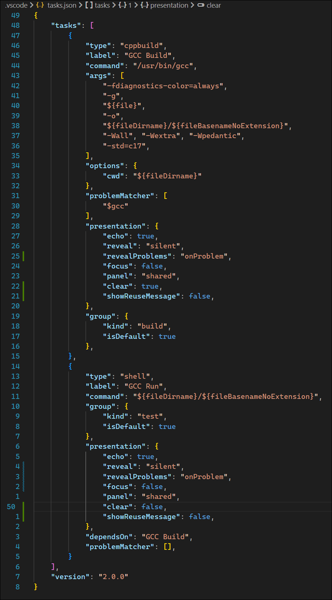
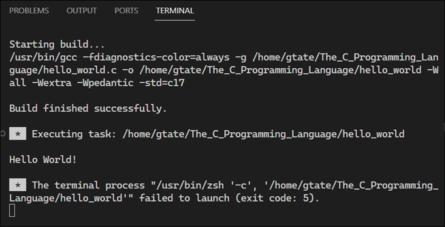

# C Language Notes

<details>
<summary>References</summary>
The C Programming Language, 2nd Edition, Brian W. Kernighan and Dennis M. Ritchie, 1988, Prentice Hall, ISBN 0-13-110362-8


</details>

## A Tour of the C Language Basics

The followings screenshot shows a simple C program that prints "hello, world" to the console.

```c
#include <stdio.h>

int main()
{
    printf("Hello World!\n");
    return 5;
}
```

<details>
<summary>VS Code Task Configuration</summary>
Here's a look at the VS Code task configuration for building and running the program.



</details>

<details><summary>Result</summary>
The Hello, World program produces the following output:



</details>


Things get more interesting when you add additional constructs to the program. Here's a program that prints a table of Fahrenheit and Celsius temperatures.

```c
int main()
{
    int fahr, celsius;
    int lower, uppper, step;

    lower = 0;    /* lower limit of temperature table */
    uppper = 300; /* upper limit */
    step = 20;    /* step size */

    fahr = lower;
    while (fahr <= uppper)
    {
        celsius = 5 * (fahr - 32) / 9;
        printf("%d\t%d\n", fahr, celsius); // \t is a tab character
        fahr = fahr + step;
    }
}
```

<details><summary>Result</summary>

</details>

In the `printf` statement, the `%d` is a format specifier that indicates that an integer value is to be printed at that point. The `\t` is a tab character. The `\n` is a newline character. The `//` indicates a comment. The `/*` and `*/` are also comments.

The `%d` format specifyer stands for "decimal", indicating that it is used for printing numbers in decimal (base 10) format. The most common data type for storing integers is `int`. The `%d` format specifyer is designed to match this data type, ensuring that when an integeter is padded to `printf`, it is correctly interpreted and printed as a decimal number.

When you see `%d`, think integer in decimal (base 10) format.

Also note that `printf` is not part of the C language. `printf` is just a function defined in the ANSI standard library.

You can specify ...


