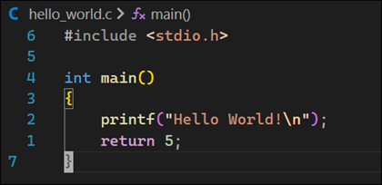

# C Language Notes

References

The C Programming Language, 2nd Edition, Brian W. Kernighan and Dennis M. Ritchie, 1988, Prentice Hall, ISBN 0-13-110362-8

## A Tour of the C Language Basics

The followings screenshot shows a simple C program that prints "hello, world" to the console.

VS Code Task Configuration

Here's a look at the VS Code task configuration for building and running the program.

The Hello, World program produces the following output:

