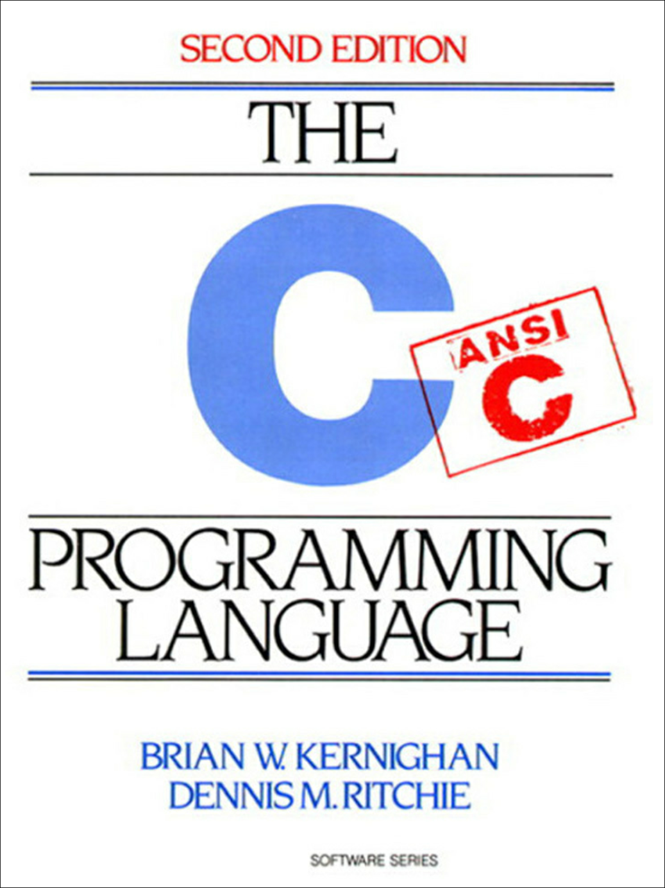
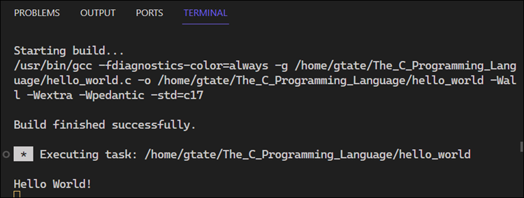
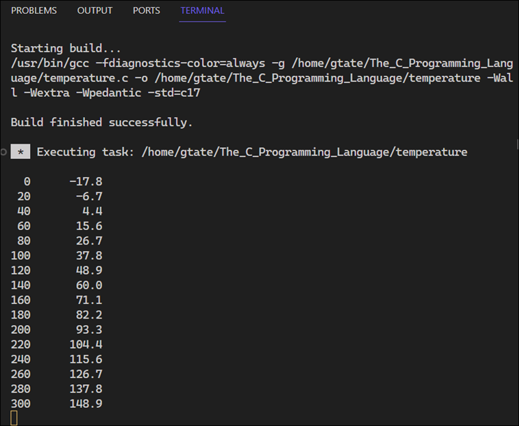
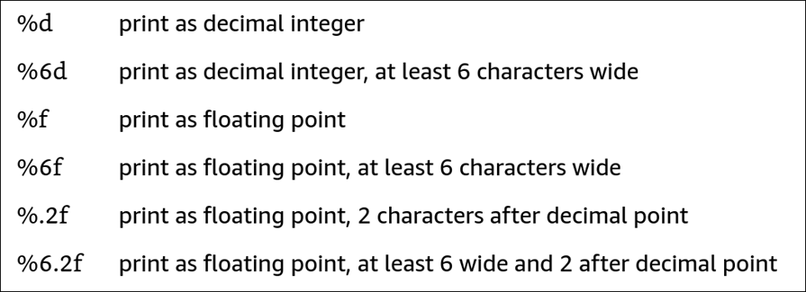
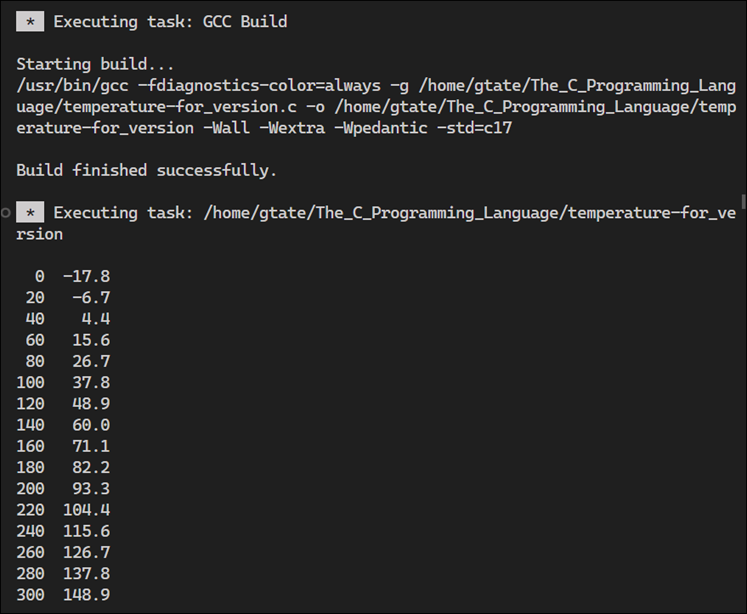

# C Language Notes

<details><summary>References</summary>

<br>

The C Programming Language, 2nd Edition, Brian W. Kernighan and Dennis M. Ritchie, 1988, Prentice Hall, ISBN 0-13-110362-8



</details>

## Introduction to C

<details><summary>Hello World</summary>

<br>

The followings screenshot shows a simple C program that prints "hello, world" to the console.

```c
#include <stdio.h>

int main()
{
    printf("Hello World!\n");
    return 0;
}
```

The Hello, World program produces the following output:



</details>

<details><summary>VS Code Task Configuration</summary>

<br>

Here's a look at the VS Code task configuration in `tasks.json` for building and running the program. With `GCC Run` set to the default build task, you can use the `CTRL+SHIFT+B` shortcut key to compile and run the program.

```json
{
    "tasks": [
        {
            "label": "GCC Build",
            "type": "cppbuild",
            "command": "/usr/bin/gcc",
            "args": [
                "-fdiagnostics-color=always",
                "-g",
                "${file}",
                "-o",
                "${fileDirname}/${fileBasenameNoExtension}",
                "-Wall", "-Wextra", "-Wpedantic",
                "-std=c17",
            ],
            "options": {
                "cwd": "${fileDirname}"
            },
            "problemMatcher": [
                "$gcc"
            ],
            "presentation": {
                "echo": true,
                "reveal": "silent",
                "revealProblems": "onProblem",
                "focus": false,
                "panel": "shared",
                "clear": false,
                "showReuseMessage": false,
            },
            "group": {
                "kind": "build",
                "isDefault": false
            },
        },
        {
            "label": "GCC Run",
            "type": "shell",
            "command": "${fileDirname}/${fileBasenameNoExtension}",
            "presentation": {
                "echo": true,
                "reveal": "always",
                "revealProblems": "onProblem",
                "focus": false,
                "panel": "shared",
                "clear": false,
                "showReuseMessage": false,
            },
            "dependsOn": "GCC Build",
            "problemMatcher": [],
            "group": {
                "kind": "build",
                "isDefault": true
            }
        }
    ],
    "version": "2.0.0"
}
```

</details>

<details><summary>Integers and Floating Point Numbers</summary>
Things get more interesting when you add additional constructs to the program. Here's a program that prints a table of Fahrenheit and Celsius temperatures.

```c
int main()
{
    int fahr, celsius;
    int lower, uppper, step;

    lower = 0;    /* lower limit of temperature table */
    uppper = 300; /* upper limit */
    step = 20;    /* step size */

    fahr = lower;
    while (fahr <= uppper)
    {
        celsius = 5 * (fahr - 32) / 9;
        printf("%d\t%d\n", fahr, celsius); // \t is a tab character
        fahr = fahr + step;
    }
}
```

Output:


In the `printf` statement, the `%d` is a format specifier that indicates that an integer value is to be printed at that point. The `\t` is a tab character. The `\n` is a newline character. The `//` indicates a comment. The `/*` and `*/` are also comments.

The `%d` format specifyer stands for "decimal", indicating that it is used for printing numbers in decimal (base 10) format. The most common data type for storing integers is `int`. The `%d` format specifyer is designed to match this data type, ensuring that when an integer is padded to `printf`, it is correctly interpreted and printed as a decimal number.

Also note that `printf` is not part of the C language. `printf` is just a useful function defined in the ANSI standard library.

The following program uses floats instead of integers. 

```c
#include <stdio.h>

/*
    print Fahrenheit-Celsius table for fahr = 0,20,...,300;
    floating-point version
*/

int main()
{
    float fahr, celsius;
    int lower, uppper, step;

    lower = 0;    /* lower limit of temperature table */
    uppper = 300; /* upper limit */
    step = 20;    /* step size */

    fahr = lower;
    while (fahr <= uppper)
    {
        celsius = (5.0 / 9.0) * (fahr - 32.0);
        printf("%3.0f\t%6.1f\n", fahr, celsius); // \t is a tab character
        fahr = fahr + step;
    }
}
```
Output:



Things to note:

1. If an arithmetic operator has integer operands, an integer operation is performed.
2. If an arithmetic operator has one floating-point operand and one integer operand, the integer operand will be converted to floating point before the operation is done.
3. In the test `while (fahr <= upper>)`, the int, `upper`, is converted to float before the operation is done.
4. The printf conversion specification, `%3.0f` says that a floating-point number is to be printed at least three characters wide, with no decimal point and no fraction digits.
5. The printf conversion specification, `%6.1f` says that a floating-point number is to be printed at least six characters wide, with 1 digit after the decimal point.

Width and precision may be omitted from the specification:

- `%6f` says that the number is to be at least 6 characters wide; 
- `%.2f` specifies two characters after the decimal point, but the width is not constrained
- `%f` says to print the number as a floating point



`printf` also recognizes

- `%o` for octal
- `%x` for hexadecimal
- `%s` for character string
- `%%` for % itself

</details>

<details><summary>The For Statement</summary>

Here's a version of the temperature program using a for loop:

```c
#include <stdio.h>

/* print Fahrenheit-Celsius table*/

int main()
{
    int fahr;
    for (fahr = 0; fahr <= 300; fahr = fahr + 20)
        printf("%3d %6.1f\n", fahr, (5.0 / 9.0) * (fahr - 32));
}
```

Output:



Things to note:

- The only declared variable is `fahr`, and it's an `printf`
- The upper and lower limits have become the step size and appear as constants
- You can use an expression instead of a variable in the `printf` statement

</details>

<details><summary>Symbolic constants</summary>

<br>

A symbolic constant is a name that represents a fixed value that does not change during the execution of a program. Unlike variables, which occupy storage space, symbolic constants replace their values in the code at the preprocessing stage. 

The syntax for defining a symbolic constant is as follows:

```c
#define SYMBOLIC_CONSTANT_NAME value
```

For example:

```c
#define PI 3.14159
```

Symbolic constantsare defined using the `#define` preprocessor directive, which replaces all occurrences of the constant with its value during the preprocessing phase, before actual compilation begins. Also, symbolic constants do not end with a semicolon at the end of a #define line.

Using symbolic constants has several advantages:

1. **Readability**: It makes the code more readable by giving meaningful names to otherwise obscure numerical values.

2. **Maintainability**: It allows for easier maintenance of the code since you only need to change the value in one place if it needs to be updated.

3. **Prevention of errors**: It helps prevent errors that can occur from typing the wrong value multiple times throughout the code.

Symbolic constants can represent numerical values, character constants, string constants, or even expressions. They are conventionally written in uppercase letters to distinguish them from variable names.

Here is an example program that uses symbolic constants:

```c
#include <stdio.h>

/* print Fahrenheit-Celsius table*/

#define LOWER 0
#define UPPER 300
#define STEP 20

int main()
{
    int fahr;
    for (fahr = LOWER; fahr <= UPPER; fahr = fahr + STEP)
        printf("%3d %6.1f\n", fahr, (5.0 / 9.0) * (fahr - 32));
}
```

</details>

<details><summary>Character input and output</summary>

<br>

The standard C library provides the functions `getchar()` and `putchar()` for reading and writing one character at a time.


</details>


