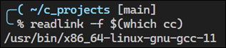
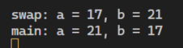

# C Language Notes

- [Introduction to C](#introduction-to-c)
  - [The Spirit of C](#the-spirit-of-c)
  - [A Brief History of C](#a-brief-history-of-c)
  - [The C Standard](#the-c-standard)
  - [Compilers for Unix-like systems](#compilers-for-unix-like-systems)
    - [GCC and Clang](#gcc-and-clang)
    - [VS Code Task Configuration](#vs-code-task-configuration)
  - [Hello World Analysis](#hello-world-analysis)
    - [Preprocessor directives](#preprocessor-directives)
    - [The `puts` function](#the-puts-function)
    - [The `EXIT_SUCCESS` macro](#the-exit_success-macro)
    - [Checking function return values](#checking-function-return-values)
    - [Formatted output](#formatted-output)
  - [Portability](#portability)
- [Objects, Functions, and Types](#objects-functions-and-types)
  - [Objects, Functions, Types, and Pointers](#objects-functions-types-and-pointers)
  - [Declaring Variables](#declaring-variables)
    - [Declaring Multiple Variables](#declaring-multiple-variables)
    - [Swapping Values (First Attempt) - Understanding call by value](#swapping-values-first-attempt---understanding-call-by-value)
    - [Swapping Values (Second Attempt)](#swapping-values-second-attempt)

## Introduction to C

Most of my notes are taken from the following resources. I also use ChatGPT to supplement my learnings.

- [C Programming Language](https://a.co/d/**hIfOsU9**) by Brian Kernighan and Dennis Ritchie
  - Dennis Ritchie - Created the C programming language and developed UNIX
  - Brian Kernighan - Developed UNIX and wrote the "K&R C" book
- [Effective C](https://a.co/d/gyYEF3B) by Robert Seacord
  - Robert Seacord - recognized as a leading authority on software security and secure coding practices

According to the [TIOBE Index](https://www.tiobe.com/tiobe-index/), C has been the most popular or second-most popular programming language since 2001.

### The Spirit of C

The "spirit of C" refers to the fundamental principles and characteristics that define the C programming language. These principles include:

1. **Efficiency**: C is designed to be efficient in terms of both execution speed and memory usage. It provides low-level access to system resources, which allows developers to write code that can execute quickly and with minimal overhead.

2. **Portability**: C code is highly portable, meaning it can run on various hardware platforms and operating systems with minimal modifications. This portability is achieved through the use of standard libraries and well-defined language features.

3. **Simplicity**: C is a relatively simple language with a small set of keywords and syntax rules. This simplicity makes it easy to learn and understand, and it encourages developers to write clear and concise code.

4. **Flexibility**: C offers a high degree of flexibility, allowing developers to write code at different levels of abstraction. It supports both low-level programming, such as system-level operations and hardware interaction, as well as high-level programming, such as data structures and algorithms.

5. **Control**: C provides developers with a high degree of control over the behavior of their programs. It allows for manual memory management, precise control over data structures and algorithms, and direct manipulation of hardware resources.

Overall, the spirit of C is characterized by its focus on efficiency, portability, simplicity, flexibility, and control, making it a powerful and versatile language for a wide range of applications.

### A Brief History of C

- The C programming language was developed in 1972 by Dennis Ritchie and Ken Thompson at Bell Labs.
- Brian Kernighan co-authored "The C Programming Language" with Dennis Ritchie.
- The ANSI X3J11 committee formed in 1983 to establish a standard C specification, resulting in ANSI C or C89 in 1989.
- The C Standard was adopted internationally as ISO/IEC 9899:1990 (C90) and has had several updates, the latest being C17 (ISO/IEC 9899:2018).
- A new major revision, referred to as C2x, is under development.

### The C Standard

The ISO/IEC 9899:2018 C Standard is the definitive authority on C language behavior. This standard is crucial for anyone aiming to write code that is portable, safe, and secure. It grants compilers a significant amount of flexibility to ensure optimal efficiency across various hardware platforms.

The term "implementations," as used in the C Standard, refers to compilers operating under specific conditions and environments, including a particular set of command-line flags and the C Standard Library. Each compiler configuration is considered a unique implementation, and differences between these can lead to significantly different behaviors, particularly in areas not explicitly defined by the standard or that are implementation-defined.

Notably, the GNU Compiler Collection (GCC) uses the `-std=` flag to select the C language standard, offering several choices including c89, c90, c99, c11, c17, c18, and c2x, with the default setting depending on the compiler version. For example, GCC 10's default is `-std=gnu17`, which includes extensions to the standard C language.


### Compilers for Unix-like systems

If you are in a Unix-like operating system that has a C compiler installed then you can compile the code by running the following command:

```bash
cc hello_world.c -o hello_world.out
```

The command `cc` is a shorthand for the C Compiler command. In most cases this command in an alias or symbolic link to the actual compiler installed on the system.  

You can determine which compiler the `cc` command references by using the following command:

```bash
readlink -f $(which cc)
```

The `readlink` command, part of the GNU Core utilities, is used to resolve symbolic links, showing the ultimate target. In the case below, `cc` references the `gcc` compiler.



#### GCC and Clang

On Unix-like systems, the two main compilers are the **[GCC](https://gcc.gnu.org/)** and **[Clang](https://clang.llvm.org/)**. 

GCC is part of the GNU Compiler Collection, which was introduced in 1987 by Richard Stallman. It was part of the GNU Project's efforts to create a complete free operating system. Over time, GCC evolved to support more languages beyond C, such as C++, Java, and Fortran, thus leading to the name change to GNU Compiler Collection.

LLVM, which originally stood for "Low Level Virtual Machine," reflecting its early goals as a research project. It was designed to provide a modern approach to compiler design, emphasizing the compilation of program code into an intermediate representation (IR), which could then be optimized and translated into machine code for different architectures. Over time, as LLVM grew to encompass a broader set of compiler and toolchain technologies beyond just the virtual machine aspect, the acronym LLVM has essentially become the name of the project itself, rather than standing for those original words. Now, LLVM refers to the whole project, including the LLVM intermediate representation, the LLVM compiler infrastructure, and its collection of tools and compilers.

LLVM and GCC are both compiler infrastructures that support a variety of programming languages, but they have distinct designs, philosophies, and capabilities. Here's a comparison to highlight some of their differences:

##### Architecture and Design

- **LLVM (Low Level Virtual Machine):** LLVM is designed around a language-agnostic Intermediate Representation (IR), allowing it to support multiple front-ends (languages) and back-ends (target architectures). Its modular design enables reuse in a variety of different tools, including compilers, debuggers, and static analyzers. LLVM emphasizes providing a modern, SSA-based (Static Single Assignment form) compilation strategy, enabling sophisticated optimizations and analyses at the IR level.
- **GCC (GNU Compiler Collection):** GCC, traditionally, has a monolithic architecture where the front-end (language parser) is more tightly coupled with the optimization and code generation phases. Although it has evolved over time to be more modular, its architecture is considered less flexible compared to LLVM's. GCC was initially developed for C but has been extended to support multiple languages (like C++, Java, Fortran).

##### Performance and Optimization

- Both LLVM and GCC provide a wide range of optimizations and are highly competitive in terms of performance of the generated code. The performance can vary depending on the specific program, optimization level, and target architecture.
- LLVM's architecture facilitates the development of sophisticated optimizations and static analysis tools, partly due to its use of a uniform IR.

##### Developer Tools and Ecosystem

- **LLVM** comes with a rich set of tools, including Clang (for C/C++/Objective-C), LLD (linker), and sanitizers for detecting various kinds of bugs. LLVM's design also allows for easy development of new tools.
- **GCC** includes compilers for C, C++, Objective-C, Fortran, Ada, Go, and D, among others. It also has a wide array of optimizations and support for various standards. GCC is known for its robust support for different platforms and architectures.

##### Licensing

- **LLVM** is under the "University of Illinois/NCSA Open Source License," a permissive license that is similar to the BSD license. This allows for relatively unrestricted use, including in proprietary software.
- **GCC** is licensed under the GNU General Public License (GPL), which requires that modifications be open-sourced under the same license. This makes GCC less attractive for proprietary tool vendors who do not want to share their modifications.

##### Adoption and Community

- **LLVM** has seen increasing adoption in recent years, especially in commercial and proprietary environments, due to its permissive licensing and modular architecture. Apple's adoption of LLVM and Clang for iOS and macOS development is a notable example.
- **GCC** has a long history and has been widely used in open-source projects, academic settings, and by various Unix-like operating systems, including Linux. It has a large and established user base and community.

Both LLVM and GCC are powerful tools in the compiler landscape, each with its strengths and areas of application. The choice between them can depend on factors like specific project requirements, licensing concerns, and the ecosystem of tools and languages involved.

#### VS Code Task Configuration

You can use a VS Code task configuration to automate the build and run process. The following `tasks.json` configuration shows how to use the `gcc` compiler to compile a C program. With `GCC Run` set to the default build task, you can use the `CTRL+SHIFT+B` shortcut key to compile and run the program.

```json
{
    "tasks": [
        {
            "label": "GCC Build",
            "type": "cppbuild",
            "command": "/usr/bin/gcc",
            "args": [
                "-fdiagnostics-color=always",
                "-g",
                "${file}",
                "-o",
                "${fileDirname}/${fileBasenameNoExtension}",
                "-Wall", "-Wextra", "-Wpedantic",
                "-std=c17",
            ],
            "options": {
                "cwd": "${fileDirname}"
            },
            "problemMatcher": [
                "$gcc"
            ],
            "presentation": {
                "echo": true,
                "reveal": "silent",
                "revealProblems": "onProblem",
                "focus": false,
                "panel": "shared",
                "clear": false,
                "showReuseMessage": false,
            },
            "group": {
                "kind": "build",
                "isDefault": false
            },
        },
        {
            "label": "GCC Run",
            "type": "shell",
            "command": "${fileDirname}/${fileBasenameNoExtension}",
            "presentation": {
                "echo": true,
                "reveal": "always",
                "revealProblems": "onProblem",
                "focus": false,
                "panel": "shared",
                "clear": false,
                "showReuseMessage": false,
            },
            "dependsOn": "GCC Build",
            "problemMatcher": [],
            "group": {
                "kind": "build",
                "isDefault": true
            }
        }
    ],
    "version": "2.0.0"
}
```

### Hello World Analysis

The following code is a simple C program that prints "Hello, World!" to the console.

```c
#include <stdio.h>
#include <stdlib.h>

int main(void) {
    puts("Hello, world!");
    return EXIT_SUCCESS;
}
```

#### Preprocessor directives

Preprocessor directives are lines in a program that start with the `#` symbol and are considered before the compilation of the code. These directives are not part of the C language itself but are instructions to the preprocessor, which runs before the compiler processes the source code. The `#include` directive specifically is used to include the contents of another file into the source code file, which is crucial for accessing the functionality provided by the C Standard Library or other libraries and header files.

There are two preprocessor directives in the above code block, `#include <stdio.h>` and `#include <stdlib.h>`. Here's what they do:

##### `#include <stdio.h>`

- This directive tells the preprocessor to include the contents of the standard input-output header file `stdio.h` into the current file before the actual compilation process begins.
- `stdio.h` is part of the C Standard Library and provides functionalities for input and output operations. For instance, it includes declarations of functions like `printf()`, `scanf()`, and in this case, `puts()`, which is used in the program to output "Hello, world!" to the standard output (typically the console).

##### `#include <stdlib.h>`

- Similar to the first, this directive includes the contents of the standard library header file `stdlib.h` into the current file during the preprocessing phase.
- `stdlib.h` contains functions involving memory allocation, process control, conversions, and others. In this code, it's included to provide access to the `EXIT_SUCCESS` macro, which is used as the return value from `main()`. `EXIT_SUCCESS` is a standard macro that indicates successful program termination.

#### The `puts` function

The `puts` function is a standard input/output library function in C, declared in the `stdio.h` header file. Its purpose is to write a string to the standard output (stdout) and automatically append a newline character (`\n`) at the end. The syntax of the `puts` function is as follows:

```c
int puts(const char *s);
```

- `s`: A pointer to the string to be displayed on stdout. The string should be null-terminated.

The `puts` function writes the string pointed to by `s` to stdout and appends a newline character. It returns a non-negative number on success to indicate successful execution. If an error occurs, it returns `EOF` (End Of File indicator).

Compared to `printf`, `puts` is simpler to use for printing strings because it does not require format specifiers and automatically adds a newline at the end, which `printf` does not do unless explicitly told to by including `\n` in the string. However, `puts` is less flexible than `printf` because it can only print strings and cannot format numbers or other data types.

#### The `EXIT_SUCCESS` macro

The `EXIT_SUCCESS` macro is used as the return value of the `main` function. Here's an explanation:

- `EXIT_SUCCESS` is a macro that represents a successful program termination status code. It is defined in the `<stdlib.h>` header file. Programs conventionally return 0 to indicate success and a non-zero value to indicate an error. The `EXIT_SUCCESS` macro is part of the C Standard Library and is used to improve the readability and portability of the code. While it is often defined as 0, using `EXIT_SUCCESS` makes the intention behind the return value more explicit and allows for the code to be portable across different platforms that might use a different value for successful termination.
- When a program ends, it returns an exit status to the operating system. Using `EXIT_SUCCESS` as the return value from `main()` explicitly indicates that the program terminated successfully.

##### More about macros in C

- A macro is a fragment of code which has been given a name. Whenever the name is used, it is replaced by the contents of the macro. Macros are defined using the `#define` directive and are handled by the preprocessor, a step before the actual compilation of code begins.
- Macros can be used to define constants, as with `EXIT_SUCCESS`, or to create function-like macros that can take arguments. The use of macros can save time and reduce errors by allowing repetitive code to be defined in a single location but used in many places.
- Unlike functions, macros do not perform any type checking and are simply expanded by the preprocessor. Therefore, they can be more efficient in cases where they are used to define constants (since no function call overhead is involved) but also riskier if not used carefully, especially for complex expressions.

#### Checking function return values

The Hello World program in the code block above has a bug. The `puts` function takes a string to print and returns a value of type `int`. The `puts` function returns the value of the macro `EOF` (a negative integer) if a write error occurs; otherwise it returns a nonnegative integer value. 

Although it's unlikely that the `puts` function will fail and return `EOF` for the simple program, it's possible. Here's how it can be improved:

```c
#include <stdio.h>
#include <stdlib.h>

int main (void) {
    if (puts("Hello, world!") == EOF) {
        return EXIT_FAILURE;
    }
    return EXIT_SUCCESS;
}
```

The revised version checks whether the `puts` call returns `EOF` and exits with a nonzero error code if so.

#### Formatted output

The `puts` function is a nice, simple way to write a string to `stdout`, but eventually you'll need to print formatted output by using the `print` function. The `printf` function takes a format string that defines how the output is formatted.

```c
printf("%s\n", "Hello, world!");
```

The first argument is the format string, `"%s\n"`. The `%s` is a conversion specification that instructs the `printf` function to read the second argument (a string literal) and print it to `stdout`.

Unlike with the `puts` function, with `printf` you must add a newline character at the end of the format string.

See:

- [Table of output conversions](https://www.gnu.org/software/libc/manual/html_node/Table-of-Output-Conversions.html)
- [Formatted output functions](https://www.gnu.org/software/libc/manual/html_node/Formatted-Output-Functions.html)

### Portability

Programs written for C are considered _strictly conforming_ if they use only those features of the language and library specified in the standard. These programs are considered to be maximally portable. However, in the real world, no C program is strictly conforming. Instead, the C language allows you to write _conforming programs_ that may depend on nonportable language and library features.

Annex J of the C standard defines five kinds of portability issues:

- **Implementation-Defined Behavior** - refers to aspects of the language specification that are left for compiler implementations to decide, leading to variations in program behavior across different platforms or compilers.

    An example is the size of basic data types such as `int`. The C standard specifies that an `int` must be at least 16 bits, but it leaves the exact size to be determined by the implementation. Therefore, the size of an `int` can vary between different compilers and platforms (e.g., it might be 16 bits on one platform and 32 bits on another), affecting the range of values it can represent and, consequently, the behavior of programs that rely on specific size assumptions.

- **Unspecified Behavior** - occurs when the language standard does not define the exact behavior or order of execution for certain operations, allowing compilers to choose the behavior without needing to document their choice, potentially leading to inconsistent program behavior across different compilers.

    An example is the order of evaluation of function arguments. According to the C standard, when a function is called, the order in which the arguments to the function are evaluated is not specified. This means that in a function call like `f(x(), y())`, whether `x()` or `y()` is evaluated first is up to the compiler, leading to potentially different behaviors if `x()` and `y()` have side effects that affect each other.

- **Undefined Behavior** - refers to any program operation that the language standard does not explicitly define, allowing compilers to handle such situations in any manner, often leading to unpredictable and potentially harmful program behavior.

    An example of undefined behavior in C is accessing memory beyond the bounds of an array, such as attempting to read or write to `array[10]` when `array` is only defined with a size of 10 elements (`int array[10];`). This can lead to data corruption, crashes, or other unpredictable program behavior since the program is accessing memory it does not own.

    Compilers have the latitude to (1) ignore undefined behavior completely, giving unpredictable results, (2) behave in a documented manner characteristic of the environment (with or without issuing a diagnostic), and (3) terminate a translation or execution (with issuing diagnostic).

- **Local-Specific Behavior and Common Extensions** - refer to functionality or features that vary by locale (such as character encoding or date formats) or are widely used but not standardized across implementations, potentially leading to inconsistencies when porting code between different environments or compilers.

    An example of locale-specific behavior is how the `printf` function handles formatting and displaying characters in different locales, such as using commas versus periods for decimal separators in floating-point numbers. A common extension example is the GNU C Compiler (GCC) `__attribute__` syntax, which provides additional functionality such as specifying function attributes for optimization, but is not part of the standard C language and may not be supported by other compilers, affecting portability.

## Objects, Functions, and Types

One of the first things the author teaches in this chapter is one of the last things the author learned:

> Every type in C is either an _object_ type or a _function_ type.

### Objects, Functions, Types, and Pointers

An _object_ is storage in which you can represent values. A variable is an example of an object. Variables have a declared type that tells you the kind of object its value represents. For example, an object with type `int` contains an integer value.

The type is important because the collection of bits that represents one type of object will likely have a different value if interpreted as a different type of object. For example, the number 1 is represented in IEEE 754 by the bit pattern `0x3f800000`. But if you were to interpret this same bit pattern as an integer, you'd get the value 1,065,353,216 instead of 1.  

_Functions_ are not objects but do have types. A function type is characterized by both its return type as well as the number and types of its parameters.

The C language also has _pointers_, which can be though of as an address&mdash;a location in memory where an object or function is stored. A pointer type is derived from a function or object type called the _referenced type_. A pointer type derived from the referenced type `T` is called a pointer to `T`.  

If you have a variable of type `T` (where `T` can be any data type, like `int`, `float`, `char`, etc.), a "pointer to `T`" is a pointer that is specifically designed to store the address of a variable of type `T`. This is indicated in C by using the `*` operator. For instance, if `T` is `int`, then a pointer to `T` is declared as `int *`. This pointer can store the address of an `int` variable.

Because objects and functions are different things, object pointers and function pointers are also different things, and should not be used interchangeably. 

### Declaring Variables

When you declare a variable, you assign it a type and provide it a name, or _identifier_, by which to reference the variable.

The following program declares two integer objects with initial values. The program also declares, but doesn't define, a `swap` function to swap those values.

```c
#include <stdio.h>

void swap(int, int); // defined later

int main(void)
{
    int a = 21;
    int b = 17;

    swap(a, b);
    printf("main: a = %d, b = %d\n", a, b);
    return 0;
}
```

#### Declaring Multiple Variables

You can declare multiple variables in a single declaration, but doing so can get confusing if the variables are pointers or arrays, or the variables are different types. 

The following declarations are valid:

```c
char *src, c;
int x, y[5];
int m[12], n[15][3], o[21];
```

The first line declares two variables, `src` and `c`, which have different types. The `src` variable has a type of `char *` and `c` has a type of `char`.

The second line declares two variables, `x` and `y`, with different types. The variable `x` has a type `int`, and `y` is an array of five elements of type `int`.

The third line declares three arrays&mdash;`m`, `n`, and `o`&mdash;with different dimensions and numbers of elements.  

The declarations are easier to understand if each is on its own line:

```c
char *src;      // src has a type of char *
char c;         // c has a type of char
int x;          // x has a type int
int y[5];       // y is an array of 5 elements of type int
int m[12];      // m is an array of 12 elements of type int
int n[15][3];   // n is an array of 15 arrays of 3 elements of type int
int o[21];      // o is an array of 21 elements of type int
```

#### Swapping Values (First Attempt) - Understanding call by value

Each object has a storage duration that determines its _lifetime_, which is the time during program execution for which the object exists, has storage, has a constant address, and retains its last-stored value.

Local variables, such as `a` and `b` in the code from the main function above have _automatic storage duration_, meaning they exist until execution leaves the block in which they're defined.  

The `swap` function from the initial code block above defines two parameters, `a` and `b`, that you pass as arguments. Parameters are objects declared as part of the function declaration that acquire a value on entry to the function. Arguments are comma-separated expressions you include in the function call expression. 

```c
#include <stdio.h>

void swap(int, int);

int main(void)
{
    int a = 21;
    int b = 17;

    swap(a, b);
    printf("main: a = %d, b = %d\n", a, b);
    return 0;
}

void swap(int a, int b) {

    int t = a;
    a = b;
    b = t;
    printf("swap: a = %d, b = %d\n", a, b);
}
```

Running this program yields the following output:



Thing to note here is that C is a _call-by-value_ language, which means that when you provide an argument to a function, the value of that argument is copied into a distinct variable for use within the function.

When the values of the parameters in the function are changed, the values in the caller are unaffected because they are distinct objects. Consequently, the variables `a` and `b` in `main()` retain their original values during the call to `printf`.   

#### Swapping Values (Second Attempt)

You can use pointers to rewrite the `swap` function.

```c
#include <stdio.h>

void swap(int *pa, int *pb)     // pa -> a: 21, pb -> b: 17
{
    int t = *pa;                // t = 21
    *pa = *pb;                  // pa -> a: 17, pb -> b: 17
    *pb = t;                    // pa -> a: 17, pb -> b: 21
    return;
}

int main(void)
{
    int a = 21;                 // a: 21
    int b = 17;                 // b: 17

    swap(&a, &b);
    printf("main: a = %d, b = %d\n", a, b);     // a: 17, b: 21
    return 0;
}
```

The indirection operator, `*`, is used to both declare pointers and dereference them. 

When used in the function declaration, `*` acts part of a pointer declarator indicating that the parameter is a pointer to an object or function of a specific type. The `swap` function specifies two parameters, `pa` and `pb` and declares them as type pointers to `int`.

When using the unary `*` operator in expressions within the function, the unary `*` operator dereferences the pointer to the object. 

Consider the following assignment:

```c
pa = pb;
```

This replaces the value of the pointer `pa`, a location, with the value of the pointer `pb`, another location.

Now consider this assignment:

```c
*pa = *pb
```

This dereferences the pointer `ab`, reads the referenced value, dereferences the pointer `pa`, and then overwrites the value at the location referenced by `pa` with the value referenced by `pb`.

When you call the `swap` function in `main`, you must also place an ampersand `&` character before each variable name:

```c
swap(&a, &b);
```

The unary `&` is the _address-of_ operator, which generates a pointer to its operand. The introduction of `&` is necessary because the `swap` function now accepts pointers to objects of type `int` as parameters instead of simply values of type `int`.

The values passed to the `swap` function are still copied, but the copied values now represent addresses instead of integers. This approach simulates a _call by reference_ by generating object addresses, passing those by value, and then dereferencing the copied addresses to access the original objects.