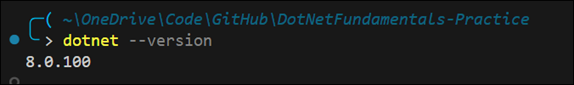
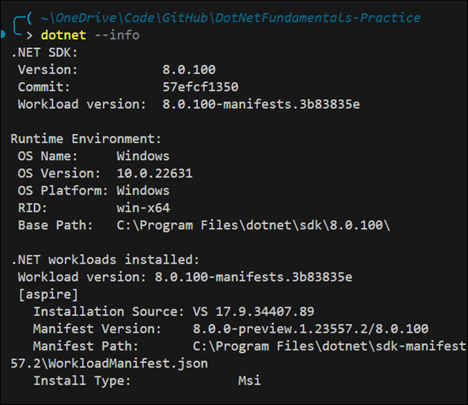
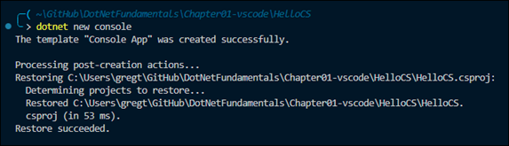
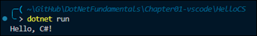
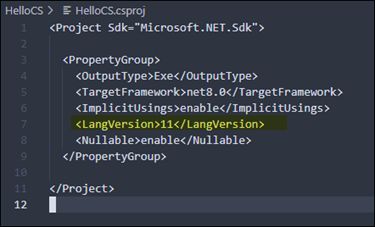
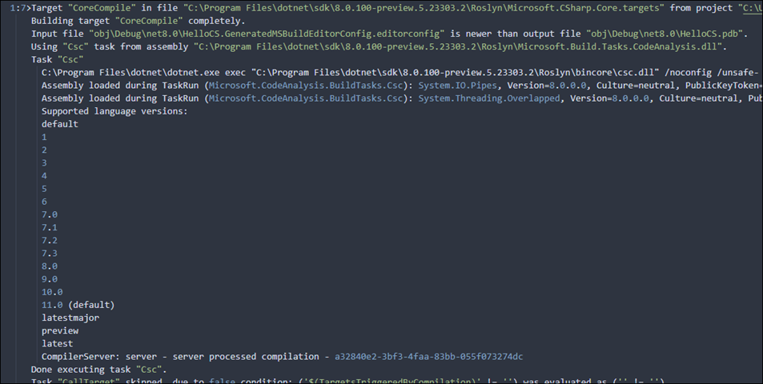

# My Notes on Learning .NET

- [Resources](#resources)
- [Understanding .NET](#understanding-net)

## Resources
Most of my notes are taken from [C# 12 and .NET 8 Modern Cross-Platform Development Fundamentals](https://www.amazon.com/gp/product/B0CGZVT568/ref=ppx_yo_dt_b_d_asin_title_o00?ie=UTF8&psc=1).

- [C# Documentation](https://learn.microsoft.com/en-us/dotnet/csharp/)
- [GitHub repository for Modern Cross-Platform Development Fundamentals](https://github.com/markjprice/cs12dotnet8)

## Understanding .NET

- **Legacy .NET**: refers to the .NET Framework, Mono, Xamarin, and .NET Standard
- **Modern .NET**: refers to .NET 8 and its predecessors like .NET 6 that derive from .NET Core

Modern .NET is modularized compared to the legacy .NET Framework, which is monolithic. Modern .NET is open source.

  
Brief Overview of .NET

See this article for a discussion on the history of .NET: https://github.com/markjprice/cs12dotnet8/blob/main/docs/ch01-dotnet-history.md

**.NET Framework**

.NET Framework is a development platform that includes a **Common Language Runtime (CLR)**, which manages execution of code, and a **Base Class Library (BCL)**, which provides a rich library of classes to build applications from.

.NET Framework has been an official component of the Windows operating system. However, it is now considered a Windows-only and a legacy platform.  Do not create new apps using it.

**Mono, Xamarin, and Unity Projects**

Third parties developed a .NET Framework implementation named the **Mono** project. Mono is cross-platform but fell behind the official implementation of .NET Framework.

Mono has a niche as the foundation of the **Xamarin** mobile platform as well as cross-platform game development platforms like **Unity**.

Microsoft purchased Xamarin in 2016 and has integrated its functionality into Visual Studio 2022 for Mac.  

**.NET Core**

Since 2015, Microsoft has been working to rewrite the .NET Framework to be truly cross-platform. The new modernized product was initially branded **.NET Core**.  .NET Core was designed to run on Windows, Linux, and macOS. .NET Core shares some components with .NET Framework but has its own runtime and set of libraries known as CoreFX. .NET Core is an open source revamp of .NET, optimized for modern application development, mainly focusing on cloud and web applications.

.NET Core includes versions up to .NET Core 3.1. 

**Modern .NET**

The term **modern .NET** refers to .NET 5 and up and its predecessors that come from .NET Core.  The term **legacy .NET** refers to the .NET Framework, Mono, and Xamarin.

Starting with .NET 5, Microsoft rebranded .NET Core as **.NET**. New versions are released each year in November.  See [.NET and .NET Core Support Policy](https://dotnet.microsoft.com/en-us/platform/support/policy/dotnet-core).

Modern .NET aims to unify .NET Core with the original .NET Framework into a single, consistent platform. Enhancements include performance improvements, more APIs, better tooling, and a range of features to support various types of development, including web, mobile (via MAUI), desktop, cloud, and IoT applications.

.NET MAUI (Multi-platform App UI) is an evolution of Xamarin.Forms and aims to simplify the development of cross-platform applications for mobile and desktop from a single codebase.

.NET Support

.NET versions fall in three categories:

- Long Term Support (LTS): supported by Microsoft for 3 years after General Availability, or 1 year after the next LTS release ships, whichever is longer.
- Standard Term Support (STS): Formerly known as "Current". Includes features that change based on feedback, such as the latest improvements. Supported by Microsoft 18 months after GA, or 6 months until the next STS or LTS ships, whichever is longer.
- Preview: for public testing. Not supported by Microsoft, but some Release Candidates (RC) may be declared Go Live, meaning that Microsoft supports them in production.

See https://dotnet.microsoft.com/en-us/platform/support/policy

Understanding .NET runtime and .NET SDK versions

The .NET runtime is the minimum needed to install so that the system can run a .NET application. The .NET SDK includes the .NET runtime as well as the compilers and other tools needed to build .NET code and apps. The following diagram shows alignment between the major and minor numbers, but the SDK uses a separate convention for the patch number.

See https://learn.microsoft.com/en-us/dotnet/core/versions/

Listing and installing .NET versions

Use the `dotnet` command to list details about the runtimes and SDKs installed.

`dotnet --list-sdks`

`dotnet --list-runtimes`

`dotnet --info`

Use `winget search Microsoft.DotNet` to find all the available versions.

Then use `winget install` to install a specific runtime or SDK version.

Understanding Intermediate Language

The C# compiler (named **Roslyn**) used by the `dotnet.exe` CLI tool converts C# source code into **intermediate language (IL)** code and stores the IL in an **assembly** (a DLL or EXE file). IL code statements are like assembly language instructions, which are executed by .NET's virtual machine, known as CoreCLR.

At runtime, CoreCLR loads the IL code from the assembly, the **just-in-time (JIT)** compiler compiles it into native CPU instructions, and then it is executed by the CPU on your machine.

The benefit of this two-step process is that Microsoft can create CLRs for Linux and macOS as well as for Windows.  The same IL code runs everywhere because of the second compilation step, which generates code for the native OS and CPU instruction set.

See [this ChatGPT thread](https://chat.openai.com/share/37fbe918-a6fd-470b-9ffe-ec48dd62b920) for a brief discussion on the Common Language Runtime and just-in-time compilation.

See https://github.com/dotnet/roslyn

  
The dotnet.exe command

This section provides guidance on using the `dotnet.exe` command.  See the [dotnet command reference](https://learn.microsoft.com/en-us/dotnet/core/tools/dotnet) for more info.

Use `dotnet --version` to list the which version of the .NET SDK is being used:  

Use `dotnet --info` to list other information in addition to the installed SDKs and runtimes:  

Use `dotnet net console` to create a new console app:

This command targets your latest .NET SDK version by default.  Use the `-f` switch to specify a target framework:

`dotnet new console -f net6.0`

Use `dotnet run` to compile and execute the program:

You can specify the language version in the project file: 

See [Configure language version](https://learn.microsoft.com/en-us/dotnet/csharp/language-reference/configure-language-version) for information on enabling a specific language version compiler. Getting a list of language versions is tricky. See [this explanation](https://github.com/dotnet/docs/issues/27101#issuecomment-1172989898) for more info. Using this technique, you can uncover the supported language versions, even for preview releases:  

  
Troubleshooting Visual Studio

Build Error - Unable to find packages

When creating a new application and building it for the first time, you may get an error like this:

The error message is related to missing package sources from the NuGet package manager.  To fix this, open the NuGet package manager settings and verify the package source URL has been added:

See [Visual Studio Package Sources](https://learn.microsoft.com/en-us/nuget/consume-packages/install-use-packages-visual-studio#package-sources) for more details.

