# C# and .NET Notes

This page is a collection of my notes on learning C# and .NET. I captured most of my notes from the following resources:

- [C# 12 and .NET 8 Modern Cross-Platform Development Fundamentals](https://www.amazon.com/gp/product/B0CGZVT568/ref=ppx_yo_dt_b_d_asin_title_o00?ie=UTF8&psc=1)
- [C# Documentation](https://learn.microsoft.com/en-us/dotnet/csharp/)
- [Companion Books](https://github.com/markjprice/cs12dotnet8?tab=readme-ov-file#companion-book)

## Table of Contents

- [Table of Contents](#table-of-contents)
- [Introduction](#introduction)
  - [Getting started with .NET and Visual Studio](#getting-started-with-net-and-visual-studio)
    - [Brief overview of .NET](#brief-overview-of-net)
    - [C# and .NET Timeline](#c-and-net-timeline)
    - [C# Features](#c-features)
    - [About .NET support (LTS, STS, and Preview)](#about-net-support-lts-sts-and-preview)
    - [Understanding .NET runtime and .NET SDK versions](#understanding-net-runtime-and-net-sdk-versions)
    - [Using dotnet.exe to list and install .NET runtime and SDK versions](#using-dotnetexe-to-list-and-install-net-runtime-and-sdk-versions)
    - [Understanding intermediate language](#understanding-intermediate-language)
    - [Specifying Visual Studio package source](#specifying-visual-studio-package-source)
    - [About top-level programs and boilerplate code](#about-top-level-programs-and-boilerplate-code)
    - [Implicitly importing namespaces and static members](#implicitly-importing-namespaces-and-static-members)
    - [Visual Studio - configure startup projects](#visual-studio---configure-startup-projects)
    - [Using dotnext.exe to create solutions and projects](#using-dotnextexe-to-create-solutions-and-projects)
    - [Displaying inline hints](#displaying-inline-hints)
    - [C# public repositories, design guidelines, standards](#c-public-repositories-design-guidelines-standards)
    - [Specifying SDK and C# language versions](#specifying-sdk-and-c-language-versions)
  - [C# Language Features](#c-language-features)
    - [C# Types vs Classes](#c-types-vs-classes)
    - [Variables and Naming Conventions](#variables-and-naming-conventions)
    - [Chars](#chars)
    - [Regular string literals](#regular-string-literals)
    - [Verbatim string literals](#verbatim-string-literals)
    - [Interpolated string literals](#interpolated-string-literals)
    - [Interpolated verbatim string literals](#interpolated-verbatim-string-literals)
    - [Raw string literals](#raw-string-literals)
    - [Raw interpolated string literals](#raw-interpolated-string-literals)
    - [Integer literals: decimal, binary, and hexadecimal numbers](#integer-literals-decimal-binary-and-hexadecimal-numbers)
    - [Integer types and the `sizeof` operator](#integer-types-and-the-sizeof-operator)
    - [Real numbers: `float`, `double`, `decimal`](#real-numbers-float-double-decimal)
    - [Implicit conversions of numeric types](#implicit-conversions-of-numeric-types)
    - [New number types, `Half`, `Int128`, and unsafe code](#new-number-types-half-int128-and-unsafe-code)
    - [Booleans](#booleans)
    - [Storing any type of object using the `object` keyword](#storing-any-type-of-object-using-the-object-keyword)
    - [Dynamic types using the `dynamic` keyword](#dynamic-types-using-the-dynamic-keyword)
    - [The `var` keyword and implicitly-typed local variables](#the-var-keyword-and-implicitly-typed-local-variables)
    - [Using target-typed new, `new()`, to instantiate objects](#using-target-typed-new-new-to-instantiate-objects)
    - [Value types and reference types, boxing and unboxing](#value-types-and-reference-types-boxing-and-unboxing)
    - [Default value expressions using the `default` operator](#default-value-expressions-using-the-default-operator)
    - [Formatting using numbered positional arguments](#formatting-using-numbered-positional-arguments)
    - [Formatting using interpolated strings](#formatting-using-interpolated-strings)
    - [Interpolated strings with newlines in C# 11](#interpolated-strings-with-newlines-in-c-11)
    - [Format strings, `{1,6:N0}`](#format-strings-16n0)
    - [Text input and handling null cases, `?` and `!`](#text-input-and-handling-null-cases--and-)
    - [Key input](#key-input)
    - [Passing arguments to a console app](#passing-arguments-to-a-console-app)
    - [Setting options with arguments](#setting-options-with-arguments)
    - [Handling platforms that do not support an API (conditional preprocessor directives)](#handling-platforms-that-do-not-support-an-api-conditional-preprocessor-directives)
    - [Understanding `async` and `await`](#understanding-async-and-await)
    - [Knowledge check](#knowledge-check)

## Introduction

### Getting started with .NET and Visual Studio

#### Brief overview of .NET

There are two main flavors of .NET:

- **Legacy .NET**: refers to the .NET Framework, Mono, Xamarin, and .NET Standard
- **Modern .NET**: refers to .NET 8 and its predecessors like .NET 6 that derive from .NET Core

Modern .NET is modularized compared to the legacy .NET Framework, which is monolithic. Modern .NET is open source.

See this article for a discussion on the history of .NET: https://github.com/markjprice/cs12dotnet8/blob/main/docs/ch01-dotnet-history.md

##### .NET Framework

.NET Framework is a development platform that includes a **Common Language Runtime (CLR)**, which manages execution of code, and a **Base Class Library (BCL)**, which provides a rich library of classes to build applications from.

.NET Framework has been an official component of the Windows operating system. However, it is now considered a Windows-only and a legacy platform.  Do not create new apps using it.

##### Mono, Xamarin, and Unity Projects

Third parties developed a .NET Framework implementation named the **Mono** project. Mono is cross-platform but fell behind the official implementation of .NET Framework.

Mono has a niche as the foundation of the **Xamarin** mobile platform as well as cross-platform game development platforms like **Unity**.

Microsoft purchased Xamarin in 2016 and has integrated its functionality into Visual Studio 2022 for Mac.  

##### .NET Core

Since 2015, Microsoft has been working to rewrite the .NET Framework to be truly cross-platform. The new modernized product was initially branded **.NET Core**.  .NET Core was designed to run on Windows, Linux, and macOS. .NET Core shares some components with .NET Framework but has its own runtime and set of libraries known as CoreFX. .NET Core is an open source revamp of .NET, optimized for modern application development, mainly focusing on cloud and web applications.

.NET Core includes versions up to .NET Core 3.1.

##### Modern .NET**

The term **modern .NET** refers to .NET 5 and up and its predecessors that come from .NET Core.  The term **legacy .NET** refers to the .NET Framework, Mono, and Xamarin.

Starting with .NET 5, Microsoft rebranded .NET Core as **.NET**. New versions are released each year in November.  See [.NET and .NET Core Support Policy](https://dotnet.microsoft.com/en-us/platform/support/policy/dotnet-core).

Modern .NET aims to unify .NET Core with the original .NET Framework into a single, consistent platform. Enhancements include performance improvements, more APIs, better tooling, and a range of features to support various types of development, including web, mobile (via MAUI), desktop, cloud, and IoT applications.

.NET MAUI (Multi-platform App UI) is an evolution of Xamarin.Forms and aims to simplify the development of cross-platform applications for mobile and desktop from a single codebase.

#### C# and .NET Timeline

In 1999, before the first release of C#, the codename was **C-like Object-Oriented Language (COOL)**. The lead architect was Anders Hejlsberg. Anders indicates that flaws in most major programming languages (e.g. C++, Java) drove the fundamentals of the Common Language Runtime (CLR), which in turn drove the design of the C# language. "C sharp" implies that the language is an increment of C++.

| C# Version | Release Date | .NET Version(s)                         | Key C# Language Features Introduced                                                                                                                         | Major .NET Introductions                                         |
|------------|--------------|-----------------------------------------|-------------------------------------------------------------------------------------------------------------------------------------------------------------|------------------------------------------------------------------|
| 1.0        | 2002         | .NET Framework 1.0                      | Classes, structs, interfaces, events, properties, delegates, operators and expressions, statements, attributes                                              | Initial release of .NET Framework                                |
| 2.0        | 2005         | .NET Framework 2.0                      | Generics, partial types, anonymous methods, nullable types, iterator blocks                                                                                 | Generics, partial classes, nullable types                        |
| 3.0        | 2007         | .NET Framework 3.0                      | LINQ, lambda expressions, extension methods                                                                                                                 | WPF, WCF, WF, CardSpace                                          |
| 4.0        | 2010         | .NET Framework 4                        | Dynamic binding, named and optional arguments, generic co- and contravariance                                                                               | Parallel Extensions, MEF                                         |
| 5.0        | 2012         | .NET Framework 4.5                      | `async` and `await` keywords                                                                                                                                | Portable Class Libraries (PCL)                                   |
| 6.0        | 2015         | .NET Framework 4.6                      | Roslyn compiler, string interpolation, expression-bodied members                                                                                            | Compilation and runtime performance improvements                 |
| 7.0        | 2017         | .NET Core 1.0/1.1, .NET Framework 4.6.2 | Out variables, tuples, pattern matching, local functions                                                                                                    | Introduction of .NET Core, a cross-platform framework            |
| 8.0        | 2019         | .NET Core 3.0, .NET Framework 4.8       | Nullable reference types, async streams, default interface methods                                                                                          | .NET Core 3.0 supports desktop applications (WPF, Windows Forms) |
| 9.0        | 2020         | .NET 5.0                                | Records, init-only setters, top-level statements                                                                                                            | Unified .NET SDK experience, performance improvements            |
| 10.0       | 2021         | .NET 6.0                                | Global using directives, file-scoped namespaces, record structs                                                                                             | Hot reload, minimal APIs, LTS release                            |
| 11.0       | 2022         | .NET 7.0                                | List patterns, required members, raw string literals                                                                                                        | Performance improvements, enhanced containers support            |
| 12.0       | 2023         | .NET 8.0                                | Primary constructors, collection expressions, inline arrays, optional parameters in lamda expressions, alias any type, experimental attribute, interceptors |                                                                  |
| 13.0       | ?            | .NET 9.0                                |                                                                                                                                                             |                                                                  |

Things to note:

- The table combines .NET Framework, .NET Core, and .NET versions, reflecting the evolution from .NET Framework to .NET Core and then to .NET (5.0 and beyond), which unifies these platforms.
- The .NET introductions listed include only major highlights. Each version introduced numerous features and improvements not listed here for brevity.
- For the most current information, including C# and .NET versions released after April 2023, consult the official Microsoft documentation or the .NET Blog.

#### C# Features

The following resources provide documentation on C# language features:

- [GitHub - Roslyn Language Feature Status (versions 7.1+)](https://github.com/dotnet/roslyn/blob/main/docs/Language%20Feature%20Status.md)
- [Visual Studio previous versions documentation](https://learn.microsoft.com/en-us/previous-versions/visualstudio/).

##### [C# version 1.0 (2003)](https://learn.microsoft.com/en-us/dotnet/csharp/whats-new/csharp-version-history#c-version-10-1)

Reference: [Visual Studio 2003 Retired Technical Documentation](https://www.microsoft.com/en-us/download/details.aspx?id=55979). 

Initially looked very similar to Java Major features introduced below.
 
- [Classes](https://learn.microsoft.com/en-us/dotnet/csharp/fundamentals/types/classes) - a blueprint for creating objects that encapsulates data and behavior, facilitating code organization and reusability through inheritance and polymorphism
  
    <details><summary>Overview</summary><br>

    Classes in .NET provide a blueprint for creating objects with encapsulated data and behavior, simplifying code organization and promoting reusability compared to before their introduction, where developers typically used procedural programming with functions and data structures.

    **Before Classes:**

    ```csharp
    // Procedural programming with functions and data structures
    public class Calculator
    {
        public static int Add(int a, int b)
        {
            return a + b;
        }
    }

    // Usage
    int result = Calculator.Add(3, 5); // Perform addition operation
    ```

    **After Classes:**

    ```csharp
    // Object-oriented programming with classes
    public class Calculator
    {
        public int Add(int a, int b)
        {
            return a + b;
        }
    }

    // Usage
    Calculator calculator = new Calculator();
    int result = calculator.Add(3, 5); // Perform addition operation
    ```

    In the example above, before classes, developers used procedural programming with functions like `Add`, which operate directly on data. With classes, developers can encapsulate data and behavior within objects, promoting a more structured and modular approach to programming.

    Inheritance in .NET allows classes to inherit attributes and behaviors from parent classes, enabling code reuse and promoting a hierarchical structure in object-oriented programming compared to before its introduction, where code duplication was common when implementing similar functionalities across different classes.

    **Before Inheritance:**

    ```csharp
    // Code duplication without inheritance
    public class Vehicle
    {
        public string Make { get; set; }
        public string Model { get; set; }
    }

    public class Car
    {
        public string Make { get; set; }
        public string Model { get; set; }
        public int Doors { get; set; }
    }

    public class Truck
    {
        public string Make { get; set; }
        public string Model { get; set; }
        public int PayloadCapacity { get; set; }
    }
    ```

    **After Inheritance:**

    ```csharp
    // Code reuse with inheritance
    public class Vehicle
    {
        public string Make { get; set; }
        public string Model { get; set; }
    }

    public class Car : Vehicle
    {
        public int Doors { get; set; }
    }

    public class Truck : Vehicle
    {
        public int PayloadCapacity { get; set; }
    }
    ```

    In the example above, before inheritance, code duplication was necessary when creating classes such as `Car` and `Truck`. With inheritance, common attributes and behaviors can be defined in a base class (`Vehicle`), which is then inherited by subclasses (`Car` and `Truck`), promoting code reuse and reducing redundancy.

    Polymorphism in .NET enables objects of different classes to be treated as objects of a common base class, allowing for method invocation based on the specific object type at runtime, thus promoting flexibility and extensibility compared to before its introduction, where code had to be explicitly written to handle different types of objects.

    **Before Polymorphism:**

    ```csharp
    // Handling different types explicitly
    public class Shape
    {
        public virtual void Draw()
        {
            // Default implementation
        }
    }

    public class Circle
    {
        public void DrawCircle()
        {
            // Draw circle specific logic
        }
    }

    public class Rectangle
    {
        public void DrawRectangle()
        {
            // Draw rectangle specific logic
        }
    }

    // Usage
    Shape shape1 = new Circle();
    Shape shape2 = new Rectangle();
    // shape1.Draw(); // This won't work without polymorphism
    // shape2.Draw(); // This won't work without polymorphism
    ```

    **After Polymorphism:**

    ```csharp
    // Polymorphic behavior
    public class Shape
    {
        public virtual void Draw()
        {
            // Default implementation
        }
    }

    public class Circle : Shape
    {
        public override void Draw()
        {
            // Draw circle specific logic
        }
    }

    public class Rectangle : Shape
    {
        public override void Draw()
        {
            // Draw rectangle specific logic
        }
    }

    // Usage
    Shape shape1 = new Circle();
    Shape shape2 = new Rectangle();
    shape1.Draw(); // Draw circle
    shape2.Draw(); // Draw rectangle
    ```

    In the example above, before polymorphism, code had to be explicitly written to handle different types of shapes. With polymorphism, a common interface (`Shape`) is defined, and subclasses (`Circle` and `Rectangle`) override the `Draw` method as needed. This allows the code to handle different types of shapes uniformly, promoting flexibility and easier maintenance.

    </details>

- [Structs](https://learn.microsoft.com/en-us/dotnet/csharp/language-reference/builtin-types/struct) - a lightweight value type that contains data members and methods, suitable for small, simple data structures

    <details><summary>Overview</summary><br>

    In .NET, structs are lightweight, stack-allocated data structures that represent simple types and are commonly used to encapsulate small, related pieces of data. Unlike classes, which are reference types, structs are value types, meaning they are passed by value rather than by reference.

    Benefits:
    1. Efficiency: Structs are stack-allocated and do not require heap allocation, leading to better performance, especially for small data structures.
    2. Value semantics: Structs exhibit value semantics, meaning they are copied when passed as parameters or assigned to variables, which can simplify memory management and prevent unintended side effects.
    3. Suitable for small, simple data: Structs are ideal for representing small, self-contained pieces of data with value semantics, such as geometric points, dates, or currency amounts.

    Reasons to Use:
    1. Small data structures: When you need to represent simple data types with a small number of fields, structs provide a lightweight and efficient alternative to classes.
    2. Performance-sensitive scenarios: In performance-critical applications where memory allocation and usage are concerns, using structs can help improve performance by avoiding the overhead of heap allocation and garbage collection.
    3. Value semantics: When you want to ensure that data is copied rather than shared, structs with their value semantics can provide predictable behavior and help prevent unintended side effects.

    Example:

    ```csharp
    // Define a struct to represent a geometric point
    public struct Point
    {
        public int X { get; set; }
        public int Y { get; set; }

        // Constructor
        public Point(int x, int y)
        {
            X = x;
            Y = y;
        }

        // Method to calculate the distance between two points
        public double DistanceTo(Point other)
        {
            int deltaX = X - other.X;
            int deltaY = Y - other.Y;
            return Math.Sqrt(deltaX * deltaX + deltaY * deltaY);
        }
    }

    class Program
    {
        static void Main(string[] args)
        {
            // Create instances of the Point struct
            Point p1 = new Point(0, 0);
            Point p2 = new Point(3, 4);

            // Calculate the distance between the points
            double distance = p1.DistanceTo(p2);
            Console.WriteLine($"Distance between p1 and p2: {distance}");
        }
    }
    ```

    In this example, the `Point` struct represents a geometric point with `X` and `Y` coordinates. The `DistanceTo` method calculates the Euclidean distance between two points. The struct is used to create instances `p1` and `p2`, and the `DistanceTo` method is invoked to calculate the distance between them.

    </details>

- [Interfaces](https://learn.microsoft.com/en-us/dotnet/csharp/fundamentals/types/interfaces) - defines a contract for classes to implement, specifying a set of methods, properties, and events without providing implementation details

    <details><summary>Overview</summary><br>

    Interfaces in .NET define a contract that classes can implement, specifying a set of methods, properties, and events without providing any implementation details. Interfaces enable polymorphism, allowing objects of different classes to be treated uniformly based on shared behavior defined by the interface.

    Benefits:
    1. Encapsulation: Interfaces allow developers to define a clear separation between a type's contract and its implementation, promoting encapsulation and abstraction.
    2. Polymorphism: Interfaces enable polymorphic behavior, allowing objects of different classes to be treated interchangeably based on shared interface implementations, leading to more flexible and extensible code.
    3. Code reuse: Interfaces promote code reuse by defining a common set of functionality that multiple classes can implement, facilitating modular and maintainable code architectures.

    Reasons to Use:
    1. Define contracts: When you want to define a contract that multiple classes must adhere to, interfaces provide a way to specify the required methods, properties, or events without dictating the implementation details.
    2. Enable polymorphism: When you want to enable polymorphic behavior and treat objects of different classes uniformly based on shared behavior, interfaces serve as a common abstraction layer.
    3. Facilitate unit testing and mocking: Interfaces make it easier to write unit tests and create mock objects by allowing dependencies to be substituted with mock implementations, promoting testability and isolating components for testing.

    Example:

    ```csharp
    // Define an interface for a shape
    public interface IShape
    {
        double Area { get; }
        double Perimeter { get; }
    }

    // Implement the interface for a rectangle
    public class Rectangle : IShape
    {
        public double Width { get; }
        public double Height { get; }

        public Rectangle(double width, double height)
        {
            Width = width;
            Height = height;
        }

        public double Area => Width * Height;
        public double Perimeter => 2 * (Width + Height);
    }

    // Implement the interface for a circle
    public class Circle : IShape
    {
        public double Radius { get; }

        public Circle(double radius)
        {
            Radius = radius;
        }

        public double Area => Math.PI * Radius * Radius;
        public double Perimeter => 2 * Math.PI * Radius;
    }

    class Program
    {
        static void Main(string[] args)
        {
            // Create instances of shapes
            IShape rectangle = new Rectangle(5, 3);
            IShape circle = new Circle(2);

            // Calculate and display area and perimeter of shapes
            Console.WriteLine($"Rectangle - Area: {rectangle.Area}, Perimeter: {rectangle.Perimeter}");
            Console.WriteLine($"Circle - Area: {circle.Area}, Circumference: {circle.Perimeter}");
        }
    }
    ```

    In this example, the `IShape` interface defines a contract for shapes with properties `Area` and `Perimeter`. The `Rectangle` and `Circle` classes implement this interface, providing their own implementations for calculating area and perimeter. Objects of different classes (`Rectangle` and `Circle`) are treated uniformly as `IShape`, demonstrating polymorphic behavior enabled by interfaces.

    </details>

- [Events](https://learn.microsoft.com/en-us/dotnet/csharp/events-overview) - provide a mechanism for communication between objects, allowing one object to notify other objects when a specific action or condition occurs, facilitating decoupled and loosely-coupled designs

    <details><summary>Overview</summary><br>

    Events in .NET provide a mechanism for communication between objects, allowing one object (the publisher) to notify other objects (subscribers) when a specific action or condition occurs. Events enable loosely coupled communication and facilitate the implementation of the Observer design pattern.

    Benefits:
    1. Loose coupling: Events promote loose coupling between components by allowing publishers to communicate with subscribers without requiring direct references to each other, enhancing modularity and maintainability.
    2. Extensibility: Events enable the implementation of the Observer pattern, allowing multiple subscribers to react to changes or actions independently, promoting extensibility and scalability.
    3. Decoupled communication: Events facilitate decoupled communication between different parts of an application, enabling components to respond to events without being tightly coupled to each other, leading to more flexible and resilient software architectures.

    Reasons to Use:
    1. Notification mechanism: When you need a mechanism for one part of your application to notify other parts about specific actions, events provide a convenient way to implement such communication.
    2. Decoupled architecture: When you want to design a decoupled architecture where components are loosely coupled and can interact without direct dependencies, events serve as an effective communication mechanism.
    3. Observer pattern: When you want to implement the Observer design pattern, where multiple observers (subscribers) listen for changes in a subject (publisher) and react accordingly, events provide a natural implementation approach.

    Example:

    ```csharp
    using System;

    // Publisher class that defines an event
    public class Button
    {
        // Define a delegate for the event handler
        public delegate void ClickEventHandler(object sender, EventArgs e);

        // Define the event
        public event ClickEventHandler Click;

        // Method to trigger the event
        public void OnClick()
        {
            // Check if there are any subscribers
            if (Click != null)
            {
                // Invoke the event
                Click(this, EventArgs.Empty);
            }
        }
    }

    // Subscriber classes that respond to the event
    public class Logger
    {
        // Event handler method
        public void LogButtonClick(object sender, EventArgs e)
        {
            Console.WriteLine("Button clicked - Logging event");
        }
    }

    public class EmailNotifier
    {
        // Event handler method
        public void SendEmail(object sender, EventArgs e)
        {
            Console.WriteLine("Button clicked - Sending email notification");
        }
    }

    class Program
    {
        static void Main(string[] args)
        {
            // Create instances of publisher and subscribers
            Button button = new Button();
            Logger logger = new Logger();
            EmailNotifier emailNotifier = new EmailNotifier();

            // Subscribe to the event
            button.Click += logger.LogButtonClick;
            button.Click += emailNotifier.SendEmail;

            // Simulate button click
            button.OnClick();
        }
    }
    ```

    In this example, the `Button` class defines an event named `Click`, which can be subscribed to by other classes. The `Logger` and `EmailNotifier` classes act as subscribers to the `Click` event and define event handler methods (`LogButtonClick` and `SendEmail`). When the `OnClick` method of the `Button` class is called, it triggers the `Click` event, and all subscribed event handler methods are invoked, demonstrating the communication between the publisher and subscribers through events.

    Delegates and events are related concepts in .NET, but they serve different purposes and have different characteristics:

    1. **Delegates:**
        - Delegates are type-safe function pointers that hold references to methods.
        - They define the signature of the method that they can reference, including the return type and parameters.
        - Delegates can be used to pass methods as parameters, assign methods to variables, and invoke methods indirectly.
        - Delegates are used for callback functionality, allowing one component to invoke methods on another component without knowing the concrete implementation.

    2. **Events:**
        - Events are a higher-level abstraction built on top of delegates, providing a way for objects to notify other objects when a specific action or condition occurs.
        - Events encapsulate the delegate instances and provide a mechanism for subscribing to and unsubscribing from the event.
        - Events are typically used for implementing the Observer design pattern, where multiple subscribers (event handlers) can react to changes or actions independently.
        - Events enforce a publisher-subscriber model, where the publisher (object raising the event) does not need to know about the subscribers (objects handling the event), promoting loose coupling and encapsulation.

    In summary, delegates are the underlying mechanism for defining and using callback functionality, while events provide a higher-level abstraction for implementing the observer pattern and facilitating communication between objects. Events use delegates internally to manage the invocation of event handler methods.

    </summary>

- [Properties](https://learn.microsoft.com/en-us/dotnet/csharp/properties) - provide a way to encapsulate data within a class while controlling access to it, enabling the implementation of getter and setter methods for reading and modifying the data, respectively

    <details><summary>Overview</summary><br>

    Properties in .NET provide a way to encapsulate data within a class while controlling access to it, enabling the implementation of getter and setter methods for reading and modifying the data. Properties combine the functionality of fields and methods into a single unit, allowing controlled access to class members.

    Benefits:
    1. Encapsulation: Properties allow developers to encapsulate data within a class, hiding the internal representation and providing controlled access to it through getter and setter methods.
    2. Abstraction: Properties abstract the underlying data representation, allowing classes to expose a consistent interface for interacting with data, regardless of its implementation details.
    3. Control access: Properties enable developers to define custom logic for getting and setting data, allowing validation, computation, or other operations to be performed transparently.

    Reasons to Use:
    1. Encapsulate data: When you need to encapsulate data within a class and control access to it, properties provide a convenient way to define getter and setter methods for accessing and modifying the data.
    2. Implement abstraction: When you want to abstract the underlying data representation and provide a consistent interface for interacting with data, properties help achieve abstraction by exposing a uniform access mechanism.
    3. Add behavior: When you need to add additional behavior, such as validation or computation, when getting or setting data, properties allow you to define custom logic within getter and setter methods.

    Example:

    ```csharp
    using System;

    public class Person
    {
        // Private field representing the age
        private int _age;

        // Public property Age with getter and setter
        public int Age
        {
            get { return _age; }
            set
            {
                if (value >= 0 && value <= 120)
                {
                    _age = value;
                }
                else
                {
                    throw new ArgumentException("Age must be between 0 and 120.");
                }
            }
        }
    }

    class Program
    {
        static void Main(string[] args)
        {
            // Create an instance of the Person class
            Person person = new Person();

            // Set the age using the property
            try
            {
                person.Age = 30;
                Console.WriteLine($"Age: {person.Age}"); // Output: Age: 30
            }
            catch (ArgumentException ex)
            {
                Console.WriteLine(ex.Message);
            }

            // Try setting an invalid age
            try
            {
                person.Age = 150; // Throws ArgumentException
            }
            catch (ArgumentException ex)
            {
                Console.WriteLine(ex.Message); // Output: Age must be between 0 and 120.
            }
        }
    }
    ```

    In this example, the `Person` class encapsulates the age data using a private field `_age` and exposes it through a public property `Age`. The property `Age` provides a custom setter method that validates the input age before assigning it to the `_age` field. This demonstrates how properties can encapsulate data and control access to it, enabling validation and ensuring data integrity.

    </details>

- [Delegates](https://learn.microsoft.com/en-us/dotnet/csharp/delegates-overview) - enable the creation of type-safe function pointers, allowing methods to be passed as parameters or assigned to variables, facilitating callback mechanisms and event handling

    <details><summary>Overview</summary>

    Delegates in .NET allow for the creation of type-safe function pointers, enabling methods to be passed as parameters or assigned to variables. Delegates provide a flexible mechanism for implementing callback functionality and event handling.

    Benefits:
    1. Encapsulation of method calls: Delegates encapsulate method calls, allowing methods to be treated as objects and passed around in a type-safe manner.
    2. Decoupling of components: Delegates promote loose coupling between components by allowing one component to invoke methods on another component without knowing the concrete implementation, enhancing modularity and maintainability.
    3. Event handling: Delegates are commonly used to implement event handling mechanisms, enabling objects to notify other objects of changes or actions.

    Reasons to Use:
    1. Callback functionality: When you need to implement callback functionality, such as executing a method asynchronously or defining event handlers, delegates provide a convenient and type-safe way to achieve this.
    2. Extensibility: Delegates enable the implementation of the Observer pattern, allowing multiple subscribers to react to changes or actions independently, promoting extensibility and scalability.
    3. Decoupled communication: When you want to design a decoupled architecture where components are loosely coupled and can interact without direct dependencies, delegates serve as an effective communication mechanism.

    Example:

    ```csharp
    using System;

    // Define a delegate type for a method that takes an integer parameter and returns void
    public delegate void NumberManipulationHandler(int number);

    // Class with methods that match the delegate signature
    public class NumberProcessor
    {
        // Method that increments a number by 10
        public static void IncrementNumber(int number)
        {
            Console.WriteLine($"Incremented number: {number + 10}");
        }

        // Method that doubles a number
        public static void DoubleNumber(int number)
        {
            Console.WriteLine($"Doubled number: {number * 2}");
        }
    }

    class Program
    {
        static void Main(string[] args)
        {
            // Create delegate instances and associate them with methods
            NumberManipulationHandler incrementDelegate = NumberProcessor.IncrementNumber;
            NumberManipulationHandler doubleDelegate = NumberProcessor.DoubleNumber;

            // Call methods through delegates
            incrementDelegate(5); // Output: Incremented number: 15
            doubleDelegate(7);    // Output: Doubled number: 14
        }
    }
    ```

    In this example, a delegate type `NumberManipulationHandler` is defined, representing a method that takes an integer parameter and returns void. Two static methods (`IncrementNumber` and `DoubleNumber`) in the `NumberProcessor` class match this delegate signature. Delegate instances `incrementDelegate` and `doubleDelegate` are created and associated with these methods, allowing the methods to be called through the delegates. This demonstrates how delegates provide a flexible mechanism for invoking methods indirectly and decoupling method calls from their implementations.

    In the example below, before delegates, developers had to define interfaces and implement them for defining callbacks or events. With delegates, developers can define a delegate type directly, simplifying the process of creating and invoking function pointers for callback operations.

    **Before Delegates:**

    ```csharp
    // Define an interface
    public interface IOperation
    {
        void Execute();
    }

    // Implement the interface
    public class Addition : IOperation
    {
        public void Execute()
        {
            Console.WriteLine("Performing addition operation...");
        }
    }

    // Usage
    IOperation operation = new Addition();
    operation.Execute(); // Perform the operation
    ```

    **After Delegates:**

    ```csharp
    // Define a delegate
    public delegate void Operation();

    // Usage
    Operation operation = () =>
    {
        Console.WriteLine("Performing addition operation...");
    };

    operation(); // Perform the operation
    ```

    </details>

- [Operators](https://learn.microsoft.com/en-us/dotnet/csharp/language-reference/operators/) - allow custom-defined functionality for built-in operators such as addition, subtraction, comparison, etc., enabling the customization of behavior for user-defined types

    <details><summary>Overview</summary><br>

    Operators in .NET are symbols or keywords that represent built-in operations on types, such as arithmetic, logical, comparison, and assignment operations. Operators provide a concise and familiar syntax for performing common operations on data types.

    Benefits:
    1. Conciseness: Operators provide a concise syntax for performing common operations, reducing verbosity and enhancing code readability.
    2. Efficiency: Operators are optimized for performance by the compiler and runtime, providing efficient implementations for common operations.
    3. Familiarity: Operators follow standard conventions and syntax that developers are accustomed to from other programming languages, making it easier to write and understand code.

    Reasons to Use:
    1. Expressiveness: When you need to perform arithmetic, logical, comparison, or assignment operations on data types, operators provide a succinct and expressive way to do so.
    2. Readability: When you want to write code that is easy to read and understand, operators help reduce clutter and improve readability by providing a clear and concise representation of operations.
    3. Performance: When performance is a concern, operators offer efficient implementations optimized by the compiler and runtime, making them suitable for high-performance scenarios.

    Example:

    ```csharp
    class Program
    {
        static void Main(string[] args)
        {
            // Arithmetic operators
            int a = 10;
            int b = 5;
            int sum = a + b;    // Addition
            int difference = a - b; // Subtraction
            int product = a * b; // Multiplication
            int quotient = a / b; // Division
            int remainder = a % b; // Modulus

            // Comparison operators
            bool isEqual = (a == b);    // Equal to
            bool isNotEqual = (a != b); // Not equal to
            bool isGreater = (a > b);   // Greater than
            bool isLess = (a < b);      // Less than
            bool isGreaterOrEqual = (a >= b); // Greater than or equal to
            bool isLessOrEqual = (a <= b);    // Less than or equal to

            // Logical operators
            bool x = true;
            bool y = false;
            bool resultAnd = x && y;    // Logical AND
            bool resultOr = x || y;     // Logical OR
            bool resultNot = !x;        // Logical NOT

            // Increment and decrement operators
            int count = 0;
            count++;    // Increment by 1
            count--;    // Decrement by 1

            // Assignment operators
            int value = 10;
            value += 5; // Equivalent to: value = value + 5
            value -= 3; // Equivalent to: value = value - 3
            value *= 2; // Equivalent to: value = value * 2
            value /= 4; // Equivalent to: value = value / 4
        }
    }
    ```

    In this example, various operators are demonstrated, including arithmetic, comparison, logical, increment/decrement, and assignment operators. These operators provide a concise and expressive way to perform common operations on data types, enhancing code readability and efficiency.

    </details>

- [Statements](https://learn.microsoft.com/en-us/dotnet/csharp/programming-guide/statements-expressions-operators/statements) - individual instructions that perform specific actions, such as variable assignments, method calls, control flow operations, or exception handling, enabling the execution of logic within a program

    <details><summary>Overview</summary><br>

    Statements in .NET are instructions that perform specific actions or control the flow of execution within a program. Statements can include declarations, assignments, method calls, conditionals, loops, and more, allowing developers to express the logic and behavior of their programs.

    Benefits:
    1. Expressiveness: Statements provide a way to express the logic and behavior of a program in a clear and understandable manner.
    2. Control flow: Statements control the flow of execution within a program, enabling branching, looping, and decision-making based on conditions.
    3. Modularity: Statements allow developers to break down complex tasks into smaller, more manageable units of code, promoting modularity and code organization.

    Reasons to Use:
    1. Defining behavior: When you need to define the behavior of your program, statements provide a way to specify the actions it should perform.
    2. Controlling flow: When you need to control the flow of execution based on conditions or loops, statements enable branching and looping constructs to be used.
    3. Organizing code: When you want to organize your code into logical units and express the sequence of actions it should perform, statements help structure and clarify the program's logic.

    Example:

    ```csharp
    class Program
    {
        static void Main(string[] args)
        {
            // Declaration statement
            int a;

            // Assignment statement
            a = 10;

            // Method call statement
            int result = Add(5, a);

            // Conditional statement (if-else)
            if (result > 10)
            {
                Console.WriteLine("Result is greater than 10");
            }
            else
            {
                Console.WriteLine("Result is less than or equal to 10");
            }

            // Loop statement (for)
            for (int i = 0; i < result; i++)
            {
                Console.WriteLine($"Iteration {i}");
            }
        }

        // Method definition statement
        static int Add(int x, int y)
        {
            return x + y;
        }
    }
    ```

    In this example, various types of statements are demonstrated, including declaration, assignment, method call, conditional (if-else), loop (for), and method definition statements. These statements collectively define the behavior and flow of execution within the program, illustrating how statements are used to express the logic and structure of .NET programs.

    </details>

- [Attributes](https://learn.microsoft.com/en-us/dotnet/csharp/advanced-topics/reflection-and-attributes/) - provide a way to attach metadata to code elements, such as classes, methods, or properties, enabling declarative information to be used by the runtime or other tools for configuration, validation, or documentation purposes

    <details><summary>Overview</summary><br>

    Attributes in .NET are annotations or metadata that provide additional information about types, members, or other elements within a program. Attributes enable declarative programming by attaching descriptive information to code elements, allowing developers to control the behavior of the runtime, compilers, and tools.

    Benefits:
    1. Metadata: Attributes add metadata to code elements, providing additional information that can be used by the runtime, compilers, and tools for various purposes.
    2. Configuration: Attributes allow developers to configure the behavior of components, libraries, or frameworks by decorating them with specific attributes.
    3. Code analysis and tooling: Attributes enable static analysis, code generation, and tooling support by providing information that can be queried and processed by development tools and frameworks.

    Reasons to Use:
    1. Configuration: When you need to configure the behavior of code elements, such as classes, methods, properties, or assemblies, attributes provide a convenient and declarative way to specify settings and options.
    2. Metadata enrichment: When you want to enrich code elements with additional metadata for documentation, analysis, or tooling purposes, attributes allow you to attach descriptive information.
    3. Framework integration: When you develop libraries, frameworks, or components that interact with .NET runtime or development tools, attributes enable seamless integration and interoperability.

    Example:

    ```csharp
    using System;

    // Custom attribute definition
    [AttributeUsage(AttributeTargets.Class | AttributeTargets.Method, AllowMultiple = true)]
    public class MyCustomAttribute : Attribute
    {
        public string Description { get; }

        public MyCustomAttribute(string description)
        {
            Description = description;
        }
    }

    // Applying custom attribute to a class and method
    [MyCustom("This is a sample class.")]
    class MyClass
    {
        [MyCustom("This is a sample method.")]
        public void MyMethod()
        {
            Console.WriteLine("Executing MyMethod...");
        }
    }

    class Program
    {
        static void Main(string[] args)
        {
            // Retrieving and using attributes at runtime
            Type classType = typeof(MyClass);
            object[] classAttributes = classType.GetCustomAttributes(typeof(MyCustomAttribute), true);
            foreach (MyCustomAttribute attribute in classAttributes)
            {
                Console.WriteLine($"Class Attribute Description: {attribute.Description}");
            }

            MyClass myObject = new MyClass();
            Type methodType = myObject.GetType();
            var methodInfo = methodType.GetMethod("MyMethod");
            object[] methodAttributes = methodInfo.GetCustomAttributes(typeof(MyCustomAttribute), true);
            foreach (MyCustomAttribute attribute in methodAttributes)
            {
                Console.WriteLine($"Method Attribute Description: {attribute.Description}");
            }

            // Output:
            // Class Attribute Description: This is a sample class.
            // Method Attribute Description: This is a sample method.
        }
    }
    ```

    In this example, a custom attribute `MyCustomAttribute` is defined with a `Description` property. The attribute is applied to a class `MyClass` and a method `MyMethod`. At runtime, reflection is used to retrieve and inspect the attributes attached to the class and method, demonstrating how attributes can be used to enrich code elements with additional metadata.

    </details>

##### [C# version 2.0 (2005)](https://learn.microsoft.com/en-us/dotnet/csharp/whats-new/csharp-version-history#c-version-20)

Reference: [Visual Studio 2005 Retired documentation](https://www.microsoft.com/en-us/download/details.aspx?id=55984). 

Major features introduced:

- [Generics](https://learn.microsoft.com/en-us/dotnet/csharp/fundamentals/types/generics) - allow for the creation of reusable code components that can work with any data type, enhancing type safety and reducing code duplication compared to before their introduction, where developers had to use non-generic collections and methods, often requiring manual casting or boxing.

    <details><summary>Overview</summary><br>

    Generics in .NET provide a way to define classes, interfaces, methods, and delegates with placeholders for types. This allows for the creation of reusable, type-safe components that can work with any data type. Generics enable code to be written once and used with multiple types, promoting code reuse and type safety.

    Benefits:

    1. Reusability: Generics enable the creation of reusable components that can operate on a wide range of data types without the need for duplication or modification.
    2. Type safety: Generics ensure type safety at compile-time by enforcing type constraints, preventing runtime errors related to type mismatches.
    3. Performance: Generics improve performance by reducing the need for boxing and unboxing operations and minimizing the use of runtime type checks.

    Reasons to Use:

    1. Code reuse: When you want to write code that can operate on multiple data types without duplicating or modifying it, generics provide a powerful mechanism for creating reusable components.
    2. Type safety: When you need to ensure type safety and prevent runtime errors caused by type mismatches, generics help enforce compile-time type checks.
    3. Performance optimization: When performance is a concern, generics offer efficient solutions by avoiding unnecessary type conversions and runtime checks.

    Example - Before Generics:

    ```csharp
    // Define a non-generic collection class to store integers
    public class IntList
    {
        private int[] data;
        private int size;

        public IntList(int capacity)
        {
            data = new int[capacity];
            size = 0;
        }

        public void Add(int item)
        {
            if (size == data.Length)
            {
                throw new InvalidOperationException("List capacity exceeded.");
            }

            data[size++] = item;
        }

        public int Get(int index)
        {
            if (index < 0 || index >= size)
            {
                throw new IndexOutOfRangeException("Index is out of range.");
            }

            return data[index];
        }
    }
    ```

    Example - After Generics:

    ```csharp
    // Define a generic collection class to store any type of data
    public class GenericList<T>
    {
        private T[] data;
        private int size;

        public GenericList(int capacity)
        {
            data = new T[capacity];
            size = 0;
        }

        public void Add(T item)
        {
            if (size == data.Length)
            {
                throw new InvalidOperationException("List capacity exceeded.");
            }

            data[size++] = item;
        }

        public T Get(int index)
        {
            if (index < 0 || index >= size)
            {
                throw new IndexOutOfRangeException("Index is out of range.");
            }

            return data[index];
        }
    }
    ```

    In the example before generics, a non-generic `IntList` class is defined to store integers. This class is limited to working only with integers, requiring separate implementations for other data types. With generics, the `GenericList<T>` class is defined, allowing it to store any type of data. This promotes code reuse and flexibility, as the same class can be used with different data types without modification.


    </details>

- [Partial Types](https://learn.microsoft.com/en-us/dotnet/csharp/programming-guide/classes-and-structs/partial-classes-and-methods#partial-classes) - enable the splitting of a single class, struct, or interface definition across multiple source files, facilitating code organization, maintenance, and collaboration without sacrificing the integrity of the type's definition

    <details><summary>Overview</summary><br>

    Partial types in .NET allow a single class, struct, or interface declaration to be split into multiple files, providing a way to organize and manage large codebases more effectively. Partial types enable developers to distribute the definition of a type across multiple files while ensuring that the compiler treats them as a single cohesive entity.

    Benefits:
    1. Code organization: Partial types help organize large codebases by allowing developers to split the definition of a type into smaller, more manageable parts, each residing in its own file.
    2. Separation of concerns: Partial types support the separation of concerns by enabling different aspects of a type's implementation (e.g., methods, properties) to be defined in separate files, improving modularity and readability.
    3. Collaboration: Partial types facilitate collaboration among multiple developers by allowing them to work on different parts of the same type simultaneously without interfering with each other's changes.

    Reasons to Use:
    1. Large codebases: When working on projects with large and complex types, partial types provide a structured approach to organizing code and improving maintainability.
    2. Modular design: When designing classes or structures with multiple responsibilities, partial types allow developers to break them down into smaller, focused units, promoting a modular design.
    3. Seamless integration: When integrating generated code or working with code-generation tools, partial types ensure seamless integration of manually written code with generated code, enhancing productivity and code quality.

    Example - Before Partial Types:

    ```csharp
    // File1.cs
    public class MyClass
    {
        public void Method1()
        {
            // Method implementation
        }
    }

    // File2.cs
    public class MyClass
    {
        public void Method2()
        {
            // Method implementation
        }
    }
    ```

    In the example before partial types, the class `MyClass` is split into two separate files (`File1.cs` and `File2.cs`) to define its methods. However, each class definition is independent of the other, resulting in a compilation error due to a duplicate class declaration.

    Example - After Partial Types:

    ```csharp
    // File1.cs
    public partial class MyClass
    {
        public void Method1()
        {
            // Method implementation
        }
    }

    // File2.cs
    public partial class MyClass
    {
        public void Method2()
        {
            // Method implementation
        }
    }

    // Usage
    MyClass instance = new MyClass();
    instance.Method1();
    instance.Method2();
    ```

    In the example after partial types, the class `MyClass` is split into two separate files (`File1.cs` and `File2.cs`), with each file containing a partial definition of the class. This allows the methods of `MyClass` to be defined separately in different files while ensuring that they are treated as part of the same class by the compiler.

    </details>

- [Anonymous Methods](https://learn.microsoft.com/en-us/dotnet/csharp/language-reference/operators/delegate-operator) - allow the definition of inline, unnamed code blocks that can be assigned to delegate types, providing a concise way to handle simple tasks or callbacks without the need for separate method declarations

    <details><summary>Overview</summary><br>

    Anonymous methods in .NET allow developers to define inline methods without explicitly declaring a separate named method. These methods are often used as event handlers or as arguments to other methods, providing a convenient way to encapsulate functionality without the need for a separate named method.

    Benefits:
    1. Conciseness: Anonymous methods allow for the definition of inline code blocks without the overhead of declaring a separate named method, resulting in more concise and readable code.
    2. Localized logic: Anonymous methods enable developers to define small, localized pieces of functionality inline where they are used, improving code organization and clarity.
    3. Encapsulation: Anonymous methods encapsulate functionality within a specific context, such as event handling or callback methods, without the need to expose them as separate named methods.

    Reasons to Use:
    1. Event handling: When defining event handlers, anonymous methods provide a convenient way to define the behavior inline, avoiding the need to declare separate methods for each event handler.
    2. Callbacks: When passing methods as arguments to other methods, such as in LINQ queries or asynchronous operations, anonymous methods allow for the definition of callback logic inline, reducing the need for additional named methods.
    3. Simplifying code structure: When the functionality is simple and localized to a specific context, using anonymous methods avoids the overhead of declaring separate named methods, resulting in cleaner and more readable code.

    Example - Before Anonymous Methods:

    ```csharp
    // Declaring a separate named method for event handling
    public class Program
    {
        public static void Main()
        {
            Button button = new Button();
            button.Click += Button_Click;
        }

        // Named method for event handling
        private static void Button_Click(object sender, EventArgs e)
        {
            Console.WriteLine("Button clicked!");
        }
    }
    ```

    Example - After Anonymous Methods:

    ```csharp
    // Using anonymous method for event handling
    public class Program
    {
        public static void Main()
        {
            Button button = new Button();
            button.Click += delegate (object sender, EventArgs e)
            {
                Console.WriteLine("Button clicked!");
            };
        }
    }
    ```

    In the example before anonymous methods, event handling is accomplished by declaring a separate named method (`Button_Click`) and attaching it to the button's click event. With anonymous methods, the event handling logic can be defined inline using a delegate without the need for a separate named method, resulting in more concise code.

    </details>

- [Nullable Value Types](https://learn.microsoft.com/en-us/dotnet/csharp/language-reference/builtin-types/nullable-value-types) - allow value types, such as integers or booleans, to represent an additional state of "null," providing a way to express the absence of a value and handle scenarios where a value may be missing in a type-safe manner

    <details><summary>Overview</summary><br>

    Nullable value types in .NET allow value types (such as `int`, `float`, `DateTime`, etc.) to represent an additional state of "null", in addition to their normal range of values. This allows variables to represent missing or undefined values, which is particularly useful when dealing with database values, user input, or when you need to differentiate between a value and the absence of a value.

    Benefits:
    1. Representing null values: Nullable value types enable value types to represent null, allowing variables to indicate that they are uninitialized, missing, or undefined.
    2. Avoiding runtime errors: Nullable value types help prevent runtime errors such as "NullReferenceException" by explicitly allowing variables to represent the absence of a value.
    3. Improved interoperability: Nullable value types facilitate better interoperability with database systems and other APIs that use null to represent missing values.

    Reasons to Use:
    1. Database interactions: When working with databases, nullable value types allow you to represent database columns that allow null values, ensuring compatibility between database nulls and .NET types.
    2. User input validation: Nullable value types can be useful for representing optional fields in user input forms, allowing you to distinguish between empty inputs and intentionally unspecified values.
    3. Domain modeling: When modeling domains where certain values may be unknown or undefined, nullable value types provide a clear and explicit way to represent these states.

    Example - Before Nullable Value Types:

    ```csharp
    int nullableInt = -1; // Use a sentinel value (e.g., -1) to represent null
    ```

    Example - After Nullable Value Types:

    ```csharp
    int? nullableInt = null; // Use nullable value type syntax to explicitly represent null
    ```

    In the example before nullable value types, representing a null value typically involved using a sentinel value (e.g., -1 for integers) to indicate null, which could lead to ambiguity and errors in code interpretation. With nullable value types, you can explicitly represent null using the nullable value type syntax (`int?`), providing clarity and avoiding confusion about the meaning of the value.

    </details>

- [Iterators](https://learn.microsoft.com/en-us/dotnet/csharp/programming-guide/concepts/iterators) - enable the creation of custom collection-like objects that can be iterated through using foreach loops, providing a convenient way to traverse sequences of data without the need for explicit index management

    <details><summary>Overview</summary><br>

    Iterators in .NET allow developers to create methods that return a sequence of values iteratively. Iterators simplify the implementation of algorithms that produce sequences by enabling the use of a `yield` keyword to return elements one at a time, without the need to create temporary collections or implement custom enumerators.

    Benefits:
    1. Simplicity: Iterators simplify the implementation of algorithms that generate sequences by allowing developers to express the generation logic directly within a method using the `yield` keyword.
    2. Efficiency: Iterators provide a memory-efficient way to generate sequences by producing elements lazily, as they are requested, rather than storing the entire sequence in memory.
    3. Readability: Iterators improve code readability by encapsulating sequence generation logic within a single method, making it easier to understand and maintain.

    Reasons to Use:
    1. Generating sequences: When you need to generate a sequence of values dynamically, iterators provide a convenient and efficient way to do so without precomputing or storing the entire sequence in memory.
    2. Lazy evaluation: When working with large or potentially infinite sequences, iterators allow for lazy evaluation, producing elements only when they are needed, which can save memory and improve performance.
    3. Simplifying code: When implementing algorithms that produce sequences, iterators simplify code by allowing developers to focus on the generation logic rather than managing iteration state manually.

    Example - Before Iterators:

    ```csharp
    // Example of manually implementing an enumerator
    public class CustomSequence : IEnumerable<int>
    {
        public IEnumerator<int> GetEnumerator()
        {
            return new CustomEnumerator();
        }

        IEnumerator IEnumerable.GetEnumerator()
        {
            return GetEnumerator();
        }

        private class CustomEnumerator : IEnumerator<int>
        {
            private int currentIndex = -1;

            public int Current => currentIndex;

            object IEnumerator.Current => Current;

            public bool MoveNext()
            {
                currentIndex++;
                return true;
            }

            public void Reset()
            {
                currentIndex = -1;
            }

            public void Dispose()
            {
                // Dispose logic
            }
        }
    }
    ```

    Example - After Iterators:

    ```csharp
    // Example using iterator with yield keyword
    public class Program
    {
        public static void Main()
        {
            foreach (var number in GenerateSequence())
            {
                Console.WriteLine(number);
            }
        }

        public static IEnumerable<int> GenerateSequence()
        {
            for (int i = 0; i < 5; i++)
            {
                yield return i;
            }
        }
    }
    ```

    In the example before iterators, generating a custom sequence required manually implementing the `IEnumerable` and `IEnumerator` interfaces, along with managing the iteration state within a custom enumerator class. With iterators, sequence generation is simplified using the `yield` keyword, allowing the `GenerateSequence` method to yield values one at a time, eliminating the need for a separate enumerator implementation.

    </details>

- [Covariance and Contravariance](https://learn.microsoft.com/en-us/dotnet/csharp/programming-guide/concepts/covariance-contravariance/) - allow for more flexible type conversions in generic types, with covariance enabling implicit conversion of generic types to more derived types and contravariance enabling implicit conversion to less derived types, facilitating more versatile usage of generic types in method signatures and assignments.

    <details><summary>Overview</summary><br>

    Covariance and contravariance in .NET allow for more flexible type conversions when dealing with delegate types and generic interfaces. Covariance allows for a more derived type to be used where a less derived type is expected, while contravariance allows for a less derived type to be used where a more derived type is expected. This enhances type compatibility and flexibility in scenarios involving inheritance and generic types.

    Benefits:
    1. Flexibility: Covariance and contravariance provide flexibility in method signatures, allowing for more natural and intuitive use of derived types.
    2. Type safety: Covariance and contravariance maintain type safety by ensuring that assignments and conversions are valid at compile-time, preventing runtime type errors.
    3. Code reuse: Covariance and contravariance facilitate code reuse by enabling the reuse of existing methods and interfaces with more derived types without modifications.

    Reasons to Use:
    1. Improved abstraction: When designing interfaces or delegates that operate on types in a hierarchy, covariance and contravariance allow for more flexible usage of these types, improving abstraction and generality.
    2. Enhanced interoperability: When interacting with libraries or frameworks that expect specific types but can accept more derived types safely, covariance and contravariance enable seamless integration without requiring unnecessary type conversions.
    3. Simplified code: When working with collections or sequences of objects, covariance and contravariance simplify code by allowing for more flexible usage of generic types without the need for explicit casting or conversions.

    Example - Before Covariance and Contravariance:

    ```csharp
    // Example without covariance and contravariance
    public class Animal { }
    public class Dog : Animal { }

    public delegate Animal AnimalFactory();

    public class Program
    {
        public static void Main()
        {
            AnimalFactory factory = CreateDog;
            Animal animal = factory(); // Error: Cannot convert AnimalFactory to DogFactory
        }

        public static Dog CreateDog()
        {
            return new Dog();
        }
    }
    ```

    Example - After Covariance and Contravariance:

    ```csharp
    // Example using covariance
    public class Animal { }
    public class Dog : Animal { }

    public delegate Animal AnimalFactory();

    public class Program
    {
        public static void Main()
        {
            AnimalFactory factory = CreateDog;
            Animal animal = factory(); // Covariance allows returning a more derived type
        }

        public static Dog CreateDog()
        {
            return new Dog();
        }
    }
    ```

    In the example before covariance and contravariance, the delegate `AnimalFactory` expects to return an `Animal`, so assigning it a method returning a `Dog` causes a compilation error. With covariance, the return type of the method can be a more derived type (`Dog`), allowing for a more natural and flexible usage of delegate types and interfaces.

    </details>

##### [C# version 3.0 (2007)](https://learn.microsoft.com/en-us/dotnet/csharp/whats-new/csharp-version-history#c-version-30)

Reference: [What's New in the Original Release Version of Visual C# 2008](https://learn.microsoft.com/en-us/previous-versions/visualstudio/visual-studio-2008/bb383815(v=vs.90)#whats-new-in-the-original-release-version-of-visual-c-2008).

C# version 3.0 came in late 2007, along with Visual Studio 2008, though most of the language features would come with .NET Framework 3.5. The features in this release established C# as a truly formidable language. The killer feature in this version is the query expression, known as Language-Integrated Query (LINQ). Other features, including expression trees, lambda expressions, and anonymous types, are the foundation upon which LINQ is constructed. These features lay the groundwork for turning C# into a hybrid Object-Oriented/Functional language.

Major features introduced:

- [Auto-implemented properties](https://learn.microsoft.com/en-us/dotnet/csharp/programming-guide/classes-and-structs/auto-implemented-properties) - provide a concise syntax for declaring properties within a class without explicitly defining the backing fields, allowing for automatic generation of getter and setter methods by the compiler

    <details><summary>Overview</summary><br>

    Feature: Auto-implemented Properties

    Overview:
    Auto-implemented properties in .NET allow developers to declare properties without explicitly defining the backing field. The compiler automatically generates a private backing field and standard getter and setter methods, simplifying property declaration and reducing boilerplate code.

    Benefits:
    1. Conciseness: Auto-implemented properties reduce the amount of code required to define properties by eliminating the need to manually declare backing fields and accessor methods.
    2. Readability: Auto-implemented properties improve code readability by providing a more compact and standardized syntax for property declaration, making code easier to understand and maintain.
    3. Encapsulation: Auto-implemented properties encapsulate access to class fields, promoting encapsulation and ensuring that class internals remain hidden from external code.

    Reasons to Use:
    1. Simplifying property declaration: When defining simple properties that only require standard getter and setter methods, auto-implemented properties provide a convenient and concise syntax.
    2. Encouraging best practices: By promoting encapsulation and reducing the likelihood of errors in property declaration, auto-implemented properties encourage adherence to best practices in object-oriented programming.
    3. Enhancing productivity: Auto-implemented properties reduce the amount of boilerplate code that developers need to write, allowing them to focus on more critical aspects of software development.

    Example - Before Auto-implemented Properties:

    ```csharp
    public class MyClass
    {
        private int _myProperty;

        public int MyProperty
        {
            get { return _myProperty; }
            set { _myProperty = value; }
        }
    }
    ```

    Example - After Auto-implemented Properties:

    ```csharp
    public class MyClass
    {
        public int MyProperty { get; set; }
    }
    ```

    In the example before auto-implemented properties, developers had to manually declare a private backing field (`_myProperty`) and implement standard getter and setter methods for the property `MyProperty`. With auto-implemented properties, the compiler automatically generates the backing field and accessor methods, reducing the amount of boilerplate code required and improving code readability.


    </details>

- [Anonymous types](https://learn.microsoft.com/en-us/dotnet/csharp/fundamentals/types/anonymous-types) - allow the creation of lightweight, nameless data structures directly within code, simplifying the declaration of temporary data compared to before their introduction, where developers had to define explicit classes or structures for such purposes

    <details><summary>Overview</summary><br>

    Anonymous types in .NET allow developers to create objects without explicitly defining the type's structure. They provide a concise way to define and initialize objects on the fly, especially when dealing with query results or when returning data from methods.

    Benefits:
    1. Conciseness: Anonymous types reduce the amount of code needed to define temporary objects by allowing developers to create them inline without declaring a formal class or structure.
    2. Flexibility: Anonymous types provide flexibility in scenarios where defining formal types would be cumbersome or unnecessary, such as query projections or method return values.
    3. Improved readability: By eliminating the need for developers to define separate types for temporary data structures, anonymous types can enhance code readability by keeping related data together in a single context.

    Reasons to Use:
    1. Query projections: When performing database queries or LINQ queries, anonymous types allow you to select specific fields or aggregate results without defining formal types for each query result.
    2. Method return values: When a method needs to return multiple values that are not part of an existing class or structure, anonymous types provide a convenient way to package and return the data.
    3. Interoperability: When interacting with APIs or frameworks that return data in a format that does not map directly to existing types, anonymous types can be used to adapt the data without introducing additional classes or structures.

    Example - Before Anonymous Types:

    ```csharp
    public class Program
    {
        public static void Main()
        {
            var person = new Person("John", 30);
            Console.WriteLine($"Name: {person.Name}, Age: {person.Age}");
        }

        public class Person
        {
            public string Name { get; }
            public int Age { get; }

            public Person(string name, int age)
            {
                Name = name;
                Age = age;
            }
        }
    }
    ```

    Example - After Anonymous Types:

    ```csharp
    public class Program
    {
        public static void Main()
        {
            var person = new { Name = "John", Age = 30 };
            Console.WriteLine($"Name: {person.Name}, Age: {person.Age}");
        }
    }
    ```

    In the example before anonymous types, a formal class `Person` is defined to represent a person with properties for name and age. With anonymous types, you can create an anonymous object inline with the desired properties, eliminating the need to define a separate class. This makes the code more concise and readable, especially for temporary or ad-hoc data structures.

    </details>

- [Query Expressions](https://learn.microsoft.com/en-us/dotnet/csharp/linq/get-started/query-expression-basics) - provide a higher-level, more readable syntax for writing LINQ queries, simplifying code compared to the verbose method-based syntax previously required for querying data. 

    <details><summary>Overview</summary><br>

    Query expressions in .NET provide a declarative syntax for querying data sources such as collections, arrays, databases, and XML. They offer a more readable and concise way to write queries compared to traditional imperative looping constructs like `foreach` or `for` loops.

    Benefits:
    1. Readability: Query expressions use a familiar SQL-like syntax, making them more readable and easier to understand, especially for developers familiar with SQL.
    2. Expressiveness: Query expressions allow developers to express complex queries in a concise and intuitive manner, reducing the amount of boilerplate code required.
    3. Abstraction: Query expressions abstract away the details of how the query is executed, allowing the underlying LINQ provider to optimize the query execution.

    Reasons to Use:
    1. Simplifying data manipulation: When working with collections or other data sources, query expressions provide a simpler and more expressive way to filter, project, and aggregate data.
    2. Enhancing code readability: Query expressions make code more readable by expressing the intent of the query directly, rather than focusing on the mechanics of how to achieve it.
    3. Improving maintainability: Query expressions encapsulate query logic in a single statement, making it easier to understand and maintain compared to manually written loop constructs.

    Example - Before Query Expressions:

    ```csharp
    public class Program
    {
        public static void Main()
        {
            List<int> numbers = new List<int> { 1, 2, 3, 4, 5 };
            List<int> evenNumbers = new List<int>();

            foreach (var number in numbers)
            {
                if (number % 2 == 0)
                {
                    evenNumbers.Add(number);
                }
            }

            foreach (var number in evenNumbers)
            {
                Console.WriteLine(number);
            }
        }
    }
    ```

    Example - After Query Expressions:

    ```csharp
    using System.Linq;

    public class Program
    {
        public static void Main()
        {
            List<int> numbers = new List<int> { 1, 2, 3, 4, 5 };
            var evenNumbers = from number in numbers
                            where number % 2 == 0
                            select number;

            foreach (var number in evenNumbers)
            {
                Console.WriteLine(number);
            }
        }
    }
    ```

    In the example before query expressions, filtering even numbers from a list required manual iteration using `foreach` loops and conditional statements. With query expressions, the same operation can be accomplished using a more declarative syntax that expresses the filtering criteria directly. This makes the code more concise, readable, and expressive.

    </details>

- [Lambda Expressions](https://learn.microsoft.com/en-us/dotnet/csharp/language-reference/operators/lambda-expressions) - is a concise syntax for defining anonymous functions inline, typically used for short-lived functions or when passing functions as arguments to other methods.

    <details><summary>Overview</summary></br>

    Lambda expressions in .NET provide a concise way to define anonymous methods or delegates inline, allowing developers to create small, self-contained pieces of code without the need for formal method declarations. They are commonly used in LINQ queries, event handling, and functional programming scenarios.

    Benefits:
    1. Conciseness: Lambda expressions reduce the amount of boilerplate code required to define small functions or delegates, resulting in cleaner and more readable code.
    2. Readability: Lambda expressions allow developers to express the intent of a function or delegate directly inline with the calling code, improving code readability and maintainability.
    3. Flexibility: Lambda expressions enable the creation of ad-hoc functions or delegates on the fly, providing greater flexibility in scenarios where formal method declarations are impractical or unnecessary.

    Reasons to Use:
    1. LINQ queries: Lambda expressions are commonly used in LINQ queries to define filtering, projection, and sorting criteria inline, making it easier to express complex queries.
    2. Event handling: Lambda expressions provide a convenient way to define event handlers inline, eliminating the need for separate named methods for simple event handling scenarios.
    3. Functional programming: Lambda expressions support functional programming paradigms by allowing the creation of higher-order functions, such as map, reduce, and filter, inline with other code.

    Example - Before Lambda Expressions:

    ```csharp
    // Before lambda expressions, defining and passing delegates required explicit method declarations.
    public class Program
    {
        public static void Main()
        {
            // Declare a delegate type
            Func<int, int, int> add = Add;

            // Pass the delegate to a method
            int result = Calculate(5, 3, add);
            Console.WriteLine(result);
        }

        // Define a method to be used as a delegate
        public static int Add(int x, int y)
        {
            return x + y;
        }

        // Method that accepts a delegate as an argument
        public static int Calculate(int x, int y, Func<int, int, int> operation)
        {
            return operation(x, y);
        }
    }
    ```

    Example - After Lambda Expressions:

    ```csharp
    // After lambda expressions, delegates can be defined inline without explicit method declarations.
    public class Program
    {
        public static void Main()
        {
            // Define a lambda expression inline
            Func<int, int, int> add = (x, y) => x + y;

            // Pass the lambda expression to a method
            int result = Calculate(5, 3, add);
            Console.WriteLine(result);
        }

        // Method that accepts a delegate as an argument
        public static int Calculate(int x, int y, Func<int, int, int> operation)
        {
            return operation(x, y);
        }
    }
    ```

    In the example before lambda expressions, defining and passing delegates required explicit method declarations, leading to more verbose and less readable code. With lambda expressions, delegates can be defined inline using a concise syntax, improving code readability and reducing boilerplate code.

    Lambda expressions introduced the `=>` syntax, which is called the "lambda operator" or "arrow operator". It separates the input parameters from the expression or statement body of the lambda expression. The syntax `=>` indicates that the expression or statement(s) on the right side represent the body of the lambda expression.

    </details>

- [Expression trees](https://learn.microsoft.com/en-us/dotnet/csharp/advanced-topics/expression-trees/) - represent code as data structures, enabling manipulation and analysis of code at runtime, often used in scenarios like LINQ providers, dynamic query building, and ORM mapping.

    <details><summary>Overview</summary><br>

    Expression trees in .NET represent code as data structures, allowing developers to analyze, manipulate, and dynamically generate code at runtime. They are commonly used in scenarios like LINQ providers, dynamic query building, and ORM mapping.

    Benefits:
    1. Dynamic code generation: Expression trees enable the creation and manipulation of code at runtime, facilitating dynamic programming scenarios such as query generation or dynamic method invocation.
    2. Analysis and optimization: Expression trees provide a structured representation of code, allowing developers to analyze and optimize code logic programmatically.
    3. Interoperability: Expression trees are used in various .NET libraries and frameworks, enabling interoperability between different components and enhancing extensibility.

    Reasons to Use:
    1. LINQ providers: Expression trees are essential for implementing LINQ providers that translate LINQ queries into executable code, enabling query execution against different data sources.
    2. Dynamic query building: Expression trees allow for the construction of complex queries dynamically at runtime, based on user inputs or other dynamic factors.
    3. ORM mapping: Object-Relational Mapping (ORM) frameworks use expression trees to translate LINQ queries into database queries, providing a seamless mapping between object-oriented and relational paradigms.

    Example - Before Expression Trees:

    ```csharp
    // Before expression trees, dynamic code generation and manipulation were challenging and error-prone.
    public class Program
    {
        public static void Main()
        {
            // Example of building a dynamic method call using reflection
            var methodInfo = typeof(Console).GetMethod("WriteLine", new Type[] { typeof(string) });
            methodInfo.Invoke(null, new object[] { "Hello, World!" });
        }
    }
    ```

    Example - After Expression Trees:

    ```csharp
    using System.Linq.Expressions;

    public class Program
    {
        public static void Main()
        {
            // Example of building a dynamic method call using expression trees
            var methodCallExpression = Expression.Call(typeof(Console).GetMethod("WriteLine", new Type[] { typeof(string) }), Expression.Constant("Hello, World!"));
            var lambda = Expression.Lambda<Action>(methodCallExpression);
            var action = lambda.Compile();
            action();
        }
    }
    ```

    In the example before expression trees, dynamic code generation and manipulation were achieved using reflection, which was verbose and error-prone. With expression trees, developers can construct and manipulate code more fluently using a structured representation, leading to more readable and maintainable code, as shown in the example after expression trees.

    <br>

- [Extension Methods](https://learn.microsoft.com/en-us/dotnet/csharp/programming-guide/classes-and-structs/extension-methods) - allow developers to add new methods to existing types without modifying the original type's source code, enhancing code readability and reusability.

    <details><summary>Overview</summary><br>

    Extension methods in .NET allow developers to add new methods to existing types without modifying the original type's source code. They provide a way to extend functionality without inheritance or modifying the existing type, enhancing code readability, and reusability.

    Benefits:
    1. Code organization: Extension methods help organize related functionality by grouping methods logically with the types they extend, improving code maintainability.
    2. Readability: Extension methods provide a more fluent and intuitive syntax by allowing method calls to be chained directly on the extended type, enhancing code readability.
    3. Reusability: Extension methods promote code reuse by allowing developers to define common utility methods that can be used across multiple projects or libraries.

    Reasons to Use:
    1. Enhancing existing types: When adding new functionality to existing types such as built-in .NET types or third-party libraries, extension methods provide a way to extend their capabilities without modifying their source code.
    2. Fluent interfaces: Extension methods allow developers to create fluent interfaces by chaining method calls directly on objects, improving code readability and expressiveness.
    3. Cross-cutting concerns: Extension methods can be used to encapsulate cross-cutting concerns such as logging, validation, or formatting, providing a centralized place to manage such functionality.

    Example - Before Extension Methods:

    ```csharp
    // Before extension methods, adding new functionality to existing types required inheritance or modification of the original type's source code.
    public class Program
    {
        public static void Main()
        {
            string input = "Hello, World!";
            string reversed = StringHelper.Reverse(input); // Calling a static helper method
            Console.WriteLine(reversed);
        }
    }

    public static class StringHelper
    {
        public static string Reverse(string input)
        {
            char[] charArray = input.ToCharArray();
            Array.Reverse(charArray);
            return new string(charArray);
        }
    }
    ```

    Example - After Extension Methods:

    ```csharp
    // After extension methods, new functionality can be added to existing types directly without modifying their source code.
    public class Program
    {
        public static void Main()
        {
            string input = "Hello, World!";
            string reversed = input.Reverse(); // Calling an extension method directly on the string
            Console.WriteLine(reversed);
        }
    }

    public static class StringExtensions
    {
        public static string Reverse(this string input)
        {
            char[] charArray = input.ToCharArray();
            Array.Reverse(charArray);
            return new string(charArray);
        }
    }
    ```

    In the example before extension methods, adding new functionality to the `string` type required the creation of a static helper class with static methods. With extension methods, new functionality can be added directly to the `string` type using a more intuitive syntax, as shown in the example after extension methods.

    </details>

- [Implicitly-typed local variables](https://learn.microsoft.com/en-us/dotnet/csharp/language-reference/statements/declarations#implicitly-typed-local-variables) - allow developers to declare variables without explicitly specifying their types, with the compiler inferring the type based on the assigned value, enhancing code readability and flexibility.

    <details><summary>Overview</summary><br>

    Implicitly-typed local variables in .NET allow developers to declare variables without explicitly specifying their types, with the compiler inferring the type based on the assigned value. They enhance code readability and flexibility by reducing verbosity and making code more concise.

    Benefits:
    1. Conciseness: Implicitly-typed variables reduce verbosity by eliminating the need to explicitly declare the type, resulting in more concise code.
    2. Flexibility: Implicit typing allows developers to focus on the value assigned to the variable rather than the specific type, enhancing flexibility and reducing the chance of type-related errors.
    3. Readability: By reducing unnecessary type declarations, implicitly-typed variables can improve code readability, especially in complex or long-winded expressions.

    Reasons to Use:
    1. Enhancing code clarity: Implicitly-typed variables can improve code clarity by allowing developers to focus on the intent of the code rather than the specific types involved.
    2. Reducing redundancy: In scenarios where the type of a variable is obvious from its initialization, using implicit typing eliminates redundant type declarations, leading to cleaner code.
    3. Simplifying refactoring: Implicitly-typed variables can simplify refactoring efforts by minimizing the need to change variable types when the underlying value remains the same.

    Example - Before Implicitly-typed Local Variables:

    ```csharp
    // Before implicitly-typed local variables, explicit type declarations were required for each variable.
    public class Program
    {
        public static void Main()
        {
            // Explicitly declaring variable types
            string message = "Hello, World!";
            int count = 42;
            List<string> names = new List<string>();
            
            // Usage of the variables
            Console.WriteLine(message);
            Console.WriteLine(count);
            names.Add("Alice");
            names.Add("Bob");
            // ...
        }
    }
    ```

    Example - After Implicitly-typed Local Variables:

    ```csharp
    // After implicitly-typed local variables, types are inferred by the compiler based on the assigned values.
    public class Program
    {
        public static void Main()
        {
            // Implicitly-typed local variables
            var message = "Hello, World!";
            var count = 42;
            var names = new List<string>();
            
            // Usage of the variables
            Console.WriteLine(message);
            Console.WriteLine(count);
            names.Add("Alice");
            names.Add("Bob");
            // ...
        }
    }
    ```

    In the example before implicitly-typed local variables, explicit type declarations were required for each variable, which could lead to redundant code and reduced readability. With implicitly-typed local variables, the compiler infers the types based on the assigned values, resulting in cleaner and more concise code, as shown in the example after implicitly-typed local variables.

    </details>

- [Partial methods](https://learn.microsoft.com/en-us/dotnet/csharp/language-reference/keywords/partial-method) - Allow developers to define method signatures in one part of a class or struct without implementing them, providing a way to extend the behavior of generated code in separate files while avoiding compilation errors if not implemented.

    <details><summary>Overview</summary><br>

    Partial methods in .NET allow developers to define method signatures in one part of a class or struct without implementing them, providing a way to extend the behavior of generated code in separate files while avoiding compilation errors if not implemented.

    Benefits:
    1. Code organization: Partial methods help organize code by separating method declarations from their implementations, especially in scenarios where code is automatically generated or partially defined.
    2. Flexibility: Partial methods provide a mechanism for extending the behavior of generated code or auto-generated event handlers without modifying the original source files.
    3. Performance: Partial methods improve performance by allowing the compiler to optimize code generation, as methods without implementations are not compiled into the final assembly if not used.

    Reasons to Use:
    1. Code generation: Partial methods are commonly used in code generation scenarios, such as designer-generated code or auto-generated event handlers, where developers need to extend or customize the behavior.
    2. Event handling: Partial methods can be used to define event handlers with default behavior in one part of a class, allowing developers to customize the behavior in another part without altering the original event declaration.
    3. Separation of concerns: Partial methods promote separation of concerns by allowing developers to separate method declarations from their implementations, enhancing code maintainability and readability.

    example - before partial methods:

    ```csharp
    // before partial methods, developers had to manually define event handlers in separate files or modify the generated code directly.
    // file: myclass.generated.cs
    public partial class myclass
    {
        public event eventhandler myevent;

        public void raiseevent()
        {
            myevent?.invoke(this, eventargs.empty);
        }
    }

    // file: myclass.customized.cs
    public partial class myclass
    {
        // developers had to manually define event handlers in separate files or modify the generated code directly.
        private void onmyevent(object sender, eventargs e)
        {
            // custom event handling logic
        }
    }
    ```

    example - after partial methods:

    ```csharp
    // after partial methods, developers can define event handlers as partial methods without implementing them.
    // file: myclass.generated.cs
    public partial class myclass
    {
        public event eventhandler myevent;

        public void raiseevent()
        {
            myevent?.invoke(this, eventargs.empty);
        }

        partial void onmyevent(object sender, eventargs e); // declaration only
    }

    // file: myclass.customized.cs
    public partial class myclass
    {
        partial void onmyevent(object sender, eventargs e)
        {
            // custom event handling logic
        }
    }
    ```

    in the example before partial methods, developers had to manually define event handlers in separate files or modify the generated code directly, leading to potential issues with code organization and maintenance. with partial methods, developers can declare method signatures in one part of the class and provide implementations in another part, improving code organization and maintainability, as shown in the example after partial methods.

    </details>

- [Object and Collection Initializers](https://learn.microsoft.com/en-us/dotnet/csharp/programming-guide/classes-and-structs/object-and-collection-initializers) - allow developers to initialize objects and collections directly at the point of declaration, simplifying code and improving readability.

    <details><summary>Overview</summary><br>

    Object and collection initializers in .NET allow developers to initialize objects and collections directly at the point of declaration, simplifying code and improving readability.

    Benefits:
    1. Conciseness: Object and collection initializers reduce the amount of code needed to initialize objects and collections, resulting in cleaner and more concise code.
    2. Readability: Initializers improve code readability by clearly expressing object and collection initialization at the point of declaration, making the code easier to understand.
    3. Flexibility: Initializers provide a convenient way to set properties or add elements to collections with a compact syntax, enhancing code flexibility and expressiveness.

    Reasons to Use:
    1. Simplifying object creation: Object initializers allow developers to set properties of an object immediately after instantiation, simplifying object creation and initialization.
    2. Initializing collections: Collection initializers enable the initialization of collections with initial values directly within the declaration, reducing the need for separate initialization statements.
    3. Improving code readability: Initializers enhance code readability by clearly expressing initialization logic inline with the object or collection declaration.

    Example - Before Object and Collection Initializers:

    ```csharp
    // Before object and collection initializers, separate initialization statements were required.
    public class Program
    {
        public static void Main()
        {
            // Initialization of objects and collections before the feature was introduced
            var person = new Person();
            person.Name = "Alice";
            person.Age = 30;

            var numbers = new List<int>();
            numbers.Add(1);
            numbers.Add(2);
            numbers.Add(3);
        }
    }
    ```

    Example - After Object and Collection Initializers:

    ```csharp
    // After object and collection initializers, initialization can be done directly at the point of declaration.
    public class Program
    {
        public static void Main()
        {
            // Initialization using object and collection initializers
            var person = new Person { Name = "Alice", Age = 30 };

            var numbers = new List<int> { 1, 2, 3 };
        }
    }
    ```

    In the example before object and collection initializers, separate initialization statements were required to set properties of objects and add elements to collections. With object and collection initializers, initialization can be done directly at the point of declaration, resulting in cleaner and more readable code, as shown in the example after object and collection initializers.

    </details>

##### [C# version 4.0 (2010)](https://learn.microsoft.com/en-us/dotnet/csharp/whats-new/csharp-version-history#c-version-40)

Reference: [What's New in Visual C# 2010](https://learn.microsoft.com/en-us/previous-versions/visualstudio/visual-studio-2010/bb383815(v=vs.100)).

Embedded interop types eased the deployment pain of creating COM interop assemblies for your application. Generic covariance and contravariance gave more power to generics, but they're a bit academic and probably most appreciated by framework and library authors. Named and optional parameters let you eliminate many method overloads and provide convenience. None of these features are paradigm altering.

The major feature introduced was the `dynamic` keyword, which gives you the ability to override the compiler on compile-time typing. With the dynamic keyword you can create constructs similar to dynamically-typed languages like JavaScript. For example, you can create a `dynamic x = "a string"` and then add 6 to it, leaving the runtime to sort out what should happen next.

- [Dynamic binding; `Dynamic` keyword](https://learn.microsoft.com/en-us/dotnet/csharp/language-reference/builtin-types/reference-types#the-dynamic-type) - allows for late binding of types and members at runtime, enabling interoperability with dynamically-typed languages and facilitating scenarios where the type of objects is determined at runtime.

    <details><summary>Overview</summary><br>

    Dynamic binding in .NET allows for late binding of types and members at runtime, enabling interoperability with dynamically-typed languages and facilitating scenarios where the type of objects is determined at runtime.

    Benefits:
    1. Interoperability: Dynamic binding enhances interoperability with dynamic languages such as Python or JavaScript, allowing seamless integration with .NET code.
    2. Flexibility: Dynamic binding provides flexibility in scenarios where the types of objects are determined at runtime, enabling dynamic code execution and interaction with objects whose structure is unknown at compile time.
    3. Reduced boilerplate code: Dynamic binding reduces the need for explicit type declarations and casts, resulting in cleaner and more concise code.

    Reasons to Use:
    1. Integration with dynamic languages: Dynamic binding enables .NET code to interact with components written in dynamically-typed languages, facilitating cross-language communication and interoperability.
    2. Late binding scenarios: Dynamic binding is useful in scenarios where the type of objects is determined at runtime, such as deserialization, scripting engines, or reflection-based scenarios.
    3. Simplifying COM interop: Dynamic binding simplifies COM interop by allowing .NET code to interact with COM objects without the need for explicit type declarations or complex interop code.

    Example - Before Dynamic Binding:

    ```csharp
    // Before dynamic binding, explicit type declarations or casting were required for late-bound scenarios.
    public class Program
    {
        public static void Main()
        {
            // Late-bound scenario without dynamic binding
            object obj = GetDynamicObject();
            Type type = obj.GetType();
            MethodInfo methodInfo = type.GetMethod("MethodName");
            object result = methodInfo.Invoke(obj, null);
        }

        public static object GetDynamicObject()
        {
            return new MyDynamicObject();
        }
    }

    public class MyDynamicObject
    {
        public void MethodName()
        {
            Console.WriteLine("Method called.");
        }
    }
    ```

    Example - After Dynamic Binding:

    ```csharp
    // After dynamic binding, dynamic types can be used for late-bound scenarios, simplifying code.
    public class Program
    {
        public static void Main()
        {
            // Late-bound scenario using dynamic binding
            dynamic obj = GetDynamicObject();
            obj.MethodName();
        }

        public static object GetDynamicObject()
        {
            return new MyDynamicObject();
        }
    }

    public class MyDynamicObject
    {
        public void MethodName()
        {
            Console.WriteLine("Method called.");
        }
    }
    ```

    In the example before dynamic binding, explicit type declarations or casting were required for late-bound scenarios, leading to verbose and error-prone code. With dynamic binding, dynamic types can be used for late-bound scenarios, simplifying code and enhancing flexibility, as shown in the example after dynamic binding.

    </details>

- [Named and Optional Arguments](https://learn.microsoft.com/en-us/dotnet/csharp/programming-guide/classes-and-structs/named-and-optional-arguments) - allow developers to specify argument values by parameter name and define default values for parameters, enhancing method call flexibility and readability.

    <details><summary>Overview</summary><br>

    Named and optional arguments in .NET allow developers to specify argument values by parameter name and define default values for parameters, enhancing method call flexibility and readability.

    Benefits:
    1. Flexibility: Named and optional arguments provide flexibility in method calls by allowing parameters to be specified by name, which can improve code clarity and maintainability.
    2. Readability: Named and optional arguments enhance code readability by making method calls more self-explanatory and reducing the need for documentation on parameter usage.
    3. Default parameter values: Optional arguments enable developers to define default values for parameters, reducing the need for overloaded methods and simplifying method signatures.

    Reasons to Use:
    1. Method call clarity: Named arguments improve the clarity of method calls, especially for methods with many parameters or parameters of the same type, by explicitly specifying which argument corresponds to which parameter.
    2. Flexibility in API design: Optional arguments allow developers to design APIs with default parameter values, providing flexibility to callers while maintaining backward compatibility with existing code.
    3. Code maintenance: Named and optional arguments make code easier to maintain by reducing the need for method overloads or changes to existing method signatures when adding new parameters.

    Example - Before Named and Optional Arguments:

    ```csharp
    // Before named and optional arguments, method calls required passing all arguments in the correct order.
    public class Program
    {
        public static void Main()
        {
            // Method call before named and optional arguments
            var result = Calculate(10, 5, true);
        }

        // Method without named and optional arguments
        public static int Calculate(int operand1, int operand2, bool add)
        {
            if (add)
                return operand1 + operand2;
            else
                return operand1 - operand2;
        }
    }
    ```

    Example - After Named and Optional Arguments:

    ```csharp
    // After named and optional arguments, method calls can specify parameters by name and use default parameter values.
    public class Program
    {
        public static void Main()
        {
            // Method call using named and optional arguments
            var result = Calculate(operand2: 5, operand1: 10, add: true);
        }

        // Method with named and optional arguments
        public static int Calculate(int operand1, int operand2, bool add = true)
        {
            if (add)
                return operand1 + operand2;
            else
                return operand1 - operand2;
        }
    }
    ```

    In the example before named and optional arguments, method calls required passing all arguments in the correct order, which could lead to confusion and errors, especially with methods having many parameters. With named and optional arguments, method calls become more self-explanatory and flexible, as shown in the example after named and optional arguments.

    </details>

- [Covariance and contravariance in generics](https://learn.microsoft.com/en-us/dotnet/standard/generics/covariance-and-contravariance) - allow for more flexible assignment compatibility between generic types, permitting inheritance relationships to be preserved for interfaces and delegate types with generic parameters

    <details><summary>Overview</summary><br>

    Covariance and contravariance in generics in .NET allow for more flexible assignment compatibility between generic types, permitting inheritance relationships to be preserved for interfaces and delegate types with generic parameters.

    Benefits:
    1. Flexibility: Covariance and contravariance enable developers to write more flexible and reusable code by allowing the assignment of more derived types to less derived types in generic type parameters.
    2. Preserved inheritance: Covariance and contravariance preserve inheritance relationships for generic types, ensuring that interfaces and delegates with generic parameters behave intuitively and consistently.
    3. Reduced casting: Covariance and contravariance reduce the need for explicit casting, leading to cleaner and more readable code.

    Reasons to Use:
    1. Interface and delegate flexibility: Covariance allows interfaces and delegates to be more flexible in accepting types that are more derived than the ones originally specified, improving code reuse and design.
    2. Code maintenance: Covariance and contravariance help maintain code by allowing developers to write generic types and methods that are more adaptable to future changes in type hierarchies.
    3. Improved readability: Covariance and contravariance make code more expressive and self-documenting by eliminating the need for explicit casts and reducing boilerplate code.

    Example - Before Covariance and Contravariance in Generics:

    ```csharp
    // Before covariance and contravariance, generic types couldn't preserve inheritance relationships, leading to limited flexibility.
    public class Program
    {
        public static void Main()
        {
            // Assigning a list of derived types to a list of base types
            List<Animal> animals = new List<Cat>(); // Compile-time error: Cannot convert List<Cat> to List<Animal>
        }
    }

    public class Animal {}
    public class Cat : Animal {}
    ```

    Example - After Covariance and Contravariance in Generics:

    ```csharp
    // After covariance and contravariance, generic types preserve inheritance relationships, allowing for more flexible assignments.
    public class Program
    {
        public static void Main()
        {
            // Assigning a list of derived types to a list of base types using covariance
            IEnumerable<Animal> animals = new List<Cat>(); // Works due to covariance
        }
    }

    public class Animal {}
    public class Cat : Animal {}
    ```

    In the example before covariance and contravariance, assigning a list of derived types to a list of base types resulted in a compile-time error due to the lack of inheritance preservation in generic types. With covariance and contravariance, the assignment becomes valid, allowing for more flexible and intuitive code, as shown in the example after covariance and contravariance in generics.

    </details>

- [Embedded interop types](https://learn.microsoft.com/en-us/dotnet/framework/interop/type-equivalence-and-embedded-interop-types) - allow for seamless interoperability with COM objects by embedding the interop types directly into the assembly, reducing dependencies and simplifying deployment.

    <details><summary>Overview</summary><br>

    Embedded interop types in .NET allow for seamless interoperability with COM objects by embedding the interop types directly into the assembly, reducing dependencies and simplifying deployment.

    Benefits:
    1. Reduced dependencies: Embedded interop types eliminate the need for separate interop assemblies, reducing dependencies and simplifying deployment.
    2. Improved versioning: Embedding interop types ensures that the correct version of the interop types is always used, eliminating versioning conflicts and runtime errors.
    3. Enhanced performance: Embedding interop types can improve performance by eliminating runtime marshaling overhead associated with traditional COM interop.

    Reasons to Use:
    1. Simplified deployment: Embedded interop types simplify deployment by reducing the number of dependencies and ensuring that all necessary types are included in the assembly.
    2. Improved versioning control: Embedding interop types ensures that the correct version of interop types is used, reducing compatibility issues and runtime errors.
    3. Enhanced performance: By eliminating runtime marshaling overhead, embedded interop types can improve application performance, especially in scenarios with frequent interop calls.

    Example - Before Embedded Interop Types:

    ```csharp
    // Before embedded interop types, developers had to reference separate interop assemblies and deploy them with the application.
    public class Program
    {
        public static void Main()
        {
            // Before embedded interop types, referencing and using COM objects required separate interop assemblies.
            MSExcel.Application excelApp = new MSExcel.Application();
            excelApp.Visible = true;
        }
    }
    ```

    Example - After Embedded Interop Types:

    ```csharp
    // After embedded interop types, interop types are embedded directly into the assembly, simplifying deployment and reducing dependencies.
    public class Program
    {
        public static void Main()
        {
            // After embedded interop types, referencing and using COM objects is simplified, with interop types embedded directly into the assembly.
            Application excelApp = new Application();
            excelApp.Visible = true;
        }
    }
    ```

    In the example before embedded interop types, referencing and using COM objects required separate interop assemblies to be referenced and deployed with the application, leading to increased complexity and dependencies. With embedded interop types, interop types are embedded directly into the assembly, simplifying deployment and reducing dependencies, as shown in the example after embedded interop types.

    </details>

##### [C# version 5.0 (2012)](https://learn.microsoft.com/en-us/dotnet/csharp/whats-new/csharp-version-history#c-version-50)

Reference: [What's New in Visual C# in Visual Studio 2012](https://learn.microsoft.com/en-us/previous-versions/visualstudio/visual-studio-2012/hh156499(v=vs.110)).

Released with Visual Studio 2012. Nearly all of the effort went into the `async` and `await` model for asynchronous programming. This changed the game for C# by baking asynchrony into the language as a first-class participant.

The caller info attribute lets you easily retrieve information about the context in which you're running without resorting to a ton of boilerplate reflection code. It has many uses in diagnostics and logging tasks.

- [Asynchronous members, `async`/`await` keywords](https://learn.microsoft.com/en-us/dotnet/csharp/asynchronous-programming/) - enable the definition of methods that can perform asynchronous operations, allowing for non-blocking execution and improved responsiveness in applications.

    <details><summary>Overview</summary><br>

    Asynchronous members in .NET enable the definition of methods that can perform asynchronous operations, allowing for non-blocking execution and improved responsiveness in applications.

    Benefits:
    1. Improved responsiveness: Asynchronous members enable applications to remain responsive while performing long-running I/O-bound or CPU-bound operations, enhancing user experience.
    2. Scalability: Asynchronous programming allows applications to handle more concurrent requests by releasing threads back to the thread pool during waiting periods, improving scalability.
    3. Simplified code: Asynchronous programming using async/await keywords simplifies asynchronous code development by making it more readable and maintainable.

    Reasons to Use:
    1. Long-running operations: Asynchronous members are useful for executing long-running operations such as network requests, disk I/O, or CPU-intensive tasks without blocking the main thread.
    2. UI responsiveness: Asynchronous programming improves the responsiveness of UI applications by allowing tasks to run asynchronously in the background while the UI remains responsive to user input.
    3. Scalable server applications: Asynchronous programming is essential for scalable server applications that need to handle a large number of concurrent requests efficiently.

    Example - Before Asynchronous Members:

    ```csharp
    // Before asynchronous members, long-running operations were typically performed synchronously, blocking the calling thread.
    public class Program
    {
        public static void Main()
        {
            // Before asynchronous members, long-running operations were performed synchronously, blocking the main thread.
            var result = PerformLongRunningOperation();
            Console.WriteLine(result);
        }

        public static int PerformLongRunningOperation()
        {
            // Simulating a long-running CPU-bound operation
            Thread.Sleep(5000);
            return 42;
        }
    }
    ```

    Example - After Asynchronous Members:

    ```csharp
    // After asynchronous members, long-running operations can be performed asynchronously, allowing the main thread to remain responsive.
    public class Program
    {
        public static async Task Main()
        {
            // After asynchronous members, long-running operations can be performed asynchronously using async/await keywords.
            var result = await PerformLongRunningOperationAsync();
            Console.WriteLine(result);
        }

        public static async Task<int> PerformLongRunningOperationAsync()
        {
            // Simulating a long-running CPU-bound operation asynchronously
            await Task.Delay(5000);
            return 42;
        }
    }
    ```

    In the example before asynchronous members, long-running operations were typically performed synchronously, blocking the calling thread and potentially leading to unresponsive applications. With asynchronous members, operations can be performed asynchronously, allowing the main thread to remain responsive, as shown in the example after asynchronous members.

    </details>

- [Caller info attributes](https://learn.microsoft.com/en-us/dotnet/csharp/language-reference/attributes/caller-information) - allow methods to obtain information about the caller at runtime, such as the file path, line number, and member name, facilitating logging, debugging, and error handling.

    <details><summary>Overview</summary><br>

    Caller info attributes in .NET allow methods to obtain information about the caller at runtime, such as the file path, line number, and member name, facilitating logging, debugging, and error handling.

    See [Code Project: Caller Info Attributes in C# 5.0](https://www.codeproject.com/Tips/606379/Caller-Info-Attributes-in-Csharp-5-0).

    Benefits:
    1. Enhanced logging and debugging: Caller info attributes provide contextual information about the caller, improving logging and debugging capabilities by including details like the file path, line number, and member name.
    2. Reduced boilerplate code: Caller info attributes reduce the need for developers to manually pass caller information to methods, simplifying code and improving maintainability.
    3. Error handling: Caller info attributes can aid in error handling by providing additional context about where a method was called from, helping to diagnose and troubleshoot issues.

    Reasons to Use:
    1. Logging: Caller info attributes are useful for logging frameworks, allowing log messages to include contextual information about the caller, such as the file path and line number.
    2. Debugging: Caller info attributes aid in debugging by providing additional context when tracing method calls, helping developers identify the source of errors more easily.
    3. Error handling: Caller info attributes can be used in error handling scenarios to capture information about the caller, assisting in diagnosing and resolving errors.

    Example - Before Caller Info Attributes:

    ```csharp
    // Before caller info attributes, methods had to explicitly pass caller information as parameters.
    public class Program
    {
        public static void Main()
        {
            // Before caller info attributes, caller information had to be passed manually.
            Log("Message", "Program", "Main", 10);
        }

        public static void Log(string message, string filePath, string memberName, int lineNumber)
        {
            // Logging logic using manually passed caller information
            Console.WriteLine($"{filePath}:{lineNumber} - {memberName}: {message}");
        }
    }
    ```

    Example - After Caller Info Attributes:

    ```csharp
    // After caller info attributes, methods can obtain caller information automatically using attributes.
    public class Program
    {
        public static void Main()
        {
            // After caller info attributes, caller information is obtained automatically.
            Log("Message");
        }

        public static void Log(string message, [CallerFilePath] string filePath = "", [CallerMemberName] string memberName = "", [CallerLineNumber] int lineNumber = 0)
        {
            // Logging logic using caller info attributes
            Console.WriteLine($"{filePath}:{lineNumber} - {memberName}: {message}");
        }
    }
    ```

    In the example before caller info attributes, methods had to explicitly pass caller information as parameters, leading to increased complexity and boilerplate code. With caller info attributes, methods can obtain caller information automatically, simplifying logging, debugging, and error handling, as shown in the example after caller info attributes.

    </details>

##### [C# version 6.0 (2015)](https://learn.microsoft.com/en-us/dotnet/csharp/whats-new/csharp-version-history#c-version-60)

Reference: [Visual Studio 2015 Release Notes](https://learn.microsoft.com/en-us/visualstudio/releasenotes/vs2015-rtm-vs#csharpvb).

Released with Visual Studio 2015, included many smaller features that made programming more productive. In this version, C# started to eliminate language boilerplate to make code more terse and readable.

With this version, Microsoft also released the Roslyn compiler, which meant the compiler is written in C# and is open source.

- [Static imports](https://learn.microsoft.com/en-us/dotnet/csharp/language-reference/keywords/using-directive) - allow developers to import static members of types directly into the current code file, simplifying access to commonly used methods or constants without qualifying them with the type name.

    <details><summary>Overview</summary><br>

    Static imports in .NET allow developers to import static members of types directly into the current code file, simplifying access to commonly used methods or constants without qualifying them with the type name.

    Benefits:
    1. Improved readability: Static imports enhance code readability by reducing verbosity, eliminating the need to qualify static members with their type names.
    2. Increased productivity: Static imports save developers time by enabling faster access to frequently used static members, improving productivity and reducing typing effort.
    3. Simplified code maintenance: Static imports facilitate code maintenance by providing a centralized location for managing imports, making it easier to update or remove imported members.

    Reasons to Use:
    1. Enhanced code readability: Static imports make code more concise and readable by eliminating repetitive type names when accessing static members.
    2. Convenient access to constants and utility methods: Static imports provide convenient access to constants and utility methods without the need to qualify them with their type names.
    3. Improved code maintainability: Static imports simplify code maintenance by reducing the risk of errors caused by incorrect type qualifications and enabling easier management of imported members.

    Example - Before Static Imports:

    ```csharp
    // Before static imports, developers had to qualify static members with their type names.
    using System;

    public class Program
    {
        public static void Main()
        {
            // Before static imports, accessing static members required qualifying them with their type names.
            Console.WriteLine(Math.PI);
        }
    }
    ```

    Example - After Static Imports:

    ```csharp
    // After static imports, static members can be accessed directly without qualifying them with their type names.
    using static System.Math;

    public class Program
    {
        public static void Main()
        {
            // After static imports, accessing static members is simplified.
            Console.WriteLine(PI);
        }
    }
    ```

    In the example before static imports, accessing static members required qualifying them with their type names, leading to verbosity and reduced readability. With static imports, developers can access static members directly without qualification, simplifying code and improving readability, as shown in the example after static imports.

    </details>

- [Exception filters, `when` keyword](https://learn.microsoft.com/en-us/dotnet/csharp/language-reference/keywords/when) - allow for conditional handling of exceptions within catch blocks, providing more granular control over which exceptions are handled based on specified conditions

    <details><summary>Overview</summary><br>

    Exception filters in .NET allow for conditional handling of exceptions within catch blocks, providing more granular control over which exceptions are handled based on specified conditions.

    Benefits:
    1. Granular exception handling: Exception filters enable developers to handle exceptions based on specific conditions, allowing for more precise error handling and recovery strategies.
    2. Improved code clarity: Exception filters improve code readability by separating exception handling logic from the main catch block, making error handling intentions clearer.
    3. Preventing unnecessary exception handling: Exception filters help prevent unnecessary handling of exceptions that don't match specified conditions, reducing the risk of masking or mishandling critical errors.

    Reasons to Use:
    1. Conditional error handling: Exception filters are useful when different exception handling logic is required based on specific conditions, allowing developers to tailor error recovery strategies accordingly.
    2. Error triage: Exception filters aid in triaging exceptions by allowing developers to prioritize and handle critical errors differently from less severe ones.
    3. Enhanced code maintainability: Exception filters promote cleaner and more maintainable code by separating exception handling logic from the main catch block, making it easier to understand and modify error handling strategies.

    Example - Before Exception Filters:

    ```csharp
    // Before exception filters, conditional exception handling required additional if statements inside catch blocks.
    public class Program
    {
        public static void Main()
        {
            try
            {
                // Code that may throw an exception
            }
            catch (Exception ex)
            {
                if (ex is InvalidOperationException && ex.Message.Contains("specific condition"))
                {
                    // Handle the exception based on the specific condition
                }
                else
                {
                    // Handle other exceptions
                }
            }
        }
    }
    ```

    Example - After Exception Filters:

    ```csharp
    // After exception filters, conditional exception handling is simplified and more expressive.
    public class Program
    {
        public static void Main()
        {
            try
            {
                // Code that may throw an exception
            }
            catch (InvalidOperationException ex) when (ex.Message.Contains("specific condition"))
            {
                // Handle the exception based on the specific condition
            }
            catch (Exception ex)
            {
                // Handle other exceptions
            }
        }
    }
    ```

    In the example before exception filters, conditional exception handling required additional if statements inside catch blocks, leading to cluttered and less readable code. With exception filters, conditional exception handling is simplified and more expressive, as shown in the example after exception filters. This improves code readability and maintainability while allowing for more precise error handling.

    </details>

- [Auto property initializers](https://learn.microsoft.com/en-us/dotnet/csharp/properties) - allow developers to specify default values for properties directly within their declaration, simplifying initialization and reducing boilerplate code.

    <details><summary>Overview</summary><br>

    Auto-property initializers in .NET allow developers to specify default values for properties directly within their declaration, simplifying initialization and reducing boilerplate code.

    Benefits:
    1. Simplified initialization: Auto-property initializers eliminate the need for constructors or field initializers to set default property values, streamlining object initialization.
    2. Readability: Auto-property initializers improve code readability by centralizing property initialization within the property declaration, making it easier to understand default values.
    3. Reduced boilerplate code: By removing the need for explicit default value assignment in constructors or field initializers, auto-property initializers reduce boilerplate code and make code more concise.

    Reasons to Use:
    1. Default property values: Auto-property initializers are useful for specifying default values for properties, improving code clarity and reducing the need for additional initialization logic.
    2. Code simplicity: Auto-property initializers simplify object initialization by allowing default values to be specified directly within the property declaration, reducing the number of initialization steps required.
    3. Maintenance: By centralizing default value assignment within property declarations, auto-property initializers make it easier to update or modify default values without impacting constructor or initialization logic.

    Example - Before Auto-Property Initializers:

    ```csharp
    // Before auto-property initializers, default property values were often assigned in constructors or field initializers.
    public class Person
    {
        public string Name { get; set; }

        public Person()
        {
            // Setting default property value in the constructor
            Name = "John Doe";
        }
    }
    ```

    Example - After Auto-Property Initializers:

    ```csharp
    // After auto-property initializers, default property values can be specified directly within the property declaration.
    public class Person
    {
        // Auto-property initializer specifying default value
        public string Name { get; set; } = "John Doe";
    }
    ```

    In the example before auto-property initializers, default property values were typically assigned in constructors or field initializers, leading to additional initialization code. With auto-property initializers, default values can be specified directly within the property declaration, simplifying initialization and reducing boilerplate code, as shown in the example after auto-property initializers.

    </details>

- [Expression bodied members](https://learn.microsoft.com/en-us/dotnet/csharp/language-reference/operators/lambda-operator#expression-body-definition) - allow concise syntax for defining methods, properties, or indexers using lambda-like expressions, enhancing code readability and reducing verbosity.

    <details><summary>Overview</summary><br>

    Feature: Expression-Bodied Members

    Overview:
    Expression-bodied members in .NET allow concise syntax for defining methods, properties, or indexers using lambda-like expressions, enhancing code readability and reducing verbosity.

    Benefits:
    1. Conciseness: Expression-bodied members provide a more compact syntax for defining members, reducing the amount of boilerplate code and making the codebase more concise.
    2. Readability: By using lambda-like expressions, expression-bodied members improve code readability by expressing the intent of the member more clearly and succinctly.
    3. Improved productivity: With shorter syntax, developers can write and understand code faster, leading to increased productivity during development and maintenance.

    Reasons to Use:
    1. Concise member definition: Expression-bodied members are useful when defining simple methods, properties, or indexers, as they offer a shorter and more expressive syntax.
    2. Improved code clarity: Expression-bodied members help to convey the purpose of the member more clearly by eliminating unnecessary curly braces and return statements.
    3. Enhanced maintainability: Using expression-bodied members can improve code maintainability by reducing visual noise and making it easier to identify and understand the purpose of each member.

    Example - Before Expression-Bodied Members:

    ```csharp
    // Before expression-bodied members, defining simple methods or properties required explicit method bodies or property accessors.
    public class Person
    {
        private string firstName;
        private string lastName;

        // Method definition before expression-bodied members
        public string GetFullName()
        {
            return $"{firstName} {lastName}";
        }

        // Property definition before expression-bodied members
        public string FullName
        {
            get { return $"{firstName} {lastName}"; }
        }
    }
    ```

    Example - After Expression-Bodied Members:

    ```csharp
    // After expression-bodied members, defining simple methods or properties is more concise and expressive.
    public class Person
    {
        private string firstName;
        private string lastName;

        // Method definition using expression-bodied syntax
        public string GetFullName() => $"{firstName} {lastName}";

        // Property definition using expression-bodied syntax
        public string FullName => $"{firstName} {lastName}";
    }
    ```

    In the example before expression-bodied members, defining simple methods or properties required explicit method bodies or property accessors, leading to more verbose code. With expression-bodied members, the syntax is more concise and expressive, as shown in the example after expression-bodied members. This leads to improved code readability and maintainability.

    </details>

- [Null propagator, `?.` operator](https://learn.microsoft.com/en-us/dotnet/csharp/language-reference/operators/member-access-operators#null-conditional-operators--and-) - represented by the "?." operator, allows for safe navigation of properties or methods on potentially null objects, preventing null reference exceptions.

    <details><summary>Overview</summary><br>

    Feature: Null Propagation Operator

    Overview:
    The null propagation operator (?.) in .NET allows for safe navigation of properties or methods on potentially null objects, preventing null reference exceptions.

    Benefits:
    1. Null safety: The null propagation operator helps prevent null reference exceptions by automatically checking if an object is null before accessing its properties or methods.
    2. Simplified code: Using the null propagation operator reduces the need for explicit null checks and conditional statements, leading to cleaner and more concise code.
    3. Improved readability: By handling null checks inline, the null propagation operator enhances code readability by expressing intent more clearly and reducing nesting levels.

    Reasons to Use:
    1. Null safety: The null propagation operator is valuable when dealing with objects that may be null, allowing for safe access to their members without risk of causing null reference exceptions.
    2. Concise code: The null propagation operator streamlines code by eliminating the need for verbose null checks and conditional statements, making the codebase more maintainable.
    3. Enhanced productivity: Using the null propagation operator can improve developer productivity by simplifying error-prone null-checking logic and reducing the likelihood of bugs related to null references.

    Example - Before Null Propagation Operator:

    ```csharp
    // Before the null propagation operator, explicit null checks were required to avoid null reference exceptions.
    public class Program
    {
        public static void Main()
        {
            Person person = null;
            
            // Before the null propagation operator, explicit null checks were needed to avoid null reference exceptions.
            string name = (person != null) ? person.Name : null;
        }
    }

    public class Person
    {
        public string Name { get; set; }
    }
    ```

    Example - After Null Propagation Operator:

    ```csharp
    // After the null propagation operator, null checks are performed inline, making the code more concise and readable.
    public class Program
    {
        public static void Main()
        {
            Person person = null;
            
            // After the null propagation operator, null checks are performed inline, preventing null reference exceptions.
            string name = person?.Name;
        }
    }

    public class Person
    {
        public string Name { get; set; }
    }
    ```

    In the example before the null propagation operator, explicit null checks were required to avoid null reference exceptions when accessing members of potentially null objects. With the null propagation operator, null checks are performed inline, reducing the need for verbose null-checking logic and improving code readability, as shown in the example after the null propagation operator.

    </details>

- [String interpolation](https://learn.microsoft.com/en-us/dotnet/csharp/language-reference/tokens/interpolated) - allows for easy embedding of expressions and variables within string literals, simplifying string formatting and enhancing readability.

    <details><summary>Overview</summary><br>

    Feature: String Interpolation

    Overview:
    String interpolation in .NET allows for easy embedding of expressions and variables within string literals, simplifying string formatting and enhancing readability.

    Benefits:
    1. Readability: String interpolation improves code readability by providing a more concise and natural way to include variables and expressions within strings.
    2. Simplified syntax: Using string interpolation eliminates the need for string concatenation or placeholder-based formatting, resulting in cleaner and more maintainable code.
    3. Error reduction: String interpolation reduces the risk of formatting errors and mismatched placeholders by directly embedding expressions and variables within the string.

    Reasons to Use:
    1. Improved readability: String interpolation is useful when constructing complex strings that involve concatenating multiple variables or expressions, making the code easier to understand.
    2. Concise syntax: String interpolation provides a more concise and intuitive syntax compared to traditional string formatting methods, reducing code verbosity and enhancing developer productivity.
    3. Enhanced maintainability: By eliminating the need for explicit formatting placeholders, string interpolation simplifies code maintenance and modification.

    Example - Before String Interpolation:

    ```csharp
    // Before string interpolation, string formatting was often achieved using composite formatting with String.Format.
    public class Program
    {
        public static void Main()
        {
            string name = "Alice";
            int age = 30;
            
            // Before string interpolation, String.Format was used for string formatting.
            string message = String.Format("Hello, {0}! You are {1} years old.", name, age);
            Console.WriteLine(message);
        }
    }
    ```

    Example - After String Interpolation:

    ```csharp
    // After string interpolation, variables and expressions can be directly embedded within string literals, improving readability.
    public class Program
    {
        public static void Main()
        {
            string name = "Alice";
            int age = 30;
            
            // After string interpolation, variables and expressions are embedded within the string using curly braces and prefixed with $.
            string message = $"Hello, {name}! You are {age} years old.";
            Console.WriteLine(message);
        }
    }
    ```

    In the example before string interpolation, string formatting was achieved using composite formatting with `String.Format`, resulting in more verbose code. With string interpolation, variables and expressions can be directly embedded within string literals using curly braces and the `$` prefix, simplifying string formatting and enhancing readability, as shown in the example after string interpolation.

    </details>

- [`nameof` operator](https://learn.microsoft.com/en-us/dotnet/csharp/language-reference/operators/nameof) - provides a way to obtain the name of a variable, type, or member as a string, improving code maintainability by reducing the risk of hardcoded strings.

    <details><summary>Overview</summary><br>

    Feature: nameof Operator

    Overview:
    The nameof operator in .NET allows developers to obtain the name of a variable, type, or member as a string, enhancing code maintainability and reducing the risk of errors related to hardcoded strings.

    Benefits:
    1. Improved code safety: Nameof operator provides a compile-time check for the existence of variables, types, or members, reducing the risk of errors due to typos or renamings.
    2. Enhanced code maintainability: Using nameof simplifies code refactoring by automatically updating string references when variables, types, or members are renamed.
    3. Readability: Nameof enhances code readability by explicitly indicating the names of referenced elements, aiding in code understanding and maintenance.

    Reasons to Use:
    1. Avoid hardcoded strings: Nameof is useful for referencing variable, type, or member names without resorting to hardcoded strings, ensuring consistency and reducing errors.
    2. Facilitate refactoring: Nameof simplifies the process of renaming variables, types, or members, as string references are automatically updated to reflect the changes.
    3. Enhance code clarity: By explicitly specifying the names of referenced elements, Nameof improves code readability and understanding for developers.

    Example - Before nameof Operator:

    ```csharp
    // Before the nameof operator, developers often used hardcoded strings to reference variable, type, or member names.
    public class Program
    {
        public static void Main()
        {
            string firstName = "John";
            string lastName = "Doe";
            
            // Before the nameof operator, hardcoded strings were used to reference variable names.
            Console.WriteLine("Full name: " + firstName + " " + lastName);
        }
    }
    ```

    Example - After nameof Operator:

    ```csharp
    // After the nameof operator, developers can obtain the name of a variable as a string without hardcoding it.
    public class Program
    {
        public static void Main()
        {
            string firstName = "John";
            string lastName = "Doe";
            
            // After the nameof operator, the name of the variable can be obtained using nameof.
            Console.WriteLine("Full name: " + nameof(firstName) + " " + nameof(lastName));
        }
    }
    ```

    In the example before the nameof operator, developers often used hardcoded strings to reference variable names, which could lead to errors during refactoring. With the nameof operator, the names of variables can be obtained as strings without hardcoding them, improving code maintainability and reducing the risk of errors, as shown in the example after using nameof.

    </details>

##### [C# version 7.0 (March 2017)](https://learn.microsoft.com/en-us/dotnet/csharp/whats-new/csharp-version-history#c-version-70)

Reference:

- [What's New in C# 7.0](https://devblogs.microsoft.com/dotnet/whats-new-in-csharp-7-0/)
- [New Features in C# 7.0](https://devblogs.microsoft.com/dotnet/new-features-in-c-7-0/)
- [Visual Studio 2017 15.0 Release Notes](https://learn.microsoft.com/en-us/visualstudio/releasenotes/vs2017-relnotes-v15.0#-c-and-visual-basic)

Released with Visual Studio 2017. All of the features in this release offer developers the opportunity to write cleaner code. Highlights are condensing the declaration of variables to use with the `out` keyword and by allowing multiple return values via tuple.

.NET Core now targets any operating system.

- [Out variables](https://learn.microsoft.com/en-us/dotnet/csharp/language-reference/keywords/out) - allow for variable declaration and assignment within method calls, simplifying code and improving readability by reducing the need for separate variable declarations.

    <details><summary>Overview</summary><br>

    The "out variables" feature in C# allows for variable declaration and assignment within method calls that have parameters marked with the `out` keyword. This feature simplifies code by reducing verbosity and enhances readability.

    **Benefits:**
    1. **Simplified Code:** Out variables streamline code by combining variable declaration and assignment into a single step, reducing verbosity and making the code more concise.
    2. **Improved Readability:** By declaring variables directly within method calls, out variables make it clear what the variables represent, enhancing code comprehension.
    3. **Reduced Boilerplate:** Using out variables eliminates the need for separate variable declarations, reducing clutter and making the code more compact and maintainable.

    **Practical Use Cases:**
    4. **Method Calls with Multiple Return Values:** Out variables are useful when calling methods that return multiple values, as they allow for immediate assignment of the returned values to variables.
    5. **Avoiding Temporary Variables:** Out variables eliminate the need for temporary variables to store return values before assigning them to other variables, reducing clutter in the code.

    **Example:**

    ```csharp
    public class Program
    {
        public static void Main()
        {
            // Declare and assign the out variable within the method call.
            SomeMethod(out int result);
            
            // Use the out variable.
            Console.WriteLine("Result: " + result);
        }
        
        // Method with out parameter
        public static void SomeMethod(out int result)
        {
            // Assign a value to the out parameter.
            result = 42;
        }
    }
    ```

    In this example, the `out` variable `result` is declared and assigned within the `SomeMethod` call. This simplifies the code by eliminating the need for a separate variable declaration before the method call. After the method call, the `result` variable can be used directly, improving code readability.

    </details>

- [Tuples and deconstruction](https://learn.microsoft.com/en-us/dotnet/csharp/language-reference/builtin-types/value-tuples) - allow for the grouping of multiple values into a single object and provide a convenient way to extract these values individually.

    <details><summary>Overview</summary><br>

    Tuples and deconstruction in C# allow for the grouping of multiple values into a single object and provide a convenient way to extract these values individually.

    Benefits:
    1. **Grouping of Values:** Tuples allow multiple values to be grouped together into a single object, simplifying the representation of related data.
    2. **Convenience:** Deconstruction provides a convenient way to extract individual values from tuples, improving code readability and reducing the need for temporary variables.
    3. **Flexibility:** Tuples and deconstruction offer flexibility in returning multiple values from methods and iterating over collections of heterogeneous data.

    Practical Use Cases:
    1. **Returning Multiple Values:** Tuples are useful for returning multiple values from methods without needing to define custom data structures.
    2. **Working with Heterogeneous Data:** Tuples enable the grouping of data elements of different types, providing a structured representation for diverse data sets.
    3. **Pattern Matching:** Deconstruction can be used in pattern matching scenarios to efficiently extract values from tuples and perform further processing.

    Example - Before Tuples and Deconstruction:

    ```csharp
    // Before tuples and deconstruction, returning multiple values required defining custom data structures or using out parameters.
    public class Program
    {
        public static void Main()
        {
            // Method returning multiple values.
            (int, string) values = GetValues();
            
            // Accessing individual values.
            int intValue = values.Item1;
            string stringValue = values.Item2;
            
            // Using the extracted values.
            Console.WriteLine($"Integer value: {intValue}, String value: {stringValue}");
        }
        
        // Method returning multiple values.
        public static (int, string) GetValues()
        {
            return (42, "Hello");
        }
    }
    ```

    Example - After Tuples and Deconstruction:

    ```csharp
    // After tuples and deconstruction, returning multiple values and extracting them is more straightforward.
    public class Program
    {
        public static void Main()
        {
            // Method returning multiple values.
            (int intValue, string stringValue) = GetValues();
            
            // Using the extracted values.
            Console.WriteLine($"Integer value: {intValue}, String value: {stringValue}");
        }
        
        // Method returning multiple values.
        public static (int, string) GetValues()
        {
            return (42, "Hello");
        }
    }
    ```

    In the example before tuples and deconstruction, returning multiple values required defining custom data structures or using out parameters, leading to more verbose code. With tuples and deconstruction, returning multiple values and extracting them is more straightforward and requires less boilerplate code, as shown in the example after their introduction.

    </details>

- [Pattern Matching](https://learn.microsoft.com/en-us/dotnet/csharp/fundamentals/functional/pattern-matching) - is a feature that allows developers to efficiently match the shape and properties of data structures, enabling concise and expressive code for conditional branching and data manipulation.

    <details><summary>Overview</summary><br>

    Pattern matching in C# allows developers to efficiently match the shape and properties of data structures, enabling concise and expressive code for conditional branching and data manipulation.

    Benefits:
    1. **Concise Code:** Pattern matching enables developers to write more concise and readable code for conditional logic and data manipulation.
    2. **Improved Expressiveness:** Pattern matching allows for more expressive code by providing a natural way to handle complex data structures and conditions.
    3. **Increased Safety:** Pattern matching helps catch logical errors at compile-time by ensuring exhaustive handling of all possible cases.

    Practical Use Cases:
    1. **Switch Statements:** Pattern matching enhances switch statements by allowing for more complex and flexible matching conditions, including type patterns, property patterns, and positional patterns.
    2. **Type Testing and Casting:** Pattern matching simplifies type testing and casting operations by providing a more concise syntax compared to traditional casting methods.
    3. **Deconstruction:** Pattern matching enables the deconstruction of objects into their constituent parts, making it easier to extract and work with data.

    Example - Before Pattern Matching:

    ```csharp
    // Before pattern matching, conditional logic and type testing were often handled using if statements and explicit type checks.
    public class Program
    {
        public static void Main()
        {
            object obj = "Hello";
            
            if (obj is string)
            {
                string text = (string)obj;
                Console.WriteLine("Length of text: " + text.Length);
            }
            else if (obj is int)
            {
                int number = (int)obj;
                Console.WriteLine("Squared number: " + number * number);
            }
            else
            {
                Console.WriteLine("Unknown type");
            }
        }
    }
    ```

    Example - After Pattern Matching:

    ```csharp
    // After pattern matching, conditional logic and type testing are more concise and expressive.
    public class Program
    {
        public static void Main()
        {
            object obj = "Hello";
            
            switch (obj)
            {
                case string text:
                    Console.WriteLine("Length of text: " + text.Length);
                    break;
                case int number:
                    Console.WriteLine("Squared number: " + number * number);
                    break;
                default:
                    Console.WriteLine("Unknown type");
                    break;
            }
        }
    }
    ```

    In the example before pattern matching, conditional logic and type testing were handled using if statements and explicit type checks, leading to more verbose code. With pattern matching, conditional logic becomes more concise and expressive, as shown in the example after its introduction. Pattern matching allows for more natural handling of complex conditions and data structures, resulting in more readable and maintainable code.

    </details>

- [Local functions](https://learn.microsoft.com/en-us/dotnet/csharp/programming-guide/classes-and-structs/local-functions) - allow the declaration of functions within the body of another function, providing encapsulation and improved code organization within the scope of the containing method.

    <details><summary>Overview</summary><br>

    Local functions in C# allow the declaration of functions within the body of another function, providing encapsulation and improved code organization within the scope of the containing method.

    Benefits:
    1. **Encapsulation:** Local functions encapsulate functionality within the scope of the containing method, preventing access from outside and reducing namespace pollution.
    2. **Improved Readability:** Local functions improve code readability by keeping related logic together and making it easier to understand the flow of the containing method.
    3. **Code Reusability:** Local functions can be reused within the containing method, reducing code duplication and promoting modular design.

    Practical Use Cases:
    1. **Helper Functions:** Local functions are useful for defining helper functions that are specific to a particular method and are not intended for use outside that method.
    2. **Complex Logic:** Local functions can encapsulate complex logic that enhances the readability of the containing method, especially when the logic is only relevant within that context.
    3. **Callback Functions:** Local functions can serve as callback functions or event handlers within the scope of the containing method.

    Example - Before Local Functions:

    ```csharp
    // Before local functions, helper functions were defined outside the containing method, leading to increased namespace pollution and decreased encapsulation.
    public class Program
    {
        public static void Main()
        {
            int result = Calculate(10, 20);
            Console.WriteLine("Result: " + result);
        }
        
        // Helper function defined outside the containing method.
        private static int Add(int a, int b)
        {
            return a + b;
        }
        
        // Method using the helper function.
        private static int Calculate(int x, int y)
        {
            return Add(x, y);
        }
    }
    ```

    Example - After Local Functions:

    ```csharp
    // After local functions, helper functions can be defined within the containing method, improving encapsulation and code organization.
    public class Program
    {
        public static void Main()
        {
            int result = Calculate(10, 20);
            Console.WriteLine("Result: " + result);
        }
        
        // Method using a local function.
        private static int Calculate(int x, int y)
        {
            // Local function defined within the containing method.
            int Add(int a, int b)
            {
                return a + b;
            }
            
            // Call the local function.
            return Add(x, y);
        }
    }
    ```

    In the example before local functions, helper functions were defined outside the containing method, leading to increased namespace pollution and decreased encapsulation. With local functions, helper functions can be defined within the containing method, improving encapsulation and code organization, as shown in the example after their introduction. Local functions provide a more natural way to encapsulate logic that is specific to a particular method, enhancing code readability and maintainability.

    </details>

- [Expanded Expression-bodied Members](https://learn.microsoft.com/en-us/dotnet/csharp/programming-guide/statements-expressions-operators/expression-bodied-members) - allow properties, methods, and other member types to be defined using a concise syntax similar to lambda expressions, streamlining their declaration.

    <details><summary>Overview</summary><br>

    Overview of Expanded Expression-Bodied Members in C#

    Expanded expression-bodied members in C# are part of the enhancements introduced in C# 6 and further expanded in later versions, such as C# 7. This feature allows the definition of members in a class, such as methods, properties, constructors, and more, using a concise, lambda-like syntax. This syntactic sugar enables developers to write cleaner, more readable code, especially when the member implementation is straightforward or consists of a single expression.

    Benefits:
    1. **Readability**: The syntax reduces boilerplate code, making it easier to understand at a glance what a member does.
    2. **Maintainability**: Less code means there's less to maintain and fewer places for bugs to hide.
    3. **Consistency**: Offers a uniform way to define simple members throughout your codebase, enhancing consistency.

    Practical Use Cases:
    1. **Single-Expression Methods and Properties**: Ideal for properties or methods that simply return a value or perform a single operation.
    2. **Lambda-Like Constructors and Finalizers**: Useful for constructors or finalizers that only need to execute a single statement or expression.
    3. **Simple Event Handlers or Delegates**: Streamlines the declaration of event handlers or delegates that do not require complex logic.

    Example Before Expanded Expression-Bodied Members

    Before C# 6, defining a simple property or method required more verbose syntax, even for straightforward implementations. 

    ```csharp
    public class Person
    {
        private string name;

        public string GetName()
        {
            return name;
        }

        public void SetName(string value)
        {
            name = value;
        }
    }
    ```

    Example After Expanded Expression-Bodied Members

    With expanded expression-bodied members, the same functionality can be implemented more succinctly:

    ```csharp
    public class Person
    {
        private string name;

        public string Name
        {
            get => name;
            set => name = value;
        }

        // C# 7.0 introduces expression-bodied constructors and finalizers
        public Person(string name) => this.name = name;
    }
    ```

    This example demonstrates how the feature can make the code more concise without sacrificing clarity or functionality. As C# has evolved, expanded expression-bodied members have been embraced for their ability to make C# code more elegant and expressive, especially in scenarios where the implementation logic of members is simple.

    </details>

- [Ref locals](https://learn.microsoft.com/en-us/dotnet/csharp/language-reference/statements/declarations#reference-variables) - allow local variables to reference storage locations of other variables, enabling direct manipulation of the value at that location.

    <details><summary>Overview</summary><br>

    Ref locals in C# provide a way to declare local variables that act as references to other variables rather than standalone storage spaces. This feature is beneficial because it enables efficient in-place updates to variables and can be crucial for performance-critical applications, like high-performance computing or systems with large data structures, where copying large amounts of data is undesirable.

    Before the introduction of ref locals, if you wanted to work with a reference to a position within an array or a resource-intensive data structure, you would typically have to pass around array indexes or wrap the data structure access within a method, which could lead to more complex code and potentially decreased performance due to the repeated method calls or index calculations.

    For instance, consider a method for processing a matrix:

    ```csharp
    public void ProcessMatrix(int[,] matrix)
    {
        for (int i = 0; i < matrix.GetLength(0); i++)
        {
            for (int j = 0; j < matrix.GetLength(1); j++)
            {
                // Process and update the matrix value
                matrix[i, j] = ComputeValue(i, j);
            }
        }
    }
    ```

    In this code, `matrix[i, j]` is not a reference to the matrix element; it's a property access that involves an index calculation each time it is accessed.

    With ref locals, you can simplify and optimize such scenarios. For example, you can directly refer to an element in a multi-dimensional array or complex data structure and work with it as if it were a local variable.

    ```csharp
    public void ProcessMatrix(int[,] matrix)
    {
        for (int i = 0; i < matrix.GetLength(0); i++)
        {
            for (int j = 0; j < matrix.GetLength(1); j++)
            {
                ref int matrixRef = ref matrix[i, j]; // matrixRef is a reference to matrix[i, j]
                // Directly update the matrix value via the reference
                matrixRef = ComputeValue(i, j);
            }
        }
    }
    ```

    In this updated example, `matrixRef` is a ref local that holds a reference to the storage location of the matrix element, allowing for direct and efficient updates. This approach can be more performant since there is no need for repeated indexing into the array. Ref locals provide a way to handle data with more granularity and control, optimizing resource usage and performance where needed.

    </details>

- [Ref returns](https://learn.microsoft.com/en-us/dotnet/csharp/language-reference/statements/jump-statements#ref-returns) - allow methods to return a reference to a variable, rather than a copy, permitting direct access and modification of the variable located in the method's scope.

    <details><summary>Overview</summary><br>

    Ref returns in C# are a feature that enhances efficiency by allowing methods to return a reference to a variable instead of the variable's value. This can be particularly beneficial in scenarios where the manipulation of large data structures or arrays is necessary, as it avoids the overhead of copying data. Before this feature, if you needed to access and modify an element in a large data structure, you would typically have to return the element's value and then assign the modified value back to the data structure, which could be both verbose and inefficient.

    Practical use cases for ref returns include operations on large data structures, performance-critical code where avoiding unnecessary copying is crucial, or when working with a shared resource that multiple parts of an application need to access and modify directly.

    Previously, you might have a method to retrieve an element from an array like this:

    ```csharp
    public int GetElement(int[] array, int index)
    {
        return array[index];
    }

    // Usage
    int[] data = { 1, 2, 3 };
    int value = GetElement(data, 1);
    data[1] = value + 10; // Modify and write back to the array
    ```

    After the introduction of ref returns, the same operation becomes more efficient as it allows the method to return a reference to the element directly, enabling in-place modification:

    ```csharp
    public ref int GetElementRef(ref int[] array, int index)
    {
        return ref array[index]; // return a reference to the array element
    }

    // Usage
    int[] data = { 1, 2, 3 };
    ref int refValue = ref GetElementRef(ref data, 1);
    refValue += 10; // Directly modify the array element
    ```

    With ref returns, the `GetElementRef` method directly returns a reference to the desired element in the array, which can then be modified in place without the need for an additional step to write the value back to the array. This not only simplifies the code but also improves performance by eliminating the need to copy values unnecessarily.

    </details>

- [Discards](https://learn.microsoft.com/en-us/dotnet/csharp/fundamentals/functional/discards) - are placeholder variables that are intentionally unused in the code, typically represented with an underscore (_), allowing for ignored return values, parameters, or out variables for cleaner syntax and readability.

    <details><summary>Overview</summary><br>

    Discards in C# are a feature introduced to improve code readability and maintenance by providing a way to explicitly ignore values you do not need without having to define unnecessary variables. This is particularly beneficial when dealing with tuples, deconstructing objects, or when you're required to use out parameters that you have no interest in. 

    Practical use cases for discards include ignoring tuple elements, out parameters, or pattern matching variables when their values are not needed for the subsequent logic. This prevents the accumulation of unused variables in the code, which can lead to confusion or clutter.

    Before discards, if a method returned a tuple or required out parameters, you had to handle every item even if you didn't need all of them:

    ```csharp
    (var result, var _) = SomeMethodThatReturnsTuple();
    int.TryParse("123", out int number);
    // Ignore number if not needed
    ```

    The underscore (_) was often used informally to indicate that a variable was not used, but it was still allocated and could be accidentally used in the code later on.

    After the introduction of discards, you can officially use the underscore to ignore the unwanted values, and the compiler understands that those are to be discarded:

    ```csharp
    (var result, _) = SomeMethodThatReturnsTuple(); // discard the second value
    int.TryParse("123", out _); // discard the out parameter value
    ```

    With discards, the ignored elements are not allocated and cannot be used later in the code, ensuring they are truly discarded, which simplifies the code and makes the programmer's intention clear. This feature is a small but significant enhancement for writing cleaner C# code.

    </details>

- Binary literals and digit separators - are syntactic features that allow for clearer representation of binary number values in code by prefixing with '0b' and using underscores to separate groups of digits for improved readability.

    <details><summary>Overview</summary><br>

    Binary literals and digit separators are features in C# that enhance the clarity and readability of numeric literals within the code. Binary literals allow developers to define numbers in binary format directly, which is beneficial when dealing with low-level operations, such as bit masking, where visualizing the bit pattern is important. The digit separator, represented by an underscore (_), can be used within numeric literals to group digits in a visually coherent way, making large numbers more understandable at a glance.

    Practical use cases for these features include defining constants in binary for bit manipulation, setting flags, or when working with binary protocols, where being able to see the binary form directly in the code is clearer than using hexadecimal or decimal equivalents.

    Before the introduction of binary literals and digit separators, binary values often had to be represented in less intuitive base 10 or base 16 formats, and large numbers were harder to read:

    ```csharp
    int value = 255; // Decimal representation
    int mask = 34952; // What bits does this represent?
    ```

    After these features were introduced, the same values can be represented more clearly:

    ```csharp
    int value = 0b1111_1111; // Binary literal with digit separators
    int mask = 0b1000_1001_1100_1000; // Clearer visualization of the bits
    ```

    With binary literals, there's no need to mentally convert from other bases to binary, and digit separators allow for easy grouping of bits, such as bytes or nibbles, which are common groupings in binary numbers. This makes the code not only more readable but also less prone to errors in interpreting numeric values.

    </details>

- [Throw expressions](https://learn.microsoft.com/en-us/dotnet/csharp/language-reference/statements/exception-handling-statements#the-throw-expression) - enable the throwing of exceptions within expression-bodied members and other expression contexts, allowing for more concise and inline error checking.

    <details><summary>Overview</summary><br>

    Throw expressions in C# allow for the inclusion of throwing exceptions directly within expressions, enhancing the language's ability to handle errors inline with code logic, thereby promoting more concise and readable code. This feature is beneficial because it reduces the need for additional if-statements or ternary operators that were previously required to throw exceptions in certain contexts, streamlining error-checking processes.

    Practical use cases for throw expressions are found in scenarios where you need to conditionally throw an exception in the middle of an expression, such as during assignment, within a lambda expression, or as part of a null-coalescing operation.

    Before throw expressions were available, you might write something like this:

    ```csharp
    public string GetName(Person person)
    {
        if (person == null)
        {
            throw new ArgumentNullException(nameof(person));
        }
        return person.Name;
    }
    ```

    With the introduction of throw expressions, you can now simplify this pattern by incorporating the throw directly within an expression, as follows:

    ```csharp
    public string GetName(Person person)
    {
        return person?.Name ?? throw new ArgumentNullException(nameof(person));
    }
    ```

    In this example, if `person` is null, the null-coalescing operator `??` will directly trigger the throw of an `ArgumentNullException`. This use of throw expressions makes the code more succinct and expressive, placing the error handling directly in line with the return statement, thereby making the code's intent clearer and reducing the overall amount of boilerplate code required for such checks.

    </details>

##### [C# version 7.1 (August 2017)](https://devblogs.microsoft.com/dotnet/welcome-to-c-7-1/)

Microsoft started point releases with C# 7.1, which lasted until 7.3. Version 7.1 added the _language version selection_ configuration element.

Reference:

- [Welcome to C# 7.1](https://devblogs.microsoft.com/dotnet/welcome-to-c-7-1/)
- [GitHub Roslyn - C# 7.1 Language Feature Status](https://github.com/dotnet/roslyn/blob/main/docs/Language%20Feature%20Status.md#c-71)
- [Visual Studio 2017 15.3 Release Notes](https://learn.microsoft.com/en-us/visualstudio/releasenotes/vs2017-relnotes-v15.3#cs71).

Features introduced: 

- [Language version selection configuration element](https://learn.microsoft.com/en-us/dotnet/csharp/language-reference/configure-language-version) - allows developers to specify the version of the C# language syntax the compiler should use, enabling control over which language features are available within a project to ensure compatibility and stability.

    <details><summary>Overview</summary><br>

    The language version selection configuration element in C# is a compiler setting that enables developers to specify which version of the C# language their project should use. This feature is beneficial because it allows for precise control over the language features available to the project, helping to manage compatibility with different runtime environments and ensuring that the codebase remains stable even as new language versions are released.

    Practical use cases include maintaining legacy applications that might not be compatible with newer language features, or when a project needs to target a runtime that does not support the latest C# language features. It's also useful in educational settings where instructors may want to limit the features available to students to match course materials.

    Before this feature was introduced, projects would automatically use the latest language version supported by the compiler, which could lead to issues if new language features were introduced that were not compatible with the target runtime environment or if the project depended on behavior specific to an older version of the language.

    With the introduction of the language version selection configuration element, you can explicitly set the language version in the project file:

    ```xml
    <PropertyGroup>
    <LangVersion>7.3</LangVersion>
    </PropertyGroup>
    ```

    In this example, setting `LangVersion` to `7.3` restricts the compiler to use language features available up to C# 7.3, regardless of the compiler's default language version. This ensures that developers can use new features and syntax introduced in specific versions of C# while avoiding incompatibilities or unintended behavior changes that might arise from automatically adopting the latest language version. This feature provides a balance between innovation and stability, allowing teams to adopt new language features at their own pace.

    </details>

- [`async` Main() method](https://learn.microsoft.com/en-us/dotnet/csharp/fundamentals/program-structure/main-command-line) - allows the Main entry point of a console application to be defined with the async modifier, enabling asynchronous operations directly within the Main method.

    <details><summary>Overview</summary><br>

    The async main method feature in C# introduces the ability for the Main method, which serves as the entry point of a console application, to be asynchronous by allowing it to be defined with the `async` modifier. This enhancement is particularly beneficial for modern applications that perform I/O-bound operations, such as accessing files, databases, or web services, right from the start, enabling these operations to be handled asynchronously to improve responsiveness and efficiency.

    Practical use cases for the async main method include any console application that needs to perform initial asynchronous operations such as fetching data from a web API, performing asynchronous file I/O, or awaiting other async methods before proceeding with synchronous execution.

    Before the introduction of the async main method, developers had to work around the lack of direct support for asynchronous operations in the Main method. This often involved calling the `.GetAwaiter().GetResult()` method on asynchronous operations, which could lead to less efficient handling of I/O operations and potential deadlocks:

    ```csharp
    static void Main(string[] args)
    {
        InitializeAsync().GetAwaiter().GetResult();
    }

    static async Task InitializeAsync()
    {
        // Perform async initialization tasks
    }
    ```

    With the introduction of the async main method, the same operations can be simplified and made more efficient by directly awaiting asynchronous tasks in the Main method:

    ```csharp
    static async Task Main(string[] args)
    {
        await InitializeAsync();
        // Further async or synchronous code can follow
    }

    static async Task InitializeAsync()
    {
        // Perform async initialization tasks
    }
    ```

    This feature simplifies the code structure for initiating asynchronous operations at the start of an application and leverages the full power of the C# language's asynchronous programming model right from the application's entry point, eliminating the need for workarounds and enhancing code readability and maintainability.

    </details>

- [Default literal expressions](https://learn.microsoft.com/en-us/dotnet/csharp/language-reference/operators/default#default-literal) - allow the specification of the default value for a type without explicitly naming the type, inferred by the compiler from the context.

    <details><summary>Overview</summary><br>

    Default literal expressions in C# are a feature that significantly improves code readability and conciseness by enabling developers to specify the default value for a type without having to explicitly name the type. Introduced in C# 7.1, this feature allows the compiler to infer the type from the context, which simplifies the code by reducing redundancy.

    The key benefit of using default literal expressions is the reduction of boilerplate code. This is particularly advantageous in scenarios like generic programming, where the exact type might not be known, or when initializing variables to their default values. It helps in making the code easier to understand and maintain by focusing more on what the code is intended to do rather than on the explicit types involved.

    In practical terms, default literal expressions find use in various situations such as in generic programming, where they allow for cleaner code without the need for specifying explicit types. They are also handy in initializing variables, in methods that take generic parameters, and in conditional operations where a default value needs to be provided.

    Before the introduction of this feature, setting a variable to its default value required the explicit mention of its type alongside the `default` keyword. For example, initializing an integer or a custom type variable to its default value would look something like this:

    ```csharp
    int defaultValueInt = default(int);
    MyCustomType defaultValueCustom = default(MyCustomType);
    ```

    However, with default literal expressions, the syntax becomes more streamlined, as the compiler can infer the type. The same code can now be written more succinctly as follows:

    ```csharp
    int defaultValueInt = default;
    MyCustomType defaultValueCustom = default;
    ```

    This change not only makes the code cleaner and more readable but also reduces the chance of making errors in complex or generic codebases by eliminating the need for explicit type specification where the context is clear.

    </details>

- [Inferred tuple elements](https://learn.microsoft.com/en-us/dotnet/csharp/language-reference/builtin-types/value-tuples#tuple-field-names) - allow for the omission of element names in a tuple when they can be automatically deduced from the names of the variables used as tuple values.

    <details><summary>Overview</summary><br>

    Inferred tuple elements in C# streamline the syntax for creating tuples by allowing the compiler to automatically deduce the names of tuple elements based on the variable names used as their values. This feature, introduced in C# 7.1, enhances code readability and conciseness, especially in scenarios involving the direct assignment of variables to tuple elements.

    The benefit of this feature is significant in terms of code clarity and reduction of redundancy. It eliminates the need for explicitly naming tuple elements when their names would simply mirror the variable names from which they're assigned, making the code easier to write and understand at a glance.

    Practical use cases for inferred tuple elements include simplifying the return values of functions, deconstructing tuples, and passing multiple values with clear semantics without defining a formal class or structure. This feature is particularly useful in data transformation, multi-value return scenarios, and when working with complex data structures that benefit from tuple's lightweight syntax and semantics.

    Before the introduction of inferred tuple elements, when assigning variables to a tuple, you had to explicitly name the elements, even if the names were going to be the same as the variables being assigned. For example:

    ```csharp
    var name = "John";
    var age = 30;
    var person = (Name: name, Age: age);
    ```

    After the introduction of inferred tuple elements, the compiler can infer the names of the tuple's elements based on the names of the variables used in its creation, thus simplifying the syntax:

    ```csharp
    var name = "John";
    var age = 30;
    var person = (name, age); // The compiler infers the element names are 'name' and 'age'
    ```

    This evolution in the language reduces the boilerplate code and focuses on enhancing developer productivity and code readability by making tuples even more convenient and straightforward to use.

    </details>

- [Pattern matching on generic type parameters](https://learn.microsoft.com/en-us/dotnet/csharp/fundamentals/functional/pattern-matching#type-tests) - allows for the type-checking of generic parameters against certain patterns within generic methods or classes, enabling more type-safe operations and reducing the need for casting or type checking.

    <details><summary>Overview</summary><br>

    Pattern matching on generic type parameters is a powerful feature in C# that extends the capabilities of pattern matching to work with generic type parameters. This allows developers to perform type checking and type conversion on generic parameters more seamlessly within generic methods or classes, enhancing the type safety and flexibility of the code.

    The main benefit of this feature is its ability to significantly reduce the verbosity and complexity of code that involves conditional logic based on the types of generic parameters. It eliminates the need for extensive if-else or switch statements that check types, as well as reduces the reliance on type casting, which can be error-prone and detract from code readability.

    Practical use cases include designing highly generic and reusable libraries, frameworks, or components where operations might differ based on the type of the parameters involved. It's particularly useful in scenarios like serialization/deserialization, implementing visitor patterns, or creating multi-purpose utilities that behave differently depending on the type of their input.

    Before the introduction of pattern matching on generic type parameters, developers would often rely on if-else or switch statements combined with the `is` keyword or methods like `GetType()` for type checking, followed by explicit casting to access type-specific properties or methods:

    ```csharp
    public void Process<T>(T input)
    {
        if (input is int intValue)
        {
            Console.WriteLine("Processing integer: " + intValue);
        }
        else if (input is string stringValue)
        {
            Console.WriteLine("Processing string: " + stringValue);
        }
        // Additional type checks and casts as needed
    }
    ```

    With the introduction of pattern matching on generic type parameters, the same functionality can be achieved more succinctly and with greater type safety, as the compiler can now enforce type constraints more effectively:

    ```csharp
    public void Process<T>(T input)
    {
        switch (input)
        {
            case int intValue:
                Console.WriteLine("Processing integer: " + intValue);
                break;
            case string stringValue:
                Console.WriteLine("Processing string: " + stringValue);
                break;
            // Other patterns as needed
        }
    }
    ```

    This feature simplifies the code, making it easier to understand and maintain, while also improving performance by reducing the need for explicit casting and type checking operations.

    </details>

##### [C# version 7.2 (August 2017)](https://learn.microsoft.com/en-us/dotnet/csharp/whats-new/csharp-version-history#c-version-72)

Reference:

- [Welcome to C# 7.2 and Span](https://devblogs.microsoft.com/dotnet/welcome-to-c-7-2-and-span/)
- [GitHub Roslyn - C# 7.2](https://github.com/dotnet/roslyn/blob/main/docs/Language%20Feature%20Status.md#c-72)
- [Visual Studio 2017 15.5 Release Notes](https://learn.microsoft.com/en-us/visualstudio/releasenotes/vs2017-relnotes-v15.5#compiler)

Added a number of small language features, most that cater to memory optimization and performance. 

- [Non-trailing named arguments](https://github.com/dotnet/csharplang/blob/main/proposals/csharp-7.2/non-trailing-named-arguments.md) - allow you to specify arguments by their names instead of purely by their position in the method signature, even before positional arguments, provided every argument thereafter is also named.

    <details><summary>Overview</summary><br>

    Non-trailing named arguments in C# allow for more readable and maintainable code by letting developers specify arguments by their names out of the usual order, without the need to follow positional arguments strictly. This is particularly useful in calls to methods with many parameters, where readability can suffer if arguments are passed purely by position, especially when some parameters are optional and have default values. Before this feature, if you wanted to specify an argument towards the end of a parameter list, you often had to include values for all preceding optional parameters, cluttering the call with unnecessary default values. With the introduction of non-trailing named arguments, you can clearly state which parameter you are setting, improving the code's readability and making it easier to understand at a glance what each argument represents.

    For example, previously, you might call a method like this, needing to include default values for parameters you didn't wish to specify:

    ```csharp
    SendEmail("example@example.com", "Subject", "Body", false);  // Assuming false is the default for ccAdmin
    ```

    Now, with non-trailing named arguments, you can specify only the parameters you need, improving clarity:

    ```csharp
    SendEmail("example@example.com", subject: "Subject", body: "Body", ccAdmin: true);
    ```

    This feature thus enables skipping over optional parameters that aren't needed for a particular call, directly enhancing code clarity and reducing potential errors from misordered arguments.

    </details>

- [`private protected` access modifier](https://github.com/dotnet/csharplang/blob/main/proposals/csharp-7.2/private-protected.md) - specifies that a member is accessible within its declaring assembly through the containing class or types derived from the containing class.

    <details><summary>Overview</summary><br>

    The `private protected` access modifier introduced in C# 7.2 is a nuanced addition to the language's accessibility level spectrum, designed to provide a more granular control over access to class members. This feature combines the benefits of both `private` and `protected` accessibilities, allowing a member to be accessible only within its declaring assembly, and only by derived classes. This specificity is particularly useful in large projects and libraries where internal implementation details need to be shared across subclasses without exposing them to the public API.

    Before the introduction of `private protected`, developers had to choose between `private`, which was too restrictive as it allowed access only within the same class, and `protected`, which permitted access in derived classes but also exposed members to any subclass outside of the assembly. This often led to a compromise between encapsulation and flexibility, as there was no way to limit the visibility strictly to derived classes within the same assembly.

    For example, consider a scenario in a library development where you have a base class that provides certain functionality, and you wish to allow only specific subclasses within the same assembly to override or access some of its internals. Prior to C# 7.2, you might have marked these members as `protected`, knowing that they could be accessed or overridden by any subclass, potentially even those in consumer code outside your assembly. This was not ideal for maintaining control over how your library's internals were used and extended.

    With the `private protected` access modifier, you can now refine the access level. Here's a simplified example to illustrate the difference:

    Before `private protected`:
    ```csharp
    // In a library
    public class BaseClass
    {
        protected int ImportantInternalDetail;
    }

    // In consumer code, potentially in another assembly
    public class DerivedClass : BaseClass
    {
        public void DoSomething()
        {
            ImportantInternalDetail = 42; // This was possible and potentially problematic
        }
    }
    ```

    After `private protected` was introduced:
    ```csharp
    // In the same library
    public class BaseClass
    {
        private protected int ImportantInternalDetail;
    }

    // Attempting the same access in a derived class outside the assembly will now result in an error
    public class DerivedClass : BaseClass
    {
        public void DoSomething()
        {
            ImportantInternalDetail = 42; // This will now raise a compilation error
        }
    }
    ```

    In this updated example, `ImportantInternalDetail` is safeguarded against unintended access from subclasses outside the assembly, ensuring that only those classes that are explicitly designed to interact with the base class within the same assembly can do so. This enhancement in access control helps maintain encapsulation and integrity of the base class's internal workings, a crucial aspect in large and complex software development environments.

    </details>


- Declare `readonly struct` types - define value types that do not allow modification of their data after construction, ensuring immutability and thread safety.

    <details><summary>Overview</summary><br>

    The readonly struct feature in C# allows the definition of immutable value types, ensuring that the data contained within the struct cannot be modified after the object has been constructed. This feature enhances the language by providing a clear and enforceable method for creating immutable types, which are particularly beneficial in multi-threaded and concurrent programming scenarios where immutability can lead to easier reasoning about code behavior and thread safety. By marking a struct as readonly, developers signal that the intent for the use of these structs is for them to be immutable, which can optimize performance by reducing the need for defensive copies when these structs are accessed in a read-only context.

    Before the introduction of readonly structs, achieving immutability in value types required developers to exercise discipline by not exposing any public fields or properties that allow modification of the internal state of the struct. This approach relied heavily on the developer's discipline and careful code reviews to ensure that structs remained immutable, without any language-enforced mechanism to guarantee immutability.

    With the introduction of readonly structs, developers can now explicitly declare a struct as readonly, which enforces immutability at the language level. For example, consider a Point struct representing a point in a two-dimensional space:

    ```csharp
    // Before readonly structs
    struct Point
    {
        public double X { get; }
        public double Y { get; }

        public Point(double x, double y)
        {
            X = x;
            Y = y;
        }
    }
    ```

    In the above example, immutability is implied through read-only properties, but it doesn't prevent modifications through methods or other means within the struct itself. After the introduction of readonly structs, the same Point struct can be declared more robustly as:

    ```csharp
    // After readonly structs
    readonly struct Point
    {
        public double X { get; }
        public double Y { get; }

        public Point(double x, double y)
        {
            X = x;
            Y = y;
        }
    }
    ```

    By declaring the struct as `readonly`, it becomes clear and enforceable that the Point struct is immutable, and the compiler will enforce that no member methods can modify the state, providing both performance optimizations and a clearer contract of immutability.

    </details>

- The `in` modifier on parameters - used on method parameters to pass a value type by reference, allowing for performance optimizations without granting the method the ability to modify the argument's value.

    <details><summary>Overview</summary><br>

    The `in` modifier in C# is a parameter modifier that allows arguments to be passed by reference to methods, without permitting modification of the argument value, aiming to enhance performance for large value types. This feature is especially useful in scenarios where passing large structures or value types by value (the default mechanism) can lead to significant performance overhead due to copying. The `in` modifier addresses this by passing a reference instead, thus eliminating the need for copying while ensuring that the original data remains unaltered, making it particularly beneficial in high-performance computing, numerical computations, and systems programming where large value types are common.

    Before the introduction of the `in` modifier, developers often relied on the `ref` keyword to pass large value types by reference to avoid the performance penalty of copying. However, the `ref` keyword does not inherently prevent the called method from modifying the argument value, leaving the immutability of the passed structure up to the implementation discipline and potentially leading to unintended side effects.

    With the introduction of the `in` modifier, the syntax becomes more expressive and safe when passing value types that should not be modified. For example, consider a method that calculates the distance between two points represented by a `Point` struct:

    ```csharp
    // Before the `in` modifier
    double CalculateDistance(Point point1, Point point2)
    {
        // Calculation using point1 and point2
    }

    // After the `in` modifier
    double CalculateDistance(in Point point1, in Point point2)
    {
        // Calculation using point1 and point2, with guaranteed immutability
    }
    ```

    In the latter case, using the `in` modifier guarantees that `CalculateDistance` cannot modify the `point1` and `point2` arguments, ensuring their immutability within the method, providing both a performance optimization by avoiding unnecessary data copies and enhancing code safety and clarity by clearly indicating the intent not to modify the input parameters.

    </details>

- The `ref readonly` modifier on method returns - allows a method to return a reference to a value without permitting the caller to modify that value, combining performance benefits of passing by reference with safety of immutability.

    <details><summary>Overview</summary><br>

    The `ref readonly` modifier on method returns in C# allows methods to return a reference to a value type in a read-only manner, ensuring that the caller cannot modify the returned value while still benefiting from the performance improvements of passing by reference. This feature is particularly advantageous in scenarios involving large value types, where returning by value (copying) can incur significant performance costs. By using `ref readonly`, developers can efficiently return a large structure or value type from a method without the overhead of copying and without sacrificing immutability. This is crucial in high-performance applications, such as graphics processing, scientific calculations, or any situation where large datasets are manipulated, but integrity of the data needs to be maintained.

    Before the introduction of `ref readonly`, returning large structures from methods typically involved either making a full copy of the structure, impacting performance, or returning a reference using the `ref` modifier, which did not inherently protect the returned data from modification. Both approaches had their drawbacks, either in performance or in safety.

    With the introduction of `ref readonly`, developers can now return a large value type from a method efficiently while also ensuring that the caller cannot modify the returned value. For example:

    ```csharp
    // Before `ref readonly`
    Point GetOrigin()
    {
        return new Point(0, 0); // Returns a copy of Point
    }

    // After `ref readonly`
    ref readonly Point GetOrigin()
    {
        return ref origin; // Returns a read-only reference to 'origin', no copying, no modifications allowed
    }
    ```

    In this example, the `GetOrigin` method after the introduction of `ref readonly` can return a reference to an existing `Point` instance without copying it, and the `ref readonly` modifier guarantees that the returned reference cannot be used to modify the original instance. This approach optimizes performance by avoiding unnecessary copying and enhances safety by enforcing immutability of the returned reference, providing a clearer and more efficient way to handle large value types in C#.

    </details>

- Declare `ref struct` types - are stack-allocated structures that enforce restrictions to ensure they are only used in stack-based, scoped scenarios, enhancing performance and safety for high-speed, temporary data storage.

    <details><summary>Overview</summary><br>

    `Ref struct` types in C# are specialized value types designed for stack allocation, providing a way to ensure that certain data structures are confined to the stack, thereby preventing them from being accidentally captured by lambdas or assigned to variables not allocated on the stack. This feature is particularly beneficial for high-performance scenarios where it is critical to avoid the overhead associated with heap allocation and garbage collection. Practical use cases include scenarios where temporary, high-speed computations are needed, such as in graphics rendering or processing large datasets in scientific applications, where minimizing memory allocation overhead is crucial.

    Before the introduction of `ref struct` types, achieving similar performance optimizations required careful management of value types and manual avoidance of heap allocations, often resorting to unsafe code to keep certain structures on the stack. This approach lacked the safety and clarity provided by the `ref struct` feature and was more prone to errors due to the manual management of memory allocation and the potential for accidental heap allocations.

    With the introduction of `ref struct` types, C# provides a language-level feature that automatically enforces the stack allocation of these types, significantly reducing the risk of inadvertently causing heap allocations. For example:

    ```csharp
    // Before `ref struct`
    // Developers had to manually ensure data was managed efficiently, often using unsafe code blocks for performance-critical sections.

    // After `ref struct` introduction
    ref struct StackOnlyStruct
    {
        public int X;
        public int Y;
        // This struct is constrained to the stack, ensuring quick access and deallocation, and cannot be captured by lambda expressions or assigned to heap-allocated variables.
    }
    ```

    In this example, `StackOnlyStruct` is guaranteed to be allocated on the stack, where access is faster, and it is automatically deallocated when it goes out of scope, avoiding garbage collection overhead. The `ref struct` feature thus offers a powerful tool for developers to gain more control over memory allocation and performance, especially in scenarios requiring rapid execution and temporary data storage, all while maintaining the safety and robustness of managed code.

    </details>

##### [C# version 7.3 (May 2018)](https://learn.microsoft.com/en-us/dotnet/csharp/whats-new/csharp-version-history#c-version-73) 

Two themes to this release: (1) enable safe code to be as performant as unsafe code and (2) incremental improvements to existing features. 

Reference:

- [A (Belated) Welcome to C# 7.3](https://devblogs.microsoft.com/dotnet/a-belated-welcome-to-c-7-3/).
- [Visual Studio 2017 15.7 Release Notes](https://learn.microsoft.com/en-us/visualstudio/releasenotes/vs2017-relnotes-v15.7#csharp)
- [GitHub Roslyn - C# 7.3 Language Feature Status](https://github.com/dotnet/roslyn/blob/main/docs/Language%20Feature%20Status.md#c-73)

Performance of safe code

- Initializers on `stackalloc` arrays - allow developers to directly assign values to arrays allocated on the stack, enhancing their initialization syntax for more concise and readable code.

    <details><summary>Overview</summary><br>

    The introduction of initializers on `stackalloc` arrays in C# 7.2 marked a significant improvement in the way developers work with stack-allocated arrays. Prior to this feature, when using `stackalloc` to allocate memory for an array on the stack, initializing the array elements required manual assignment for each element. This process was not only tedious but also prone to errors, especially with larger arrays or when initializing arrays with complex patterns.

    The primary benefit of initializers on `stackalloc` arrays is the enhancement of code clarity and conciseness. Developers can now use a familiar syntax similar to array initializers on heap-allocated arrays, making the code more readable and maintainable. This feature is particularly useful in performance-critical applications where stack allocation is preferred due to its speed and the fact that it avoids garbage collection overhead. Examples include low-level systems programming, game development, and high-performance computing where managing memory efficiently is crucial.

    Before the introduction of this feature, initializing a stack-allocated array would look something like this:

    ```csharp
    unsafe {
        int* numbers = stackalloc int[3];
        numbers[0] = 1;
        numbers[1] = 2;
        numbers[2] = 3;
    }
    ```

    Each element of the array had to be individually assigned, which could become cumbersome with more elements or complex initialization patterns.

    With the introduction of initializers on `stackalloc` arrays in C# 7.2, the same operation can be accomplished more succinctly:

    ```csharp
    unsafe {
        int* numbers = stackalloc int[3] { 1, 2, 3 };
    }
    ```

    This new syntax allows for the direct assignment of values at the point of allocation, using curly braces `{}` to enclose the initial values. This not only reduces the amount of code required but also aligns the syntax more closely with the initialization of arrays on the heap, making it easier for developers to write and understand code that involves stack-allocated arrays. The addition of this feature thus represents a small but meaningful enhancement to the C# language, making it more powerful and expressive for low-level programming tasks.

    </details>

- Access fixed fields without pinning - allows for direct manipulation of memory within managed objects without the need to explicitly pin the object in memory, simplifying unsafe code blocks that interact with unmanaged code by reducing boilerplate and enhancing performance.

    <details><summary>Overview</summary><br>

    Accessing fixed fields without pinning in C# allows developers to work with fixed-size buffers within managed objects directly, bypassing the need for the GC (Garbage Collector) to pin objects in memory, which simplifies interactions with unmanaged code and can improve performance by reducing overhead. This feature is beneficial in scenarios involving interoperability with unmanaged code, such as when calling native APIs or performing operations on raw memory buffers, where it's crucial to have deterministic control over the memory layout and performance is a priority. Before this feature, working with unmanaged memory in C# typically required explicitly pinning objects in memory using the `fixed` statement to prevent the GC from moving them, which added complexity and verbosity to the code.

    Prior to the introduction of this capability, developers needed to use the `fixed` statement to pin an object's location in memory before accessing its fields, ensuring that the garbage collector would not move it while being used in unmanaged code. This approach often resulted in more verbose and complicated code, especially in performance-critical paths where such interactions were frequent.

    With the introduction of the ability to access fixed fields without pinning, developers can now declare fixed-size buffers in a struct without requiring the `fixed` statement to pin an object each time it's accessed. For example:

    ```csharp
    // Before: Accessing unmanaged memory required pinning
    unsafe struct BeforeExample
    {
        public fixed byte Buffer[128];
        public void AccessBuffer()
        {
            fixed (byte* p = Buffer)
            {
                // Use the buffer
            }
        }
    }

    // After: Directly access fixed fields without pinning
    unsafe struct AfterExample
    {
        public fixed byte Buffer[128]; // No need to pin in method to access
    }
    ```

    This enhancement streamlines the process of working with unmanaged memory by allowing safer, more direct access to fixed-size buffers without the boilerplate code previously required. It significantly benefits applications that need high performance and direct memory access, such as graphics processing, file I/O operations, and interoperability with native libraries, making code both cleaner and faster.

    </details>

- Reassign `ref` local variables - allows the modification of the reference held by a ref local variable to point to different instances during its lifetime, enhancing flexibility and control in handling references to objects or values.

    <details><summary>Overview</summary><br>

    Reassigning `ref` local variables in C# enables the redirection of a reference variable to another instance, thereby offering enhanced flexibility and control over the manipulation of references within the scope of a method. This feature is particularly beneficial in scenarios that require efficient handling of large value types or the need to manipulate the references of such types dynamically, such as in high-performance computing, graphics processing, and complex data structure manipulation, where minimizing memory overhead and maximizing execution speed are critical. Prior to this enhancement, once a `ref` local variable was initialized to refer to a specific instance, it could not be reassigned to reference another instance, which limited the flexibility in handling references to structures or arrays in a performant manner.

    Before the introduction of reassignable `ref` local variables, developers had to either use additional local variables or restructure their code to achieve similar outcomes, often leading to increased complexity and potential performance implications. This limitation made certain patterns, especially those involving the efficient manipulation of large structures or arrays by reference, more cumbersome to implement.

    With the introduction of this feature, it is now possible to write more concise and efficient code by reassigning `ref` local variables. For example:

    ```csharp
    // Before: Workaround using additional local variables
    int x = 1, y = 2;
    ref int refToLocal = ref x;
    // To switch the reference, you had to declare another ref variable or lose the reference to x.
    int temp = 3;
    refToLocal = ref temp; // Not directly supported, so workarounds were necessary

    // After: Direct reassignment of ref local variables
    int x = 1, y = 2;
    ref int refToLocal = ref x;
    // Easily switch the reference to another variable
    refToLocal = ref y; // Directly supported, enhancing flexibility and reducing complexity
    ```

    This advancement simplifies code, reduces the need for workarounds, and improves performance by allowing direct and efficient manipulation of references to value types, making sophisticated data handling patterns more accessible and performant in C#.

    </details>

- Use `fixed` statements with any type that supports a pattern - allows developers to pin instances of any type, not just arrays or strings, in memory during the execution of unsafe code, provided those types conform to a specific pattern.

    <details><summary>Overview</summary><br>

    In C# 7.2, the enhancement to the `fixed` statement expands its usability beyond the traditional array or string types to any type that implements a pattern satisfying the requirements for pinning. This feature benefits developers by offering more flexibility in managing memory directly, particularly in scenarios involving interoperability with unmanaged code, where it's crucial to prevent the garbage collector from relocating objects in memory. The primary use cases include high-performance applications, such as graphics processing or native interop scenarios, where deterministic memory layouts are necessary. By allowing more types to be fixed in memory, developers can write safer, more expressive, and efficient code when working with unmanaged resources.

    Prior to this feature, the `fixed` statement in C# was limited to pinning arrays and string instances in memory, which restricted its use in scenarios involving custom types or structs that encapsulate unmanaged resources. Developers often had to resort to workarounds, such as copying data into an array or using unsafe code blocks with pointers to achieve the desired memory control, leading to less intuitive and potentially error-prone implementations.

    ```csharp
    unsafe {
        int[] numbers = new int[] { 1, 2, 3 };
        fixed (int* p = numbers) {
            // Use the pointer p to access the elements in the array.
        }
    }
    ```

    With C# 7.2, the `fixed` statement can be applied to any custom type that exposes a suitable `GetPinnableReference` method, signaling to the compiler how to obtain a stable reference to the data within the object. This method must return a ref to a field, array element, or a pointer type, effectively allowing the object's data to be pinned in memory during the execution of unsafe code blocks. This enhancement simplifies working directly with memory in a type-safe manner, reducing the need for boilerplate code and improving performance by minimizing unnecessary data copies.

    ```csharp
    public struct CustomBuffer {
        private byte[] buffer;
        public ref byte GetPinnableReference() => ref buffer[0];
    }

    unsafe {
        CustomBuffer customBuffer = new CustomBuffer();
        fixed (byte* p = customBuffer) {
            // Use the pointer p to access the elements in the buffer.
        }
    }
    ```

    This example demonstrates how a custom type, `CustomBuffer`, can be used with the `fixed` statement by providing a `GetPinnableReference` method, thereby enabling direct, efficient, and safe manipulation of memory in scenarios that were previously more cumbersome or not possible.

    </details>

Enhancements to existing features

- [Support for `==` and `!=` on tuple types](https://github.com/dotnet/csharplang/blob/main/proposals/csharp-7.3/tuple-equality.md) - allows for the comparison of the individual elements within two tuples, checking for equality or inequality respectively

    <details><summary>Overview</summary><br>

    Testing `==` and `!=` with tuple types in C# enables direct comparison of the values within two tuples, streamlining equality checks between them. This feature simplifies the process of comparing complex data structures by allowing developers to compare tuple elements directly, rather than needing to compare each element individually. Its introduction into C# significantly enhances code readability and reduces the amount of boilerplate code required for comparing each element of tuples manually. Before this feature, developers had to decompose tuples and compare each element individually, a process that was both error-prone and verbose. For instance, comparing two tuples `(a, b)` and `(x, y)` required separate equality checks for `a == x` and `b == y` to determine overall tuple equality. After the feature's introduction, the same comparison can be succinctly performed using `(a, b) == (x, y)`, directly comparing the tuples in a single, concise statement. This advancement provides a more intuitive and less error-prone approach to handling complex data comparisons in C#.

    </details>

- [Attributes on backing fields](https://github.com/dotnet/csharplang/blob/main/proposals/csharp-7.3/auto-prop-field-attrs.md) - allows developers to apply attributes directly to the automatically generated backing field of a property, enhancing control and customization over serialization, data validation, and other behaviors without manual field declaration.

    <details><summary>Overview</summary><br>

    Attaching attributes to the backing field of auto-implemented properties in C# enables developers to directly apply metadata to the compiler-generated backing fields behind properties, offering a streamlined approach to control serialization, ORM mappings, and validation with minimal boilerplate code. This feature addresses the limitation of not being able to directly decorate the hidden backing fields of properties with attributes, which are often required for frameworks that use reflection to inspect attributes at runtime, such as Entity Framework for database mappings or data annotations for validation. Before this feature was introduced, if a developer wanted to attach an attribute like `[NonSerialized]` to a property's backing field, they would have to manually implement the backing field and the property, a process that could clutter the code with boilerplate. For example:

    ```csharp
    private [NonSerialized] int _value; // Before the feature
    public int Value {
        get { return _value; }
        set { _value = value; }
    }
    ```

    With the introduction of this feature, the same outcome can be achieved with significantly less code and without sacrificing the clarity and conciseness of auto-implemented properties. Now, developers can simply declare an auto-implemented property and use the `field:` target to apply attributes to its backing field directly:

    ```csharp
    public int Value { get; set; } [field: NonSerialized]
    ```

    This approach not only makes the code cleaner and more readable but also maintains the encapsulation benefits of auto-implemented properties, thereby enhancing code maintainability and reducing the likelihood of errors that could arise from manual property implementation.

    </details>

- Method resolution when arguments differ by `in` - involves the compiler selecting the most appropriate method to invoke based on whether the parameters are passed by value or by in, enhancing the efficiency and safety of method calls involving large structs or readonly data.

    <details><summary>Overview</summary><br>

    Method resolution when arguments differ by `in` in C# allows the compiler to choose between overloaded methods based on whether parameters are passed by value or by reference using the `in` modifier, optimizing performance and memory usage, especially with large structs. This feature is particularly beneficial for scenarios where it's important to avoid the overhead of copying large structs in method calls, thus improving the application's efficiency without compromising data safety or immutability. Before this feature, developers often had to manually manage method overloads or resort to using ref or out parameters, which could lead to less efficient memory usage or unintended side effects. For example, without `in`, a method taking a large struct as a parameter would either have to copy the entire struct or use a `ref` parameter, potentially allowing the method to modify the caller's variable:

    ```csharp
    void ProcessLargeStruct(LargeStruct data) { /* Processing */ }
    ```

    After the introduction of the `in` keyword, developers can define methods that take large structs as parameters more efficiently, with the guarantee that the data will not be modified, and without the overhead of copying the struct for the call:

    ```csharp
    void ProcessLargeStruct(in LargeStruct data) { /* More efficient processing */ }
    ```

    This change allows for more expressive and efficient code, particularly in performance-critical applications dealing with large data structures.

    </details>


See here for a complete timeline: 

- [The history of C#](https://learn.microsoft.com/en-us/dotnet/csharp/whats-new/csharp-version-history)
- [C# language versions and features](https://github.com/markjprice/cs12dotnet8/blob/main/docs/ch02-features.md)

#### About .NET support (LTS, STS, and Preview)

.NET versions fall in three categories:

- Long Term Support (LTS): supported by Microsoft for 3 years after General Availability, or 1 year after the next LTS release ships, whichever is longer.
- Standard Term Support (STS): Formerly known as "Current". Includes features that change based on feedback, such as the latest improvements. Supported by Microsoft 18 months after GA, or 6 months until the next STS or LTS ships, whichever is longer.
- Preview: for public testing. Not supported by Microsoft, but some Release Candidates (RC) may be declared Go Live, meaning that Microsoft supports them in production.


See https://dotnet.microsoft.com/en-us/platform/support/policy

#### Understanding .NET runtime and .NET SDK versions

The .NET runtime is the minimum needed to install so that the system can run a .NET application. The .NET SDK includes the .NET runtime as well as the compilers and other tools needed to build .NET code and apps. The following diagram shows alignment between the major and minor numbers, but the SDK uses a separate convention for the patch number.

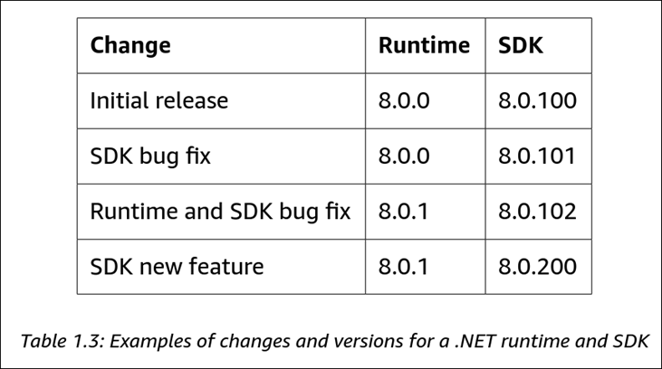

See https://learn.microsoft.com/en-us/dotnet/core/versions/

#### Using dotnet.exe to list and install .NET runtime and SDK versions

Use the `dotnet` command to uncover information about versions, runtimes, and SDKs.

`dotnet --version`


`dotnet --list-sdks`


`dotnet --list-runtimes`

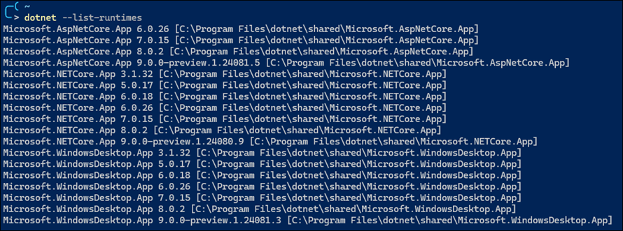

`dotnet --info`


Use `winget search Microsoft.DotNet` to find all the available versions.


Then use `winget install` to install a specific runtime or SDK version.

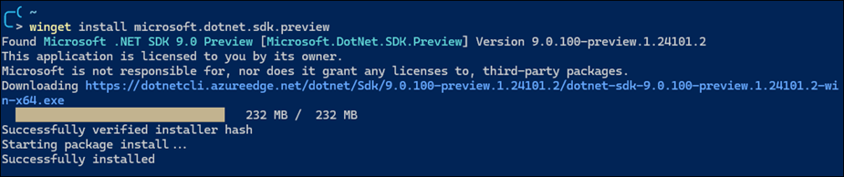

#### Understanding intermediate language

The C# compiler (named **Roslyn**) used by the `dotnet.exe` CLI tool converts C# source code into **intermediate language (IL)** code and stores the IL in an **assembly** (a DLL or EXE file). IL code statements are like assembly language instructions, which are executed by .NET's virtual machine, known as CoreCLR.

At runtime, CoreCLR loads the IL code from the assembly, the **just-in-time (JIT)** compiler compiles it into native CPU instructions, and then it is executed by the CPU on your machine.

The benefit of this two-step process is that Microsoft can create CLRs for Linux and macOS as well as for Windows.  The same IL code runs everywhere because of the second compilation step, which generates code for the native OS and CPU instruction set.

See [this ChatGPT thread](https://chat.openai.com/share/37fbe918-a6fd-470b-9ffe-ec48dd62b920) for a brief discussion on the Common Language Runtime and just-in-time compilation.

See https://github.com/dotnet/roslyn

#### Specifying Visual Studio package source

When creating a new application and building it for the first time, you may get an error like this:

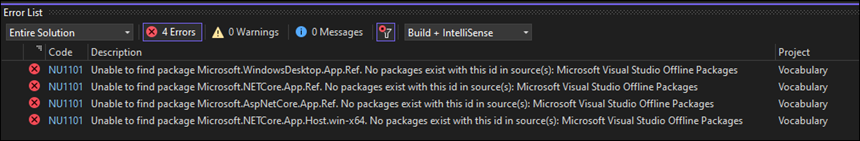

The error message is related to missing package sources from the NuGet package manager.  To fix this, open the NuGet package manager settings and verify the package source URL has been added:

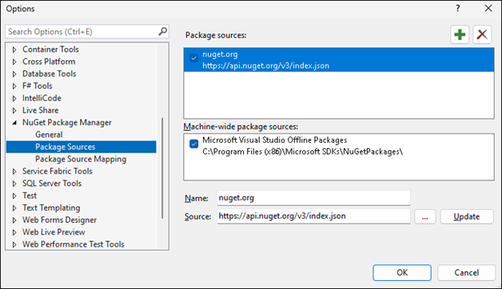

See [Visual Studio Package Sources](https://learn.microsoft.com/en-us/nuget/consume-packages/install-use-packages-visual-studio#package-sources) for more details.

#### About top-level programs and boilerplate code

Projects created with .NET SDK 5 or earlier always start with the following boilerplate code.

```dotnet
namespace ConsoleApp1
{
    internal class Program
    {
        static void Main(string[] args)
        {
            Console.WriteLine("Hello, World!");
        }
    }
}
```

Starting with .NET 6, Microsoft updated the project template such that new projects use the following minimal statements. These minimal statements are enabled because the required code is written for you by the compiler when you target .NET 6 or later.

```dotnet
// See https://aka.ms/new-console-template for more information
Console.WriteLine("Hello, World!");
```

The following screenshot shows how the compiler defined a hidden `Program` class with a method named `<Main>$`:  

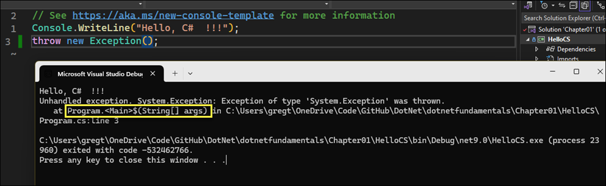

The only functional difference is that the auto-generated code does not define a namespace, so the `Program` class is implicitly defined in an empty namespace with no name instead of a namespace that matches the project.

The following screenshot shows how the Program class does not belong to a namespace:

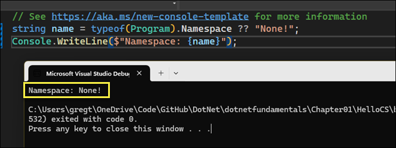

One main requirement is there can only be one file like this in a project.

See [Explore top-level statements](https://learn.microsoft.com/en-us/dotnet/csharp/tutorials/top-level-statements).

#### Implicitly importing namespaces and static members

Using the statement `Console.Writeline` requires the `using System` statement at the top of the file. Traditionally, every `.cs` file that needs to import namespaces would have to start with `using` statements to import those namespaces. Namespaces like `System` and `System.Linq` are needed in almost all `.cs` files.  

C# 10 (2021) introduced the `global using` keyword combination, which means you only need to import a namespace in one `.cs` file, and it will be available throughout all `.cs` files.

You can put `global using` statements in the `Program.cs` file, but it's recommended to create a separate file for those statements. The file can be named something like `GlobalUsings.cs` and could look like:

```c#
global using global::System;
global using global::System.Linq;
global using global::System.Collections.Generic;
```

Starting with .NET 6, for any new projects, the compiler generates a `<ProjectName>.GlobalUsings.g.cs` file. Note the **g** for **generated** to differentiate it from developer-written code files. The list of implicitly imported namespaces depends on which SDK you target, e.g. `Microsoft.NET.Sdk`, `Microsoft.NET.Sdk.Web`, `Microsoft.NET.Sdk.Worker`.

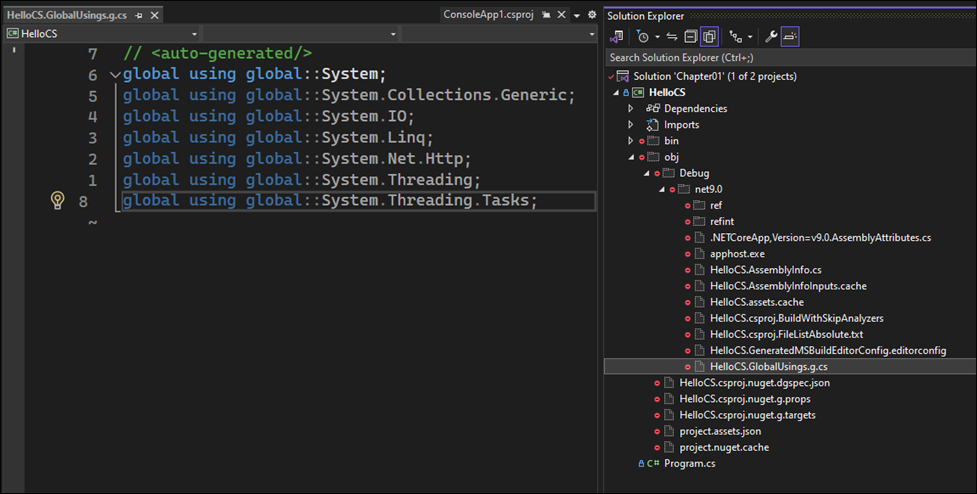

You can control which namespaces are implicitly imported  by adding the `<ItemGroup>` and `<Using>` elements in the project's `.csproj` file:

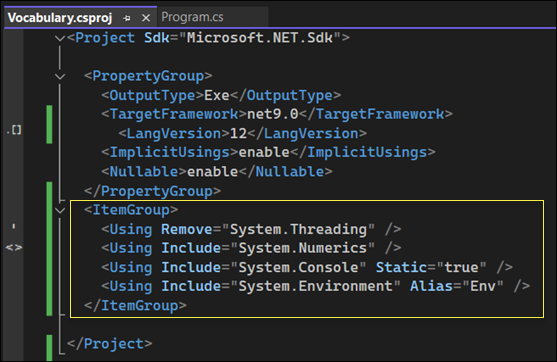

Upon saving the `.csproj` file, the `GlobalUsings.cs` file is automatically updated:

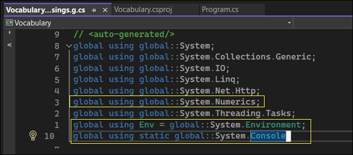

**Good Practice**: To simplify your code, each time you create a new project, modify the project's `.csproj` file to change what is included in the auto-generated class file in the `obj` folder hierarchy.

##### Importing a static type for a single file

You can statically import the `System.Console` class by specifying the following at the top of the code:

```csharp
using static System.Console
```

This change allows you to call methods like `WriteLine` without having to prefix them with `Console`. You can also reference the `Environment` class using its alias `Env`:


This specification is used to make the code more concise by allowing direct access to static members without having to repeat the class name (`Console` in this case). It's a feature introduced in C# 6.0 (2015) to improve code readability and reduce redundancy.

In C# and other .NET languages, the `static` keyword used in the context of a `using` directive serves a specific purpose that differs from the usage without `static`:

1. **`using System.Console;`**:
   - This line of code, as stated, would be incorrect because the `using` directive is typically used to include namespaces, not classes. The purpose of a `using` directive is to allow the use of types in a namespace so that you don't have to qualify the use of a type in that namespace with the namespace's name.
   - For example, `using System;` allows you to use types in the `System` namespace without prefixing them with `System.`, like `Console.WriteLine()` instead of `System.Console.WriteLine()`.

2. **`using static System.Console;`**:
   - This syntax is correct and useful. The `using static` directive imports the static members of a class, allowing you to use those static members without specifying the class name.
   - When you write `using static System.Console;`, you are telling the compiler that you want to use the static members of the `Console` class without having to prefix them with `Console.` every time. This means you can just write `WriteLine("Hello, World!");` instead of `Console.WriteLine("Hello, World!");`.
   - This makes the code cleaner and more concise, especially when you are using a lot of static members from a single class.


Instead of statically importing the `Console` class just for one code file, you can import it globally for all code files in a project.

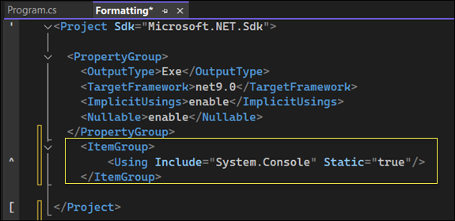

See the following:

- [Implicit using directives](https://learn.microsoft.com/en-us/dotnet/core/project-sdk/overview#implicit-using-directives).
- [Global and implicit usings](https://devblogs.microsoft.com/dotnet/welcome-to-csharp-10/)

#### Visual Studio - configure startup projects

In Visual Studio, when you have multiple projects in a solution you must manually change a project as the startup project to run the application. You can avoid this behavior by setting the startup project to the current selection.

In Visual Studio, from the Solution options, click **Configure Startup Projects** and set the startup project to **Current Selection**. This makes it very easy to switch startup projects simply by clicking the project to make it the startup project.

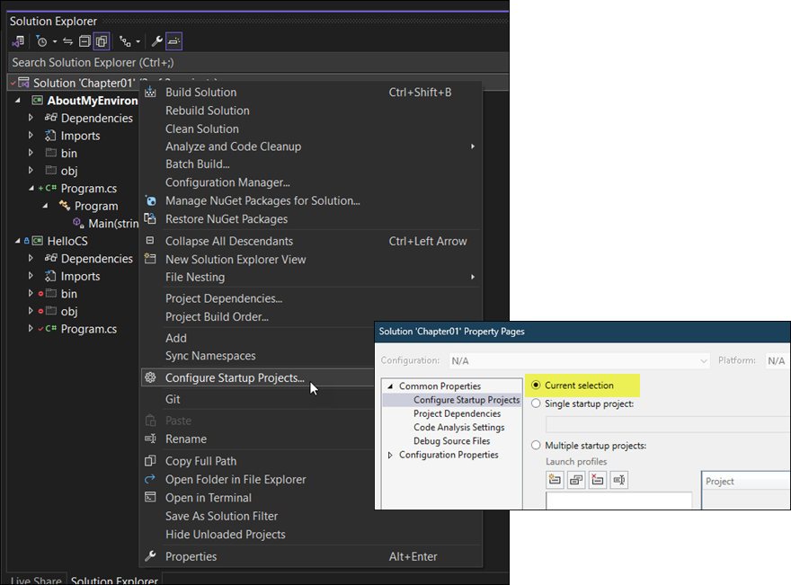

#### Using dotnext.exe to create solutions and projects

Using `dotnet help <command>` will open a web browser with the page in the documentation about the command.

See the following page for an overview on using the `dotnet` options: https://github.com/markjprice/cs12dotnet8/blob/main/docs/ch01-project-options.md

Use `dotnet new sln` to create a new solution.

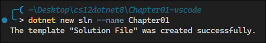

Here are the contents of the resulting solution file:

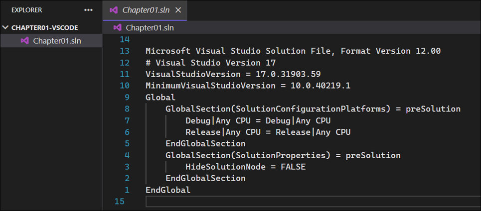

Use `dotnet new console` to create a new console application:


This action creates a new file structure with the `.csproj` file:

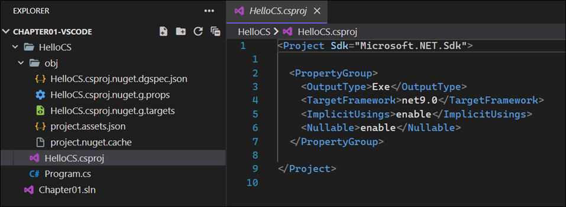

The previous command targets your latest .NET SDK version by default.  Use the `-f` switch to specify a target framework:

`dotnet new console -f net6.0`

Use `dotnet sln add` to add the project to the solution:

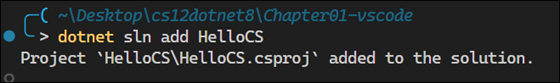

Use `dotnet run` to compile and execute the program:

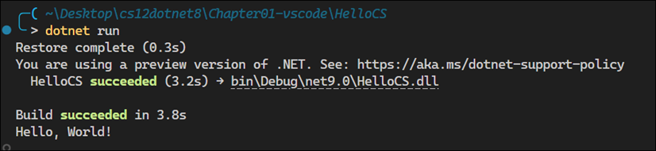

#### Displaying inline hints

To enable assistance with explicitly-specified parameters, in Visual Studio enable the option **Display inline parameter hints**.

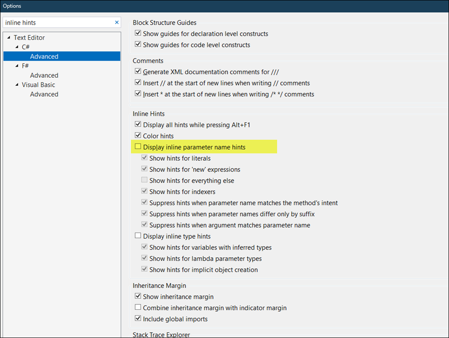

Visual Studio Code has a setting with the same name.

This feature shows the names of the parameters without you having to type them.

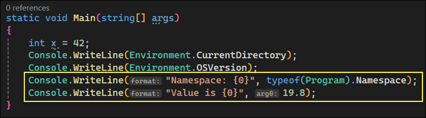

#### C# public repositories, design guidelines, standards

##### Design Guidelines

Back in the early .NET Framework era, Microsoft published a book that gave good practices in all areas of .NET development. Those recommendations are still very much applicable to modern .NET. Topics include:

- Naming guidelines
- Type design guidelines
- Member design guidelines
- Designing for extensibility
- Exception design guidelines
- Usage guidelines
- Common design patterns

Microsoft has made excerpts of this book available at the following link:

- https://learn.microsoft.com/en-us/dotnet/standard/design-guidelines/

##### Public Repositories

- [C# Language Design](https://github.com/dotnet/csharplang) - Includes meeting notes, proposals, and spec.
- [Compiler Implementation (Roslyn)](https://github.com/dotnet/roslyn)

##### Standards

C# has also become part of several standards. However, adoption takes a long time. The language is currently at 11/12, but the latest version standard, 6.0, was released in 2015. There are drafts for 7, 8, and 9. See [Standard to describe the language](https://github.com/dotnet/csharpstandard)


#### Specifying SDK and C# language versions

The .NET language compiler for C# is also known as **Roslyn**. There is a separate compiler for F#. Both compilers are distributed as part of the .NET SDK. To use a specific version of C#, you must have at least that version of the .NET SDK installed. The projects you create can target older versions of .NET and still use a modern compiler version. 

Use `dotnet --version` to output the SDK version:


The SDK will use the latest supported language version by default. To target a specific language version compiler, you must add the `<LangVersion>` tag to the project configuration file (*.csproj):

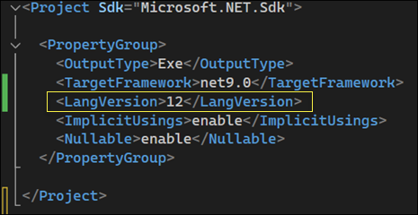

Targeting a specific language version will override the default language version that is picked from the `<TargetFramework>` tag.  

The [C# language version reference](https://learn.microsoft.com/en-us/dotnet/csharp/language-reference/configure-language-version) shows all supported C# language versions and their corresponding .NET versions.

You can also get a list of supported language versions on your system. See [this explanation](https://github.com/dotnet/docs/issues/27101#issuecomment-1172989898) for more info. Using this technique, you can uncover the supported language versions, even for preview releases:  

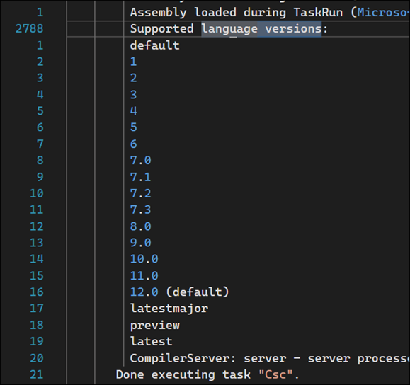

To confirm the language and compiler version, enter the following statement in a blank .cs program file and run it:  `#error version`.  You will get an error, but the error will indicate the language and compiler version. 
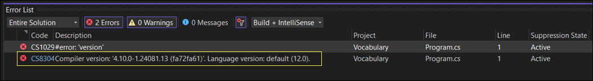

See:

- [Override the default](https://learn.microsoft.com/en-us/dotnet/csharp/language-reference/configure-language-version#override-the-default)
- [Error and Warning information](https://learn.microsoft.com/en-us/dotnet/csharp/language-reference/preprocessor-directives#error-and-warning-information)

### C# Language Features

#### C# Types vs Classes

C# doesn't define any types. Keywords such as `string` that look like types are **aliases**, which represent types provided by the platform on which C# runs. C# cannot exist alone. The platform on which C# runs is .NET, which provides tens of thousands of types to C#, including `System.Int32`, which is the C# keyword alias `int` maps to. In theory, someone could write a C# compiler that uses a different platform, with different underlying types.

**Type** is often confused with **class**. In C#, every **type** can be categorized as a `class`, `struct`, `enum`, `interface`, or `delegate`. As an example, the C# keyword `string` is a `class`, but `int` is a `struct`. So, it is best to use the term **type** to refer to both.

The following code outputs the number of types and methods in each loaded assembly:

```c#

using System.Reflection; 

System.Data.DataSet ds = new();
HttpClient client = new();

Assembly? myApp = Assembly.GetEntryAssembly();
if (myApp is null) return;
foreach (AssemblyName name in myApp.GetReferencedAssemblies())
{
    Assembly a =Assembly.Load(name);
    int methodCount = 0;
    foreach (TypeInfo t in a.DefinedTypes)
    {
        methodCount += t.GetMethods().Length;
    }
    WriteLine("{0:N0} types with {1:N0} methods in {2} assembly.",
        arg0: a.DefinedTypes.Count(),
        arg1: methodCount,
        arg2: name.Name);  
}
```

Output:  
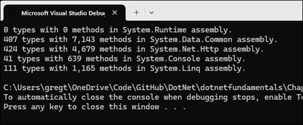

.NET assemblies have a large number of types and methods. The `System.Runtime` assembly does not have any types or methods because it only contains **type-forwarders** rather than actual types. A type-forwarder represents a type that has been implemented outside of .NET or for some other advanced reason.  

For this reason, learning C# can be challenging because there is an overwhelming number of types and methods to learn.

#### Variables and Naming Conventions</summary>

When using variables, you should think about, firstly, how much space the variable takes up in memory, and, secondly, how fast it can be processed. You control this by picking an appropriate type. 

In addition to what's shown below, some developers prefix the names of private fields with an underscore, e.g. `_dateOfBirth`.

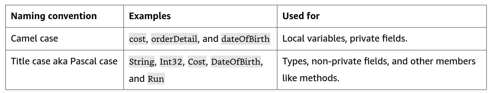

#### Chars

For text, a single letter is stored as a `char` type. However, don't always assume one `char` equals one letter or you could introduce bugs in your code. For example, the Egyptian Hieroglyph A002 (U +13001) needs two `System.Char` values (known as surrogate pairs) to represent it: `\uD80C` and `\uDC01`.

A `char` is assigned using single quotes around the literal value.

```c#
char letter = 'A';
char digit = '1';
char symbol = '$';
char userChoice = GetChar();
```

Text with multiple letters are stored as a `string` type instead of a `char` type.

#### Regular string literals

A literal string is a sequence of characters enclosed in double quotes `"`. Literal strings allow for the inclusion of escape sequences. For example, `\n` represents a newline, `\t` represents a tab, and `\\` represents a backslash.

```c#
string regularString = "First Line,\nSecondLine.";
```

#### Verbatim string literals

A verbatim string is used to denote that the string should be taken exactly as is, without interpreting any escape sequences or special characters within it. All characters in the string, including newlines, tabs, and other escape sequences, are treated as literal characters and are part of the string itself.

In C#, verbatim strings are denoted by the `@` symbol placed before the opening quotation mark:

```c#
string path = @"C:\Users\Example\Documents\file.txt"
```

In this example, normally the backslash character is used as an escape character in strings, meaning it would need to be doubled `\\` to represent a single backslash in a regular string. However, by using a verbatim string (prefixing the string with the `@` character), every character string is treated exactly as it appears, so single backslashes can be used directly without needing to be escaped.

Verbatim strings are useful for file paths, regular expressions, and any other strings where escape characters might frequently occur, simplifying the string's readability and maintenance.

Verbatim string literals were introduced with the language's inception, which was C# 1.0, released in 2000.

#### Interpolated string literals

Interpolated strings simplify string creation by allowing the inclusion of expression values directly within a string literal.

An interpolated string is identified by a dollar sign `$` prefix before the string literal quote. Inside the string, curly braces (`{}`) are used to denote expressions.

```c#
var name = "World";
var greeting = $"Hello, {name}!";
Console.WriteLine(greeting); // Output: Hello, World!
```

This feature was introduced in C# 6.0, which was released as part of the .NET Framework 4.6 in July 2015.

#### Interpolated verbatim string literals

For strings that need to include escape sequences like file paths, you can combine interpolated strings with verbatim strings by using both `$` and `@` symbols:

```c#
var userName = "JohnDoe";
var documentsFolder = @"C:\Users";

// Using an interpolated verbatim string to construct a file path
var userProfilePath = $@"{documentsFolder}\{userName}\Profile.txt";

Console.WriteLine(userProfilePath);
```

#### Raw string literals

Raw string literals  allow for multi-line strings and minimize the need for escape sequences. They are particularly useful for working with complex strings, such as JSON, XML, HTML, or regular expressions, making the code more readable by directly mirroring the content's format within the string. 

Here is an example of a raw string literal: 

```c#
var jsonString = """
{
  "name": "John Doe",
  "age": 30,
  "isEmployee": true,
  "addresses": [
    {
      "street": "1234 Elm Street",
      "city": "Gotham",
      "state": "NY"
    },
    {
      "street": "5678 Maple Avenue",
      "city": "Metropolis",
      "state": "IL"
    }
  ]
}
""";
```

Raw string literals have three or more double-quote characters.  Why three or more?  For scenarios where the content itself needs to have three double-quote characters, you can then use four double-quote characters to indicate the beginning and end of the content. Where the content needs to have four double-quote characters, you can then use five double-quote characters, and so on.

The compiler also looks at the indentation of the last three or more double-quote characters, and then automatically removes that level of indentation from all content inside the raw string literal. 

Example: No indentation of double-quote characters; output retains spacing

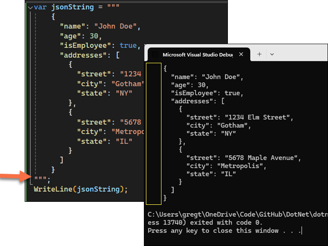

Example: Indentation of double-quote characters; spacing removed


Raw string literals were introduced in C# 11, as part of the .NET 7 preview releases in 2022.  

#### Raw interpolated string literals

Raw interpolated string literals combine the features of raw string literals and string interpolation, allowing you to include expressions within a raw string literal. Raw interpolated string literals simplify working with strings that span multiple lines and contain embedded expressions, without needing to escape special characters. These string types are particularly useful for generating strings with complex formats where readability and maintainability are important, and it avoides common pitfalls of traditional string concatenation or escape sequences.

Raw interpolated string literals are prefixed with a double dollar sign `$$`. The number of dollar signs tells the compiler how many curly braces are needed to become recognized as an interpolated expression. Inside the string, the number of curly braces are used to indicate the expression.

```c#
string name = "John";
int age = 30;

var message = $$"""
Hello, {{name}}!
You are {{age}} years old.
""";

Console.WriteLine(message);
```

Raw interpolated string literals were introduced in C# 11 in 2022, along with raw string literals.

#### Integer literals: decimal, binary, and hexadecimal numbers

Whole numbers can be stored in decimal, binary, or hexadecimal notation. An underscore can be used as a digit separator to improve legibility.

```c#
int decimalNotation = 2_000_000;
int binaryNotation = 0b_0001_1110_1000_0100_1000_0000;
int hexadecimalNotation = 0x_001E_8480;

Console.WriteLine($"{decimalNotation == binaryNotation}"); // True
Console.WriteLine($"{decimalNotation == hexadecimalNotation}"); // True
Console.WriteLine($"{decimalNotation:N0}"); // 2,000,000
Console.WriteLine($"{binaryNotation:N0}"); // 2,000,000
Console.WriteLine($"{hexadecimalNotation:N0}"); // 2,000,000
Console.WriteLine($"{decimalNotation:X}"); // 1E8480
Console.WriteLine($"{binaryNotation:X}"); // 1E8480
Console.WriteLine($"{hexadecimalNotation:X}"); // 1E8480
```

See https://learn.microsoft.com/en-us/dotnet/csharp/language-reference/builtin-types/integral-numeric-types#integer-literals

#### Integer types and the `sizeof` operator

Integral numeric types represent integer numbers. The table in [Characteristics of integral types](https://learn.microsoft.com/en-us/dotnet/csharp/language-reference/builtin-types/integral-numeric-types#characteristics-of-the-integral-types) lists all the supported types.

The following types are the main ones, but there are also additional signed types:

```c#
Console.WriteLine($"byte uses {sizeof(byte)} bytes and can store numbers in the range {byte.MinValue:N0} to {byte.MaxValue:N0}.");
Console.WriteLine($"short uses {sizeof(short)} bytes and can store numbers in the range {short.MinValue:N0} to {short.MaxValue:N0}.");
Console.WriteLine($"int uses {sizeof(int)} bytes and can store numbers in the range {int.MinValue:N0} to {int.MaxValue:N0}.");
Console.WriteLine($"long uses {sizeof(long)} bytes and can store numbers in the range {long.MinValue:N0} to {long.MaxValue:N0}.");
```

Output:  
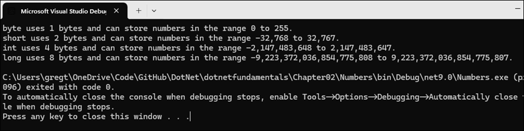

See [sizeof operator - determine the memory needs for a given type](https://learn.microsoft.com/en-us/dotnet/csharp/language-reference/operators/sizeof).

#### Real numbers: `float`, `double`, `decimal`

Floating-point numeric types represent real numbers. C# supports three predefined floating-point types: float, double, and decimal. Here are general usage guidelines:

- Use `float` when you need to save memory and do not require high precision. 

- Use `double` for general purpose and where exact representation of numbers is not critical.

- Use `decimal` where exact representation of numbers is critical and when a high level of accuracy is required.

When initializing a **Decimal** to a literal, you must specify the `m` or `M` suffix. This is because the C# compiler defaults to treating numeric literals with a decimal point as a **Double**. The `m` suffix explicitly tells the compiler that the literal should be treated as a **Decimal**. Similarly, you must also use the `f` suffix to explicitly tell the compiler that the literal is to be treated as a `float`. Optionally, you can specify the `d` suffix to explicitly tell the compiler that the literal is a double.

```c#
float a = 1.0f;
double b = 1.0d;
double c = 1.0;
decimal d = 2.1m;
```

The following screenshot depicts the size of each floating-point type and its range in values.

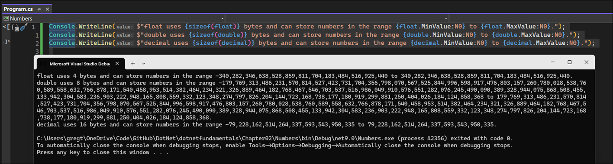

Interestingly, the smaller-sized double, which uses 8 bytes can store a wider range of numbers than the larger-sized decimal, which uses 16 bytes. The reason for this discrepancy pertains to the intent of use for each type.

The **Double** type uses 64-bits (8 bytes) of memory. Out of these bits, 1 bit is for the sign, 11 bits are for the exponent, and the remaining 52 bits are for the significant digts. The number of bits dedicated for storing the exponent are what yields the large range of numbers, but that large range comes at a cost of precision when compared to the **Decimal** type.

The **Decimal** types uses 128 bits (16 bytes) of memory. Out of these bits, 1 bit is for the sign, 5 bits are for the exponent, and the remaining 122 bits are for the signficant digits.

Because the **Decimal** type reserves a much higher number of bits for significant digits than the **Double** type, 122 vs 52, it has a much higher range of precision. As a result, the decimal type is appropriate applications where the degree of precision is important, such as financial applications.

The **Double** and **Decimal** use different internal representations, one of which may lead to unanticipated results.

Take the following code, which tests whether `0.1 + 0.2` is equal to `0.3` each for `Double` and `Decimal` types:

```c#
Console.WriteLine("Using doubles:");
double a = 0.1;
double b = 0.2;
if (a+b == 0.3)
{
    Console.WriteLine($"{a} + {b} equals 0.3");
}
else
{
    Console.WriteLine($"{a} + {b} does NOT equal 0.3");
}  

Console.WriteLine("Using decimals:");
decimal c = 0.1M;
decimal d = 0.2M;
if (c+d == 0.3M)
{
    Console.WriteLine($"{c} + {d} equals 0.3");
}
else
{
    Console.WriteLine($"{c} + {d} does NOT equal 0.3");
}
```

Output:  

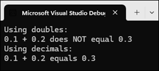

Why doesn't the **Double** type yield expected results, i.e. `0.1 + 0.2 == 0.3`?

The reason is that the **Double** (and **Float**) type represents numbers in base-2 (binary) floating-point format, according to the [IEEE 754](https://en.wikipedia.org/wiki/IEEE_754) standard. This format has finite precision, and numbers are stored in a way that _most_ numbers cannot be represented exactly in binary.

In this standard, the number `0.1` represented in binary is an infinite pattern of `0.00011001100110011...`. The pattern must be truncated to fit within the finite number of bits allocated for storing floating-point numbers, _resulting in a small rounding errors_.

To contrast, the **Decimal** type represents numbers in base-10 format rather than base-2. This allows it to precisely represent decimal fractions like `0.1` without rounding errors. As mentioned earlier, the 128-bit **Decimal** type reserves 122 bits for the significant digits. 96 bits of this amount are used to store the significant digits of the decimal number in binary as a three-32-bit integer value.

**Good Practice**: 

- Never compare `float` or `double` values for exact equality, i.e. using `==`.
- Use `int` for whole numbers. Use `double` for real numbers that will not be compared for equality (but you can compare for less than and greater than). Use `decimal` to compare the "equality" of a real number and where the accuracy of a real number is important.

The `float` and `double` types have some useful special values:

- `NaN` represents not-a-number (for example, the result of dividing by zero)
- `Epsilon` represents the smallest positive number that can be stored in a `float` or `double`
- `PositiveInfinity` and `Negative Infinity` represent infinitely large positive and negative values

There are also methods for checking these special values, like `IsInfinity` and `IsNaN`.

See https://learn.microsoft.com/en-us/dotnet/csharp/language-reference/builtin-types/floating-point-numeric-types

#### Implicit conversions of numeric types

You can mix [integral](https://learn.microsoft.com/en-us/dotnet/csharp/language-reference/builtin-types/integral-numeric-types) and the `float` and `double` types in an expression. In this case, integral types are implicitly converted to one of the following floating-point types and, if necessary, the `float` type is implicitly converted to `double`.

The expression is evaluated as follows:

- If there is a `double` type in the expression, the expression evaluates to `double` or to `bool` in relational and equality comparisons.
- If there is no `double` type in the expression, the expression evaluates to `float`, or to `bool` in relational and equality comparisons.

You can also mix integral and the `decimal` type in an expression. In this case, integral types are implicitly converted to the `decimal` type and the expression evaluates to `decimal`, or to `bool` in relational and equality comparisons.

You cannot mix the `decimal` type with the `float` and `double` types in an expression. If you want to perform an arithmetic, comparison, or equality operations, you must explicitly convert the operands either from or to the `decimal` type.

```c#
double a = 1.0;
decimal b = 2.1m;
Console.WriteLine(a + (double)b);
Console.WriteLine((decimal)a + b);
```

#### New number types, `Half`, `Int128`, and unsafe code

The `System.Half` type was introduced in .NET 5. See [Introducing the half type](https://devblogs.microsoft.com/dotnet/introducing-the-half-type/). Like `float` and `double`, it can store real numbers. It normally uses two bytes of memory. This type is useful in scenarios where the range and precision of `float` is not necessary and minimizing memory usage is desirable. Scenarios include game development, machine learning and AI, scientific computing, data transfer and storage, and embedded systems and IoT devices.

The `System.Int128` and `System.UInt128` types were introduced in .NET 7. Like `int` and `uint`, they can store signed and unsigned integers. They normally use 16 bytes of memory. This type is useful in scenarios requiring the representation of very large integers or precise arithmetic operations, including cryptography, financial calculations, scientific computing, high-resolution timekeeping, big data and analytics, game development, and distributed systems and blockchain.

For these new number types, the `sizeof` operator only works in an unsafe code block, and you must compile the project using an option to enable unsafe code.

```c#
unsafe
{
    Console.WriteLine($"Half uses {sizeof(Half)} bytes and can store numbers in the range {Half.MinValue:N0} to {Half.MaxValue:N0}.");
    Console.WriteLine($"Int128 uses {sizeof(Int128)} bytes and can store numbers in the range {Int128.MinValue:N0} to {Int128.MaxValue:N0}.");
}
```

Ouptut:

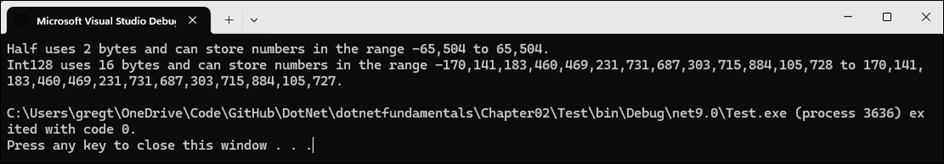

To enable unsafe code, use the `<AllowUnsafeBlocks>` tag in the `.csproj` file: 

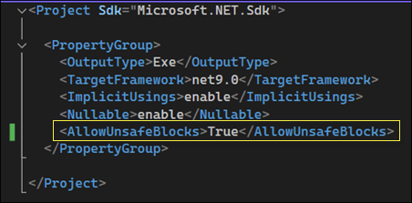

See the following:

- [Unsafe code, pointer types, and function pointers](https://learn.microsoft.com/en-us/dotnet/csharp/language-reference/unsafe-code)
- [AllowUnsafeBlocks](https://learn.microsoft.com/en-us/dotnet/csharp/language-reference/compiler-options/language#allowunsafeblocks)
- [Unsafe keyword](https://learn.microsoft.com/en-us/dotnet/csharp/language-reference/keywords/unsafe)

#### Booleans

Booleans can only containe one of two literal values `true` or `false`, as shown:

```c#
bool happy = true;
bool sad = false;
```
Booleans are mostly used to branch and loop.

See [bool (C# reference)](https://learn.microsoft.com/en-us/dotnet/csharp/language-reference/builtin-types/bool)

#### Storing any type of object using the `object` keyword

There is a special type named `object` that can store any type of data, but its flexibility comes at the cost of messier code and possibly poor performance. Because of those two reasons, you should avoid it whenever possible. 

The following steps show how you can use the `object` type:

```c#
object height = 1.88; // storing a double in an object
object name = "Amir"; // storing a string in an object 
Console.WriteLine($"{name} is {height} metres tall");
// int length1 = name.Length; // gives compile error!
int length2 = ((string)name).Length; // tell compiler it is a string
Console.WriteLine($"{name} has {length2} characters.");
```

The `object` type has been available since the first version of C#, but C# 2 and later have a better alternative called _generics_, which are covered later.

See [The object type](https://learn.microsoft.com/en-us/dotnet/csharp/language-reference/builtin-types/reference-types#the-object-type)

#### Dynamic types using the `dynamic` keyword

The `dynamic` keyword was introduced with C# 4.0 (2010) and enables dynamic type resolution at runtime. Unlike statically-typed variables, where the type is known at compile time, a `dynamic` type bypasses compile-time checking. This means that the operations involving `dynamic` variables are not checked by the compiler for correctnesss.

Dynamic variables allow for flexibility, especially when interacting with components or APIs where the type information is not available or not important at compile time. However, operations on `dynamic` variables, since they are not checked at compile time, can lead to runtime exceptions if the operation is not valid for the runtime object.

Dynamic variables are most useful in scenarios where static type checking is either not possible or overly restrictive, such as when interacting with COM objects, dynamic programming languages, or when dealing with structures like JSON that may have a variable structure not known until runtime. Dynamic types are also useful when operating with non-.NET systems. For example, you might need to work with a class library written in F#, Python, or some JavaScript. You might also need to interop with technologies like **Component Object Model (COM)** when automating things in Word or Excel.

Here's an example on using the `dynamic` type:

```c#
dynamic something;
// Storing an array of int values in a dynamic object
// An array of any type has a Length property
something = new[] { 3, 5, 7 };
Console.WriteLine($"The length of something is {something.Length}");
// Output the type of the something variable
Console.WriteLine($"The type of something is {something.GetType()}");
```

**Output**: The code runs successfully because an array type has a `Length` property.


```c#
dynamic something;
// Storing a string in a dynamic object
// string has a Length property
something = "Hello, World!";
Console.WriteLine($"The length of something is {something.Length}");
// Output the type of the something variable
Console.WriteLine($"The type of something is {something.GetType()}");
```

**Output**: The code runs successfully because a string type has a `Length` property.


```c#
dynamic something;
// Storing an int in a dynamic object
// int does not have a Length property
something = 12;
// Storing a string in a dynamic object
// This compiles but might thrown an exception at run-time
Console.WriteLine($"The length of something is {something.Length}");
// Output the type of the something variable
Console.WriteLine($"The type of something is {something.GetType()}");
```

**Output**: The code compiles but throws an error at runtime because an int type does not have a `Length` property.

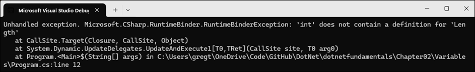

See the following: 

- [Understanding the Dynamic keyword in C#](https://learn.microsoft.com/en-us/archive/msdn-magazine/2011/february/msdn-magazine-dynamic-net-understanding-the-dynamic-keyword-in-csharp-4)
- [Using type dynamic](https://learn.microsoft.com/en-us/dotnet/csharp/advanced-topics/interop/using-type-dynamic)

#### The `var` keyword and implicitly-typed local variables

You can use the `var` keyword to declare local variables with C# 3 (2007) and later. The compiler infers the type from the value that you assign after the assignment operator, `=`. This happens at compile time, so using `var` has no effect on runtime performance.

The following table shows inference of local variable types:

| Type                   | Suffix     | Inferred Type |
|------------------------|------------|---------------|
| Number without decimal | (none)     | int           |
| Number without decimal | L          | long          |
| Number without decimal | UL         | ulong         |
| Number without decimal | M          | decimal       |
| Number without decimal | D          | double        |
| Number without decimal | F          | float         |
| Number with decimal    | (none)     | double        |
| Number with decimal    | M          | decimal       |
| Number with decimal    | F          | float         |
| Text                   | " "        | string        |
| Character              | ' '        | char          |
| Boolean                | true/false | bool          |

See the following example code:

```c#
var population = 67_000_000; // 67 million in UK
var weight = 1.88; // in kilograms
var price = 4.99m; // in pounds sterling
var fruit = "Apples"; // strings use double-quotes
var letter = 'Z'; // chars use single-quotes
var happy = true; // Booleans have value of true or false
```

The following code example shows a good use case of the `var` keyword and a poor use case.

```c#
using System.Xml;

// Good use of var because it avoids the repeated type
// as shown in the more verbose second statement
var xml1 = new XmlDocument();  // Works with C# 3 and later
XmlDocument xml2 = new XmlDocument();  // Works with all C# versions

// Bad use of var because we cannot tell the type, so we
// should use a specific type declaration as shown in the 
// second statement.
var file1 = File.CreateText("something1.txt");
StreamWriter file2 = File.CreateText("something2.txt");
```

The second code block that uses `var file1` is a poor use choice because it is not clear what type `file` is. Hovering over the `var` keyword indicates the type is `System.IO.StreamWriter`.

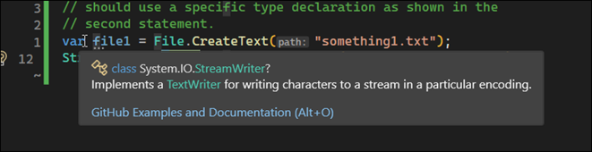

As a good practice, use `var` when the type is obvious. When in doubt, spell it out.  

From ChatGPT: 

In C#, the `var` keyword is used for implicitly typing local variables. Instead of explicitly specifying the data type of a variable, you can use `var`, and the compiler infers the type based on the expression used to initialize the variable.

The benefits of using `var` include:

1. **Conciseness**: Using `var` can make your code more concise and readable, especially when the type is obvious from the context. This can reduce unnecessary repetition and make the code easier to understand at a glance.

2. **Flexibility**: If you decide to change the type of the variable later, you only need to change the type of the expression on the right-hand side of the assignment, rather than having to update the type in multiple places throughout your code.

3. **Enhanced Maintenance**: Since the type is inferred by the compiler, there's less chance of introducing bugs due to type mismatches when refactoring or modifying code.

4. **Promotes Encapsulation**: Using `var` encourages developers to focus on the interface rather than the implementation details, promoting encapsulation and abstraction.

However, it's important to use `var` judiciously. While it can improve readability and maintainability in many cases, it should not be used excessively, especially in cases where the type is not immediately obvious from the context. Additionally, it's essential to ensure that the type inferred by the compiler is indeed what you intended, as using `var` excessively might obscure the actual type of the variable, making the code less understandable for others.

See [Implicitly Typed Local Variables](https://learn.microsoft.com/en-us/dotnet/csharp/programming-guide/classes-and-structs/implicitly-typed-local-variables)

#### Using target-typed new, `new()`, to instantiate objects

Microsoft introduced target-typed `new` expressions in C# 9.0 (2020) to improve the conciseness of code. This feature allows the type of the new expression to be inferred by the compiler based on the context in which it is used, eliminating the need to explicitly specify the type if it can be clearly inferred from the assignment or declaration.

**Benefits of Target-Typed New Expressions:**

1. **Conciseness and Readability**: It reduces the amount of boilerplate code, making the code more concise and easier to read, especially when the type is already mentioned in the variable declaration.

2. **Maintainability**: If you need to change the type of the variable, you only need to change it in the declaration, not in the instantiation.

3. **Less Redundancy**: It avoids the redundancy of having to repeat the type when it is already evident from the context.

4. **Compatibility with Anonymous Types**: It allows for more consistent syntax when dealing with anonymous types or when the exact type is unknown or cumbersome to type out.

Here's an example to illustrate the difference:

**Before C# 9.0:**

```csharp
List<string> names = new List<string>();
```

**With C# 9.0 using target-typed new expressions:**

```csharp
List<string> names = new();
```

In the example above, `List<string>` is specified twice in the pre-C# 9.0 syntax. With the introduction of target-typed `new` expressions, the type is specified once, and the `new` expression infers the type from the variable declaration.

**Prior to the Introduction:**

Before this feature was introduced, when instantiating objects or collections, developers had to specify the type both at the declaration and at the instantiation. This was particularly verbose when dealing with complex generic types or when the type was already specified on the left-hand side of an assignment. For example, when you had a property or method return type specified, you still had to repeat the type name when using `new` to create an instance.

**Example without target-typed new expressions:**

```csharp
Dictionary<int, List<string>> map = new Dictionary<int, List<string>>();
```

The introduction of target-typed `new` expressions streamlined object creation and made the code less verbose and more focused on the developer's intent rather than repeating type information.

**Good Practice**: Use target-typed `new` to intsantiate objects because it requires fewer characters, you immediately know the type of the variable, and it is not limited to local variables like `var` is. The only reason not to use target-typed `new` is if youmust use a pre-version 9 C# compiler, though this opinion may not be accepted by the whole C# community.

See [Target-typed `new` expressions](https://learn.microsoft.com/en-us/dotnet/csharp/language-reference/proposals/csharp-9.0/target-typed-new)

#### Value types and reference types, boxing and unboxing

In C#, the distinction between value types and reference types is a fundamental concept related to how they are stored and handled in memory.

**Value Types:**

1. **Storage**: Value types are stored on the stack, which means they hold their data directly in the location where they are declared. However, when they are part of a class (which is a reference type), they are stored in the heap within that class object.

2. **Copying**: When a value type is assigned to another variable, a copy of the value is made. Changes to one variable do not affect the other.

3. **Default Values**: Value types cannot be null (unless they are nullable types) and have default values. For example, the default value for an `int` is `0`.

4. **Types**: Value types include all the primitive types such as `int`, `double`, `char`, `bool`, as well as structures (`struct`) and enumerations (`enum`).

**Reference Types:**

1. **Storage**: Reference types are stored on the heap. A variable of a reference type stores a reference (pointer) to the memory location where the data is held, not the data itself.

2. **Copying**: When a reference type is assigned to another variable, the reference is copied, not the object itself. This means both variables now refer to the same object in memory, so changes to one affect the other.

3. **Default Values**: Reference types can be null, meaning they do not reference any object.

4. **Types**: Reference types include classes (`class`), arrays, delegates, and interfaces (`interface`).

**Examples:**

Value type example:
```csharp
int a = 10;
int b = a; // b is a copy of a
b = 20; // Changing b does not affect a
```

Reference type example:
```csharp
var list1 = new List<int> { 1, 2, 3 };
var list2 = list1; // list2 references the same object as list1
list2.Add(4); // Changing list2 affects list1 because they reference the same object
```

**Boxing and Unboxing:**

The process of converting a value type to a reference type is called boxing, and the reverse process is called unboxing. Boxing is implicit, while unboxing is explicit and requires a cast. Boxing and unboxing can have performance implications because they involve copying data and potentially heap allocation.

**Example of Boxing and Unboxing:**

Boxing:
```csharp
int valType = 10;
object obj = valType; // Boxing
```

Unboxing:
```csharp
int valTypeAgain = (int)obj; // Unboxing
```

Understanding the difference between value types and reference types is crucial for effective memory management and performance optimization in C#.

See [Value types and reference types](https://learn.microsoft.com/en-us/dotnet/visual-basic/programming-guide/language-features/data-types/value-types-and-reference-types)

#### Default value expressions using the `default` operator

The `default` operator in C# is used to obtain the default value of a type. The behavior of the `default` operator depends on whether the type is a reference type or a value type:

- For **reference types** (strings, classes, interfaces, delegates, or records), the default value is `null`.
- For **value types** (structs, enums, and all primitive types like `int`, `bool`, `char`, etc.), the default value is a bit pattern that represents 0. For example, for numeric types, it's `0`; for `bool`, it's `false`; and for a struct, it's each member set to its default value.

##### When It Was Introduced

The `default` keyword has been part of C# since its early versions, but its usage was enhanced in C# 7.1.

- **Prior to C# 7.1**, you had to specify the type when using `default`, like `default(int)` or `default(T)` where `T` is a type parameter in generics.
- **Starting with C# 7.1**, you can use the `default` literal without specifying a type, and the compiler infers the type based on the context. This means you can write `int myInt = default;` instead of `int myInt = default(int);`.

##### Practical Use Cases

1. **Initialization**: When you need to initialize a variable to its default value but don't want to hardcode a specific value. This is particularly useful in generics where the type `T` might be unknown.
   
   ```csharp
   T value = default;
   ```

2. **Resetting Values**: In scenarios where you need to reset a variable to its default state.

   ```csharp
   myVariable = default;
   ```

3. **Default Parameters in Methods**: You can use `default` as a way to specify default values for parameters in methods, especially for generic parameters.

   ```csharp
   void MyMethod<T>(T param = default) { }
   ```

4. **Switch Statements**: In pattern matching with `switch` statements, you can use `default` as a catch-all case for types that don't match any of the specified patterns.

   ```csharp
   switch (obj)
   {
       case int i:
           Console.WriteLine("It's an integer");
           break;
       default:
           Console.WriteLine("It's something else");
           break;
   }
   ```

5. **Null Coalescing and Conditional Operations**: You can use `default` with the null-coalescing operator `??` to provide a default value for nullable types when they are null.

   ```csharp
   int? nullableInt = null;
   int myInt = nullableInt ?? default; // myInt will be 0
   ```

6. **Generics and Constraints**: When working with generic types with constraints, `default` can be used to initialize or reset generic variables to a base state without knowing the specific type at compile time.

In summary, the `default` operator in C# offers a flexible and type-safe way to work with default values, making code more readable and maintainable, especially in generic programming and scenarios where type inference is beneficial.

##### Exploring default values

Take the following code:

```c#
Console.WriteLine($"default(int) = {default(int)}");
Console.WriteLine($"default(bool) = {default(bool)}");
Console.WriteLine($"default(DateTime) = {default(DateTime)}");
Console.WriteLine($"default(string) = {default(string)}");
```

Output: 


The following code assigns a variable to its `default` value:

```c#
int number = 13;
Console.WriteLine($"number set to: {number}");
number = default;
Console.WriteLine($"number reset to its default: {number}");
```

Output:


See [default value expressions - produce the default value](https://learn.microsoft.com/en-us/dotnet/csharp/language-reference/operators/default)

#### Formatting using numbered positional arguments

One way of generating formatted strings is to use numbered positional arguments. This feature is supported in methods like `Write()`, `WriteLine()`, and `Format()`. These methods have up to three numbered arguments, named `arg0`, `arg1`, and `arg2`. If you need to pass more values, you cannot name them.

Example:

```c#
int numberOfApples = 12;
decimal pricePerApple = 0.35M;
string type = "organic";

// Up to three parameter values can use named arguments
Console.WriteLine(
    format: "{0} {1} apples cost {2:C}",
    arg0: numberOfApples,
    arg1: type,
    arg2: pricePerApple * numberOfApples);

// Four or more parameter values cannot use named arguments
Console.WriteLine(
    "{0} {1} lived in {2} and worked in the {3} team at {4}.",
    "Roger", "Cevung", "Stockholm", "Education", "Optimizely");

```

**Good Practice**: Once you become familiar with formatting strings, you should stop naming the parameters. For example, stop using `format:`, `arg0:`, and `arg1:`. The preceeding code using a canonical style to show where the `0` and `1` came from.

In C#, formatting strings with numbered positional arguments enhances string manipulation and output formatting by providing a more flexible and readable way to compose strings with dynamic data. This feature is particularly useful in scenarios involving internationalization, complex string constructions, and when reusing arguments in different places within the same string.

##### Benefits of Numbered Positional Arguments

1. **Reusability of Arguments**: You can reuse the same argument multiple times in a formatting string without having to specify it multiple times. This reduces redundancy and the potential for errors.

2. **Order Independence**: The arguments can be placed in any order within the string, providing flexibility in how the string is composed. This is especially useful for localization where the order of words might change based on the language.

3. **Improved Readability**: By using numbered placeholders, the string's intended structure is clearer to the reader, especially in complex formats or when the same argument is used multiple times.

4. **Simplifies Dynamic Content Insertion**: It makes it easier to dynamically insert content into strings, as the placeholders clearly define where the dynamic content goes.

##### History and Evolution

- **Early C# Versions**: Initially, C# supported format strings in methods like `String.Format()`, `Console.WriteLine()`, and others, using indexed placeholders (`{0}`, `{1}`, etc.) which referred to the zero-based index of the corresponding object in the method call. This feature has been available since the first version of C#.

- **C# 6.0 (Introduced in 2015)**: String interpolation was introduced, allowing developers to embed expressions directly in string literals using the `$` syntax. However, this doesn't use numbered positional arguments but rather directly embeds the variable or expression within the string.

- **C# 10 and Beyond**: While the basic concept of formatting strings with numbered positional arguments has not fundamentally changed, improvements and additions to string manipulation and formatting options have been introduced over the years, including enhanced string interpolation, raw string literals for better handling of escape sequences and newlines, and more.

The introduction of string interpolation did not eliminate the use of numbered positional arguments but provided an alternative that can be more readable and concise for inline expressions and variables. The choice between using traditional format strings with numbered placeholders and string interpolation often comes down to the specific needs of the application, such as whether the format string is dynamically generated or localized, or the preference for inline variable embedding versus explicit positional arguments.

In summary, the use of numbered positional arguments in C# format strings offers a combination of flexibility, readability, and reusability that is essential for producing dynamic strings in a maintainable and error-resistant manner. This feature complements the string manipulation capabilities of C#, adapting to various scenarios from simple console outputs to complex internationalized applications.

#### Formatting using interpolated strings

In .NET, interpolated strings provide a convenient way to format strings with embedded expressions. Introduced in C# 6 (2015), interpolated strings allow you to insert values of variables or expressions directly into a string literal, making your code more readable and easier to understand. The interpolated string is defined by using the `$` symbol before the string literal, and expressions are enclosed in `{}` braces.

Here’s a basic overview of how to use interpolated strings in .NET:

##### Basic Syntax

```csharp
var name = "John";
var age = 30;
var message = $"My name is {name} and I am {age} years old.";
Console.WriteLine(message);
```

In the example above, `name` and `age` are variables whose values are embedded into the `message` string. The output will be: "My name is John and I am 30 years old."

##### Formatting Expressions

You can also apply format specifiers to control the formatting of the embedded expressions. Format specifiers follow the expression, separated by a colon `:`.

```csharp
var price = 123.456;
var formattedMessage = $"The price is {price:C2}.";
Console.WriteLine(formattedMessage);
```

In this example, `C2` is a format specifier that formats the number as currency with two decimal places. The output depends on the culture settings of your system; in the US, it might be "The price is $123.46."

##### Using With `CultureInfo`

You can specify the culture for formatting numbers, dates, and currencies within an interpolated string by using the `FormattableString` class and `CultureInfo`.

```csharp
using System.Globalization;

var date = DateTime.Now;
var culture = new CultureInfo("en-US");
var message = FormattableString.Invariant($"Today's date is {date:D}.");
var formattedMessage = string.Format(culture, $"Today's date is {date:D}.");
Console.WriteLine(message);
Console.WriteLine(formattedMessage);
```

In the above example, `FormattableString.Invariant` is used to apply a culture-invariant format, and `string.Format` along with `CultureInfo` is used to format the date according to a specific culture.

##### Escaping Braces

If you need to include a literal `{` or `}` in the string, you double them:

```csharp
var score = 10;
var message = $"Your score is {{score}}: {score}.";
Console.WriteLine(message);
```

This will output: "Your score is {score}: 10."

##### Combining `string` constants

Before C# 10 (2021), `string` constants could only be combined by using concatenation with the `+` operator, as shown here:

```csharp
private const string firstname = "Omar";
private const string lastname = "Rudberg";
private const string fullname = firstname + " " + lastname;
```

With C# 10, interpolated strings (prefixed with `$`) can now be used, as shown below:

```csharp
private const string fullname = $"{firstname}{lastname}";
```

This only works for combining `string` constant values. It cannot work for other types like numbers, which would require runtime data type conversions.

##### Caveats with interpolated strings

For short, formatted `string` values, an interpolated `string` can be easier for people to read. But things can get tricky if you need to restrict strings to certain column widths, where statements then need to wrap over multiple lines. In this case, it is easier to use numbered positional arguments rather than interpolated strings.

References:

- [String interpolation using `$`](https://learn.microsoft.com/en-us/dotnet/csharp/language-reference/tokens/interpolated)
- [String interpolation in C#](https://learn.microsoft.com/en-us/dotnet/csharp/tutorials/string-interpolation)

#### Interpolated strings with newlines in C# 11

Typically strings cannot include newlines its text segments, and must instead use escape sequences (like `\r\n`).  

```c#
// The following statement must be all on one line when using C# 10 or earlier.
// If using C# 11 or later, we can include a line break in the middle of an
// expression but not in the string text.

Console.WriteLine($"{numberOfApples} apples cost {pricePerApple 
    * numberOfApples:C}");
```

In C# 11 (2022), a notable improvement was made regarding string interpolation, specifically allowing new-lines (line breaks) in all interpolations within interpolated strings. This enhancement is part of the broader efforts to make string handling in C# more flexible and expressive, particularly in scenarios involving complex string construction or when embedding large blocks of text or code.

##### Before C# 11

Prior to C# 11, if you wanted to include an expression within an interpolated string that spanned multiple lines, you had to explicitly handle the new-lines or concatenate multiple interpolated strings together, which could lead to less readable and more cumbersome code.

For example, consider you had a multi-line expression you wanted to embed within an interpolated string. You would typically need to do something like the following:

```csharp
var name = "John";
var age = 30;
var address = "123 Main St";

// Pre C# 11 - Needing to concatenate strings or use workarounds
var message = $"Name: {name}\n" +
              $"Age: {age}\n" +
              $"Address: {address}";
```

##### With C# 11

Starting with C# 11, you can directly include new-line characters within interpolations in an interpolated string, making it significantly easier to work with multi-line expressions. This means you can now insert expressions that span multiple lines directly into the interpolation braces (`{}`), improving the readability and maintainability of your code.

Here's how you can leverage this in C# 11:

```csharp
var name = "John";
var age = 30;
var address = "123 Main St";

// C# 11 - Allowing new-lines in all interpolations
var message = $"""
    Name: {name}
    Age: {age}
    Address: {
address}
    """;
```

In this example, notice how the address expression is included directly within the interpolation braces and spans multiple lines. This is just a simple demonstration; the real benefit comes when dealing with complex expressions or formatting that would otherwise clutter your code.

##### Benefits and Use Cases

- **Improved Readability:** Code involving complex string constructions becomes easier to read and understand.
- **Enhanced Maintainability:** Reduces the need for concatenation or using additional variables to handle multi-line expressions, making code maintenance simpler.
- **Better Formatting Control:** Offers more control over the formatting of embedded expressions, especially when dealing with dynamically generated content or templates.

References:

- [Allow new-lines in all interpolations](https://learn.microsoft.com/en-us/dotnet/csharp/language-reference/proposals/csharp-11.0/new-line-in-interpolation)

#### Format strings, `{1,6:N0}`

Format strings allow you to control how values are displayed, including numbers, dates, times, and custom formats. C# utilizes composite formatting, which combines a format string with an array of objects to produce a formatted result. This system is used across various methods like `String.Format`, `Console.WriteLine`, and string interpolation (introduced in C# 6 with the `$` prefix).

```csharp
public static void WriteLine (string format, object? arg0, object? arg1);
```

A format string consists of static text intermixed with indexed placeholders, referred to as format items. A format item is enclosed in braces `{}` and can contain an index, an optional format string, and an optional alignment component:

```plaintext
{index[,alignment][:formatString]}
```

- **Index**: Refers to the zero-based position of the item in the method's argument list.
- **Alignment**: An optional integer indicating the total length of the field in which the argument is inserted. Positive values align the text to the right, while negative values align it to the left.
- **Format String**: An optional directive specifying how the argument should be formatted.

Here's an example:

```csharp
string applesText = "Apples";
int applesCount = 1234;
string bananasText = "Bananas";
int bananasCount = 56789;
Console.WriteLine();
Console.WriteLine(format: "{0,-10}{1,6}",
    arg0: "Name", arg1: "Count");
Console.WriteLine(format: "{0,-10}{1,6:N0}",
    arg0:applesText, arg1: applesCount);
Console.WriteLine(format: "{0,-10}{1,6:N0}",
    arg0:bananasText, arg1: bananasCount);
```

Output:


Reference:

- [Standard numeric format strings](https://learn.microsoft.com/en-us/dotnet/standard/base-types/standard-numeric-format-strings)
- [Custom numeric format strings](https://learn.microsoft.com/en-us/dotnet/standard/base-types/custom-numeric-format-strings)

#### Text input and handling null cases, `?` and `!`

Here's an example of using `Console.Readline()` to capture input.  

```csharp
Console.WriteLine("Type your first name and press Enter: ");
string? firstName = Console.ReadLine();
Console.WriteLine("Type your age and press Enter: ");
string age = Console.ReadLine()!;
Console.WriteLine($"Hello {firstName}, you look good for {age}!");
```

Things to note:

1. The `?` after `string` declaration is used to indicate the variable is nullable. See [Nullable Reference Types](https://learn.microsoft.com/en-us/dotnet/csharp/nullable-references).
2. The `!` before the semicolon suppresses nullable warnings. See [Null-forgiving operator](https://learn.microsoft.com/en-us/dotnet/csharp/language-reference/operators/null-forgiving).

#### Key input

You can use the `ReadKey` mehtod to get keyboard input from a user. This method waits for the user to press a key or key combination, which is returned as a `ConsoleKeyInfo` value.

```csharp
using static System.Console;

Write("Press any key combination: ");
ConsoleKeyInfo key = ReadKey();
WriteLine();
WriteLine("Key: {0}, Char: {1}, Modifiers: {2}", 
    arg0:key.Key, arg1:key.KeyChar, arg2:key.Modifiers);
```

Output: note how `key` has the properties representing the key pressed and any modifier keys

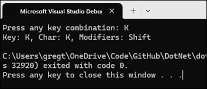

#### Passing arguments to a console app

When you want to run a console app, you often want to change its behavior by passing arguments. In every version of .NET prior to version 6 (2015), the console app project template made it obvious, as shown in the following code:

```csharp
namespace Arguments
{
    internal class Program
    {
        static void Main(string[] args)
        {
            Console.WriteLine("Hello, World!");
        }
    }
}
```

The `string[] args` arguments are declared and passed in the `Main` method of the `Program` class. However, in top-level programs, as used by the console app project template in .NET 6 and later, the `Program` class and its `Main` method are hidden, along with declaration of the `args` array. The trick is that you must know it still exists.

Command-line arguments are separated by spaces. Other characters like hyphens and colons are treated as part of an argument value.

To include spaces in an argument value, enclose the argument value in single or double quotes.

In Visual Studio, you can specify the arguments for running your program by clicking **Debug > "Project Name" Debug Properties**. This action brings up the "Launch Profiles" menu, where you can specify the arguments.

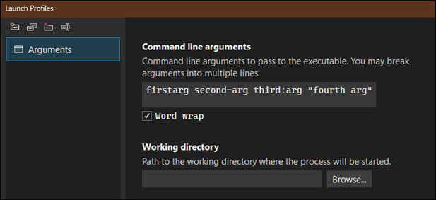

The results of the launch profile configuration are written to the **launchSettings.json** file in the project directory.

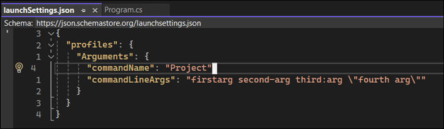

Given the following code, 

```csharp
WriteLine($"There are {args.Length} arguments.");
foreach (string arg in args)
    WriteLine(arg);
```

The resulting output is:

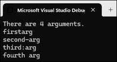

#### Setting options with arguments

The following example shows how you can 

```csharp
if (args.Length < 3)
{
    WriteLine("You must specify two colors and cursor size, e.g.");
    WriteLine("dotnet run red yellow 50");
    return; // stop running
}

ForegroundColor = (ConsoleColor)Enum.Parse(
    enumType: typeof(ConsoleColor),
    value: args[0], ignoreCase: true);
BackgroundColor = (ConsoleColor)Enum.Parse(
    enumType: typeof(ConsoleColor),
    value: args[1], ignoreCase: true);
CursorSize = int.Parse(args[2]);
```

When specifying `red yellow 50` in the launch profile configuration, the resulting output is, indicating that the foreground color was set to `red`, and the background color was set to `yellow`, and the cursor size, which you can't see, was set to `50`:

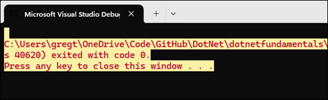

References

- [System.Console class](https://learn.microsoft.com/en-us/dotnet/api/system.console?view=net-8.0)

#### Handling platforms that do not support an API (conditional preprocessor directives)

In the last section, the call to set the cursor size is not supported on the macOS platform; it throws an exception. You can use `try`-`catch` statements to catch the exception and provide a friendlier message:

```csharp
try
{
    CursorSize = int.Parse(args[2]);
}
catch (PlatformNotSupportedException)
{
    WriteLine("This current platform does not support changing the size of the cursor.")
}
```

Another way to handle the differences is to use the `OperatingSystem` class in the `System` namespace, as shown:

```csharp
if (OperatingSystem.IsWindows())
{
    // Execute code that only works in Windows
} 
else if (OperatingSystem.IsWindowsVersionAtLeast(major:10))
{
    // Execute code that only works on Windows 10 or later
} else if (OperatingSystem.IsIOSVersionAtLeast(major:14, minor:5))
{
   // Execute code that only works on iOS 14.5 or later 
} else if (OperatingSystem.IsBrowser())
{
    // Execute code that only works in the browser with Blazor
}
```

See [OperatingSystem class](https://learn.microsoft.com/en-us/dotnet/api/system.operatingsystem?view=net-8.0)

A third way to handle different platforms is to use conditional compilation statements. There are four preprocessor directives that control conditional compilation: `#if`, `#elif`, `#else`, and `#endif`. The conditional preprocessor directives let you include or exclude code based on the existence of one or more symbols.

You define symbols using `#define` as shown:

```csharp
#define MYSYMBOL
```

Many symbols are automatically defined for you:


You can then write statements that will compile only for the specified platforms:

```csharp
#if NET7_0_ANDROID
// Compile statements that only work on Android
#elif NET7_0_IOS
// Compile statements that only work on iOS
# else
// Compile statements that work everywhere else.
#endif
```

See [C# preprocessor directives](https://learn.microsoft.com/en-us/dotnet/csharp/language-reference/preprocessor-directives)

#### Understanding `async` and `await`

C# 5 (2012) introduced two C# keywords when working with the `Task` type that enable easy multi-threading. The pair of keywords is especially useful in

- Implementing multitasking for a graphical user interface
- Improving the scalability of web applications and web services
- Preventing blocking calls when interacting with the filesystem, databases, and remote services, all of which tend to take a long time to complete their work

One of the limitations with console apps is that you can only use the `await` keyword inside methods that are marked as `async`, but C# 7 (2015) and earlier do not allow the `Main` mehtod to be marked as `async`. Luckily, a new feature introduced in C# 7.1 was support for `async` in `Main`.

The following code provides an example of how `async` can be used in a console app.

```csharp
HttpClient client = new();
HttpResponseMessage response = await client.GetAsync("http://www.apple.com");
WriteLine("Apple's home page has {0:N0} bytes.", response.Content.Headers.ContentLength);
```

Output:

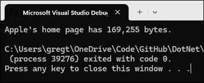

In .NET 5 and earlier you would've received an error message indicating the `await` operator can only be used within an async method, and to change the return type of the method to `Task`. You would've had to add the `async` keyword for your `Main` method and change its return type from `Void` to `Task`. 

With .NET 6 and later, the console app project template uses the top-level program feature to automatically define the `Program` class with an asynchronous `<Main>$` method for you.


#### Knowledge check

##### Exercise 2.1 - Test your knowledge

<details><summary>1. What statement can you type in a C# file to discover the compiler and language version?</summary><br>

Use statement `#error version`. See [Specifying SDK and C# language versions](#specifying-sdk-and-c-language-versions).

</details>

<details><summary>2. What are the two types of comments in C#?</summary><br>

The two types of comments are a single-line comment, `//`, and a multi-line comment, `/*` and `*/`.

</details>

<details><summary>3. What is the difference between a verbatim string and an interpolated string?</summary><br>

Standard strings allow for escape characters, e.g. `\n` to represent a newline. Verbatim strings, which are denoted with a `@`, do not process escape characters; instead, they depict an escape character as literal text.

Interpolated strings make code more user-friendly by allowing references to variables directly in the string itself, within curly braces, `{}`. Interpolated strings are denoted with a `$`.

See [Verbatim string literals](#verbatim-string-literals) and [Interpolated string literals](#interpolated-string-literals).

</details>

<details><summary>4. Why should you be careful when using `float` and `double` values?</summary><br>

`float` and `double` values store the fraction portion of the real number in binary representation rather than decimal representation. As a result, some numbers cannot be represented exactly, resulting in small rounding errors. You should never compare a `float` and `double` value for equality; instead, you should use a greater-than or less-than approach. Use the `decimal` type to compare real numbers for equality, as the decimal type stores the fraction part of the real number decimal representation rather than binary representation.

See [Real number types](#real-numbers-float-double-decimal).

</details>

<details><summary>5. How can you determine how many bytes a type like `double` uses in memory?</summary><br>

Use the `sizeof` operator.

See [Integer types and the `sizeof` operator](#integer-types-and-the-sizeof-operator)

</details>

<details><summary>6. When should you use the `var` keyword?</summary><br>

The `var` keyword is used to allow the compiler to infer type type of a variable. You should make a good habit of using the `var` keyword but only use it when the type can be easily deduced from the variable assignment.

See [The `var` keyword](#the-var-keyword-and-implicitly-typed-local-variables)

</details>

<details><summary>7. What is the newest syntax to create an instance of a class like `XmlDocument`?</summary><br>

The target-typed `new()` operator can be used to create new instances without having to explicitly list the type during assignment or declaration.

See [The `new()` operator](#using-target-typed-new-new-to-instantiate-objects).

</details>

<details><summary>8. Why should you be careful when using the `dynamic` type?</summary><br>

Operations on `dynamic` types are not checked at compile time. Therefore, there is increased risk of an error occurring during runtime for `dynamic` types.

See [Dynamic types](#dynamic-types-using-the-dynamic-keyword)

</details>

<details><summary>9. How do you right-align a format string?</summary><br>

When specifying a format, the alignment number can be used after the index number to indicate the number of characters to align. A positive number indicates left alignment. A negative number indicates right alignment.

```csharp
{index[,alignment][:formatString]}
```

See [Format strings](#format-strings-16n0)

</details>

<details><summary>10. What character separates arguments for a console app?</summary><br>

A space character separates arguments.

See [Passing arguments to a console app](#passing-arguments-to-a-console-app).

</details>

##### Exercise 2.2 - Test your knowledge of number types

What type would you choose for the following numbers?

- A person's telephone number:  `string`
- A person's height: `decimal`
- A person's salary: `int`
- A book's ISBN: `string`
- A book's price: `decimal`
- A book's shipping weight: `float`
- A country's population: `long`
- The number of stars in the universe: `double`
- The number of employees in each of the small or medium businesses in the US (up to ~50k employees per business): `long`

##### Exercise 2.3 - Practice number sizes and ranges

In the Chapter02 solution, create a console app project named Ch02Ex03Numbers that outputs the number of bytes in memory that each of the following number types uses and the minimum and maximum values they can have: `sbyte`, `byte`, `short`, `ushort`, `int`, `uint`, `long`, `ulong`, `Int128`, `UInt128`, `Half`, `float`, `double`, and `decimal`.

The result should look like the following


<details><summary>My solution</summary><br>

Here is the code to my solution:

```csharp
string hyphens = new string('-', 105);
string titleformat = "{0,-10}{1,-20}{2,30}{3,45}";
string format = "{0,-10}{1,-5}{2,45}{3,45}";
WriteLine($"{hyphens}");
WriteLine(titleformat, "Type", "Byte(s) of memory", "Min", "Max");
WriteLine(hyphens);
WriteLine(format, "sbyte", sizeof(sbyte), sbyte.MinValue, sbyte.MaxValue);
WriteLine(format, "byte", sizeof(byte), byte.MinValue, byte.MaxValue);
WriteLine(format, "short", sizeof(short), short.MinValue, short.MaxValue);
WriteLine(format, "ushort", sizeof(ushort), ushort.MinValue, ushort.MaxValue);
WriteLine(format, "int", sizeof(int), int.MinValue, int.MaxValue);
WriteLine(format, "uint", sizeof(uint), uint.MinValue, uint.MaxValue);
WriteLine(format, "long", sizeof(long), long.MinValue, long.MaxValue);
WriteLine(format, "ulong", sizeof(ulong), ulong.MinValue, ulong.MaxValue);
unsafe
{
    WriteLine(format, "Int128", sizeof(Int128), Int128.MinValue, Int128.MaxValue);
    WriteLine(format, "UInt128", sizeof(UInt128), UInt128.MinValue, UInt128.MaxValue);
    WriteLine(format, "Half", sizeof(Half), Half.MinValue, Half.MaxValue);
}
WriteLine(format, "float", sizeof(float), float.MinValue, float.MaxValue);
WriteLine(format, "double", sizeof(double), double.MinValue, double.MaxValue);
WriteLine(format, "decimal", sizeof(decimal), decimal.MinValue, decimal.MaxValue);
```

Output:

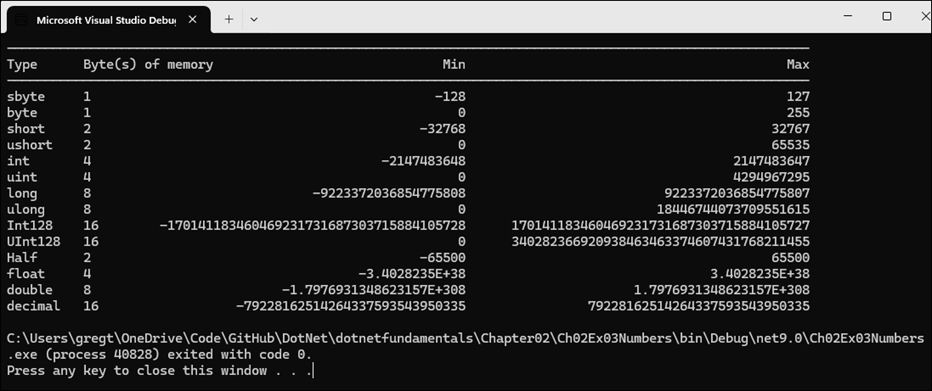

</details>

##### Exercise 2.4 - Explore topics

Use the links on the following page to learn more details about the topics covered in this chapter:

https://github.com/markjprice/cs12dotnet8/blob/main/docs/book-links.md#chapter-2---speaking-c

##### Exercise 2.5 - Explore Spectre

**Spectre** is a package that enhances console apps: https://spectreconsole.net


