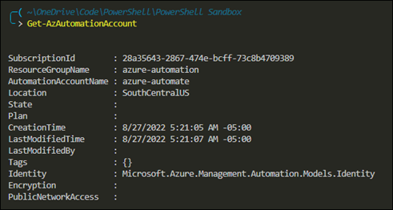
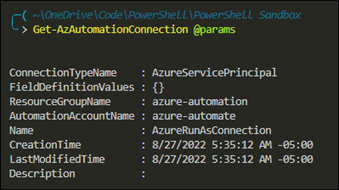
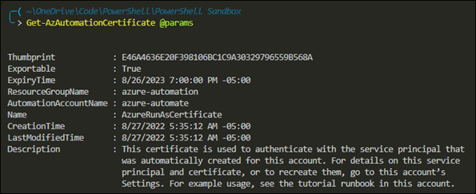
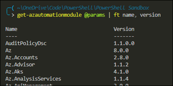
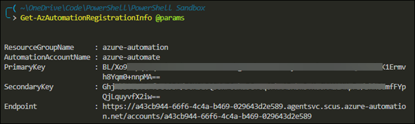
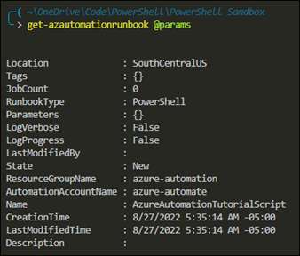

# Notes on Azure Automation
Helpful Links
- [Azure Automation's GitHub](https://github.com/azureautomation)
- [Az.Automation PowerShell Module Documentation](https://docs.microsoft.com/en-us/powershell/module/az.automation/?view=azps-8.2.0)
- [Blog: Using Azure DevOps Pipelines with Azure Automation](https://www.miru.ch/using-azure-devops-pipelines-with-azure-automation/) 

## PowerShell Usage
Use the module `Az.Automation`.  Here are some example commands and their output.

### Get-AzAutomationAccount
```powershell
Get-AzAutomationAccount
```


### Get-AzAutomationConnection
This command retrieves RunAs accounts.
```powershell
Get-AzAutomationConnection -AutomationAccountName <name> -ResourceGroupName <name>
```


### Get-AzAutomationCertificate
```powershell
Get-AzAutomationCertificate -AutomationAccountName <name> -ResourceGroupName <name>
```


### Get-AzAutomationModule
```powershell
Get-AzAutomationModule -AutomationAccountName <name> -ResourceGroupName <name>
```


### Get-AzAutomationRegistrationInfo
This command retrieves the endpoint URL and keys.  This information is used to register the hybrid runbook worker.
```powershell
Get-AzAutomationRegistrationInfo -AutomationAccountName <name> -ResourceGroupName <name>
```


### Get-AzAutomationRunbook
```powershell
Get-AzAutomationRunbook -AutomationAccountName <name> -ResourceGroupName <name>
```



## Miscellaneous Notes
When using the Azure AD module, you need to create a RunAs account.  The RunAs account is tied to a service principal.  This principal needs a role Azure AD to do its business.

Use the following commands to assign a role.

```powershell
# Get the service principal
$servicePrincipal = @{
  $ObjectId = 'Object Id of service principal'
}
$runAsSevicePrincipal = Get-AzureADServicePrincipal @servicePrincipal

# Add the Service Principal to the Directory Readers Role
Add-AzureADDirectoryRoleMember -ObjectId (Get-AzureADDirectoryRole | where-object {$_.DisplayName -eq "Directory Readers"}).Objectid -RefObjectId $runAsServicePrincipal.ObjectId

# Add the Service Principal to the User Administrator Role
Add-AzureADDirectoryRoleMember -ObjectId (Get-AzureADDirectoryRole | where-object {$_.DisplayName -eq "User Account Administrator"}).Objectid -RefObjectId $aaAadUser.ObjectId

# Add the Service Principal to the Global Administrator Role
Add-AzureADDirectoryRoleMember -ObjectId (Get-AzureADDirectoryRole | where-object {$_.DisplayName -eq "Company Administrator"}).Objectid -RefObjectId $runAsServicePrincipal.ObjectId
```