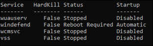
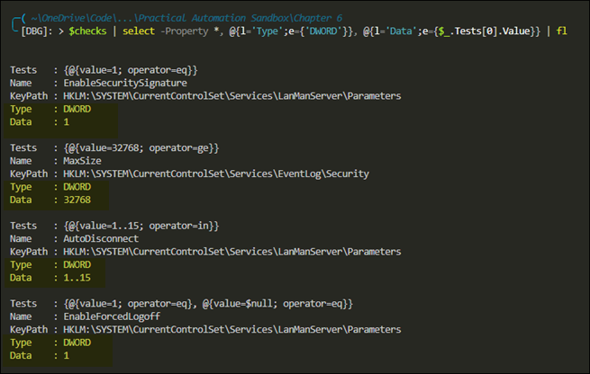

# Chapter 6 - Making Adaptable Automations

The author provides a nice template for creating modules. This script creates a module structure with blank files. 
```powershell
Function New-ModuleTemplate {
    [CmdletBinding()]
    [OutputType()]
    param(
        [Parameter(Mandatory = $true)]
        [string]$ModuleName,
        [Parameter(Mandatory = $true)]
        [string]$ModuleVersion,
        [Parameter(Mandatory = $true)]
        [string]$Author,
        [Parameter(Mandatory = $true)]
        [string]$PSVersion,
        [Parameter(Mandatory = $false)]
        [string[]]$Functions
    )
    $ModulePath = Join-Path .\ "$($ModuleName)\$($ModuleVersion)"
    New-Item -Path $ModulePath -ItemType Directory
    Set-Location $ModulePath
    New-Item -Path .\Public -ItemType Directory

    $ManifestParameters = @{
        ModuleVersion     = $ModuleVersion
        Author            = $Author
        Path              = ".\$($ModuleName).psd1"
        RootModule        = ".\$($ModuleName).psm1"
        PowerShellVersion = $PSVersion
    }
    New-ModuleManifest @ManifestParameters

    $File = @{
        Path     = ".\$($ModuleName).psm1"
        Encoding = 'utf8'
    }
    Out-File @File

    $Functions | ForEach-Object {
        Out-File -Path ".\Public\$($_).ps1" -Encoding utf8
    }
}

# Set the parameters to pass to the function
$module = @{
    # The name of your module
    ModuleName    = 'PoshAutomate-ServerConfig'
    # The version of your module
    ModuleVersion = "1.0.0.0"
    # Your name
    Author        = "YourNameHere"
    # The minimum PowerShell version this module supports
    PSVersion     = '5.1'
    # The functions to create blank files for in the Public folder
    Functions     = 'Disable-WindowsService', 
        'Install-RequiredFeatures', 'Set-FirewallDefaults', 
        'Set-SecurityBaseline', 'Set-ServerConfig', 
        'Test-SecurityBaseline'
}
# Execute the function to create the new module
New-ModuleTemplate @module
```

You can then add the following code to the .psm1 file to automatically import the functions from the `Public` folder.

```powershell
$Path = Join-Path $PSScriptRoot 'Public'
$Functions = Get-ChildItem -Path $Path -Filter '*.ps1'
 
Foreach ($import in $Functions) {
    Try {
        Write-Verbose "dot-sourcing file '$($import.fullname)'"
        . $import.fullname
    }
    Catch {
        Write-Error -Message "Failed to import function $($import.name)"
    }
}
```

## Waiting for Commands to Complete
Some commands, like `Stop-Service` have the `-NoWait` switch. This switch tells the cmdlet to send the stop signal but do not wait for it to stop.

Other commands, such as `Invoke-WebRequest` do not have a no-wait option. In these cases you can use PowerShell jobs to get the wait functionality:

```powershell
Start-Job -ScriptBlock {
Invoke-WebRequest -Uri $UrlA -OutFile $FileA
}
Start-Job -ScriptBlock {
Invoke-WebRequest -Uri $UrlB -OutFile $FileB
}
Get-Job | Wait-Job
```

Use the `Receive-Job` cmdlet to get the return information.

## Disabling Windows Services
The following script takes in a list of services and sets the startup type to `Disabled`.  It then attempts to stop the service and records the resulting state. If there are any services that haven't been stopped in the predetermined amount of time, then an attempt is made to kill the process. If the script is unable to kill the process, then a reboot flag is noted.  Here's an example of the output:



**Disable-WindowsService**  
```powershell
Function Disable-WindowsService {
    [CmdletBinding()]
    [OutputType([object])]
    param(
        [Parameter(Mandatory = $true)]
        [string[]]$Services,
        [Parameter(Mandatory = $true)]
        [int]$HardKillSeconds,
        [Parameter(Mandatory = $true)]
        [int]$SecondsToWait
    )

    [System.Collections.Generic.List[PSObject]] $ServiceStatus = @()
    foreach ($Name in $Services) {
        # Create a custom PowerShell object to track the status of each service
        $ServiceStatus.Add([pscustomobject]@{
                Service  = $Name
                HardKill = $false
                Status   = $null
                Startup  = $null
            })
        try {
            # Attempt to find the service, then disable and stop it
            $Get = @{
                Name        = $Name
                ErrorAction = 'Stop'
            }
            $Service = Get-Service @Get
            $Set = @{
                InputObject = $Service
                StartupType = 'Disabled'
            }
            Set-Service @Set
            $Stop = @{
                InputObject = $Service
                Force       = $true
                NoWait      = $true
                ErrorAction = 'SilentlyContinue'
            }
            Stop-Service @Stop
            Get-Service -Name $Name | ForEach-Object {
                $ServiceStatus[-1].Status = $_.Status.ToString()
                $ServiceStatus[-1].Startup = $_.StartType.ToString()
            }
        }
        catch {
            $msg = 'NoServiceFoundForGivenName,Microsoft.PowerShell' +
                '.Commands.GetServiceCommand'
            if ($_.FullyQualifiedErrorId -eq $msg) {
                # If the service doesn't exist, then there is nothing to stop, so consider that a success
                $ServiceStatus[-1].Status = 'Stopped'
            }
            else {
                Write-Error $_
            }
        }
    }

    $timer = [system.diagnostics.stopwatch]::StartNew()
    # Monitor the stopping of each service
    do {
        $ServiceStatus | Where-Object { $_.Status -ne 'Stopped' } | 
        ForEach-Object { 
            $_.Status = (Get-Service $_.Service).Status.ToString()
            
            # If any services have not stopped in the predetermined amount of time, kill the process.
            if ($_.HardKill -eq $false -and 
                $timer.Elapsed.TotalSeconds -gt $HardKillSeconds) {
                Write-Verbose "Attempting hard kill on $($_.Service)"
                $query = "SELECT * from Win32_Service WHERE name = '{0}'"
                $query = $query -f $_.Service
                $svcProcess = Get-CimInstance -Query $query
                $Process = @{
                    Id          = $svcProcess.ProcessId
                    Force       = $true
                    ErrorAction = 'SilentlyContinue'
                }
                Stop-Process @Process
                $_.HardKill = $true
            }
        }
        $Running = $ServiceStatus | Where-Object { $_.Status -ne 'Stopped' }
    } while ( $Running -and $timer.Elapsed.TotalSeconds -lt $SecondsToWait )
    # set reboot required if any services did not stop
    $ServiceStatus | 
        Where-Object { $_.Status -ne 'Stopped' } | 
        ForEach-Object { $_.Status = 'Reboot Required' }
    
    # return results
    $ServiceStatus
}
```

## Building Data-Driven Functions
The author provides an example of using registry checks to convert a PowerShell object into a JSON file. Use the JSON validator site at [jsonlint.com](https://jsonlint.com/) to validate JSON syntax.

**Creating JSON**
```powershell
[System.Collections.Generic.List[PSObject]] $JsonBuilder = @()
$JsonBuilder.Add(@{
    KeyPath =
    'HKLM:\SYSTEM\CurrentControlSet\Services\LanManServer\Parameters'
    Name    = 'EnableSecuritySignature'
    Tests   = @(
        @{operator = 'eq'; value = '1' }
    )
})
$JsonBuilder.Add(@{
    KeyPath =
    'HKLM:\SYSTEM\CurrentControlSet\Services\EventLog\Security'
    Name    = 'MaxSize'
    Tests   = @(
        @{operator = 'ge'; value = '32768' }
    )
})
$JsonBuilder.Add(@{
    KeyPath =
    'HKLM:\SYSTEM\CurrentControlSet\Services\LanManServer\Parameters'
    Name    = 'AutoDisconnect'
    Tests   = @(
        @{operator = 'in'; value = '1..15' }
    )
})
$JsonBuilder.Add(@{
    KeyPath =
    'HKLM:\SYSTEM\CurrentControlSet\Services\LanManServer\Parameters'
    Name    = 'EnableForcedLogoff'
    Tests   = @(
        @{operator = 'eq'; value = '1' }
        @{operator = 'eq'; value = '$null' }
    )
})
 
$JsonBuilder |
    ConvertTo-Json -Depth 3 |
    Out-File .\RegistryChecks.json -Encoding UTF8
```

**Updating JSON**  
You can then use the code below to add custom fields to your data, in this case the `Type` and `Value` fields:  


This script adds new properties and exports the data structure into a new .json file.
```powershell
$checks = Get-Content .\RegistryChecks.json -Raw | 
    ConvertFrom-Json

# Use the Select-Object to add new properties to the object
$updated = $checks | 
    Select-Object -Property *, @{l='Type';e={'DWORD'}}, 
        @{l='Data';e={$_.Tests[0].Value}}

# Convert the updated object with the new properties back to JSON and export
ConvertTo-Json -InputObject $updated -Depth 3 | 
    Out-File -FilePath .\RegistryChecksAndResolves.json -Encoding utf8
```
