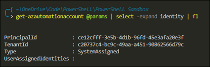
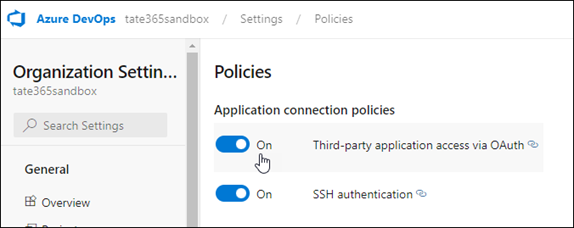
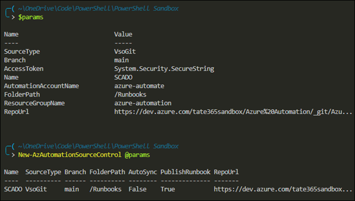
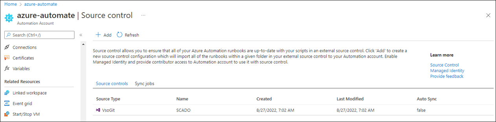

# Source Control Integration for Azure Automation
Links:
- [Use Source Control Integration](https://docs.microsoft.com/en-us/azure/automation/source-control-integration)
- [Managed Identities](https://docs.microsoft.com/en-us/azure/automation/automation-security-overview#managed-identities)
- [Azure DevOps Personal Access Tokens](https://docs.microsoft.com/en-us/azure/devops/organizations/accounts/use-personal-access-tokens-to-authenticate?view=azure-devops&tabs=Windows) 

## Walkthrough for Azure DevOps (Git) using PowerShell

### Prerequisites
- A source control repository (GitHub or Azure DevOps)
- A system-assigned or user-assigned managed identity
- Managed identity must have the Contributor role in the Automation account
- The source code repository must have a folder to be used as the folder path

Quick note on Managed identities
- They are the recommended method for authenticating in runbooks
- Don't require you to provision or rotate any secrets
- Don't have to specify Run As connection object in your code
- Two types:
  - **System-assigned identity**: tied to the application and is deleted if the app is deleted
  - **User-assigned identity**: a standalone Azure resource that can be assigned to your app. Supported for cloud jobs only.

Use `Get-AzAutomationAccount` to confirm enablement of the managed identity:  


Enable **Third-party application access via OAuth** in the Azure DevOps organization settings. This setting is not enabled by default for new Azure DevOps organizations.


### Configure Source Control

```powershell
$params = @{
    Name = 'SCADO'
    RepoUrl = 'https://dev.azure.com/tate365sandbox/Azure%20Automation/_git/AzureAutomation'
    SourceType = 'VsoGit'
    AccessToken = '<securestringofPAT>'
    Branch = 'main'
    ResourceGroupName = 'azure-automation'
    AutomationAccountName = 'azure-automate'
    FolderPath = "/Runbooks"
}
New-AzAutomationSourceControl @params
```
  
Note that you have to convert the ADO access token to a secure string. See [here](https://docs.microsoft.com/en-us/powershell/module/az.automation/new-azautomationsourcecontrol?view=azps-8.2.0#example-3) for an example.

Here's the result in the portal:

