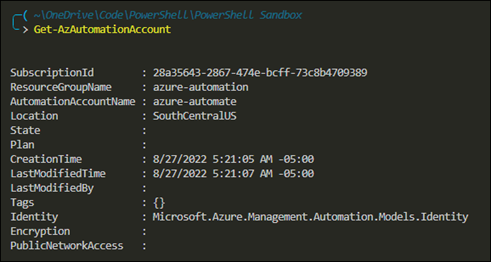
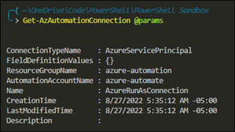
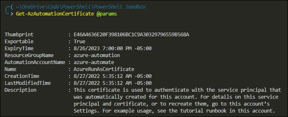
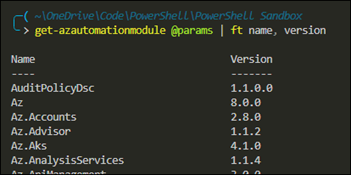
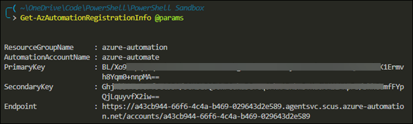

## Azure Automation Command Usage
Use the module `Az.Automation`.  Here are some example commands and their output.

### Get-AzAutomationAccount
```powershell
Get-AzAutomationAccount
```


### Get-AzAutomationConnection
This command retrieves RunAs accounts.
```powershell
Get-AzAutomationConnection -AutomationAccountName <name> -ResourceGroupName <name>
```


### Get-AzAutomationCertificate
```powershell
Get-AzAutomationCertificate -AutomationAccountName <name> -ResourceGroupName <name>
```


### Get-AzAutomationModule
```powershell
Get-AzAutomationModule -AutomationAccountName <name> -ResourceGroupName <name>
```


### Get-AzAutomationRegistrationInfo
This command retrieves the endpoint URL and keys.  This information is used to register the hybrid runbook worker.
```powershell
Get-AzAutomationRegistrationInfo -AutomationAccountName <name> -ResourceGroupName <name>
```


### Get-AzAutomationRunbook
```powershell
Get-AzAutomationRunbook -AutomationAccountName <name> -ResourceGroupName <name>
```

