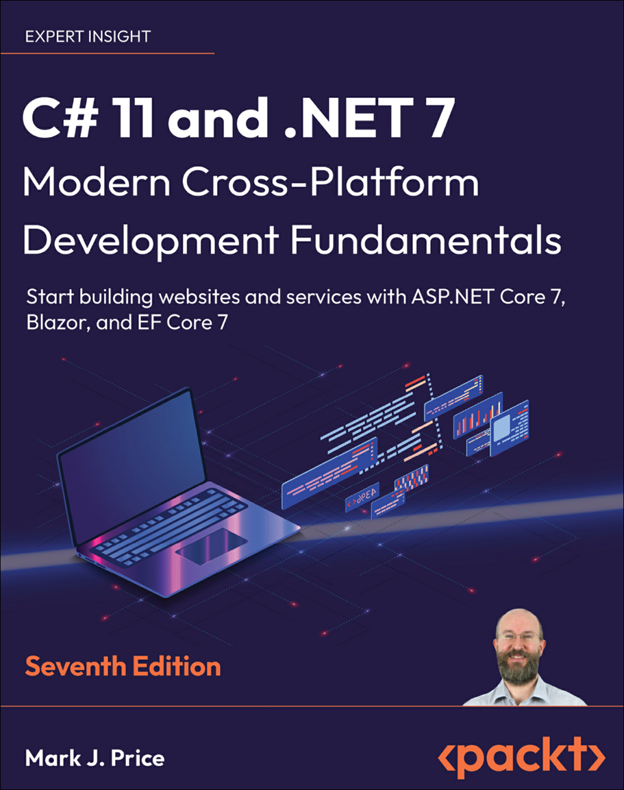
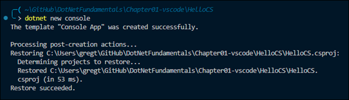
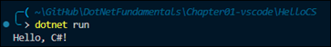

# My Notes on Learning .NET

Most of my notes are taken from [C# 11 and .NET 7 Modern Cross-Platform Development Fundamentals](https://www.amazon.com/11-NET-Cross-Platform-Development-Fundamentals-ebook/dp/B0B7SKMDYQ/ref=sr_1_1?keywords=modern+cross-platform+development&qid=1686430651&sprefix=modern+cross-plat%2Caps%2C111&sr=8-1)



## Resources
- [GitHub repoistory for Modern Cross-Platform Development Fundamentals](https://github.com/markjprice/cs11dotnet7)

## Introduction
The author uses the term **modern .NET** to refer to .NET 7 and its predecessors that come from .NET Core.  The term **legacy .NET** refers to the .NET Framework, Mono, Xamarin, and .NET Standard.

### .NET Framework
.NET Framework is a development platform that includes a **Common Language Runtime (CLR)**, which manages execution of code, and a **Base Class Library (BCL), which provides a rich library of classes to build applications from.

.NET Framework has been an official component of the Windows operating system. However, it is now considered a Windows-only and a legacy platform.  Do not create new apps using it.

### Mono, Xamarin, and Unity Projects
Third parties developed a .NET Framework implementation named the **Mono** project. Mono is cross-platform but fell behind the official implementation of .NET Framework.

Mono has a niche as the foundation of the **Xamarin** mobile platform as well as cross-platform game development platforms like **Unity**.

Microsoft purchased Xamarin in 2016 and has integrated its functionality into Visual Studio 2022 for Mac.  

### .NET Core
Since 2015, Microsoft has been working to rewrite the .NET Framework to be truly cross-platform. The new modernized product was initially branded **.NET Core**. 

.NET Core has been rebranded as **.NET**, and new versions are release each year in November.  See [.NET and .NET Core Support Policy](https://dotnet.microsoft.com/en-us/platform/support/policy/dotnet-core).

### Understanding Intermediate Language
The C# compiler (named **Rosalyn**) used by the `dotnet` CLI tool converts C# source code into **intermediate language (IL)** code and stores the IL in an **assembly** (a DLL or EXE file). IL code statements are like assembly language instructions, which are executed by .NET's virtual machine, known as CoreCLR.

At runtime, CoreCLR loads the IL code from the assembly, the **just-in-time (JIT)** compiler compiles it into native CPU instructions, and then it is executed by the CPU on your machine.

The benefit of this two-step process is that Microsoft can create CLRs for Linux and macOS as well as for Windows.  The same IL code runs everywhere because of the second compilation step, which generates code for the native OS and CPU instruction set.

## Create a Console App
Use the following command to create a new console app:  
```dotnet new console``` 



This command targets your latest .NET SDK version by default.  Use the `-f` switch to specify a target framework, e.g:  
```dotnet new console -f net6.0```

Use the command `dotnet run` to compile and execute the program:  

