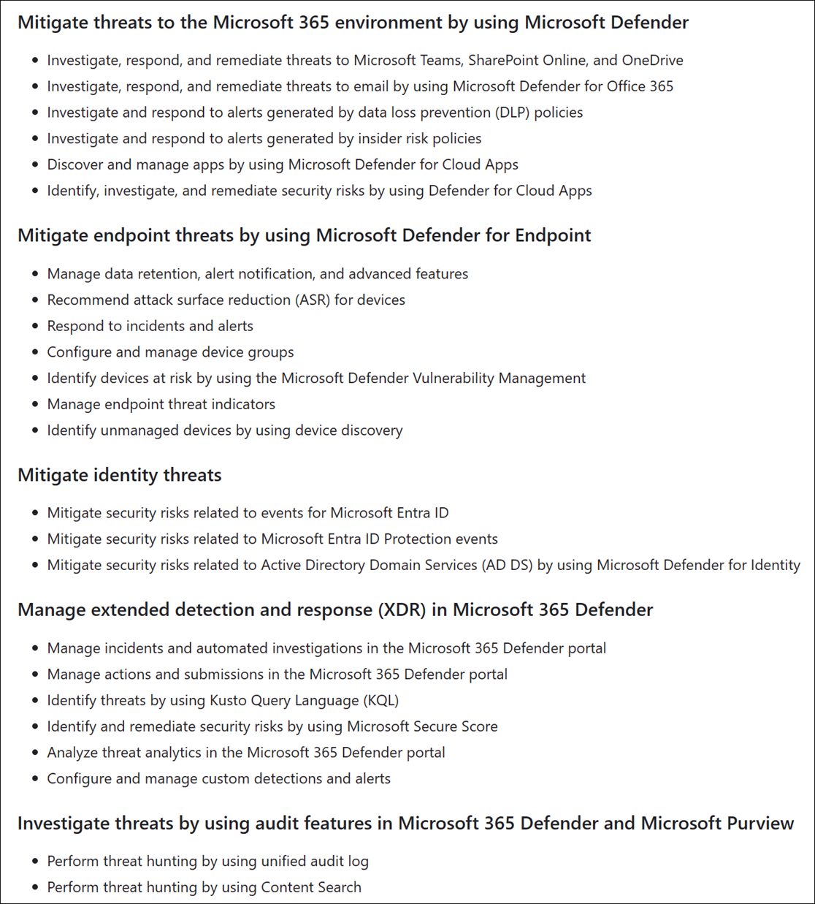
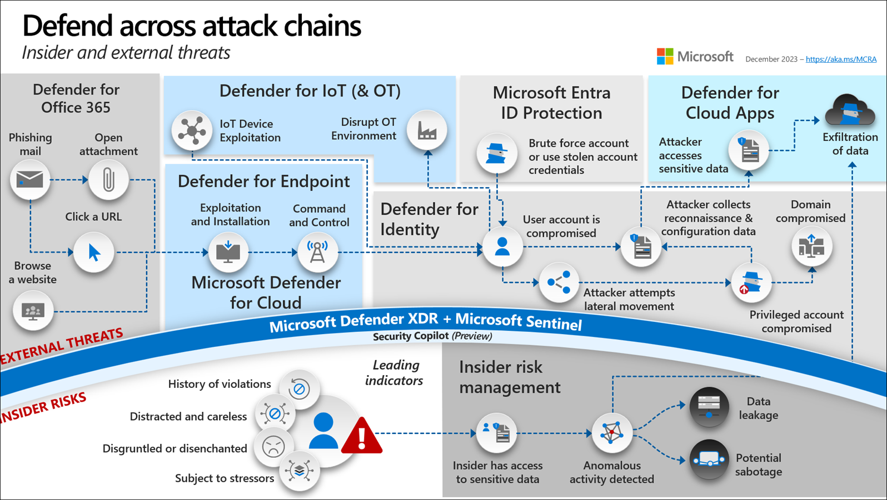
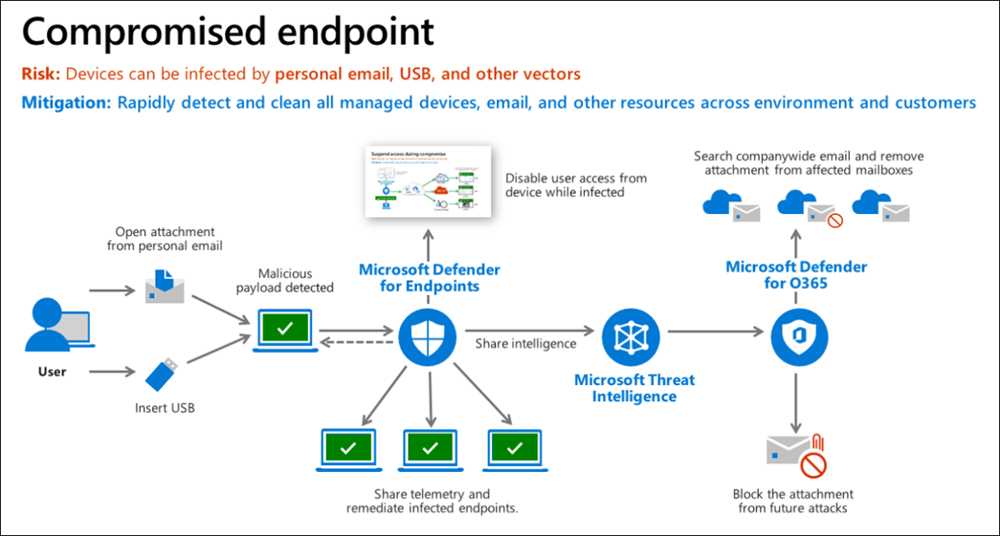
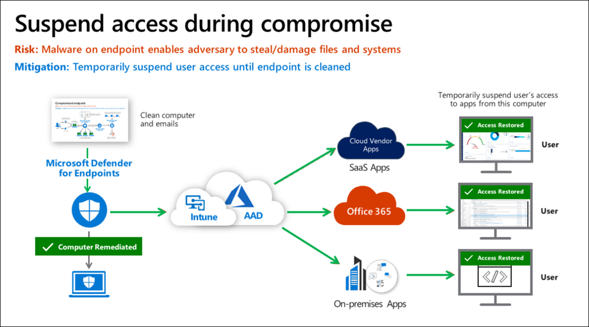
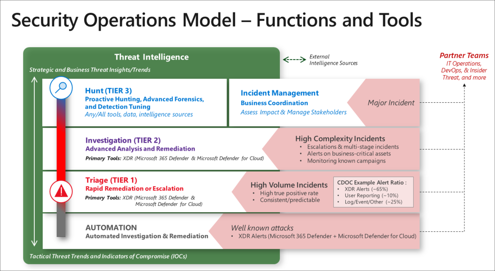
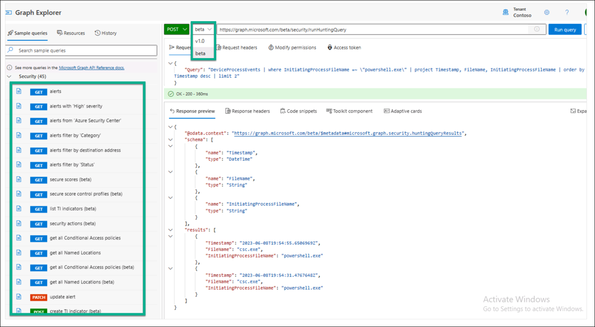
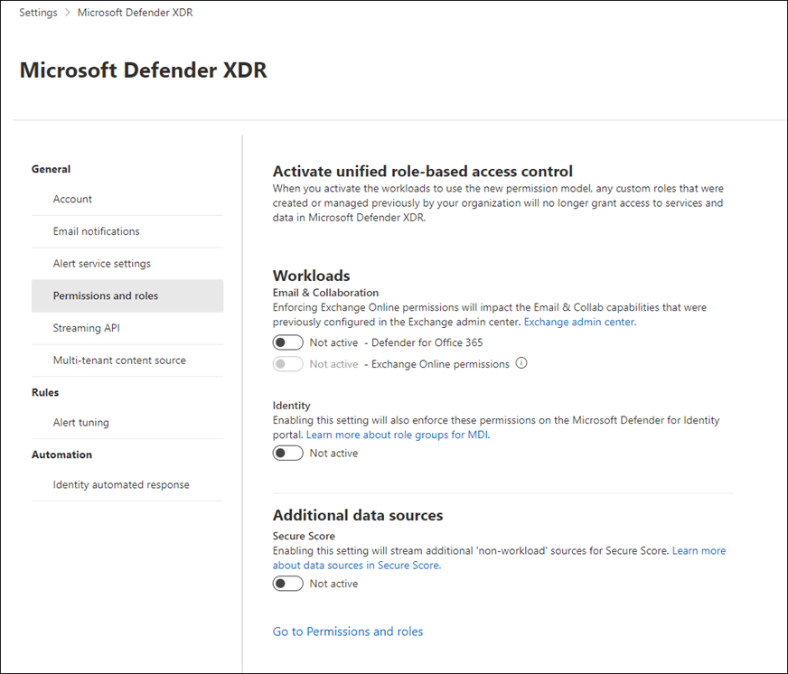
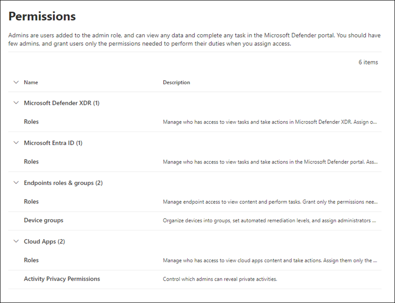

# Microsoft Defender


- [Microsoft Defender Products](#microsoft-defender-products)
- [Microsoft Defender Learning Paths](#microsoft-defender-learning-paths)
  - [SC-200: Mitigate threats using Microsoft Defender XDR](#sc-200-mitigate-threats-using-microsoft-defender-xdr)
    - [Introduction to Microsoft 365 Threat Protection](#introduction-to-microsoft-365-threat-protection)
    - [Mitigate Incidents Using Microsoft Defender XDR](#mitigate-incidents-using-microsoft-defender-xdr)
- [Permissions Model](#permissions-model)

<details><summary>Microsoft Defender Exam Topics</summary>
<br>

- [My SC-200 Exam page](/topics/certifications/sc-200_tracker.md)



</details>

## Microsoft Defender Products

**What is the difference between Microsoft Defender and Microsoft Defender XDR?**<br>
Per the [Microsoft Defender XDR FAQ](https://www.microsoft.com/en-us/security/business/siem-and-xdr/microsoft-defender-xdr#x775d8d7905b145e88deb34493a003a0d), Microsoft Defender XDR (formerly known as Microsoft Defender) is the unified portal experience encompassing all the Defender products. Microsoft XDR provides provides native protection across endpoints, IoT devices, hybrid identities, email collaboration and tools, and cloud applications. 

[Microsoft Sentinel](https://learn.microsoft.com/en-us/azure/sentinel/overview) complements capabilities of Microsoft XDR with SIEM and security orchestration and response (SOAR) capabilities to ingest logs from your entire digital estate.

Microsoft Defender XDR includes the following features:
  - [Multi-tenant Management](https://learn.microsoft.com/en-us/microsoft-365/security/defender/mto-overview?view=o365-worldwide)
  - [Advanced Hunting](https://learn.microsoft.com/en-us/microsoft-365/security/defender/advanced-hunting-overview?view=o365-worldwide)


Microsoft Defender XDR includes the following products:

<details><summary>Defender for Office 365</summary>
<br>

- [Defender for Office 365 Plan 1](https://learn.microsoft.com/en-us/microsoft-365/security/office-365-security/mdo-security-comparison?view=o365-worldwide#defender-for-office-365-plan-1-vs-plan-2-cheat-sheet)
  - License
    - Defender for Office 365 Plan 1 ($2 user/mo)
    - Microsoft 365 Business Premium ($22 user/mo)
    - Office 365 E5 ($38 user/mo)
    - Microsoft 365 E5 ($57 user/mo)
  - Features
    - [Advanced Anti-Phishing](https://learn.microsoft.com/en-us/microsoft-365/security/office-365-security/anti-phishing-policies-about?view=o365-worldwide)
    - [Real-Time Reports](https://learn.microsoft.com/en-us/microsoft-365/security/office-365-security/reports-defender-for-office-365?view=o365-worldwide)
    - [Safe Attachments](https://learn.microsoft.com/en-us/microsoft-365/security/office-365-security/safe-attachments-about?view=o365-worldwide)
    - [Safe Links](https://learn.microsoft.com/en-us/microsoft-365/security/office-365-security/safe-links-about?view=o365-worldwide)
- [Defender for Office 365 Plan 2](https://learn.microsoft.com/en-us/microsoft-365/security/office-365-security/mdo-security-comparison?view=o365-worldwide#defender-for-office-365-plan-1-vs-plan-2-cheat-sheet)
  - License
    - Defender for Office 365 Plan 2 ($5 user/mo)
    - Office 365 E5 ($38 user/mo)
    - Microsoft 365 E5 ($57 user/mo)
  - Features
    - [Attack Simulation Training](https://learn.microsoft.com/en-us/microsoft-365/security/office-365-security/attack-simulation-training-get-started?view=o365-worldwide)
    - [Automated Investigation & Response (AIR)](https://learn.microsoft.com/en-us/microsoft-365/security/office-365-security/air-about-office?view=o365-worldwide)
    - [Campaign Views](https://learn.microsoft.com/en-us/microsoft-365/security/office-365-security/campaigns?view=o365-worldwide)
    - [Compromised User Detection](https://learn.microsoft.com/en-us/microsoft-365/security/office-365-security/address-compromised-users-quickly?view=o365-worldwide)
    - [Threat Explorer](https://learn.microsoft.com/en-us/microsoft-365/security/office-365-security/threat-explorer-about?view=o365-worldwide)
    - [Threat Trackers](https://learn.microsoft.com/en-us/microsoft-365/security/office-365-security/threat-trackers?view=o365-worldwide)

</details>

<details><summary>Defender for Cloud Apps</summary>
<br>

- [Defender for Cloud Apps](https://learn.microsoft.com/en-us/defender-cloud-apps/what-is-defender-for-cloud-apps)
  - License
    - Defender for Cloud Apps ($3.50 user/mo)
    - Enterprise Mobility + Security E5 ($16.40 user/mo)
    - Microsoft 365 E5 ($57 user/mo)

</details>

<details open><summary>Defender for Cloud</summary>
<br>

Features
- [Defender for Servers](https://learn.microsoft.com/en-us/azure/defender-for-cloud/plan-defender-for-servers-select-plan)
- [Cloud Security Posture Management (CSPM)](https://learn.microsoft.com/en-us/azure/defender-for-cloud/concept-cloud-security-posture-management)
- [External Attack Surface Management (Defender EASM)](https://learn.microsoft.com/en-us/azure/external-attack-surface-management/)

</details>


<details><summary>Defender for Identity</summary>
<br>

- [Defender for Identity](https://learn.microsoft.com/en-us/defender-for-identity/what-is)
  - License
    - Defender for Identity ($5.50 user/mo)
    - Enterprise Mobility + Security E5 ($16.40 user/mo)
    - Microsoft 365 E5 ($57 user/mo)

</details>

<details><summary>Defender Antivirus</summary>
<br>

- [Defender Antivirus](https://learn.microsoft.com/en-us/microsoft-365/security/defender-endpoint/microsoft-defender-antivirus-windows?view=o365-worldwide)
  - License
    - Microsoft 365 Business Premium ($22 user/mo)
    - Microsoft 365 E3 ($36 user/mo)
    - Microsoft 365 E5 ($57 user/mo)

</details>

<details><summary>Defender for Endpoint</summary>
<br>

- [Defender for Business](https://learn.microsoft.com/en-us/microsoft-365/security/defender-business/mdb-overview?view=o365-worldwide)
  - License
    - Microsoft Defender for Business ($3 user/mo)
    - Microsoft 365 Business Premium ($22 user/mo)
  - Features
    - [Block at First Sight](https://learn.microsoft.com/en-us/microsoft-365/security/defender-endpoint/configure-block-at-first-sight-microsoft-defender-antivirus?view=o365-worldwide)
    - [Cross-Platform Support](https://learn.microsoft.com/en-us/microsoft-365/security/defender-endpoint/non-windows?view=o365-worldwide)
    - [Enhanced ASR (Attack Surface Reduction)](https://learn.microsoft.com/en-us/microsoft-365/security/defender-endpoint/overview-attack-surface-reduction?view=o365-worldwide)
    - [Mobile Threat Defense](https://learn.microsoft.com/en-us/microsoft-365/security/defender-endpoint/mtd?view=o365-worldwide)
    - [Next Gen Protection](https://learn.microsoft.com/en-us/microsoft-365/security/defender-endpoint/next-generation-protection?view=o365-worldwide)
    - [Tamper Protection](https://learn.microsoft.com/en-us/microsoft-365/security/defender-endpoint/prevent-changes-to-security-settings-with-tamper-protection?view=o365-worldwide)
    - [Web Content Filtering](https://learn.microsoft.com/en-us/microsoft-365/security/defender-endpoint/web-content-filtering?view=o365-worldwide)
- [Defender for Endpoint Plan 1](https://learn.microsoft.com/en-us/microsoft-365/security/defender-endpoint/defender-endpoint-plan-1?view=o365-worldwide)
  - License
    - Defender for Endpoint Plan 1 ($3 user/mo)
    - Microsoft 365 E3 ($36 user/mo)
    - Microsoft 365 E5 ($57 user/mo)
  - Features
    - [Next Generation Protection](https://learn.microsoft.com/en-us/microsoft-365/security/defender-endpoint/next-generation-protection?view=o365-worldwide) - Antivirus signal sharing, Cloud Protection (rapid identification of new threats)
    - [Manual Response Actions](https://learn.microsoft.com/en-us/microsoft-365/security/defender-endpoint/defender-endpoint-plan-1?view=o365-worldwide#manual-response-actions) - Isolate device, AV scan, stop and quarantine files, block or allow files
    - [Ransomware Mitigation](https://learn.microsoft.com/en-us/microsoft-365/security/defender-endpoint/controlled-folders?view=o365-worldwide) - Controlled folder access (boot sector, user profile folders)
    - [Attack Surface Reduction](https://learn.microsoft.com/en-us/microsoft-365/security/defender-endpoint/overview-attack-surface-reduction?view=o365-worldwide)
    - [Web Filtering](https://learn.microsoft.com/en-us/microsoft-365/security/defender-endpoint/web-content-filtering?view=o365-worldwide)
    - [Web Threat Detection](https://learn.microsoft.com/en-us/microsoft-365/security/defender-endpoint/web-protection-overview?view=o365-worldwide)
    - [Web Firewall](https://learn.microsoft.com/en-us/microsoft-365/security/defender-endpoint/defender-endpoint-plan-1?view=o365-worldwide#network-firewall)
    - [Device Control](https://learn.microsoft.com/en-us/microsoft-365/security/defender-endpoint/mde-device-control-device-installation?view=o365-worldwide) - USB devices and removable media
    - [Application Control](https://learn.microsoft.com/en-us/microsoft-365/security/defender-endpoint/defender-endpoint-plan-1?view=o365-worldwide#application-control)
    - [Centralized Management](https://learn.microsoft.com/en-us/microsoft-365/security/defender-endpoint/defender-endpoint-plan-1?view=o365-worldwide)
    - [Cross-Platform Support](https://learn.microsoft.com/en-us/microsoft-365/security/defender-endpoint/non-windows?view=o365-worldwide) - Windows, macOS, Linux, Android, iOS
      - See [Supported Microsoft Defender for Endpoint capabilities by platform](https://learn.microsoft.com/en-us/microsoft-365/security/defender-endpoint/supported-capabilities-by-platform?view=o365-worldwide)
    - [Block at First Sight (BAFS)](https://learn.microsoft.com/en-us/microsoft-365/security/defender-endpoint/configure-block-at-first-sight-microsoft-defender-antivirus?view=o365-worldwide) - Blocks suspicious but undetected files and then uses heuristics and machine learning to determine if files are malicious or not a threat
    - [Mobile Threat Defense](https://learn.microsoft.com/en-us/microsoft-365/security/defender-endpoint/mtd?view=o365-worldwide) - Anti-phishing, blocking unsafe network connections, detection of malicious apps and jail-broken devices, risky device signals, privacy in threat reports
    - [Tamper Protection](https://learn.microsoft.com/en-us/microsoft-365/security/defender-endpoint/prevent-changes-to-security-settings-with-tamper-protection?view=o365-worldwide) - Protects virus and threat protection from being disabled
    - [Investigate Incidents Involving Sensitivity Labels](https://learn.microsoft.com/en-us/microsoft-365/security/defender-endpoint/information-protection-investigation?view=o365-worldwide)
    - [SIEM Integration](https://learn.microsoft.com/en-us/microsoft-365/security/defender-endpoint/configure-siem?view=o365-worldwide)
    - [Threat Protection Reports](https://learn.microsoft.com/en-us/microsoft-365/security/defender-endpoint/threat-protection-reports?view=o365-worldwide)
- [Defender for Endpoint Plan 2](https://learn.microsoft.com/en-us/microsoft-365/security/defender-endpoint/microsoft-defender-endpoint?view=o365-worldwide)
  - Formerly known as "Defender for Endpoint"
  - License
    - Defender for Endpoint Plan 2 ($5 user/mo)
    - Microsoft 365 E5 ($57 user/mo)
  - Features
    - [Defender for Cloud Apps Integration](https://learn.microsoft.com/en-us/microsoft-365/security/defender-endpoint/microsoft-cloud-app-security-integration?view=o365-worldwide)
    - [Core Defender Vulnerability Management](https://learn.microsoft.com/en-us/microsoft-365/security/defender-vulnerability-management/defender-vulnerability-management?view=o365-worldwide)
    - [Endpoint Detection and Response](https://learn.microsoft.com/en-us/microsoft-365/security/defender-endpoint/overview-endpoint-detection-response?view=o365-worldwide)
      - Investigate device alerts
      - View and approve remediation actions
    - [Automated Investigation and Remediation (AIR)](https://learn.microsoft.com/en-us/microsoft-365/security/defender-endpoint/automated-investigations?view=o365-worldwide) - alerts from the same device are consolidated into the current investigation, and if the same threat appears on other devices or spreads to 10 or more devices, the investigation expands to include these devices.
    - [Microsoft Secure Score for Devices](https://learn.microsoft.com/en-us/microsoft-365/security/defender-vulnerability-management/tvm-microsoft-secure-score-devices?view=o365-worldwide)
    - [Endpoint Attack notifications](https://learn.microsoft.com/en-us/microsoft-365/security/defender-endpoint/endpoint-attack-notifications?view=o365-worldwide) - Provides proactive alerts on non-automated attacks
    - [Live Response](https://learn.microsoft.com/en-us/microsoft-365/security/defender-endpoint/live-response?view=o365-worldwide) - Provides instant access to a device using a remote shell
    - [Power BI Connections](https://learn.microsoft.com/en-us/microsoft-365/security/defender-endpoint/api/api-power-bi?view=o365-worldwide)
    - [Threat Analytics](https://learn.microsoft.com/en-us/microsoft-365/security/defender-endpoint/threat-analytics?view=o365-worldwide) - Set of report from export Microsoft security researchers covering active threat actors, new attack techniques, critical vulnerabilities, common attack surfaces, prevalent malware
    - [6-Months Searchable Data](https://learn.microsoft.com/en-us/microsoft-365/security/defender-endpoint/data-storage-privacy?view=o365-worldwide) - 6 months in the portal, 30 days via query in the advanced hunting investigation experience
    - [Evaluation Lab](https://learn.microsoft.com/en-us/microsoft-365/security/defender-endpoint/evaluation-lab?view=o365-worldwide) - Retiring in January 2024 per MC698829
  - Add-ons
    - Microsoft Defender Vulnerability Management (premium)
    - Microsoft Defender Experts for Hunting (EA or MCA)
    - Microsoft Defender Experts for XDR (EA)
    - Microsoft Defender for Servers (Plan 1 or Plan 2)

</details>

<details><summary>Defender Vulnerability Management</summary>
<br>

- [Microsoft Defender Vulnerability Management](https://learn.microsoft.com/en-us/microsoft-365/security/defender-vulnerability-management/defender-vulnerability-management-capabilities?view=o365-worldwide)
  - License
    - Microsoft Defender Vulnerability Management ($3 user/mo)
    - Microsoft Defender for Endpoint Plan 2 ($5 user/mo)
    - Microsoft Defender Vulnerability Management Add-on ($2 user/mo)
  - Features
    - Microsoft Defender for Endpoint Plan 2
      - [Device Discovery](https://learn.microsoft.com/en-us/microsoft-365/security/defender-endpoint/device-discovery?view=o365-worldwide) - Find unmanaged devices on monitored networks, including workstations, servers, mobile devices, network devices, printers, and IoT devices
      - [Device Inventory](https://learn.microsoft.com/en-us/microsoft-365/security/defender-endpoint/machines-view-overview?view=o365-worldwide) - Shows a list of devices on network seen within last 30 days
      - [Vulnerability Assessment](https://learn.microsoft.com/en-us/microsoft-365/security/defender-vulnerability-management/tvm-weaknesses?view=o365-worldwide) - View vulnerabilities devices are exposed to by listing the Common Vulnerabilities and Exposures (CVE) ID
      - [Configuration Assessment (i.e. Secure Score for Devices)](https://learn.microsoft.com/en-us/microsoft-365/security/defender-vulnerability-management/tvm-microsoft-secure-score-devices?view=o365-worldwide)
      - [Risk Based Prioritization](https://learn.microsoft.com/en-us/microsoft-365/security/defender-vulnerability-management/tvm-security-recommendation?view=o365-worldwide) - Prioritizes vulnerabilities according to impact and actionable security recommendations
      - [Remediation Tracking](https://learn.microsoft.com/en-us/microsoft-365/security/defender-vulnerability-management/tvm-remediation?view=o365-worldwide) - Provides remediation workflow for Help Desk through Intune integration
      - [Continuous Monitoring](https://learn.microsoft.com/en-us/microsoft-365/security/defender-endpoint/configure-vulnerability-email-notifications?view=o365-worldwide) - Email notifications for vulnerability events
      - [Software Inventory](https://learn.microsoft.com/en-us/microsoft-365/security/defender-vulnerability-management/tvm-software-inventory?view=o365-worldwide) - List of known software in the organization with [Common Platform Enumerations (CPE)](https://nvd.nist.gov/products/cpe)
      - [Software Usage Insights](https://learn.microsoft.com/en-us/microsoft-365/security/defender-vulnerability-management/tvm-usage-insights?view=o365-worldwide) - Provides total number of devices using an application in the past 30 days
      - [Zero-Day Vulnerabilities](https://learn.microsoft.com/en-us/microsoft-365/security/defender-vulnerability-management/tvm-zero-day-vulnerabilities?view=o365-worldwide)
      - [Device Restart Status](https://learn.microsoft.com/en-us/microsoft-365/security/defender-vulnerability-management/device-restart-status?view=o365-worldwide)
    - Microsoft Defender Vulnerability Management Add-on
      - [Security Baselines Assessment](https://learn.microsoft.com/en-us/microsoft-365/security/defender-vulnerability-management/tvm-security-baselines?view=o365-worldwide) - Monitor baseline compliance and identify changes in real time. Provides support for CIS benchmarks.
      - [Block Vulnerable Applications](https://learn.microsoft.com/en-us/microsoft-365/security/defender-vulnerability-management/tvm-block-vuln-apps?view=o365-worldwide) - Enables security admins to take immediate action and block all currently known vulnerable versions of an application
      - [Browser Extensions Assessment](https://learn.microsoft.com/en-us/microsoft-365/security/defender-vulnerability-management/tvm-browser-extensions?view=o365-worldwide) - View browser extensions and permissions across Edge, Chrome, and Firefox
      - [Digital Certificate Assessment](https://learn.microsoft.com/en-us/microsoft-365/security/defender-vulnerability-management/tvm-certificate-inventory?view=o365-worldwide) - View certificates on devices, including expiration date
      - [Network Share Analysis](https://learn.microsoft.com/en-us/microsoft-365/security/defender-vulnerability-management/tvm-network-share-assessment?view=o365-worldwide) - Identify and block vulnerable network shares
      - [Hardware and Firmware Assessment](https://learn.microsoft.com/en-us/microsoft-365/security/defender-vulnerability-management/tvm-hardware-and-firmware?view=o365-worldwide) - Provides list of hardware and firmware in the organization and displays security updates
      - [Authenticated Scan for Windows](https://learn.microsoft.com/en-us/microsoft-365/security/defender-vulnerability-management/windows-authenticated-scan?view=o365-worldwide) - Scans unmanaged devices on the network for software vulnerabilities. Requires the **MDATP Network Scanner** device.

</details>

<details><summary>Other Defender Services</summary>
<br>

- [Defender Experts for Hunting](https://learn.microsoft.com/en-us/microsoft-365/security/defender-endpoint/experts-on-demand?view=o365-worldwide)
  - Description: Managed threat hunting service that proactively looks for threats 24/7/365 across endpoints, email, identity, and cloud apps using Microsoft  Defender data.
  - Availability: Contact Microsoft account manager
  - Features:
    - Threat hunting and analysis
    - Defender Experts notifications
    - Experts on Demand - Select **Ask Defender Experts** from an incident
    - Hunter-trained AI
    - Reports
- [Defender Experts for XDR](https://learn.microsoft.com/en-us/microsoft-365/security/defender/dex-xdr-overview?view=o365-worldwide)
  - Availability: Contact Microsoft account manager
  - Description: Managed service for customers with constrained security operations centers (SOCs) that are overburdened on alert volume
  - Features
    - Defender Experts for Hunting
    - Partner with your team to manage incident queue and handle triage and investigation
    - Live dashboards and reports with noise-free and actionable view and detailed analytics
    - Periodic check-ins with your team
  - See the [FAQ](https://learn.microsoft.com/en-us/microsoft-365/security/defender/frequently-asked-questions?view=o365-worldwide)
- [Defender Threat Intelligence (Defender TI)](https://learn.microsoft.com/en-us/defender/threat-intelligence/what-is-microsoft-defender-threat-intelligence-defender-ti)
  - License
    - Defender Threat Intelligence (free)
    - Defender Threat Intelligence (Defender TI) Premium ($4,200/mo)
  - Features
    - Defender Threat Intelligence Portal: https://ti.defender.microsoft.com/
    - Defender TI articles that provide latest information on threat actors
    - Correlates indicators to published articles and vulnerabilities to build Indicators of Compromise (IOCs)
    - Search IP addresses and domain names of known threat actors
    - Published articles on recent threats
    - Integration with Security Copilot

</details>

## Microsoft Defender Learning Paths

The following Microsoft learning paths support the SC-200 exam. Expand the sections below to view my notes from the SC-200 learning paths.

<details open><summary>Learning Path > SC-200: Mitigate threats using Microsoft Defender XDR</summary>

### [SC-200: Mitigate threats using Microsoft Defender XDR](https://learn.microsoft.com/en-us/training/paths/sc-200-mitigate-threats-using-microsoft-365-defender/)

#### Introduction to Microsoft 365 Threat Protection

<details><summary>Microsoft Defender XDR Overview</summary>
<br>

**References**:
- [Microsoft Defender XDR](https://learn.microsoft.com/en-us/microsoft-365/security/defender/microsoft-365-defender?view=o365-worldwide)

Microsoft Defender XDR is an integrated threat protection suite that combines
signals from endpoints, identities, email, and applications. The following graphic, taken from the [Microsoft Cybersecurity Reference
Architectures](https://learn.microsoft.com/en-us/security/cybersecurity-reference-architecture/mcra),
shows the relationship between Microsoft Defender technologies and Microsoft
Defender XDR.



</details>

<details>
  <summary>An Example Defender XDR Scenario</summary>
<br>

**References**:
- [Explore Extended Detection & Response (XDR) response use cases](https://learn.microsoft.com/en-us/training/modules/introduction-microsoft-365-threat-protection/2-explore-extended-detection-response-use-cases)

In the following scenario, a victim unknowingly triggers a malware infection by opening a malicious attachment received via personal email or USB drive, bypassing Microsoft Defender for Office 365 (MDO) protection. However, Microsoft Defender for Endpoints (MDE) detects the attack, alerts the security operations, and triggers a response in Intune and Microsoft Entra ID, leading to the user's access being blocked due to noncompliance with organizational policy.



Microsoft Defender for Endpoint (MDE) informs Intune about device risk, leading Intune to update the device's compliance status in Entra ID, which Conditional Access uses to manage access. Consequently, the user's access to corporate resources is restricted, affecting both new requests and existing sessions, while allowing access to general internet tasks that don't require corporate authentication.



Once infected devices are remediated, Microsoft Defender for Endpoints (MDE) informs Intune to update the device risk status, allowing Microsoft Entra ID Conditional Access to restore access to enterprise resources. Additionally, the threat signals in Microsoft Threat Intelligence are utilized by Microsoft Defender for Office 365 (MDO) and Microsoft Defender for Cloud to detect and address threats across various platforms, including email, office collaboration, and Azure.

</details>

<details><summary>Defender XDR in a Security Operations Center (SOC)</summary>
<br>

**References**:
- [Understand Microsoft Defender XDR in a Security Operations Center (SOC)](https://learn.microsoft.com/en-us/training/modules/introduction-microsoft-365-threat-protection/3-understand-defender-security-operations-center)

The Security Operations Model is structured with multiple distinct functions, each having a specific focus area and requiring close collaboration among themselves and with external teams for effective operation. In smaller organizations, these roles tend to be consolidated into fewer teams or individuals, typically under IT Operations for technical responsibilities. Additionally, some functions, like incident management, may be assigned temporarily to leadership or designated delegates, highlighting the model's flexibility to adapt to different organizational structures.
  


</details>

<details><summary>Explore Microsoft Security Graph</summary>
<br>

**References**:
- [Explore Microsoft Security Graph](https://learn.microsoft.com/en-us/training/modules/introduction-microsoft-365-threat-protection/4-explore-microsoft-security-graph)
- [Microsoft Graph security API overview](https://learn.microsoft.com/en-us/graph/security-concept-overview)

Microsoft Graph provides REST APIs and client libraries to access data on various Microsoft cloud services, including Microsoft 365 core services (like Bookings, Calendar, OneDrive), Enterprise Mobility + Security services (such as Advanced Threat Analytics, Intune), Windows services (like devices, notifications), Dynamics 365 Business Central services, and the Microsoft Graph Security API.

The Microsoft Graph Security API acts as a broker, connecting multiple Microsoft security providers and returning aggregated results in a common schema. Developers use this API to integrate and correlate security alerts, stream alerts to SIEM solutions, automate threat response, and enhance investigations.

The Microsoft Graph Security API has two versions: the stable v1.0 and the Beta version with preview APIs that may change. Both versions support advanced hunting with the runHuntingQuery method using Kusto Query Language (KQL), as demonstrated in the example with Microsoft Defender XDR. The Graph Explorer tool can run these hunting queries. For more details, the Microsoft Graph Security API documentation provides additional information.

You can even embed Kusto Query Language (KQL) queries in Graph calls:

```html
POST https://graph.microsoft.com/v1.0/security/runHuntingQuery

{
    "Query": "DeviceProcessEvents | where InitiatingProcessFileName =~ \"powershell.exe\" | project Timestamp, FileName, InitiatingProcessFileName | order by Timestamp desc | limit 2"
}
```
The following screenshot shows how you can run a hunting query in the Graph Explorer tool.



</details>

#### Mitigate Incidents Using Microsoft Defender XDR

<details open><summary>Use the Microsoft Defender portal</summary>
<br>

**Reference**:
- [Use the Microsoft Defender portal](https://learn.microsoft.com/en-us/training/modules/mitigate-incidents-microsoft-365-defender/2-use-microsoft-security-center-portal)




</details>


</details> <!-- End Parent-->

## Permissions Model

Microsoft Defender currently does not support a single permissions management experiences across its services. Therefore, you must configure permission sets separately for services.



However, Microsoft is now providing the Microsoft Defender XDR Unified role-based access control (RBAC) model, which does provide a single permissions management experience for most of its services.

- [Microsoft Defender XDR Unified role-based access control (RBAC)](https://learn.microsoft.com/en-us/microsoft-365/security/defender/manage-rbac?view=o365-worldwide)

Included services

- Microsoft Defender XDR
- Microsoft Defender for Endpoint
- Microsoft Defender Vulnerability Management
- Microsoft Defender for Office 365
- Microsoft Defender for Identity
- Microsoft Defender for Cloud
- Microsoft Secure Score
  
Services not included in the unified permissions model:

- Microsoft Defender for Cloud Apps
- Microsoft Purview Compliance


