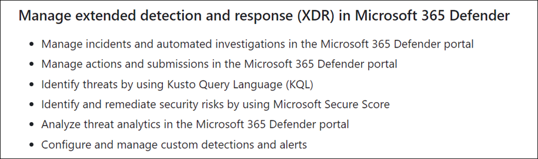

# Microsoft Defender

## Microsoft Defender XDR (Extended Detection and Response)

Exam Topics:

References:

- [Microsoft Defender XDR](https://learn.microsoft.com/en-us/microsoft-365/security/defender/microsoft-365-defender?view=o365-worldwide)
- [SC-200 Learning Path: Mitigate threats using Microsoft Defender XDR](https://learn.microsoft.com/en-us/training/paths/sc-200-mitigate-threats-using-microsoft-365-defender/)

Microsoft Defender XDR is an integrated threat protection suite that combines
signals from endpoints, identities, email, and applications. The following graphic, taken from the [Microsoft Cybersecurity Reference
Architectures](https://learn.microsoft.com/en-us/security/cybersecurity-reference-architecture/mcra)
shows the relationship between Microsoft Defender technologies and Microsoft
Defender XDR.

  
An Example Defender XDR Scenario

In the following scenario, a victim unknowingly triggers a malware infection by opening a malicious attachment received via personal email or USB drive, bypassing Microsoft Defender for Office 365 (MDO) protection. However, Microsoft Defender for Endpoints (MDE) detects the attack, alerts the security operations, and triggers a response in Intune and Microsoft Entra ID, leading to the user's access being blocked due to noncompliance with organizational policy.

Microsoft Defender for Endpoint (MDE) informs Intune about device risk, leading Intune to update the device's compliance status in Entra ID, which Conditional Access uses to manage access. Consequently, the user's access to corporate resources is restricted, affecting both new requests and existing sessions, while allowing access to general internet tasks that don't require corporate authentication.

Once infected devices are remediated, Microsoft Defender for Endpoints (MDE) informs Intune to update the device risk status, allowing Microsoft Entra ID Conditional Access to restore access to enterprise resources. Additionally, the threat signals in Microsoft Threat Intelligence are utilized by Microsoft Defender for Office 365 (MDO) and Microsoft Defender for Cloud to detect and address threats across various platforms, including email, office collaboration, and Azure.

Microsoft Defender XDR in a Security Operations Center (SOC)

The Security Operations Model is structured with multiple distinct functions, each having a specific focus area and requiring close collaboration among themselves and with external teams for effective operation. In smaller organizations, these roles tend to be consolidated into fewer teams or individuals, typically under IT Operations for technical responsibilities. Additionally, some functions, like incident management, may be assigned temporarily to leadership or designated delegates, highlighting the model's flexibility to adapt to different organizational structures.
  

