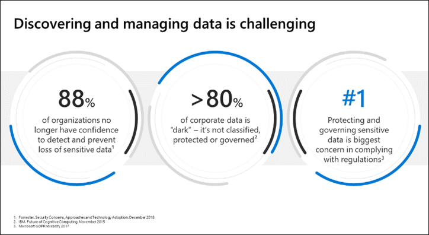
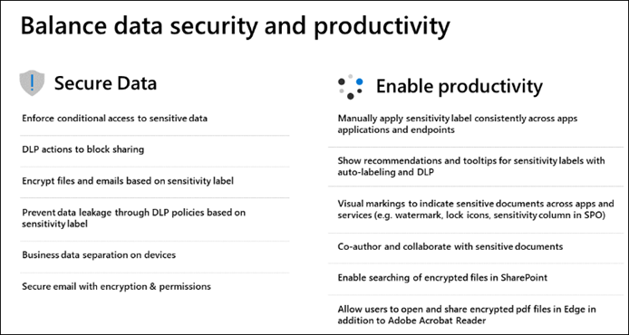

# Introduction to information protection and data lifecycle management in Microsoft Purview
Sources
- [Microsoft Docs: Information Protection](https://learn.microsoft.com/en-us/microsoft-365/compliance/information-protection?view=o365-worldwide)
- Microsoft Learn: [SC-400: Implement Information Protection in Microsoft 365](https://learn.microsoft.com/en-us/training/paths/implement-information-protection/)

## Overview
Data is exploding. Regulation is increasing. Discovering and managing data is challenging. 

Questions to consider
- Do you know where your business critical and sensitive data reside and what is being done with it?
- Do you have control of this data as it travels inside and outside the org? 
- Are you using multiple solutions to classify, label, and protect sensitive data?

Microsoft offers information protection for the following areas
- On-prem systems
- Office apps
- SharePoint, Teams
- Exchange Online
- Power BI
- Non-Microsoft cloud apps:  Box, Salesforce, Dropbox, Google

Information protection capabilities
- Enforce Conditional Access to sensitive data
- Data loss prevention (DLP) actions to block sharing
- File and email encryption based on sensitivity label
- Prevent data leakage through DLP policies
- Business data separation on devices

Implementing an information protection system is a journey that involves people, process, and technology.

Learn More
- [Sensitivity Labels](https://learn.microsoft.com/en-us/microsoft-365/compliance/sensitivity-labels?azure-portal=true&view=o365-worldwide)
- [Retention Policies and Retention Labels](https://learn.microsoft.com/en-us/microsoft-365/compliance/retention?azure-portal=true&view=o365-worldwide)
- [Trainable Classifiers](https://learn.microsoft.com/en-us/microsoft-365/compliance/classifier-get-started-with?azure-portal=true&view=o365-worldwide)
- [Using Sensitivity Labels in Office Apps](https://learn.microsoft.com/en-us/microsoft-365/compliance/sensitivity-labels-office-apps?azure-portal=true&view=o365-worldwide)
