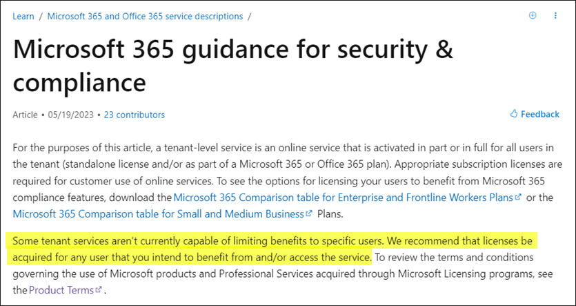
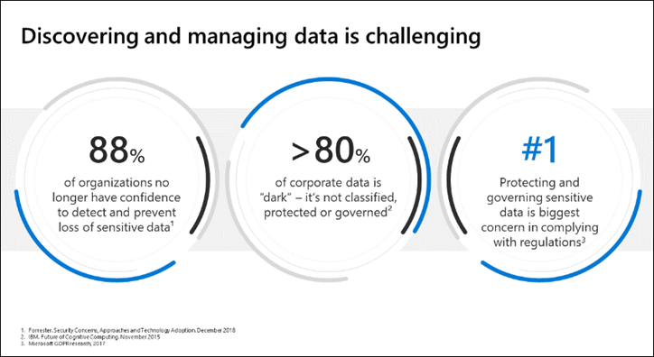
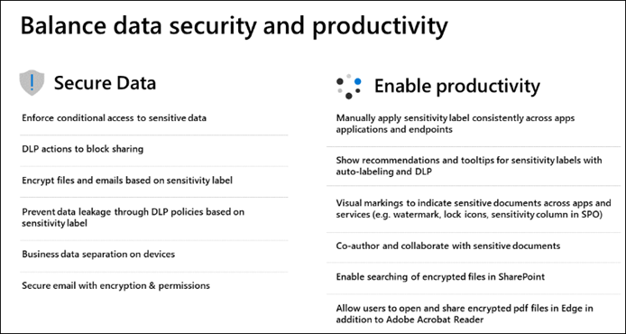
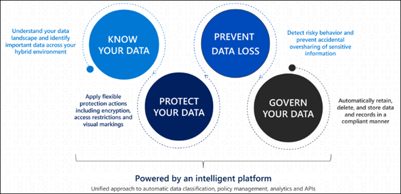
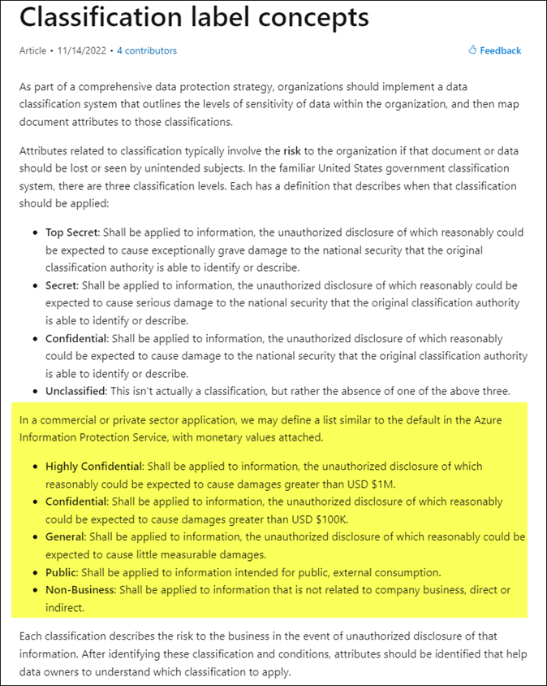

# Introduction to information protection and data lifecycle management in Microsoft Purview
## Sources
- [Microsoft Docs: Information Protection](https://learn.microsoft.com/en-us/microsoft-365/compliance/information-protection?view=o365-worldwide)
- Microsoft Learn: [SC-400: Implement Information Protection in Microsoft 365](https://learn.microsoft.com/en-us/training/paths/implement-information-protection/)
- [Microsoft Purview Customer Experience Engineering (CxE)](https://microsoft.github.io/ComplianceCxE/)

## Topics
- [Purview Permissions Model](/topics/technologies/permissions.md)
- [Sensitive Information Types](/topics/technologies/microsoft_purview/sensitive_information_types.md)
- [Trainable Classifiers](/topics/technologies/microsoft_purview/trainable_classifiers.md)
- [Sensitivity Labels](/topics/technologies/microsoft_purview/sensitivity_labels.md)

## Licensing
- [Microsoft 365 Guidance for Security & Compliance](https://learn.microsoft.com/en-us/office365/servicedescriptions/microsoft-365-service-descriptions/microsoft-365-tenantlevel-services-licensing-guidance/microsoft-365-security-compliance-licensing-guidance)
  - Lists the service descriptions and license entitlements for each feature in Microsoft Purview
  - Also links to comparison tables for various plans

In general, licensing is required for any user that you intend to benefit from and/or access the service.  

## Overview
Data is exploding. Regulation is increasing. Discovering and managing data is challenging. 

Questions to consider
- Do you know where your business critical and sensitive data reside and what is being done with it?
- Do you have control of this data as it travels inside and outside the org? 
- Are you using multiple solutions to classify, label, and protect sensitive data?

Microsoft offers information protection for the following areas
- On-prem systems
- Office apps
- SharePoint, Teams
- Exchange Online
- Power BI
- Non-Microsoft cloud apps:  Box, Salesforce, Dropbox, Google

Information protection capabilities
- Enforce Conditional Access to sensitive data
- Data loss prevention (DLP) actions to block sharing
- File and email encryption based on sensitivity label
- Prevent data leakage through DLP policies
- Business data separation on devices

Implementing an information protection system is a journey that involves people, process, and technology.

Information Protection Strategy Steps
1. Know your data - use sensitive information types and trainable classifiers
2. Protect your data - use Information Protection
3. Prevent data loss - use data loss prevention (DLP)
4. Govern your data - use Data Lifecycle Management and Records Management

Learn More
- [Sensitivity Labels](https://learn.microsoft.com/en-us/microsoft-365/compliance/sensitivity-labels?azure-portal=true&view=o365-worldwide)
- [Retention Policies and Retention Labels](https://learn.microsoft.com/en-us/microsoft-365/compliance/retention?azure-portal=true&view=o365-worldwide)
- [Trainable Classifiers](https://learn.microsoft.com/en-us/microsoft-365/compliance/classifier-get-started-with?azure-portal=true&view=o365-worldwide)
- [Using Sensitivity Labels in Office Apps](https://learn.microsoft.com/en-us/microsoft-365/compliance/sensitivity-labels-office-apps?azure-portal=true&view=o365-worldwide)
- [Data Loss Prevention](https://learn.microsoft.com/en-us/microsoft-365/compliance/dlp-learn-about-dlp?azure-portal=true&view=o365-worldwide)
- [Microsoft Purview Data Lifecycle Management](https://learn.microsoft.com/en-us/microsoft-365/compliance/manage-data-governance?azure-portal=true&view=o365-worldwide)
- [Records Management](https://learn.microsoft.com/en-us/microsoft-365/compliance/records-management?azure-portal=true&view=o365-worldwide)

Info Protection concepts: https://learn.microsoft.com/en-us/information-protection/develop/concept-classification-labels

