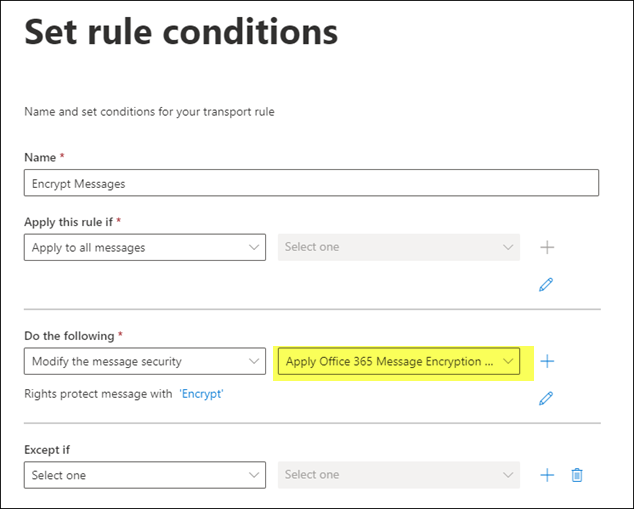

# Message Encryption

## Overview

Microsoft 365 makes available three types of options for message encryption:

- Microsoft Purview Message Encryption
- Information Rights Management (IRM)
- Secure/Multipurpose Internet Mail Extensions (S/MIME)

Microsoft Purview Message Encryption replaces and improves upon the legacy Office 365 Message Encryption (OME) service and Active Directory Information Rights Management (IRM) service. See [side-by-side comparison of these technologies](https://learn.microsoft.com/en-us/purview/ome-version-comparison#side-by-side-comparison-of-message-encryption-features-and-capabilities).

There are two flavors of Microsoft Purview Message Encryption:

- Microsoft Purview Message Encryption
  - Do Not Forward and Encrypt-Only options
  - Can send encrypted mail from Outlook Desktop, Outlook ofr Mac, and Outlook on the Web
  - M365 recipients get to use an inline experience to read the encrypted mail
  - Admins can customize portal branding
  - Admins can revoke encrypted emails
  - Detailed usage reports through Purview Compliance portal
- Microsoft Purview Advanced Message Encryption
  - Message revocation
  - Message expiration
  - Multiple branding templates
  - Encrypted message portal activity logs

Purview Message Encryption is included with M365 E3. Advanced Message Encryption is included in M365 E5. See [Advanced Message Encryption](https://learn.microsoft.com/en-us/purview/ome-advanced-message-encryption).

## Message Encryption Requirements

The only prerequisite for message encryption is to active the Azure Rights Management (RMS) service. Azure RMS is activated automatically once an eligible plan is introduced, so no action is required.  See [here](https://learn.microsoft.com/en-us/purview/set-up-new-message-encryption-capabilities#verify-that-azure-rights-management-is-active). To confirm service enablement, run `Get-AIPService`. See [here](https://learn.microsoft.com/en-us/azure/information-protection/activate-service#activate-protection-via-powershell). You can also verify by running `Get-IRMConfiguration`.  See [here](https://learn.microsoft.com/en-us/purview/set-up-new-message-encryption-capabilities#verify-microsoft-purview-message-encryption-configuration-in-exchange-online-powershell).

You can't encrypt inbound messages. You can only encrypt outbound messages. If you try to set up a rule to encrypt inbound messages, then the inbound mail will be delivered without encryption. See [here](https://learn.microsoft.com/en-us/purview/define-mail-flow-rules-to-encrypt-email).

## Using Message Encryption

When using mail flow rules, use the option **Apply Office 365 Message Encryption and rights protection**. See [Define mail flow rules to encrypt email messages](https://learn.microsoft.com/en-us/purview/define-mail-flow-rules-to-encrypt-email).

## Advanced Message Encryption

Per [here](https://learn.microsoft.com/en-us/purview/ome#:~:text=Message%20revocation%20and%20expiration%20only%20work%20for%20emails%20that%20your%20users%20send%20to%20recipients%20outside%20your%20organization.), message revocation and expiration only work for emails that your users send outside your organization.  

## Branding Encrypted Messages

- [Add your organization's brand to your Microsoft Purview Message Encryption encrypted messages](https://learn.microsoft.com/en-us/purview/add-your-organization-brand-to-encrypted-messages)

## Helpful Links

- [Email Encryption](https://learn.microsoft.com/en-us/purview/email-encryption)
- [Message Encryption](https://learn.microsoft.com/en-us/purview/ome)
- [Compare versions of message encryption](https://learn.microsoft.com/en-us/purview/ome-version-comparison)
- [Configure a label to apply S/MIME protection in Outlook](https://learn.microsoft.com/en-us/purview/sensitivity-labels-office-apps#configure-a-label-to-apply-smime-protection-in-outlook)
