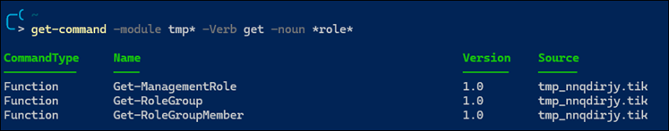

# Permissions, Roles, and Scopes in Microsoft Purview

## Links
- [Permissions in the Microsoft Purview compliance portal](https://learn.microsoft.com/en-us/microsoft-365/compliance/microsoft-365-compliance-center-permissions?view=o365-worldwide)
- [Roles and role groups in Microsoft Defender for Office 365 and Microsoft Purview compliance](https://learn.microsoft.com/en-us/microsoft-365/security/office-365-security/scc-permissions?toc=%2Fmicrosoft-365%2Fcompliance%2Ftoc.json&bc=%2Fmicrosoft-365%2Fbreadcrumb%2Ftoc.json&view=o365-worldwide)

## Overview
The Microsoft Purview compliance portal has a **Permissions** tab you may use for assigning permissions. Permissions in the compliance portal are based on role-based access control (RBAC) permissions model. 

The RBAC model is similar to the one used with Exchange Online. But it's important to remember that the role groups in Exchange Online and role groups for Defender for Office 365 or Purview compliance don't share membership or permissions. For example, while an Organization Management role group exists in Exchange Online, the permissions granted and role group members are different than the Organization Management role group in Defender for Office 365 and Purview compliance. 

There are several concepts for the RBAC model:
- Role: grants permissions to do a set of tasks
- Role Group: a set of roles that enable users to do their jobs across compliance solutions in the compliance portal

You add users to role groups, and role groups contain multiple roles, with each role having a set of permissions.  


You can create new role groups but you cannot create new roles. 

The **Permissions** tab lists role groups. To view the Permissions tab, you need to be an admin. Specifically, you need to be assigned the **Role Management** role, and that role is assigned only to the **Organization Management** role group by default. The **Role Management** role also allows you to view, create, and modify role groups. 


Here's a description of the role groups with the most permissions.

| Role Group | Role Count | Roles | Description
| - | - | - | - |
| OrganizationManagement                | 38  | Audit Logs<br>Case Management<br>Communication Compliance Admin<br>Communication Compliance Case Management<br>Compliance Administrator<br>Compliance Manager Administration<br>Compliance Search<br>Data Connector Admin<br>Device Management<br>DLP Compliance Management<br>Hold<br>IB Compliance Management<br>Insider Risk Management Admin<br>Manage Alerts<br>Organization Configuration<br>Quarantine<br>RecordManagement<br>Retention Management<br>Role Management<br>Scope Manager<br>Search And Purge<br>Security Administrator<br>Security Reader<br>Sensitivity Label Administrator<br>Sensitivity Label Reader<br>Service Assurance View<br>Tag Contributor<br>Tag Manager<br>Tag Reader<br>View-Only Audit Logs<br>View-Only Case<br>View-Only Device Management<br>View-Only DLP Compliance Management<br>View-Only IB Compliance Management<br>View-Only Manage Alerts<br>View-Only Recipients<br>View-Only Record Management<br>View-Only Retention Management  | Members of this management role group have permissions to manage Exchange objects and their properties in the Exchange organization. Members can also delegate role groups and management roles in the organization. This role group shouldn't be deleted.  | 
| ComplianceAdministrator               | 33  | Case Management<br>Communication Compliance Admin<br>Communication Compliance Case Management<br>Compliance Administrator<br>Compliance Manager Administration<br>Compliance Search<br>Data Classification Feedback Provider<br>Data Classification Feedback Reviewer<br>Data Connector Admin<br>Data Investigation Management<br>Device Management<br>Disposition Management<br>DLP Compliance Management<br>Hold<br>IB Compliance Management<br>Information Protection Admin<br>Information Protection Analyst<br>Information Protection Reader<br>Insider Risk Management Admin<br>Manage Alerts<br>Organization Configuration<br>RecordManagement<br>Retention Management<br>Scope Manager<br>View-Only Audit Logs<br>View-Only Case<br>View-Only Device Management<br>View-Only DLP Compliance Management<br>View-Only IB Compliance Management<br>View-Only Manage Alerts<br>View-Only Recipients<br>View-Only Record Management<br>View-Only Retention Management  | Manage settings for device management, data loss prevention, reports, and preservation.  | 
| ComplianceDataAdministrator           | 24  | Compliance Administrator<br>Compliance Manager Administration<br>Compliance Search<br>Device Management<br>Disposition Management<br>DLP Compliance Management<br>IB Compliance Management<br>Information Protection Admin<br>Information Protection Analyst<br>Information Protection Reader<br>Manage Alerts<br>Organization Configuration<br>RecordManagement<br>Retention Management<br>Scope Manager<br>Sensitivity Label Administrator<br>View-Only Audit Logs<br>View-Only Device Management<br>View-Only DLP Compliance Management<br>View-Only IB Compliance Management<br>View-Only Manage Alerts<br>View-Only Recipients<br>View-Only Record Management<br>View-Only Retention Management  | Manage settings for device management, data protection, data loss prevention, reports, and preservation.  | 
| SecurityAdministrator                 | 17  | Audit Logs<br>Compliance Manager Administration<br>Device Management<br>DLP Compliance Management<br>IB Compliance Management<br>Manage Alerts<br>Quarantine<br>Security Administrator<br>Sensitivity Label Administrator<br>Tag Contributor<br>Tag Manager<br>Tag Reader<br>View-Only Audit Logs<br>View-Only Device Management<br>View-Only DLP Compliance Management<br>View-Only IB Compliance Management<br>View-Only Manage Alerts  |   | 
| PrivacyManagement                     | 13  | Case Management<br>Compliance Manager Contribution<br>Compliance Manager Reader<br>Data Classification Content Viewer<br>Data Classification List Viewer<br>Privacy Management Admin<br>Privacy Management Analysis<br>Privacy Management Investigation<br>Privacy Management Permanent contribution<br>Privacy Management Temporary contribution<br>Privacy Management Viewer<br>Subject Rights Request Admin<br>View-Only Case  | Manage access control for Privacy Management solution in the Microsoft 365 Compliance Center.  | 
| GlobalReader                          | 12  | Compliance Manager Reader<br>Security Reader<br>Sensitivity Label Reader<br>Service Assurance View<br>View-Only Audit Logs<br>View-Only Device Management<br>View-Only DLP Compliance Management<br>View-Only IB Compliance Management<br>View-Only Manage Alerts<br>View-Only Recipients<br>View-Only Record Management<br>View-Only Retention Management  | View reports, alerts, and settings of security and compliance features.  | 
| SecurityOperator                      | 11  | Compliance Search<br>Manage Alerts<br>Security Reader<br>Tag Contributor<br>Tag Reader<br>Tenant AllowBlockList Manager<br>View-Only Audit Logs<br>View-Only Device Management<br>View-Only DLP Compliance Management<br>View-Only IB Compliance Management<br>View-Only Manage Alerts  | Manage security alerts, and also view reports and settings of security features.  | 
| eDiscoveryManager                     | 11  | Case Management<br>Communication<br>Compliance Search<br>Custodian<br>Export<br>Hold<br>Manage Review Set Tags<br>Preview<br>Review<br>RMS Decrypt<br>Scope Manager  | Perform searches and place holds on mailboxes, SharePoint Online sites, and OneDrive for Business locations.  | 
| InsiderRiskManagement                 | 11  | Case Management<br>Custodian<br>Data Connector Admin<br>Insider Risk Management Admin<br>Insider Risk Management Analysis<br>Insider Risk Management Approval<br>Insider Risk Management Audit<br>Insider Risk Management Investigation<br>Insider Risk Management Sessions<br>Review<br>View-Only Case  | Manage access control for Insider risk management in the Microsoft 365 Compliance Center.  | 
| CommunicationCompliance               | 10  | Case Management<br>Communication Compliance Admin<br>Communication Compliance Analysis<br>Communication Compliance Case Management<br>Communication Compliance Investigation<br>Communication Compliance Viewer<br>Data Classification Feedback Provider<br>Data Connector Admin<br>Scope Manager<br>View-Only Case  | Provides permission to all the communication compliance roles: administrator, analyst, investigator, and viewer.  | 
| DataInvestigator                      |  9  | Communication<br>Compliance Search<br>Custodian<br>Data Investigation Management<br>Export<br>Preview<br>Review<br>RMS Decrypt<br>Search And Purge  | Perform searches on mailboxes, SharePoint Online sites, and OneDrive for Business locations.  | 
| SecurityReader                        |  8  | Compliance Manager Reader<br>Security Reader<br>Sensitivity Label Reader<br>Tag Reader<br>View-Only Device Management<br>View-Only DLP Compliance Management<br>View-Only IB Compliance Management<br>View-Only Manage Alerts  |   | 
| InformationProtection                 |  7  | Data Classification Content Viewer<br>Data Classification List Viewer<br>Information Protection Admin<br>Information Protection Analyst<br>Information Protection Investigator<br>Information Protection Reader<br>Purview Evaluation Administrator  | Full control over all information protection features, including sensitivity labels and their policies, DLP, all classifier types, activity and content explorers, and all related reports.  | 
| PrivacyManagementInvestigators        |  6  | Case Management<br>Compliance Manager Reader<br>Data Classification Content Viewer<br>Data Classification List Viewer<br>Privacy Management Investigation<br>View-Only Case  | Analysts of privacy management solution that can investigate policy matches, view message content, and take remediation actions.  | 
| CommunicationComplianceInvestigators  |  6  | Case Management<br>Communication Compliance Analysis<br>Communication Compliance Case Management<br>Communication Compliance Investigation<br>Data Classification Feedback Provider<br>View-Only Case  | Analysts of communication compliance that can investigate policy matches, view message content, and take remediation actions.  | 
| InformationProtectionInvestigators    |  5  | Data Classification Content Viewer<br>Data Classification List Viewer<br>Information Protection Analyst<br>Information Protection Investigator<br>Purview Evaluation Administrator  | Access and manage DLP alerts, activity explorer, and content explorer. View-only access to DLP policies, sensitivity labels and their policies, and all classifier types.  | 
| ComplianceManagerAdministrators       |  5  | Compliance Manager Administration<br>Compliance Manager Assessment<br>Compliance Manager Contribution<br>Compliance Manager Reader<br>Data Connector Admin  | Manage template creation and modification.  | 
| InsiderRiskManagementInvestigators    |  5  | Case Management<br>Custodian<br>Insider Risk Management Investigation<br>Review<br>View-Only Case  | Investigators of insider risk management that can triage alerts, investigate and action on cases as well as explore content.  | 
| PrivacyManagementAnalysts             |  5  | Case Management<br>Compliance Manager Reader<br>Data Classification List Viewer<br>Privacy Management Analysis<br>View-Only Case  | Analysts of privacy management solution that can investigate policy matches, view messages meta data, and take remediation actions.  | 
| PrivacyManagementAdministrators       |  5  | Case Management<br>Compliance Manager Contribution<br>Compliance Manager Reader<br>Privacy Management Admin<br>View-Only Case  | Administrators of privacy management solution that can create/edit policies and define global settings.  | 
| SubjectRightsRequestAdministrators    |  5  | Case Management<br>Compliance Manager Contribution<br>Compliance Manager Reader<br>Subject Rights Request Admin<br>View-Only Case  | Administrators who are able to create subject rights requests.  | 
| InsiderRiskManagementAdmins           |  4  | Case Management<br>Data Connector Admin<br>Insider Risk Management Admin<br>View-Only Case  | Administrators of insider risk management that can create/edit policies and define global settings.  | 
| CommunicationComplianceAdministrators |  4  | Communication Compliance Admin<br>Communication Compliance Case Management<br>Data Connector Admin<br>Scope Manager  | Administrators of communication compliance that can create/edit policies and define global settings.  | 
| ComplianceManagerAssessors            |  4  | Compliance Manager Assessment<br>Compliance Manager Contribution<br>Compliance Manager Reader<br>Data Connector Admin  | Create assessments, implement improvement actions, and update test status for improvement actions.  | 
| DataEstateInsightsReaders             |  4  | Data Classification Content Viewer<br>Data Classification List Viewer<br>Data Map Reader<br>Insights Reader  | A role group that provides read-only access to all insights reports across platforms and providers.  | 
| RecordsManagement                     |  4  | Disposition Management<br>RecordManagement<br>Retention Management<br>Scope Manager  | Members of this management role group have permissions to manage and dispose record content.  | 
| InformationProtectionAnalysts         |  3  | Data Classification List Viewer<br>Information Protection Analyst<br>Purview Evaluation Administrator  | Access and manage DLP alerts and activity explorer. View-only access to DLP policies, sensitivity labels and their policies, and all classifier types.  | 
| ComplianceManagerContributors         |  3  | Compliance Manager Contribution<br>Compliance Manager Reader<br>Data Connector Admin  | Create assessments and perform work to implement improvement actions.  | 
| InsiderRiskManagementAnalysts         |  3  | Case Management<br>Insider Risk Management Analysis<br>View-Only Case  | Analysts of insider risk management that can triage alerts, investigate and action on cases (but cannot explore content).  | 
| PrivacyManagementViewers              |  3  | Compliance Manager Reader<br>Data Classification List Viewer<br>Privacy Management Viewer  | Viewer of privacy management solution that can access the available dashboards and widgets.  | 
| PrivacyManagementContributors         |  3  | Compliance Manager Reader<br>Privacy Management Permanent contribution<br>Privacy Management Temporary contribution  | Manage contributor access for privacy management cases.  | 
| DataCatalogCurators                   |  2  | Data Map Reader<br>Data Map Writer  | Data Catalog curators can perform create, read, modify, and delete actions on catalog data objects and establish relationships between objects.  | 
| InformationProtectionAdmins           |  2  | Information Protection Admin<br>Purview Evaluation Administrator  | Create, edit, and delete DLP policies, sensitivity labels and their policies, and all classifier types. Manage endpoint DLP settings and simulation mode for auto-labeling policies.  | 
| CommunicationComplianceViewers        |  2  | Communication Compliance Case Management<br>Communication Compliance Viewer  | Viewer of communication compliance that can access the available reports and widgets.  | 
| SubjectRightsRequestApprovers         |  2  | Compliance Manager Reader<br>Subject Rights Request Approver  | Approvers who are able to approve subject rights requests.  | 
| IRMContributors                       |  2  | Insider Risk Management Permanent contribution<br>Insider Risk Management Temporary contribution  | Manage contributor access for Insider risk management.  | 
| CommunicationComplianceAnalysts       |  2  | Communication Compliance Analysis<br>Communication Compliance Case Management  | Analysts of communication compliance that can investigate policy matches, view messages meta data, and take remediation actions.  | 
| QuarantineAdministrator               |  1  | Quarantine  | Manage and control quarantined messages.  | 
| Reviewer                              |  1  | Review  | Use a limited set of the analysis features in Office 365 Advanced eDiscovery. Members of this group can see only the documents that are assigned to them.  | 
| InsiderRiskManagementSessionApprovers |  1  | Insider Risk Management Sessions  | For internal approval use only.  | 
| ServiceAssuranceUser                  |  1  | Service Assurance View  | Access the Service Assurance section in the Security & Compliance Center. Members of this role group can use this section to review documents related to security, privacy, and compliance in Office 365 to perform risk and assurance reviews for their own organization.  | 
| SupervisoryReview                     |  1  | Supervisory Review Administrator  | Control policies and permissions for reviewing employee communications.  | 
| KnowledgeAdministrators               |  1  | Knowledge Admin  | Can configure knowledge, learning, assign trainings and other intelligent features.  | 
| InsiderRiskManagementAuditors         |  1  | Insider Risk Management Audit  | Auditors of insider risk management that can view the audit logs of actions performed by Analysts, Investigators and Administrators.  | 
| AttackSimAdministrators               |  1  | Attack Simulator Admin  | Create and manage all aspects of attack simulation campaigns.  | 
| InformationProtectionReaders          |  1  | Information Protection Reader  | View-only access to reports for DLP policies and sensitivity labels and their policies.  | 
| ContentExplorerListViewer             |  1  | Data Classification List Viewer  | Provides the ability to view all items in Content explorer in list format only.  | 
| ContentExplorerContentViewer          |  1  | Data Classification Content Viewer  | Provides the ability to view the contents of the files.  | 
| ComplianceManagerReaders              |  1  | Compliance Manager Reader  | View all Compliance Manager content except for administrator functions.  | 
| MailFlowAdministrator                 |  1  | View-Only Recipients  |   | 
| BillingAdministrator                  |  1  | Billing Admin  | Can configure Billing features.  | 
| AttackSimPayloadAuthors               |  1  | Attack Simulator Payload Author  | Create and manage attack payloads that can be deployed by attack simulator administrator.  | 
| InsiderRiskManagementApprovers        |  1  | Insider Risk Management Approval  | For internal approval use only.  | 
| DefaultRoleAssignmentPolicy           |  1  | MyBaseOptions  |   | 

Used the following PowerShell commands to pull this info:
```powershell
Get-RoleGroup | Select Name, @{n='RoleCount';e={($_ | Select -ExpandProperty roles).count}}, @{n='Roles'; e={ ($_ | Select -ExpandProperty roles) -replace '.*/', '' -join ', '}}, Description | Sort RoleCount -Descending | ft -wrap
```

```powershell
get-rolegroup | select name, @{n='Roles'; e={ ($_ | Select -ExpandProperty roles) -replace '.*/', '' -join ', '}}
```

The following command uses the HTML line break tag `<br>`, which is needed for entering a new line within a table cell in Markdown. 
```powershell
Get-RoleGroup | Select Name, @{n='RoleCount';e={($_ | Select -ExpandProperty roles).count}}, @{n='Roles'; e={ ($_ | Select -ExpandProperty roles) -replace '.*/', '' -join '<br>'}}, Description | Sort RoleCount -Descending | Export-CSV $env:userprofile\desktop\roles.csv
```

Here's a description of each role.

| Role | Description |
| - | - |
| Attack Simulator Admin                         | Used to create and manage all aspects of attack simulation campaigns.  | 
| Attack Simulator Payload Author                | Used to create and manage attack payloads that can be deployed by attack simulator administrator.  |
| Audit Logs                                     | Lets people turn on and configure auditing for their Office 365 organization. This role also lets people view the organization’s audit reports, and then export these reports to a file.  |
| Billing Admin                                  | Used to allow billing admin for selected feature.  |
| Case Management                                | Lets people create, edit, delete, and control access to eDiscovery cases.  |
| Communication                                  | Lets people create, edit, delete, and control access to communication.  |
| Communication Compliance Admin                 | Used to manage policies in Communication Compliance feature.  |
| Communication Compliance Analysis              | Used to perform investigation, remediation of the message violations in Communication Compliance feature. Can only view messages meta data.  |
| Communication Compliance Case Management       | Used to access Communication Compliance case.  |
| Communication Compliance Investigation         | Used to perform investigation, remediation, review message violations in Communication Compliance feature. Can view messages meta data & full message.  |
| Communication Compliance Viewer                | Used to access reports & widgets in Communication Compliance feature.  |
| Compliance Administrator                       | Lets people view and edit settings and reports for compliance features.  |
| Compliance Manager Administration              | Manage template creation and modification.  |
| Compliance Manager Assessment                  | Create assessments, implement improvement actions, and update test status for improvement actions.  |
| Compliance Manager Contribution                | Create assessments and perform work to implement improvement actions.  |
| Compliance Manager Reader                      | View all Compliance Manager content except for administrator functions.  |
| Compliance Search                              | Lets people perform searches across mailboxes and get an estimate of the results.  |
| Custodian                                      | Lets people create, edit, delete, and control access to custodian.  |
| Data Classification Content Viewer             | Allow viewing in-place rendering of files in content explorer.  |
| Data Classification Feedback Provider          | Allow providing feedback to classifiers in content explorer.  |
| Data Classification Feedback Reviewer          | Allow reviewing feedback to classifiers in feedback explorer.  |
| Data Classification List Viewer                | Allow viewing list of files in content explorer.  |
| Data Connector Admin                           | Used to create and manage connectors to import and archive non-Microsoft data in Microsoft 365  |
| Data Investigation Management                  | Lets people create, edit, delete, and control access to data investigation.  |
| Data Map Reader                                | Data map readers can perform read on data map objects.  |
| Data Map Writer                                | Data map writers can perform create, read, modify, and delete actions on data map objects and establish relationships between objects.  |
| Device Management                              | Lets people view and edit settings and reports for device management features.  |
| Disposition Management                         | Control permissions for accessing Manual Disposition in the Security & Compliance Center.  |
| DLP Compliance Management                      | Lets people view and edit settings and reports for data loss prevention (DLP) policies.  |
| Export                                         | Lets people export the mailbox and site content that was returned from a search.  |
| Hold                                           | Lets people place content in mailboxes, sites, and public folders on hold. When on hold, a copy of the content is stored in a secure location. Content owners will still be able to modify or delete the original content.  |
| IB Compliance Management                       |   |
| Information Protection Admin                   | Create, edit, and delete DLP policies, sensitivity labels and their policies, and all classifier types. Manage endpoint DLP settings and simulation mode for auto-labeling policies.  |
| Information Protection Analyst                 | Access and manage DLP alerts and activity explorer. View-only access to DLP policies, sensitivity labels and their policies, and all classifier types.  |
| Information Protection Investigator            | Access and manage DLP alerts, activity explorer, and content explorer. View-only access to DLP policies, sensitivity labels and their policies, and all classifier types.  |
| Information Protection Reader                  | View-only access to reports for DLP policies and sensitivity labels and their policies.  |
| Insider Risk Management Admin                  | Lets people create, edit, delete, and control access to Insider Risk Management feature.  |
| Insider Risk Management Analysis               |   |
| Insider Risk Management Approval               | For internal approval use only.  |
| Insider Risk Management Audit                  | Allow viewing Insider Risk audit trails.  |
| Insider Risk Management Investigation          |   |
| Insider Risk Management Permanent contribution |   |
| Insider Risk Management Sessions               | For internal approval use only.  |
| Insider Risk Management Temporary contribution |   |
| Insights Reader                                |  A role that provides read-only access to all Insights reports in the Data Estate Insights app. Insights readers need to have at least data reader role access to a collection to view reports about that specific collection.  |
| Knowledge Admin                                | Used to configure knowledge, learning, assign trainings and other intelligent features.  |
| Manage Alerts                                  | Lets people view and edit the settings and reports for alerts.  |
| Manage Review Set Tags                         |   |
| MyBaseOptions                                  | This role enables individual users to view and modify the basic configuration of their own mailbox and associated settings.  |
| Organization Configuration                     | Lets people run, view, and export audit reports and manage compliance policies for DLP, devices, and preservation.  |
| Preview                                        | Lets people view a list of items that were returned from a content search. They'll also be able to open each item from the list to view its contents.  |
| Privacy Management Admin                       | Used to manage policies in Privacy Management solution and has access to all funtionality of the solution.  |
| Privacy Management Analysis                    | Used to perform investigation, remediation of the message violations in Privacy Management solution. Can only view messages meta data.  |
| Privacy Management Investigation               | Used to perform investigation, remediation, review message violations in Privacy Management solution. Can view messages meta data & full message.  |
| Privacy Management Permanent contribution      | Used to access Privacy Management case as a permanent contributor.  |
| Privacy Management Temporary contribution      | Used to access Privacy Management case as a temporary contributor.  |
| Privacy Management Viewer                      | Used to access dashboards & widgets in Privacy Management solution.  |
| Purview Evaluation Administrator               | Used to create and manage M365 Purview Evaluation lab  |
| Quarantine                                     | Allow viewing and releasing quarantined email.  |
| RecordManagement                               | Allow viewing and editing configuration and reports for the Record Management feature.  |
| Retention Management                           | Lets people manage retention policies.  |
| Review                                         | Lets people use Office 365 Advanced eDiscovery to track, tag, analyze, and test documents that are assigned to them.  |
| RMS Decrypt                                    | Lets people decrypt RMS-protected content when exporting search results.  |
| Role Management                                | Lets people manage role group membership and create or delete custom role groups.  |
| Scope Manager                                  | This role enables administrators to create, edit, delete, and control access to scoping features such as Adaptive Scopes in the organization.  |
| Search And Purge                               | Lets people bulk-remove data that matches the criteria of a content search.  |
| Security Administrator                         | Allows viewing and editing configuration and reports for Security features.  |
| Security Reader                                | Allows viewing configuration and reports for Security features.  |
| Sensitivity Label Administrator                | Lets people create, edit, delete, and view usage of sensitivity labels and their policies.  |
| Sensitivity Label Reader                       | Lets people view the configuration and usage of sensitivity labels and their policies.  |
| Service Assurance View                         | Lets people download the documents available on the Service Assurance section.  Content includes independent auditing and compliance documentation and trust-related guidance for using Office 365 features to manage regulatory compliance and security risks.  |
| Subject Rights Request Admin                   | Used to manage subject rights requests.  |
| Subject Rights Request Approver                | Used to approve subject rights requests.  |
| Supervisory Review Administrator               | Lets people manage supervisory review policies, including which communications to review and who should perform the review.  |
| Tag Contributor                                | This role enables viewing and updating of existing tags  |
| Tag Manager                                    | This role enables viewing, updating, creation and deletion of tags  |
| Tag Reader                                     | The role enables viewing of existing tags  |
| Tenant AllowBlockList Manager                  | Lets people manage tenant allow block list settings.  |
| View-Only Audit Logs                           | Lets people view and export their organization’s audit reports. Because these reports might contain sensitive information, this role should only be assigned to those with an explicit need to view this information.  |
| View-Only Case                                 |   |
| View-Only Device Management                    | Allow viewing configuration and reports for the Device Management feature.  |
| View-Only DLP Compliance Management            | Lets people view the settings and reports for data loss prevention (DLP) policies.  |
| View-Only IB Compliance Management             |   |
| View-Only Manage Alerts                        | Allow viewing configuration and reports for the Manage Alerts feature.  |
| View-Only Recipients                           | Lets people view information about users and groups.  |
| View-Only Record Management                    | Allow viewing configuration and reports for the Record Management feature.  |
| View-Only Retention Management                 | Allow viewing configuration and reports for the Retention Management feature.  |


Here is the command used to pull this info...  
```powershell
get-managementrole | select name, description | sort name
```

## Use PowerShell to Manage Role Groups
Here are the commands...



It's important to note the `-Identity` parameter in `Get-RoleGroupMember` is case sensitive. 

