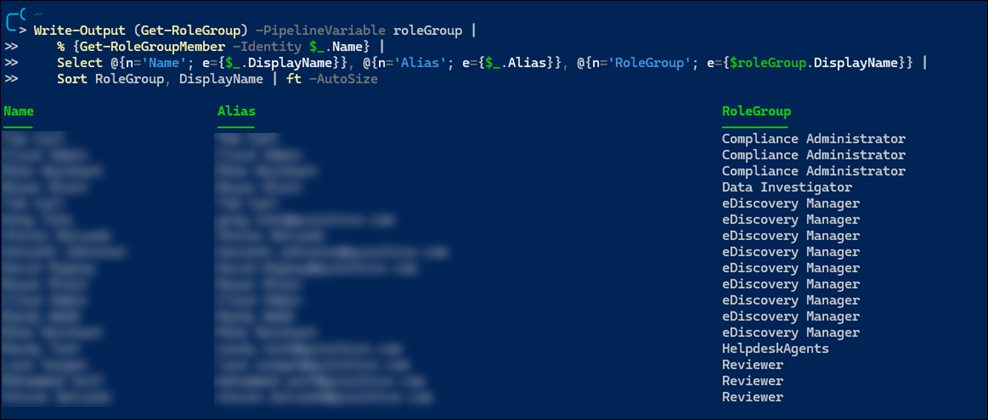
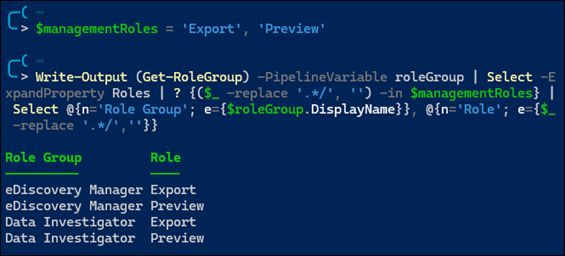

# Permissions, Roles, and Scopes in Microsoft Purview

## Links
- [Permissions in the Microsoft Purview compliance portal](https://learn.microsoft.com/en-us/microsoft-365/compliance/microsoft-365-compliance-center-permissions?view=o365-worldwide)
- [Roles and role groups in Microsoft Defender for Office 365 and Microsoft Purview compliance](https://learn.microsoft.com/en-us/microsoft-365/security/office-365-security/scc-permissions?toc=%2Fmicrosoft-365%2Fcompliance%2Ftoc.json&bc=%2Fmicrosoft-365%2Fbreadcrumb%2Ftoc.json&view=o365-worldwide)

## Overview
The Microsoft Purview compliance portal has a **Permissions** tab you may use for assigning permissions. Permissions in the compliance portal are based on role-based access control (RBAC) permissions model. 

The RBAC model is similar to the one used with Exchange Online. But it's important to remember that the role groups in Exchange Online and role groups for Defender for Office 365 or Purview compliance don't share membership or permissions. For example, while an Organization Management role group exists in Exchange Online, the permissions granted and role group members are different than the Organization Management role group in Defender for Office 365 and Purview compliance. 

There are several concepts for the RBAC model:
- Role: grants permissions to do a set of tasks
- Role Group: a set of roles that enable users to do their jobs across compliance solutions in the compliance portal

You add users to role groups. Role groups contain multiple roles, with each role having a set of permissions.  


You can create new role groups but you cannot create new roles. To make things confusing, there are roles with the same name as role groups.  For example, the Security Administrator role group contains the Security Administrator role, among other roles. To make things even more confusing, there are role groups with the same name as Azure AD roles, e.g. "Compliance Administrator". Membership in the Azure AD role does not carry over to membership in the Purview compliance role group&mdash;they are completely separate.

The **Permissions** tab lists role groups. To view the Permissions tab, you need to be an admin. Specifically, you need to be assigned the **Role Management** role, and that role is assigned only to the **Organization Management** role group by default. The **Role Management** role also allows you to view, create, and modify role groups. 


You may view the corresponding Azure AD roles and Microsoft Purview compliance role groups in the permissions tab.  Again, these are completely separate groups, even though some groups carry the same name.  
 


See [Role groups in Microsoft Defender for Office 365 and Microsoft Purview compliance](https://learn.microsoft.com/en-us/microsoft-365/security/office-365-security/scc-permissions?toc=%2Fmicrosoft-365%2Fcompliance%2Ftoc.json&bc=%2Fmicrosoft-365%2Fbreadcrumb%2Ftoc.json&view=o365-worldwide#role-groups-in-microsoft-defender-for-office-365-and-microsoft-purview-compliance) for a table that lists the role groups along with their roles.

See [Roles in Microsoft Defender for Office 365 and Microsoft Purview compliance](https://learn.microsoft.com/en-us/microsoft-365/security/office-365-security/scc-permissions?toc=%2Fmicrosoft-365%2Fcompliance%2Ftoc.json&bc=%2Fmicrosoft-365%2Fbreadcrumb%2Ftoc.json&view=o365-worldwide#roles-in-microsoft-defender-for-office-365-and-microsoft-purview-compliance) for a table that lists the available roles and the role groups they're assigned to by default.

## The Organization Management Role Group
The Organization Management role group is the most powerful role group in Purview compliance. It has the most assigned roles (38) and is the only role group with the Role Management permission.  Global Admins are automatically added to the Organization Management role group, but you won't see them in the output of the `Get-RoleGroupMember` cmdlet.

## Use PowerShell to Manage Role Groups
View all role-based commands in Microsoft Purview.  Requires either Azure AD Global Admin or Microsoft Purview Organization Management. 
```powershell
Get-Command -Module tmp* -Noun *role*
```


**Note:** Unlike many other parameters in PowerShell, the `-Identity` parameter in `Get-RoleGroupMember` is case sensitive. In fact, it seems the `-Identity` parameter for all cmdlets for managing role groups is case sensitive. 


Use the following PowerShell command to pull role group information, include number of roles and description of each role group:  
```powershell
Get-RoleGroup | 
    Select Name, 
        @{n='RoleCount';e={($_ | Select -ExpandProperty roles).count}}, 
        @{n='Roles'; e={ ($_ | Select -ExpandProperty roles) -replace '.*/', '' -join ', '}},
        Description | 
    Sort RoleCount -Descending | ft -wrap
```


Use the following PowerShell command to pull role information:  
```powershell
Get-ManagementRole | select name, description | sort name
```

Use the following command to list all users and their corresponding Microsoft Purview role group membership:  
```powershell
Write-Output (Get-RoleGroup) -PipelineVariable roleGroup | 
    % {Get-RoleGroupMember -Identity $_.Name} | 
    Select @{n='Name'; e={$_.DisplayName}}, @{n='Alias'; e={$_.Alias}}, @{n='RoleGroup'; e={$roleGroup.DisplayName}} | 
    Sort RoleGroup, DisplayName | ft -AutoSize
```


A couple of things to note about this command:
1. `Write-Output` is needed for `-PipelineVariable`, as this parameter doesn't seem to work for `Get-RoleGroup`
2. The output of `Get-RoleGroupMember` includes the *PrimarySmtpAddress* property, but this property is not defined. The *Alias* property is the only property that has a defined email address.

Use the following command to list all role groups with the specified management roles:  
```powershell
$managementRoles = 'Export', 'Preview
Write-Output (Get-RoleGroup) -PipelineVariable roleGroup | 
    Select -ExpandProperty Roles | 
    ? ($_ -replace '*./', '') -in $managementRoles | 
    Select @{n='Role Group'; e={$roleGroup.DisplayName}}, @{n='Role'; e={$_}}
```



Use the following command to add a member to a role group:  
```powershell
Add-RoleGroupMember -Identity OrganizationManagement -Member AdeleV@tate0423sandbox.onmicrosoft.com
```

Use the following command to remove a member from a role group:  
```powershell
Remove-RoleGroupMember -Identity OrganizationManagement -Member 'Adele Vance'
```

In both commands above you may either use the UserPrincipalName or the Display Name properties. 
