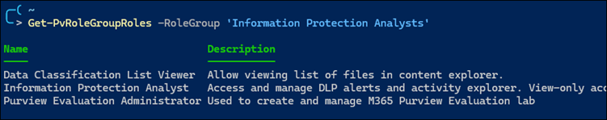
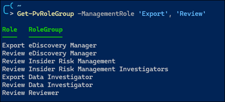
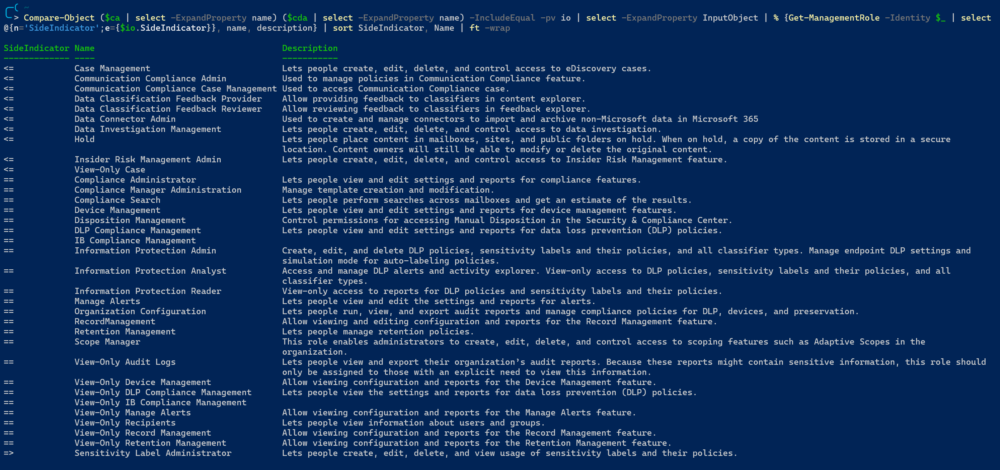
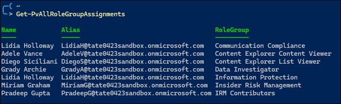
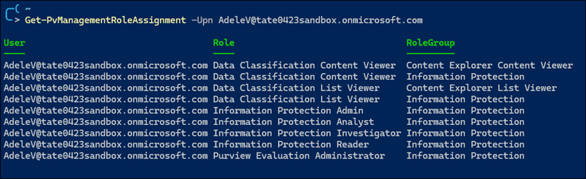
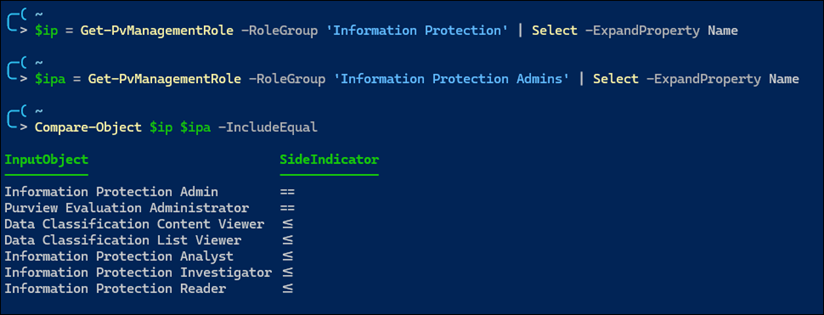
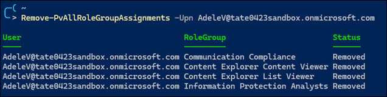

# Permissions, Roles, and Scopes in Microsoft Purview

- [Links](#links)
- [Overview](#overview)
- [The Organization Management Role Group](#the-organization-management-role-group)
- [Azure AD Roles vs Microsoft Purview Role Groups](#azure-ad-roles-vs-microsoft-purview-role-groups)
- [The Compliance Administrator](#the-compliance-administrator)
- [The Compliance Data Administrator](#the-compliance-data-administrator)
- [Use PowerShell to Manage Purview Permissions](#use-powershell-to-manage-purview-permissions)
  - [Get Role Group Details](#get-role-group-details)
  - [Get Role Details](#get-role-details)
  - [Compare Role Assignments in Role Groups](#compare-role-assignments-in-role-groups)
  - [Audit Membership for all Microsoft Purview Role Groups](#audit-membership-for-all-microsoft-purview-role-groups)
  - [Audit Membership for Specific Users](#audit-membership-for-specific-users)
  - [Manage Role Membership](#manage-role-membership)
  - [Remove a Set of Users from all Role Groups](#remove-a-set-of-users-from-all-role-groups)

## Links
- [Permissions in the Microsoft Purview compliance portal](https://learn.microsoft.com/en-us/microsoft-365/compliance/microsoft-365-compliance-center-permissions?view=o365-worldwide)
- [Roles and role groups in Microsoft Defender for Office 365 and Microsoft Purview compliance](https://learn.microsoft.com/en-us/microsoft-365/security/office-365-security/scc-permissions?toc=%2Fmicrosoft-365%2Fcompliance%2Ftoc.json&bc=%2Fmicrosoft-365%2Fbreadcrumb%2Ftoc.json&view=o365-worldwide)

## Overview
The Microsoft Purview compliance portal has a **Permissions** tab you may use for assigning permissions. Permissions in the compliance portal are based on role-based access control (RBAC) permissions model. 

The RBAC model is similar to the one used with Exchange Online. But it's important to remember that the role groups in Exchange Online and role groups for Defender for Office 365 or Purview compliance don't share membership or permissions. For example, while an Organization Management role group exists in Exchange Online, the permissions granted and role group members are different than the Organization Management role group in Defender for Office 365 and Purview compliance. 

There are several concepts for the RBAC model:
- Role: grants permissions to do a set of tasks
- Role Group: a set of roles that enable users to do their jobs across compliance solutions in the compliance portal

You add users to role groups. Role groups contain multiple roles, with each role having a set of permissions.  


You can create new role groups but you cannot create new roles. To make things confusing, there are roles with the same name as role groups.  For example, the Security Administrator role group contains the Security Administrator role, among other roles. To make things even more confusing, there are role groups with the same name as Azure AD roles, e.g. "Compliance Administrator". Membership in the Azure AD role does not carry over to membership in the Purview compliance role group&mdash;they are completely separate.

The **Permissions** tab lists role groups. To view the Permissions tab, you need to be an admin. Specifically, you need to be assigned the **Role Management** role, and that role is assigned only to the **Organization Management** role group by default. The **Role Management** role also allows you to view, create, and modify role groups. 


You may view the corresponding Azure AD roles and Microsoft Purview compliance role groups in the permissions tab.  Again, these are completely separate groups, even though some groups carry the same name.  
 


See [Role groups in Microsoft Defender for Office 365 and Microsoft Purview compliance](https://learn.microsoft.com/en-us/microsoft-365/security/office-365-security/scc-permissions?toc=%2Fmicrosoft-365%2Fcompliance%2Ftoc.json&bc=%2Fmicrosoft-365%2Fbreadcrumb%2Ftoc.json&view=o365-worldwide#role-groups-in-microsoft-defender-for-office-365-and-microsoft-purview-compliance) for a table that lists the role groups along with their roles.

See [Roles in Microsoft Defender for Office 365 and Microsoft Purview compliance](https://learn.microsoft.com/en-us/microsoft-365/security/office-365-security/scc-permissions?toc=%2Fmicrosoft-365%2Fcompliance%2Ftoc.json&bc=%2Fmicrosoft-365%2Fbreadcrumb%2Ftoc.json&view=o365-worldwide#roles-in-microsoft-defender-for-office-365-and-microsoft-purview-compliance) for a table that lists the available roles and the role groups they're assigned to by default.

## The Organization Management Role Group
The Organization Management role group is the most powerful role group in Purview compliance. It has the highest count of assigned roles (38) and is the only role group which grants the ability to assign roles in Purview compliance.  Azure AD Global Admins are automatically added to the Organization Management role group, but you won't see them in the output of the `Get-RoleGroupMember` cmdlet.

The Organization Management role group has access to all areas in Microsoft Purview. However, it does not have access to all roles. Here are the following notable roles the Organization Management group **does not** have access to:  
- Export - Lets people export the mailbox and site content that was returned from a search.
- Preview - Lets people view a list of items that were returned from a content search. They'll also be able to open each item from the list to view its contents.
- RMS Decrypt - Lets people decrypt RMS-protected content when exporting search results.
- Data Classification List Viewer - Allow viewing list of files in content explorer.
- Data Classification Content Viewer - Allow viewing in-place rendering of files in content explorer.

**Note:** An Azure AD Global Admin can access and view items in Content Explorer while a person explicitly assigned to the Microsoft Purview Organization Management role group cannot.

## Azure AD Roles vs Microsoft Purview Role Groups
Azure AD and Microsoft Purview have the following similarly-named roles:
- Compliance Administrator
- Compliance Data Administrator
- Security Administrator
- Security Operator
- Security Reader
- Azure Information Protection Administrator (Azure AD)
- Information Protection (Purview)
- Information Protection Admins (Purview)

For the most part, these roles have overlapping permission sets but there are some notable differences. The main difference is upon assignment. In Azure AD, permissions assignment takes effect immediately after the next browser restart. In Microsoft Purview, permissions assignment may take 5-15 minutes and also requires a browser restart. You must take this delay into consideration when using PIM to activate roles with Microsoft Purview role groups.

## The Compliance Administrator
The Compliance Administrator has access to the following areas in Microsoft Purview:
- Compliance Manager
- Data Classification > Classifiers
- Data Classification > Content Explorer (cannot list or view content) *
- Data Classification > Activity Explorer *
- Data Connectors
- Alerts, Policies, Roles & Scopes > Adaptive Scopes *
- Solutions
  - Content Search
  - Communication Compliance
  - Data Loss Prevention *
  - eDiscovery
  - Data Lifecycle Management > Microsoft 365 * 
  - Data Lifecycle Management > Exchange (legacy) ** 
  - Information Protection * 
  - Information Barriers > Segments * 
  - Insider Risk Management
  - Records Management * 
  - Privacy Risk Management

**Note:**
- *: Applies only for the Microsoft Purview Compliance Administrator role group
- **: Applies only for the Azure AD Compliance Administrator role

From above, the Microsoft Purview Compliance Administrator role group has access to more features than the Azure AD Compliance Administrator role. 

The Compliance Administrator does not have access to the following areas in Microsoft Purview: 
- Data Classification > Content Explorer (list and view content)
- Roles & Scopes > Permissions
- Solutions
  - Audit

Additionally, the Compliance Administrator does not have access to the following Microsoft Purview roles (note, not role groups):
- Search and Purge - Lets people bulk-remove data that matches the criteria of a content search.
- Export - Lets people export the mailbox and site content that was returned from a search.
- RMS Decrypt - Lets people decrypt RMS-protected content when exporting search results.
- Data Classification List Viewer - Allow viewing list of files in content explorer.
- Data Classification Content Viewer - Allow viewing in-place rendering of files in content explorer.

The list above is not exhaustive and only includes roles that I consider notable. 

## The Compliance Data Administrator
Like the Compliance Administrator, Azure AD and Microsoft Purview have similarly-named roles for the Compliance Data Administrator. The Compliance Data Administrator has access to most features that the Compliance Administrator has access to except for eDiscovery, Communication Compliance, and Insider Risk Management.

The Compliance Data Administrator has access to the following areas:
- Compliance Manager
- Data Classification > Classifiers
- Data Classification > Content Explorer (cannot list or view content)
- Data Classification > Activity Explorer
- Data Connectors (view only)
- Alerts, Policies, Roles & Scopes > Adaptive Scopes
- Solutions
  - Content Search
  - Data Loss Prevention
  - Data Lifecycle Management > Microsoft 365
  - Information Protection
  - Information Barriers
  - Records Management
  - Privacy Risk Management
  - Subject Rights Request

The Compliance Data Administrator does not have access to the following areas
- Roles & Scopes > Permissions
- Solutions
  - Audit
  - Communication Compliance
  - eDiscovery
  - Data Lifecycle Management > Exchange (Legacy)
  - Insider Risk Management

Additionally, the Compliance Data Administrator does not have access to the following Microsoft Purview roles that the Compliance Administrator role group has access to:
- Case Management - Lets people create, edit, delete, and control access to eDiscovery cases.
- Communication Compliance Admin - Used to manage policies in Communication Compliance feature.
- Communication Compliance Case Admin - Used to access Communication Compliance case.
- Data Classification Feedback Provider - Allow providing feedback to classifiers in content explorer.
- Data Classification Feedback Reviewer - Allow reviewing feedback to classifiers in feedback explorer.
- Data Connector Admin - Used to create and manage connectors to import and archive non-Microsoft data in Microsoft 365
- Data Investigation Management - Lets people create, edit, delete, and control access to data investigation.
- Hold - Lets people place content in mailboxes, sites, and public folders on hold. When on hold, a copy of the content is stored in a secure location. Content owners will still be able to modify or delete the original content.
- Insider Risk Management Admin - Lets people create, edit, delete, and control access to Insider Risk Management feature.

## Use PowerShell to Manage Purview Permissions
View all role-based commands in Microsoft Purview.  Requires either Azure AD Global Admin or Microsoft Purview Organization Management. 
```powershell
Get-Command -Module tmp* -Noun *role*
```


**Note:** Unlike many other parameters in PowerShell, the `-Identity` parameter in the cmdlets for managing role groups is case sensitive. You will get an error if you specify the wrong case:  


### Get Role Group Details
Use the following PowerShell command to pull role group information, including a list of roles assigned to each role group:  

```powershell
Get-RoleGroup |
  Select Name,
      @{n='RoleCount';e={($_ | Select -ExpandProperty roles).count}},
      @{n='Roles'; e={ ($_ | Select -ExpandProperty roles) -replace '.*/', '' -join "`n" }} |
  Sort RoleCount -Descending | ft -wrap
```


### Get Role Details
Use the following PowerShell command to pull role information. In PowerShell, a role is called a *management role*. 
```powershell
Get-ManagementRole | select Name, Description | sort Name
```

Use the following command to list all management roles in a specified role group:  
```powershell
function Get-PvManagementRole {
    param(
        [string]$RoleGroup
    )
    Write-Output (Get-RoleGroup) |
        ? DisplayName -eq "$RoleGroup" |
        Select -ExpandProperty roles |
        % { $_ -replace ".*/",'' } |
        % { Get-ManagementRole -Identity $_ } |
        Select Name, Description | Sort Name
}
```


Use the following command to list all role groups that contain the specified management role:
```powershell
function Get-PvRoleGroup {
    param(
        [string[]]$ManagementRole
    )
    Write-Output (Get-RoleGroup) -PipelineVariable roleGroup |
        Select -ExpandProperty roles |
        % { $_ -replace ".*/",'' } -PipelineVariable role |
        ? { $_ -in $ManagementRole } |
        Select @{n='Role'; e={$role}}, @{n='RoleGroup';e={$roleGroup.DisplayName}}
}
```


### Compare Role Assignments in Role Groups
Use the following commands to compare role assignments between role groups.

```powershell
$allmanagementRoles = Get-ManagementRole | Select -ExpandProperty Name
$orgMgmtRoles = Get-RoleGroup -Identity 'OrganizationManagement' | select -ExpandProperty roles | % {$_ -replace ".*/", ""}
Compare-Object $allManagementRoles $orgMgmtRoles | Sort InputObject
```
For the example above, the results below show all roles which the Organization Management role group does not have.  


Let's say you want to compare role assignments between the following two role groups - Compliance Administrator and Compliance Data Administrator.  You can use the following approach:  
```powershell
$complianceAdministratorRoles = Get-RoleGroup -Identity 'ComplianceAdministrator' |
   Select -ExpandProperty Roles |
   % {$_ -replace ".*/", ""}
$complianceDataAdministratorRoles = Get-RoleGroup -Identity 'ComplianceDataAdministrator' |
   Select -ExpandProperty Roles |
   % {$_ -replace ".*/", ""}
Compare-Object $complianceAdministratorRoles $complianceDataAdministratorRoles | Select -ExpandProperty InputObject
```

This command results in the following output:  


To get role details you can expand on this further:  
```powershell
Compare-Object $complianceAdministratorRoles $complianceDataAdministratorRoles | 
   Select -ExpandProperty InputObject |
   % {Get-ManagementRole -Identity $_} |
   Select Name, Description | Sort Name
```
Here are the results which list the role details available in the Compliance Administrator role group but are not available in the Compliance Data Administrator role group:  


Additional command to compare role groups:



### Audit Membership for all Microsoft Purview Role Groups
Use the following command to list all users and their corresponding Microsoft Purview role group membership:  
```powershell
function Get-PvAllRoleGroupAssignments {
    Write-Output (Get-RoleGroup) -PipelineVariable roleGroup | 
        % {Get-RoleGroupMember -Identity $_.Name} | 
        Select @{n='Name'; e={$_.DisplayName}}, @{n='Alias'; e={$_.Alias}}, @{n='RoleGroup'; e={$roleGroup.DisplayName}} | 
        Sort Name, RoleGroup 
}
```


A couple of things to note about this command:
1. `Write-Output` is needed for `-PipelineVariable`, as this parameter doesn't seem to work for `Get-RoleGroup`
2. The output of `Get-RoleGroupMember` includes the *PrimarySmtpAddress* property, but this property is not defined. The *Alias* property is the only property that has a defined email address.

### Audit Membership for Specific Users
Use the following command to list all role groups for a set of users:  
```powershell
# List Microsoft Purview role groups for a set of users
function Get-PvRoleGroupAssignment {
    param(
        [string[]]$Upn
    )
    Write-Output $Upn -PipelineVariable user | 
        % {Get-RoleGroup} -PipelineVariable roleGroup | 
        % {Get-RoleGroupMember -Identity $_.Name} | 
        ? {$_.Alias -eq $user} | 
        Select @{n='User';e={$user}}, @{n='RoleGroup';e={$roleGroup.DisplayName}} | 
        Sort User, RoleGroup
}
```


Use the following command to list all role groups and roles for a set of users:
```powershell
function Get-PvManagementRoleAssignment {
    param(
        [string[]]$Upn
    )
    Write-Output $Upn -PipelineVariable user |
        % {Get-RoleGroup} -PipelineVariable roleGroup |
        % {Get-RoleGroupMember -Identity $_.Name} |
        ? {$_.Alias -eq $user} |
        % {$roleGroup | Select -ExpandProperty Roles} |
        % {$_ -replace ".*/", ''} -PipelineVariable role |
        Select @{n='User';e={$user}}, @{n='Role';e={$role}}, @{n='RoleGroup';e={$roleGroup.DisplayName}} |
        Sort User, Role, RoleGroup
}
```


Here is another version that uses the functions defined above. This example shows that the role group *Information Protection* is a higher-privileged role group than *Information Protection Admins*.  
```powershell
$ipa = Get-PvManagementRole -RoleGroup 'Information Protection Admins' | Select -ExpandProperty Name
$ip = Get-PvManagementRole -RoleGroup 'Information Protection' | Select -ExpandProperty Name
Compare-Object $ip $ipa -IncludeEqual
```


### Manage Role Membership
Use the following command to add a member to a role group:  
```powershell
Add-RoleGroupMember -Identity OrganizationManagement -Member AdeleV@tate0423sandbox.onmicrosoft.com
```

Use the following command to remove a member from a role group:  
```powershell
Remove-RoleGroupMember -Identity OrganizationManagement -Member 'Adele Vance'
```

In both commands above you may either use the UserPrincipalName or the Display Name properties. 

Here are a couple of pointers to keep in mind when testing role membership:
1. Close out the browser profile and relaunch it to catch the changes. Refreshing or even closing the tab and opening a new tab may not be sufficient.
2. Allow up to 5-10 minutes for the changes to take effect.  

### Remove a Set of Users from all Role Groups
Use the following command to remove a member from all assigned role groups in Microsoft Purview:  
```powershell
function Remove-PvAllRoleGroupAssignments {
    param(
        [string[]]$Upn
    )
    Write-Output $Upn -PipelineVariable user |
        % {Get-RoleGroup} -PipelineVariable roleGroup | 
        % {Get-RoleGroupMember -Identity $_.Name} | 
        ? {$_.Alias -eq $user} | 
        % {Remove-RoleGroupMember -Identity $roleGroup.Name -Member $user -Confirm:$false; ''} | 
        Select @{n='User';e={$user}}, @{n='RoleGroup';e={$roleGroup.DisplayName}}, @{n='Status';e={'Removed'}}
}
```
Note: the empty string `''` on the 5th line is to force output to the Select statement, as `Remove-RoleGroupMember` does not send any output to the pipeline.


