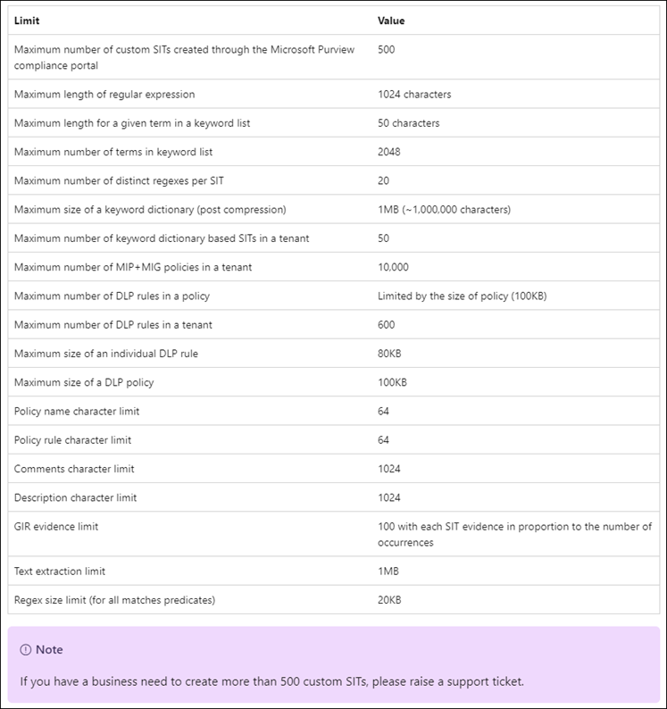
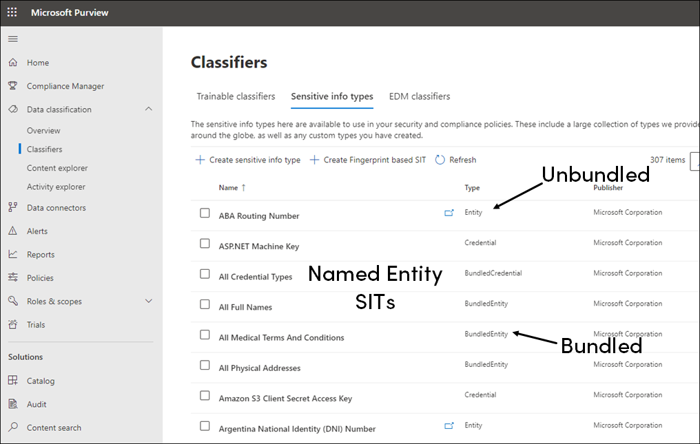
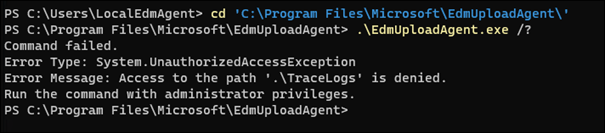

# Sensitive Information Types

## Links
- [Microsoft Docs: Sensitive Information Types](https://learn.microsoft.com/en-us/microsoft-365/compliance/sensitive-information-type-learn-about?view=o365-worldwide)
- [Microsoft Purview Customer Experience Engineering (CxE)](https://microsoft.github.io/ComplianceCxE/)

## Exam Goals
- Identify sensitive information requirements for an organization's data
- Translate sensitive information requirements into built-in or custom sensitive info types
- Create and manage custom sensitive info types
- Create and manage exact data match (EDM) classifiers
- Implement document fingerprinting

## Contents

- [Links](#links)
- [Exam Goals](#exam-goals)
- [Contents](#contents)
- [Sensitivity Information Types Overview](#sensitivity-information-types-overview)
  - [Sensitive Information Type Patterns](#sensitive-information-type-patterns)
  - [Confidence Levels](#confidence-levels)
  - [Providing Accuracy Feedback](#providing-accuracy-feedback)
  - [Creating Custom Sensitive Information Types](#creating-custom-sensitive-information-types)
  - [Sensitive Information Type Limits](#sensitive-information-type-limits)
    - [Instance Count Supported Values for SIT](#instance-count-supported-values-for-sit)
- [Named Entity Sensitive Information Types](#named-entity-sensitive-information-types)
- [Custom Sensitive Information Types](#custom-sensitive-information-types)
  - [Create a SIT from Scratch](#create-a-sit-from-scratch)
  - [Test your Sensitive Information Type](#test-your-sensitive-information-type)
  - [Example: Define Confidence Level Patterns](#example-define-confidence-level-patterns)
  - [Customize Sensitive Information Types using PowerShell and XML](#customize-sensitive-information-types-using-powershell-and-xml)
    - [Quick Access: Export and Import Commands](#quick-access-export-and-import-commands)
    - [View SIT rules with PowerShell](#view-sit-rules-with-powershell)
    - [Export custom SIT rules to XML](#export-custom-sit-rules-to-xml)
    - [Import custom SIT XML using PowerShell](#import-custom-sit-xml-using-powershell)
    - [Additional Notes on XML structure](#additional-notes-on-xml-structure)
    - [Test custom SITs using PowerShell](#test-custom-sits-using-powershell)
  - [Additional Considerations with Custom SITs](#additional-considerations-with-custom-sits)
    - [Note: Additional checks result in logical AND, not logical OR](#note-additional-checks-result-in-logical-and-not-logical-or)
    - [Issue: Unexpected results when using prefixes and suffixes additional check](#issue-unexpected-results-when-using-prefixes-and-suffixes-additional-check)
    - [Note: Specifying *Any of these* criteria](#note-specifying-any-of-these-criteria)
    - [Note: Keyword Lists vs Keyword Dictionaries](#note-keyword-lists-vs-keyword-dictionaries)
- [Exact Data Match (EDM) Sensitive Information Types](#exact-data-match-edm-sensitive-information-types)
  - [Concepts Specific to EDMs](#concepts-specific-to-edms)
    - [Schema](#schema)
    - [Sensitive Information Source Table](#sensitive-information-source-table)
    - [Rule Package](#rule-package)
    - [You Supply Your Own Schema and Data](#you-supply-your-own-schema-and-data)
    - [Primary and Secondary Support Elements](#primary-and-secondary-support-elements)
    - [How Matching Works](#how-matching-works)
    - [Services Supported by EDM](#services-supported-by-edm)
  - [Creating and Managing EDM SITs](#creating-and-managing-edm-sits)
    - [About the EDM Creation Experiences—Classic and New](#about-the-edm-creation-experiencesclassic-and-new)
    - [Defining the EDM data structure](#defining-the-edm-data-structure)
    - [Export source data](#export-source-data)
    - [Create sample file (New Experience)](#create-sample-file-new-experience)
    - [Create EDM schema (New Experience)](#create-edm-schema-new-experience)
      - [Create EDM schema (New Experience) - Manual Method](#create-edm-schema-new-experience---manual-method)
    - [Upload the Sensitive Information Source Table (New and Classic Experience)](#upload-the-sensitive-information-source-table-new-and-classic-experience)
      - [Prerequisites](#prerequisites)
        - [Create the **EDM\_DataUploaders** security group](#create-the-edm_datauploaders-security-group)
        - [Install the EDM Upload Agent](#install-the-edm-upload-agent)
        - [Create EDM Folder structure](#create-edm-folder-structure)
        - [Authorize the EDM Upload Agent](#authorize-the-edm-upload-agent)
      - [Export the EDM Schema](#export-the-edm-schema)
        - [Export the EDM Schema using `Get-DlpEdmSchema`](#export-the-edm-schema-using-get-dlpedmschema)
        - [Export the EDM Schema using EdmUploadAgent.exe](#export-the-edm-schema-using-edmuploadagentexe)
      - [EDM Upload Process](#edm-upload-process)
        - [Validate Sensitive Data Table](#validate-sensitive-data-table)
        - [Method 1: Hash and Upload](#method-1-hash-and-upload)
        - [Method 2: Separate Hash and Upload](#method-2-separate-hash-and-upload)
        - [Check Upload Status](#check-upload-status)
- [Document Fingerprinting](#document-fingerprinting)
  - [How document fingerprinting works](#how-document-fingerprinting-works)
  - [Supported file types](#supported-file-types)
  - [Limitations](#limitations)
  - [Create Fingerprint SIT in Compliance Portal](#create-fingerprint-sit-in-compliance-portal)
  - [Create Fingerprint SIT using PowerShell](#create-fingerprint-sit-using-powershell)
  - [Matching](#matching)
  - [Test a Fingerprint SIT](#test-a-fingerprint-sit)
  - [Validate DLP Fingerprint Functionality](#validate-dlp-fingerprint-functionality)
- [PowerShell commands for Sensitive Information Types](#powershell-commands-for-sensitive-information-types)

## Sensitivity Information Types Overview

Identifying and classifying sensitive items is the first step in the Information Protection discipline. Microsoft Purview provides three ways of identifying items:
- Manually by users
- Automated pattern recognition by Sensitive Information Types
- Machine learning

Sensitive Information Types (SIT) are pattern-based classifiers and are used in 
- DLP policies
- Sensitivity labels
- Retention labels
- Insider risk management
- Communication compliance
- Auto-labeling policies
- Microsoft Priva

Fundamental parts of a Sensitive Information Type
- Name
- Description
- Pattern
  - Primary element - can be a regular expression, a keyword list, or a function
  - Supporting element - helps to increase confidence in a match
  - Confidence level - high, medium, or low.  The more supporting evidence the higher the confidence match
  - Proximity - number of characters between primary and supporting element

### Sensitive Information Type Patterns
Primary elements can use the following patterns:
- Regular expression - M365 SITs use the [Boost.RegEx 5.1.3](https://www.boost.org/doc/libs/1_68_0/libs/regex/doc/html/) engine.
- Keyword list - you create your own list or choose from existing lists
- [Keyword dictionary](https://learn.microsoft.com/en-us/microsoft-365/compliance/create-a-keyword-dictionary?view=o365-worldwide) - provide simple management of keywords at a larger scale than keyword lists
- [SIT function](https://learn.microsoft.com/en-us/microsoft-365/compliance/sit-functions?view=o365-worldwide) - predefined routine--you cannot create your own function. 

### Confidence Levels
Matches with a higher confidence level will contain more supporting evidence in close proximity to the primary element. Matches with a lower confidence level contain little or no supporting evidence in close proximity.

Confidence Level Values
- Low: <= 65
  - Matched items contain the fewest false negatives but the most false positives
- Medium: 65 < x <= 75
- High: x > 75 
  - Matched items contain the fewest false positives but the most false negatives

Use high confidence levels patterns with low counts, say 5-10, and low confidence with high confidence matches, say 20 or more.


See [US Social Security Number (SSN)](https://learn.microsoft.com/en-us/microsoft-365/compliance/sit-defn-us-social-security-number?view=o365-worldwide) as an example definition of an SIT.

Confidence values are declared as "High", "Medium", and "Low" in the portal. Specific values are declared in the resulting XML file.


Here are the default values:
- Low: 65
- Medium: 75
- High: 85

### Providing Accuracy Feedback
You can view number of SIT matches in the Content Explorer.


You can also provide feedback on trainer classifier accuracy by using the **Match, Not a Match** mechanism. See [Increase trainer accuracy](https://learn.microsoft.com/en-us/microsoft-365/compliance/data-classification-increase-accuracy?view=o365-worldwide)

### Creating Custom Sensitive Information Types
Three methods for creating custom sensitive information types:
- Use the Compliance Center UI
  - Allows for regular expressions, keywords, and keyword dictionaries
- Use Exact Data Match (EDM)
  - EDM-based classification enables you to create a dynamic sensitive information type using a secure database that you can refresh periodically
- Use PowerShell
  - Has more configuration options than the UI

### [Sensitive Information Type Limits](https://learn.microsoft.com/en-us/microsoft-365/compliance/sit-limits?view=o365-worldwide)



#### Instance Count Supported Values for SIT
For a scanned item to satisfy the rule criteria, the number of unique instances of a SIT in any single item must fall between the min and max values. This is called the **Instance count**.

- **Min** field: The lower limit (minimum number) of unique instances of a SIT that must be found to trigger a match.  Supported values are 1 to 500.
- **Max** field: The upper limit for triggering a match.  
    - 1 to 500: Use this value when you want to specify an upper limit
    - Any - use `Any` when you want to ensure that the unique instance count is satisfied when an undefined number of unique instances are found and that the number of instances meets or exceeds the minimum number of unique instances value

## Named Entity Sensitive Information Types
References
- [Microsoft Docs: Learn about named entities](https://learn.microsoft.com/en-us/microsoft-365/compliance/named-entities-learn?view=o365-worldwide)  
- [Microsoft Docs: Sensitive Information Type Entity Definitions](https://learn.microsoft.com/en-us/microsoft-365/compliance/sensitive-information-type-entity-definitions?view=o365-worldwide)

*Named entities* are complex dictionary and pattern-based classifiers you can use to detect person names, physical addresses, and medical terms and conditions. Named entities are SITs used in many places:
- Microsoft Purview DLP policies
- Sensitivity labels
- Insider risk management
- Microsoft Defender for Cloud Apps
- Microsoft Purview Information Protection
- Data Lifecycle Management
- Records management
- Microsoft Purview eDiscovery
- Microsoft Priva
- Exact data match sensitive information types



Named entity SITs come in two flavors: *bundled* and *unbundled*.  

Bundled named entity SITs detect all possible matches. Use them as broad criteria in your DLP policies for detecting sensitive items. These SITs typically begin w/ the word *All*.

Unbundled named entity SITs have narrower focus, like a single country.  Use them when you need a DLP policy with a narrower scope.


To use bundled SITs, you must activate relevant DLP settings in [Advanced classification scanning and protection](https://learn.microsoft.com/en-us/microsoft-365/compliance/dlp-configure-endpoint-settings?view=o365-worldwide#advanced-classification-scanning-and-protection). By default, this feature is turned off.


Microsoft also provides examples of DLP policies that use named entity SITs. The Enhanced versions can be used in DLP and auto-labeling.


## Custom Sensitive Information Types
References
- [Microsoft Docs: Create custom sensitive information types](https://learn.microsoft.com/en-us/microsoft-365/compliance/create-a-custom-sensitive-information-type?view=o365-worldwide)

There are two ways to create a custom Sensitive Information Type
1. From scratch
2. Copy and modifying an existing sensitive information type

Custom sensitive information types are stored in the rule package named `Microsoft.SCCManaged.CustomRulePack`. Use `Get-DlpSensitiveInformationTypeRulePackage` to view the contents.  

### Create a SIT from Scratch


The following regular expression matches a string that starts with 4 digits for the year, followed by 2 digits for the month (01-12), followed by 2 digits for the day (01-31), and ends with 3 digits. For example, it will match the string “20230430001”.  The **Word match** option indicates the match must exist on its own.  The **String match** option means the match can be included within text.


When adding a regular expression, you may also choose from a number of regular expression validators.  For example, given the PO number contains a date, you can use the date validator as an additional check. This will filter out items that resemble the date structure but do not actually qualify, e.g. a number with 13 in the month place and 32 in the day place.


In the screenshot below be sure to enter keywords on separate lines.


The picture above asks you to select the recommended confidence level.  In addition to the confidence level for each pattern (see previous screenshot above), the sensitive information type, as a whole, must have a defined recommended confidence level. When you create a rule in a policy, e.g. a DLP policy, if you don't specify a confidence level for the rule to use, that rule will match based on the SIT's recommended confidence level. The recommended confidence level is a mandatory setting.


### Test your Sensitive Information Type
Create a test file and load it with a few examples. Space each sample so that they are out of the proximity range you defined.  


Use the **Test** feature in the portal to upload your test file.


Observe the matches and match behavior.


### Example: Define Confidence Level Patterns
  
In this scenario we start with the SIT created from the previous section, which tracks the organization's internal purchase order (PO) number. The PO uses the format Q20230502001 and is based on the date and an index number with the prefix "Q".

There are three confidence level options with a custom SIT&mdash;low, medium, and high. 

For a low confidence level we use anything that matches the regular expression.


For a medium confidence level we use additional checks, including the "Q" or "Q-" prefix and anything that starts with the years 199, 200, 201, and 202. All additional checks must match, not just one. 

IMPORTANT:
There are a couple of important details to note when specifying values in **Additional Checks**:
- Do not use separate lines for each value
- Do not separate values with a space;  all values should appear directly after the comma with no space
- Multiple additional checks result in a logical AND, not a logical OR


For a high confidence level we use a keyword list as a secondary element in addition to the regular expression and additional checks from the medium confidence level: 


Here's an overall look at the patterns:


In cases where you have multiple pattern rules *within the same confidence level*, it is important to note that order matters. The scanning engine will only report a match for the first pattern rule in that confidence level. In the case below, the matches would be Pattern #1 for the Low and Pattern #3 for the High confidence level.


### Customize Sensitive Information Types using PowerShell and XML
Reference
- [Customize a built-in built-in Sensitive Information Type](https://learn.microsoft.com/en-us/microsoft-365/compliance/customize-a-built-in-sensitive-information-type?view=o365-worldwide)  
- [Create a custom sensitive information type - PowerShell](https://learn.microsoft.com/en-us/microsoft-365/compliance/create-a-custom-sensitive-information-type-in-scc-powershell?view=o365-worldwide#potential-validation-issues-to-be-aware-of)
  - Explains SIT XML structure
- [Modify a custom sensitive information type - PowerShell](https://learn.microsoft.com/en-us/microsoft-365/compliance/sit-modify-a-custom-sensitive-information-type-in-powershell?view=o365-worldwide)

PowerShell offers a lot more flexibility and ease when making changes to SITs. The process involves exporting a SIT rule to XML, making changes to the XML in a text editor, and then importing the XML into the SIT rule.

When working with PowerShell and XML you get the following additional configuration options not available in the portal:
- Ability to specify specific confidence level values (instead of High, Medium, and Low)

When diagnosing problems with the SIT it may be easier to identify issues in the XML. For example, if you unintentionally placed a space in a comma-separated keyword list, it is easier to spot this mistake in XML than it is in the portal.

#### Quick Access: Export and Import Commands

Use the following commands to export the Microsoft custom rule pack to XML.  
```powershell
$rulepak = Get-DlpSensitiveInformationTypeRulePackage -Identity 'Microsoft.SCCManaged.CustomRulePack'
[System.IO.File]::WriteAllBytes("$env:USERPROFILE\Desktop\exportedRulePack.xml", $rulepak.SerializedClassificationRuleCollection)
```

Use the following command to import the Microsoft custom rule pack XML file.  
```powershell
Set-DlpSensitiveInformationTypeRulePackage -FileData ([System.IO.File]::ReadAllBytes("$env:USERPROFILE\Desktop\exportedRulePack.xml")) -Confirm:$false
```

#### View SIT rules with PowerShell
Use `Get-DlpSensitiveInformationType` to view the properties of a custom SIT.


Unfortunately, `Set-DlpSensitiveInformationType` cannot be used for making changes to custom SITs; this command is really intended for updating document fingerprinting SITs.

To update custom SITs outside of the portal you must use a combination of PowerShell and XMl.

First, run `Get-DlpSensitiveInformationTypeRulePackage`. Custom sensitive information type rules are stored in `Microsoft.SCCManaged.CustomRulePack`. The `Microsoft Rule Package` contains all  of the built-in sensitive information types.  The `Document Fingerprint Rule Package` contains rule packages specific to file-based, i.e. form/template, sensitive information types.


For custom SITs, you typically work with the `Microsoft.SCCManaged.CustomRulePack`.  However, know there are options to create additional rule pack files for custom SITs. The maximum number of rule packages supported is 10, but each package can contain the definition of multiple sensitive information types ([see here](https://learn.microsoft.com/en-us/microsoft-365/compliance/create-a-custom-sensitive-information-type-in-scc-powershell?view=o365-worldwide#upload-your-rule-package)).

When you return all properties of the `Microsoft.SCCManaged.CustomRulePack` you'll find the rule set is displayed in unformatted XML.


PowerShell does not have a built-in method for formatting XML. To format XML, I use the following function, which I place in my PowerShell profile ([reference](https://devblogs.microsoft.com/powershell/format-xml/)):

```PowerShell
function Format-XML {
    [OutputType([System.IO.StringWriter])] 
    [CmdletBinding(PositionalBinding)]
    param(
        [Parameter(Mandatory, Position = 0, ValueFromPipeline)]
        [ValidateNotNullOrEmpty()]
        [xml]$Xml,

        [ValidateRange(1, 8)]
        [int]$indent = 2
    )
    $StringWriter = New-Object System.IO.StringWriter
    $XmlWriter = New-Object System.XMl.XmlTextWriter $StringWriter
    $xmlWriter.Formatting = 'indented'
    $xmlWriter.Indentation = $Indent
    $xml.WriteContentTo($XmlWriter)
    $XmlWriter.Flush()
    $StringWriter.Flush()
    Write-Output $StringWriter.ToString()
}
```

From here, use the following chain of commands to view the rule package definition from the console:

```powershell
Get-DlpSensitiveInformationTypeRulePackage | Select -Index 2 | Select -ExpandProperty ClassificationRuleCollectionXml | Format-XML
```


#### Export custom SIT rules to XML  
If you want to export the rule to an XML file then you must use the `SerializedClassificationRuleCollection` property. The following command exports the built-in `Microsoft.SCCManaged.CustomRulePack`.

```powershell
$rulepak = Get-DlpSensitiveInformationTypeRulePackage -Identity 'Microsoft.SCCManaged.CustomRulePack'
[System.IO.File]::WriteAllBytes("$env:USERPROFILE\Desktop\exportedRulePack.xml", $rulepak.SerializedClassificationRuleCollection)
```

Use a text editor to view and make changes to the rules.


By default, VS Code doesn't display formatted XML. Use the **Format Document** command to format to readable XML.


#### Import custom SIT XML using PowerShell 
Once you have exported an XML file and made changes, use `Set-DlpSensitiveInformationTypeRulePackage` to commit the changes.

```powershell
Set-DlpSensitiveInformationTypeRulePackage -FileData ([System.IO.File]::ReadAllBytes("$env:USERPROFILE\Desktop\exportedRulePack.xml")) -Confirm:$false
```

#### Additional Notes on XML structure
You may remove the proximity declaration for the pattern. In this case the pattern will use the entity's `patternsProximity` value.


#### Test custom SITs using PowerShell
Use `Test-DataClassification` 

```powershell
$results = Test-DataClassification -TextToClassify (Get-Content $env:USERPROFILE\Desktop\test.txt) -ClassificationNames 'Purchase Order Number'
```

### Additional Considerations with Custom SITs
References
- [Sensitive information type additional checks](https://learn.microsoft.com/en-us/microsoft-365/compliance/sit-regex-validators-additional-checks?view=o365-worldwide#sensitive-information-type-additional-checks)
- [Keyword validation issues](https://learn.microsoft.com/en-us/microsoft-365/compliance/create-a-custom-sensitive-information-type-in-scc-powershell?view=o365-worldwide#potential-validation-issues-to-be-aware-of)

#### Note: Additional checks result in logical AND, not logical OR
When using multiple **Additional Checks**, the engine uses a logical AND, not a logical OR.


#### Issue: Unexpected results when using prefixes and suffixes additional check  
For example, given patterns that match an included prefix of "Q" you get expected results when the high confidence match appears after the medium confidence match. 


However, when you place the high confidence match before the medium confidence match, the search results do not report the high confidence match.


#### Note: Specifying *Any of these* criteria
When specifying the *Any of these criteria*, if you want to specify a range, you must include a number of supporting elements capable of satisfying the range.  Otherwise, the value will be `1 to Any`.


Here's how this pattern looks in XML: 


#### Note: Keyword Lists vs Keyword Dictionaries
References
- [Create a keyword dictionary](https://learn.microsoft.com/en-us/microsoft-365/compliance/create-a-keyword-dictionary?view=o365-worldwide)
- [Modify a keyword dictionary](https://learn.microsoft.com/en-us/microsoft-365/compliance/sit-modify-keyword-dictionary?view=o365-worldwide)

Keyword lists and keyword dictionaries accomplish the same thing&mdash;they search for matches in a word list. Keyword lists are suitable for small sets of words. Words in a keyword list are stored in the rules XML file. This is fine for small scenarios but not scalable for large scenarios. 

Words in a keyword dictionary, however, are stored outside of the rules XML file. Keyword dictionaries are useful when you have a much larger list of words, such as a word list that spans multiple languages.  You may also reference keyword dictionaries across multiple rules XML files.

Use `Get-DlpKeywordDictionary` to view the list of dictionaries. There is a limit of 50 keyword dictionary-based SITs that can be created per tenant.


Use the portal to create a keyword dictionary. You can create the dictionary from a list or upload a .CSV or a .TXT file.


You can also use the following commands to manage keyword dictionaries:
- `Get-DlpKeywordDictionary`
- `Set-DlpKeywordDictionary`
- `New-DlpKeywordDictionary`


## Exact Data Match (EDM) Sensitive Information Types
- [Microsoft Docs: EDM-based SITs](https://learn.microsoft.com/en-us/microsoft-365/compliance/sit-learn-about-exact-data-match-based-sits?view=o365-worldwide)  
- [ComplianceCxE: Accurate data classification using Exact Data Matching](https://microsoft.github.io/ComplianceCxE/resources/files/Configuring%20EDM%20for%20accurate%20classification.pdf)


Exact Data Match enables you to define custom sensitive information types based on values in a database rather than using matches found on generic patterns.

EDM SITs are designed to
- be dynamic and easily refreshed
- result in fewer false-positives
- work with structured sensitive data
- handle sensitive information more securely, not sharing it with anyone, including Microsoft
- be used with several Microsoft cloud services

The database values can be refreshed daily and can contain up to 100 million rows of data

### Concepts Specific to EDMs

#### Schema
The schema is an XML file that defines
- the name of the schema, referred to as the **DataStore**
- the field names that your sensitive information source table contains, e.g. First Name, Last Name, Date of Birth
- Which fields are searchable
- A *configurable match* is one with parameters that modify a search, such as ignoring delimiters and case in searched values

#### Sensitive Information Source Table
Contains values that the EDM SIT will look for.  Contains columns and rows.


#### Rule Package
Every SIT has a rule package. You use a rule package in an EDM SIT to define
- Matches
  - The primary element to be used in the exact lookup
  - Can be a regular expression, a keyword list, a keyword dictionary or a function
- Classification
  - Specifies the SIT type match that triggers an EDM lookup
- Supporting Elements
- Confidence Levels
- Proximity

#### You Supply Your Own Schema and Data
With EDM SITs you are responsible for defining the schema as well as primary and secondary fields that identify sensitive items.

The primary and secondary fields are considered highly sensitive items, so you'll be encrypting them via a hash function. Only the hashed values are uploaded to the service. So your sensitive data is never in the open.

#### Primary and Secondary Support Elements
When you create an EDM SIT you define a *primary field* in the rule package. All content will be searched for the primary element.

EDM requires that the primary element be discoverable through an existing SIT. See [here](https://learn.microsoft.com/en-us/microsoft-365/compliance/sensitive-information-type-entity-definitions?view=o365-worldwide) for a list of existing SITs.

EDM does not require that secondary elements to be based on an existing SIT unless they contain multiple tokens. However, secondary elements do need to be within a certain proximity to the primary element.

#### How Matching Works
EDM works by comparing strings in your documents and emails against values in the sensitive information source table to see if the values in the scanned content are present in the table. The comparison is done by using one-way hashes.

Tip: Use EDM SITs and predefined SITs together in DLP rules for better detection. Use the EDM SIT with higher confidence levels and the predefined SIT with lower confidence levels.

#### Services Supported by EDM


### Creating and Managing EDM SITs
References
- [Get started with EDM SITs](https://learn.microsoft.com/en-us/microsoft-365/compliance/sit-get-started-exact-data-match-based-sits-overview?view=o365-worldwide)

#### About the EDM Creation Experiences&mdash;Classic and New
There are two EDM creation experiences, the new experience and the classic experience.  Use the new experience going forward. Here are reasons why you would want to use the classic experience:

1. You want to map multiple EDM SITs to the same schema.  

    In EDM, you can create a maximum of 10 schemas. Each time you create an EDM SIT using the new experience, a new schema is created.  This results in a 1:1 mapping between EDM schema and EDM sit. The new experience doesn't support mapping multiple SITs to the same schema.


2. You need to create or manage more than 10 EDM SITs

    Because the new experience doesn't support mapping multiple SITs to the same schema, you are limited to creating and managing 10 EDM SITs.  In the classic experience, you can map multiple EDM SITs to the same schema and so have more than 10 EDM SITs. Using the new flow, you'll receive an error if you try to create an eleventh EDM schema.

3. You need to specify the name of your EDM schema

    If you need to specify a name for your EDM SIT schemas, you have to use the classic experience to create an manage them. The new experience automatically creates the schema and doesn't provide an opportunity to give your schema a custom name. The auto-generated name is a concatenation of the EDM SIT name and the word *schema*, e.g. *PatientNumberschema*.

4. You need to edit EDM schemas that were created in the classic experience

    All schemas created using the classic experience or uploaded as an XML file using PowerShell are not viewable or manageable in the new experience.

#### Defining the EDM data structure
- Reference
  - [Export Source Data](https://learn.microsoft.com/en-us/microsoft-365/compliance/sit-get-started-exact-data-match-export-data?view=o365-worldwide)

When defining your EDM sensitive type, determining the primary fields is the most critical decision.  Primary fields need to follow a detectable pattern and be defined as searchable fields (columns) in your EDM schema. Secondary fields don't need to follow any pattern since they'll be compared against all the text surrounding matches to the primary fields.

Use the following rules to help you decide which columns you should use as primary fields:

- If you must detect sensitive data based on the presence of a single value matching a field in your sensitive data table, regardless of the presence of any other sensitive data surrounding it, that column must be defined as a primary element for an EDM type.

- If multiple combinations of different fields in your sensitive data table must be detected in content, identify the columns that are common to most such combinations and designate them as primary elements and combinations of other fields as secondary elements.

- If a column you want to use as a primary field doesn't follow a detectable pattern, try to choose over better structured columns as primary elements.

Example:  if you have the columns `full name`, `date of birth`, `account number`, and `Social Security Number`, even first and last names may be common to different combinations of data you want to protect, but such strings don't follow easily identifiable patterns and may be difficult to define as a SIT. Date of birth can be easily identified but is not a good candidate for a primary field because multiple people may have the same date of birth.SSN and account numbers are good candidates for a primary field because they provide uniqueness.

#### Export source data
Reference
- [Export source data](https://learn.microsoft.com/en-us/microsoft-365/compliance/sit-get-started-exact-data-match-export-data?view=o365-worldwide)
  
Microsoft requires you to export your table of sensitive data to a text file. Later on, you'll use the [`EdmUploadAgent.exe`](https://learn.microsoft.com/en-us/microsoft-365/compliance/sit-get-started-exact-data-match-hash-upload?view=o365-worldwide#links-to-edm-upload-agent-by-subscription-type) tool to securely upload a hash of this data to Microsoft. This hashed data will serve as the basis for Exact Data Match rules.

**Step 1**: Create your sensitive data table by exporting the data to a text file in one of the following supported formats:
- CSV (comma-separated values)
- Tab-separated format (see [here](https://www.automateexcel.com/how-to/convert-delimited-text-file/))
  - Useful in cases where your data may contain commas, e.g. street addresses
- Pipe-separated format (see [here](https://www.automateexcel.com/how-to/convert-save-as-pipe-delimited/))

Data file limitations
- Up to 100 million rows of sensitive data
- Up to 32 columns (fields) per data source
- Up to 10 columns (fields) marked as searchable

**Step 2**: Structure the sensitive data such that the first row includes the names of the fields used for EDM-based classification, e.g. "SSN", "birthdate", "firstname", "lastname".  The column headers cannot include spaces or underscores.

**Step 3**: Pay attention to the data format. If field values contain commas, then use a tab-separated or a pipe-separated format.


#### Create sample file (New Experience)
Reference
- [Create EDM SIT sample file for the new experience](https://learn.microsoft.com/en-us/microsoft-365/compliance/sit-create-edm-sit-unified-ux-sample-file?view=o365-worldwide)

In this step you create a sample file that will generate the schema. The sample file must be formatted identically to your source sensitive information table file and should contain synthetic values that are representative of your actual data.

Here are some guidelines for creating the sample file:
- Use about 10-20 rows of data to ensure the system has enough samples to work with
- Field values that contain commas must be enclosed in quotes
- The first row must be the header row and contain column names
- The file must contain at least one row of data
- Each row of data must contain the correct number of fields, corresponding to the headers
- The sample file can contain up to 32 columns
- The sample file can't exceed 2.5 MB in size
- Column (field) names must start with a letter, be at least 3 characters long, and consiste of only alphanumeric characters. Can't include spaces, underscores, or other special characters

Example  


See here for sample template files
- [US Healthcare Data](https://go.microsoft.com/fwlink/?linkid=2224450)
- [US Financial Data](https://go.microsoft.com/fwlink/?linkid=2224770)
- [US Insurance Data](https://go.microsoft.com/fwlink/?linkid=2224769)

In the example that follows, I use a sample file based on two custom SITs I created&mdash;Purchase Order and Account Number.  Here's a look at the sample file.


Remember: for primary fields each column value must be unique!

#### Create EDM schema (New Experience)
Reference
- [Create EDM SIT schema and rule package new experience](https://learn.microsoft.com/en-us/microsoft-365/compliance/sit-create-edm-sit-unified-ux-schema-rule-package?view=o365-worldwide)

Here are the steps used to create an EDM schema in the new experience.

Click **Create EDM classifier**  


Again, click **Create EDM classifier**  


Provide a name and description for the EDM classifier.  


Choose the option to upload a sample data file.  


Verify sample data  


Select primary elements. Remember that values for primary elements must be unique. In this case, the purchase order is always unique.  


Configure data settings  


Configure detection rules. EDM will automatically generate one detection rule for each of the primary elements identified.  


EDM will create a high confidence and a medium confidence rule  


Click **Submit**  


Confirm EDM classifier creation. The next step is to securely upload your sensitive information table data.  


##### Create EDM schema (New Experience) - Manual Method
Here's how the EDM schema creation experience looks when using the manual method, i.e. without the sample file.  


Define columns  


Select primary elements and SITs  


The rest of the process is the same.

#### Upload the Sensitive Information Source Table (New and Classic Experience)
- Reference
  - [Hash and upload the sensitive information source table for exact data match sensitive information types](https://learn.microsoft.com/en-us/microsoft-365/compliance/sit-get-started-exact-data-match-hash-upload?view=o365-worldwide)

There are three parts to this process:
1. Set up a custom security group and user account
2. Set up the EDM Upload Agent tool
3. Use the EDM Upload Agent tool to hash, with a salt value, the sensitive information source table, and upload it.

The hashing and uploading can be done using one computer or you can separate the hash step from the upload step for greater security.

If you don't want to expose your clear-text sensitive information source table file on the direct access computer, you can hash it on a computer that's in a secure location.  Then you can copy the hash file and the salt file to a computer that can connect directly to your M365 tenant for upload. In the separated hash and upload scenario, you'll need the **EDMUploadAgent** on both computers. 

It is best practice to separate the processes of hashing and uploading the sensitive data so you can more easily isolate any issues in the process. Performing the hashing process on an isolated computer and then transferring the file for upload to an internet-facing computer ensures that the actual data is never available in clear text form on a computer that could have been compromised due to its connection to the internet.

Important: If you used the Exact Data Match schema and sensitive information type wizard to create your schema file, you must download the schema for this procedure.  See [Export of the EDM schema file in XML format](https://learn.microsoft.com/en-us/microsoft-365/compliance/sit-get-started-exact-data-match-create-schema?view=o365-worldwide#export-of-the-edm-schema-file-in-xml-format).

Note: If your org has set up [Customer Key for Microsoft 365 at the tenant level](https://learn.microsoft.com/en-us/microsoft-365/compliance/customer-key-overview?view=o365-worldwide), an exact data match will use the encryption functionality automatically. This is for E5-licensed customers only.

##### Prerequisites

###### Create the **EDM_DataUploaders** security group
Use the following command to create the group:  
```powershell
New-AzureADGroup -DisplayName 'EDM_DataUploaders' -SecurityEnabled:$true -MailEnabled:$false -MailNickName 'edmupload' -Description "For use with the EDM Upload Agent tool"
```

Add members to the EDM_DataUploaders group.  
```powershell
Add-AzureADGroupMember -ObjectId cbca634c-a738-4409-990e-a3c09664f0ab -RefObjectId 6a245092-7801-445d-92b2-ac88d6759b92
```

###### Install the EDM Upload Agent
See [Links to EDM upload agent by subscription type](https://learn.microsoft.com/en-us/microsoft-365/compliance/sit-get-started-exact-data-match-hash-upload?view=o365-worldwide#links-to-edm-upload-agent-by-subscription-type) for download.

There are a couple of caveats when installing and using the EDM Upload Agent tool:

1. Install the EDM Upload Agent to a custom folder so you don't need administrative permissions. If you install it into the default folder (*Program Files*), administrator permissions are required.

2. The tool is designed to be run from the folder where it's installed. Provide an easy-to-use installation path,e.g. C:\EDM\Agent. 

If you accept the defaults, then a standard user will receive the following error when running EdmUploadAgent.exe. The EDM Upload Agent tool writes trace files to the installation directory, and standard users don't have write access to C:\Program Files.    



Here's an overview of the installation process:  

Microsoft Exact Data Match setup  


Install to a directory where standard users have write access.  
  

Accept EULA and then click **Finish**  


After the command completes you may receive an error related to accessing the TraceLogs folder. You can disregard this message.  


Verify usage with a standard user account:  


###### Create EDM Folder structure
The EDM Agent accesses several types of data. Use a folder structure for storing each of these data types&mdash;the sensitive data table, the EDM schema, and the hashes and salts used for encrypting the data.   


###### Authorize the EDM Upload Agent
Run the following command to authorize the EDM Upload Agent

```
.\EdmUploadAgent.exe /Authorize
```

You will be prompted to enter credentials for a user that has access to the EDM_DataUploaders security group.
 

##### Export the EDM Schema
###### Export the EDM Schema using `Get-DlpEdmSchema`
- References
  - [Export of the EDM schema file in XML format](https://learn.microsoft.com/en-us/microsoft-365/compliance/sit-get-started-exact-data-match-create-schema?view=o365-worldwide#export-of-the-edm-schema-file-in-xml-format)

Use `Get-DlpEdmSchema` to export the EDM schema to an XML file.
```powershell
$schema = Get-DlpEdmSchema -Identity 'customerinformationschema'
Set-Content -Path "C:\EDM\Schema\CustomerInformationSchema.xml" -Value $schema.EdmSchemaXml
```

Here's what the schema loos like:


###### Export the EDM Schema using EdmUploadAgent.exe
Use the `/GetDataStore` option to retrieve the datastore name.
```
.\EdmUploadAgent.exe /GetDataStore
```


Use the following command to export the EDM schema to an XML file.
```
.\EdmUploadAgent.exe /SaveSchema /DataStoreName customerinformationschema /OutputDir ..\Schema\
```  


##### EDM Upload Process
###### Validate Sensitive Data Table
The validation process detects the presence of special characters that may cause problems parsing the content. If the tool indicates a mismatch in the number of columns, it might be due to the presence of commas or quote characters within values that are being confused with column delimiters.

If you find single quote characters or commas inside a value, you need to modify the data export process used and surround such columns with double quotes. For example, the person's name *Tom O'Neil* should be listed as *"Tom O'Neil"*. 

If you find double quote characters inside values, use a Tab-delimited format.

Run the following command to validate the EDM data table.

```
.\EdmUploadAgent.exe /ValidateData /DataFile '..\..\Data\Sensitive Data Table.csv' /Schema '..\..\Data\Schemafile.xml'
```

Results should indicate a success.  


###### Method 1: Hash and Upload
The following command hashes and uploads the sensitive information source table in one process. The EDM Upload Agent automatically adds a salt value to the hashed data.  
```
.\EdmUploadAgent.exe /UploadData /DataStoreName customerinformationschema /DataFile '..\Data\Sensitive Data Table.csv' /HashLocation '..\Hash\' /Schema '..\Schema\customerinformationschema.xml' /AllowedBadLinesPercentage 5
```


Use the `/AllowedBadPercentage` parameter when your sensitive information table has some incorrectly formatted values, but you still want to import the remaining data while ignoring invalid rows. For example, a 5 percent threshold means that the tool hashes and uploads the sensitive information table, even if up to 5 percent of the rows are invalid. 

The result of the command is a table with hashed values. This table is stored in the Microsoft cloud.  


###### Method 2: Separate Hash and Upload
It is best practice to separate the process of hashing and uploading the sensitive data so you can more easily isolate issues in the process. Once in production, keep the two steps separate in most cases. Performing the hashing process on an isolated computer and then transferring the file for upload to an Internet-facing computer ensures the actual data is never available in clear text form on a computer that could have been compromised due to its connection to the Internet.

On the computer in the secure environment, run the following command:  
```powershell
$dataFile = "C:\EDM\Data\Sensitive Data Table.csv"
$hashLocation = "C:\EDM\Hash\"
$schemaFile = "C:\EDM\Schema\customerinformationschema.xml"
.\EdmUploadAgent.exe /CreateHash /DataFile $dataFile /HashLocation $hashLocation /Schema $schemaFile /AllowedBadLinesPercentage 5
```
The process creates a hash file and a salt file.  


Copy these files to the computer you use to upload your sensitive information source table to your tenant.

Run the following command to upload the hash file.  
```powershell
.\EdmUploadAgent.exe /UploadHash /DataStoreName customerinformationschema /HashFile 'C:\EDM\Hash\Sensitive Data Table.EdmHash'
```

###### Check Upload Status
Use the following command to get upload status.  
```
.\EdmUploadAgent.exe /GetSession /DataStoreName customerinformationschema
```  
   


Look for the status to be in **ProcessingInProgress**. Check again every few minutes until the status changes to **Completed**. Once the status is completed, your EDM data is ready for use. Depending on the size of the sensitive information source table file, this can take from a few minutes to several hours. 


## Document Fingerprinting
[Microsoft Docs: Document Fingerprinting](https://learn.microsoft.com/en-us/microsoft-365/compliance/document-fingerprinting?view=o365-worldwide)

Document fingerprinting is a Data Loss Protection (DLP) feature that allows you to detect standard forms that are used throughout your organization, making eit easier to protect information.

Document fingerprinting includes the following features:
- DLP can use as a detection method in Exchange, SharePoint, OneDrive, Teams, and Devices
- Can be managed through the Microsoft Purview compliance portal
- Partial matching is supported
- Exact matching is supported
- Improved accuracy detection
- Support for detection in multiple languages

Scenarios
- Government forms
- HIPAA compliance forms
- Employee information forms for HR departments
- Custom forms created specifically for your organization

Ideally, organizations already have an established business practice of using certain forms to transmit sensitive information. To enable detection, upload an empty form to be converted to a document fingerprint. Then set up a corresponding policy. From there, DLP detects documents in outbound mail that match that fingerprint.

### How document fingerprinting works
In the same way that a person's fingerprints have unique patterns, documents have unique word patterns. When you upload a file, DLP identifies the unique word pattern in the document, creates a document fingerprint based on that pattern, and uses that document fingerprint to detect outbound documents containing the same pattern.


In the example above, the patent template contains blank fields "Patent Title", "Inventors", and "Description", along with descriptions for each field&mdash;that's the word pattern. When you upload the template, DLP converts the word pattern into a document fingerprint, which is a small Unicode XML file containing a unique hash value that represents the original text. The fingerprint is saved as a data classification in Active Directory. The original document isn't itself stored; only the hash value is stored. The patent fingerprint then becomes a Sensitive Information Type (SIT) that you can associate with a DLP policy. 

### Supported file types
Document fingerprinting supports the same type of files that are supported by mail transport rules. Neither mail flow rules nor document fingerprinting supports the **.dotx** file type. See [here](https://learn.microsoft.com/en-us/exchange/security-and-compliance/mail-flow-rules/inspect-message-attachments#supported-file-types-for-mail-flow-rule-content-inspection) for supported file types.


### Limitations
Document fingerprinting doesn't work for
* Password protected files
* Files that contain images only
* Documents that don't contain all the text from the original form used to create the fingerprint
* Files larger than 4MB

To use document fingerprinting with devices, **Advanced fingerprinting** must be turned on.

Fingerprints are stored in a separate rule pack, which has a maximum size limit of 150KB. Given this limit, you can create approximately 50 fingerprints per tenant.

Fingerprint SITs are only supported for the following DLP locations:
- Exchange
- SharePoint sites
- OneDrive accounts
- Teams chat and channel messages
- Devices

Fingerprint SITs do not work for the other DLP locations, including
- Microsoft Defender for Cloud Apps
- On-premises repositories
- Power BI

You will get an error message if you select unsupported locations:


Here are the supported locations:


Note the Devices option is not available yet but is expected to be available in June.


There should be an option called **Advanced Fingerprinting** to enable document fingerprinting on devices.


### Create Fingerprint SIT in Compliance Portal
In the Microsoft Purview compliance portal, select **Data Classification > Classifiers**.  Then choose **Sensitive info types > Create Fingerprint based SIT**.


If you receive **Client Error** message when creating a new fingerprint-based SIT, wait a few minutes and try again.


### Create Fingerprint SIT using PowerShell
Use [New-DlpSensitiveInformationType](https://learn.microsoft.com/en-us/powershell/module/exchange/new-dlpsensitiveinformationtype?view=exchange-ps) to create the fingerprint SIT. The documentation doesn't mention the `FileData` parameter, but it's there.


Refer to [New-DlpFingerprint](https://learn.microsoft.com/en-us/powershell/module/exchange/new-dlpfingerprint?view=exchange-ps) for requirements in using the `FileData` parameter.  


If you receive the **Fingerprint Rule Package found in EXO but not EOP** message, wait a few minutes and try again.


### Matching
For partial matching specify percentage values for low, medium, and high. You can do this in the portal or using the `ThresholdConfig` parameter in PowerShell.

Exact matching of a document fingerprint matches only files that have exactly the same text as the fingerprint.  If the file has even a small deviation from the fingerprint, it will not be detected.

Exact matching can only be configured through PowerShell using the `IsExact` parameter. This parameter is available through `Set-DlpSensitiveInformationType` but is undocumented. I ran into issues with it:


However, I was able to use the `Exact` parameter when creating the fingerprint SIT:


### Test a Fingerprint SIT
You can test the fingerprint SIT after creation.


However, initial testing results don't provide useful match information. This could be specific to fingerprint SITs.


You can also test in PowerShell using [`Test-DataClassification`](https://learn.microsoft.com/en-us/powershell/module/exchange/test-dataclassification?view=exchange-ps):


Similar unuseful match results for PowerShell.  Again, could be due to fingerprint SIT vs regular SIT.


### Validate DLP Fingerprint Functionality
From an existing DLP policy use `New-DlpComplianceRule` to add a rule that blocks the fingerprint SIT.


The user will receive an NDR when attempting to share the file over email:


The message trace indicates the email was blocked due to the **Patent Sharing Restriction** DLP rule:


Alternatively, you can use a mail flow rule in Exchange to block the fingerprint SIT.

## PowerShell commands for Sensitive Information Types
Unfortunately, PowerShell provides limited functionality for updating custom Sensitive Information Types (SITs). In most cases you must export and import XML. Therefore, use the portal when modifying SITs. 

- [Get-DlpEdmSchema](https://learn.microsoft.com/en-us/powershell/module/exchange/get-dlpedmschema?view=exchange-ps)
- [Get-DlpKeywordDictionary](https://learn.microsoft.com/en-us/powershell/module/exchange/get-dlpkeyworddictionary?view=exchange-ps)
- [Get-DlpSensitiveInformationType](https://learn.microsoft.com/en-us/powershell/module/exchange/get-dlpsensitiveinformationtype?view=exchange-ps)
- [Get-DlpSensitiveInformationTypeConfig]()
  - Documentation not available
- [Get-DlpSensitiveInformationTypeRulePackage](https://learn.microsoft.com/en-us/powershell/module/exchange/get-dlpsensitiveinformationtyperulepackage?view=exchange-ps)
- [Get-DlpSiDetectionsReport](https://learn.microsoft.com/en-us/powershell/module/exchange/get-dlpsidetectionsreport?view=exchange-ps)
  - Returns DLP sensitive information type detections
- [New-DlpEdmSchema](https://learn.microsoft.com/en-us/powershell/module/exchange/new-dlpedmschema?view=exchange-ps)
  - Create exact data match (EDM)-based classification schema
- [New-DlpKeywordDictionary](https://learn.microsoft.com/en-us/powershell/module/exchange/new-dlpkeyworddictionary?view=exchange-ps)
- [New-DlpSensitiveInformationType](https://learn.microsoft.com/en-us/powershell/module/exchange/new-dlpsensitiveinformationtype?view=exchange-ps)
- [New-DlpSensitiveInformationTypeRulePackage](https://learn.microsoft.com/en-us/powershell/module/exchange/new-dlpsensitiveinformationtyperulepackage?view=exchange-ps)
- [Remove-DlpEdmSchema](https://learn.microsoft.com/en-us/powershell/module/exchange/remove-dlpedmschema?view=exchange-ps)
- [Remove-DlpKeywordDictionary](https://learn.microsoft.com/en-us/powershell/module/exchange/remove-dlpkeyworddictionary?view=exchange-ps)
- [Remove-DlpSensitiveInformationType](https://learn.microsoft.com/en-us/powershell/module/exchange/remove-dlpsensitiveinformationtype?view=exchange-ps)
- [Remove-DlpSensitiveInformationTypeRulePackage](https://learn.microsoft.com/en-us/powershell/module/exchange/remove-dlpsensitiveinformationtyperulepackage?view=exchange-ps)
- [Set-DlpSensitiveInformationType](https://learn.microsoft.com/en-us/powershell/module/exchange/set-dlpsensitiveinformationtype?view=exchange-ps)
  - Only used to manage document fingerprints; cannot use to manage custom SITs
- [Set-DlpSensitiveInformationTypeConfig]()
  - Documentation not available
- [Set-DlpSensitiveInformationTypeRulePackage](https://learn.microsoft.com/en-us/powershell/module/exchange/set-dlpsensitiveinformationtyperulepackage?view=exchange-ps) 
  - Update rule package by providing an XML file
- [Test-DataClassification](https://learn.microsoft.com/en-us/powershell/module/exchange/test-dataclassification?view=exchange-ps)
  - Provide file or text to determine SIT matches
- [Test-TextExtraction](https://learn.microsoft.com/en-us/powershell/module/exchange/test-textextraction?view=exchange-ps)
  - Returns text from a specified email message in Exchange flow
  - Used to determine SITs found in a message