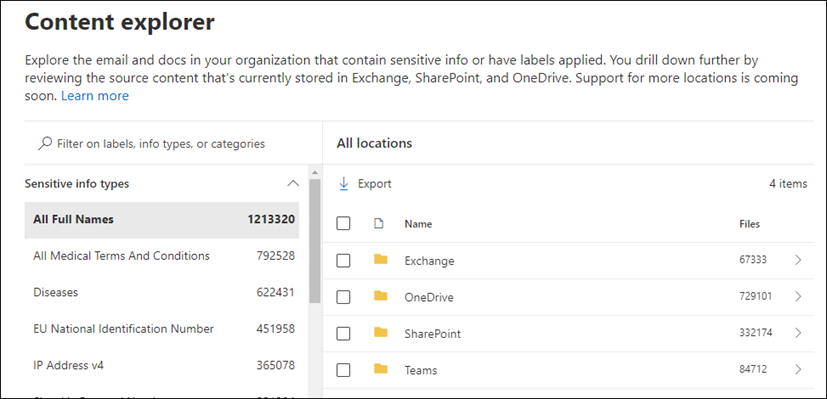

# Sensitive Information Types
[Microsoft Docs: Sensitive Information Types](https://learn.microsoft.com/en-us/microsoft-365/compliance/sensitive-information-type-learn-about?view=o365-worldwide)

- [Exam Goals](#exam-goals)
- [Overview](#overview)
  - [Confidence Levels](#confidence-levels)
  - [Providing Accuracy Feedback](#providing-accuracy-feedback)
  - [Creating Custom Sensitive Information Types](#creating-custom-sensitive-information-types)
- [Exact Data Match (EDM) Sensitive Information Types](#exact-data-match-edm-sensitive-information-types)
  - [Concepts Specific to EDMs](#concepts-specific-to-edms)
    - [Schema](#schema)
    - [Sensitive Information Source Table](#sensitive-information-source-table)
    - [Rule Package](#rule-package)
    - [You Supply Your Own Schema and Data](#you-supply-your-own-schema-and-data)
    - [Primary and Secondary Support Elements](#primary-and-secondary-support-elements)
    - [How Matching Works](#how-matching-works)
    - [Services Supported by EDM](#services-supported-by-edm)
- [Document Fingerprinting](#document-fingerprinting)
  - [How document fingerprinting works](#how-document-fingerprinting-works)
  - [Supported file types](#supported-file-types)
  - [Limitations](#limitations)
  - [Create Fingerprint SIT in Compliance Portal](#create-fingerprint-sit-in-compliance-portal)
    - [Troubleshooting](#troubleshooting)
  - [Create Fingerprint SIT using PowerShell](#create-fingerprint-sit-using-powershell)
    - [Troubleshooting](#troubleshooting-1)
  - [Matching](#matching)
  - [Test a Fingerprint SIT](#test-a-fingerprint-sit)
  - [Validate DLP Fingerprint Functionality](#validate-dlp-fingerprint-functionality)

## Exam Goals
- Identify sensitive information requirements for an organization's data
- Translate sensitive information requirements into built-in or custom sensitive info types
- Create and manage custom sensitive info types
- Create and manage exact data match (EDM) classifiers
- Implement document fingerprinting

## Overview
Identifying and classifying sensitive items is the first step in the Information Protection discipline. Microsoft Purview provides three ways of identifying items:
- Manually by users
- Automated pattern recognition by Sensitive Information Types
- Machine learning

Sensitive Information Types (SIT) are pattern-based classifiers and are used in 
- DLP policies
- Sensitivity labels
- Retention labels
- Insider risk management
- Communication compliance
- Auto-labeling policies
- Microsoft Priva

Fundamental parts of a Sensitive Information Type
- Name
- Description
- Pattern
  - Primary element - can be a regular expression, a keyword list, or a function
  - Supporting element - helps to increase confidence in a match
  - Confidence level - high, medium, or low.  The more supporting evidence the higher the confidence match
  - Proximity - number of characters between primary and supporting element

### Confidence Levels
Matches with a higher confidence level will contain more supporting evidence in close proximity to the primary element. Matches with a lower confidence level contain little or no supporting evidence in close proximity.

Confidence Level Values
- Low: 65
  - Matched items contain the fewest false negatives but the most false positives
- Medium: 75
- High: 85
  - Matched items contain the fewest false positives but the most false negatives

Use high confidence levels patterns with low counts, say 5-10, and low confidence with high confidence matches, say 20 or more.

See [US Social Security Number (SSN)](https://learn.microsoft.com/en-us/microsoft-365/compliance/sit-defn-us-social-security-number?view=o365-worldwide) as an example definition of an SIT.

### Providing Accuracy Feedback
You can view number of SIT matches in the Content Explorer.

You can also provide feedback on trainer classifier accuracy by using the **Match, Not a Match** mechanism. See [Increase trainer accuracy](https://learn.microsoft.com/en-us/microsoft-365/compliance/data-classification-increase-accuracy?view=o365-worldwide)

### Creating Custom Sensitive Information Types
Three methods for creating custom sensitive information types:
- Use the Compliance Center UI
  - Allows for regular expressions, keywords, and keyword dictionaries
- Use Exact Data Match (EDM)
  - EDM-based classification enables you to create a dynamic sensitive information type using a secure database that you can refresh periodically
- Use PowerShell
  - Has more configuration options than the UI

## Exact Data Match (EDM) Sensitive Information Types
- [Documentation](https://learn.microsoft.com/en-us/microsoft-365/compliance/sit-learn-about-exact-data-match-based-sits?view=o365-worldwide)  
- [Accurate data classification using Exact Data Matching](https://microsoft.github.io/ComplianceCxE/resources/files/Configuring%20EDM%20for%20accurate%20classification.pdf)

Exact Data Match enables you to define custom sensitive information types based on values in a database rather than using matches found on generic patterns.

EDM SITs are designed to
- be dynamic and easily refreshed
- result in fewer false-positives
- work with structured sensitive data
- handle sensitive information more securely, not sharing it with anyone, including Microsoft
- be used with several Microsoft cloud services

The database values can be refreshed daily and can contain up to 100 million rows of data

### Concepts Specific to EDMs

#### Schema
The schema is an XML file that defines
- the name of the schema, referred to as the **DataStore**
- the field names that your sensitive information source table contains, e.g. First Name, Last Name, Date of Birth
- Which fields are searchable
- A *configurable match* is one with parameters that modify a search, such as ignoring delimiters and case in searched values

#### Sensitive Information Source Table
Contains values that the EDM SIT will look for.  Contains columns and rows.

#### Rule Package
Every SIT has a rule package. You use a rule package in an EDM SIT to define
- Matches
  - The primary element to be used in the exact lookup
  - Can be a regular expression, a keyword list, a keyword dictionary or a function
- Classification
  - Specifies the SIT type match that triggers an EDM lookup
- Supporting Elements
- Confidence Levels
- Proximity

#### You Supply Your Own Schema and Data
With EDM SITs you are responsible for defining the schema as well as primary and secondary fields that identify sensitive items.

The primary and secondary fields are considered highly sensitive items, so you'll be encrypting them via a hash function. Only the hashed values are uploaded to the service. So your sensitive data is never in the open.

#### Primary and Secondary Support Elements
When you create an EDM SIT you define a *primary field* in the rule package. All content will be searched for the primary element.

EDM requires that the primary element be discoverable through an existing SIT. See [here](https://learn.microsoft.com/en-us/microsoft-365/compliance/sensitive-information-type-entity-definitions?view=o365-worldwide) for a list of existing SITs.

EDM does not require that secondary elements to be based on an existing SIT unless they contain multiple tokens. However, secondary elements do need to be within a certain proximity to the primary element.

#### How Matching Works
EDM works by comparing strings in your documents and emails against values in the sensitive information source table to see if the values int eh scanned content are present in the table. The comparison is done by using one-way hashes.

Tip: Use EDM SITs and predefined SITs together in DLP rules for better detection. Use the EDM SIT with higher confidence levels and the predefined SIT with lower confidence levels.

#### Services Supported by EDM

## Document Fingerprinting
[Microsoft Docs: Document Fingerprinting](https://learn.microsoft.com/en-us/microsoft-365/compliance/document-fingerprinting?view=o365-worldwide)

Document fingerprinting is a Data Loss Protection (DLP) feature that allows you to detect standard forms that are used throughout your organization, making eit easier to protect information.

Document fingerprinting includes the following features:
- DLP can use as a detection method in Exchange, SharePoint, OneDrive, Teams, and Devices
- Can be managed through the Microsoft Purview compliance portal
- Partial matching is supported
- Exact matching is supported
- Improved accuracy detection
- Support for detection in multiple languages

Scenarios
- Government forms
- HIPAA compliance forms
- Employee information forms for HR departments
- Custom forms created specifically for your organization

Ideally, organizations already have an established business practice of using certain forms to transmit sensitive information. To enable detection, upload an empty form to be converted to a document fingerprint. Then set up a corresponding policy. From there, DLP detects documents in outbound mail that match that fingerprint.

### How document fingerprinting works
In the same way that a person's fingerprints have unique patterns, documents have unique word patterns. When you upload a file, DLP identifies the unique word pattern in the document, creates a document fingerprint based on that pattern, and uses that document fingerprint to detect outbound documents containing the same pattern.

In the example above, the patent template contains blank fields "Patent Title", "Inventors", and "Description", along with descriptions for each field&mdash;that's the word pattern. When you upload the template, DLP converts the word pattern into a document fingerprint, which is a small Unicode XML file containing a unique hash value that represents the original text. The fingerprint is saved as a data classification in Active Directory. The original document isn't itself stored; only the hash value is stored. The patent fingerprint then becomes a Sensitive Information Type (SIT) that you can associate with a DLP policy. 

### Supported file types
Document fingerprinting supports the same type of files that are supported by mail transport rules. Neither mail flow rules nor document fingerprinting supports the **.dotx** file type. See [here](https://learn.microsoft.com/en-us/exchange/security-and-compliance/mail-flow-rules/inspect-message-attachments#supported-file-types-for-mail-flow-rule-content-inspection) for supported file types.

### Limitations
Document fingerprinting doesn't work for
* Password protected files
* Files that contain images only
* Documents that don't contain all the text from the original form used to create the fingerprint
* Files larger than 4MB

To use document fingerprinting with devices, **Advanced fingerprinting** must be turned on.

Fingerprints are stored in a separate rule pack, which has a maximum size limit of 150KB. Given this limit, you can create approximately 50 fingerprints per tenant.

Fingerprint SITs are only supported for the following DLP locations:
- Exchange
- SharePoint sites
- OneDrive accounts
- Teams chat and channel messages
- Devices

Fingerprint SITs do not work for the other DLP locations, including
- Microsoft Defender for Cloud Apps
- On-premises repositories
- Power BI

You will get an error message if you select unsupported locations:

Here are the supported locations:

### Create Fingerprint SIT in Compliance Portal
In the Microsoft Purview compliance portal, select **Data Classification > Classifiers**.  Then choose **Sensitive info types > Create Fingerprint based SIT**.

#### Troubleshooting
You receive **Client Error** message when creating a new fingerprint-based SIT. 

Solution: Wait a minute and then click **Next**.

### Create Fingerprint SIT using PowerShell
Use [New-DlpSensitiveInformationType](https://learn.microsoft.com/en-us/powershell/module/exchange/new-dlpsensitiveinformationtype?view=exchange-ps) to create the fingerprint SIT. The documentation doesn't mention the `FileData` parameter, but it's there.

Refer to [New-DlpFingerprint](https://learn.microsoft.com/en-us/powershell/module/exchange/new-dlpfingerprint?view=exchange-ps) for requirements in using the `FileData` parameter.  

#### Troubleshooting
You receive the **Fingerprint Rule Package found in EXO but not EOP** message.  

Solution: wait a few minutes and try again

### Matching
For partial matching specify percentage values for low, medium, and high. You can do this in the portal or using the `ThresholdConfig` parameter in PowerShell.

Exact matching of a document fingerprint matches only files that have exactly the same text as the fingerprint.  If the file has even a small deviation from the fingerprint, it will not be detected.

Exact matching can only be configured through PowerShell using the `IsExact` parameter. This parameter is available through `Set-DlpSensitiveInformationType` but is undocumented. I ran into issues with it:

However, I was able to use the `Exact` parameter when creating the fingerprint SIT:

### Test a Fingerprint SIT
You can test the fingerprint SIT after creation.

However, initial testing results don't provide useful match information. This could be specific to fingerprint SITs.

You can also test in PowerShell using [`Test-DataClassification`](https://learn.microsoft.com/en-us/powershell/module/exchange/test-dataclassification?view=exchange-ps):

Similar unuseful match results for PowerShell.  Again, could be due to fingerprint SIT vs regular SIT.

### Validate DLP Fingerprint Functionality
From an existing DLP policy use `New-DlpComplianceRule` to add a rule that blocks the fingerprint SIT.

The user will receive an NDR when attempting to share the file over email:

The message trace indicates the email was blocked due to the **Patent Sharing Restriction** DLP rule:

Alternatively, you can use a mail flow rule in Exchange to block the fingerprint SIT.