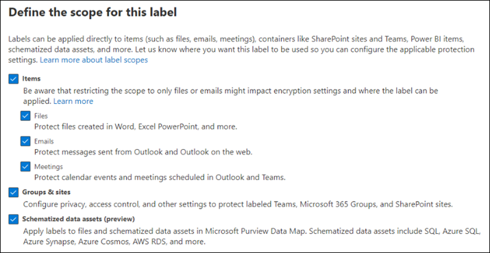
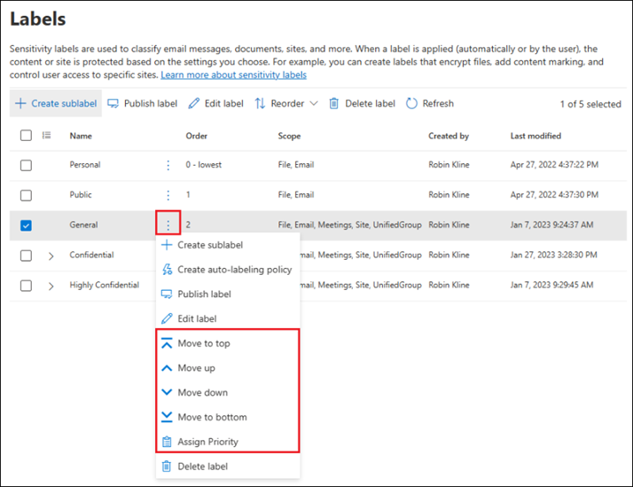
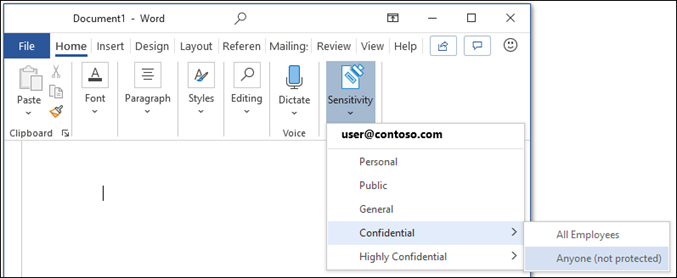
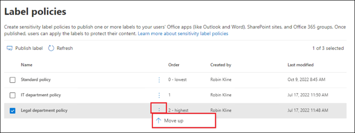
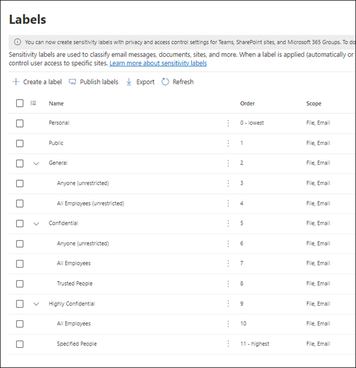
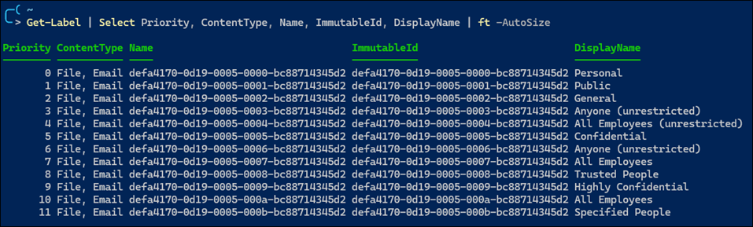

# Sensitivity Labels

## Contents
- [Contents](#contents)
- [Links](#links)
- [Exam Goals](#exam-goals)
- [Licensing](#licensing)
- [Overview](#overview)
  - [Label Scopes](#label-scopes)
  - [Label Priority (Order Matters)](#label-priority-order-matters)
  - [Sublabels (Grouping Labels)](#sublabels-grouping-labels)
  - [Editing or Deleting a Sensitivity Label](#editing-or-deleting-a-sensitivity-label)
  - [What Label Policies Can Do](#what-label-policies-can-do)
  - [Label Policy (Priority Matters)](#label-policy-priority-matters)
  - [Built-in Labeling for the Office Apps](#built-in-labeling-for-the-office-apps)
  - [Defining Label Taxonomy](#defining-label-taxonomy)
- [Roles and Permissions](#roles-and-permissions)
  - [Manage the AIP Super User Feature](#manage-the-aip-super-user-feature)
- [Define and Create Sensitivity Labels](#define-and-create-sensitivity-labels)
- [Use PowerShell to manage Sensitivity Labels](#use-powershell-to-manage-sensitivity-labels)
  - [Install the AIP PowerShell Module](#install-the-aip-powershell-module)
  - [Connect to the AIP Service](#connect-to-the-aip-service)
  - [Create a Sensitivity Label](#create-a-sensitivity-label)
  - [Create a Sensitivity Label Policy](#create-a-sensitivity-label-policy)
  - [Getting Sensitivity Labels and Policies](#getting-sensitivity-labels-and-policies)
  - [Removing Sensitivity Labels and Policies](#removing-sensitivity-labels-and-policies)

## Links
- [Learn about sensitivity labels](https://learn.microsoft.com/en-us/microsoft-365/compliance/sensitivity-labels?view=o365-worldwide)
- [Create a well-designed data classification framework](https://learn.microsoft.com/en-us/compliance/assurance/assurance-create-data-classification-framework)
- [Microsoft Information Protection SDK: Classification label concepts](https://learn.microsoft.com/en-us/information-protection/develop/concept-classification-labels)
- [Microsoft roadmap for sensitivity labels](https://www.microsoft.com/en-us/microsoft-365/roadmap?filters=Worldwide%20(Standard%20Multi-Tenant)&searchterms=label)
- [Microsoft Purview CxE](https://microsoft.github.io/ComplianceCxE/)
- [Guidance on external collaboration with sensitivity labels](https://techcommunity.microsoft.com/t5/security-compliance-and-identity/secure-external-collaboration-using-sensitivity-labels/ba-p/1680498)
- [End-user documentation for sensitivity labels](https://learn.microsoft.com/en-us/microsoft-365/compliance/get-started-with-sensitivity-labels?view=o365-worldwide#end-user-documentation-for-sensitivity-labels)
- [Licensing for sensitivity labels](https://learn.microsoft.com/en-us/office365/servicedescriptions/microsoft-365-service-descriptions/microsoft-365-tenantlevel-services-licensing-guidance/microsoft-365-security-compliance-licensing-guidance#microsoft-purview-information-protection-sensitivity-labeling)
- [Partner solutions that integrate with Microsoft Information Protection](https://techcommunity.microsoft.com/t5/security-compliance-and-identity/microsoft-information-protection-showcases-integrated-partner/ba-p/262657)

## Exam Goals
- Implement roles and permissions for administering sensitivity labels
- Define and create sensitivity labels
- Configure and manage sensitivity label policies
- Configure auto-labeling policies for sensitivity labels
- Monitor data classification and label usage by using Content explorer, Activity explorer, and audit search
- Apply bulk classification to on-premises data by using the Microsoft Purview Information Protection scanner
- Manage protection settings and marking for applied sensitivity labels

## Licensing
Reference
- [Microsoft Purview Information Protection - Sensitivity Labeling](https://learn.microsoft.com/en-us/office365/servicedescriptions/microsoft-365-service-descriptions/microsoft-365-tenantlevel-services-licensing-guidance/microsoft-365-security-compliance-licensing-guidance#microsoft-purview-information-protection-sensitivity-labeling)

In general, an E5 license is required for each user who accesses protected documents in locations that use automatic labeling. An E3 license is required when using manual labeling.  
  
## Overview
To collaborate with others both inside and outside the organization, content no longer stays behind a firewall&mdash;it can roam everywhere across devices, apps, and services. When this data roams, you want it to be protected in a way that meets the org's business and compliance policies.

Sensitivity labels let you classify and protect your organization's data, while making sure that user productivity and their ability to collaborate isn't hindered.

Sensitivity labels can be applied manually using the [Sensitivity Bar](https://learn.microsoft.com/en-us/microsoft-365/compliance/sensitivity-labels-office-apps?view=o365-worldwide#sensitivity-bar) in the Office apps. Sensitivity labels also have [PDF support](https://learn.microsoft.com/en-us/microsoft-365/compliance/sensitivity-labels-office-apps?view=o365-worldwide#pdf-support).

Use cases for sensitivity labels:
- Provide protection settings that include encryption and content markings
- Protect content in Office apps across different platforms and devices
- Protect content in third-party apps and services
  - e.g. in Microsoft Defender for Cloud Apps, you can protect content in SalesForce, Box, or DropBox
- Protect containers, e.g. Teams, M365 Groups, and SharePoint sites
- Protect meetings and chat
- Extend sensitivity labels to Power BI
- Extend sensitivity labels to Microsoft Purview Data Map
  - these are files and schematized assets that include SQL, Azure SQL, Azure Synapse, Azure Cosmos DB, and AWS RDS
- Extend sensitivity labels to third-party apps and services using the [Microsoft Information Protection SDK](https://learn.microsoft.com/en-us/information-protection/develop/overview)
- Label content without using any protection settings
  - Helps to provide a visual mapping of your organization's data sensitivity
  - You can use labels to generate reports; can always apply protection later

See [Common scenarios for sensitivity labels](https://learn.microsoft.com/en-us/microsoft-365/compliance/get-started-with-sensitivity-labels?view=o365-worldwide#common-scenarios-for-sensitivity-labels)

A sensitivity label is stored in clear text in the metadata for files and emails. This allows third-party apps and services to read it and apply their own protective actions. It also means the label stays with the content, no matter where it's stored or saved.

Sensitivity labels can do the following things:
- Encrypt: documents, emails, and meeting invites
- Mark content: watermarks, headers, and footers
- Protect content in containers: SharePoint sites, M365 Groups, Teams
- Apply the label automatically to files and emails, or recommend a label
- Set the default sharing link type, e.g. sharing links inherit permissions from the label

See [Manage sensitivity labels in Office apps](https://learn.microsoft.com/en-us/microsoft-365/compliance/sensitivity-labels-office-apps?view=o365-worldwide) for more configuration options.

### Label Scopes
When you create a sensitivity label, you're asked to configure the label's scope, which determines two things:
- Which label settings you can configure for that label
- The availability of the label to apps and services, which includes whether users can see and select the label

The scope configuration allows you to have sensitivity labels that are just for documents and emails, and can't be selected for containers. Alternatively, you can have labels just for containers and not for documents and emails.



See [Use sensitivity labels with Teams, groups, and sites](https://learn.microsoft.com/en-us/microsoft-365/compliance/sensitivity-labels-teams-groups-sites?view=o365-worldwide#how-to-enable-sensitivity-labels-for-containers-and-synchronize-labels) for enabling scopes for containers.

See [Labeling in Microsoft Purview](https://learn.microsoft.com/en-us/azure/purview/create-sensitivity-label) for applying labels to Azure assets in Microsoft Purview Data Map.

### Label Priority (Order Matters)
When you create sensitivity labels, they appear in a list on the **Information Protection > Labels** page. In this list, the order of the labels is important because it reflects their priority. You want your most restrictive sensitivity label, such as Highly Confidential, to appear at the bottom of your list, and your least restrictive label to appear at the top.

You can apply just one sensitivity label to an item, such as an email, document, or container. If you set an option that requires your users to provide a justification for changing a label to lower sensitivity, the order of this list identifies the lower sensitivity.  **However, this option does not apply to sublabels that share the priority of their parent label.**

The ordering of sublabels is used with automatic labeling, though. When you configure auto-labeling policies, multiple matches can result for more than one label. Then, the last sensitive label is selected, and then if applicable, the last sublabel. When you configure sublabels themselves (rather than auto-labeling policies) for automatic labeling, the behavior is a little different when sublabels share the same parent label. For example, a sublabel configured for automatic labeling is preferred over a sublabel configured for recommended labeling. See [How multiple conditions are evaluated when they apply to more than one label](https://learn.microsoft.com/en-us/microsoft-365/compliance/apply-sensitivity-label-automatically?view=o365-worldwide#how-multiple-conditions-are-evaluated-when-they-apply-to-more-than-one-label)



### Sublabels (Grouping Labels)
With sublabels, you can group one or more labels below a parent label that a user sees in an Office app. Sublabels are simply a way to present labels to users in logical groups. Sublabels don't inherit any settings from their parent label, except for their label color. When you publish a sublabel for a user, that user can then apply that sublabel to content and containers, but can't apply just the parent label.

Don't choose a parent label as the default label, or configure a parent label to be automatically applied (or recommended). If you do, the parent label can't be applied.



### Editing or Deleting a Sensitivity Label
If you delete a sensitivity label from the admin portal, the label isn't automatically removed from content, and any protection settings continue to be enforced on content that had that label applied.

If you edit a sensitivity label, the version of the label that was applied to content is what's enforced on that content.

### What Label Policies Can Do
After you create your sensitivity labels, you need to publish them to make them available to people and services in your organization. The sensitivity labels can then be applied to Office documents and emails, and other items that support sensitivity labels.

Unlike retention labels, which are published to locations such as Exchange mailboxes, sensitivity labels are published to users or groups.

When you configure a label policy, you can:
- **Choose which users and groups see the labels**:  Labels can be published to any specific user or email-enabled security group, distribution group, or M365 Group (which can have dynamic membership)
- **Specify a default label** for unlabeled documents, email and meeting invites, new containers, and Power BI content. Consider using a default label to set a base level of protection settings that you want applied to all of your content. However, without user training, this setting can result in accurate labeling. It's usually not a good idea to set encryption as a default label to documents. As an excample, in the need to share externally, many orgs may not have apps that support the encryption, or they might not use an account that can be authorized. See [Sharing encrypted documents with external users](https://learn.microsoft.com/en-us/microsoft-365/compliance/sensitivity-labels-office-apps?view=o365-worldwide#sharing-encrypted-documents-with-external-users)
- **Require a justification for changing a label**: If a user tries to remove a label or replace it with a label that has a lower-order priority, you can require the user provide a justification to perform this action. Administrators can read the justification reason in Activity Explorer.
- **Require users to apply a label** for different types of items and the containers that support sensitivity labels. This is also known as mandatory labeling. Consider using this option to increase your labeling coverage. However, without training, this setting can lead to inaccurate labeling and will frustrate your users. For containers, a label must be assigned at the time the group or site is created. 
- **Provide help link to a custom help page**. 

After you create a label policy, allow up to 24 hours for the changes to replicate through the org. 

There's no limit to the number of labels you can create and publish, with one exception: If the label applies encryption that specifies the users and permissions, there's a maximum of 500 labels per tenant. However, as a best practice to lower admin overhead and reduce complexity, try to keep the number of labels to a minimum. Real-world deployments have proved effectiveness to be noticeably reduced when users have more than 5 main labels or more htan 5 sublabels per main label.

After you create a label policy, allow up to 24 hours for the changes to replicate through the org. 

There's no limit to the number of labels you can create and publish, with one exception: If the label applies encryption that specifies the users and permissions, there's a maximum of 500 labels per tenant. However, as a best practice to lower admin overhead and reduce complexity, try to keep the number of labels to a minimum. Real-world deployments have proved effectiveness to be noticeably reduced when users have more than 5 main labels or more than 5 sublabels per main label.

### Label Policy (Priority Matters)
You make your sensitivity labels available to users by publishing them in a sensitivity policy that appears in a list on the **Label Policies** page. Just like sensitivity labels, the order of the sensitivity label policies is important because it reflects their priority: The label policy with the lowest priority is shown at the top of the list with the lowest order number, and the label policy with the highest priority is shown at the bottom of the list with the highest priority number. 

A label policy consists of:
* A set of labels 
* The users and groups that will be assigned the policy with labels
* The scope of the policy and policy settings for that scope (such as default label)

You can include a user in multiple label policies, and the user will get all the sensitivity labels and settings from those policies. If there's a conflict in settings from multiple policies, the settings from the policy with the highest priority (highest order number) is applied. In other words, the highest priority wins for each setting.

If you're not seeing the label policy setting behavior that you expect for a user or group, check the order of the sensitivity label policies. You might need to move a policy down. 



### Built-in Labeling for the Office Apps
Built-in labels (as opposed to labels provided by the soon-to-be-retired AIP client) require a subscription edition of Office apps. Standalone editions of Office aren't supported. See [here](https://learn.microsoft.com/en-us/microsoft-365/compliance/sensitivity-labels-aip?view=o365-worldwide#benefits-of-using-built-in-labeling-for-office-apps-vs-the-aip-add-in)

Here's a list of features supported by built-in labeling for Office apps:
* Intelligent classification services for automatic and recommended labeling, i.e. trainable classifiers, exact data match, and named entities
* Sensitivity bar that's integrated into existing user workflows
* PDF support
* Protect meeting invites, with their attachments and responses
* For custom permissions, the ability to assign different permissions to users and groups
* Encrypt-only emails
* Support for account switching
* Users can't disable labeling

See [here](https://learn.microsoft.com/en-us/microsoft-365/compliance/sensitivity-labels-aip?view=o365-worldwide#features-not-planned-to-be-supported-by-built-in-labeling-for-office-apps) for a list of features Microsoft does not plan to support:
- Application of labels to Office 97-2003 formats, e.g. .doc files
- Local usage logging to the Windows Event log
- Permanently disconnected computers
- Standalone editions of Office, i.e. "Perpetual Office", rather than subscription-based Office

### Defining Label Taxonomy
Defining the right label taxonomy and protection policies is the most critical step in a Microsoft Purview Information Protection deployment. Labels will be the interface for users to understand content sensitivity, how it matches company policies, and will be the primary input for users to flag content that needs to be protected.

A good label taxonomy needs to meet business and/or regulatory needs, be intuitively understandable by users, provide good policy tips, and be easy to use. It should not prevent users from doing their jobs, while at the same time help prevent instances of data leakage or misuse and address compliance requirements.


See [Create a well-designed data classification framework](https://learn.microsoft.com/en-us/compliance/assurance/assurance-create-data-classification-framework) for further guidance.

Best Practices
- Start small and keep it simple.  
-  Define labels that will last a long time
- Start with what threats you are trying to prevent, e.g. users from accidentally putting sensitive data where unauthorized users can view it. Based on those requirements, define the minimal controls that must be there to ensure those scenarios don't happen.
- Use label names that intuitively resonate with your users. Don't use acronyms. Use short, meaningful words, e.g. "Confidential", "Secret"
- Avoid terms that may be ambiguous. Don't use terms where not all users might agree on whether "Confidential" or "Secret" is the most sensitive label; use "Confidential" and "Highly Confidential" instead.
-  Use sublabels with intent. Labels are used to represent the actual sensitivity  of the content that is labeled. Sublabels represent variations in the protection or the scope of the content. 
-  Compartmentalize sparingly. Using sublabels to give rights to people in specific departments is good practice, but you should use this capability in moderation. Limit the number of sublabels for departments to a small number and stick with it.
- Involve different teams to review your proposed label taxonomy. Defining labels is not an IT security task alone, and early feedback will help you define a label taxonomy that will work for a long time

See the full list and descriptions [here](https://microsoft.github.io/ComplianceCxE/dag/mip-dlp/)

Eligible customers (new and existing) can activate a set of default protection labels and policies. See [here](https://learn.microsoft.com/en-us/microsoft-365/compliance/mip-easy-trials?view=o365-worldwide#default-sensitivity-labels).



## Roles and Permissions
- Reference
  - [Permissions required to create and manage sensitivity labels](https://learn.microsoft.com/en-us/microsoft-365/compliance/get-started-with-sensitivity-labels?view=o365-worldwide#permissions-required-to-create-and-manage-sensitivity-labels)

The following role groups have permissions for managing sensitivity labels:
- Organization Management*
- Compliance Administrator*
- Compliance Data Administrator*
- Information Protection*
- Information Protection Admins*
- Information Protection Analysts
- Information Protection Investigators
- Information Protection Readers

Note:  
  - Items with an asterisk (*) have the ability to activate and manage the AIP super user feature (need to confirm this)

The **Information Protection** role group is the most privileged of this bunch and has the following roles: 
- Information Protection Admin - Create, edit, and delete DLP policies, sensitivity labels and their policies, and all classifier types. Manage endpoint DLP settings and simulation mode for auto-labeling policies.
- Data Classification Content Viewer - Allow viewing in-place rendering of files in content explorer.
- Data Classification List Viewer - Allow viewing list of files in content explorer.
- Information Protection Analyst - Access and manage DLP alerts and activity explorer. View-only access to DLP policies, sensitivity labels and their policies, and all classifier types.
- Information Protection Investigator - Access and manage DLP alerts, activity explorer, and content explorer. View-only access to DLP policies, sensitivity labels and their policies, and all classifier types.
- Information Protection Reader - View-only access to reports for DLP policies and sensitivity labels and their policies.
- Purview Evaluation Administrator - Used to create and manage M365 Purview Evaluation lab

The **Information Protection Admins** role group has only the following roles:
- Information Protection Admin - Create, edit, and delete DLP policies, sensitivity labels and their policies, and all classifier types. Manage endpoint DLP settings and simulation mode for auto-labeling policies.
- Purview Evaluation Administrator - Used to create and manage M365 Purview Evaluation lab

The **Information Protection Investigators** role group has the following roles:  
- Data Classification Content Viewer - Allow viewing in-place rendering of files in content explorer.
- Data Classification List Viewer - Allow viewing list of files in content explorer.
- Information Protection Analyst - Access and manage DLP alerts and activity explorer. View-only access to DLP policies, sensitivity labels and their policies, and all classifier types.
- Information Protection Investigator - Access and manage DLP alerts, activity explorer, and content explorer. View-only access to DLP policies, sensitivity labels and their policies, and all classifier types.
- Purview Evaluation Administrator - Used to create and manage M365 Purview Evaluation lab

The **Information Protection Analysts** role group has the following roles:
- Data Classification List Viewer - Allow viewing list of files in content explorer.
- Information Protection Analyst - Access and manage DLP alerts and activity explorer. View-only access to DLP policies, sensitivity labels and their policies, and all classifier types.
- Purview Evaluation Administrator - Used to create and manage M365 Purview Evaluation lab

The **Information Protection Readers** role group has the following role:  
- Information Protection Reader - View-only access to reports for DLP policies and sensitivity labels and their policies.

Alternatively you can create a new role group and add the **Sensitivity Label Administrator** role.  For a read-only group, use **Sensitivity Label Reader**. 

### Manage the AIP Super User Feature
See https://learn.microsoft.com/en-us/azure/information-protection/configure-super-users

## Define and Create Sensitivity Labels
Reference
- [Create and configure sensitivity labels and their policies](https://learn.microsoft.com/en-us/microsoft-365/compliance/create-sensitivity-labels?view=o365-worldwide)

By default, tenants do not have any labels, so you must create them. Sensitivity labels are provided using two steps:
1. Create the label
2. Publish the label to users using a label policy

See [here](https://learn.microsoft.com/en-us/microsoft-365/compliance/create-sensitivity-labels?view=o365-worldwide#create-and-configure-sensitivity-labels) for the process.  


## Use PowerShell to manage Sensitivity Labels

### Install the AIP PowerShell Module
### Connect to the AIP Service
### Create a Sensitivity Label
### Create a Sensitivity Label Policy

### Getting Sensitivity Labels and Policies
Use `Get-Label` to get a list of all sensitivity labels in your tenant. Or use this command:  
```powershell
Get-Label | Select Priority, ContentType, Name, ImmutableId, DisplayName | ft -AutoSize
```



You can use the `-Identity` parameter to get a specific label. However, you must use the label's GUID or Name. **You cannot use the label's display name.** The label's GUID is mapped to the `ImmutableId` property. In the case of Microsoft's default labels, the ImmutableId is the same as the label's Name (see above). However, these values will be different for custom labels that you create.


### Removing Sensitivity Labels and Policies
To remove a sensitivity label, you must first remove the label from all label policies. Use the following commands to remove a label from a label policy:

```powershell
function Remove-LabelFromPolicy {
    param (
        [Parameter(Mandatory=$true)]
        [string]$LabelName, # The Name or ImmutableId of the label, not the Display Name
        [Parameter(Mandatory=$true)]
        [string]$LabelPolicyName
    )
    $label = Get-Label -Name $LabelName
    Set-LabelPolicy -Identity $LabelPolicyName -RemoveLabel $label
}
```
