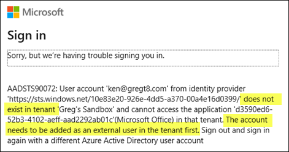

# Sensitivity Labels in Microsoft Purview Information Protection

- [Helpful Links](#helpful-links)
- [Licensing for Sensitivity Labels](#licensing-for-sensitivity-labels)
- [Overview](#overview)
  - [Labels, Sublabels, and Label Scopes](#labels-sublabels-and-label-scopes)
  - [Container Support for Sensitivity Labels](#container-support-for-sensitivity-labels)
  - [Define and Create Sensitivity Labels](#define-and-create-sensitivity-labels)
  - [Editing or Deleting a Sensitivity Label](#editing-or-deleting-a-sensitivity-label)
  - [Built-in Labeling for the Office Apps](#built-in-labeling-for-the-office-apps)
  - [Label Taxonomy](#label-taxonomy)
- [Roles and Permissions in Microsoft Purview Compliance](#roles-and-permissions-in-microsoft-purview-compliance)
- [External Access](#external-access)
  - [Azure RMS for Individuals](#azure-rms-for-individuals)
    - [Addressing MFA Requirements for External Users](#addressing-mfa-requirements-for-external-users)
    - [Trust MFA Registrations from Other Tenants](#trust-mfa-registrations-from-other-tenants)
    - [Provision Guest Accounts in Your Tenant](#provision-guest-accounts-in-your-tenant)
    - [Configure an Exception for the Azure Information Protection Application](#configure-an-exception-for-the-azure-information-protection-application)
  - [Application Support for Accessing Protected Documents](#application-support-for-accessing-protected-documents)
- [Manage Protected Document Attributes](#manage-protected-document-attributes)
  - [Determine The Owner of a Protected Document](#determine-the-owner-of-a-protected-document)
    - [Azure Information Protection Unified Labeling Client](#azure-information-protection-unified-labeling-client)
    - [Get-AIPFileStatus Cmdlet](#get-aipfilestatus-cmdlet)
  - [Change the Owner of a Protected Document](#change-the-owner-of-a-protected-document)
  - [Remove Protection from a Document](#remove-protection-from-a-document)
  - [Remove Encryption from Document in SharePoint Online](#remove-encryption-from-document-in-sharepoint-online)
  - [Manage the Azure Information Protection Service](#manage-the-azure-information-protection-service)
- [Track and Revoke Documents](#track-and-revoke-documents)
    - [Track Document Access](#track-document-access)
    - [Revoke Document Access](#revoke-document-access)
- [Audit Label Access and Usage](#audit-label-access-and-usage)
  - [Activity Explorer](#activity-explorer)
  - [Auditing Framework](#auditing-framework)
  - [Microsoft Purview Compliance Audit Log Search](#microsoft-purview-compliance-audit-log-search)
  - [Search-UnifiedAuditLog Cmdlet](#search-unifiedauditlog-cmdlet)
  - [Microsoft Defender for Cloud Apps](#microsoft-defender-for-cloud-apps)
- [Protecting SharePoint Sites, Teams, and Groups with Sensitivity Labels](#protecting-sharepoint-sites-teams-and-groups-with-sensitivity-labels)
  - [Applying a Sensitivity Label to Content Automatically](#applying-a-sensitivity-label-to-content-automatically)
  - [Enable PDF Support](#enable-pdf-support)
- [Use PowerShell to manage Sensitivity Labels](#use-powershell-to-manage-sensitivity-labels)
  - [Get Info on Sensitivity Labels and Policies](#get-info-on-sensitivity-labels-and-policies)
  - [Create a Sensitivity Label](#create-a-sensitivity-label)
  - [Use a Custom Color for a Sensitivity Label](#use-a-custom-color-for-a-sensitivity-label)
  - [Create a Label Policy](#create-a-label-policy)
  - [Add a Sensitivity Label to a Label Policy](#add-a-sensitivity-label-to-a-label-policy)
  - [Set the Parent Label for a Sensitivity Label](#set-the-parent-label-for-a-sensitivity-label)
  - [Remove a Sensitivity Label from a Label Policy](#remove-a-sensitivity-label-from-a-label-policy)
  - [Remove a Label Policy](#remove-a-label-policy)
  - [Remove a Sensitivity Label](#remove-a-sensitivity-label)
  - [Get the Relationship Between a Label and an Azure RMS Template](#get-the-relationship-between-a-label-and-an-azure-rms-template)
  - [Back Up an Azure RMS Template](#back-up-an-azure-rms-template)
  - [Remove an RMS Template](#remove-an-rms-template)
  - [Restore an RMS Template](#restore-an-rms-template)

## Helpful Links
- [Learn about sensitivity labels](https://learn.microsoft.com/en-us/microsoft-365/compliance/sensitivity-labels?view=o365-worldwide)
- [Create a well-designed data classification framework](https://learn.microsoft.com/en-us/compliance/assurance/assurance-create-data-classification-framework)
- [Microsoft Information Protection SDK: Classification label concepts](https://learn.microsoft.com/en-us/information-protection/develop/concept-classification-labels)
- [Microsoft roadmap for sensitivity labels](https://www.microsoft.com/en-us/microsoft-365/roadmap?filters=Worldwide%20(Standard%20Multi-Tenant)&searchterms=label)
- [Microsoft Purview CxE](https://microsoft.github.io/ComplianceCxE/)
- [Guidance on external collaboration with sensitivity labels](https://techcommunity.microsoft.com/t5/security-compliance-and-identity/secure-external-collaboration-using-sensitivity-labels/ba-p/1680498)
- [End-user documentation for sensitivity labels](https://learn.microsoft.com/en-us/microsoft-365/compliance/get-started-with-sensitivity-labels?view=o365-worldwide#end-user-documentation-for-sensitivity-labels)
- [Licensing for sensitivity labels](https://learn.microsoft.com/en-us/office365/servicedescriptions/microsoft-365-service-descriptions/microsoft-365-tenantlevel-services-licensing-guidance/microsoft-365-security-compliance-licensing-guidance#microsoft-purview-information-protection-sensitivity-labeling)
- [Partner solutions that integrate with Microsoft Information Protection](https://techcommunity.microsoft.com/t5/security-compliance-and-identity/microsoft-information-protection-showcases-integrated-partner/ba-p/262657)
- [Unified Labeling Support Tool](https://github.com/microsoft/UnifiedLabelingSupportTool) - PowerShell module for troubleshooting sensitivity labels and Azure RMS templates
- [AIP Audit Export](https://github.com/Azure-Samples/Azure-Information-Protection-Samples/tree/master/AIP-Audit-Export) - Export labeling events to Log Analytics
- [Migration Playbook for Built-in Labeling](https://microsoft.github.io/ComplianceCxE/playbooks/AIP2MIP/CompareAIP2MIP/)

## Licensing for Sensitivity Labels
The following licenses are required for using Information Protection features:
- An E5 license is required for each user who accesses protected documents in locations that use automatic labeling. 
- An E3 license is required when using manual labeling. Labeling by using a default label is considered manual labeling, as the user has the option to accept or change the label. By default, information protection features are applied at the tenant level for all users within the tenant.
- No license is necessary for someone who only opens and accesses the content in protected files.

See [Microsoft Licensing Guidance: Purview Information Protection](https://learn.microsoft.com/en-us/office365/servicedescriptions/microsoft-365-service-descriptions/microsoft-365-tenantlevel-services-licensing-guidance/microsoft-365-security-compliance-licensing-guidance#microsoft-purview-information-protection-sensitivity-labeling)

  
## Overview
Sensitivity labels enable you to protect files and containers (Teams, SharePoint, OneDrive) from unauthorized access. Sensitivity labels can be applied manually using the [Sensitivity Bar](https://learn.microsoft.com/en-us/microsoft-365/compliance/sensitivity-labels-office-apps?view=o365-worldwide#sensitivity-bar) in the Office apps. Sensitivity labels also have [PDF support](https://learn.microsoft.com/en-us/microsoft-365/compliance/sensitivity-labels-office-apps?view=o365-worldwide#pdf-support). See [Common scenarios for sensitivity labels](https://learn.microsoft.com/en-us/microsoft-365/compliance/get-started-with-sensitivity-labels?view=o365-worldwide#common-scenarios-for-sensitivity-labels). A sensitivity label is stored in clear text in the metadata for files and emails. This allows third-party apps and services to read it and apply their own protective actions. It also means the label stays with the content, no matter where it's stored or saved.

### Labels, Sublabels, and Label Scopes
When you create sensitivity labels, they appear in a list on the **Information Protection > Labels** page in Microsoft Purview Compliance (https://compliance.microsoft.com). In this list, the order of the labels is important because it reflects their priority. You want your most restrictive sensitivity label, such as Highly Confidential, to appear at the bottom of your list, and your least restrictive label to appear at the top.

You can apply just one sensitivity label to an item, such as an email, document, or container. If you set an option that requires your users to provide a justification for changing a label to lower sensitivity, the order of this list identifies the lower sensitivity. However, users are not required to provide justification when changing to a lower priority *within a sublabel*. 

With sublabels, you can group one or more labels below a parent label that a user sees in an Office app. Sublabels are simply a way to present labels to users in logical groups. Sublabels don't inherit any settings from their parent label, except for their label color. When you publish a sublabel for a user, that user can then apply that sublabel to content and containers, but can't apply just the parent label. Don't choose a parent label as the default label, or configure a parent label to be automatically applied (or recommended). If you do, the parent label can't be applied.

The ordering of sublabels is used with automatic labeling. When you configure auto-labeling policies, multiple matches can result for more than one label. Then, the last sensitive label is selected, and then if applicable, the last sublabel. When you configure sublabels themselves (rather than auto-labeling policies) for automatic labeling, the behavior is a little different when sublabels share the same parent label. For example, a sublabel configured for automatic labeling is preferred over a sublabel configured for recommended labeling. See [How multiple conditions are evaluated when they apply to more than one label](https://learn.microsoft.com/en-us/microsoft-365/compliance/apply-sensitivity-label-automatically?view=o365-worldwide#how-multiple-conditions-are-evaluated-when-they-apply-to-more-than-one-label)

When you create a sensitivity label, you're asked to configure the label's scope, which determines two things:
- Which label settings you can configure for that label
- The availability of the label to apps and services, which includes whether users can see and select the label

See [Learn about sensitivity labels](https://learn.microsoft.com/en-us/purview/sensitivity-labels?view=o365-worldwide)

### Container Support for Sensitivity Labels
Containers include Teams, SharePoint sites, and Microsoft 365 Groups. Sensitivity labels can be applied to these containers, but the labels do not apply to the files within the containers. To protect files within Teams and SharePoint sites you must apply sensitivity labels to the files themselves (either manually or automatically) or to the SharePoint document library.


See [Use sensitivity labels with Teams, groups, and sites](https://learn.microsoft.com/en-us/microsoft-365/compliance/sensitivity-labels-teams-groups-sites?view=o365-worldwide#how-to-enable-sensitivity-labels-for-containers-and-synchronize-labels) for enabling scopes for containers.

### Define and Create Sensitivity Labels
By default, tenants do not have any labels, so you must create them. Sensitivity labels are provided using two steps:
1. Create the label
2. Publish the label to users using a label policy

Per [here](https://learn.microsoft.com/en-us/microsoft-365/compliance/create-sensitivity-labels?view=o365-worldwide#when-to-expect-new-labels-and-changes-to-take-effect), allow up to 24 hours for labels and their settings to become available.  


See [Create and configure sensitivity labels and their policies](https://learn.microsoft.com/en-us/microsoft-365/compliance/create-sensitivity-labels?view=o365-worldwide) for more info.

### Editing or Deleting a Sensitivity Label
If you delete a sensitivity label from the admin portal, the label isn't automatically removed from content, and any protection settings continue to be enforced on content that had that label applied. However, some caveats apply. See [Removing and deleting labels](https://learn.microsoft.com/en-us/microsoft-365/compliance/create-sensitivity-labels?view=o365-worldwide#removing-and-deleting-labels) for more info.

### Built-in Labeling for the Office Apps
A subscription edition of Office apps is required to use sensitivity labels. Standalone/perpetual editions of Office aren't supported.

See [here](https://learn.microsoft.com/en-us/purview/sensitivity-labels-aip?view=o365-worldwide#features-supported-only-by-built-in-labeling-for-office-apps) for a list of features supported by built-in labeling for Office apps:
* Intelligent classification services for automatic and recommended labeling, i.e. trainable classifiers, exact data match, and named entities
* Sensitivity bar that's integrated into existing user workflows
* PDF support
* Protect meeting invites, with their attachments and responses
* For custom permissions, the ability to assign different permissions to users and groups
* Encrypt-only emails
* Support for account switching
* Users can't disable labeling

See [here](https://learn.microsoft.com/en-us/microsoft-365/compliance/sensitivity-labels-aip?view=o365-worldwide#features-not-planned-to-be-supported-by-built-in-labeling-for-office-apps) for a list of features Microsoft does not plan to support:
- Application of labels to Office 97-2003 formats, e.g. .doc files
- Local usage logging to the Windows Event log
- Permanently disconnected computers
- Standalone editions of Office, i.e. "Perpetual Office", rather than subscription-based Office

### Label Taxonomy
Defining the right label taxonomy and protection policies is the most critical step in a Microsoft Purview Information Protection deployment. It is important that you define a label taxonomy that will work for a long time, as changing labels after they have been deployed is a difficult task.

A good label taxonomy needs to meet business and/or regulatory needs, be intuitively understandable by users, provide good policy tips, and be easy to use. It should not prevent users from doing their jobs, while at the same time help prevent instances of data leakage or misuse and address compliance requirements.

See [Create a well-designed data classification framework](https://learn.microsoft.com/en-us/compliance/assurance/assurance-create-data-classification-framework) for further guidance. Eligible customers (new and existing) can activate a set of default protection labels and policies. See [Default Sensitivity Labels](https://learn.microsoft.com/en-us/microsoft-365/compliance/mip-easy-trials?view=o365-worldwide#default-sensitivity-labels).

**Good Practices**
-  Start small and keep it simple. 
-  Start with labels and only introduce sublabels when you have a clear need for them, as users may find it challenging to find the right label to apply amongst a group of sublabels.
-  Define labels that will last a long time
- Start with what threats you are trying to prevent, e.g. users from accidentally putting sensitive data where unauthorized users can view it. Based on those requirements, define the minimal controls that must be there to ensure those scenarios don't happen.
- Use label names that intuitively resonate with your users. Don't use acronyms. Use short, meaningful words, e.g. "Confidential", "Secret"
- Avoid terms that may be ambiguous. Don't use terms where not all users might agree on whether "Confidential" or "Secret" is the most sensitive label; use "Confidential" and "Highly Confidential" instead.
-  Use sublabels with intent. Labels are used to represent the actual sensitivity  of the content that is labeled. Sublabels represent variations in the protection or the scope of the content. 
-  Compartmentalize sparingly. Using sublabels to give rights to people in specific departments is good practice, but you should use this capability in moderation. Limit the number of sublabels for departments to a small number and stick with it.
- Involve different teams to review your proposed label taxonomy. Defining labels is not an IT security task alone, and early feedback will help you define a label taxonomy that will work for a long time

See the full list and descriptions [here](https://microsoft.github.io/ComplianceCxE/dag/mip-dlp/)

## Roles and Permissions in Microsoft Purview Compliance

The following role groups have permissions for managing sensitivity labels:
- Organization Management*
- Compliance Administrator*
- Compliance Data Administrator*
- Information Protection*
- Information Protection Admins*
- Information Protection Analysts
- Information Protection Investigators
- Information Protection Readers

**Note:** Items with an asterisk (*) have the ability to activate and manage the AIP super user feature (need to confirm this)

The **Information Protection** role group is the most privileged of this bunch and has the following roles: 
- Information Protection Admin - Create, edit, and delete DLP policies, sensitivity labels and their policies, and all classifier types. Manage endpoint DLP settings and simulation mode for auto-labeling policies.
- Data Classification Content Viewer - Allow viewing in-place rendering of files in content explorer.
- Data Classification List Viewer - Allow viewing list of files in content explorer.
- Information Protection Analyst - Access and manage DLP alerts and activity explorer. View-only access to DLP policies, sensitivity labels and their policies, and all classifier types.
- Information Protection Investigator - Access and manage DLP alerts, activity explorer, and content explorer. View-only access to DLP policies, sensitivity labels and their policies, and all classifier types.
- Information Protection Reader - View-only access to reports for DLP policies and sensitivity labels and their policies.
- Purview Evaluation Administrator - Used to create and manage M365 Purview Evaluation lab

The **Information Protection Admins** role group has only the following roles:
- Information Protection Admin - Create, edit, and delete DLP policies, sensitivity labels and their policies, and all classifier types. Manage endpoint DLP settings and simulation mode for auto-labeling policies.
- Purview Evaluation Administrator - Used to create and manage M365 Purview Evaluation lab

The **Information Protection Investigators** role group has the following roles:  
- Data Classification Content Viewer - Allow viewing in-place rendering of files in content explorer.
- Data Classification List Viewer - Allow viewing list of files in content explorer.
- Information Protection Analyst - Access and manage DLP alerts and activity explorer. View-only access to DLP policies, sensitivity labels and their policies, and all classifier types.
- Information Protection Investigator - Access and manage DLP alerts, activity explorer, and content explorer. View-only access to DLP policies, sensitivity labels and their policies, and all classifier types.
- Purview Evaluation Administrator - Used to create and manage M365 Purview Evaluation lab

The **Information Protection Analysts** role group has the following roles:
- Data Classification List Viewer - Allow viewing list of files in content explorer.
- Information Protection Analyst - Access and manage DLP alerts and activity explorer. View-only access to DLP policies, sensitivity labels and their policies, and all classifier types.
- Purview Evaluation Administrator - Used to create and manage M365 Purview Evaluation lab

The **Information Protection Readers** role group has the following role:  
- Information Protection Reader - View-only access to reports for DLP policies and sensitivity labels and their policies.

Alternatively you can create a new role group and add the **Sensitivity Label Administrator** role.  For a read-only group, use **Sensitivity Label Reader**. 

See [Permissions required to create and manage sensitivity labels](https://learn.microsoft.com/en-us/microsoft-365/compliance/get-started-with-sensitivity-labels?view=o365-worldwide#permissions-required-to-create-and-manage-sensitivity-labels)


## External Access
Users must have an account in Entra ID to access protected content. Azure/Office 365 customers can access without any additional configuration.  Non-Azure/Office 365 customers must sign up for an Azure RMS for Individuals account. The Azure RMS for Individuals service creates an account in an unmanaged Entra ID tenant.

### Azure RMS for Individuals
Sensitivity labels use Azure RMS to protect content. Azure RMS uses Entra ID to authenticate access. When a user signs up for an [Azure RMS for Individuals](https://learn.microsoft.com/en-us/azure/information-protection/rms-for-individuals) account, the service creates an unmanaged Azure tenant and directory for the organization with an account for the user, so that this user (and subsequent users) can then authenticate to the Azure RMS service. See [Azure RMS FAQ](https://learn.microsoft.com/en-us/azure/information-protection/faqs-rms#when-i-share-a-protected-document-with-somebody-outside-my-company-how-does-that-user-get-authenticated).  

The following link can be provided to external users to sign up for an Azure RMS for Individuals account: https://aka.ms/rms-signup 

Any registered user can sign in to the Azure tenant created by Azure RMS for Individuals and view other user accounts that have been created.  


On tenant creation, the service places **Microsoft Rights Management Services** as the only Global Administrator.


If there is a need to take over the unmanaged tenant, Microsoft provides the following guidance for an admin takeover: [Take over an unmanaged directory as administrator in Microsoft Entra ID](https://learn.microsoft.com/en-us/azure/active-directory/enterprise-users/domains-admin-takeover).

#### Addressing MFA Requirements for External Users
If your organization requires MFA for guest users, then a guest account must exist in your organization's tenant before external users can open protected documents. This requirement stems from the fact that the resource tenant, not the guest tenant, is always responsible for MFA. See [MFA for Microsoft Entra external users](https://learn.microsoft.com/en-us/azure/active-directory/external-identities/authentication-conditional-access#mfa-for-microsoft-entra-external-users) and [MFA for non-Azure AD external users](https://learn.microsoft.com/en-us/azure/active-directory/external-identities/authentication-conditional-access#mfa-for-non-azure-ad-external-users).

Users will receive the following error message when a guest account does not exist.  This message applies for both Microsoft and non-Microsoft customers. The user receives this message after authenticating with MFA.



You have three options to avoid this error:

1. Trust MFA registrations from other tenants, or
2. Create a guest account in your tenant, or
3. Configure an exception for the Azure Information Protection application

#### Trust MFA Registrations from Other Tenants
For users who have an account in Entra ID, Microsoft recommends using [External Identities cross-tenant access settings](https://learn.microsoft.com/en-us/azure/active-directory/external-identities/cross-tenant-access-overview#organizational-settings) to trust MFA claims from other tenants.  See [Conditional Access policies and encrypted documents](https://learn.microsoft.com/en-us/purview/encryption-azure-ad-configuration#conditional-access-policies-and-encrypted-documents). Note that unmanaged tenants used with Azure RMS for Individuals count as external tenants and would therefore benefit from this configuration.


#### Provision Guest Accounts in Your Tenant
If you do not want to trust MFA registrations from other tenants, the next secure option is to use guest accounts. 

Per [here](https://learn.microsoft.com/en-us/purview/encryption-azure-ad-configuration#guest-accounts-for-external-users-to-open-encrypted-documents), you have two options for creating guest accounts:
1. Create the guest account manually
2. Use [SharePoint and OneDrive integration with Azure AD B2B](https://learn.microsoft.com/en-us/sharepoint/sharepoint-azureb2b-integration) so that guest accounts are automatically created when your users share links.

For the best experience, in addition to having a guest account, the user must have an account in Entra ID, either from being an Azure/Office 365 customer or through signing up for an Azure RMS for Individuals account.  

If a user does not have an account in Entra ID, then the authentication experience varies depending on whether the user has registered for a Microsoft (consumer) account. If the user has not registered for a Microsoft account then the user will be prompted for a one-time passcode. If the user has registered for a Microsoft account then the user will be prompted to sign in with their Microsoft account. See [Invitation Redemption Workflow](https://docs.microsoft.com/en-us/azure/active-directory/external-identities/redemption-experience#invitation-redemption-flow). 

Registering for a Microsoft account is a separate process than registering for Azure RMS for Individuals. Users may use a Microsoft account to avoid the one-time passcode prompt. If a user has registered for both a Microsoft account and an Azure RMS for Individuals account, then the user will need to choose between "Work or school account" and "Personal account".  In this case the correct option is "Work or school", which corresponds to the Azure RMS for Individuals account.


#### Configure an Exception for the Azure Information Protection Application
A third option is to configure an exception for the Azure Information Protection application. Prior to the introduction of external identities cross-tenant access settings, this option may have been the most practical. However, it is less secure because it allows any application to bypass MFA.

See [Conditional Access policies for Azure Information Protection](https://techcommunity.microsoft.com/t5/security-compliance-and-identity/conditional-access-policies-for-azure-information-protection/ba-p/250357) and [FAQ](https://learn.microsoft.com/en-us/azure/information-protection/faqs#i-see-azure-information-protection-is-listed-as-an-available-cloud-app-for-conditional-accesshow-does-this-work).


### Application Support for Accessing Protected Documents
Users must use an Azure RMS-enlightened application to access protected content. This list includes
- Microsoft 365 Apps
- Office Professional Plus 2013, 2016, and 2019
- Office 2016 for Mac, Office 2019 for Mac

See [Application support for protection](https://learn.microsoft.com/en-us/azure/information-protection/requirements-applications#rms-enlightened-applications).

With regard to label visibility, users outside the organization do not see the label name. However, they do see the content markings, e.g. header or footer, and the name and description of the underlying Azure RMS protection template. The description of the Azure RMS template pulls from the description of the label, so external users do ultimately see the label description. 

See [Support for external users and labeled content](https://learn.microsoft.com/en-us/purview/sensitivity-labels-office-apps?view=o365-worldwide#support-for-external-users-and-labeled-content).


## Manage Protected Document Attributes
The following sections use commands from the [AIPService](https://learn.microsoft.com/en-us/powershell/module/aipservice/?view=azureipps) and [AzureInformationProtection](https://learn.microsoft.com/en-us/powershell/module/azureinformationprotection/?view=azureipps) PowerShell modules.  See [Azure Information Protection](https://learn.microsoft.com/en-us/powershell/azure/aip/overview?view=azureipps) for an overview on how to use these modules. The AzureInformationProtection module is different and from and supplements the AIPService PowerShell module that manages the Azure Rights Management service for Azure Information Protection.  

### Determine The Owner of a Protected Document
If a document is protected with user-defined permissions, then the person opening the document who doesn't have permissions will receive a message to contact the document owner with email address provided:


If a document is protected with a label that uses predefined permissions, then the person opening the document who doesn't have permissions will receive a message to request permission from the contact owner. However, no email address is provided, leaving the user without any knowledge of the content owner:


The user can open the document properties and see the original author and the person who last saved the document, but this doesn't guarantee that the content owner, i.e. the person who encrypted the document, is the same as the original author.

Unfortunately, the user currently does not have a built-in method for determining the content owner for a protected document with predefined permissions. However, there are a couple of workarounds:
- Azure Information Protection Unified Labeling Client
- Get-AIPFileStatus Cmdlet

#### Azure Information Protection Unified Labeling Client
The Azure Information Protection Unified Labeling client is set for retirement. However, the client is still available for download and can be used to determine the owner of a protected document. See [Azure Information Protection client for Windows](https://docs.microsoft.com/en-us/azure/information-protection/rms-client/clientv2-admin-guide-install).

The Azure Information Protection Unified Labeling client introduces a context menu entry into Windows File Explorer called **Classify and Protect**. When a user opens a document using Classify and Protect without having permissions to the document, the client displays the content owner's email address:   


The **View Permission** button becomes available only when the user does have permissions to the document.


#### Get-AIPFileStatus Cmdlet
An admin can use `Get-AIPFileStatus` to determine the owner of a protected document. See [Get-AIPFileStatus](https://learn.microsoft.com/en-us/powershell/module/azureinformationprotection/get-aipfilestatus?view=azureipps). This cmdlet is available in the [AzureInformationProtection](https://learn.microsoft.com/en-us/powershell/module/azureinformationprotection/?view=azureipps) PowerShell module, which is installed with the [Azure Innformation Protection Unified Labeling](https://learn.microsoft.com/en-us/azure/information-protection/rms-client/aip-clientv2) client.


When specifying a directory instead of a file name, the command recursively searches and provides file protection results for all protected files. See [Example 3: List the files labeled...](https://learn.microsoft.com/en-us/powershell/module/azureinformationprotection/get-aipfilestatus?view=azureipps#example-3-list-the-files-labeled-confidential-and-export-the-results-to-a-csv-file).

A couple of things to note:
1. Files protected using custom permissions instead of a template indicate "Restricted Access" instead of the template name.
2. Password-protected files always return the protection status of **False**
3. This command may be used only for protected files in your tenant; it cannot be used to get the file protection status of protected files from other tenants.

### Change the Owner of a Protected Document
If the document was protected using custom permissions, then you must remove protection and protect the document again. You cannot change the RMS owner of the existing document. See [FAQ - I've protected a document and now want to change usage rights](https://learn.microsoft.com/en-us/azure/information-protection/faqs-rms#ive-protected-a-document-and-now-want-to-change-the-usage-rights-or-add-usersdo-i-need-to-reprotect-the-document).

Note: `Set-AIPFileLabel` has an undocumented `-Owner` switch. However, this switch does not change the owner of the RMS file. See [Set-AIPFileLabel](https://learn.microsoft.com/en-us/powershell/module/azureinformationprotection/set-aipfilelabel?view=azureipps).

### Remove Protection from a Document
Use `Set-AIPFileLabel` with the `-RemoveProtection` option to remove protection from a document. `Set-AIPFileLabel` is available in the [AzureInformationProtection](https://learn.microsoft.com/en-us/powershell/module/azureinformationprotection/?view=azureipps) PowerShell module, which comes when installing the [Azure Information Protection Unified Labeling Client](https://learn.microsoft.com/en-us/azure/information-protection/rms-client/aip-clientv2).


To run this command successfully, the **SuperUserFeature** must be enabled, and the admin must be a super user. See [Enable the super user feature](https://docs.microsoft.com/en-us/azure/information-protection/configure-super-users).  

### Remove Encryption from Document in SharePoint Online
See [Unlock-SPOSensitivityLabelEncryptedFile](https://learn.microsoft.com/en-us/powershell/module/sharepoint-online/unlock-sposensitivitylabelencryptedfile?view=sharepoint-ps)

### Manage the Azure Information Protection Service
See [Configure super users for Azure Information Protection](https://docs.microsoft.com/en-us/azure/information-protection/configure-super-users).  Use the following commands to manage the super user feature:
- `Get-AIPServiceSuperUserFeature`
- `Enable-AIPServiceSuperUserFeature`
- `Disable-AIPServiceSuperUserFeature`
- `Add-AIPServiceSuperUser`
- `Remove-AIPServiceSuperUser`
- `Set-AIPServiceSuperUserGroup`
- `Clear-AIPServiceSuperUserGroup`

When the super user feature is enabled, super users may open any protected document that was encrypted by the tenant's RMS service. Be sure to read [Security best practices for the super user feature](https://learn.microsoft.com/en-us/azure/information-protection/configure-super-users#security-best-practices-for-the-super-user-feature). 

You can use `Get-AipServiceAdminLog` to understand when the super user feature was used.  Protection See [Logging and analyzing the protection usage from Azure Information Protection](https://learn.microsoft.com/en-us/azure/information-protection/log-analyze-usage). The log file can be large, several MB in size, so use the `-FromTime` switch to keep the file size down.


The log captures all administrative events related to the Azure RMS service, including when admins accessed the log and when the super user feature was activated and deactivated. Log entry times are in UTC. See [Example auditing for the super user feature](https://learn.microsoft.com/en-us/azure/information-protection/configure-super-users#example-auditing-for-the-super-user-feature).


## Track and Revoke Documents
Microsoft is introducing new features both to the Purview Compliance portal and to the Office apps to enable tracking and revocation for labeled and protected files. See [Track and revoke encrypted documents](https://learn.microsoft.com/en-us/purview/track-and-revoke-admin). 

Per the [Microsoft Roadmap](https://www.microsoft.com/en-us/microsoft-365/roadmap?filters=Worldwide%20(Standard%20Multi-Tenant)&searchterms=revocation), expect new features in document tracking and revocation to be introduced in 2023 Q4. These features include
1. The ability ability for Office to register files for tracking.  This only applies to local files.
2. The ability for users to access the Purview Compliance portal to check who has tried accessing their labeled and protected documents, and revoke when needed.
3. Users can access the Compliance Portal from the Sensitivity menu

Today, there are a few [limitations](https://learn.microsoft.com/en-us/purview/track-and-revoke-admin#limitations):
1. Tracking and revocation doesn't work for PDFs
2. Tracked documents uploaded to OneDrive or SharePoint lose their ability to be tracked or revoked. Tracking applies for local files only.
3. As of October 2023, enablement of document tracking is only supported with the beta version of Office

Also note that usage of the Azure Information Protection Unified Labeling client, which is set for retirement, does not enable document tracking as it once did, as Microsoft has disabled Office integration that enables this feature.

#### Track Document Access
Per [Track document access](https://learn.microsoft.com/en-us/purview/track-and-revoke-admin#track-document-access), from the `AIPService` PowerShell module, use `Get-AipServiceDocumentLog` and note the **ContentId**.


The cmdlet performs a string match on the **ContentName**. Wildcards are not supported. Log entries corresponding typically show up immediately after enabling tracking on a document, i.e. by opening a local document with a supported version of Office. An **Issuer** as *personal* means that the file was downloaded from OneDrive or SharePoint instead of being created locally.

Note, you can use the undocumented `-UserEmail` option to search for tracked documents from a specific user:


In the screenshot below, note the document owner as the user in the resource tenant, i.e. where the tracking originated.  


Then use `Get-AipServiceTrackingLog` with the document's **ContentId** to return your tracking data.

In the screenshot below, note the requester email is from an external tenant.  The time reported is in UTC, not local time.


#### Revoke Document Access
See [Revoke document access from PowerShell](https://learn.microsoft.com/en-us/purview/track-and-revoke-admin#revoke-document-access-from-powershell).

Use the same procedure above to find the **ContentId** of the document you wish to revoke; then run `Set-AIPServiceDocumentRevoked` with your document's **ContentId** to revoke access to the document.


Specify the **Issuer** (not the **Owner**) as found from `Get-AipServiceDocumentLog`:  


If **offline access** is allowed, users will continue to be able to access the documents that have been revoked until the offline policy period expires. If no expiration date is set, the default policy period is 30 days. See [Rights Management use license for offline access](https://learn.microsoft.com/en-us/purview/encryption-sensitivity-labels#rights-management-use-license-for-offline-access). You can change the default validity period for the tenant using `Set-AipServiceMaxUseLicenseValidityTime`.  See [Rights Management use license](https://learn.microsoft.com/en-us/azure/information-protection/configure-usage-rights#rights-management-use-license).

When attempting to access a revoked document, the user receives a permissions message:


To restore access use `Clear-AipServiceDocumentRevoked`:


## Audit Label Access and Usage
You have several options to determine if a label has been accessed or used:
* Microsoft Purview Compliance Portal > Activity Explorer
* Microsoft Purview Compliance Portal > Audit
* PowerShell Search-UnifiedAuditLog cmdlet
* Microsoft Defender for Cloud Apps > Activity Log

In all cases above, search results only return for items managed by Microsoft Purview.  This includes SharePoint, OneDrive, Teams, Exchange Online, and managed devices. Audit results do not include access events of this scope, e.g. protected documents opened by external users. 

With regard to the RMS service, an access event is generated each time a labeled or protected document is opened. See [Access audit logs](https://learn.microsoft.com/en-us/azure/information-protection/audit-logs#access-audit-logs). However, file access and denied events (1) do not currently include the file name and (2) are not accessible in the Microsoft 365 unified audit log. See [Protection usage logs and Microsoft 365 unified audit log](https://learn.microsoft.com/en-us/azure/information-protection/log-analyze-usage#protection-usage-logs-and-microsoft-365-unified-audit-log). This effectively means the audit log may not be used to view RMS events. 

However, labeled documents that are accessed by users managed under Microsoft Purview will appear in the audit log. See [Sensitivity label activities](https://learn.microsoft.com/en-us/purview/audit-log-activities#sensitivity-label-activities) for the types of labeling events stored in the audit log. 


### Activity Explorer
The Activity Explorer in the Microsoft Purview Compliance portal provides a 30-day search window of label activities. See [Get started with activity explorer](https://learn.microsoft.com/en-us/microsoft-365/compliance/data-classification-activity-explorer?view=o365-worldwide) and [Labeling actions reported in Activity Explorer](https://learn.microsoft.com/en-us/purview/data-classification-activity-explorer-available-events?view=o365-worldwide). Activity Explorer records labeling activities, such as when a label is applied or changed or when a labeled file is read. For small environments, it generally takes between 3-5 minutes for an activity to appear in Activity Explorer. Some activities take longer than others to appear. For example, the `File read` activity may take 10-15 minutes. 

Per [Labeling actions reported in Activity Explorer](https://learn.microsoft.com/en-us/purview/data-classification-activity-explorer-available-events#sensitivity-label-applied), Activity Explorer does not record events by the RMS Service. Therefore, do not expect access events for protected documents outside of areas managed by Microsoft Purview to appear in Activity Explorer, e.g. protected documents opened by external users.

### Auditing Framework
Microsoft provides an auditing framework that may be used to track label usage. You can use two methods for accessing labeling events the audit log for sites and items managed by Microsoft Purview:
- Microsoft Purview Compliance Audit log search
- The Search-UnifiedAuditLog cmdlet

Per the [FAQ](https://learn.microsoft.com/en-us/purview/audit-log-search?redirectSourcePath=%252fen-us%252farticle%252fSearch-the-audit-log-in-the-Office-365-Security-Compliance-Center-0d4d0f35-390b-4518-800e-0c7ec95e946c#frequently-asked-questions), data in the audit search is generally available within 60-90 minutes but can take up to 24 hours to appear. See [Before you search the audit log](https://learn.microsoft.com/en-us/purview/audit-log-search#before-you-search-the-audit-log).

### Microsoft Purview Compliance Audit Log Search


### Search-UnifiedAuditLog Cmdlet
The Microsoft Purview Audit feature and `Search-UnifiedLog` cmdlet have a 90-day search window for non-E5-licensed users and a 365-day search window for E5-licensed users (see [here](https://learn.microsoft.com/en-us/microsoft-365/compliance/audit-solutions-overview?view=o365-worldwide#comparison-of-key-capabilities)). You can search up to a 10-year history if (1) the user's whose audit data is covered is assigned a 10-Year Audit Log Retention Add-on license (in addition to an E5 license) and (2) you have explicitly created an audit retention policy for longer 1 year for activities that record sensitivity label actions. See [Manage audit log retention policies](https://learn.microsoft.com/en-us/microsoft-365/compliance/audit-log-retention-policies?view=o365-worldwide).

Microsoft Defender for Cloud Apps stores its activity data for 180 days (see [here](https://learn.microsoft.com/en-us/defender-cloud-apps/cas-compliance-trust#data-retention)). In the advanced filter use **Action type > contains > "Sensitivity"**. The results indicate sensitivity label actions but do not indicate the sensitivity label display name.

The article, [Analyzing the Use of Sensitivity Labels without the Activity Explorer](https://office365itpros.com/2022/11/15/sensitivity-labels-analysis/) references a script,  [AnalyzeSensitivityLabelUsage.ps1](https://github.com/12Knocksinna/Office365itpros/blob/master/AnalyzeSensitivityLabelUsage.PS1), that can be used to report sensitivity label usage. 


See [Sensitivity label activities](https://learn.microsoft.com/en-us/microsoft-365/compliance/audit-log-activities?view=o365-worldwide#sensitivity-label-activities) for a list of all events from using sensitivity labels. See [Sentinel - Microsoft Purview Information Protection Connector Reference](https://learn.microsoft.com/en-us/azure/sentinel/microsoft-purview-record-types-activities) for a list of Information Protection activities. The [Office 365 Management Activity API schema](https://learn.microsoft.com/en-us/office/office-365-management-api/office-365-management-activity-api-schema) is a definitive list of all properties in audit data record types.

### Microsoft Defender for Cloud Apps


## Protecting SharePoint Sites, Teams, and Groups with Sensitivity Labels
Sensitivity labels for SharePoint sites, Teams, and Microsoft 365 Groups is not enabled by default. You must take several steps to enable sensitivity labels for these containers. See [Use sensitivity labels with teams, groups, and sites](https://learn.microsoft.com/en-us/purview/sensitivity-labels-teams-groups-sites).

**Step 1: Enable sensitivity label support for groups in PowerShell**  
Follow the guidance [here](https://learn.microsoft.com/en-us/azure/active-directory/enterprise-users/groups-assign-sensitivity-labels#enable-sensitivity-label-support-in-powershell) to set the `EnableMIPLabels` setting for groups to `True`. New tenants do not have a directory setting for groups, so you must create one. See [here](https://learn.microsoft.com/en-us/azure/active-directory/enterprise-users/groups-settings-cmdlets#template-settings) for a description of each template setting. Here are the default settings:


**Step 2: Synchronize sensitivity labels with Azure AD**  
As a global administrator, run `Execute-AzureADLabelSync` in a Windows PowerShell session. 


This command is tricky to get working. I've only had success when running in the following scenarios:
1. Running in Windows PowerShell, not modern PowerShell
2. After introducing the **Groups & Sites** scope to a label, waiting overnight, and then running the command

In other scenarios, the command may time out after 5 minutes with a JSON error.

In my case, the Sensitivity Label option for Microsoft 365 Groups appeared only after creating a Team, not a Microsoft 365 Group, and specifying a sensitivity label for the Team. The Sensitivity Label option will not appear for existing Microsoft 365 Groups.  


See the Microsoft Groups article [Assign sensitivity labels](https://learn.microsoft.com/en-us/azure/active-directory/enterprise-users/groups-assign-sensitivity-labels) for more info on changing, removing, and troubleshooting labels for Microsoft 365 Groups.


### Applying a Sensitivity Label to Content Automatically
https://learn.microsoft.com/en-us/purview/apply-sensitivity-label-automatically


### Enable PDF Support
See https://learn.microsoft.com/en-us/purview/sensitivity-labels-sharepoint-onedrive-files?view=o365-worldwide#enable-the-preview-by-using-microsoft-powershell-opt-in

https://learn.microsoft.com/en-us/purview/ome-faq#are-pdf-file-attachments-supported-


## Use PowerShell to manage Sensitivity Labels

**Security & Compliance PowerShell**  
The commands for managing sensitivity labels are found in [Security & Compliance PowerShell](https://learn.microsoft.com/en-us/powershell/exchange/scc-powershell?view=exchange-ps). Use `Connect-IPPSession` in the Exchange Online Management PowerShell module to manage sensitivity labels and policies.

Documentation for managing labels through PowerShell can be found at [Policy and Compliance](https://learn.microsoft.com/en-us/powershell/module/exchange/?view=exchange-ps#policy-and-compliance). 

Run `Get-Command -Module tmp* -noun *label*` to see the available commands.


**AIP Service**
The [AIPService](https://learn.microsoft.com/en-us/powershell/module/aipservice/?view=azureipps) PowerShell module provides additional commands for managing the underlying RMS service and templates. Notable commands include
- `Connect-AipService`
- `Get-AipServiceTemplate`
- `Get-AipServiceTemplateProperty`
- `Get-AipSuperUser`
- `Get-AipSuperUserGroup`
- `Get-AipSuperUserFeature`

The AIPService PowerShell module only works in Windows PowerShell. It does not work in PowerShell Core.

After you delete a sensitivity label, the underlying RMS template remains in the AIP service, allowing users to be able to open protected documents even after a label is removed.

### Get Info on Sensitivity Labels and Policies
Run `Get-Label` to get a list of all sensitivity labels in your tenant. 
```powershell
Get-Label | Select Priority, ContentType, DisplayName, ParentLabelDisplayName, Name, ExchangeObjectId, ParentId | ft -AutoSize
```


Wrapped in a function, this looks like:  
```powershell
function Get-PvLabel {
    Get-Label | Select-Object Priority, ContentType, DisplayName, 
        ParentLabelDisplayName, Name, ExchangeObjectId, ParentId | 
        Format-Table -AutoSize
}
```

Use the `-Identity` parameter to get a specific label. This parameter takes the label's Name property or GUID (ExchangeObjectId). **You cannot specify the label's DisplayName property for the `Identity` parameter.** In the case of Microsoft's default labels (see above picture), the `ExchangeObjectId` is the same as the label's `Name`. However, these two values will be different for custom labels that you create


Use `Get-LabelPolicy` to get a list of all label policies in your tenant. 
```powershell
Get-LabelPolicy | Select Name, Priority, CreatedBy, WhenChanged, ExchangeObjectId, Labels, ScopedLabels | ft -AutoSize
```


The command output from above prints the labels but it doesn't make it easy to understand which labels are part of which policies. Use the following command to get a better view of the labels in each policy:  
```powershell
function Get-PvLabelPolicy {
    param(
        [switch]$TreeView
    )
    $labels = Get-Label | Select-Object Name, Priority, ExchangeObjectId,
        @{n = 'LabelPath'; e = {
            if ($_.ParentId) {
                "$( $_.ParentLabelDisplayName ) > $( $_.DisplayName )"
            }
            else {
                "$( $_.DisplayName )"
            }
        }}

    $labelLookup = @{}
    foreach ($l in $labels) {
        $labelLookup[$l.Name] = $l
    }

    $results = Get-LabelPolicy -WarningAction Ignore | 
        Select-Object Name, Priority, CreatedBy, WhenChanged, ExchangeObjectId,
            @{n = 'Labels'; e = {
                $sortedLabels = [System.Collections.Generic.List[PSCustomObject]]::new()
                foreach ($l in $_.Labels) {
                    if ($labelLookup.ContainsKey($l)) {
                        $sortedLabels.Add(
                            [PSCustomObject]@{
                                Name = $l
                                Priority = $labelLookup[$l].Priority
                                LabelPath = $labelLookup[$l].LabelPath
                            }
                        )
                    }
                }
                $sortedLabels | Sort-Object Priority | Select-Object -ExpandProperty LabelPath
            }}
        
    if ($PSBoundParameters.TreeView) {
        $results | Select-Object Name, 
            @{n='Labels';e={$_.Labels -join "`n"}} |
            Format-Table -wrap
    } else {
        $results
    }
}
Get-PvLabelPolicy | Tee-Object -Variable results
$results | Select Name, @{n='Labels';e={$_.Labels -join "`n"}} | ft -wrap

```
Use the `-TreeView` option to list the labels in order of priority.


You can also run the command without any options to obtain the ExchangeObjectId.


### Create a Sensitivity Label
Use `New-Label` to create a new sensitivity label. This command requires three parameters, `Name`, `DisplayName`, and `Tooltip`. When needing to create new labels quickly, such as in a test environment, you may use the following command to create a new label with only specifying the `DisplayName` property.
```powershell
function New-PvLabel {
    param(
        [Parameter(Mandatory)]
        [string]$DisplayName,
        [string]$OrgPrefix = 'myorg',
        [string]$Tooltip = 'TBD'
    )
    $guid = (New-Guid).ToString().Substring(0,8)
    $labelName = "$OrgPrefix`_$guid"
    try {
        New-Label -DisplayName $DisplayName -Name $labelName -Tooltip $Tooltip -ErrorAction stop -WarningAction ignore
    } catch {
        Write-Warning $_.Exception.Message
    }
}
```


**ProTip!** As the company adopts the labeling system, the need to change label names may come up.  You can always change the `DisplayName` but you can't change the `Name`. Use a convention for the `Name` parameter such as `myorg_` followed by a GUID. This will allow you to change the `DisplayName` without having to recreate the label.

### Use a Custom Color for a Sensitivity Label
The Compliance portal only lets you select from a limited number of colors for a sensitivity label. However, you can use PowerShell to set a custom color for a label. The following command will set the color to a light blue.  
```powershell
Set-Label -Identity '<Name or ExchangeObjectId>' -AdvancedSettings @{Color="#40e0e0"}
```


### Create a Label Policy
Use the following command to create a new label policy. You cannot change the policy name once it is created. To change the name, you must delete the policy and create a new one.  
```powershell
function New-PvLabelPolicy {
    param(
        [Parameter(Mandatory)]
        [string]$Name,
        [Parameter(Mandatory)]
        [string[]]$Labels
    )
    $labelPolicy = @{
        Name = $Name
        Labels = $Labels
    }
    try {
        New-LabelPolicy @labelPolicy -ErrorAction stop -WarningAction ignore | Out-Null
    } catch {
        Write-Warning $_.Exception.Message
    }
}
```


### Add a Sensitivity Label to a Label Policy
Use the following command to add one or more labels to a label policy:  
```powershell
Set-LabelPolicy -Identity 'My Label Policy' -AddLabel 'ExchangeObjectId or Name'
```


### Set the Parent Label for a Sensitivity Label
Setting a parent label can only be done through PowerShell. Use the following command to set the parent label for a label:  
```powershell
Set-Label -Identity 'ExchangeObjectId or Name' -ParentLabel 'ExchangeObjectId or Name'
```


### Remove a Sensitivity Label from a Label Policy
Let's say you want to delete a sensitivity label. Before you can delete it you must it remove it from all policies. Use the following commands to remove a label from a single label policy or all policies:
```powershell
function Remove-PvLabelFromPolicy {
    param (
        # Must be the label Name property, not the ExchangeObjectId or DisplayName
        [string]$LabelName,
        [Parameter(Mandatory=$true,ParameterSetName='Single')]
        [string]$LabelPolicyName,
        [Parameter(Mandatory=$true,ParameterSetName='All')]
        [switch]$All
    )
    switch ($PSCmdlet.ParameterSetName) {
        'Single' {
            $label = Get-Label -Identity $LabelName 
            Set-LabelPolicy -Identity $LabelPolicyName -RemoveLabel $label.Name -WarningAction Ignore
        }
        'All' {
            Write-Output (Get-LabelPolicy) -PipelineVariable labelPolicy |
                Select-Object -ExpandProperty Labels |
                Where-Object { $_ -eq $LabelName } | 
                ForEach-Object { 
                    Set-LabelPolicy -Identity $labelPolicy.Name -RemoveLabel $_ -WarningAction Ignore
                }
        }
    }
}
```
Here's an example that removes the **Personal** label from all label policies:  


### Remove a Label Policy
Use `Remove-LabelPolicy` to remove a label policy. This command requires the `Identity` parameter which takes the label policy's `Name` or `ExchangeObjectId`. After executing the command, the label policy will be placed in a pending deletion state. Allow 5-10 minutes for the deletion process to complete.

Run the following command to check the deletion state:
```powershell
Get-LabelPolicy -Identity <Name or ExchangeObjectId> | Select Name, Mode, DistributionStatus
```


### Remove a Sensitivity Label
Prior to removing a sensitivity label you must make sure that the label is not assigned to any label policies. Use the following command to remove a label:
```powershell
Remove-Label -Identity <Name or ExchangeObjectId>
```

After executing the command, the label will be placed in a pending deletion state. Allow 5-10 minutes for the deletion process to complete.


### Get the Relationship Between a Label and an Azure RMS Template
When you delete a label that uses protection, the underlying protection template remains in the Azure RMS service. It is usually desirable to allow these templates to remain in the service so that users can continue to decrypt documents that were encrypted with the template. 

However, when you find yourself with a large number of templates you don't need, such as in testing, you may want to remove unused templates from the Azure RMS service. You may also want to rename templates that are no longer in use to prevent confusion. To do this, you need to know the relationship between the label and the template so that you don't delete a template that is still in use.

**From Security and Compliance PowerShell**  
Use `Get-Label` with the `-IncludeDetailedLabelActions` switch to list the ID of the RMS template used by the label, i.e. the `EncryptionTemplateId` property:  
```powershell
Get-Label -IncludeDetailedLabelActions | select DisplayName, Name, ExchangeObjectId, EncryptionTemplateId
```


**From AIPService PowerShell**  
Use the `LabelId` property from `Get-AipServiceTemplate` to find the label that corresponds to the template:  
```powershell
[array](Get-AipServiceTemplate) | Select TemplateId, Status, LabelId, Names
```


A status of `Published` indicates that the template is in use by a label policy.  A status of `Archived` indicates the template is not in use by a label policy.

The `Get-AipServiceTemplate` command has atypical PowerShell behavior. As a result, you may need to cast `Get-AipServiceTemplate` to an array for it to work properly with the PowerShell pipeline.  

The `LabelId` property from `Get-AipServiceTemplate` (in the prior screenshot) corresponds to the `ExchangeObjectId` or `Guid` property from `Get-Label` (in the screenshot below).
```powershell
Get-Label | Select DisplayName, Name, ExchangeObjectId, Guid
```


### Back Up an Azure RMS Template
Use `Export-AipServiceTemplate` to back up an RMS template to an XML file. The file details include the template's name, public key and signature, tenant ID and label ID.  
```powershell
function Export-PvAzureRMSTemplates {
    # This function backs up an Azure RMS template to an XML file. The XML file is named after the template's GUID.
    param(
        [Parameter(Mandatory, ParameterSetName='All')]
        [switch]$All,
        [Parameter(Mandatory, ParameterSetName='Single')]
        [string]$TemplateId,
        [Parameter(Mandatory)]
        [string]$FolderPath
    )
    $ErrorActionPreference = 'Stop'
    if (-not (Test-Path $FolderPath)) {
        New-Item -Path $FolderPath -ItemType Directory | Out-Null
    }
    $templateIds = @()
    if ($PSCmdlet.ParameterSetName -eq 'All') {
        $templates = Get-AipServiceTemplate
        $templateIds += $templates | Select-Object -ExpandProperty TemplateId | Select-Object -ExpandProperty Guid
    } else {
        $templateIds += $TemplateId
    }
    foreach ($t in $templateIds) {
        $templatePath = $FolderPath + "\" + $t + ".xml"
        Export-AipServiceTemplate -TemplateId $t -Path $templatePath -Force
    }
}
```
### Remove an RMS Template
In some cases you may want to completely remove an RMS template from the AIP service.  To do this use `Remove-AIPServiceTemplate` with the `-TemplateId` parameter. Global Admin permissions are required. **Warning**: This will remove the template from the AIP service and prevent users from decrypting documents that were encrypted with the template. Make sure you back up the template before removing in case you need to restore it.

 As an additional note, you can only remove templates that you have created. The [Microsoft documentation](https://learn.microsoft.com/en-us/powershell/module/aipservice/remove-aipservicetemplate?view=azureipps) indicates you can only delete templates that you have created for your organization and that you cannot delete the default templates. However, in testing I 
was able to delete the default templates.


If you remove an Azure RMS template that's still linked to a label, then you will receive a warning message when retrieving details about the label:  


### Restore an RMS Template
Use `Import-AipServiceTemplate` to restore an RMS template from an XML file. Given that RMS templates are unique to the tenant, you can only restore templates that were backed up from the same tenant.  

