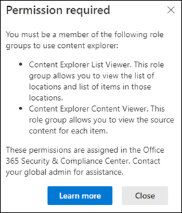

# Trainable Classifiers

## Links
- [Learn about trainable classifiers](https://learn.microsoft.com/en-us/microsoft-365/compliance/classifier-learn-about?view=o365-worldwide)
- [Get started with trainable classifiers](https://learn.microsoft.com/en-us/microsoft-365/compliance/classifier-get-started-with?view=o365-worldwide)
- [How to retrain a classifier in content explorer](https://learn.microsoft.com/en-us/microsoft-365/compliance/classifier-how-to-retrain-content-explorer?view=o365-worldwide)
- [Trainable classifier definitions](https://learn.microsoft.com/en-us/microsoft-365/compliance/classifier-tc-definitions?view=o365-worldwide)
- [Increase classifier accuracy](https://learn.microsoft.com/en-us/microsoft-365/compliance/data-classification-increase-accuracy?view=o365-worldwide)
- [Microsoft built-in trainable classifier reference](https://learn.microsoft.com/en-us/microsoft-365/compliance/classifier-tc-definitions?view=o365-worldwide)
- [Increase classifier accuracy](https://learn.microsoft.com/en-us/microsoft-365/compliance/data-classification-increase-accuracy?view=o365-worldwide)

## Exam Goals
- Identify when to use trainable classifiers
- Design and create a trainable classifier
- Test a trainable classifier
- Retrain a trainable classifier

## Contents
- [Links](#links)
- [Exam Goals](#exam-goals)
- [Contents](#contents)
- [Permissions Required](#permissions-required)
  - [Trainable Classifiers](#trainable-classifiers-1)
  - [Content Explorer](#content-explorer)
  - [Scanning Opt-in](#scanning-opt-in)
- [Licensing](#licensing)
- [Overview](#overview)
- [When to use Trainable Classifiers](#when-to-use-trainable-classifiers)
- [Design and Create a Trainable Classifier](#design-and-create-a-trainable-classifier)
  - [Process flow for creating custom classifiers](#process-flow-for-creating-custom-classifiers)
    - [Seed content](#seed-content)
    - [Prerequisites](#prerequisites)
    - [Testing content](#testing-content)
  - [How to create a trainable classifier](#how-to-create-a-trainable-classifier)
- [Test a Trainable Classifier](#test-a-trainable-classifier)
- [Retrain a Trainable Classifier](#retrain-a-trainable-classifier)
  - [How to retrain a classifier in content explorer](#how-to-retrain-a-classifier-in-content-explorer)

## Permissions Required
- Reference
  - [Trainable Classifiers Permissions](https://learn.microsoft.com/en-us/microsoft-365/compliance/classifier-how-to-retrain-content-explorer?view=o365-worldwide#permissions)
  - [Content Explorer Permissions](https://learn.microsoft.com/en-us/microsoft-365/compliance/data-classification-content-explorer?view=o365-worldwide#permissions)

### Trainable Classifiers
To manage trainable classifiers, a user needs to be able to expand the **Data Classification** node in Microsoft Purview compliance portal. Standard users don't have visibility to this node.

The roles listed below come from Azure AD and Microsoft Purview. In Microsoft Purview, roles are called *role groups*.   

Accessing the Data Classification > Classifiers > Trainable Classifiers Node
- Global Administrator (Azure AD)
- Organization Management (Microsoft Purview)
- Compliance Administrator (Microsoft Purview or Azure AD)
- Compliance Data Administrator (Microsoft Purview or Azure AD)

### Content Explorer
Content Explorer allows you to natively view scanned items and provide feedback for classifiers. It shows a current snapshot of the items that have a sensitivity label, a retention label, or have been classified as a sensitive information type. It also shows items that are classified by trainable classifiers.  

Access to Content Explorer is highly restricted because it lest you read the contents of scanned files. The permissions in Content Explorer supersede permissions that are locally assigned to the items.

To provide feedback in Content Explorer, you must be a member of a role group that has the *Data Classification Content Viewer* and *Data Classification List Viewer* roles. You will receive the following message if you are not a member of a role group that has these roles. See [here](https://learn.microsoft.com/en-us/microsoft-365/compliance/data-classification-content-explorer?view=o365-worldwide#permissions) for more info.
 

The following Microsoft Purview role groups have access provide feedback in Content Explorer: 
- Privacy Management
- Privacy Management Investigators
- Information Protection
- Information Protection Admins
- Information Protection Investigators
- Information Protection Readers
- Data Estate Insights Readers

**Note:**: An Azure AD Global Administrator can also use Content Explorer. 

The following high-privileged Microsoft Purview role groups are able to open the Content Explorer node but do not have access to view files in Content Explorer:
- Organization Management
- Compliance Administrator
- Compliance Data Administrator

If you want these roles to have access to Content Explorer then you must also add members to the following role groups:
- Content Explorer List Viewer
- Content Explorer Content Viewer

### Scanning Opt-in
A Global Admin must opt in to scan the organization's content. This message first appears when accessing the Trainable Classifiers tab. 

The opt-in takes 12 days for Microsoft 365 to complete a baseline evaluation of the organization's content. See [here](https://learn.microsoft.com/en-us/microsoft-365/compliance/classifier-get-started-with?view=o365-worldwide#timeline). During this time the option to create a trainable classifier will be disabled.

## Licensing
- Reference
  - [Licensing Requirements](https://learn.microsoft.com/en-us/microsoft-365/compliance/classifier-get-started-with?view=o365-worldwide#licensing-requirements)
  - [Microsoft 365 Guidance for Security & Compliance Service Description](https://learn.microsoft.com/en-us/office365/servicedescriptions/microsoft-365-service-descriptions/microsoft-365-tenantlevel-services-licensing-guidance/microsoft-365-security-compliance-licensing-guidance)

Trainable classifiers are an E5 feature. 

## Overview
Categorizing and labeling content so it can be protected and handled properly is the starting place for the information protection discipline. Microsoft Purview has three ways to classify content:
1. Manually
2. Automated pattern-matching
3. Classifier

**Manual Classification**
Manual classification requires human judgment and action. Users and admins categorize content as they encounter it. You can use either the pre-existing labels and sensitive information types or use custom created ones. You can then protect the content and manage its disposition.

**Automated Pattern-Matching**
These categorization methods include finding content by
- Keywords or metadata values (keyword query language)
- Using previously identified patterns of sensitive information like SSN, credit card, or bank account numbers (see Sensitive Information type definitions)
- Recognizing an item because it's a variation on a template (Document Fingerprinting)
- Using the presence of exact match strings (see Exact Data Match)

**Classifiers**
This categorization method is based on Machine Learning and is well-suited to content that isn't easily identified by either the manual or automated pattern-matching methods. This method of categorization is more about using a classifier to identify an item based on what the item is, not by elements that are in the item (pattern matching). A classifier learns how to identify a type of content by looking at hundreds of examples of the content you're interested in identifying.

You can view the trainable classifiers in content explorer by expanding **Trainable Classifiers** in the filters panel. 

**Types of Classifiers**
There are two types of classifiers  
- **pre-trained classifiers** - Microsoft has created and pre-trained multiple classifiers that you can start using without training them. These classifiers appear with the status `Ready to use`. See [here](https://learn.microsoft.com/en-us/microsoft-365/compliance/classifier-tc-definitions?view=o365-worldwide) for a list of the pre-trained classifier definitions. 
- **custom trainable classifiers** - If you have content identification and categorization needs that extend beyond that the pre-trained classifiers cover, you can create and train your own classifiers.

## When to use Trainable Classifiers
Classifiers are available to use as a condition for 
- Office auto-labeling with sensitivity labels
- Auto-apply retention policy based on a condition
- Communication compliance
- Sensitivity labels can use classifiers as conditions
- Data loss prevention

**Note:** classifiers only work for items that are not encrypted.

## Design and Create a Trainable Classifier
References:  
- [Custom Classifiers](https://learn.microsoft.com/en-us/microsoft-365/compliance/classifier-learn-about?view=o365-worldwide#custom-classifiers)
- [Get started with trainable classifiers](https://learn.microsoft.com/en-us/microsoft-365/compliance/classifier-get-started-with?view=o365-worldwide#timeline)

You start by creating a custom trainable classifier by feeding it examples that are definitely in the category. Once it processes these examples, you test it by giving it a mix of both matching and non-matching examples. The classifier then makes predictions as to whether any given item falls into the category you're building. You then confirm its results, sorting out the true positives, true negatives, false positives, and false negatives to help increase the accuracy of its predictions.

When you publish the classifier, it sorts through items in locations like SharePoint Online, Exchange, and OneDrive, and classifies the content. After you publish the classifier, you can continue to train it using a feedback process that is similar to the initial training process.

Examples for which you can create trainable classifiers:
- Legal documents - client attorney privilege, closing sets, statement of work
- Strategic business documents - press releases, merger and acquisition, deals, business or marketing plans, intellectual property, patents, design docs
- Pricing information - invoices, price quotes, work orders, bidding documents
- Financial information - organizational investments, quarterly or annual results

### Process flow for creating custom classifiers
Creating and publishing a classifier for use in compliance solutions, such as retention policies and communication supervision, follows this flow. For more detail on creating a custom trainable classifier, see [Creating a custom classifier]().  The process starts by using seed data with a minimum of 50 samples. You then create the classifier and provide sample data, consisting of positive and negative samples. Finally, you provide feedback to the model and then publish the classifier.

#### Seed content
When you want a trainable classifier to independently and accurately identify an item as being in a particular category of content, you must first have to present it with many samples of the type of content that are in the category. This feeding of samples to the trainable classifier is known as *seeding*. Seed content is selected by a human and is judged to represent the category of the document. 

**Note:** You need to have at least 50 positive samples and as many as 500. The trainable classifier will process up to the 500 most recent created samples (by file created date/time stamp). The more samples you provide, the more accurate the predictions the classifier will make. 

#### Prerequisites
- 2 SharePoint Online document folders, one for the seed data and one for the test data. Allow at least an hour for SharePoint to index these files prior to creating the trainable classifier.
- A seed sample containing strong positive and strong negative matches, evenly distributed.  50-500 items, 200 recommended.
- A test sample containing at least 200 items, containing strong positives, strong negatives, and some that are not as obvious

#### Testing content
Once the trainable classifier has processed enough positive samples to build a prediction model, you need to test the predictions it makes to see if the classifier can correctly distinguish between items that match the category and items that don't. You do this by selecting another, hopefully larger, set of human picked content that consists of samples that should fall into the category and samples that won't. You should test with different data than the initial seed data you first provided. Once it processes those, you manually go through the results and verify whether each prediction is correct, incorrect, or you aren't sure. The trainable classifier uses this feedback to improve its prediction model. 

**Tip:** For best results, have at least 200 items in your test sample set with an even distribution of positive and negative matches. 

### How to create a trainable classifier
1. Collect between 50-500 seed content items. These must be only samples that strongly represent the type of content you want the trainable classifier to positively identify as being in the category. See [Default crawled file name extensions and parsed file types in SharePoint server](https://learn.microsoft.com/en-us/sharepoint/technical-reference/default-crawled-file-name-extensions-and-parsed-file-types) for supported file types.

**Important:** Make sure the items in your seed set are **strong** examples of this category. The trainable classifier initially builds its model based on what you seed it with. The classifier assumes all seed samples are strong positives and has no way of knowing if a sample is a weak or negative to match the category.

2. Place the seed content in a SharePoint Online folder that is dedicated to holding *the seed content only*. Make note of this site, library, and folder URL.

**Tip:** If you create a new site and folder for your seed data, allow at least an hour for that location to be indexed before creating the trainable classifier that will use that seed data.

3. Sign in to Microsoft Purview compliance portal with compliance admin or security admin role and access Data Classification > Classifiers > Trainable classifiers.

4. Select **Create trainable classifier**

5. Fill in appropriate values for the `Name` and `Description` fields of the category of items you want this trainable classifier to identify.  

6. Pick the SharePoint Online site, library, and folder URL for the seed content site for step 2. Choose `Add`. 

7. Review the settings and choose `Create trainable classifier`. 

8. Within 24 hours the trainable classifier will process the seed data and build a prediction model. The classifier status is `In Progress` while it processes the seed data. When the classifier is finished processing the seed data, the status changes to `Need test items`. 

9. You can now view the details page by choosing the classifier.

10. Collect at least 200 test content items (10,000 max) for best results. These should be a mix of items that are strong positives, strong negatives, and some that are a little less obvious in their nature. 

11. Place the test content in a SharePoint Online folder that is dedicated to holding the **test content only**. Make note of the SharePoint Online site, library, and folder URL.

12. Choose `Add items to test`

13. Pick the SharePoint Online site, library, and folder URL for the test content site.

14. Finish the wizard by choosing `Done`. Your trainable classifier will take up to an hour to process the test files.

15. When the trainable classifier is done processing your test files, the status on the details page will change to `Ready to review`. If you need to increase the sample size, choose `Add items to test` and allow the trainable classifier to process the additional items.

16. Choose `Tested items to review` tab to review items.

17. Microsoft 365 will present 30 items at a time. Review them and in the `We predict this items is "Relevant". Do you agree?` box choose either `Yes` or `No` or `Not sure, skip to the next item`. Model accuracy is automatically updated every 30 items.

18. Review at least 200 items. Once the accuracy score has stabilized, the **publish** option will become available and the classifier status will say `Ready to use`. 

19. Publish the classifier.

20. Once published your classifier will be available as a condition in the following areas
- [Office auto-labeling with sensitivity labels](https://learn.microsoft.com/en-us/microsoft-365/compliance/apply-sensitivity-label-automatically?view=o365-worldwide)
- [Auto-apply retention label policy based on a condition](https://learn.microsoft.com/en-us/microsoft-365/compliance/apply-retention-labels-automatically?view=o365-worldwide#configuring-conditions-for-auto-apply-retention-labels)
- [Communication compliance](https://learn.microsoft.com/en-us/microsoft-365/compliance/communication-compliance?view=o365-worldwide)

## Test a Trainable Classifier

## Retrain a Trainable Classifier
References
- [Retraining Classifiers](https://learn.microsoft.com/en-us/microsoft-365/compliance/classifier-learn-about?view=o365-worldwide#retraining-classifiers)
- [How to retrain a classifier in content explorer](https://learn.microsoft.com/en-us/microsoft-365/compliance/classifier-how-to-retrain-content-explorer?view=o365-worldwide)

You can help improve the accuracy of all custom trainable classifiers and by providing them with feedback on the accuracy of the classification that they perform.  This is called retraining, and follows this workflow. 

**Note:** The built-in pre-trained classifiers cannot be re-trained. 

**Note:** A classifier must already be published and in use before it can be retrained.

You retrain your classifiers by evaluating the quality of the classifications made for items identified as being a match or not a match. After you make 30 evaluations for a classifier, it takes that feedback, and automatically retrains itself.  

### How to retrain a classifier in content explorer
1. Sign in to Microsoft Purview compliance portal and open Data Classification > Classifiers > Trainable classifiers

2. Choose the trainable classifier you'll give feedback on.  