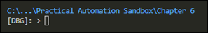

# My PowerShell Notes

## PowerShell Prompt
Here's the code I use for my custom PowerShell prompt.  

```powershell
$ESC = [char]0x1b
function prompt { 
    "`n" +
    # Adds color to the first line 
    "$ESC[38;5;75m" + 
    $(
        # Shows relative path based on count of '\' in path
        if ( ([regex]::matches((Get-Location), '\\')).count -gt 2 ) {
            "$(Get-Location | Split-Path -Qualifier)" + 
            "\...\" + 
            "$(($(Get-Location) -split '\\')[-2..-1] -join '\')"
        } else {
            "$(Get-Location)"
        }
    ) + 
    "$ESC[0m" +
    # End color add to first line
    "`n" +   
    $(
        if (Test-Path variable:/PSDebugContext) { '[DBG]: ' } else { '' }
    ) +   
    $(
        if ($NestedPromptLevel -ge 1) { '>>' }
    ) + 
    '> '
}
```
The prompt looks similar to this pic:  
