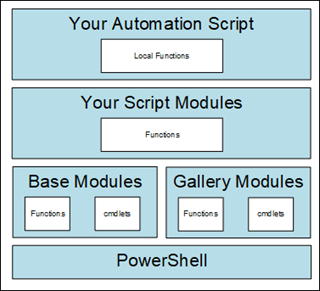
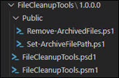
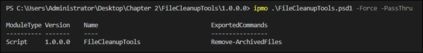

# Chapter 2 - Get Started Automating

- [2.1 - Cleaning Up Old Files](#21---cleaning-up-old-files)
  - [2.1.1 - Function: Set-ArchiveFilePath](#211---function-set-archivefilepath)
  - [2.1.2 - Script to Generate Random Log files](#212---script-to-generate-random-log-files)
  - [2.1.3 - Function: Remove-ArchivedFiles](#213---function-remove-archivedfiles)
  - [2.1.4 - Combining Functions: Set-ArchiveFilePath and Remove-ArchivedFiles](#214---combining-functions-set-archivefilepath-and-remove-archivedfiles)
- [2.2 - The Anatomy of a PowerShell Function](#22---the-anatomy-of-a-powershell-function)
  - [2.2.1 - Function: Get-TopProcess](#221---function-get-topprocess)
  - [2.2.2 - Function: New-ModuleTemplate](#222---function-new-moduletemplate)
  - [2.2.3 - Module creation tips](#223---module-creation-tips)

Goal of this chapter is to take a simple script and turn it into a reusable building block.  The script cleans up old log files.  

## 2.1 - Cleaning Up Old Files
Requirements for the script are to remove old log files to keep the drive from filling up. Logs must be retained for at least seven years but can go into cold storage after 30 days.

### 2.1.1 - Function: Set-ArchiveFilePath
This function creates the name of a zip file based on a supplied date and prefix. 
```powershell
# Listing 1 - Set-ArchiveFilePath Function
# Declare the function and set required parameters
Function Set-ArchiveFilePath{
    # Declare CmdletBinding and OutputType
    [CmdletBinding()]
    [OutputType([string])]
    # Define the parameters
    param(
    [Parameter(Mandatory = $true)]
    [string]$ZipPath,

    [Parameter(Mandatory = $true)]
    [string]$ZipPrefix,

    [Parameter(Mandatory = $true)]
    [datetime]$Date
    )

    # Check if the folder path exists and create it if it doesn't
    if(-not (Test-Path -Path $ZipPath)){
        New-Item -Path $ZipPath -ItemType Directory | Out-Null
        # Include verbose output for testing and troubleshooting
        Write-Verbose "Created folder '$ZipPath'"
    }

    # Create the timestamp based on the date
    $timeString = $Date.ToString('yyyyMMdd')
    # Create the file name
    $ZipName = "$($ZipPrefix)$($timeString).zip"
    # Set the full path of the zip file
    $ZipFile = Join-Path $ZipPath $ZipName

    # confirm the file doesn't already exist. Throw a terminating error if it does
    if(Test-Path -Path $ZipFile){
        throw "The file '$ZipFile' already exists"
    }

    # Return the file path to the script
    $ZipFile
}
```

### 2.1.2 - Script to Generate Random Log files
The author provides the following script that generates a set of log files with random size. Note the use of the `[DateTime]` parameter:  PowerShell is smart enough to parse a string and convert it into a DateTime object for you. Use `(Get-Date).GetDateTimeFormats()` to determine the string types that PowerShell accepts.

```powershell
# Set directory to create logs in
$Directory = "L:\Logs"
# Set number of days, in the past, to create log files for
$days = 90

# create the folder if not found
if(-not (Test-Path $Directory)){
    New-Item -Path $Directory -ItemType Directory
}

# this function creates randomly sized files
Function Set-RandomFileSize {
   param( [string]$FilePath )
    $size = Get-Random -Minimum 1 -Maximum 50
    $size = $size*1024*1024
    $file = [System.IO.File]::Open($FilePath, 4)
    $file.SetLength($Size)
    $file.Close()
    Get-Item $file.Name
}

# loop to create a file for each day back
for($i = 0; $i -lt $days; $i++) {
    # Get Date and create log file
    $Date = (Get-Date).AddDays(-$i)
    # create unique file name with the date in it
    $FileName = "u_ex$($date.ToString('yyyyMMdd')).log"
    # set the file path
    $FilePath = Join-Path -Path $Directory -ChildPath $FileName
    # write the date inside the file, will override existing files
    $Date | Out-File $FilePath
    # set a random file size
    Set-RandomFileSize -FilePath $FilePath 

    # Set the Creation, Write, and Access time of log file to past date
    Get-Item $FilePath | ForEach-Object { 
        $_.CreationTime = $date
        $_.LastWriteTime = $date
        $_.LastAccessTime = $date 
    }
}
```

### 2.1.3 - Function: Remove-ArchivedFiles
This function removes a file from the local disk if that file has already been archived, i.e. added to a zip file.

Things to note:
- The use of `Add-Type` to load a Microsoft .NET class to the PowerShell session

```powershell
# Listing 2 - Deleting Archived Files
Function Remove-ArchivedFiles {
    [CmdletBinding()]
    [OutputType()]
    param(
    [Parameter(Mandatory = $true)]
    [string]$ZipFile,

    [Parameter(Mandatory = $true)]
    [object]$FilesToDelete,

    [Parameter(Mandatory = $false)]
    [switch]$WhatIf = $false
    )
    # Load the System.IO.Compression.FileSystem assembly so you can use dot sourcing later
    $AssemblyName = 'System.IO.Compression.FileSystem'
    Add-Type -AssemblyName $AssemblyName | Out-Null

    $OpenZip = [System.IO.Compression.ZipFile]::OpenRead($ZipFile)
    # Get the information on the files inside the zip
    $ZipFileEntries = $OpenZip.Entries

    # Confirm each file to delete has a match in the zip file
    foreach($file in $FilesToDelete){
        $check = $ZipFileEntries | Where-Object{ $_.Name -eq $file.Name -and
            $_.Length -eq $file.Length }
        # If $check does not equal null, then you know the file was found and can be deleted
        if($null -ne $check){
            # Add WhatIf to allow for testing without actually deleting the files
            $file | Remove-Item -Force -WhatIf:$WhatIf
        }
        else {
            Write-Error "'$($file.Name)' was not find in '$($ZipFile)'"
        }
    }
}
```
### 2.1.4 - Combining Functions: Set-ArchiveFilePath and Remove-ArchivedFiles
The following script combines the functions `Set-ArchiveFilePath` and `Remove-ArchivedFiles` into one script. The end result is a script that archives files that haven't been modified beyond a certain date.  The script places the files in a zip file and then deletes the original files from local disk.

```powershell
# Listing 3 - Putting it All Together
[CmdletBinding()]
[OutputType()]
param(
    [Parameter(Mandatory = $true)]
    [string]$LogPath,

    [Parameter(Mandatory = $true)]
    [string]$ZipPath,

    [Parameter(Mandatory = $true)]
    [string]$ZipPrefix,

    [Parameter(Mandatory = $false)]
    [double]$NumberOfDays = 30
)

# Declare your functions before the script code
Function Set-ArchiveFilePath{
    [CmdletBinding()]
    [OutputType([string])]
    param(
    [Parameter(Mandatory = $true)]
    [string]$ZipPath,

    [Parameter(Mandatory = $true)]
    [string]$ZipPrefix,

    [Parameter(Mandatory = $false)]
    [datetime]$Date = (Get-Date)
    )

    if(-not (Test-Path -Path $ZipPath)){
        New-Item -Path $ZipPath -ItemType Directory | Out-Null
        Write-Verbose "Created folder '$ZipPath'"
    }

    $ZipName = "$($ZipPrefix)$($Date.ToString('yyyyMMdd')).zip"
    $ZipFile = Join-Path $ZipPath $ZipName

    if(Test-Path -Path $ZipFile){
        throw "The file '$ZipFile' already exists"
    }

    $ZipFile
}

Function Remove-ArchivedFiles {
    [CmdletBinding()]
    [OutputType()]
    param(
    [Parameter(Mandatory = $true)]
    [string]$ZipFile,

    [Parameter(Mandatory = $true)]
    [object]$FilesToDelete,

    [Parameter(Mandatory = $false)]
    [switch]$WhatIf = $false
    )

    $AssemblyName = 'System.IO.Compression.FileSystem'
    Add-Type -AssemblyName $AssemblyName | Out-Null

    $OpenZip = [System.IO.Compression.ZipFile]::OpenRead($ZipFile)
    $ZipFileEntries = $OpenZip.Entries

    foreach($file in $FilesToDelete){
        $check = $ZipFileEntries | Where-Object{ $_.Name -eq $file.Name -and
            $_.Length -eq $file.Length }
        if($null -ne $check){
            $file | Remove-Item -Force -WhatIf:$WhatIf
        }
        else {
            Write-Error "'$($file.Name)' was not find in '$($ZipFile)'"
        }
    }
}

# Set the date filter based on the number of days in the past
$Date = (Get-Date).AddDays(-$NumberOfDays)
# Get the files to archive based on the date filter
$files = Get-ChildItem -Path $LogPath -File |
    Where-Object{ $_.LastWriteTime -lt $Date}

$ZipParameters = @{
    ZipPath = $ZipPath
    ZipPrefix = $ZipPrefix
    Date = $Date
}
# Get the archive file path
$ZipFile = Set-ArchiveFilePath @ZipParameters

# Add the files to the archive file
$files | Compress-Archive -DestinationPath $ZipFile

$RemoveFiles = @{
    ZipFile = $ZipFile
    FilesToDelete = $files
}
# confirm files are in the archive and delete
Remove-ArchivedFiles @RemoveFiles
```

## 2.2 - The Anatomy of a PowerShell Function
The author provides the following diagram for using PowerShell scripts with your own script modules:

  

### 2.2.1 - Function: Get-TopProcess
This function demonstrates reusable code by returning the top processes by CPU utilization.

Things to note:
- The use of a PowerShell calculated property with `Select-Object`

```powershell
# Listing 4 - Get Top N Processes
# Declare your function
Function Get-TopProcess{
    # Define the parameters
    param(
        [Parameter(Mandatory = $true)]
        [int]$TopN
    )
    # Run the command
    Get-Process | Sort-Object CPU -Descending |
        Select-Object -First $TopN -Property ID,
        ProcessName, @{l='CPU';e={'{0:N}' -f $_.CPU}}
}
```

### 2.2.2 - Function: New-ModuleTemplate
The following function creates a blank module scaffold.  Modify the parameters at the bottom of the script.

```powershell
# Listing 5 - New-ModuleTemplate
Function New-ModuleTemplate {
    [CmdletBinding()]
    [OutputType()]
    param(
        [Parameter(Mandatory = $true)]
        [string]$ModuleName,
        [Parameter(Mandatory = $true)]
        [string]$ModuleVersion,
        [Parameter(Mandatory = $true)]
        [string]$Author,
        [Parameter(Mandatory = $true)]
        [string]$PSVersion,
        [Parameter(Mandatory = $false)]
        [string[]]$Functions
    )
    $ModulePath = Join-Path .\ "$($ModuleName)\$($ModuleVersion)"
    # Creates a folder with the same name as the module
    New-Item -Path $ModulePath -ItemType Directory
    Set-Location $ModulePath
    # Creates the public folder to store your ps1 scripts
    New-Item -Path .\Public -ItemType Directory

    $ManifestParameters = @{
        ModuleVersion     = $ModuleVersion
        Author            = $Author
        # Sets the path to the psd1 file
        Path              = ".\$($ModuleName).psd1"
        # Sets the path to the psm1 file
        RootModule        = ".\$($ModuleName).psm1"
        PowerShellVersion = $PSVersion
    }
    # Creates the module manifest psd1 file with the settings supplied in the parameters
    New-ModuleManifest @ManifestParameters

    # Creates a blank psm1 file
    $File = @{
        FilePath     = ".\$($ModuleName).psm1"
        Encoding = 'utf8'
    }
    Out-File @File

    # Create a blank ps1 for each function
    $Functions | ForEach-Object {
        Out-File -FilePath ".\Public\$($_).ps1" -Encoding utf8
    }
}

# Set the parameters to pass to the function
$module = @{
    # The name of your module
    ModuleName    = 'FileCleanupTools'
    # The version of your module
    ModuleVersion = "1.0.0.0"
    # Your name
    Author        = "YourNameHere"
    # The minimum PowerShell version this module supports
    PSVersion     = '7.0'
    # The functions to create blank files for in the Public folder
    Functions     =  'Remove-ArchivedFiles',
                     'Set-ArchiveFilePath'
}
# Execute the function to create the new module
New-ModuleTemplate @module
```

Here's the end result:  



The script files in the `Public` folder will not load, i.e. dot source, by default. Place the following code in the .psm1 file to have the module load scripts in the Public folder.

```powershell
# Listing 7 - Load Module Functions
$Path = Join-Path $PSScriptRoot 'Public'
# Get all the ps1 files in the Public folder
$Functions = Get-ChildItem -Path $Path -Filter '*.ps1'

# Loop through each ps1 file
foreach ($import in $functions) {
    try {
        write-verbose "dot-sourcing file '$($import.fullname)'"
        # execute each ps1 file to load the function into memory
        . $import.fullname
    }
    Catch {
        Write-Error -Message "Failed to import function $($import.name)"
    }
}
```

If you add a folder for private functions, the code would be

```powershell
$Public = Join-Path $PSScriptRoot 'Public'
$Private = Join-Path $PSScriptRoot 'Private'
$Functions = Get-ChildItem -Path $Public,$Private -Filter '*.ps1'
```

When loading the module, use the `-Force` and the `PassThru` switches.  The `Force` switch picks up any changes you have made.  The `PassThru` switch sends output to the console:  



The next script demonstrates how you can replace function definitions with a call to import the script module.

Things to note:
- The call to `Import-Module`

```powershell
# Listing 8 - Moving Functions to Module
param(
    [Parameter(Mandatory = $true)]
    [string]$LogPath,

    [Parameter(Mandatory = $true)]
    [string]$ZipPath,

    [Parameter(Mandatory = $true)]
    [string]$ZipPrefix,

    [Parameter(Mandatory = $false)]
    [double]$NumberOfDays = 30
)

# Replaced functions with the command to load the FileCleanupTools module
Import-Module FileCleanupTools

$Date = (Get-Date).AddDays(-$NumberOfDays)
$files = Get-ChildItem -Path $LogPath -File |
    Where-Object{ $_.LastWriteTime -lt $Date}

$ZipParameters = @{
    ZipPath = $ZipPath
    ZipPrefix = $ZipPrefix
    Date = $Date
}
$ZipFile = Set-ArchiveFilePath @ZipParameters

$files | Compress-Archive -DestinationPath $ZipFile

Remove-ArchivedFiles -ZipFile $ZipFile -FilesToDelete $files
```

### 2.2.3 - Module creation tips