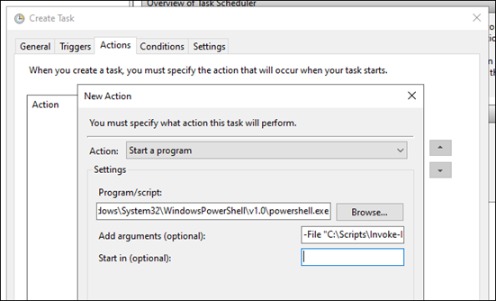

# Chapter 3 - Scheduling Automation Scripts

There are two different types of scripts you run on a scheduled basis:
1. Scheduled Script - runs regularly
2. Watcher Script - runs continuously

## 3.1 Scheduled Scripts
Scheduled scripts run on a regular basis but not continuously. Examples include
- Inventory collection
- Checks on user accounts
- Checks on system resources
- Data backups

When running scheduled scripts, know your dependencies and take care of them beforehand. Make sure dependent modules are installed on the system beforehand. Do not have your scheduled scripts install modules!  Doing so could lead to unintended consequences. For example, a script may fail to install a module and never complete successfully or two scripts that try to install a module may continuously override each other, causing failures between each other. 

### 3.1.1 - Using Windows Task Scheduler
When using Windows Task Scheduler, copy the module folder where the script can access it.  The default paths for PowerShell modules are:

- **PowerShell v5.1**:  `C:\Program Files\WindowsPowerShell\Modules`
- **PowerShell v7.0**:  `C:\Program Files\PowerShell\7\Modules`

#### Security Options
Selecting the option **Do not store password** forces the task to run under the system context. This allows the task to access local resources but not network resources. Unselect this option and use a service account when needing to access resources over the network.  

When creating an Action, set the program to the path of the PowerShell executable. Then specify the remaining arguments in the **Add arguments** box. For example, use `-File "C:\Scripts\Invoke-LogFileCleanup.ps1" -LogPath "L:\Logs\" -ZipPath "L:\Archives\" -ZipPrefix "LogArchive-" -NumberOfDays 30`:

