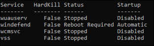
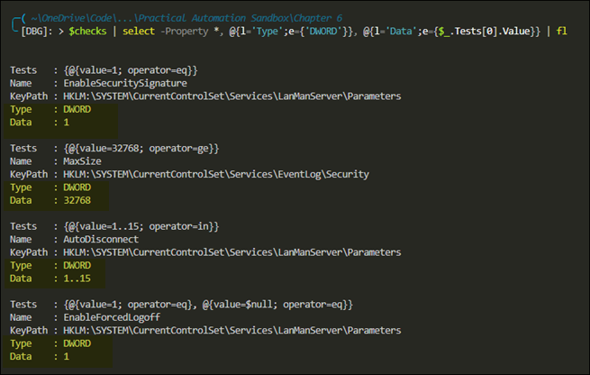
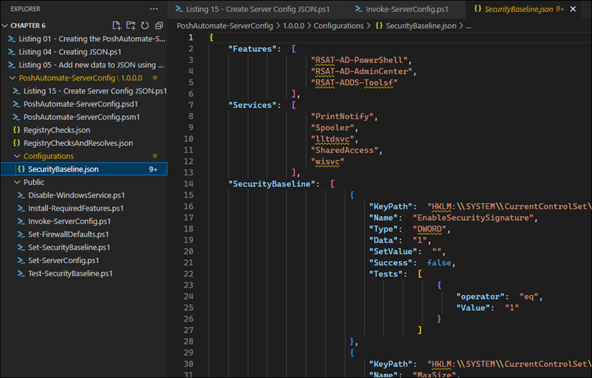
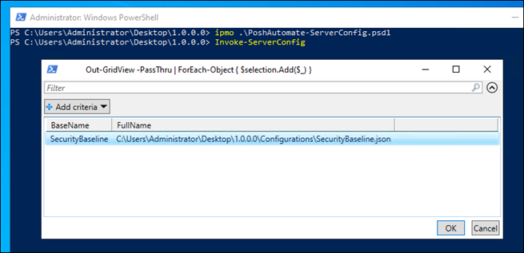
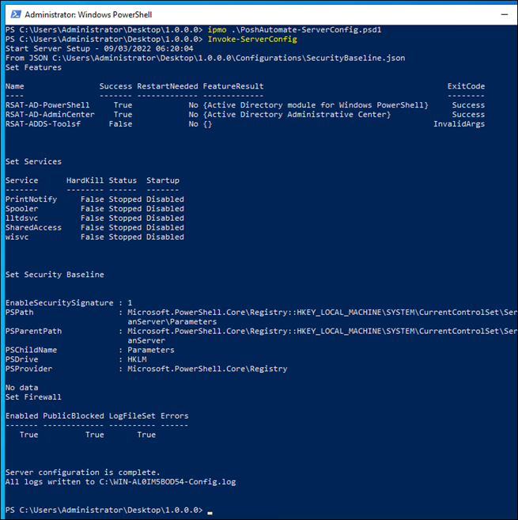
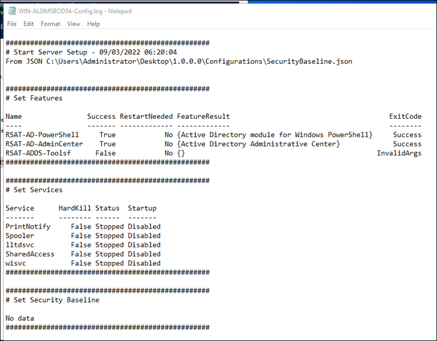

# Chapter 6 - Making Adaptable Automations

- [6.0 - Creating the ServerConfig PowerShell Module Scaffold](#60---creating-the-serverconfig-powershell-module-scaffold)
- [6.1 - Event Handling (Stopping and Disabling Windows Services)](#61---event-handling-stopping-and-disabling-windows-services)
- [6.2 - Building Data-Driven Functions](#62---building-data-driven-functions)
  - [6.2.1 - Determining Your Data Structure (Hash Table)](#621---determining-your-data-structure-hash-table)
  - [6.2.2 - Storing Your Data (JSON)](#622---storing-your-data-json)
  - [6.2.3 - Updating Your Data Structure (Updating JSON Structure)](#623---updating-your-data-structure-updating-json-structure)
  - [6.2.4 - Creating Classes (Base and Nested Class)](#624---creating-classes-base-and-nested-class)
  - [6.2.5 - Building the Function (Dynamic Conditions; Using Classes)](#625---building-the-function-dynamic-conditions-using-classes)
    - [Dynamic Conditions](#dynamic-conditions)
    - [Using Classes](#using-classes)
- [6.3 - Controlling Scripts with Configuration Data](#63---controlling-scripts-with-configuration-data)
  - [Installing Windows Features](#installing-windows-features)
  - [Configuring Windows Firewall](#configuring-windows-firewall)
  - [6.3.1 - Organizing Your Data (Creating a single config file)](#631---organizing-your-data-creating-a-single-config-file)
    - [Creating a Server Config Class](#creating-a-server-config-class)
- [6.3.2 - Using Your Configuration Data](#632---using-your-configuration-data)
- [6.3.3 - Storing Your Configuration Data](#633---storing-your-configuration-data)
  - [Bringing it All Together](#bringing-it-all-together)

## 6.0 - Creating the ServerConfig PowerShell Module Scaffold
The author provides a nice template for creating modules. This script creates a blank module structure. See [Listing 01 - Creating the PoshAutomate-ServerConfig module](scripts/Listing%2001%20-%20Creating%20the%20PoshAutomate-ServerConfig%20module.ps1). 
```powershell
Function New-ModuleTemplate {
    [CmdletBinding()]
    [OutputType()]
    param(
        [Parameter(Mandatory = $true)]
        [string]$ModuleName,
        [Parameter(Mandatory = $true)]
        [string]$ModuleVersion,
        [Parameter(Mandatory = $true)]
        [string]$Author,
        [Parameter(Mandatory = $true)]
        [string]$PSVersion,
        [Parameter(Mandatory = $false)]
        [string[]]$Functions
    )
    $ModulePath = Join-Path .\ "$($ModuleName)\$($ModuleVersion)"
    New-Item -Path $ModulePath -ItemType Directory
    Set-Location $ModulePath
    New-Item -Path .\Public -ItemType Directory

    $ManifestParameters = @{
        ModuleVersion     = $ModuleVersion
        Author            = $Author
        Path              = ".\$($ModuleName).psd1"
        RootModule        = ".\$($ModuleName).psm1"
        PowerShellVersion = $PSVersion
    }
    New-ModuleManifest @ManifestParameters

    $File = @{
        FilePath     = ".\$($ModuleName).psm1"
        Encoding = 'utf8'
    }
    Out-File @File

    $Functions | ForEach-Object {
        Out-File -FilePath ".\Public\$($_).ps1" -Encoding utf8
    }
}

# Set the parameters to pass to the function
$module = @{
    # The name of your module
    ModuleName    = 'PoshAutomate-ServerConfig'
    # The version of your module
    ModuleVersion = "1.0.0.0"
    # Your name
    Author        = "YourNameHere"
    # The minimum PowerShell version this module supports
    PSVersion     = '5.1'
    # The functions to create blank files for in the Public folder
    Functions     = 'Disable-WindowsService', 
        'Install-RequiredFeatures', 'Set-FirewallDefaults', 
        'Set-SecurityBaseline', 'Set-ServerConfig', 
        'Test-SecurityBaseline'
}
# Execute the function to create the new module
New-ModuleTemplate @module
```

Next add the following code to the .psm1 file to automatically import the functions from the `Public` folder. You won't see any commands when you initially import the module. So you'll need to populate the functions in the Public folder for the commands to show up.

```powershell
$Path = Join-Path $PSScriptRoot 'Public'
$Functions = Get-ChildItem -Path $Path -Filter '*.ps1'
 
Foreach ($import in $Functions) {
    Try {
        Write-Verbose "dot-sourcing file '$($import.fullname)'"
        . $import.fullname
    }
    Catch {
        Write-Error -Message "Failed to import function $($import.name)"
    }
}
```

## 6.1 - Event Handling (Stopping and Disabling Windows Services)
The author demonstrates general use of event handling with `try{}`/`catch{}` with a goal of disabling and stopping Windows services.

Some commands, like `Stop-Service` have the `-NoWait` switch. This switch tells the cmdlet to send the stop signal but do not wait for it to stop.

Other commands, such as `Invoke-WebRequest` do not have a no-wait option. In these cases you can use PowerShell jobs to get the wait functionality:

```powershell
Start-Job -ScriptBlock {
    Invoke-WebRequest -Uri $UrlA -OutFile $FileA
}
Start-Job -ScriptBlock {
    Invoke-WebRequest -Uri $UrlB -OutFile $FileB
}
Get-Job | Wait-Job
```

Use the `Receive-Job` cmdlet to get the return information.

**Disabling Windows Services**  
The following script takes in a list of services and sets the startup type to `Disabled`.  It then attempts to stop the service and records the resulting state. If there are any services that haven't been stopped in the predetermined amount of time, then an attempt is made to kill the process. If the script is unable to kill the process, then a reboot flag is noted.  Here's an example of the output:



**Disable-WindowsService**  
```powershell
Function Disable-WindowsService {
    [CmdletBinding()]
    [OutputType([object])]
    param(
        [Parameter(Mandatory = $true)]
        [string[]]$Services,
        [Parameter(Mandatory = $true)]
        [int]$HardKillSeconds,
        [Parameter(Mandatory = $true)]
        [int]$SecondsToWait
    )

    [System.Collections.Generic.List[PSObject]] $ServiceStatus = @()
    foreach ($Name in $Services) {
        # Create a custom PowerShell object to track the status of each service
        $ServiceStatus.Add([pscustomobject]@{
            Service  = $Name
            HardKill = $false
            Status   = $null
            Startup  = $null
        })
        try {
            # Attempt to find the service, then disable and stop it
            $Get = @{
                Name        = $Name
                ErrorAction = 'Stop'
            }
            $Service = Get-Service @Get
            $Set = @{
                InputObject = $Service
                StartupType = 'Disabled'
            }
            Set-Service @Set
            $Stop = @{
                InputObject = $Service
                Force       = $true
                NoWait      = $true
                ErrorAction = 'SilentlyContinue'
            }
            Stop-Service @Stop
            Get-Service -Name $Name | ForEach-Object {
                $ServiceStatus[-1].Status = $_.Status.ToString()
                $ServiceStatus[-1].Startup = $_.StartType.ToString()
            }
        }
        catch {
            $msg = 'NoServiceFoundForGivenName,Microsoft.PowerShell' +
                '.Commands.GetServiceCommand'
            if ($_.FullyQualifiedErrorId -eq $msg) {
                # If the service doesn't exist, then there is nothing to stop, so consider that a success
                $ServiceStatus[-1].Status = 'Stopped'
            }
            else {
                Write-Error $_
            }
        }
    }

    $timer = [system.diagnostics.stopwatch]::StartNew()
    # Monitor the stopping of each service
    do {
        $ServiceStatus | Where-Object { $_.Status -ne 'Stopped' } | 
        ForEach-Object { 
            $_.Status = (Get-Service $_.Service).Status.ToString()
            
            # If any services have not stopped in the predetermined amount of time, kill the process.
            if ($_.HardKill -eq $false -and 
                $timer.Elapsed.TotalSeconds -gt $HardKillSeconds) {
                Write-Verbose "Attempting hard kill on $($_.Service)"
                $query = "SELECT * from Win32_Service WHERE name = '{0}'"
                $query = $query -f $_.Service
                $svcProcess = Get-CimInstance -Query $query
                $Process = @{
                    Id          = $svcProcess.ProcessId
                    Force       = $true
                    ErrorAction = 'SilentlyContinue'
                }
                Stop-Process @Process
                $_.HardKill = $true
            }
        }
        $Running = $ServiceStatus | Where-Object { $_.Status -ne 'Stopped' }
    } while ( $Running -and $timer.Elapsed.TotalSeconds -lt $SecondsToWait )
    # set reboot required if any services did not stop
    $ServiceStatus | 
        Where-Object { $_.Status -ne 'Stopped' } | 
        ForEach-Object { $_.Status = 'Reboot Required' }
    
    # return results
    $ServiceStatus
}
```

## 6.2 - Building Data-Driven Functions
The author uses the registry as an example for storing and accessing data through JSON and classes.

### 6.2.1 - Determining Your Data Structure (Hash Table)
Here is an example of how to build out a test for a registry entry in a hash table.
```powershell
@{
    KeyPath = 'HKLM:\SYSTEM\Path\Example'
    Name    = 'SecurityKey'
    Tests   = @(
        @{operator = 'eq'; value = '1' }
        @{operator = 'eq'; value = $null }
    )
}
```

### 6.2.2 - Storing Your Data (JSON)
The author indicates there is a variety of ways you can store data, including XML, CSV, JSON, and PowerShell Data Files (.psd1). His recommendation is to use JSON unless you have a specific reason not to.

The author provides an example of using registry checks to convert a PowerShell object into a JSON file. Use the JSON validator site at [jsonlint.com](https://jsonlint.com/) to validate JSON syntax.

**Creating JSON for Registry Checks**  
Creates a collection of registry checks and outputs them to the `RegistryChecks.json` file. 
```powershell
[System.Collections.Generic.List[PSObject]] $JsonBuilder = @()
$JsonBuilder.Add(@{
    KeyPath =
    'HKLM:\SYSTEM\CurrentControlSet\Services\LanManServer\Parameters'
    Name    = 'EnableSecuritySignature'
    Tests   = @(
        @{operator = 'eq'; value = '1' }
    )
})
$JsonBuilder.Add(@{
    KeyPath =
    'HKLM:\SYSTEM\CurrentControlSet\Services\EventLog\Security'
    Name    = 'MaxSize'
    Tests   = @(
        @{operator = 'ge'; value = '32768' }
    )
})
$JsonBuilder.Add(@{
    KeyPath =
    'HKLM:\SYSTEM\CurrentControlSet\Services\LanManServer\Parameters'
    Name    = 'AutoDisconnect'
    Tests   = @(
        @{operator = 'in'; value = '1..15' }
    )
})
$JsonBuilder.Add(@{
    KeyPath =
    'HKLM:\SYSTEM\CurrentControlSet\Services\LanManServer\Parameters'
    Name    = 'EnableForcedLogoff'
    Tests   = @(
        @{operator = 'eq'; value = '1' }
        @{operator = 'eq'; value = '$null' }
    )
})
 
$JsonBuilder |
    ConvertTo-Json -Depth 3 |
    Out-File .\RegistryChecks.json -Encoding UTF8
```

### 6.2.3 - Updating Your Data Structure (Updating JSON Structure)
The author introduces the the `Type` and `Value` fields to the registry check structure. The `Type` field defaults to DWORD.  The `Value` field defaults to value of the first registry test item in the `Tests` array.

The script exports the resulting changes to a new `RegistryChecksAndResolves.json` file.
```powershell
$checks = Get-Content .\RegistryChecks.json -Raw | 
    ConvertFrom-Json

# Use the Select-Object to add new properties to the object
$updated = $checks | 
    Select-Object -Property *, @{l='Type';e={'DWORD'}}, 
        @{l='Data';e={$_.Tests[0].Value}}

# Convert the updated object with the new properties back to JSON and export
ConvertTo-Json -InputObject $updated -Depth 3 | 
    Out-File -FilePath .\RegistryChecksAndResolves.json -Encoding utf8
```
Here's a look at the results:  


### 6.2.4 - Creating Classes (Base and Nested Class)
Use classes when the script is expecting a specifically-formatted object. If you are creating classes from JSON, then you'll need a class for each nested JSON object. 

The author takes the examples from the previous sections to create two classes:
- `RegistryCheck`
  - Represents the base JSON object
- `RegistryTest`
  - Represents a nested JSON object
  - Checks for the operator and value

The following examples show how to create the two classes. The sections that follow will demonstrate how to use the classes.

The `RegistryTest` class has the simplest implementation: 
```powershell
class RegistryTest {
    [string]$operator
	[string]$Value
    # Method to create a blank instance of this class
    RegistryTest(){
    }
    # Method to create an instance of this class populated with data from a generic PowerShell object
    RegistryTest(
        [object]$object
    ){
        $this.operator = $object.Operator
		$this.Value = $object.Value # Represents desired state
    }
}
```

The `RegistryCheck` class is the base class. Note how `RegistryCheck` references the `RegistryTest` class.
```powershell
class RegistryCheck {
    [string]$KeyPath
    [string]$Name
    [string]$Type
    [string]$Data   # Represents the current state
    [string]$SetValue  # New property added - represents new state
    [Boolean]$Success   # New property added
    [RegistryTest[]]$Tests # Use of nested class
    # Method to create a blank instance of the parent class
    RegistryCheck(){
        $this.Tests += [RegistryTest]::new()
        $this.Success = $false
    }
    # Method to create an instance of this class populated with data from a generic PowerShell object
    RegistryCheck(
        [object]$object
    ){
        $this.KeyPath = $object.KeyPath
		$this.Name = $object.Name
		$this.Type = $object.Type
        $this.Data = $object.Data
        $this.Success = $false
        $this.SetValue = $object.SetValue

        $object.Tests | Foreach-Object {
            $this.Tests += [RegistryTest]::new($_)
        }
    }
}
```

### 6.2.5 - Building the Function (Dynamic Conditions; Using Classes)
#### Dynamic Conditions
When verifying registry values, there are a lot of conditions to consider, as PowerShell has 14 different comparison operators. Instead of using an `if/else` statement for each operator or the `switch` statement, the author demonstrates how you can build a function to accept dynamic conditions.

For example, a simple test may look like this:
```powershell
if ($Data -eq 1) { $true }
```
If you turn the expression into a string, you can pass parameters to the string:
```powershell
'if ($Data -{0} {1}) { {$true} }' -f 'eq', 1
```
You can then use the `Invoke-Expression` command to execute on the dynamic condition:
```powershell
$Data = 3
$Operator = 'in'
$Expected = '1..15'
$cmd = 'if($Data -{0} {1}){{$true}}' -f $Operator, $Expected
Invoke-Expression $cmd
```

#### Using Classes
The following function receives a `RegistryCheck` parameter and checks to see if the target value exists.  If the target value exists, then a dynamic condition is used to verify the value. If the value is verified, then the `RegistryCheck.Success` is set to `true`. For reporting and debugging purposes, `RegistryCheck.SetValue` is set to registry value. 
```powershell
Function Test-SecurityBaseline {
    [CmdletBinding()]
    [OutputType([object])]
    param(
        [Parameter(Mandatory = $true)]
        [RegistryCheck]$Check
    )
    # Set the initial value of $Data to null
    $Data = $null
    if (-not (Test-Path -Path $Check.KeyPath)) {
        # If the path is not found, there is nothing to do because $Data is already set to null.
        Write-Verbose "Path not found"
    }
    else {
        # Get the keys that exist in the key path and confirm that the key you want is present.
        $SubKeys = Get-Item -LiteralPath $Check.KeyPath
        if ($SubKeys.Property -notcontains $Check.Name) {
            # If the key is not found, there is nothing to do because $Data is already set to null.
            Write-Verbose "Name not found"
        }
        else {
            try {
                # If the key is found, get the value and update the $Data variable with the value.
                $ItemProperty = @{
                    Path = $Check.KeyPath
                    Name = $Check.Name
                }
                $Data = Get-ItemProperty @ItemProperty | 
                    Select-Object -ExpandProperty $Check.Name
            }
            catch {
                $Data = $null
            }
        }
    }
    
    # Run through each test for this registry key.
    foreach ($test in $Check.Tests) {
        # Build the string to create the If statement to test the value of the $Data variable.
        $filter = 'if($Data -{0} {1}){{$true}}'
        $filter = $filter -f $test.operator, $test.Value
        Write-Verbose $filter
        if (Invoke-Expression $filter) {
            # If the statement returns true, you know a test passed, so update the Success property.
            $Check.Success = $true
        }
    }
    
    # Add the value of the key for your records and debugging
    $Check.SetValue = $Data
    $Check
}
```

If the registry check fails, then the following function will create the registry value. Remember when setting the registry that an item corresponds to a key (or folder) and an item property corresponds to the key's value/data pair.  

```powershell
Function Set-SecurityBaseline{
    [CmdletBinding()]
    [OutputType([object])]
    param(
        [Parameter(Mandatory = $true)]
        [RegistryCheck]$Check
    )
    # Create the registry key path if it does not exist
    if(-not (Test-Path -Path $Check.KeyPath)){
        New-Item -Path $Check.KeyPath -Force -ErrorAction Stop
    }
        
    # Create or Update the registry key with the predetermined value
    $ItemProperty = @{
        Path         = $Check.KeyPath
        Name         = $Check.Name
        Value        = $Check.Data
        PropertyType = $Check.Type
        Force        = $true
        ErrorAction  = 'Continue'
    }
    New-ItemProperty @ItemProperty
}
```

## 6.3 - Controlling Scripts with Configuration Data
The goal of this section is have one single script that calls each function with appropriate parameters, where the parameters are provided from a configuration file.

The author starts this section by presenting a couple of functions to round out demonstrating the full automation.  

### Installing Windows Features
The function below demonstrates how to install Windows Features. A couple of things to note:
- The use of `System.Collections.Generic.List[PSObject]`.  Per [here](https://gist.github.com/kevinblumenfeld/4a698dbc90272a336ed9367b11d91f1c), it's recommended to use a generic list when you know the type of the elements but not the size of the collection.
- The use of a custom property `@{l='Name'; e={$Name}}`. This is because 'Install-WindowsFeature' doesn't return the Name property.
```powershell
Function Install-RequiredFeatures {
    [CmdletBinding()]
    [OutputType([object])]
    param(
        [Parameter(Mandatory = $true)]
        [string[]]$Features
    )
    [System.Collections.Generic.List[PSObject]] $FeatureInstalls = @()
    foreach ($Name in $Features) {
        Install-WindowsFeature -Name $Name -ErrorAction SilentlyContinue |
            Select-Object -Property @{l='Name';e={$Name}}, * |
            ForEach-Object{ $FeatureInstalls.Add($_) }
    }
 
    $FeatureInstalls
}
```
### Configuring Windows Firewall
The following function shows how you can configure Windows firewall to (1) enable for all profiles, (2) block inbound traffic on the Public profile and (3) set up logging. 
```powershell
Function Set-FirewallDefaults {
    [CmdletBinding()]
    [OutputType([object])]
    param(
        [Parameter(Mandatory = $true)]
        [UInt64]$LogSize
    )
    # Create a custom object to record and output the results of the commands.
    $FirewallSettings = [pscustomobject]@{
        Enabled       = $false
        PublicBlocked = $false
        LogFileSet    = $false
        Errors        = $null
    }

    try {
        # Enable all firewall profiles
        $NetFirewallProfile = @{
            Profile     = 'Domain', 'Public', 'Private'
            Enabled     = 'True'
            ErrorAction = 'Stop'
        }
        Set-NetFirewallProfile @NetFirewallProfile
        $FirewallSettings.Enabled = $true
        
        # Block all inbound public traffic
        $NetFirewallProfile = @{
            Name                 = 'Public'
            DefaultInboundAction = 'Block'
            ErrorAction          = 'Stop'
        }
        Set-NetFirewallProfile @NetFirewallProfile
        $FirewallSettings.PublicBlocked = $true

        $log = '%windir%\system32\logfiles\firewall\pfirewall.log'
        # Set the firewall log settings, including the size.
        $NetFirewallProfile = @{
            Name                 = 'Domain', 'Public', 'Private'
            LogFileName          = $log
            LogBlocked           = 'True'
            LogMaxSizeKilobytes  = $LogSize
            ErrorAction          = 'Stop'
        }
        Set-NetFirewallProfile @NetFirewallProfile
        $FirewallSettings.LogFileSet = $true
    }
    catch {
      $_
    }

    $FirewallSettings
}
```

### 6.3.1 - Organizing Your Data (Creating a single config file)
At this point, there are five separate functions: `Disable-WindowsService`, `Install-RequiredFeatures`, `Set-FirewallDefaults`, `Test-SecurityBaseline`, and `Set-SecurityBaseline`. The next step is to build a simple configuration file that you can feed into the parameters for each of these functions.

The best way to achieve this is to create a class that models the data you need to send to each function. The author demonstrates this by using the `ServerConfig` class.

#### Creating a Server Config Class
The following code is used to create the `ServerConfig` class. This class definition is typically be stored in the module (.psm1) file.

```powershell
class ServerConfig {
    [string[]]$Features
    [string[]]$Services
    [RegistryCheck[]]$SecurityBaseline
	[UInt64]$FirewallLogSize
    # Method to create a blank instance of this class
    ServerConfig(){
        $this.SecurityBaseline += [RegistryCheck]::new()
    }
    # Method to create an instance of this class populated with data from a generic PowerShell object
    ServerConfig(
        [object]$object
    ){
        $this.Features = $object.Features
        $this.Services = $object.Services
        $this.FirewallLogSize = $object.FirewallLogSize
        $object.SecurityBaseline | Foreach-Object {
            $this.SecurityBaseline += [RegistryCheck]::new($_)
        }
    }
}
```

An advantage of using classes is they enable to create your configuration JSON.  For example, you can add a function `New-ServerConfig` that creates a blank instance of the `ServerConfig` class:  
```powershell
Function New-ServerConfig{
    [ServerConfig]::new()
}
```
Then you can use `ConvertTo-Json` on the `New-ServerConfig` function to generate a JSON template:

```powershell
Import-Module .\PoshAutomate-ServerConfig.psd1 -Force
New-ServerConfig | ConvertTo-Json -Depth 4
```
Here's the JSON output:
```json
{
    "Features": null,
    "Service": null,
    "SecurityBaseline": [
        {
            "KeyPath": null,
            "Name": null,
            "Type": null,
            "Data": null,
            "SetValue": null,
            "Tests": [
                {
                    "operator": null,
                    "Value": null
                }
            ]
        }
    ],
    "FirewallLogSize": 0
}
```
Use `Out-File` to send the resulting JSON to a configuration file; then place that file in your module directory.

## 6.3.2 - Using Your Configuration Data
This section demonstrates the use of a JSON configuration file with custom classes. 

The following function takes in a JSON configuration file and converts it into a PowerShell `ServerConfig` object. The function then calls all of the other functions presented in this chapter using the custom classes as input values.  This function also has a couple of built-in logging functions that are interesting.  

```powershell
Function Set-ServerConfig {
    [CmdletBinding()]
    [OutputType([object])]
    param(
        [Parameter(Mandatory = $true)]
        [object]$ConfigJson,
        [Parameter(Mandatory = $true)]
        [object]$LogFile
    )
    # Import the configuration data from the JSON file
    $JsonObject = Get-Content $ConfigJson -Raw | 
        ConvertFrom-Json
    # Convert the JSON data to the class you defined
    $Config = [ServerConfig]::new($JsonObject)

    # A small function to ensure consistent logs are written for an activity starting
    Function Write-StartLog {
        param(
            $Message
        )
        "`n$('#' * 50)`n# $($Message)`n" | Out-File $LogFile -Append
        Write-Host $Message
    }

    # A small function to ensure consistent logs are written for an activity completing
    Function Write-OutputLog {
        param(
            $Object
        )
        $output = $Object | Format-Table | Out-String
        if ([string]::IsNullOrEmpty($output)) {
            $output = 'No data'
        }
        "$($output.Trim())`n$('#' * 50)" | Out-File $LogFile -Append
        Write-Host $output
    }
    $msg = "Start Server Setup - $(Get-Date)`nFrom JSON $($ConfigJson)"
    Write-StartLog -Message $msg

    # Set Windows Features first
    Write-StartLog -Message "Set Features"
    $Features = Install-RequiredFeatures -Features $Config.Features
    Write-OutputLog -Object $Features

    # Set the services
    Write-StartLog -Message "Set Services"
    $WindowsService = @{
        Services        = $Config.Services
        HardKillSeconds = 60
        SecondsToWait   = 90
    }
    $Services = Disable-WindowsService @WindowsService
    Write-OutputLog -Object $Services
    
    Write-StartLog -Message "Set Security Baseline"
    # Check each registry key in the Security baseline
    foreach ($sbl in $Config.SecurityBaseline) {
        $sbl = Test-SecurityBaseline $sbl
    }

    # Fix any that did not pass the test
    foreach ($sbl in $Config.SecurityBaseline | 
        Where-Object { $_.Success -ne $true }) {
        Set-SecurityBaseline $sbl
        $sbl = Test-SecurityBaseline $sbl
    }
    $SecLog = $SecBaseline | 
        Select-Object -Property KeyPath, Name, Data, Result, SetValue
    Write-OutputLog -Object $SecLog

    # Set the firewall
    Write-StartLog -Message "Set Firewall"
    $Firewall = Set-FirewallDefaults -LogSize $Config.FirewallLogSize
    Write-OutputLog -Object $Firewall

    Write-Host "Server configuration is complete."
    Write-Host "All logs written to $($LogFile)"
}
```

## 6.3.3 - Storing Your Configuration Data
The author recommends storing configuration data within the module. Doing so will allow you to track changes when using version control.

The following function creates a configuration and stores the resulting JSON configuration file in the `Configurations` folder within the module. This function depends on the existence of previous JSON files in the module root that were used earlier in the chapter.

```powershell
# Import the module
Import-Module .\PoshAutomate-ServerConfig.psd1 -Force

# Create a blank configuration item
$Config = New-ServerConfig 

# Import security baseline registry keys
$Content = @{
    Path = '.\RegistryChecksAndResolves.json'
    Raw  = $true
}
$Data = (Get-Content @Content | ConvertFrom-Json)
$Config.SecurityBaseline = $Data

# Set default firewall log size
$Config.FirewallLogSize = 4096

# Set roles and features to install
$Config.Features = @(
    "RSAT-AD-PowerShell"
    "RSAT-AD-AdminCenter"
    "RSAT-ADDS-Toolsf"
)

# Set services to disable
$Config.Services = @(
    "PrintNotify",
    "Spooler",
    "lltdsvc",
    "SharedAccess",
    "wisvc"
)

# Create the Configurations folder
if(-not (Test-Path ".\Configurations")){
    New-Item -Path ".\Configurations" -ItemType Directory
}

# Export the security baseline
$Config | ConvertTo-Json -Depth 4 | 
    Out-File ".\Configurations\SecurityBaseline.json" -Encoding UTF8
```
### Bringing it All Together
Here's a look at how the resulting JSON looks, along with the accommodating file structure:  
  

The author then pulls everything together in the function `Invoke-ServerConfig`.  This function looks for the existence of configuration files in the `Configurations` folder and then calls `Set-ServerConfig` for each JSON file.  Additionally, there is a prompt using `Out-Gridview` that you can use to select a JSON file.
```powershell
Function Invoke-ServerConfig{
    [CmdletBinding()]
    [OutputType([object])]
    param(
        [string[]]$Config = $null
    )
    [System.Collections.Generic.List[PSObject]]$selection = @()
    # Get all the Configurations folder
    $Path = @{
        Path      = $Script:PSScriptRoot
        ChildPath = 'Configurations'
    }
    $ConfigPath = Join-Path @Path

    # Get all the Json files in the Configurations folder
    $ChildItem = @{
        Path   = $ConfigPath
        Filter = '*.JSON'
    }
    $Configurations = Get-ChildItem @ChildItem
    
    # If a config name is passed, attempt to find the file
    if(-not [string]::IsNullOrEmpty($Config)){
        foreach($c in $Config){
            $Configurations | Where-Object{ $_.BaseName -eq $Config } | 
                ForEach-Object { $selection.Add($_) }
        }
    }

    # If config name is not passed or name is not found, prompt for a file to use
    if($selection.Count -eq 0){
        $Configurations | Select-Object BaseName, FullName | 
            Out-GridView -PassThru | ForEach-Object { $selection.Add($_) }
    }
    
    # Set the default log file path
    $Log = "$($env:COMPUTERNAME)-Config.log"
    $LogFile = Join-Path -Path $($env:SystemDrive) -ChildPath $Log

    # Run the Set-ServerConfig for each json file
    foreach($json in $selection){
        Set-ServerConfig -ConfigJson $json.FullName -LogFile $LogFile
    }
}
```
Here's a look at the process when when calling `Invoke-ServerConfig`:  





