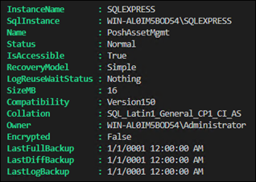
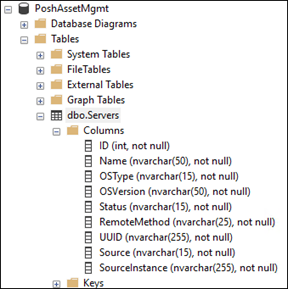
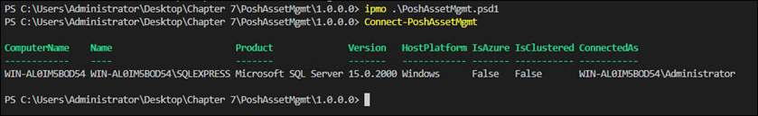
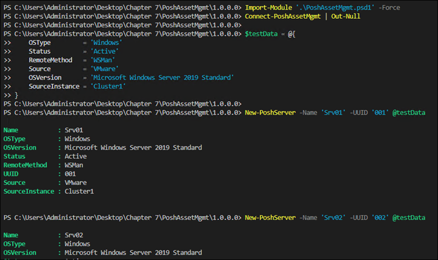
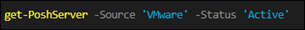
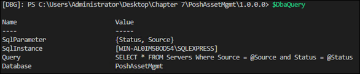
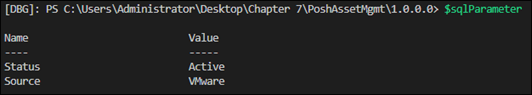
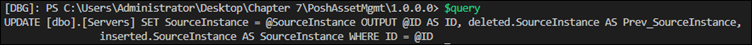
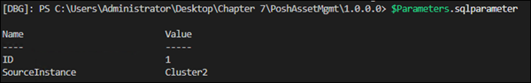

# Chapter 7 - Working with SQL

This chapter covers
- Building SQL databases and tables
- Inserting and updating data
- Retrieving data
- Using data validation before writing to SQL

In the previous chapter, the author used JSON files as a data source for driving automation. This is fine when the data is static, and you have tight control over who can update it.  However, when multiple people are working with data, you should be using a database.

When starting this chapter, the author advises to run a local instance of Microsoft SQL Server. The script [SQLExpressInstall.ps1](Helper%20Scripts/SQLExpressInstall.ps1) will download tools and set up a local instance of SQL Server for you. The script also installs a number of tools, including PowerShell, Git, VS Code, and the dbatools PowerShell module.

After setup, run the following code to create the `PoshAssetMgmt` database:
```powershell
$SqlInstance = "$($env:COMPUTERNAME)\SQLEXPRESS"
$DatabaseName = 'PoshAssetMgmt'
$DbaDatabase = @{
    SqlInstance   = $SqlInstance
    Name          = $DatabaseName
    RecoveryModel = 'Simple'
}
New-DbaDatabase @DbaDatabase
```
Here's an example of the output:


## 7.1 - Setting Your Schema
The schema for this chapter is based on asset management for virtual machines. Some of the columns considered are
- Identity - automatically populated by the database
- Name - the name of the asset
- OS Type - Linux or Windows
- OS Version
- Status - in service, being repaired, retired
- Remote Method - SSH, WSMan, Power CLI
- UUID - The unique identifier from the source systems
- Source - Hyper-V, VMware, Azure, AWS
- Source Instance - vSphere cluster, Azure subscription

### 7.1.1 - Data Types
When building your table schema, you need to consider data types. The string data type is an important consideration because SQL has a number of them.  The most common one used is the `nvarchar` type. When you declare a `nvarchar`, you need to set a maximum character length.  

Here is the map of the data types that will be used:  

| Name | Type | MaxLength | Nullable | Identity |
| - | - | - | - | - | 
ID | int | N/A | No | Yes |
Name | nvarchar | 50 | No | No |
OSType | nvarchar | 15 | No | No |
OSVersion | nvarchar | 50 | No | No |
Status | nvarchar | 15 | No | No |
RemoteMethod | nvarchar | 25 | No | No |
UUID | nvarchar | 255 | No | No |
Source | nvarchar | 15 | No | No |
SourceInstance | nvarchar | 255 | No | No |

The following script crates the `Servers` table using the column mapping defined above:  
```powershell
$SqlInstance = "$($env:COMPUTERNAME)\SQLEXPRESS"
$DatabaseName = 'PoshAssetMgmt'
$ServersTable = 'Servers'
$ServersColumns = @(
    @{Name = 'ID';
        Type = 'int'; MaxLength = $null;
        Nullable = $false; Identity = $true;
    }
    @{Name = 'Name';
        Type = 'nvarchar'; MaxLength = 50;
        Nullable = $false; Identity = $false;
    }
    @{Name = 'OSType';
        Type = 'nvarchar'; MaxLength = 15;
        Nullable = $false; Identity = $false;
    }
    @{Name = 'OSVersion';
        Type = 'nvarchar'; MaxLength = 50;
        Nullable = $false; Identity = $false;
    }
    @{Name = 'Status';
        Type = 'nvarchar'; MaxLength = 15;
        Nullable = $false; Identity = $false;
    }
    @{Name = 'RemoteMethod';
        Type = 'nvarchar'; MaxLength = 25;
        Nullable = $false; Identity = $false;
    }
    @{Name = 'UUID';
        Type = 'nvarchar'; MaxLength = 255;
        Nullable = $false; Identity = $false;
    }
    @{Name = 'Source';
        Type = 'nvarchar'; MaxLength = 15;
        Nullable = $false; Identity = $false;
    }
    @{Name = 'SourceInstance';
        Type = 'nvarchar'; MaxLength = 255;
        Nullable = $false; Identity = $false;
    }
)
$DbaDbTable = @{
    SqlInstance = $SqlInstance
    Database    = $DatabaseName
    Name        = $ServersTable
    ColumnMap   = $ServersColumns
}
New-DbaDbTable @DbaDbTable
```
The script doesn't give you any useful output on the table columns, but you can use SQL Server Management Studio to confirm column creation:  



## 7.2 - Connecting to SQL (Setting Up Custom PowerShell Object)
Throughout this chapter, you will make numerous calls to the SQL instance and database.  The author recommends storing these parameters as variables in the module's .psm1 file for ease of reuse.

The author uses a naming convention for module-scoped variables that starts with an underscore, e.g. `$_PoshAssetMgmt`.

For SQL connection information, the author recommends using a single PowerShell object with properties for the SQL instance. All of this code will be put in a module called `PoshAssetMgmt`. To create this module, use the [New-ModuleTemplate](scripts/Listing%2003%20-%20Creating%20the%20PoshAssetMgmt%20module.ps1) script.  This script creates a module folder structure with blank .psm1 and .ps1 files.

```powershell
# Listing 3 - Creating the PoshAssetMgmt module
Function New-ModuleTemplate {
    [CmdletBinding()]
    [OutputType()]
    param(
        [Parameter(Mandatory = $true)]
        [string]$ModuleName,
        [Parameter(Mandatory = $true)]
        [string]$ModuleVersion,
        [Parameter(Mandatory = $true)]
        [string]$Author,
        [Parameter(Mandatory = $true)]
        [string]$PSVersion,
        [Parameter(Mandatory = $false)]
        [string[]]$Functions
    )
    $ModulePath = Join-Path .\ "$($ModuleName)\$($ModuleVersion)"
    New-Item -Path $ModulePath -ItemType Directory
    Set-Location $ModulePath
    New-Item -Path .\Public -ItemType Directory

    $ManifestParameters = @{
        ModuleVersion     = $ModuleVersion
        Author            = $Author
        Path              = ".\$($ModuleName).psd1"
        RootModule        = ".\$($ModuleName).psm1"
        PowerShellVersion = $PSVersion
    }
    New-ModuleManifest @ManifestParameters

    $File = @{
        Path     = ".\$($ModuleName).psm1"
        Encoding = 'utf8'
    }
    Out-File @File

    $Functions | ForEach-Object {
        Out-File -Path ".\Public\$($_).ps1" -Encoding utf8
    }
}

# Set the parameters to pass to the function
$module = @{
    # The name of your module
    ModuleName    = 'PoshAssetMgmt'
    # The version of your module
    ModuleVersion = "1.0.0.0"
    # Your name
    Author        = "YourNameHere"
    # The minimum PowerShell version this module supports
    PSVersion     = '7.1'
    # The functions to create blank files for in the Public folder
    Functions     = 'Connect-PoshAssetMgmt',
    'New-PoshServer', 'Get-PoshServer', 'Set-PoshServer'
}
# Execute the function to create the new module
New-ModuleTemplate @module
```

In the next step you populate the .psm1 module file with a custom object for the SQL connection. You also specify a section for required modules, in this case the `dbatools` module. 

```powershell
# Listing 4 - PoshAssetMgmt.psm1
$_PoshAssetMgmt = [pscustomobject]@{
    SqlInstance  = 'YourSqlSrv\SQLEXPRESS'
    Database     = 'PoshAssetMgmt'
    ServerTable  = 'Servers'
}
 
$Path = Join-Path $PSScriptRoot 'Public'
$Functions = Get-ChildItem -Path $Path -Filter '*.ps1'
 
Foreach ($import in $Functions) {
    Try {
        Write-Verbose "dot-sourcing file '$($import.fullname)'"
        . $import.fullname
    }
    Catch {
        Write-Error -Message "Failed to import function $($import.name)"
    }
}
 
[System.Collections.Generic.List[PSObject]]$RequiredModules = @()
$RequiredModules.Add([pscustomobject]@{
    Name = 'dbatools'
    Version = '1.1.5'
})
 
foreach($module in $RequiredModules){
    $Check = Get-Module $module.Name -ListAvailable
 
    if(-not $check){
        throw "Module $($module.Name) not found"
    }
 
    $VersionCheck = $Check |
        Where-Object{ $_.Version -ge $module.Version }
 
    if(-not $VersionCheck){
        Write-Error "Module $($module.Name) running older version"
    }
 
    Import-Module -Name $module.Name
}
```

### 7.2.1 - Permissions (and Variable Scope)  
Commands in the `dbatools` module run as the logged-in user if no other credentials are supplied. To run as a different user, you use `Connect-DbaInstance`, which sets a default connection for all other functions to use.

The author guides you through building the `Connect-PoshAssetMgmt` cmdlet, which calls `Connect-DbaInstance`, allowing you to pass parameters for the SQL connection, including SQL instance, database, and credentials. If the SQL instance is not provided, then the cmdlet will use the default values set in the `$_PoshAssetMgmt` variable.

You don't want to pass the connection to every function, so to avoid doing this you save the connection information into a variable that other functions can reference, similar to the `$_PoshAssetMgmt` variable. The only difference is this variable is placed inside of the function instead of in the .psm1 file. To account for scope, this variable is set to operate at the script level by adding `script:` to the variable name. This allows for all other functions in the module to read that variable. In the example below, see `$Script:_SQLInstance`:

```powershell
# Listing 5 - Connect-PoshAssetMgmt
# Note usage of script-level variable, allowing other functions to use the connection.
Function Connect-PoshAssetMgmt {
    [CmdletBinding()]
    [OutputType([object])]
    param(
        [Parameter(Mandatory = $false)]
        [string]$SqlInstance = $_PoshAssetMgmt.SqlInstance,

        [Parameter(Mandatory = $false)]
        [string]$Database = $_PoshAssetMgmt.Database,

        [Parameter(Mandatory = $false)]
        [PSCredential]$Credential
    )

    # Set default connection parameters
    $connection = @{
        SqlInstance = $SqlInstance
        Database    = $Database
    }

    # Add credential object if passed
    if ($Credential) {
        $connection.Add('SqlCredential', $Credential)
    }

    $Script:_SqlInstance = Connect-DbaInstance @connection

    # Output the result so the person running it can confirm the connection information
    $Script:_SqlInstance
}
```
Here's a look at the output:  


## 7.3 - Adding Data To a Table
This section focuses on importing data into a SQL table. You create a new function `New-PoshServer` that uses the `Write-DbaDataTable` cmdlet to add an entry to the `Servers` SQL table.

You import the data by mapping parameters for `New-PoshServer` to the table columns. However, given that you're dealing with SQL, it is important that you use parameter validation.

### 7.3.1-2 - String Validation and Writing Data to a Table
The following script uses several parameter validation techniques, including validating string length, validating a set, and using the `Mandatory` option to enforce a value. The script takes these values and writes data to a table.

Use the `dbatools` cmdlet `Write-DbaDataTable` to write data to a SQL table. No SQL commands required.

```powershell
# Listing 6 - New-PoshServer
Function New-PoshServer {
    [CmdletBinding()]
    [OutputType([object])]
    param(
        # Validate server name is less than or equal to 50 characters.
        [Parameter(Mandatory = $true)]
        [ValidateScript( { $_.Length -le 50 })]
        [string]$Name,

        # Validate that the OSType is one of the predefined values.
        [Parameter(Mandatory = $true)]
        [ValidateSet('Windows', 'Linux')]
        [string]$OSType,

        # Validate OSVersion is less than or equal to 50 characters.
        [Parameter(Mandatory = $true)]
        [ValidateScript( { $_.Length -le 50 })]
        [string]$OSVersion,

        # Validate that the Status is one of the predefined values.
        [Parameter(Mandatory = $true)]
        [ValidateSet('Active', 'Depot', 'Retired')]
        [string]$Status,

        # Validate that the RemoteMethod is one of the predefined values.
        [Parameter(Mandatory = $true)]
        [ValidateSet('WSMan', 'SSH', 'PowerCLI', 'HyperV', 'AzureRemote')]
        [string]$RemoteMethod,

        # Validate the UUID is less than or equal to 255 characters
        [Parameter(Mandatory = $false)]
        [ValidateScript( { $_.Length -le 255 })]
        [string]$UUID,

        # Validate that the Source is one of the predefined values.
        [Parameter(Mandatory = $true)]
        [ValidateSet('Physical', 'VMware', 'Hyper-V', 'Azure', 'AWS')]
        [string]$Source,

        # Validate the SourceInstance is less than or equal to 255 characters
        [Parameter(Mandatory = $false)]
        [ValidateScript( { $_.Length -le 255 })]
        [string]$SourceInstance
    )

    # Build the data mapping for the SQL columns
    $Data = [pscustomobject]@{
        Name           = $Name
        OSType         = $OSType
        OSVersion      = $OSVersion
        Status         = $Status
        RemoteMethod   = $RemoteMethod
        UUID           = $UUID
        Source         = $Source
        SourceInstance = $SourceInstance
    }

    # Write the data to the table
    $DbaDataTable = @{
        SqlInstance = $_SqlInstance
        Database    = $_PoshAssetMgmt.Database
        InputObject = $Data
        Table       = $_PoshAssetMgmt.ServerTable
    }
    Write-DbaDataTable @DbaDataTable

    # Since Write-DbaDataTable doesn't have any output the data object so you know which ones where added.
    Write-Output $Data


}
```
Here's a look at the resulting output:  


And here's a look at the resulting data in SQL:  
  

## 7.4 - Getting Data From a Table
The `Invoke-DbaQuery` cmdlet from `dbatools` returns the results of a T-SQL query to PowerShell. Here's an example on how to use it:

```powershell
$DbaQuery = @{
    SqlInstance = "$($env:COMPUTERNAME)\SQLEXPRESS"
    Database = 'PoshAssetMgmt'
    Query = 'SELECT * FROM Servers'
}
Invoke-DbaQuery @DbaQuery
```

### 7.4.1 - SQL Where Clause (Filtering Results)
As tables get large, it is important to be able to filter the results before they get returned to PowerShell. You can filter results in a SQL statement using the `WHERE` clause:
```SQL
SELECT * FROM Servers WHERE Name = 'Srv01'
```
To make this query dynamic, use a SQL variable in your query.  A SQL variable is denoted by the (@) symbol. The `Invoke-DbaQuery` cmdlet has the `-SqlParameter` argument you can use to pass a value to the SQL variable:
```powershell
$DbaQuery = @{
    SqlInstance = "$($env:COMPUTERNAME)\SQLEXPRESS"
    Database = 'PoshAssetMgmt'
    Query = 'SELECT * FROM Servers WHERE Name = @name'
    SqlParameter = @{name = 'Srv01'}
}
Invoke-DbaQuery @DbaQuery
```
The following function performs a database query with options for pulling specific fields from the database using the SQL `WHERE` clause. 
```powershell
# Listing 7 - Get-PoshServer
Function Get-PoshServer {
    [CmdletBinding()]
    [OutputType([object])]
    param(
        [Parameter(Mandatory = $false)]
        [int]$ID,
        
        [Parameter(Mandatory = $false)]
        [string]$Name,

        [Parameter(Mandatory = $false)]
        [string]$OSType,

        [Parameter(Mandatory = $false)]
        [string]$OSVersion,

        [Parameter(Mandatory = $false)]
        [string]$Status,

        [Parameter(Mandatory = $false)]
        [string]$RemoteMethod,

        [Parameter(Mandatory = $false)]
        [string]$UUID,

        [Parameter(Mandatory = $false)]
        [string]$Source,

        [Parameter(Mandatory = $false)]
        [string]$SourceInstance
    )
    
    [System.Collections.Generic.List[string]] $where = @()
    $SqlParameter = @{}
    # Loop through each item in the $PSBoundParameters to create the where clause while filtering out common parameters
    $PSBoundParameters.GetEnumerator() | 
    Where-Object { $_.Key -notin 
        [System.Management.Automation.Cmdlet]::CommonParameters } |
    ForEach-Object {
        $where.Add("$($_.Key) = @$($_.Key)")
        $SqlParameter.Add($_.Key, $_.Value)
    }
    
    # Set the default query
    $Query = "SELECT * FROM " +
        $_PoshAssetMgmt.ServerTable
    
    # If where clause is needed, add it to the query
    if ($where.Count -gt 0) {
        $Query += " Where " + ($where -join (' and '))
    }

    Write-Verbose $Query

    $DbaQuery = @{
        SqlInstance  = $_SqlInstance
        Database     = $_PoshAssetMgmt.Database
        Query        = $Query
        SqlParameter = $SqlParameter
    }

    # Execute the query and output the results
    Invoke-DbaQuery @DbaQuery
}
```
The SQL `WHERE` query is built dynamically based on the parameters specified. So if the parameters specified look like the following:   

  

Then the resulting DBA query looks like:  

  

Where the SQL parameters are:

  

## 7.5 - Updating Records 
Just like the function in the previous section uses `Invoke-DbaQuery` to retrieve data, you can use `Invoke-DbaQuery` to update data. 

Here's a SQL query that updates the `Source` field for a record with an `ID` value:
```SQL
UPDATE [dbo].[Server]
SET Source = @Source 
OUTPUT @ID AS ID, deleted.Source AS Prev_Source, 
    inserted.Source AS Source 
WHERE ID = @ID
```

The following function utilizes this SQL query to update SQL data:  
```powershell
# Listing 8 - Set-PoshServer
Function Set-PoshServer {
    [CmdletBinding()]
    [OutputType([object])]
    param
    (
        [Parameter(ValueFromPipeline = $true, 
            ParameterSetName = "Pipeline")]
        [object]$InputObject,
        [Parameter(Mandatory = $true, 
            ParameterSetName = "ID")]
        [int]$ID,

        [Parameter(Mandatory = $false)]
        [ValidateScript( { $_.Length -le 50 })]
        [string]$Name,
        
        [Parameter(Mandatory = $false)]
        [ValidateSet('Windows', 'Linux')]
        [string]$OSType,
        
        [Parameter(Mandatory = $false)]
        [ValidateScript( { $_.Length -le 50 })]
        [string]$OSVersion,
        
        [Parameter(Mandatory = $false)]
        [ValidateSet('Active', 'Depot', 'Retired')]
        [string]$Status,
        
        [Parameter(Mandatory = $false)]
        [ValidateSet('WSMan', 'SSH', 'PowerCLI', 'HyperV', 'AzureRemote')]
        [string]$RemoteMethod,
        
        [Parameter(Mandatory = $false)]
        [ValidateScript( { $_.Length -le 255 })]
        [string]$UUID,
        
        [Parameter(Mandatory = $false)]
        [ValidateSet('Physical', 'VMware', 'Hyper-V', 'Azure', 'AWS')]
        [string]$Source,
        
        [Parameter(Mandatory = $false)]
        [ValidateScript( { $_.Length -le 255 })]
        [string]$SourceInstance
    )
    begin {
        [System.Collections.Generic.List[object]] $Return = @()
        [System.Collections.Generic.List[string]] $Set = @()
        [System.Collections.Generic.List[string]] $Output = @()
        # Create the SQL Parameters hashtable to hold the values for the SQL variables, starting with a null value for the ID
        $SqlParameter = @{ID = $null}
        
        # Loop through each item in the $PSBoundParameters to create the where clause while filtering out common parameters and the ID and InputObject parameters.
        $PSBoundParameters.GetEnumerator() | 
        Where-Object { $_.Key -notin @('ID', 'InputObject') +
            [System.Management.Automation.Cmdlet]::CommonParameters  } |
        ForEach-Object {
            # Add parameters other than the ID or InputObject to the Set clause array and SqlParameters.
            $set.Add("$($_.Key) = @$($_.Key)")
            $Output.Add("deleted.$($_.Key) AS Prev_$($_.Key), 
                inserted.$($_.Key) AS $($_.Key)")
            $SqlParameter.Add($_.Key, $_.Value)
        }
        
        # Set the query with the output of the changed items
        $query = 'UPDATE [dbo].' +
        "[$($_PoshAssetMgmt.ServerTable)] " +
        'SET ' + 
        ($set -join (', ')) +
        ' OUTPUT @ID AS ID, ' +
        ($Output -join (', ')) +
        ' WHERE ID = @ID'

        Write-Verbose $query

        # Set the parameters for the database update command
        $Parameters = @{
            SqlInstance  = $_SqlInstance
            Database     = $_PoshAssetMgmt.Database
            Query        = $query
            SqlParameter = @{}
        }

        # If the ID was passed, check that it matches an existing server
        if ($PSCmdlet.ParameterSetName -eq 'ID') {
            $InputObject = Get-PoshServer -Id $Id
            if (-not $InputObject) {
                throw "No server object was found for id '$Id'"
            }
        }
    }
    process {
        # Update the ID for this InputObject
        $SqlParameter['ID'] = $InputObject.ID
       
        # Update SQL parameters and execute the update
        $Parameters['SqlParameter'] = $SqlParameter
        Invoke-DbaQuery @Parameters | ForEach-Object { $Return.Add($_) }
    }
    end {
        # Return the changes
        $Return
    }
}
```
Here's an analysis of the function when running the following command:  


The function evaluates each supplied parameter and determines which parameters need to become part of the SQL query. Here's what the SQL query looks like:

  

The function then makes a call to retrieve objects from SQL with `SourceInstance = 'Cluster1'` and uses the following query to update values:  

  

All of this information is stored in one variable and then passed internally to `Invoke-DbaQuery`:  

  
