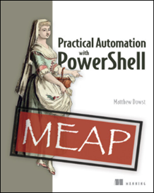

# Practical Automation with PowerShell
The book "Practical Automation with PowerShell", written by [Matthew Dowst](https://github.com/mdowst), is available for early access from [Manning](https://www.manning.com/books/practical-automation-with-powershell). This repository is a collection of scripts and notes from this book.

## Table of Contents

- [ ] Chapter 1 - PowerShell Automation
- [ ] Chapter 2 - Get Started Automating
- [ ] Chapter 3 - Scheduling Automation Scripts
- [ ] Chapter 4 - Handling Sensitive Data
- [ ] Chapter 5 - PowerShell Remote Execution
- [x] [Chapter 6 - Making Adaptable Automations](ch6-making-adaptable-automations/index.md)
- [x] [Chapter 7 - Working with SQL](ch7-working-with-sql/index.md)
- [x] [Chapter 8 - Cloud-Based Automation](ch8-azure-automation/index.md)
- [ ] Chapter 9 - Working Outside of PowerShell
- [ ] Chapter 10 - Automation Coding Best Practices
- [ ] Chapter 11 - Sharing Scripts Among a Team
- [ ] Chapter 12 - End User Scripts and Forms
- [ ] Chapter 13 - Testing Your Scripts
- [ ] Chapter 14 - Maintaining Your Code