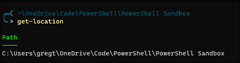
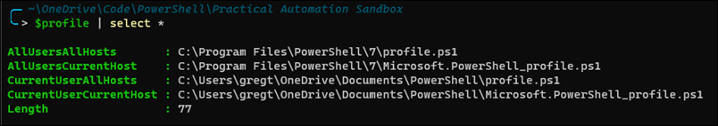

## PowerShell Prompt
See below for the code I use for my custom PowerShell prompt. The prompt looks similar to this pic:  


Place the code below in your PowerShell profile. Use `$profile | select *` to view possible the profile paths. Since I use the same profile across multiple hosts, e.g. Windows Terminal and VS Code, I place my code in the `CurrentUserAllHosts` profile, i.e. `profile.ps1`.



Windows PowerShell and PowerShell each have their own profile paths, so you'll need to maintain a profile file for each PowerShell edition.


**My PowerShell Profile Prompt**

```powershell
function prompt { 
    
    # See here for list of ANSI escape references: 
    # https://gist.github.com/fnky/458719343aabd01cfb17a3a4f7296797
    # https://en.wikipedia.org/wiki/ANSI_escape_code

    $ESC = [char]0x1b           # Define the escape character used for specifying colors and styles
    # Prompt starts here
    "`n" +                      # New line
    "$ESC[38;2;0;179;226m" +    # Set foreground color (38) using rgb mode (2) with rgb colors (0, 179, 226) 
    $([char]0x256d) +           # The '╭' character, i.e. Box Drawings Light Arc Down and Right
    $([char]0x2500) +           # The '─' character, i.e. Box Drawings Light Horizontal
    "( " + 
    "$ESC[3m" +                 # Start italic mode
    "$ESC[2m" +                 # Start dim/faint mode
    $(GetPromptPath) +
    "$ESC[22m" +                # Reset dim/faint mode 
    "$ESC[23m" +                # Reset italic mode
    "`n" +                      
    $([char]0x2570) +           # The '╰' character, i.e. Box Drawings Light Arc Up and Right
    $([char]0x2574) +           # The '─' character, i.e. Box Drawings Light Right
    "$ESC[0m" +                 # Reset all modes (styles and colors)
    $(
        if (Test-Path variable:/PSDebugContext) { '[DBG]: ' } else { '' }
    ) +   
    $(
        if ($NestedPromptLevel -ge 1) { '>>' }
    ) + 
    '> '
}

function GetPromptPath {
    $location = "$(Get-Location)"
    
    # Get rid of trailing slash except for 'C:\'.  For example, HKLM:\...\ has a trailing slash
    if ($location.EndsWith('\') -and -not $location.EndsWith(':\')) {
        $location = $location.TrimEnd('\')
    }

    $userProfilePath = $env:USERPROFILE
    if ($location.Contains($userProfilePath)) {
        if ($location.Equals($userProfilePath)) {
            $promptPath = '~'
        } else {
            # The -split operator uses regex. Since the string has a regex escape character, '\', you must replace
            # each '\' with a '\\' (second part of the -replace function). The first part of the replace function
            # searches for any single instance of '\', using '\\' as an escape sequence.  The -split function
            # returns an array of two elements.  The first element is blank. The second element, [1], has the 
            # string we need. 
            $relativelocation = ($location -split ($userProfilePath -replace('\\','\\')))[1]

            if ($relativelocation.Length -le 50) {
                $promptPath = "~" + $relativelocation
            } else {
                $matches = [regex]::matches($relativelocation, '\\')
                switch ($matches.count) {
                    # Display full relative for given range of matches
                    {$_ -in 1..4} {
                        $promptPath = "~" + $relativelocation
                        break
                    }
                    # Path is long, so break up the relative path with '...' in the middle. 
                    # Left portion of the path keeps first n+1 folders
                    # Right portion of the path keeps the last n folders
                    default {
                        $leftPath = $relativelocation.Substring(0,$matches[2].index)
                        $rightPath = $relativelocation.Substring($matches[$matches.count-2].index)
                        $promptPath = "~" + $leftPath + '\...' + $rightPath
                    }
                }
            }
        }
    } else {
        # Build prompt path for locations outside of user profile path, e.g. 'C:\Windows\System32'
        $matches = [regex]::matches($location, '\\')
        switch ($matches.count) {
            {$_ -in 1..4} {
                $promptPath = $location
                break
            }
            default {
                $leftPath = $location.Substring(0,$matches[2].index)
                $rightPath = $location.Substring($matches[$_-2].index)
                $promptPath = $leftPath + '\...' + $rightPath
            }
        }
    }
    $promptPath
}
```